# Getting started with Git and Github

### Git Basics

- Git was invented by Linus Torvalds.

#### Version Control System

- Version Control System (VCS) is a software that helps software developers to work together and maintain a complete history of their work.
- **Functions of a VCS:**
  - Allows developers to work simultaneously.
  - Does not allow overwriting each other’s changes.
  - Maintains a history of every version.
- **Types of VCS:**
  1. Centralized version control system (CVCS).
  2. Distributed/Decentralized version control system (DVCS).

###### Centralized version control system (CVCS).

- CVCS uses a central server to store all files and enables team collaboration.
- But the major drawback is its single point of failure, i.e., failure of the central server.

###### Distributed/Decentralized version control system (DVCS)

- DVCS clients not only check out the latest snapshot of the directory but they also fully mirror the repository. 
- If the server goes down, then the repository from any client can be copied back to the server to restore it. 
- **Every checkout is a full backup of the repository.** 
- Git does not rely on the central server and that is why we can perform many operations even when we are offline. 
- we can commit changes, create branches, view logs, and perform other operations when we are offline.
- We require network connection only to publish our changes and take the latest changes.


#### Advantages of Git

* Free and open source
* Fast and small
* Implicit backup
* Security
* No need of powerful hardware
* Easier branching

#### Git Terminologies

###### Local Repository:

Git provides a private copy of the whole repository. Users can perform many operations with this repository such as add file, remove file, rename file, move file, commit changes, and many more.

###### Working Directory and Staging Area:

The working directory is the place where files are checked out.Git doesn’t track each and every modified file. Whenever a commit operation is performed, Git looks for the files present in the staging area. Only those files present in the staging area are considered for commit and not all the modified files.

###### Commits:

Commit holds the current state of the repository. A commit is named by SHA1 hash value. We can consider a commit object as a node of the linked list. Every commit object has a pointer to the parent commit object. From a given commit, we can traverse back by looking at the parent pointer to view the history of the commit. If a commit has multiple parent commits, then that particular commit has been created by merging two branches.

###### Branches:

Branches are used to create another line of development. By default, Git has a **master branch**. Usually, a branch is created to work on a new feature. Once the feature is completed, it is merged back with the master branch and we delete the branch. Every branch is referenced by **HEAD**, which points to the latest commit in the branch. Whenever we make a commit, HEAD is updated with the latest commit.

###### Tags:

Tag assigns a meaningful name with a specific version in the repository. Tags are very similar to branches, but the difference is that tags are immutable. It means, tag is a branch, which nobody intends to modify. Once a tag is created for a particular commit, even if we create a new commit, it will not be updated. Usually, tags are created for product releases.

###### Clone:

Clone operation creates the instance of the repository. Clone operation not only checks out the working copy, but it also mirrors the complete repository. Users can perform many operations with this local repository. The only time networking gets involved is when the repository instances are being synchronized.

###### Pull:

Pull operation copies the changes from a remote repository instance to a local one. It is used for synchronization between two repository instances.

###### Push:

Push operation copies changes from a local repository instance to a remote one. This is used to store the changes permanently into the Git repository.

###### HEAD:

HEAD is a pointer, which always points to the latest commit in the branch. Whenever we make a commit, HEAD is updated with the latest commit. The heads of the branches are stored in `.git/refs/heads/` directory.

```
$ cat .git/refs/heads/master
570837e7d58fa4bccd86cb575d884502188b0c49
```

###### Revision:

Revision represents the version of the source code. Revisions in Git are represented by commits.


<br>

## Git Installation

#### MAC

Install Homebrew and then install git using it

```
$ /usr/bin/ruby -e "$(curl -fsSL https://raw.githubusercontent.com/Homebrew/install/master/install)"
$ brew install git
```

#### Linux

Debian Systems

```
$ sudo apt-get install git
```

Red Hat Systems

```
$ sudo yum install git
```

#### Windows

Download Git from [http://gitforwindows.org/](http://gitforwindows.org/) and install it.


<br>


## Git Configuration

###### Setting username

```
$ git config --global user.name "Astik Anand"
```

###### Setting email id

```
$ git config --global user.email "astikanand@gmail.com"
```

###### Avoid merge commits for pulling

```
$ git config --global branch.autosetuprebase always
```

Git stores all global configurations in `.gitconfig` file, which is located in the home directory.

```
$ cat .gitconfig
```

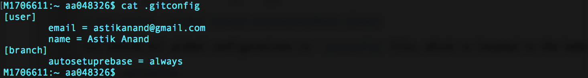

 

###### List Git settings

```
$ git config --list
```

#### Adding SSH Key

**Generate Public/Private RSA Key Pair**

```
$ ssh-keygen
```

This will create a `.ssh` directory inside the home directory.

**ssh-keygen** has generated two keys, first one is private (i.e., `id_rsa`) and the second one is public (i.e., `id_rsa.pub`).

 

**Note:** Never share your PRIVATE KEY with others.

**Adding Keys to authorized_keys**

```
$ pbcopy < ~/.ssh/id_rsa.pub
```

* Once the key is copied to clipboard. Open the [github](http://github.com) website.
* In the upper-right corner of any page, click your profile photo, then click **Settings**.
* In the user settings sidebar, click S**SH and GPG keys**.
* Click **New SSH key** or **Add SSH key**. Give the title, paste the code and click **Add SSH key**.
* If prompted, confirm your GitHub password.


Now the configuration and setup is complete.


<br>

## Git Work Flow 

General workflow is as follows:

* Clone the Git repository as a working copy.
* Modify the working copy by **adding/editing** files.
* If necessary, update the working copy by taking other developer's changes.
* Review the changes before commit.
* Commit changes and if everything is fine, push the changes to the remote repository.
* After committing, if something went wrong, then correct the last commit and push the changes to the remote repository.

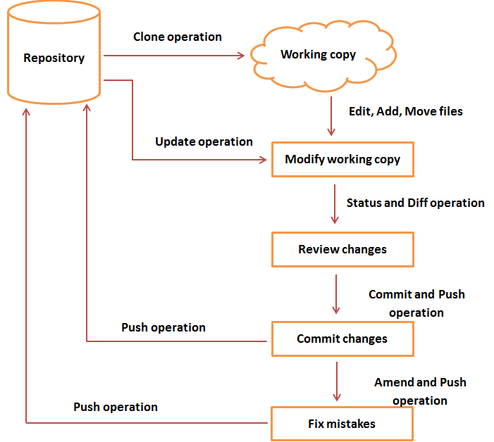

 


<br>

## Create/Clone a repository

**Initialize a new git repository:**
Go inside an existing directory or else simply create a new project directory.

```
$ mkdir my_project
$ cd my_project
```

Make this a git repository

```
$ git init
```

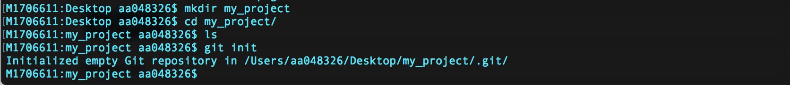 

Create `README.md` file by below command, write about the project and hit **CTRL+D** to save.

```
$ cat > README.md
```


See the **status** of repository now.

```
$ git status
```


Add it to **staging area** and see the status again.

```
$ git add README.md
$ git status
```


To add all the files & folders at once use `$ git add --a`, to add all files and folders in current directory use `$ git add .` and to add multiple files and folders use `$ git add dir1/ dir2/ file1.txt`

Now, **commit** to local repository with appropriate **message**.

```
$ git commit -m "README added"
```

and check the status again.

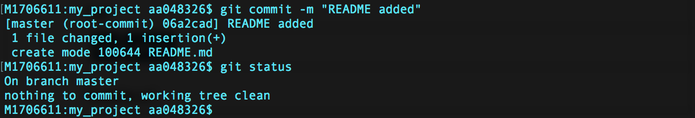


Now, we need to push the changes to a **remote repository**. For that we are going to make a remote repository on **GitHub** 


### Creating a remote repository on Github

Open [github.com](https://github.com/) and sign in to it and then create a **New repository**.

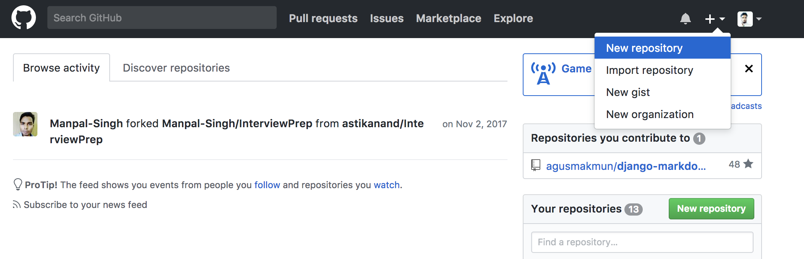

Now, enter the project name **my_project** give the Description(optional) and create.


Now, as github remote repository is created, **connect this remote repository** to our local repository.

```
$ git remote add origin https://github.com/astikanand/my_project.git
```

Now, **push local repository** changes to remote repository.

```
git push -u origin master
```

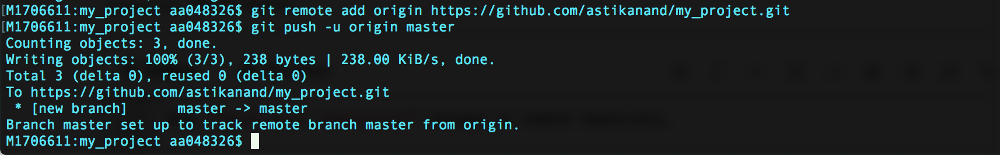 


**Clone an existing git repository:**
If there is existing git repository just clone it.

```
$ git clone https://github.com/astikanand/my_sproject
```

<br>

## Review Changes

Check log details using **git log** command

```
$ git log
```

 

View the commit details using **git show** command


Now, make some changes to the already commited `README` file. I am changing content from `This is a new project.` to `This is a github project.`

Reviews the changes by running the **git diff** command.

```
$ git diff
```


<br>

## Update Operation

When more than one person is working on a single repository on a single branch, and if person1 checksout the project and starts working on that and meanwhile another person2 has updated that repository by pushing his own changes. Then there will be conflicts when person1 tries to push his changes. `push will fail and changes will get rejected`.

Because Git identified that remote repository and perosn1's repository are not in sync. Because of this, he can lose the history of the project. To avoid this mess, Git failed this operation. Now, person1 has to first update the local repository and only thereafter, he can push his own changes later.

```
$ git pull
```

And if they were working on **same file** then there will be **merge conflicts** at time of pull and we need to resolve that manually.


## Stash Operation

Suppose we are implementing a new feature for our product. Our code is in progress and suddenly a customer escalation comes. Because of this, we have to keep aside our new feature work for a few hours.
So, we cannot commit our partial code and also cannot throw away our changes. So we need some temporary space, where we can store our partial changes and later on commit it.

In Git, the stash operation takes our modified tracked files, stages changes, and saves them on a stack of unfinished changes that we can reapply at any time.

Here we are creating a new file **new.txt** and adding it but not commiting.

```
$ cat > new.txt
$ git add new.txt
$ git status
```


It is showing that **new.txt** is to be commited. 

Now do **stash**, see the **stash list** and check status again

```
$ git stash
```

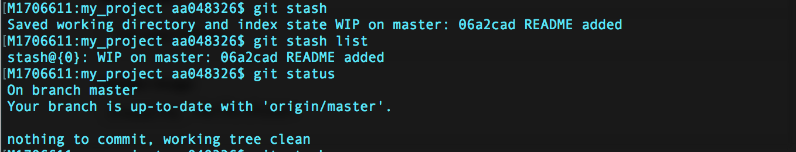

Now, once escalation part is done and we again want to work on that same feature just pop the stash frm stack and start working.

```
$ git stash pop
```

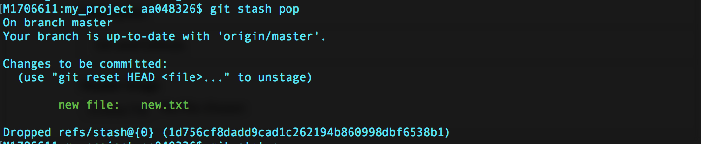 

and it again shows that **new.txt** is to be committed.


<br>

## Fixing Mistakes

If we accidentally did some changes to the local repository and then wants to undo these changes. In such cases, the revert operation plays an important role.

#### Revert Unstaged Changes

If we have modified a file but not added to the staging area and we want to revert back to original file use **checkout** command.

```
$ git checkout file_name.txt
```

Using this method we can also get the **deleted file**.

#### Revert Changes from Staging Area

If we have modified any file and moved it to staging arera using **git add** command and now we want to revert back we can do this using **checkout** command by paasing an extra parameter **HEAD** pointer.

```
$ git checkout HEAD -- file_name.txt
```

If we want to remove the file from staging area before commit.

```
$ git rm --cached file_name.txt
```

If we want to see the diffrences from staging area.

```
$ git diff --cached
```

#### Reset operation for changes committed


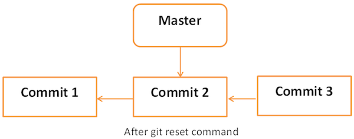


* **Soft Reset**
  Each branch has a HEAD pointer, which points to the latest commit. If we use Git reset command with `--soft` option followed by commit ID, then it will reset the HEAD pointer only without destroying anything.

`.git/refs/heads/master` file stores the commit ID of the HEAD pointer. We can verify it by using the **git log -1** command.

See the last 2 logs and content of HEAD.

```
$ cat .git/refs/heads/master
$ git log -2
```


Now let us reset HEAD.

```
$ git reset --soft HEAD~
$ git status
```

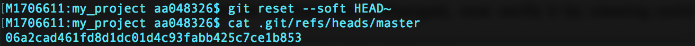
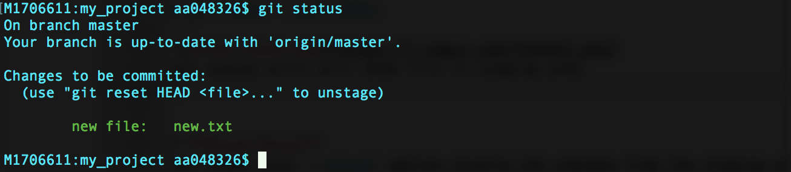

It still shows file in staging area.


* **Mixed Reset**
  Git reset with `--mixed` option reverts the changes from the staging area that have not been committed yet. It reverts the changes from the staging area only. The actual changes made to the working copy of the file are unaffected. This is default reset.


* **Hard Reset**
  If we use `--hard` option with the Git reset command, it will clear the staging area; it will reset the HEAD pointer to the latest commit of the specific commit ID and delete the local file changes too.

```
$ git reset --hard HEAD~2
```


## Git Branching

###### Create branch

```
$ git branch new_branch
```

###### See all branches

```
$ git branch
```

Branch with `*` shows the current branch.

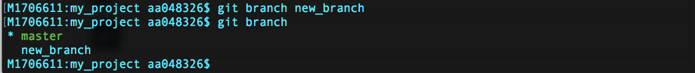 

###### Switch branch

```
$ git checkout new_branch
$ git branch
```

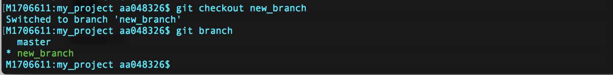

Shortcut to create and switch to new branch `$ git checkout -b another_branch`

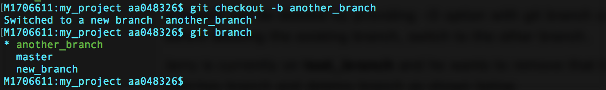

###### Delete Branch

Switch to another branch and before deleting.

```
$ git checkout master
$ git branch -D another_branch
$ git branch
```


###### Rename Branch

```
$ git branch -m new_branch test_branch
$ git branch
```


#### Merge branches

Switch to newly created branch, create a new file `test.txt` and then add and commit in that particular branch.

```
$ git checkout test_branch
$ git branch
$ cat > test.txt
$ git add test.txt
$ git commit -m "test file added"
$ git push --set-upstream origin test_branch
```

**Note:** `--set-upstream` needed only once for each newly created branch, therafter simply `$ git push` will work fine.


**After commit, the changes in new `test_branch` it will look something like below.**


**Switch to master branch and merge `test_branch` with the master now.**

```
$ git checkout master
$ git branch
$ git merge test_branch
```


**After merging the branches will look like below.**
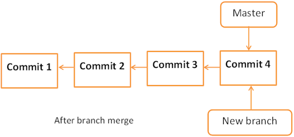


## Miscellaneous Concepts

#### Squashing git commits

Switch to the master branch and make sure everything is up to date.

```
$ git checkout master
$ git pull
```

Merge the new branch into the master branch.

```
$ git merge test_branch
```

Reset the master branch to origin's state.

```
$ git reset origin/master
```

Git now considers all changes as unstaged changes, we can add these changes as one commit.

```
$ git add --a
$ git commit -m "branching module completed"
```

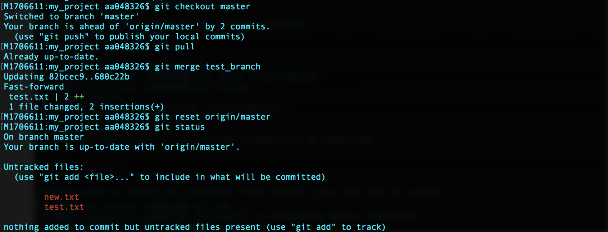
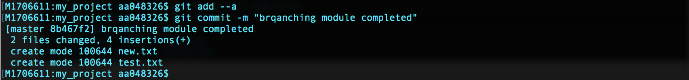


---

