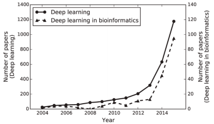
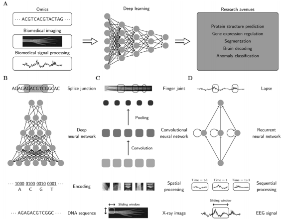

# Machine / Deep Learning for Biological Data Analysis

### Abstract

In the era of big data, transformation of biological big data into valuable knowledge has been one of the most important challenges in Biological Data Anlysis or  Bioinformatics. Deep learning has advanced rapidly since the early 2000s and now demonstrates state-of-the-art performance in various fields. Accordingly, application of Deep learning on biological data to gain insights from data has been emphasized in both academia and industry. To provide a useful and comprehensive perspective, I will try to categorize research in both the bioinformatics domain (i.e., omics, biomedical imaging, biomedical signal processing) and deep learning architecture (i.e., deep neural networks, convolutional neural networks, recurrent neural networks). 

**Keywords:** Machine Learning, Deep learning, Neural networks, Bioinformatics, Omics, Biomedical Imaging, Biomedical Signal Processing

### Introduction

- **Machine Learning:**

    Machine learning uses algorithms to parse data, learn from that data, and then apply what they’ve learned to make informed decisions.

    - Example:- If we had a flashlight that is turned on whenever someone said "it's dark", so it would recognize different phrases containing the word "dark" and will act upon.

- **Deep Learning:** 

    Deep learning is a subfield of machine learning, while both fall under the broad category of artificial intelligence, deep learning is what powers the most human-like artificial intelligence. It has networks capable of learning from unsupervised data that is unstructured or unlabeled. It is also known as deep neural learning or deep neural network.

- **Machine Learning vs. Deep Learning:**

    - Basic machine learning models do become progressively better at whatever their function is, but they still need some guidance. If an ML algorithm returns an inaccurate prediction, then an engineer needs to step in and make adjustments. But with a deep learning model, the algorithms can determine on their own if a prediction is accurate or not.
    - Flashlight example: Programmed to turn on when it recognizes the audible cue of someone saying the word "dark". Eventually, it could pick up any phrase containing that word. Now if the flashlight had a deep learning model, it may figure out that it should also turn on with the cues "I can't see" or "the light switch won't work".
    - A deep learning model is able to learn through its own method of computing – its own "brain" or neurons or neural networks.

- **Biological Data Analysis / Bioinformatics:**

    - It is a field devoted to the interpretation and analysis of biological data using computational techniques.

### Motivation

In the era of "big data", transformation of large quantities of data into valuable knowledge has become increasingly important in various domains, and bioinformatics is no exception. Significant amounts of biomedical data, including omics, image, and signal data, have been
accumulated, and the resulting potential for applications in biological and healthcare research has caught the attention of both industry and academia.  For instance, IBM developed Watson for Oncology, a platform analyzing patients' medical information and assisting clinicians with 
treatment options. Google DeepMind, having achieved great success with AlphaGo in the game of Go, recently launched DeepMind Health to develop effective healthcare technologies.

To extract knowledge from big data in bioinformatics, machine learning has been a widely used and successful methodology. Machine learning algorithms use training data to uncover underlying patterns, build models, and make predictions based on the best fit model. Indeed, some well-known algorithms (i.e., support vector machines, random forests, hidden Markov models, Bayesian networks, Gaussian networks) have been applied in genomics, proteomics, systems biology, and numerous other domains.

The proper performance of conventional machine learning algorithms relies heavily on data representations called features. However, features are typically designed by human engineers with extensive domain expertise, and identifying which features are more appropriate
for the given task remains difficult. Deep learning, a branch of machine learning, has recently emerged based on big data, the power of parallel and distributed computing, and sophisticated algorithms. Deep learning has overcome previous limitations, and academic interest has increased rapidly since the early 2000s. Furthermore deep learning is responsible for major advances in diverse fields where the artificial intelligence community has struggled for many years. One of the most important advancements thus far has been in image and speech recognition, although promising results have been disseminated in natural language processing and language translation.

**Certainly, bioinformatics can also benefit from deep learning. Splice junctions can be discovered from DNA finger joints which can be recognized from X-ray images, lapses can be detected from electroencephalography (EEG) signals, and so on.** 

### Scope of Research

**Changing the black-box into the white-box:** A main criticism against deep learning is that it is used as a black-box, even though it produces outstanding results, we know very little about how such results are derived internally. In bioinformatics, particularly in biomedical domains, it is not enough to simply produce good outcomes. Since many studies are connected to patients’ health, it is crucial to change the blackbox into the white-box providing logical reasoning just as clinicians do for medical treatments.

### Conclusion

Although deep learning holds promise, it is not a silver bullet and cannot provide great results in ad hoc bioinformatics applications. There remain many potential challenges, including limited or imbalanced data, interpretation of deep learning results, and selection of an appropriate architecture and hyperparameters. Furthermore, to fully exploit the capabilities of deep learning, multimodality and acceleration of deep learning require further research.

### References

[1] https://www.investopedia.com/terms/d/deep-learning.asp 

[2] IBM Watson for Oncology. IBM. http://www.ibm.com/smarterplanet/us/en/ibmwatson/watsononcology.html, 2016.

[3] DeepMind Health. Google DeepMind. https://www.deepmind.com/health, 2016.

[4] https://www.zendesk.com/blog/machine-learning-and-deep-learning/

[5] https://machinelearningmastery.com/

---

