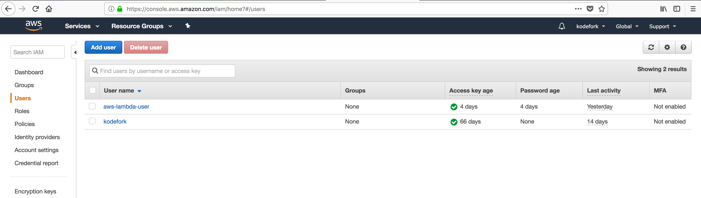
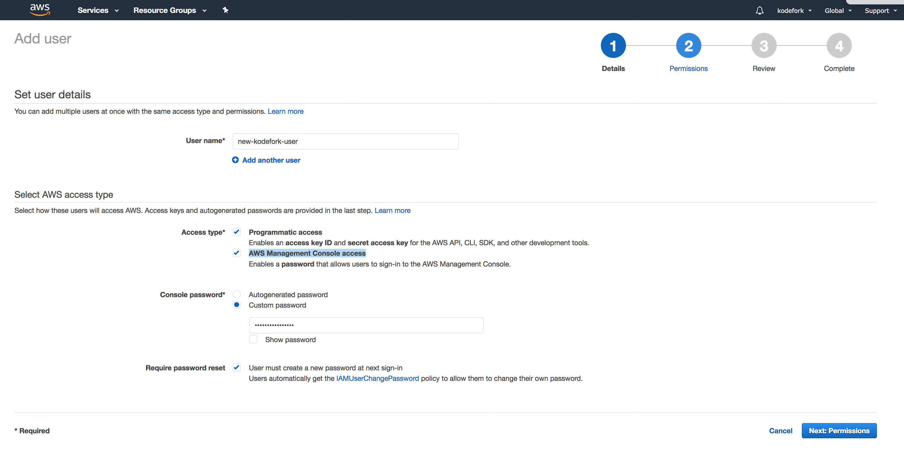
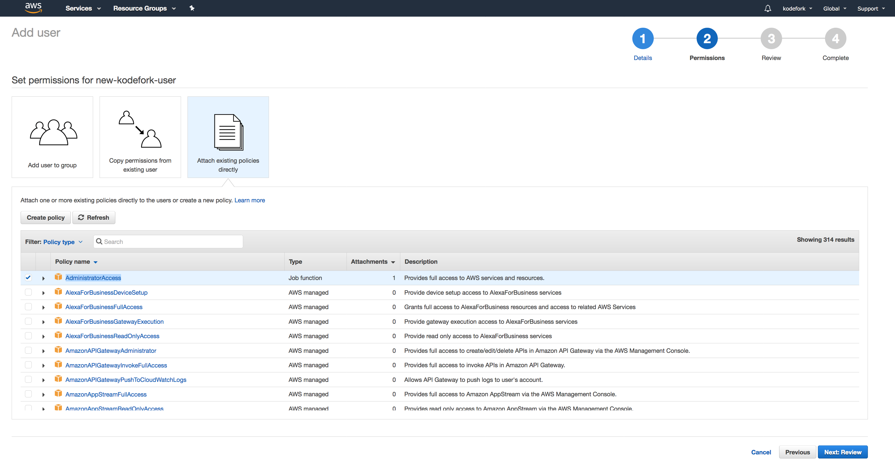
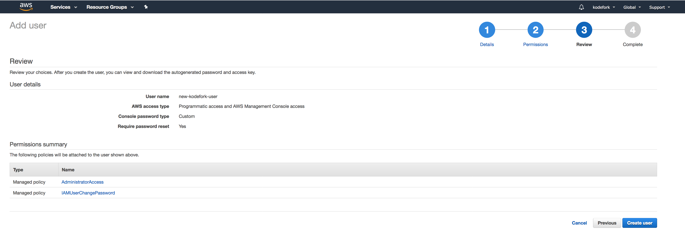
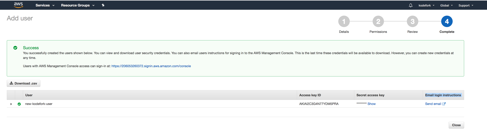
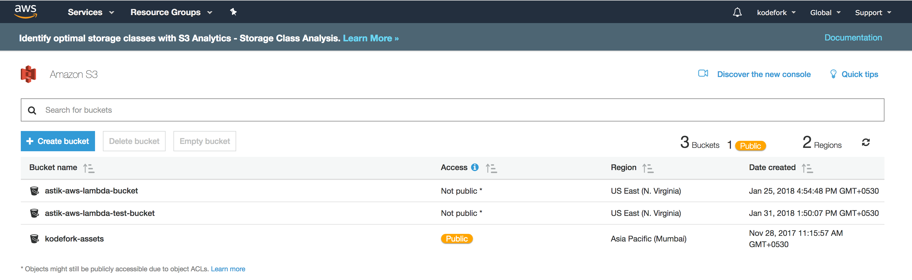
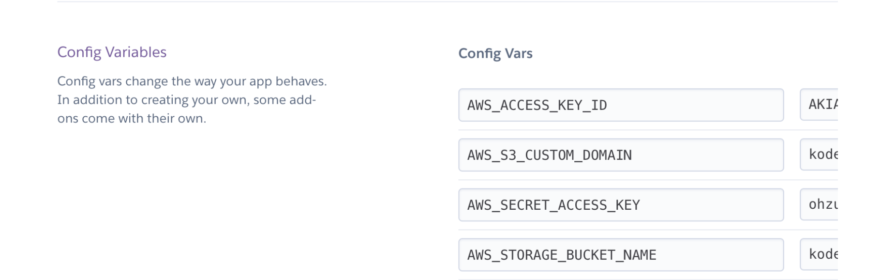

# Store Django media files in S3

- To use aws resources you first need to create and IAM user.

### Create IAM User & Get AWS Access Keys
To get your access key ID and secret access key follow the steps below.

* Open the [IAM console](https://console.aws.amazon.com/iam/home). If you have not already logged in then sign in to the aws account. You can also create a [new account](https://portal.aws.amazon.com/billing/signup#/start) if you don't have one.
* From the navigation menu at left side, click on **Users**. You will get a previously created list of existing users and none if No user is created earlier.

 

* Now from top click on **Add User** and you will get a new screen. Now enter your **Username** and select the **Programmatic access** and **AWS Management Console access** checkbox in Access type section. Enter the **custom password** in Console Password section. Now click on **Next: Permissions** on bottom right side.

 

* In next window, **Attach existing policies directly** and select **AdministratorAccess ** and click on **Next: Review**

 

* Now on next window just click on **Create user**

 

* Now you will get a success screen and new **IAM User** is created just make a note of **Access key ID** and **Secret access key**, it will be used later in this tutorial. Alternatively you can also download the csv file of credentials using **Download .csv** button or email it using **Send email** link.

 

----------

Now we need to create a S3 bucket to store our files in it.

## Create S3 Bucket
To create S3 bucket follow the steps below:

* Open the [S3 Bucket AWS console](https://s3.console.aws.amazon.com/s3/home). It will show the existing buckets if it is previously created. You can create a new bucket from here. Just click on **Create bucket**.

 

* On the opened window enter the **Bucket Name** and Choose the **Region** and click on **Next**.

* Do **Next** and Next and finally click on **Create Bucket**. And once this is done, new bucket will be created and it will show up on the page.

> [Note:]() Here I have already created my bucket and am going to make use of my S3 bucket `kodefork-assets`.

----------

Now, as IAM user is created and we have access keys from AWS and we have also created S3 bucket. 
Let's store these keys in **Heroku config vars** so that we can access it using `environment variables`.

## Saving Environment variables to Heroku

* First, you need to go to [Heroku dashboard settings](https://dashboard.heroku.com/apps), click on your app and then click on **settings tab** and finally  click on **config vars**.

* Then just enter all your environment variables like `AWS_ACCESS_KEY_ID`, `AWS_S3_CUSTOM_DOMAIN`, `AWS_SECRET_ACCESS_KEY` and etc.... by entering **Key** and **Value** and clicking on `Add` button. 

 
 

* In config vars, add `AWS_ACCESS_KEY_ID` and `AWS_SECRET_ACCESS_KEY` from what you received after creating IAM user.

* `AWS_STORAGE_BUCKET_NAME` will be `kodefork-assets`, in your case the name of your bucket.

* `AWS_S3_CUSTOM_DOMAIN` will be `kodefork-assets.s3.amazonaws.com`, see carefully it's bucket name followed by `.s3.amazonaws.com`.

*  `MEDIA_URL` will be `https://kodefork-assets.s3.amazonaws.com/`, again see it is my bucket_name and then url is formed.

## settings.py

    DEFAULT_FILE_STORAGE = 'storages.backends.s3boto3.S3Boto3Storage'
    AWS_ACCESS_KEY_ID = os.environ.get("AWS_ACCESS_KEY_ID", "") 
    AWS_SECRET_ACCESS_KEY = os.environ.get("AWS_SECRET_ACCESS_KEY", "")
    AWS_STORAGE_BUCKET_NAME = os.environ.get("AWS_STORAGE_BUCKET_NAME", "")
    AWS_QUERYSTRING_AUTH = False 
    AWS_S3_CUSTOM_DOMAIN = os.environ.get("AWS_S3_CUSTOM_DOMAIN", "")
    MEDIA_ROOT = os.environ.get("MEDIA_URL", "")
    MEDIA_URL = '/media/'

Now just update your code to heroku and its should work and file should be stored in your S3 bucket.

 

 

----

