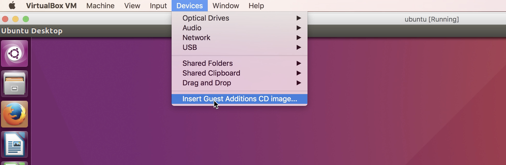
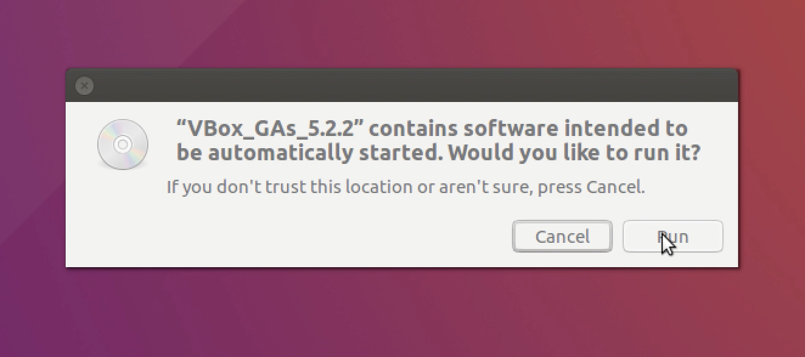
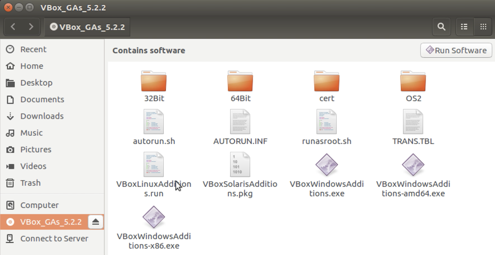
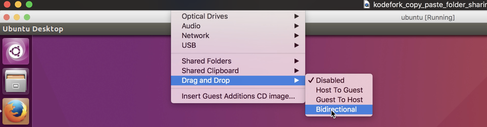
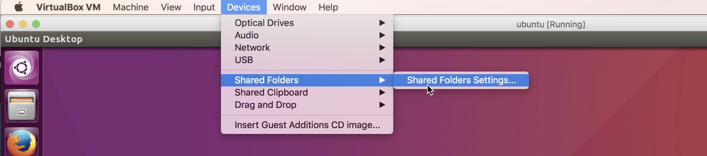
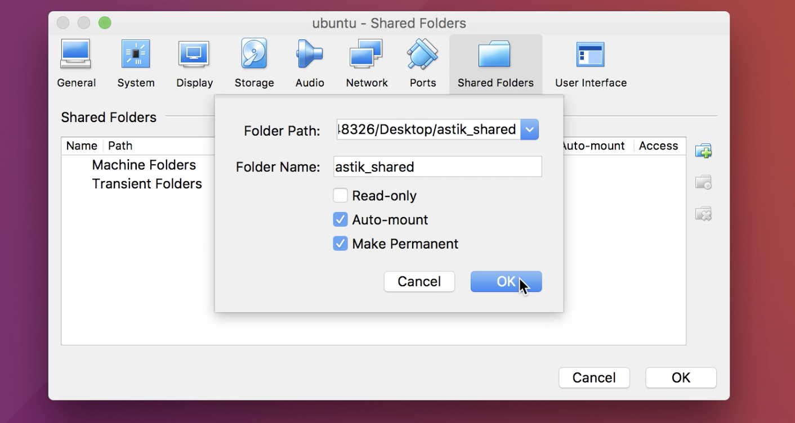

# Enable copy-paste and file sharing between host and guest operating system

### Enabling Copy and Paste

#### Step-1: Install Guest Edition

**From top left corner got to `Devices > Insert Guset Addition CD Image`**




**Virtual CD will be mounted on `/media/cdrom` and you will get an autoprompt just click on run and enter your root user password.**




**If you don't get that prompt just click on `/media/cdrom` that is mounted and you will get all the files and folders in side it just click on `VBoxLinuxAdditions.run` and run it as root.**



**Once the guest edition is installed just reboot and restart virtualbox.**


#### Step-2: Enable shared clipboard

**Again go to `Devices > Shared Clipboard` and choose Bidirectional.**


#### Step-3: Enable drag and drop

**Again go to `Devices > Drag and Drop` and choose Bidirectional.**

 


**That's it we are done. Just try to copy and paste from guest os to host os and vice-versa and it should work perfectly fine.**


<br>


### Enabling Shared Folder

#### Step-1: Install Guest Edition

Same as above


#### Step-2: Create Shared Folder

- Go to `Devices > Shared Folders > Shared Folder` Settings.

 

* Click the `+` symbol to add a new shared folder.
* Specify a folder name added on host operating system select `Auto-mount` and `Make Permanent`
* Remember name of shared folder used on host operating system.




#### Step-3: View Shared Folder on guest operting system

```
$ sudo mkdir /media/shared-foler
$ sudo mount -t vboxsf yourfolderonhost  /media/shared-folder
```
Here `yourfolderonhost` is the foldername specified on host operating system(windows/mac)


#### Step-4: Run Scripts to automatically start shared folder on system start

```
$ /etc/init.d/rc.local
```


#### Step-5: Add yourself to vboxsf group

```
$ sudo adduser yourusername vboxsf
```


---

