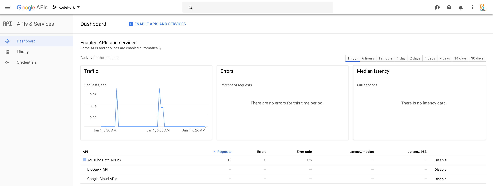

# Embed youtube channel videos on the website free

#### Get API Key from Google

- To embed youtube videos you need to get the [api key from google](https://developers.google.com/maps/documentation/javascript/get-api-key).
- For embedding youtube videos you need to `Enable YouTube Data API v3`. 
- To enable it just visit [google developers console dashboard](https://console.developers.google.com/apis/dashboard) and click on `Library` section on left search for `YouTube Data API v3` and enable it.

 

- To show youtube videos on localhost also, temporarily don't do key restriction on api key. 
- Just click on `Credentials` section from left, click on api key and set `Key restrction to None` for now, you can change later.
- Copy the API key now and proceed further.


#### Get your Youtube Channel ID

- Visit [youtube.com](https://www.youtube.com) and from right top corner click on profile logo and in dropdown click on `MyChannel`. 
- In browser you will get something like [https://www.youtube.com/channel/UCrht7w0suyP45cbE9TJVSKA?view_as=subscriber](https://www.youtube.com/channel/UCrht7w0suyP45cbE9TJVSKA).
- Here channelId is `UCrht7w0suyP45cbE9TJVSKA` just keep a note of it.
- Now, you have API Key and channel id, so you can proceed further.

#### Get jquery and jquery.tubber.min.js

Download [jquery.tubber.min.js](https://github.com/wyllyan/tubber/blob/master/dist/jquery.tubber.min.js)

Now add both **jquery** and **jquery.tubber.min.js** to webpage.

```
<script src="//code.jquery.com/jquery-1.11.2.min.js"></script>
<script src="jquery.tubber.min.js"></script>
```

#### Embed code for youtube videos

**HTML Code**

```html
div id="youtube-video-container"></div>
<div class="pagination">
	<button id="youtube-video-prev-page" class="ui mini left labeled icon button"><i class="left arrow icon"></i>Previous</button>
	<button id="youtube-video-next-page" class="ui mini right labeled icon button"><i class="right arrow icon"></i>Next</button>
</div>
```

**JS Code:**

Here replace, your API Key and Youtube Channel ID.

```javascript
<script>
	$.fn.tubber.defaults.apiKey = 'YOUR-API-KEY';

	$('#youtube-video-container').tubber({
		channelId: 'Your-Youtube-Channel-ID',
		itemsPerPage: 8,
		prevPageControl: $('#youtube-video-prev-page'),
		nextPageControl: $('#youtube-video-next-page')
	});
</script>
```

#### Show Playlist or User Uploaded Videos

In case you want to show the youtube videos from playlist instead of channel, then in above code in place of `channelId` give `playlistId`.
```
playlistId: 'Your-Youtube-Playlist-ID',
```
and if you want to show the videos uploaded by a user, just give **username** in place of **channelId**.
```
username: 'Your-Youtube-Username',
```

That's good to go.


---

