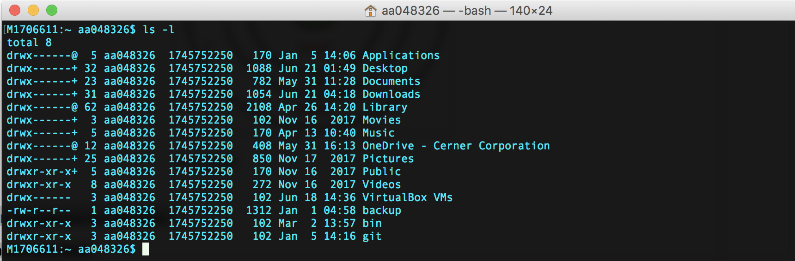
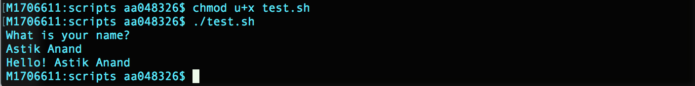
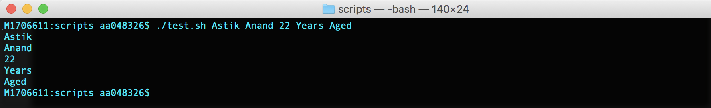
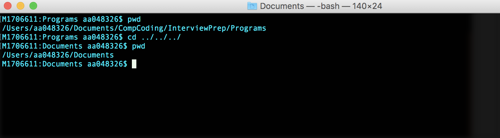
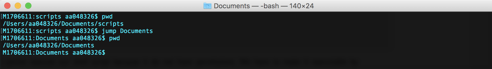

# Shell / Bash Scripting

###### Shell Interaction

- Interaction with any major operating system is indirectly interacting to shell.
- While running Ubuntu, Linux Mint or any other Linux distribution, interaction to shell is being done every time we use terminal.
- **Few related terminologies:**
  - Kernel
  - Shell
  - Terminal

#### Kernel

The kernel is a computer program that is the **core of a computer’s operating system**, with complete control over everything in the system. 

It manages following resources of the Linux system:

* File management
* Process management
* I/O management
* Memory management
* Device management etc.

> **Notes:** 
>
> - It is often mistaken that Linus Torvalds has developed Linux OS, but actually he is only responsible for development of Linux kernel.
> - Complete Linux system = Kernel + GNU system utilities and libraries + other management scripts + installation scripts.

#### Shell

* A shell is special user program which provide an interface to user to use operating system services. * * Shell accept human readable commands from user and convert them into something which kernel can understand. 
* It is a command language interpreter that execute commands read from input devices such as keyboards or from files. 
* The shell gets started when the user logs in or start the terminal.


**Shell is broadly classified into two categories:**

* Command Line Shell
* Graphical shell

#### Command Line Shell

- Shell can be accessed by user using a command line interface. 
- A special program called `Terminal` in **linux/macOS** or **Command Prompt** in Windows OS is provided to type in the human readable commands such as “cat”, “ls” etc. and then it is being execute. 
- The result is then displayed on the terminal to the user. A terminal in MacOS:



- Working with command line shell is very powerful, it allows user to store commands in a file and execute them together. 
- This way any repetitive task can be easily automated. 
- These files are usually called `batch files` in Windows and `Shell Scripts` in Linux/macOS systems.

#### Graphical Shell

- Provide means for manipulating programs based on graphical user interface (GUI), by allowing for operations such as opening, closing, moving and resizing windows, as well as switching focus between windows. 
- MacOS or Ubuntu OS can be considered as good example which provide GUI to user for interacting with program. 
- User do not need to type in command for every actions. 
- A GUI in MacOS will look like below.


> There are several shells are available for Linux systems.Each shell does the same job but understand different commands and provide different built in functions. 

* **BASH (Bourne Again SHell)** – It is most widely used shell in Linux systems. It is used as default login shell in Linux systems and in macOS. It can also be installed on Windows OS.
* **CSH (C SHell)** – The C shell’s syntax and usage are very similar to the C programming language.
* **KSH (Korn SHell)** – The Korn Shell also was the base for the POSIX Shell standard specifications etc.

## Shell Scripting

- Usually shells are interactive that mean, they accept command as input from users and execute them. 
- However some time we want to execute a bunch of commands routinely, so we have type in all commands each time in terminal.
- As shell can also take commands as input from file we can write these commands in a file and can execute them in shell to avoid this repetitive work. 
- These files are called `Shell Scripts` or `Shell Programs`. 
- Shell scripts are similar to the `batch file` in MS-DOS. Each shell script is saved with `.sh` file extension eg. `myscript.sh`
- A shell script have syntax just like any other programming language. A shell script comprises following elements:
  - **Shell Keywords:** – if, else, break etc.
  - **Shell commands:** – cd, ls, echo, pwd, touch etc.
  - **Functions**
  - **Control flow:** – if..then..else, case and shell loops etc.

###### Why do we need shell scripts

There are many reasons to write shell scripts:

* To avoid repetitive work and automation
* System admins use shell scripting for routine backups
* System monitoring
* Adding new functionality to the shell etc.

###### Advantages of shell scripts

* The command and syntax are exactly the same as those directly entered in command line, so programmer do not need to switch to entirely different syntax
* Writing shell scripts are much quicker
* Quick start
* Interactive debugging etc.

###### Disadvantages of shell scripts

* Prone to costly errors, a single mistake can change the command which might be harmful
* Slow execution speed
* Design flaws within the language syntax or implementation
* Not well suited for large and complex task
* Provide minimal data structure unlike other scripting languages. etc


### Writing Shell Scripts

###### Read user input

```
#!/bin/bash
echo "What is your name?"
read name
echo "Hello! $name"
```



#### Variables

###### Variable Names:

The name of a variable can contain only letters (a to z or A to Z), numbers ( 0 to 9) or the underscore character (_).

The reason we cannot use other characters such as `!`, `*`, or `-` is that these characters have a special meaning for the shell.

###### Defining Variables

```
variable_name=variable_value
```

Examples:

```
NAME="Astik Anand"
VAR2=100
```

###### Accessing Values

To access the value stored in a variable, prefix its name with the dollar sign `$`.

```
NAME="Astik Anand"
echo $NAME
```

###### Read-only Variables

Shell provides a way to mark variables as read-only by using the read-only command. 

```
NAME="Astik Anand"
readonly NAME
NAME="Anand"
```

The above script will say `This variable is read only`.

###### Unsetting Variables

Unsetting or deleting a variable directs the shell to remove the variable from the list of variables that it tracks.

```
unset variable_name
```

**Example:**

```
NAME="Astik Anand"
unset NAME
echo $NAME
```

This will not print anything.

`Note:` We cannot use the unset command to unset variables that are marked readonly.

###### Variable Types

* **Local Variables:** A variable that is present within the current instance of the shell. It is not available to programs that are started by the shell. They are set at the command prompt.

* **Environment Variables:** Is available to any child process of the shell. Some programs need environment variables in order to function correctly. Usually, a shell script defines only those environment variables that are needed by the programs that it runs.

* **Shell Variables:** A special variable that is set by the shell and is required by the shell in order to function correctly. Some of these variables are environment variables whereas others are local variables.

  * `$0` The filename of the current script.
  * `$n` These variables correspond to the arguments with which a script was invoked. Here n is a positive decimal number corresponding to the position of an argument (the first argument is $1, the second argument is $2, and so on).	
  * `$#` The number of arguments supplied to a script.
  * `$*` All the arguments are double quoted. If a script receives two arguments, $* is equivalent to $1 $2.
  * `$@` All the arguments are individually double quoted. If a script receives two arguments, $@ is equivalent to $1 $2.
  * `$?` The exit status of the last command executed.
  * `$$` The process number of the current shell. For shell scripts, this is the process ID under which they are executing.
  * `$!` The process number of the last background command.

<br>

#### Command-Line Arguments

The command-line arguments $1, $2, $3, ...$9 are positional parameters, with \$0 pointing to the actual command, program, shell script, or function and $1, $2, $3, ...$9 as the arguments to the command.

```
echo "File Name: $0"
echo "First Parameter : $1"
echo "Second Parameter : $2"
echo "Quoted Values: $@"
echo "Quoted Values: $*"
echo "Total Number of Parameters : $#"
```

 

###### Special Parameters \$* and $@

There are special parameters that allow accessing all the command-line arguments at once. `$*` and `$@` both will act the same unless they are enclosed in double quotes, "".

Both the parameters specify the command-line arguments. However, the `$*` special parameter takes the entire list as one argument with spaces between and the `$@` special parameter takes the entire list and separates it into separate arguments.

We can write the shell script as shown below to process an unknown number of commandline arguments with either the $* or $@ special parameters −

```
for TOKEN in $*
do
   echo $TOKEN
done
```



 

<br>

#### Arrays

###### Defining Array Values

We can use a single array to store many values in one variable.

```
array_name[index]=value
```

###### Accessing Array Values

After you have set any array variable, you access it as follows −

```
${array_name[index]}
```

You can access all the items in an array in one of the following ways −

```
${array_name[*]}
${array_name[@]}
```

Example:

```
NAME[0]="Astik"
NAME[1]="Anand"
NAME[2]="Manpal"
NAME[3]="Vasram"
NAME[4]="Santosh"
echo "First Index: ${NAME[0]}"
echo "Second Index: ${NAME[1]}"
echo "First Method: ${NAME[*]}"
echo "Second Method: ${NAME[@]}"
```


<br>

#### Operators

Bourne shell didn't originally have any mechanism to perform simple arithmetic operations but it uses external programs, either `awk` or `expr`.

```
val=`expr 2 + 2`
echo "Total value : $val"
```

Output

```
Total value : 4
```

The following points need to be considered while adding:

* There must be spaces between operators and expressions. For example, `2+2` is **not correct**; it should be written as `2 + 2`.
* The complete expression should be enclosed between *` `*, called the backtick.

###### Arithmetic Operators

```
* Addition: `expr $a + $b`
* Subtraction: `expr $a - $b`
* Multiplication: `expr $a \* $b`
* Division: `expr $b / $a`
* Modulus: `expr $b % $a`
* Assignment: a = $b
* Equality: [ $a == $b ]
* Not Equality: [ $a != $b ]
```


> **Note:**It is very important to understand that all the conditional expressions should be inside square braces with spaces around them, for example **[ $a == $b ] is correct** whereas, **[$a==$b] is incorrect**.

###### Relational Operators:

```
* Equality:	[ $a -eq $b ]
* Not Equality: [ $a -ne $b ]
* Greater than: [ $a -gt $b ]
* Lesser than: [ $a -lt $b ]
* Greater and Equal: [ $a -ge $b ]
* Lesser than and Equal: [ $a -le $b ]


```

> [Important Note:]() It is very important to understand that all the conditional expressions should be placed inside **square braces with spaces around them**. For example, **[ $a <= $b ] is correct** whereas, **[$a <= $b] is incorrect**.

###### Boolean Operators

```
* Negation: [ ! false ]
* OR: [ $a -lt 20 -o $b -gt 100 ]
* AND: [ $a -lt 20 -a $b -gt 100 ]


```

###### String Operators

```
* Equality:	[ $a = $b ]
* Not Equality: [ $a != $b ]
* Size Zero: [ -z $a ]
* Size Non-zero: [ -n $a ]
* Not Empty: [ $a ]


```

<br>

#### Decision Making

###### The if...else statements

Unix Shell supports following forms of if…else statement:

* if...fi statement
* if...else...fi statement
* if...elif...else...fi statement

###### The case...esac Statement

* case...esac statement

<br>

#### Loop Controls

###### While Loop

```shell
#!/bin/sh

a=0
while [ "$a" -lt 10 ]    # this is loop1
do
   b="$a"
   while [ "$b" -ge 0 ]  # this is loop2
   do
      echo -n "$b "
      b=`expr $b - 1`
   done
   echo
   a=`expr $a + 1`
done


```

**Output:**

```
0
1 0
2 1 0
3 2 1 0
4 3 2 1 0
5 4 3 2 1 0
6 5 4 3 2 1 0
7 6 5 4 3 2 1 0
8 7 6 5 4 3 2 1 0
9 8 7 6 5 4 3 2 1 0


```


### Example: Script to jump into directory instead of recursive cd

- If you work on terminal, something you traverse deep down in directories. 
- Then for coming few directories up in path we have to execute command like this as shown below to get to the "Documents" directory.

 

- It is quite frustrating, so why not we can have a utility where we just have to type the name of directory and we can directly jump to that without executing `cd ../` command again and again. 
- Save the script as `jump.sh`.

```shell
# A simple bash script to move up to desired directory level directly
 
function jump(){
    # original value of Internal Field Separator
    OLDIFS=$IFS
 
    # setting field separator to "/" 
    IFS=/
 
    # converting working path into array of directories in path
    # eg. /my/path/is/like/this
    # into [, my, path, is, like, this]
    path_arr=($PWD)
 
    # setting IFS to original value
    IFS=$OLDIFS
 
    local pos=-1
 
    # ${path_arr[@]} gives all the values in path_arr
    for dir in "${path_arr[@]}"
    do
        # find the number of directories to move up to
        # reach at target directory 
        pos=$[$pos+1]
        if [ "$1" = "$dir" ];then
 
            # length of the path_arr
            dir_in_path=${#path_arr[@]}
 
            #current working directory
            cwd=$PWD
            limit=$[$dir_in_path-$pos-1]
            for ((i=0; i<limit; i++))
            do
                cwd=$cwd/..
            done
            cd $cwd
            break
        fi
    done
}


```

For now we cannot execute our shell script because it do not have permissions. We have to make it executable by provinding execute permissions by typing following command.

    $ chmod u+x path/to/our/file/jump.sh


> Now to make this available on every terminal session, we have to put this in `.bashrc` file.
> `.bashrc` is a shell script that Bash shell runs whenever it is started interactively. The purpose of a .bashrc file is to provide a place where you can set up variables, functions and aliases, define our prompt and define other settings that we want to use whenever we open a new terminal window.

Now open terminal and type following command to make `jump` available as command in terminal.

    $ echo "source path/to/our/file/jump.sh">> ~/.bash_profile


 

Now open you terminal and try out new `jump` functionality by typing following command.

    $ jump dir_name





---

