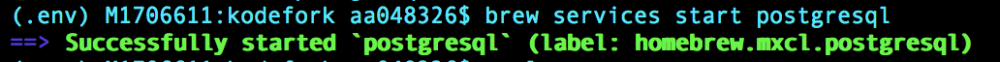
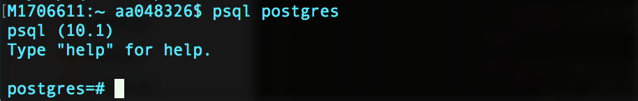
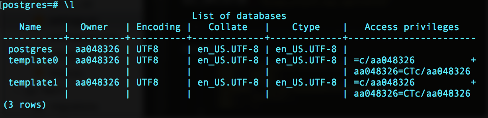
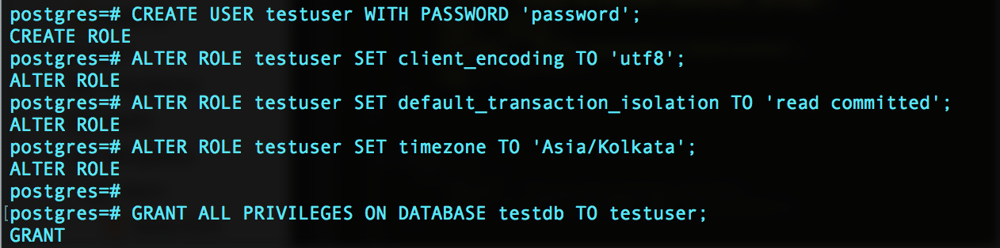
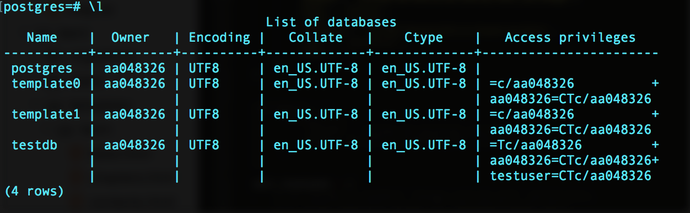
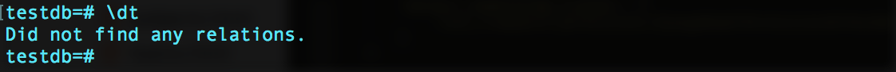

# Getting started with PostgreSQL on MAC

#### Step-1: Installation

- Before starting anything make sure that we have **Homebrew** installed on your system.
- If not installed already, enter the below command on the terminal else proceed.

```
$ /usr/bin/ruby -e "$(curl -fsSL https://raw.githubusercontent.com/Homebrew/install/master/install)"
```

<br>

- Now install postgresql by below command

```
$ brew install postgresql
```

<br>

- We will get screen like once it gets successfully installed.

 

<br>

#### Step-2: Start PostgreSQL Server

- To start PostgreSQL service just enter the below command.

```
$ brew services start postgresql
```

 

<br>

- Alternatively to **stop** the service

```
$ brew services stop postgresql
```

<br>

#### Step-3: Interactive Session PSQL

- To perform any postgres operation we need to enter the interactive session of **psql**. 
- Enter using below command

```
$ psql postgres
```

 

<br>

- To **exit** from interactive session just enter

```
\q
```

<br>

#### Step-4: List Databases

- To see all the databases that are already present we need to use `\list` or shortcut `\l` in interactive session.

```
\l
```

 

<br>

- When we install postgres by default 3 databases `postgres`, `template0` and `template1` will already be present.

<br>

#### Step-5: Create Database

- To create new database just use below command in interactive session.
- Here we are creating `testdb` database for example, we can give our own custom name.

```
CREATE DATABASE testdb;
```

  

- and it will create `testdb` database, we can check by listing it using `\l` command.

- Alternatively, if we can **Drop database** using

```
DROP DATABASE testdb;
```

<br>

#### Step-6: Create User for Database

- We need to create a user to handle this database, the user should have all the privileges on this database. 
- Here we are going to create `testuser` with password `password`, we can create our own custom user with own password.
- Then set some settings changes.

```
CREATE USER testuser WITH PASSWORD 'password';
ALTER ROLE testuser SET client_encoding TO 'utf8'; 
ALTER ROLE testuser SET default_transaction_isolation TO 'read committed'; 
ALTER ROLE testuser SET timezone TO 'Asia/Kolkata';

GRANT ALL PRIVILEGES ON DATABASE testdb TO testuser;
```

 

<br>

- After all these we will have `testdb` created with all the privileges to `testuser`.
- Just check it using listing by `\l`.

 

<br>

#### Step-7: Switch Database

- By default we are connected to `postgres` database.
- We can switch to a new database using `\connect` or shortcut `\c` command

```
\c testdb
```


<br>

#### Step-8: Listing Tables

- Once we have selected the database, we can view all its tables using `\dt` command.
- For now there is no table so it will not show any.

```
\dt
```

 

<br>

#### Step-9: Create Table

- Now we will create a `person` table with `id`, `name`, `email` and **id** set as PRIMARY KEY.

```
CREATE TABLE person (id INTEGER PRIMARY KEY, name VARCHAR, email VARCHAR);
```

- Once created it will show in tabular form as below

 

Alternatively, if you want you can **drop table** using

```
DROP TABLE person;
```

<br>

#### Step-10: Fetching Records from Table

- We can see all the records inside a table using

```
SELECT * FROM person;
```

- As for now there is no records so it will show 0 rows.

 

<br>

#### Step-11: Inserting Data in Table

- We can insert record into `person` table using

```
INSERT INTO person(id, name, email) VALUES(1, 'astik anand', 'astikanand@gmail.com');
```

- Now seeing the record it will show 1 row.
- We can insert as many record as we want.

 


#### Step-12: Backup Database

- Many times for safety reasons we need to take the backup of database and keep the file safe.
- We can do it using `pg_dump dbname > outputfile` command.
- Just exit from interactive session and then enter below command.

```
$ pg_dump testdb > backup
```

 

- and we will see that one **backup** file is created.
- We can keep it safely somewhere and can restore data from it in future.

<br>

#### Step-13: Restore Database

- To restore data we must have a backup file created by `pg_dump`.
- Just create a new database(for example:- newtestdb) in which we want to restore the backup file.
- And then use `psql dbname < backupfile`.

```
$ psql newtestdb < backup
```

<br>

<br>

---

