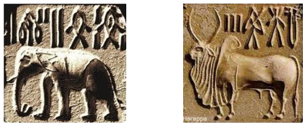
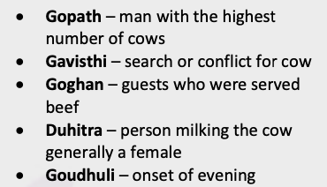
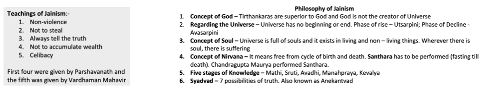
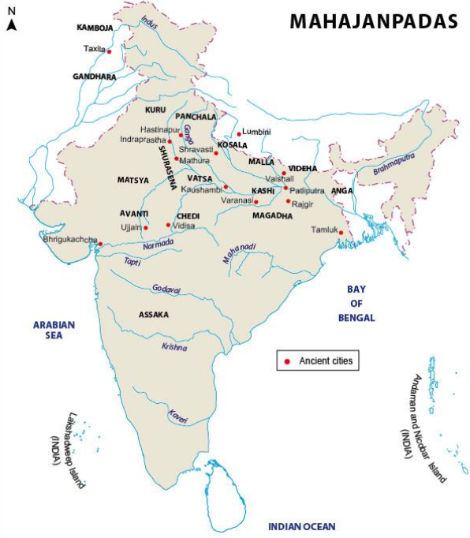
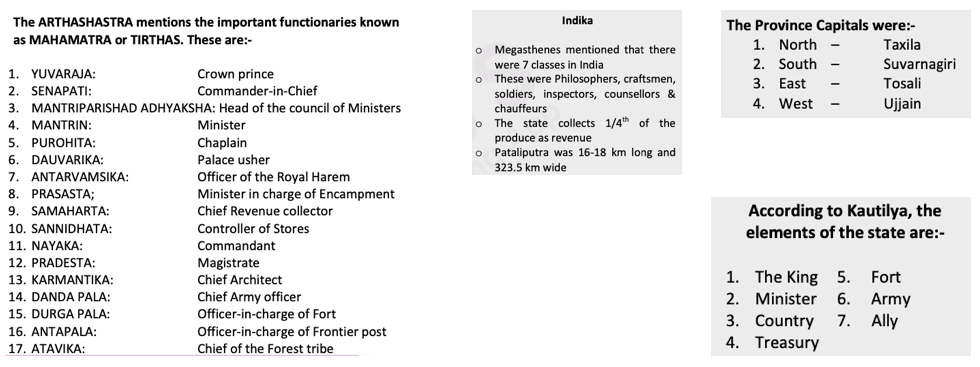
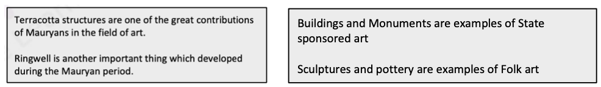

# Periodic Ancient History

Zaman – The Period of Study 

Makam – The area or place of study

## Stone Age

###### Paleolithic Age (5 Lakh BC – 10000 BC)

- **Locations** – Soan (Pakistan), Krishna Valley, Chota Nagpur Plateau
- **Tools used** – hand axes, borers, choppers, cleavers, pebbles, flakes
- **Living pattern** – People were food gatherers not producers, ate both veg and non-veg food.
- **Clothing** – Leaves, Animal skins
- **Shelter** – Caves
- Fire and communication with each other was known but in later Paleolithic age.

###### Mesolithic Age ( 10000 BC – 4000 BC )

- **Locations** – Adamgarh (M.P), Bhimbetka (M.P), Bagor (Rajasthan)
- **Tools used** – Microlithic tools, blades and arrows
- **Living pattern** – Domestication of Animals had started. Crude form of farming also had begun.

###### Neolithic Age ( 7000 BC – 1000 BC )

- **Locations** – Burzahom (Kashmir), Chirant (Bihar), Belan (Uttar Pradesh), Mehargarh ( Baluchistan)
- **Tools used** – Oval shaped tools, polished stone tools, antelope horn
- **Living pattern** – People became food producers instead of food gatherers. Wheat and Barley was grown. Division of labour between man and woman began.
- **Burial Practice** – Dead bodies were buried in North South direction along with the personal belongings. This showed that the people believed in life after death.

###### Chalcolithic Age ( 2800 BC – 700 BC)

- Locations – Ahaar (Rajasthan), Malwa (M.P), Jorwe (Maharashtra)
- Tools used – Stone and copper (the first metal to be used) harpoons, copper axes were used.
- Living pattern – Village life developed during this age.
  - Agriculture and domestication of cattle o Houses of mud bricks were built.
  - People knew the use of cotton.
  - They also believed in life after death.

## Indus Valley Civilization (2500 BC – 1750 BC)

###### Discovery

-  In 1921, archaeologists **John Marshall** & **Dayaram Sahni** excavated a site **Harappa**, on the banks of river Rabi in Punjab region of Pakistan.
- **Mohenjo-Daro**, another important site of Indus Valley civilization was discovered in Sindh region of Pakistan on the banks of river Indus.
- Due to the similarities in town planning and seals it was confirmed that both were part of same civilization.
- Harappan Civilization was named after Harappa which was the first site discovered.
- Also most of the sites discovered were on the banks of river Indus thus the name **Indus Valley civilization**.

- ***There are two criteria for civilization is:***
  1. It must have cities.
  2. It must have its own script
- ***Harappan Script:***
  - Harappan scripts were found on its seals and it is pictographic.
  - It is boustrophedon style.
  - Harappan Script is closet to Dravidian script of Munda tribe of Jharkhand.

> [Boustrophedon]() – is a kind of bi-directional text, mostly seen in ancient manuscripts and other inscriptions. Every other line of writing is flipped or reversed, with reversed letters. Rather than going left-to-right as in modern English or right-to-left as in Arabic and Hebrew, alternate lines in boustrophedon must be read in opposite directions. Also, the individual characters are reversed, or mirrored.

###### Origin of Civilization

- ***As given by Western historians :***
  - They considered this civilization as an offshoot of **Mesopotamian** or **Byzantinian** civilization and that it originated suddenly.
  - Drawback of this theory is that there is no evidence supporting it.
  - Also Mesopotamian civilisation’s findings were different than those of the Harappan civilisation.
- ***As given by Indian historians :***
  - The civilisation gradually developed and it had indigenous origin.
  - It evolved from the Neolithic period where agriculture was practised and surplus grains produced were traded.

###### Sites of the Civilization

1. [Mohenjo-Daro :]() (literal meaning of the term is - mount of the dead)
   - ***Great Bath :***
     - The Great Bath of Mohenjo-Daro is called as earliest public water tank of the ancient world.
     - It was a huge bath made of burnt/baked bricks.
     - It was probably used for public ceremonies and was situated in a public place.
     - There were rooms around the bath for changing clothes and wells to pour water.
   - ***Bronze statue of a Dancing girl :***
     - This shows that use of Bronze (an alloy) was known to the people thus this age is also known as **Bronze Age**.
   - ***The Great Granary :***
     - Was used to store excess grains.
     - This also proves the existence of a civic administration which collected surplus grains and distributed it later.
     - There was possibly a taxation system.
   - ***There are evidences of use of cotton.***
   - ***Largest number of seals are found here.***
     - Seals were made of aesthetite which is a form of clay.
     - These seals were circular, square and cylindrical in shape.
     - Seals were used to depict their script.
     - Seals were also used as a mark of authority and a medium of exchange.
     - One of these seals depicted a form of Shiva called **proto-Shiva**.
2. [Harappa :]()
   - This was the first site to be excavated.
   - 12 granaries of equal size arranged in 2 rows.
   - It had the second largest number of seals.
   - Various types of cemeteries were also discovered proving the fact that the people practiced different religions and were of different ethnicities.
3. [Kalibangan : ]()
   - It was situated on the banks of river **Ghagger**.
   - Evidence of ploughing has been found at his site.
   - Evidence of pre-Harappan culture is also found here.
   - Fire Altars or ‘**Havan kund**’ has also been found in Kalibangan.
4. [Lothal : ]()
   - It was on the banks of river **Bhogwa** in Gujarat (ancient name of **Sabarmati** river).
   - A man made dockyard made of burnt bricks which confirms the maritime activities during that time.
   - The Harappans had trade with Iraq, Iran, Mesopotamia and the present day Gulf.
   - Fire altars were also found here.
   - Double burial was also practiced in Lothal.

###### Town Planning of Harappan Civilization

- Towns were planned in a chessboard pattern.
- The city was divided into 2 parts :
  1. **Citadel** – was used by ruling class (Granary, Great bath etc. were part of Citadel).
  2. **Lower Town** – was used by ruled class.
- The houses were built of burnt bricks and were both single and double storeyed.
- The doors and windows were at the rear of the house instead of being located in front and the doors were at the corner of the walls.
- The streets were straight and cut each other at 90 deg.
- The drainage system was fully covered which was below the city.
- It was the most advanced system in the contemporary world

###### Crop Pattern of Harappans

- The knowledge of crop pattern was based on granaries.
- Harappans cultivated rice, wheat, barley and mustard.
- They were the first in the world to grow cotton.
- They also grew water-melon, pea and dates.

###### Metals used by Harappans

- They were the first people in the world to use copper and it was the earliest metal used in India.
- They used bronze also which was an alloy.
- Evidences of use of Gold and Silver too have been found.
- They also knew lead.
- Iron was not used by the people of Harappan Civilization.

###### Animals in the Harappan Civilization

- Animals which were domesticated include cows, dogs, sheep, and buffalo.
- There was also evidence was wild animals like rhinos and tigers.
- No presence of Horse was found during that time.

###### Trade & Commerce

- Trade and agriculture flourished during the Harappan civilization.
- Seal manufacturing and terracotta figurines were made in large numbers.
- Terracota articles were obtained by first making them in clay and then baking them in fire.

###### Arts & Crafts

- Pottery was done in this civilization and it was of 2 types.
  - ***Simple pottery :* ** included glasses, bowls and dishes which were mainly circular, square and cylindrical in shape.
  - ***Black & Red :*** Articles made had black backgrounds with red designs.
- Seals of this period suggest that they used wooden carts.
- They also knew the art of ship building.
- They had very well developed system of both, internal and external trade.

###### Religion and Faith

- The people were nature worshippers and had both personal and public religious beliefs.
- Idols founds confirm private worship by the people.

#### Decline of Indus Valley Civilization

There are multiple theories proposed by various scholars which explain the decline of this civilization.

- ***Theory by Mortimer Wheeler :***
  - This theory suggested that attack by the Aryans was responsible for the decline.
  - The main drawback of this theory was that it is confirmed that Aryans came to India around 1500 BC whereas Harappan civilization ended by 1750 BC.
- ***Theory by Riggs :***
  - He proposed that the civilization declined due to earthquake which was followed by floods.
  - Evidences of floods have been found in Mohenjo-Daro.
  - The main drawback of this theory was that this theory is confined only to certain regions of Harappan civilization and not to all the places where the civilization flourished.
- ***Theory by Fariservis :***
  - He proposed that ecological imbalance was responsible for decline of the civilization.
  - But failed to provide satisfactory data to prove his theory.
- ***Theory by Das and Sood :***
  - They proposed that change in course of Indus River was the reason for decline of the civilization and as most of the cities were on the banks of river Indus, thus civilization was destroyed.
- ***Theory by Malik and Pochal :***
  - They argued that Harappan civilization was not completely destroyed and there was a link between Harappan and post-Harappan culture but the uniformity of the civilization ended.

## Vedic Period – (1500 BC – 600 BC)

#### Early Vedic Period (1500 BC – 1000 BC)

###### About Early Vedic Period

- Rig Veda was composed during the period and the main source of information of this period is from the Rig-Veda.

- The Rig-Veda contains 1,028 mantras, or hymns, directed to the gods and natural forces. The mantras are organized into ten books called mandalas, or circles.
- It contains 10,462 slokas or hymns.
- Rig Veda was composed by Aryans and it was recited orally because the Aryans did not know writing.
- It talks about Aryans and their struggle with Non-Aryans.

###### Origin of Aryans

- Aryans migrated from Central Asia (Eurasia) to different places in Europe, India and Persia.
- They entered India via Afghanistan and settled down in north-west region of Punjab.
- Called India – **Sapthasindhu** (Land of seven rivers).

###### Life and Occupation

- Domestication of Animals was their main occupation.
- Agriculture was their secondary occupation as Rig Veda mentions only one crop – barley.
- The main animal domesticated was cow and it was also a medium of exchange.
- Aryans were ‘pastoral nomads’ who did not settle at a place for more than one season.
- They were mainly divided into tribes known as **Jan**.
- Aryan society was male dominated and had no territorial kingdom.
- The **Rajan** (King) of the tribe was assisted by **Senani** (military commander), **Purohit** (Priest), **Gramini** (King Maker).
- **Sabha**, **Samiti** and **Vidhat** were the assemblies.
- Rajan was hereditary and was assisted by these assemblies.
- He also collected gifts from people which were known as **Bali**. Bali is the oldest form of taxation known in India

###### Religion

- They were nature worshippers.
- Yagya and rituals were parts of religious practices.
- There was no temple or idol worship. All gods were supreme in a particular ritual. Aryans worshiped 33 gods and goddesses.
- The chief gods were Indra, Agni and Varun.
- Prime goddesses were Aditi, Prithvi and Usha.
- The main reasons for worshipping nature was : Fear, Desire for cattle, Desire for more children specifically male child

###### Society

- There was no class division as the concept of privateness was not fully developed.
- Since they all were pastoral nomads so the idea of property and settled life did not develop.
- The Varna system though existed in the Aryan Society. Its classifications were:-
  - **Purohit** (priest)
  - **Kshatriya** (Warrior)
  - **Vish** (Common Man)
  - **Shudra** (Labour Class)
- There was discrimination on the basis of colour in the society.
- The non-Aryans were called **das**, **panis**, **dasyus**.
- There was a lot of freedom give to women during this period. There was no child marriage or sati practice. Widow Remarriage was allowed.
- **Apaala**, **Lopamudra**, **Ghosha**, **Sukanya** composed Rig Vedic hymns.

#### Later Vedic Period (1000 B.C to 600 B.C)

###### About Later Vedic Period

- In this period both Literary Sources and Archaeological sources are available for a comprehensive study.
- **Ahichchhatra** & **Hastinapur** in Uttar Pradesh, **Nuh** in Haryana and **Atranjikhera** in Uttar Pradesh are the sites excavated which are related to the Later Vedic Period.
- Iron was used for the first time in Later Vedic period. (It was not known in early Vedic period or Harappan Civilisation). Iron was called Shyamayas in those days. It was first used as a weapon and not as a tool.
- Pottery is the most common archaeological finding. If there is no evidence of pottery, historians conclude that the area was not inhabited.
- In this period pottery which was found was classified as **PGW (Painted Grey ware)**.
- The changes noticed between Early Vedic and Later Vedic period was that slowly people were shifting towards agricultural community.
- Iron, the hardest known substance during that time, was being used in agriculture. Also ploughs and oxen were being used.
- Other than agriculture, domestication of animals was the primary occupation of the people.
- The term **Gotra** emerged from the later Vedic period.

###### Literature and Texts

- Literary sources for this period include – **Yajurveda**, **Samaveda** and **Atharvaveda**.
- Atharvaveda is believed to be a Non Aryan book while all other books are Aryan Books. Moreover it was written in Lower Gangetic plain unlike the other three Vedas which were written in the upper Gangetic plain.
- Atharva Veda deals with charms, spells and magic and is a good source to study the Kingdom of Magadha.
- Three other sources of literatures are Brahmanas. Last part of Brahmanas is known as **Aranyakas**. It was also known as Forest Book or Jungle Book. Theme of the book is Romanticism – relationship between man and nature.
- The **Upanishads** are a collection of philosophical texts which form the theoretical basis for the Hindu religion. There are **108 Upanishads**. Upanishad deal with the relationship between Man and God
- **Satyameva Jayate** was derived from **Mundaka Upanishad**.
- **Om** was derived from **Rig Veda**. It was one of the earliest books which talks about non-violence.
- 50 Upanishads were translated from Sanskrit to Persian under the leadership of Dara Shikoh – eldest son of Mughal Emperor Shah Jahan.
- 4 Vedas, Brahmanas, Aranyakas and Upanishads form the **Vedic Literature**.

#### Changes in Vedic Society from Early Vedic to Later Vedic Period

###### Changes in Living and Lifestyle

- As people’s primary occupation moved to agriculture, Land became more precious than cattle.
- In the settled life, King became powerful and started collecting taxes known as Bali and also started demanding ‘Bhag’ which was share in production and with the help of these taxes he maintained an army.
- To expand his land area, Kings performed **Ashvamedha Yajna** in which a horse was let loose for an year and the amount of area covered by the horse in that year would then belong to the owner of the horse (The King).
- Other changes in lifestyle ever since agriculture became the main profession included Emergence of Janapadas.
- Only men were allowed in Sabha and Samiti etc.
- Gods like Brahma and Vishnu emerged in the late Vedic period apart from Indra, Varun and Prithvi which were prominent in Early Vedic Period.
- In the early days, Shiva was known as Rudra.
- Number of **Samskarans** changed to 16 in the later Vedic Period.
- Upanayan was the most famous samskara. It was performed when a child joined school for the first time and was initially for both male and female but later females were forbidden from Samskara.

> [Ashvamedha Yajna:]() To expand area. Example in Ramayana when Lord Ram performs the Yajna and the Yajna horse is captured by his sons.
>
> [Vajpeya Yajna:]() Was performed for gaining supernatural powers o Chariot Race was performed in this Yajna
>
> [Rajsuya Yajna:]() Was performed when a king was coroneted and was then performed every year on the same date

###### Castes and Classes

- In the later Vedic period, castes and classes were established which was known as **Varnas**.
- The people who were strong and were able to control the resources became rulers and warriors.
- These warriors claimed themselves to be **Kshatriyas** which became dynastic and hereditary.
- The **priest class** began writing the literature in such a way that no one else would be able to become priests.
- The traders, peasants and craftsmen were of a class called **Vaishyas** and labour class or working class were being called **Shudras**.
- The occupation of a person depended solely upon his entire genealogy.
- First mention of the four castes was in the Rigveda.
- The condition of women started deteriorating in the later Vedic period. Polygyny increased in this period.
- Women were condemned by certain Brahmanas which compared them to wine and gambling and were also referred to as one of the evil.

## Jainism and Buddhism

#### Jainism

###### About Jainism

- Jainism is an Indian religion that prescribes a path of non-violence towards all living beings.
- Its philosophy and practice emphasize the necessity of self-effort to move the soul toward divine consciousness and liberation.
- Any soul that has conquered its own inner enemies and achieved the state of Supreme Being is called a **jina**.
- A/c to Jain belief there were **24 Tirthankars** (Spiritual Gurus). **Rishabdev(1st)**, **Parshvanath(23rd)** and **Vardhaman Mahavira(24th)**.
- Parshvanath was from Varanasi and his followers were known as Nirgranths which means free from all bonds.
- Vardhaman’s parents were also Nirgranths thus Vardhaman was also a Nirgranth.

##### Vardhaman Mahavira

- He is believed to be born in 540 B.C. in Kundalagrama in Vaishali. His father’s name was Siddharth and mother’s name was Trishala.
- He belonged to **Jnatrika clan**.
- His wife’s name was Yashoda and daughter’s name was Priyadarshika.
- He left home at the age of 30 years and the age of 42 he attained supreme knowledge at Jrmbhakagram.
- He gave his first sermon in a place called Vipulchal in Nalanda.
- He died in 468 B.C. at the age of 72 at a place called Pawapuri in Nalanda in Bihar.

- Main reason for less numbers of Jain followers was extreme non-violence practice.

###### Jainism in Later Phase

- Later Jainism splitted into 2 famous sects:
  - **Svetambar** – To wear white clothes
  - **Digambar** – Followers of this do not wear clothes
- Monks led by **Sthulabhadra** went to **Magadha** and were of the Svetambara sect.
- Monks led by **Bhadrabahu** migrated to **Sravanabelagola** and were of the Digambara
- Svetambaras compiled the teachings of Mahavira in a book form called Purvas. It was in Prakrit Language.
- In 5th and 6th century A.D. Jain munis assembled at Vallabhi and compiled the teachings known as Angas and was written in Prakrit.
- Digambaras rejected the teachings of Purvas and Angas.

#### Buddhism

##### Siddhartha Gautama (Buddha)

- He was born in the year 566 B.C. in the city of Kapilavastu which is in Lumbini in Nepal
- He was born in a royal Hindu family. His father was Suddhodana and mother was Mahamaya.
- He belonged to the **Shakya clan** and was also a Kshatriya. He was also known as Shakyamuni.
- He was married at the age of 16 to Yashodhara and had a son called Rahul.
- Four sights of Buddha were – An old man, a sick man, a dead corpse and a monk.
- He left the house at the age of 29 on his horse chariot.
- At the age of 35 he sat under a Pipal tree near the river Niranjana (modern day Phalgu River) at Bodhgaya.
- It is believed that Buddha meditated at this place for 7 weeks (49 days) and by 49th day he attained supreme knowledge and was called “the enlightened one”.
- He meditated again for 49 days after attaining supreme knowledge.
- Buddha gave his first sermon at Sarnath in Varanasi which was known as Dharma Chakra Pravartan.
- He preached in all seasons except monsoon.
- He returned back home after attaining knowledge and all his family members became his followers.
- He passed away at the age of 80 at a place called Kushinagar in Uttar Pradesh.

###### Buddhist Philosophy

- The concept of God was not well defined which led to the belief that Buddhism is an atheist religion.
- It is believed that the universe has a beginning and an end unlike Jainism.
- In Buddhist philosophy, soul of a person dies with the body. Most other religions like Jainism and Hinduism believe that soul is eternal.
- ***Samuth Pratyuth Prathipath :***
  - Cause and effect theory
  - There are twelve cycle as this is a cyclic effect

- ***Concept of Kshan(moment)*** – A person is different than what he was a moment ago.
- ***Concept of Nirvana*** - an 'ultimate' peace that is achieved after a lengthy process of mind-body transformation during which the uprooting and final dissolution of the volitional takes place.
- [Buddhist Sangha :]()
  - Members of Sangh were called Bhikshus or Bhikshunis.
  - Viharas were the place were Buddhist monks lived.
  - The prayer hall was called Chaitya.
  - Rules for living in the Viharas were given in a book called Vinaya Pitaka compiled under the leadership of Monk Upali.
  - A strict dress code was to be followed which was generally deep red and the Bhikshus were supposed to have only one meal a day and that meal had to be begged for.
  - No ornaments were allowed, alcohol was strictly banned and Brahmacharya lifestyle was supposed to be followed.
- No discrimination on the basis of caste was done though Buddhism did not fight the casteism.

###### Reasons for the Popularity of Buddhism

- Simplicity of the religion.
- Buddhist Sangha was well organised and disciplined.
- Use of common man language – Prakrit; Buddha used Ardha Magadhi, a form of Prakrit.
- Personality of Buddha.

###### Reasons for decline of Buddhism

- It lost its Identity.
- Corruption in Sangha.
- Revivalism of Brahmanical religion.
- Physical attack supported by Brahmanical priests and supported by the kings.
- Lack of Royal Patronage.
- Arrival of Islam.

###### 4 Buddhist Councils

- The First Buddhist Council was held under the patronage of king Ajatasatru.
  - Monk Mahakasyapa presided the council.
  - It was held at Sattapanni caves Rajgriha (now Rajgir).
- Second Buddhist council was held at Vaisali.
  - It was presided by Shatakambri.
  - For the first time Buddhism was divided into two sects – **Mahasamghika** and **Sthaviravada**.
- Third Buddhist Council was held at Pataliputra under Emperor Ashoka.
  - It was presided over by Moggaliputta Tissa.
  - Abhidhamma Pitaka was compiled during this council.
- Fourth Buddhist Council was held at Kundalwan in Kashmir under King Kanishka.
  - The council was presided over by Vasumitra.
  - **Asvaghosa**, a great philosopher and poet who wrote **Buddhacharita** was present in this Council.

## Mahajanpadas & First Magadhan Empire

###### Mahajanpadas

- This era is known in History as second urbanisation. The first period was during the Harappan period.
- There were **16 Mahajanapadas** most of which were in the Gangetic Plain.
- Gangetic plain was very fertile region and agriculture was the main occupation.
- Among the 16 Mahajanapadas, 5 were more powerful than others.
- Magadha (Capital – Rajgriha), Avanti (Capital – Ujjaini), Kashi (Capital – Varanasi), Kosala (Capital – Shravasti), Vajji (Capital – Vaishali)

###### Haryanka Dynasty (544 B.C - 413 B.C)

- This dynasty ruled from 6th century B.C. to 5th century B.C.
- **Bimbisara** and **Ajatashatru** were famous kings. Ajatashatru was the son of Bimbisara.
- They were ***contemporaries of Buddha and Mahavira***.
- Ajatashatru killed Bimbisara and was later killed by his son **Udayin**.
- **Darius**, an Iranian, was the **first individual to attack India** in 510 B.C

###### Shishunaga Dynasty (413 B.C - 345 B.C)

- **Shishunaga** and **Kalashoka** were the famous kings of this dynasty.

###### Nanda Dynasty (345 B.C - 322 B.C)

- **Mahapadma Nanda** was the famous king of this dynasty.
- First to annex Kalinga (modern day Orissa).
- **Dhanananda** was the ruler during which **Alexander the Great** invaded India.

##### Alexander the Great (327 B.C - 325 B.C)

- Alexander III of Macedonia, commonly known as Alexander the Great, was a king of Macedonia, a state in northern ancient Greece.
- He was born in Pella in 356 BC and was tutored by Aristotle until the age of 16.
- Invaded India during 326 B.C. to 324 B.C.
- He came through **Hindu Kush** through Afghanistan and Pakistan.
- The first Indian King who surrendered to Alexander was **Ambhi** and was fiercely competed by small king **Puru**.
- He did not attack major parts of India due to various reasons:
  - Hot Climate of India.
  - Soldiers of Alexander were very tired.
  - Fear that they won’t be able to defeat Nanda’s huge army.

## Mauryan Empire (322 B.C - 185 B.C)

###### About Mauryan Empire

- The Mauryan Dynasty was founded by Chandragupta Maurya who was the king from 321 to 298 B.C.
- The other important rulers of this dynasty were Bindusara and Ashoka.
- Kautilya’s Arthashastra mentions **18 Tirthas(head posts)** and **28 Adhyakshas**. These helped in managing the empire.
- **Mantri (Prime Minister)** and **Chief Priest** were the important posts in the empire and it is believed that Chanakya (Kautilya) held both the posts during the reign of Chandragupta Maurya and Bindusara.
- **Bhaga** was one of the most important tax collected, **Hiranya** was cash only tax and **Pranaya** was the tax collected during emergency period.
- The coins used were made of silver, copper or bronze and were called **Karshapana** or **Pana**.

###### Chandragupta Maurya (322 B.C - 298 B.C)

- Greeks called him Sandrokottos or Androkottos.
- According to Puranas he was the son of Dhana Nanda.
- He killed his father and became the king with the help of a man named Chanakya, also known as Vishnu Gupta.
- **Pataliputra** became his capital.
- He defeated [Seleucus Nicator]() who became his friend later, Nicator also sent an ambassador [Megasthenes]() to his court in 304 BC.
- Accounts of Megasthenes are found in a book written by him called **Indika**.
- Chandragupta was the empire builder of Mauryan Empire.
  - He introduced an organised revenue system.
  - He divided the empire into four provinces.
- During his last days, Chandragupta migrated to Sharavanabelagola with a Jain scholar and performed Santhara or Sallekhan i.e. fast to death.

###### Bindusara (298 B.C - 272 B.C)

- Bindusara was the son of Chandragupta Maurya and Queen Durdhara and was a follower of **Ajivika** sect.
- According to a Jain work Rajavalikatha, his original name was Simhasena.
- During his reign the Maurya Empire saw significant expansion southwards.
- He was also known as **Amitraghata** or **Amitrakottos** (Greek term meaning killer of enemies).
- [Deimachus](), Ambassador from **Seleucid Empire**, came to India during his reign. He was sent by Antiochus I.

###### Ashoka (268 B.C - 232 B.C)

- King Asoka, the third monarch of the Indian Mauryan dynasty, has come to be regarded as one of the most exemplary rulers in world history.
- He assumed the title **Devanam Piyadasi** which means **"Beloved-of-the-Gods"**, one Who Looks on with Affection.
- In 262 B.C., he attacked and conquered Kalinga, a country that roughly corresponds to the modern state of Orissa.
- The loss of life caused by battle, reprisals, deportations and the turmoil that always exists in the aftermath of war so horrified Ashoka that it brought about a complete change in his personality.
- After the war Ashoka dedicated the rest of his life trying to apply Buddhist principles to the administration of his vast empire. He received help from Upagupta in his conversion to Buddhism.
- He had a crucial part to play in helping Buddhism to spread both throughout India & abroad and probably built the first major Buddhist monuments.
- He visited Bodh Gaya in his 10th year of coronation and Lumbini in his 20th Year of coronation.
- Ashoka’s edicts (medium used by kings to converse with his people) were of different type like major rock, minor rock, pillar rock, cave rock.
- Languages used were Prakrit, Greek and Aramaic and the Scripts used were Brahmi, Kharosthi, Greek and Aramaic.

#### Ashokan Rock Edicts

###### 1. Major Rock Edicts

- There are **14 Major Rock Edicts** found from **8 places**.
- Language used is **Prakrit** and the script used is **Kharosthi** and **Brahmi**(Oldest form of Devnagiri).
- **Places :–** Kalsi, Uttarakhand; Sopara, Maharashtra; Girnar, Gujarat; Yerragudi, Andhra Pradesh; Dhauli, Orissa; Jaugada, Orissa.
- **First edict :–** Ashoka gives the message of non-violence & not to waste money for useless social ceremonies.
- **Second edict :–** instructed his physicians to visit far fledged areas and cure people and animals and also to grow more plants.
- **Seventh edict :–** Ashoka gives the message of religious tolerance. This is also repeated in twelfth edict.
- **Ninth edict :–** In this also Ashoka instructs his subjects not to waste money on social ceremonies.
- **Thirteenth edict :–** Ashoka mentions the details of Kalinga War. Some western kings were also discussed in this. These are: Antiochus II Theos of Syria, Ptolemy II Philadelphos of Egypt, Magas of Cyrene, Alexander II of Epirus and Antigonus II Gonatas of Macedonia.

###### 2. Pillar Rock Edicts

- There are **11 pillars** and these have been found in India and Nepal.
- **Places :-** Inside Feroz Shah Kotla, Delhi (was orginally in Meerut); Delhi’s Ridge, near Delhi University; Topra, Haryana (later shifted to Delhi); Allahabad, U.P (originally at Kosambi); Lauriya-Areraj, Bihar; Lauriya-Nandangarh, Bihar; Sankissa, Rampurva; Sarnath; Sanchi; Nilgriva.
- We find the message of ‘Dham’ (Dharma) in these pillars.
- These Ashokan pillars were all Sandstone pillars. The sandstone was brought from Chunar, UP.
- These pillars are all Monolithic structures (built from a single rock). The capital part was carved from a different stone and mounted onto the pillar. These were usually animal figures.
- The **Lion Capital** found in both **Sanchi** and **Sarnath** became our **national emblem**.
- Other animals are Horse, Elephant and bull. Horse signifies Buddha leaving home on his horse – Kanthaka; Elephant is in reference to the dream that Buddha’s mother had about conceiving a white elephant.
- Bull refers to the zodiac sign of Buddha which was Tauras.
- Dham is a Pali word. It is called Dharma in Sanskrit and means Established Social Order. It was only a Code of Conduct.
- Messages given by Ashoka in his Dham are: **Religious tolerance**, **Non-violence**, **Respect towards elders**.
- To implement Dham, Ashoka appointed a new officer called **Dhamma Mahamatra**.

###### 3. Minor Rock Edicts

- These are inscribed on **15 rocks** found in different parts of India and are called minor rock edicts as the message.
- **Places :-** Maski, Raichur district in Karnataka; Brahmagiri, Karnataka; Gujarra, Madhya Pradesh; Nettur, Andhra Pradesh.
- Only at these four places Ashoka has used his name. In all other places he used his title – “Devanam Piyadasi”.

#### Mauryan Art

- Mauryan Art is categorized into **State sponsored (patronized) Art** and **Folk Art**.

###### Sanchi Stupa

- It was built by King Ashoka and is near Bhopal in Madhya Pradesh.
- It was made of mud, bricks and stone.
- Central chamber of all stupas are generally with relics of Buddha or any other Buddhist monks.
- The topmost part of a stupa in called ‘**Harmika**’

###### Pillar of Ashoka
- It was an important piece of Mauryan Art and was a monolith structure.
- It was about 50 feet tall and weighed about 50 tonnes

###### Folk Art

- The most important in folk art is pottery.
- It is called **NPBW (Northern Black Polished Ware)**.

#### Decline of Mauryan Empire

- Ashoka was followed by weak kings which led to the downfall of the empire.
- Brihadratha was the last ruler of Mauryan dynasty.
- He was killed by the commander-in-chief of his guard **Pusyamitra Sunga** who then established the Sunga dynasty.
- The arrival of foreign rulers like the Indo-Greeks and others were also factors in decline.
- Spread of knowledge and technology making several rulers less dependent on the Mauryan Empire was another major factor.

## Post-Mauryan Period (2nd Century B.C - 3rd Century A.D)

- Refers to the period after Mauryans and before Guptas.
- Eastern & Central India : **Sungas** & **Canvas** 
- Deccan: **Satavahanas**
- There was an influx and influence of foreigners and series of invasions.

###### Shungas & Canvas (Central India)

- Shunga Dynasty was started by Pushyamitra Shunga.

###### Satavahanas (Andhras)

- This dynasty was founded by **Simuka** in 1st century BC.
- The most famous king was Gautamiputra Satakarni.
- **Official language :-** Prakrit.
- According to archaeological sources, Satavahanas were the first in India to give land grants and they gave it to the priest class.
- They introduced lead coins and promoted trade & commerce.

#### Foreign Invasions

###### Indo-Greeks (Bactrians)

- Indo–Greeks also known as Bactrians (Originally Greek by origin but settled in Bactria).
- [Demetrius]() was one of its first kings to attack India.
- First to introduce gold coins and first to inscribe dates on coins.
- The concept of 7 days in a week was given by the Indo–Greeks.
- They developed structural art famously known as Gandhara School of Art.
- The other arts during this time were Mathura School of Art and Amaravati School of Art

###### Shakas (Scythians)

- They were Central Asian tribe from Iran.
- They regularly attacked South Asia and Southeast Asia.
- These type of tribes were known in ancient times as barbarics.
- One of their headquarters was Ujjain (MP).
- The Junagarh inscription in Gujarat which is attributed to King **Rudradaman** is the first ever inscription written in chaste Sanskrit.

###### Parthians (Pahlavas)

- They were basically Iranians and came to India in 1st century AD.
- Famous Parthian king was Gondaphernes.

###### Kushans

- They came in 1st century AD and had their empire from western part of China to Afghanistan, Kashmir and all the way till Allahabad.
- Peshawar and Mathura were their headquarters
- Kujul Kadhphises, Vema Kadphises and Kanishka were their great kings who came to India.
- **Charaka**, a great medical scientist is believed to have been in Kanishka’s court.
- He wrote the first scientific book on medicine in India called **Charaka-Samhita**.
- They introduced the tradition of Devkul (worshipping the ancestors) and stirrups which made horse riding safer and more comfortable.
- They introduced trousers, overcoats, leather shoes, hats etc.

#### Sangama Dynasty

- The Sangama Dynasty was founded by Harihara I and Bukka.
- Bukka's successor, Harihara II, continued Bukka's campaign through southern India and managed to take control of coastal Andhra between Nellore and Kalinga and conquer the Addanki and Srisailam areas as well as most of the territory between the peninsula to the south of the Krishna River.
- Harihara II also managed to conquer many Indian ports such as that of Goa, Chaul, and Dabhol.
- After Harihara II died the throne was in conflict between Virupaksha Raya, Bukka Raya II, and Deva Raya of which Deva Raya eventually would come out as victor.
- During his reign, Deva Raya managed to successfully control the vast amount of territory in the empire.
- The kings after Deva Raya on the other hand did not manage to do anything significant at all for the kingdom. This was until Deva Raya II, who would bring about the golden age of the Sangama Dynasty.

###### Tamil Sangams

- The Tamil Sangams were assemblies of Tamil scholars and poets.
- The word sangam has its mention in the sense of an 'academy' in several Tamil literary works like Tevaram, Thiruvilayadal puranam, periyapuranam and Irayanar Ahaporul.
- The earliest extant works of Tamil literature date back to the period between 300 BCE and 200 CE and deal with love, war, governance, trade and bereavement.
- The literature of this period has been referred to as The Sangam literature and the period in which these works were composed is referred to as the Sangam period, alluding to the legends.
- Although the term Sangam literature is applied to the corpus of the earliest known Tamil literature, the name Sangam and the legend were probably from a much later period.

## Gupta Empire (319 A.D - 550 A.D)

###### About Gupta Period

- The Gupta period marks the important phase in the history of ancient India.
- The long and efficient rule of the Guptas made a huge impact on the political, social and cultural sphere.
- Though it was not widespread as the Maurya Empire, but it was successful in creating an empire that is significant in the history of India.
- The Gupta period is also known as the “classical age” because of progress in literature and culture.
- After the downfall of Kushans, Guptas emerged and kept North India politically united for more than a century.

###### Chandragupta-I (319 A.D - 335 A.D)

- Laid the foundation of Gupta rule in India and assumed the title “Maharajadhiraja”.
- He issued gold coins for the first time.
- One of the important events in his period was his marriage with a Lichchavi (Kshatriyas) Princess.
- The marriage alliance with Kshatriyas gave social prestige to the Guptas who were Vaishyas.

[Calenders in India :]()

- 58 B.C. Vikram Samvat (Oldest Calendar in India)
- 78 A.D. Shaka Samvat (Kanishka)
- 319 A.D. Gupt Samvat
- 606 A.D. Harsha Samvat
- 622 Hijri (Islamic Calendar)

**Note:-**  All calendars mentioned above are Lunar calendars (Based on one cycle of moon) Gregorian calendar is a solar calendar.

###### Samudragupta (335 A.D - 375 A.D)

- Referred to as the **“Napoleon of India”** by historian Vincent. A. Smith.

- He was magnificent empire builder and great administrator and greatest among Guptas.

- His achievements, successes and 39 victories are mentioned by his court poet “**Harisena**”.

- He wrote a long inscription engraved in Allahabad in Sanskrit on the Ashoka Pillar known as “Prayag Prashasti”.

- Two types of rule were prevalent. Direct rule in Bengal, Bihar, U.P., and parts M.P. and indirect rule.

- After defeating the kings he returned the kingdom to them on conditions of 1) Tribute, 2) personal

  appearance in court of Samudragupta and 3) had to marry their daughters with him.

- He performed an **Asvamedha**, adopted title “**Parakramanka**”.

- He wrote poems and earned the title “**Kaviraja**”.

- He minted gold coins with his own image and Laxmi’s image, Garuda, Ashvamedha yagya & playing veena.

###### Chandragupta II (380 A.D to 415 A.D) also known as Chandragupta Vikramaditya

- The drama ―**Devichandraguptam**” written by Vishakhadutta is about Chandragupta‘s succession by displacing his brother Ramagupta.
- He defeated Shaka Rulers.
- He made Ujjain his second capital.
- He adopted the titles Vikramaditya.
- The first Gupta king who issued silver coins.
- [Navratnas]() adorned his court. The famous poets like **Kalidas**, **Amarasimha**, **Vishakhadatta** and Physician Dhanvantri adored his court.
- **Fahien**, the Chinese traveler visited India during his time (399 A.D.-410 A.D.)
- The inscriptions engraved on the ―Iron Pillar at Mehrauli (near Delhi) give account of his conquest.

#### Political and Administrative Setup

- The Guptas provided a sound system of administration. The king was the head of state as well as that of administration (Centralized Administration).
- Some of officials and ministers were hereditary.
- Feudalism started emerging as compensations would be in form of land.
- The ministers were appointed by the king on merit and one of their important qualifications was their capability to lead the army.
- Primary source of income was land revenue (**Udranga**) and the taxes were 1/6th of their produce which was collected in cash as well as kind.
- Arthashastra written by Kautilya contains chapters belonging to Mauryans, post-Mauryan and Gupta period

#### Society and Religion

- The structure of the society was basically the same as mentioned in the Hindu Dharmashastra.
- The period marked the revival of Hinduism under the patronage of the Gupta rulers.
- Brahmins started getting donated land known as **Agraharas** or **brahmadeya** which weakened the position of later Gupta rulers.
- Vaishya community was most productive but had to pay most taxes.
- Remarkable impact of Ahimsa and vegetarianism on society.
- Shudras were mostly engaged in labor and crafts as well as agriculture.
- Even below shudras there were people who were untouchables and outcasts.
- Rise of a new caste Kayastha (mentioned in Yajnavalkya Smriti), they used to keep the land records.
- Women were subordinate to men and their conditions was deteriorating . Polygamy was widely prevalent.
- ***Widow remarriage was banned***. Basic education was denied to them. **Sati system** came into light from the “Eran Inscription” in 510 A.D.
- Devadasi system also was vogue in this period.

#### Art and Architecture

###### Religious Literature:
- The age of Guptas has been regarded as the age of the classic age in India. It is primarily because of its progress in the field of literature.
- Sanskrit language had become virtually the national language of India and so most of the works were prepared in Sanskrit in their age.
- **Many Smiritis** like **Manu**, **Narada**, **Brahaspati**, **Gautam**, **Prashar** and different **Dharmashastras** were also written/completed in this period.
- Oldest Smriti – Manu Smriti (Most comprehensive but biased in favor of upper castes and males).
- Some of Puranas like Vishnu, Shiv, Agni, Matasya were written during this period.
- Puranas are tales of Gods and Goddesses. They give chronology of ancient Indian rulers and dynasties. Good source to know about prevalent culture and society. Style of Puranas was future tense.
- The epics, Ramayana (12,000 shlokas added to already 12000 shlokas) and Mahabharata (longest epic 1,00,000 shalokas, Shat Sahastra Samhita) received present shape during this age.

##### Kalidasa

- He has been regarded as the greatest poet and dramatist of ancient India.
- Probably he was a contemporary of Chandragupta-II.
- Kalidasa wrote the **Ritusamhara**, the **Meghadutta**, the **Kumarasambava**, the **Raghuvansa**, the **Viramavamsiya**, the **Malavikagnimitra** and **Abhijnana Sakuntalam** have been regarded as the best ones of Kalidasa during this time.

###### Progress in Art & Architecture

- Different coins of gold and silver of artistic taste were issued, with queen Kumaradevi standing face to face with Chandragupta I on one side and Durga seated on the Lion on the other side.
- Samudragupta has been shown in different poses with his Queen Dattadevi, with battle axe or slaying a tiger.
- Kumaragupta-I issued a variety of coins like peacock type, elephant rider type and archer type.
- Music, dance and drama were patronized by the Gupta emperors and women were trained in fine arts.
- **Terracotta** (pottery, images, etc. of clay) were most popular during the Gupta age. It was considered a poor man‘s art.
- Iron and stone pillars near the Qutab Minar were constructed; probably by Chandragupta II. They were the lone example of its own kind.
- They constructed pillars at different places which were used for engraving their inscriptions.
- The construction of Stupas, Chaitya Halls, Monasteries, Cave temples and Cave dwellings were prominent during the Gupta age. Buddhist buildings, the Stupas at Rajagiri and the Dhamekha stupa at Saranath are most prominent.
- The frescos of Ellora caves, the Bagh caves, the Sittana Vasal Temple in Tamil Nadu and Rocket chambers at Sigiriya in Sri Lanka are examples of Gupta paintings.
- The period also produced magnificent Brhamainical temples, Dasavatara temple of Devgarh, Vishnu temple of Tigawa, Shiva temple at Bhumarah and Khohand, two Buddhist shrines at Sanchi & Bodh Gaya.
- Greek influence resulting into Gandhara cult and late Mathura art and Saranath schools are fully Indianized.
- The Ekamukhi (one faced) and Chaturmukh (four faced) Sivalinga and the Ardhanarisvara form of Siva representing the synthesis between male and female deity represent a few fine specimen of the art of sculpture the Gupta age.

###### Important inscriptions of Gupta period

- Mathura inscriptions of Chandragupta II
- Eran stone inscription of Samudragupta.
- Gadhwa inscription of Chandragupta II
- Gadhwa stone inscription of Kumaragupta
- Indore Copper Plate inscription of Skandagupta.

###### Different styles of architecture in the Gupta period

- Dravida Style - a second storey (Vimana - South Indian style )
- Nagara Style - Shikara (North Indian style)
- Besara Style - Mixed North and South Indian style.

#### Science and Technology

- Science, Grammar, Astrology, Medicine, etc., also made tremendous progress during this age.
- **Aryabhata** has been accepted as the **greatest scientist** and **mathematician** of this age.
- His text **Aryabhatiyam** contains solutions for many problems of **algebra**, **geometry** and **trigonometry**.
- He was the **first Indian astronome**r to discover that the earth rotates on its axis.
- It is also believed that **decimal system** was discovered by the Hindus during this period.
- Panch **Diddhhanitika** was written by **Varahamihira** was the **greatest astrologer** of this age.
- **Nagarjuna**, the **famous Buddhist scholar** was also a great student of **medicine**, **chemistry** and **metallurgy**.
- **Dhanavantri** was the **most renowned physician of Ayurvedic medicine** during this age.

#### Sources

###### Valuable Sources

- The writings of foreign travelers like Fahien, Huan-Tzang and It-Sing along with sources like literature, coins, inscriptions, monuments, constitute major sources of Guptas History.
- The Allahabad Pillar inscription.
- The Sanskrit Drama ―Kaumudumahotsava, written by Kisorika.
- The Mehrauli inscription.
- The Bilsand inscription.
- The Bhitari inscription etc. throws lights on imperial Gupta kingdoms.

###### Literary Sources

- **Puranas :-**  1) Vayu Purana    2) Madhya Purana    3) Vishnu Purana    4) Brahma Purana and      5) Bhagvat Purana
- **Dharmashastras :-** Narada Smriti and Brahaspati Smriti.
- Kamadaka Nitisara and Kavya Nataka.
- The **Kamudi Mahotsava** is a drama in five sets which lays down the political condition of Magadha on the eve of ascending of Guptas.
- **Fahien**, the Chinese traveler during Chandragupta II tells about the social, religious, political conditions of Guptas.
- **Seals :-** A large number of seals have been found in Vaishali.
  - The seal of Mahadevi Dhruvaswami, the Queen of Chandragupta II.
  - The Variety of seals gives us an insight of provincial and local administration.
- **Monuments :-** The monuments of the Gupta period also are a reliable source of the artistic and religious history of Gupta period.
- **Schools :-** Mathura, Banaras and Nalanda depict and illustrate the different Art and Architecture of the Guptas.

###### Numismatics

- A lot of useful and authentic information has been found in the coins of Guptas Empire.
- Various types of coins of Gupta Dynasty have been unearthed. Some of the types are: Tiger Type, Lyrist Type, Archer Type, Houseman Type, Landlord Type, Elephant Rider Type, Asvamedha Type.

- The Archer type coins of Skandagupta are mainly of Gold.
- Samudragupta and Chandragupta issued as many as six types of gold coins.

----

<a href="stone-age" class="next-button">Next: Stone Age →</a>

