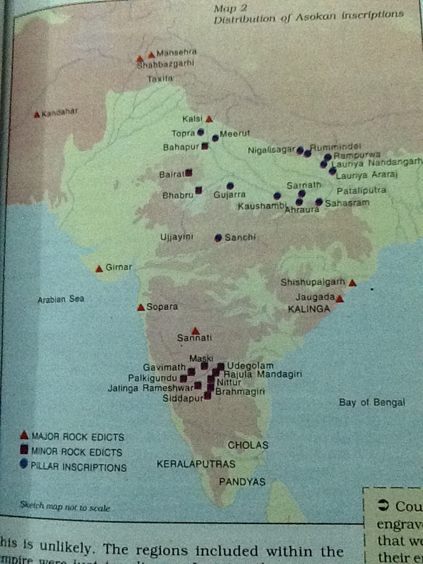
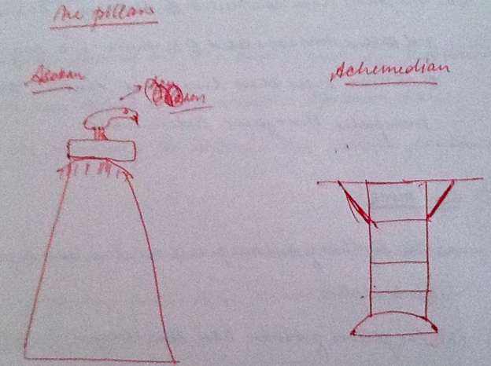
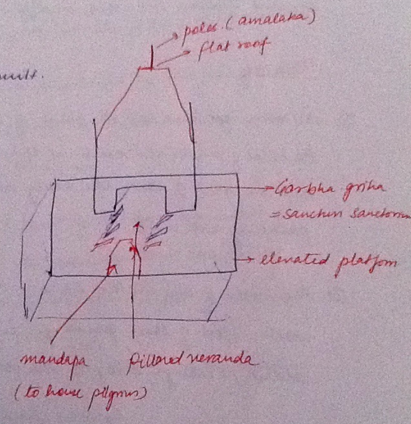

# Culture

### Indus Valley Civilization

###### Science & Technology

[Astronomy]()

- They were aware of directions given they had trade routes, their dead were buried in N-S directions, their town planning made use of directions etc. So they must have used astronomical bodies to gauge direction.
- Recently observatories were excavated from Lothal and Dholavira. 

[Medical Science]()

- They were aware of surgery as evidence of skull surgery has been found from Kalibangan and Lothal. 

[Chemical Science]()

- They used different colors on their pots. 

[Mathematics]()

- Weights and measures of specific standards were used.
- The brisk trade indicates some knowledge of basic mathematics. 

[Metallurgy]()

- Bronze working + copper, gold, silver and tin working. 

[Civil Engineering]()

- They constructed public buildings, embankments, drains, used burnt bricks.
- They knew the technique of water-proofing. 

[Arts & Crafts Techniques]()

- **Industry:** Seal making, precious stone working, bead making and terracotta making were quite advanced.
- **Agriculture:** They used to plough their fields with wooden ploughs as is evident from terracotta plough figurines from Banwali. Plough furrows discovered in Kalibangan. They also had irrigation and water conduits (underground in some areas) and small scale inundation canals (to lead the water where desired) have been found.

###### Architecture

[Features]()

- Used permanent material on a large scale: In villages mud bricks were used with stone being used in foundations and drains. In cities, burnt bricks were used. In Kutch, stones were used on a large scale.
- **Planned :** The bricks were laid in *English bond style*. The bricks had standard ratio. There is no correlation between planning and size of the settlement.
- **Technical knowhow :** They knew the technique of water-proofing. Houses had separate bathrooms near the well and the bathing area was sloping towards the drain and water-proof.
- **Secular**
- **House structure :** Houses sizes differ from large to small ones. People generally lived in houses with a  central courtyard and rooms surrounding it. Doors and windows opened in side streets not the main street. There were double storied houses and staircases as well. Doors were sometimes painted or carved.

[Monuments]()

- Cities were fortified. They had well laid out roads and drains.
- Great bath, assembly hall, granaries. 

[Pillars]()

- Remains of stone pillars have been found from Dholavira. 

###### Paintings

- They used to paint the outer side of their pots with geometrical designs, birds, animals etc. The outer surface of their pots used to be red on which paintings were made in black. 

###### Sculpture

- They made use of metal, alloys, stones and terracotta figurines. Terracotta masks and faience bangles were also made.
- The images were both secular and religious in nature. Examples are numerous terracotta figurines of mother goddess, animals etc., the bearded priest, the bronze dancing girl, the red torso etc. 

###### Music & Dance

- The statue of dancing girl shows they were aware of music and dance.d
- Images of a stringed musical instrument too have been found on some pots. 

###### Pottery

- The pottery was black-on-red ware where both inner and outer surfaces were red. On the outer red surface, designs of birds, animals, geometry were painted in black color.
- The rims of the pots are strong to help in lifting them and moving around. The bottom portion has additional clay as well.    

### Vedic Age

###### Science & Technology 

[Astronomy]()

- Various astronomical bodies like sun, moon, jupiter, venus, mars, saturn are mentioned in Vedas but perhaps their astronomical significance was missing and they were more for astrological / religious use. 

[Medical Science]()

- The system of Ayurveda emerged in this age. 

[Chemical Science]()

- They knew fermentation techniques and made somaras.
- They knew tanning of leather.
- They used different colors on pots. 

[Mathematics]()

- Fire altars. 

[Metallurgy]()

- Technique of bronze making and later iron making were present. 

[Arts & Crafts Techniques]()

- Industry: Carpentry and chariot making were advanced professions. 

###### Architecture

[Monuments]()

1. Vedic texts contain references of huge palaces of kings but no such imposing structures have been found.
2. Wood, mud bricks and thatched roofs were used. 

[Stupas]()

- The term stupa has been referred to in Rig Veda but not in the context as we know it. The term then referred to the fire coming out of the sacrificial altar. 

###### Paintings

- They used to paint their pots. The outer surface of the pots was grey on which they painted floral and geometrical designs.
- On the grey surface, blue color was used to make the designs. 

###### Dance & Music

- Music witnessed progress in the form of the hymns of Sam Veda. 

###### Pottery

- PGW was the distinctive pottery. It was coarse with medium fabric. The outside surface was grey on which blue floral and geometrical designs were made.    

### Pre-Mauryan Age      

###### Science & Technology 

[Astronomy]()

- Astrological charts etc. were prepared. 

[Medical Science]()

- Taxila was a famous centre of medical science. Aitraya was a famous teacher there.
- Bimbisara's personal doctor Dhanvantri was a famous doctor.

[Chemical Science]()

- The polish of NBPW was very glossy. The method to make this polish is also described in detail in contemporary works. 

[Mathematics]()

- Sulvasutra is a text on geometry. It talks about circles, triangles, squares and rectangles. It tells how to make a circle equal in area to a square or a rectangle. 

[Civil Engineering]()

- We find evidences of fortifications and embankments. 

[Arts & Crafts Techniques]()

- Agriculture & industry: The use of iron became widespread.
- Trade: Punched marked coins came into existence. They along with NBPW distribution help us in tracking the trade routes of the age.

###### Architecture

[Features]()

- Wood, mud-bricks, thatched roofs etc. were used.
- Stone fortifications were also used. 

[Monuments]()

- We find evidences of wooden palisade in PP. Stone fortifications existed in Rajgir and Licchavi republic.  

###### Dance & Music

- They were patronized by the court which maintained courtesans. Amrapali was a famous courtesan in Licchavi. 

###### Sculpture 

- There is a reference in King Kharvela's Hathigumpha inscription that Nanda king took away a jina image when he conquered Kalinga. 

###### Pottery

- The distinctive pottery of the age was NBPW. It was highly glossy, medium to fine fabric and would have been used by rich. 

### Mauryan Age

###### Architecture

[Features]()

- Stone masonry reached new heights.
- Shining polish of NBPW was also applied to the stone pillars.  

- Permanent material like burnt bricks, stone began to be used again along with wood. It enabled them to construct larger and durable structure which made denser habitations possible and hence growth of towns and spread of Mauryan culture.
- Ring wells were another distinct feature. Water could be stored in these and also they could be used for sanitation. Hence it became possible to have denser habitations farther away from the rivers. 
- It was both religious and secular in character.
- It was pan-Indian in character.
- Art and architecture received court patronage. Private merchants ad craftsmen also donated for religious causes.
- Large monuments show that architecture was technologically advanced. 

[Foreign (Iranian) Influence on Mauryan Architecture]()

**(a) Similarities** 

- There are similarities between CGM's palace and Darius'.
- Both Asokan and Archimidean pillars use stone, glossy polish and have a bell shaped part. Because the Archimidean pillars were older, the concept of pillars itself was borrowed by Asoka from Iran.

**(b) Differences** 

- CGM's palace was made of wood but Darius' palace was made of stone. 
- In pillars, the shaft of Asokan pillars is monolithic whereas the Archimidean pillars have joints. 
- The shaft of Asokan pillars tapers from bottom to top whereas Archimidean pillars are cylindrical. 
- The shaft of Asokan pillars is smooth whereas that of Archimidean pillars has got grooves.
- Asokan pillars are erected without any support base whereas Archimidean pillars have a support base.
- The bell shaped part of Asokan pillars is at top while that in Archimidean pillars is at bottom. In reality, the so called bell shaped part of Asokan pillars is an inverted lotus.
- The Asokan pillars were not a part of any other structure. The purpose behind their construction was to engrave instructions and carry them fat. But Archimidean pillars were part of palace and their job was to support the roof. 
- The Asokan pillars have capitals which have sculptures of lions, elephants and bulls. But the Archimidean pillars have no capitals and only images of humans are engraved on their shafts.
- The gloss polish was known to Indians from NBPW independent of Iran. 

[Monuments]()

- Stone masonry was introduced on a wide scale. The palace of CGM at Kumrahar (Patna) had 80 stone pillars. 
- During Asokan time, the tradition of wooden arch gave way to stone arch. 

[Pillars]()

- Asokan pillars made use of white spotted red sandstone in Mathura and grey colored sandstone in Chunar and were monolith in style. Only their capitals in form of lions, elephants and bulls were joined from the top.           Stone polishing was as shiny as NBPW. 

[Caves]()

- The practice of cutting caves into rocks began with the Lomarishi caves in Barabar hills and also Nagarjuni Hills which were donated to Ajivika sect. These caves, however, were simple and without much ornamentation. But their gates were carved out as if wooden.     

[Stupas]()

- Initially stupas were Buddha's relic places. Then it got extended to his followers as well and gradually stupa itself became an object of worship. According to Buddhist tradition, Asoka built 84K stupas.
- Some stupas have been found in Sanchi, Sarnath, Deorkothar, Lumbini. Huen Tsang mentions seeing stupas at Tamralipti, Karnasuvarna, Samtata.  

###### Painting

- 63 rock shelters have been found in Deorkothar (Rewa, MP) with paintings. One of them had a painting of stupa and a tree together enclosed in a railing. 

###### Dance & Music

- It was patronized by the court and courtesans were maintained by the court. 
- Nuts, acrobats, singers, musicians, dancers lived in the society and entertained the public specially on fairs and festivals. 

###### Sculpture

- Multiple images of the folk deities such as *yaksha* and *yakshini* and animals such as elephants have been found from Parkham (Mathura) and PP. 
- The capitals of Asokan pillars were beautiful carved images and were added later to the top of the pillars.
- From Dhauli (Odisha), rock sculpture of front part of an elephant has been made. It looks like the elephant is in forward motion and is coming out of the rock.
- A naked and headless torso of a *jina* *tirthankara* has been recovered from Lohanipur (Patna). This is the earliest Jaina image found. 

###### Pottery

- NBPW continued. 

###### The Leisurely Activities  

- Fairs and festivals were organized where magicians, acrobats, dancers, musicians and actors performed.  
- Bull fights, chariot races, horse races and elephant fights, hunting were popular sport.
- Both men and women wore ornaments.
- Courtesans were maintained in the royal court. 

###### Science & Technology    

[Chemical Science]()

- The glossy polish of NBPW continued. In addition, the glossy polish appeared on Asokan pillars.         

[Civil Engineering]()

- Use of burnt bricks and ring wells.
- Stone masonry reached new heights.
- Palaces were constructed. Sudarshan lake was built.

[Arts & Crafts Techniques]()

- Trade: There was great development in means of transport as is evident from the transportation of Asokan pillars. 

### Post-Mauryan Age (North India)

###### Architecture   

[Features]() 

- Burnt bricks were now used for flooring and tiles for both flooring and roofing. This was of indigenous origin.

[Temples]()

- Hindu temples followed 3 main architectural designs - oblong, apsidal or square. Examples of oblong are Vishnu temple @ Besnagar, Siva and Vishnu temples @ Dangwada, Vishnu temple @ Nagari. Examples of apsidal are Lakshmi temple @ Atiranjikhera, Matrikas and Naga temples @ Sonkh. Example of square temple is Siva temple @ Gudimallam. Nagarjunkonda contains temples of all three types.
- In the oblong temples, there were 2 ellipse. The main shrine was in the inner ellipse which was separated from the outer ellipse by a gap which usually was the circumambulatory path. The outer ellipse had rectangular projection leading out to the entrance. The temple usually had a plinth made of bricks or mud or stones and the superstructure was made of wood and mud. The temples were usually east facing.
- The apsidal temples had apsidal rooms, plinths of brick or mud or stone and superstructure of wood and mud.
- The Nagarjunkonda temples apart from having all three designs, sometimes had multiple shrines in which case each shrine had a mandapa (pillared hall) too. The pillars were made of stone and brick was used for the temple superstructure. 

[Caves]()   

**(a) Evolution of Buddhist Cave Architecture**

- *Phase-1 :* It began with the construction of Lomarishi and Sudama caves in Barabar Hills by Asoka. These were simple caves and the cave ran parallel to the rock face after entry. There was one large rectangular room followed by a smaller circular room.
- *Phase-2 :* The second stage (100 BC) showed up at Konditve. The cave was cut perpendicular to the rock face and the inner room now contained a stupa and a circumambulatory path around it.
- *Phase 3 :* The next stage was when rows of pillars were built parallel to the walls creating a circumambulatory passage right after entering. The central roof was high, vaulted and side roof was low and half-vaulted. Bhaja, Pitalkhora, Bedsa caves are examples. Sometimes cells, rock cut beds were cut around the central hall. An example is Bedsa caves.
- *Phase 4 :* During the Kshatrap-Satvahna kings, caves got royal patronage and became more elaborate and ornamented. The basic features of previous phase continued. A variety of *mithun* couples were carved on the gates, the pillars came to have elaborate capitals, the side roof became flat. Multi-storied caves came up. Double storied viharas came up at Karle and triple storied at Ajanta. Other examples are Nasik caves, Junnar, Kanheri caves, Pitalkhora.  

**(b) Jaina Caves vs Buddhist Caves**

- Jaina caves were cut in sandstone which is easy to cut but not good for sculpting. But Buddhist caves were cut into hard rocks and were better for sculpting.
- The Jaina caves had no congregation halls or rock cut shrines. Later, however, some cells were enlarged into shrines. The Buddhist caves on the other hand had clear halls and the shrine area.
- The Jaina cave cells were cut wherever the rock permitted. There was no planning. The Buddhist cave structure on the other hand was well laid out.
- The Jaina caves were simple and reflected the asceticism of jina monks. The cells were tiny (not tall enough to stand, not long enough to stretch while sleeping, small entrances so as to bend very low). The only luxury was occasional shelves cut into rocks and sloping floor acting as a pillow but actually designed to keep of water from accumulating. Only the outer portions were carved sometimes. The Buddhist caves on the other hand were an elaborate and spacious affair.
- The Jina caves are of two types - those without pillars in verandah or those with pillars. Without pillars had cells cut along three sides of the verandah. Pillars were square at top and bottom and octagonal at middle.
- In terms of similarities, the sculptures use similar motifs like animals, plants. The honeysuckle style is similar too. Examples of such caves are Khandgiri and Udaigiri in Puri.  

[Stupas]()

- New large stupas were built. The new stupas had a circumambulatory path, a stone railing around it, two staircases leading up to it, the summit and a stone umbrella over it. The entire structure was enclosed in stone railings and toran-dwars on all four sides. Sculpture decoration was found on the railings and the gateways. Examples are the stupas at Sanchi, Bharhut, Nagarjunkonda, Amrawati.    
- Most earlier stupas used to have a solid core. However, a transition was made towards having a spoke wheel plan at the centre made of bricks and the spaces filled with mud. Spoked wheel is a symbol of Buddha's first sermon. Bhattiprolu stupa (200 BC) is from intermediate phase having central wheel plan (no spokes).
- In AP stupas, at the 4 cardinal points of the raised platform, 5 free standing pillars were erected. These represent the 5 important events in Buddha's life - birth, renunciation, enlightenment, first sermon, death.
- Jaina stupa is  also found in Kankali @ Mathura which is called *Devanirmit* *Stupa*. 

[Pillars]()

- The Besnagar pillar erected by the Greek ambassador Heliodorus is an example. He was an ambassador to the Sunga king. Its shaft contains 4 parts and it has an inverted lotus and a capital.  

###### Pottery

- The pottery was red ware, both plain and polished with fine and medium fabric. The red pottery was of Central Asian origin.
- Sprinklers and spouted channels are the distinctive pots of this age. 

###### Sculpture

[Image Worship]()

- The tradition of image worship became popular and numerous idols were made. Images of yaksha have been found from Pawaya, Besnagar which represents Kuber. Colossal images of yakshas and yakshis were built in Mathura which disappeared later as the religion got absorbed into the dominant religion. Naga images have been found at Mathura and Karimnagar. Gaja-Lakshmi stone plaque from Atiranjikhera and mukhalinga from Gudimallam are another examples. In Buddhism, earlier the tradition of image worship was absent and instead symbols of Buddha were worshipped along with the stupa. Now images began to be built.
- Terracotta images were made and Chandraketugarh, Mathura emerged as great centers.

[Buddhist Relief Sculpture]()

- The railings and gateways of Buddhist structures were elaborately worked upon. Human bodies along with animals, birds and others came up. The landscape didn't form a background but was very much a part of the sculpture.
- The sculpture was mainly meant to be seen from one side as against the Mauryan sculpture which was same as viewed from any side.
- The sculpture was narratory in nature. It narrated incidents from Buddha's life and Jatak stories. Sometimes these narrations were just one single screenshot of a story or sometimes it was a continuous narration of a sequence of events with one scene merging seamlessly into the next.
- It made use of symbols to tell the stories. Example, wheel for first sermon, birth of buddha as Maya sitting on a lotus, enlightenment as bodhi tree.
- The Buddhist sculpture also drew heavily from other religious traditions. For example, anthromorphs (of copper hoards), yaksha, yakshis, nagas, pipal, animals etc. 

 [The Gandhara School]()

- This school emerged from 1 cent BC onwards. It was not patronized by Indo-Greeks but by Sakas and Kushanas. Hadda and Bamiyan were main centers.
- This was a fusion of Greek and Indian styles from the very beginning. The subjects were Indians and the style was Greco-Roman. Thus the mother of Buddha resembled a Greek goddess while Buddha himself too had an Apollo like face. Greek gods were depicted as paying obeisance to Buddha.
- The Buddha of this school is depicted with focus on bodily features such as muscular body, curly hair and semi-transparent clothes. 
- Initially they used soft material such as wood and stucco. Later they began to use blue-grey stone. 

[The Mathura School]() 

- It was the oldest and flourished from 2 cent BC onwards. It was indigenous in origin and was patronized by local rulers. But later with the advent of Kushanas, foreign influence was visible clearly.
- Initial subjects were Buddha, Mahavira and Kanishka. Krishna was ignored before the Gupta period. Beautiful images of Siva as *ardh-nari-ishwar* were built. Krishna, balram and Surya too were its subjects.
- The images have a deep spiritual outlook. Buddha is shown in meditation mode. Focus is not on highlighting the bodily features of Buddha but on his spiritualistic aura and content on face. Popular depictions of Buddha are in the *Padmasana-mudra* (sitting crossed legged and meditating) and *Dharma-Chakra-Parivartana-Mudra* (giving sermons).
- They used white spotted red sandstone. 

[The Amrawati / Vengi School]()

- It flourished from 1 cent BC onwards in Vengi, Nagarjunkonda, Kurnool and Krishna - Godavari region. 
- It was indigenous throughout and was patronized by Satvahnas, Ikshavakus and later Vakatakas. 
- It made images of Buddha and brahmanical deities.
- These images are famous for their feminine beauty and sensuous appeal. 
- They used white marble in their images. 

###### Drama

- The Greeks introduced the curtain in Indian drama. 

###### Painting

- The cave paintings of Ajanta began in this period. They were Buddhist in character.                   

###### Science & Technology  

[Astronomy]()

- Indian astronomy and astrology drew a great deal from the Greeks including the term *horasastra* (astrology in Sanskrit) itself from Greek term *horoscope*. The names of seven days and the zodiac signs all come from Greeks.    

[Medical Science]()

- **Charak** belonged to this period and was associated with Taxilla school of medicine.
- We find many brahmanical texts on medicine written which could have obviously been written by those who had a formal education and yet brahmanical literature places medical practitioners at low level. Thus despite the theoretically low level the social utility of such professions was high enough to warrant formal education and medical practice. Veterinary sciences developed and books on horses and elephants were written (obviously driven by military needs). 

[Arts & Crafts Techniques]()

- **Industry :** Leather shoes, glass making (due to contact with Romans).
- **Trade :** The Greek coins were a great improvement over the ill-designed punch marked coins. Pliny tells us that Indian ships were 75 tonnes and some other sources tell us they could carry 700 persons.
- **Agriculture :** A hydraulic lift has been found in Sringverapura which may not have been used for irrigation per se but the technology for moving water by varying the water levels may have been derived from or influenced irrigation. We also find the use of wheel to draw water from the well. The literature as well as inscription provide ample evidence of tanks, wells and embankments.

[Metallurgy]()

- Indian iron and steel technologies made rapid advancements and large number of iron implements were made which were even exported to Abyssinian ports. 

[Civil Engineering]()

- The Sudarshan lake was repaired by Rudradaman.
- Cave architecture progressed, highly ornamented multi storied viharas were built. 

### Post-Mauryan Age

#### Satvahnas

###### Architecture 

[Use of Burnt Bricks and Tiles]()

- From Peddabankur (Karimnagar), we have found use of flat baked bricks, perforated roof tiles and 22 brick wells. This facilitated dense habitation as it addressed the issues of sanitation, drinking water and durability of structures.

[Fortifications]()

- The Satvahna towns were fortified. Pliny talks of over 30 walled towns. 

[Caves]()

- The tradition of cutting into rocks reached new heights under Satvahnas. It became associated wit Buddhism and many *chaityas* (shrines) and *viharas* (monasteries) were cut out in rocks. Famous chaitya is at Karle and viharas at Nasik. Chaitya was a large hall with a number of pillars. Vihara was a large hall which was entered by a door which separated it from the verandah in front.                       

[Stupas]()

- Famous stupas are at Amaravati and Nagarjunkonda. 

#### Sangam States in Tamil Land

###### Literature

- The Sangam texts are the most important pieces of work. They were composed by brahmans of Prakrit-Sanskrit learning.
- Tamil text *Tolkkapiyam* deals with grammar and poetics and *Tirukkal* with philosophy. Then there are epics *Silappadikaran* and *Manimekalai.* Silappadikaran was written by a Jaina scholar and is a love story of a dignitary preferring a courtesan over his wife. Manimekalai is the adventure story of his daughter. These epics throw light on the socio-economic life of the Sangam age. 

### Gupta Age

###### Religious Practices

- Idol worship reached its true popularity in this age. The agricultural festivals were also given much of their religious color and fanfare in this age. 

###### Paintings  

- The greatest specimen of Buddhist art in Gupta times is the Ajanta cave paintings. They were built from a period spanning from 1 cent to 7 cent AD. But most work was done in Gupta age. They depict various scenes from the life of Buddha and his previous births. They are life-like, natural and have brilliant colors even after all these centuries. Ajanta paintings were dominated by buddha, bodhistava, jatak stories, natural scenery, animals etc.  But it cannot be said that Guptas patronized these paintings.
- Even though the theme is religious in most paintings, we also find a glimpse of the lives of the princes, kings, samantas etc. in them. But there is no reflection of the common man's life in these paintings. In this way they reflect the contemporary society and its values as well.
- Bagha paintings have a materialistic theme and tell us about the contemporary clothing style, hair styles, makeup, ornaments etc. Bagha paintings were made in Gupta period only as against the Ajanta paintings which were spread over multiple periods. So they have more uniformity. They also have more secular theme and scenes and thus are more valuable as a historical source.
- Both the *fresco* and the *tempera* styles were used. The fresco style paintings are made on wet plaster and the tempera style paintings are made on dry plaster.
- Kamasutra tells us that painting was an established form of art and was studied in a systematic way.

###### Sculpture

- The Mathura, the Gandhara and the Amaravati schools continued and new school developed at Benaras / Sarnath. PP also became an important center.
- Statues were made of both stone and metals and carved on caves, temples or free standing. The relief sculpture showed scenes from religion as well as everyday life.
- Statues of Buddha were built at Mathura and Sarnath. Buddha images now had more mudras and wore transparent clothes. One bronze image of Buddha has been found from Sultanganj. The Buddha images from east UP and Bihar show Buddha in a serene spiritual form (as against the emphasis on the body as in the Gandhara form). The images had a large and clear prabhamandal as against the Gandhara images where such a feature was not prominent. The Buddhist relief sculpture made an attempt to absorb the yaksha, gandharva, apsara traditions by depicting them on their relief sculpture.
- Images of Jina tirthankaras were also sculpted. Inscriptions at Udayagiri (Vidisha) and Kahaum (Gorakhpur) talk about establishing tirthankara images.
- For the first time images of Hindu gods were built. Sometimes these images were solo and sometimes the image of the main god was accompanied with other minor gods. Vishnu images in human, varah as well as anthromorphic forms. Shiva images came up in linga and anthromorphic forms. Images were often more symbolic than representational - thus the gods and goddesses may have multiple hands each holding a symbol.              

###### Architecture

[Features]()

- Both religious and secular character was visible though religious was more prominent.
- Temple architecture came up. The first style was the *nagara* style.
- There was increasing use of re-used or broken bricks. Eg. Bhita in Allahbad.
- Gupta period can be called the golden age of sculpture and image making. But the same can't be said for architecture because the temple architecture form (nagara) just emerged in this phase and yet it peaked only in the post Gupta age. Thus while impressive buddhist viharas and chaityas can be seen from the Gupta age, we have to wait until the 8th century to see impressive temples.

[Monuments]() 

- The Buddhist university of Nalanda came up in this age (5 cent AD). Its earliest structures were made of bricks in this age. 
- Jina temples were constructed mostly in S India by Kadambas. The Hoskote (Bangalore) and Banavasi inscription are examples which mention of land grants to such temples. 

[Temples]()

- The first brick and stone temples were built in this age. They were of Nagara style.   

- The early temple was built on a raised platform. There was a main deity room called *garbha-griha* then two rows of pillars leading to a smaller room in the front of the garbha-griha called the *mandapa*. The mandapa was used to house the devotees. The garbha-griha had a flat roof and a pole on top. The entire compound was like and enclosed courtyard and walled with gates for entry and exit. Temple walls were plain but the doorways were profusely carved. Temples were generally built from rock.
- Examples of such brick temples are Bhitargaon (Kanpur), Paharpur (Rajshahi, Bangladesh), Sirpur (Raipur, Chattisgarh), Vishnu temple @ Deogarh and  Tighwa, Shiva temple @ Bhumra and Koh, Parvati temple @ Nachna. There are remains of a temple from Dah-Parbatia in Assam.
- Later the influence of Dravidian style also became visible. The temple had a plinth and a shikhara. The pillars of these temples have capitals in the form of *kalash*. Deogarh temple is one such example with a *vimana* on top.  

[Caves]()

- The Buddhist caves include Bagha caves, Mandargiri and Udaigiri. The pillars were richly carved and on the stupa, a Buddha was carved. In the viharas, a shrine room was now introduced. 
- Shiva caves were built in Elephanta.  

[Pillars]()

- The Mehrauli iron pillar.
- The Bhitari stone pillar inscription of Skandagupta. 

[Stupas]() 

- The independent stupa building activity lost momentum. Few examples are Dhamekh stupa @ Sarnath, Charsada, Taxila. However, the stupa building in Buddhist caves continued.   

###### Drama

- Two things are evident from plays of this age. First, the higher classes speak Sanskrit whereas shudras and women speak Prakrit. Second, none of them are tragedies.
- The Sanskrit drama *Mrichchakatika* (by Sudrak) was composed in this age. It was the love story of a brahman in love with the daughter of a courtesan.
- 13 plays were written by Bhasa.  

###### Literature  

- A different ornate style of Sanskrit was developed during this period which was different from the old simple Sanskrit. Greater emphasis was laid on *kavya* than on prose. The audience of the kavya literature was mainly an urbanite and it was played in goshtis and festivals. This literature was not for religious purposes but focused on urban life.
- The transition from Prakrit to Sanskrit in royal inscriptions was complete.
- Patanjali composed *Mahabhashya* and Panini composed *Ashthadhyayi.* Amarsimha composed *Amarkosha.*  Kamandak wrote Nitisara and Vatsayan wrote Kamasutra.
- The epics, the sutras etc. were compiled in this age. Panchatantra too was written under Vakatakas. Various commentaries on philosophical schools were written in this period.
- Plays were romantic comedies and tragedy was avoided. Mrichchha katika was written by Shudrak and gives a description of urban life. Mudrarakshasha was written by Vishakhadutta. 

###### Dance & Music

- Gupta rulers patronized music and dance and some rulers themselves were indulged in it. Samudragupta is depicted as playing veena in some of his coins.
- The growth of temples led to growth of dance and music as well. The institution of devdasis began. 

###### Science & Technology   

[Metallurgy]() 

- Bronze and iron technologies advanced further as evident from the Mehrauli pillar and Buddha's bronze statues. 

[Astronomy]()

- Aryabhatta came up with *Aryabhattika* in 5 cent AD. He also gave true reason for the occurrence of eclipses and measured the circumference of earth. He believed that earth was spherical and rotated on its own axis.
- Varhamira in 6 cent AD explained the movement of some heavenly bodies in his book *Brihad-Samhita*.
- Previously the year was divided into 3 units of 4 months each. Now it came to be divided into 12 equal lunar months. This was useful for agricultural operations. (Matharas of Odisha)  

[Mathematics]()

- Aryabhatta came up with zero, three variable equations, concept of place value and the decimal system.

[Medical Science]()

- Benaras school was a famous school of surgery. Sushruta came from there.
- Dhanvantri was a great physician and in the court of CGV.
- Palkapya wrote *Hasti-Ayurveda.* Sialhotra wrote *Asva-Shastra.*
- Nagarjuna discovered medicinal properties of certain metals and herbal juices. 

[Chemical Science]()

- Varhamira and Kalidasa in their respective works talk about the method of preparing various colored pastes.
- The paintings in caves of Ajanta and Bagha use rich colors. 

[Civil Engineering]()

- Brick temples began to be constructed in the *Nagara* style.

[Arts & Crafts Techniques]()

- Trade: Ship building industry flourished. Large ships capable of carrying 500 persons were built.

###### An Estimate of Gupta Age

- **Aryabhatta**'s and **Varahmihira**'s principles were not all indigenous. THey had also borrowed from the Romans and the Greeks.
- **Kalidasa**'s work are not a symbol of any Hindu intellectual renaissance but they are merely a developed form of an older style of writing. Even puranas and epics were composed in earlier age, Gupta scholars merely compiled them. 
- **Bhakti movement in Vishnu and Siva sects** was not a new phenomenon. It was a mere continuation and strengthening of an older strand.

### Post-Gupta Age

- The growing feudal order in the society limited inter regional mobility and gave a boost to the development of regional cultural strands. Even the inscriptions are in all different scripts such that even if we know Gupta brahmi script, it would be difficult to read various regional inscriptions.

###### Science & Technology 

[Astronomy]()

- Brahmagupta in 7 cent AD in his book *Brahma-Sphuti-Siddhanta* talked about various astronomical instruments and suggests observation based astronomy.
- Bhaskaracharya in 12 cent AD in his book *Siddhanta-Shiromani* explained the motion of heavenly bodies. 

[Medical Science]()

- Vaghavatta in 8 cent AD wrote *Ashtanga-Hridaya* which explained the functioning of different parts of heart. Dhanvantri wrote Nighantu.

[Chemical Science]()

- Indian chemists made great progress in alchemy (due to tantric and magic influence). They were trying to convert metals like iron, copper etc. into gold. Obviously they didn't succeed in that but in the process they made many acids and bases. 

[Mathematics]()

- Bhaskaracharya's book had an elaborate chapter on mathematics called *Leelavati.*
- Brahmagupta developed the concept of cyclical quadrilateral i.e. sum of the the opposite angles of a quadrilateral is 180 if all its vertices lie on a circle. 

[Metallurgy]()

- Large umber of fine bronze sculptures were made specially of the natraja theme. 

[Civil Engineering]()

- Large embankments, canals etc. were built in this period for irrigational purposes.
- Huge temples were also built. 

[Arts & Crafts Techniques]()

- **Agriculture Technology :** Irrigation increased, use of animals for threshing and milling sugar and oil, persian wheel, and use of one-humped camel in dry areas.
- **Manufacturing Technology :** Cotton gin came up in weaving.
- **Military Technology :** Leather and wooden stirrups were there but iron stirrups, concave saddles and iron horse-shoe were absent. Horse-archery was also absent. Use of fire-arms and mangonels was absent as well.  

###### Architecture

[Features]()  

- Religious.
- Court patronage.
- Rock cut, shaped or use of permanent material.
- They didn't use arch, vault, dome and mortar. So when they began to construct huge buildings there was no way other than constructing tapering pyramidical tops or to install thick pillars to support heavy beams. So larger and larger stones had to be used and this necessitated the need for sculpting them for aesthetic appeal.
- Highly ornamented, elaborate, massive and advanced technology.
- Multi-dimensional i.e. many forms of architecture were pursued.
- Indigenous.
- The notion that the architect must remain anonymous was belied in the temples of this age and the most famous architect was Kokasa. Individual enterprise and style was encouraged but at the same time texts were written on architecture (vastusastra) which led to some standardization. It also proves that despite the brahmanical literary rhetoric, architect caste was not held in low esteem in reality (otherwise why a brahman would study architecture and write a text on it). Similarly *shilpashastras* were written on sculpture. The *sutradhara* was an exalted position and he supervised the construction activity while the *stapathi* was the master builder. Some of them even received land grants and were held as belonging to the visvakarma lineage.

[Styles]()

- The *dravida* style temples: It was prevalent in the south of Krishna river. In the phase 1, the main feature was building pyramidical shikhara above the *garbhgriha* (chief deity room). The shikhara had a dome at the top and this entire  structure was called vimana. Later in phase 2, in front of the vimana was a pillared hall with elaborately cared pillars and flat roof called *mandapa*. A circumambulatory path was provided around the garbhgriha and images of multiple gods were carved along this passage. The entire structure was walled and had lofty gates called *gopuram*. In phase 3, additional structures began to come up in the temple complex and they grew horizontally and became more massive. Ajanta and Ellora are examples as well.
- The *nagara* style was prevalent north of Vindhyas. It consists of (a) a square elevated platform with a number of projections in the middle of each side giving it a cruciform shape, and (b) in the later age the flat roofed temples gave way to a shikhara (which reflected the temple's plan) on the main shrine and smaller shikharas on the secondary shrines.
- The *rath* temple style: In the rath temples, entire rock was cut and shaped from outside to give it the shape of a temple. Beautiful images were then carved on it.
- The Chalukyas of Badami patronized the *vesara* style (prevalent between the Krishna and the Vindhyas) which was a fusion of the dravidian style and the nagara style. Such examples are found @ Aihole and Pattadakal. It was prevalent from Vindhyas to Krishna. Like dravidian style it had a vimana, a mandapa and in some cases an additional open mandapa. Like nagar style the vimana was heavily sculpted. Like nagara style its circumambulatory path was open. Like nagara style the outer walls had chariots carved out on them. Other examples are Jaina temples in Dharwad and Kalleshwar temple in Kukanoor (Hyderabad).

[Caves]() 

- **The Pallavas :** They built the cave temples of 4th generation with elaborate pillars and ornamented entries. This was under the Mahindra style (640-74 AD ) and the Mamalla style (640-74 AD). The cave pillars are square from bottom and top and octagonal in the middle. These caves are less complex than those @ Ajanta and Ellora.
- **The Chalukyas of Badami :** They too patronized cave architecture. 4th generation caves were cut. 

[Ellora Caves]()

- **Political Dimension :** They represent different dynasties. The famous Kailashnath temple was built by Rashtrakutas.
- **Religious Dimension :** They represent different different religions. Caves are there from Jaina, Buddhist and Hindu traditions. Even in Hindu tradition, they represent multiple gods and multiple forms of the same god as well. The Buddhist cages represent the last in the tradition of Buddhist cave cutting. It shows a development over previous styles. They are multi-storeyed and highly ornamented.  The Kailashnath temple contains images of Shiva pantheon as well as Vishnu.
- **Architectural Features Dimension :** They represent multiple styles of architecture. The famous Kailashnath temple has a superstructure in Dravidian style. It is multi-storeyed and highly ornamented.  

[Temples]()

- **The Ganga rulers of Odisha :** They patronized temples between 8-12 cent AD. The Lingaraja temple @ Bhubneswar, Jagannath temple @ Puri and Sun temple @ Konark were all built during this period. The Odisha temples have pyramidical shikharas on their mandaps as well. They also typically have chariots carved out on their outer walls. Moreover the main shikhara has multiple smaller shikharas at the top. There is a gate in each direction. The sculpture of the Konark temple shows clear evidence of tantric influence like the temples of Khajuraho.
- **The Solanki rulers of Gujarat :** They patronized many temples in Mt. Abu. The Dilawara and Tejpala temples are most famous Abu temples. White marble was used in construction. They also built the Karnameru temple @ Anhilwara and Rudramallah temple @ Siddhpur. The temples of Gujarat are immensely rich and were studded with semi precious and precious stones. Such a lavish temple building was possible only due to immense prosperity brought by the trade. It also reflected the high level of skills mastered by the guilds of sculptors in Gujarat. A characteristic feature of this style was the present of bawris in the basement for water storage.
- **The Chandela rulers of Bundelkhand :** They patronized the Khajuraho temples. These temples are built of granite and red sandstone. Kanderiya temple @ Khajuraho is the only temple in Khajurao to have shikhara (reflecting Dravidian influence). The central Indian temples are known for their extensive use of richly carved pillars. Each mandapa has thin shikharas. The khajurao temples are in panchyatan style i.e. there are smaller temples on the 4 corners of the plinth. All temples are built on a plinth. These temples clearly show the influence of tantricism.
- **The Pallavas :** Their architecture was divided into the *Mahindra* style (610-40 AD), the *Mamalla* style (640-74 AD), the *Rajsimha* style (674-800 AD) and the Nandivarman style (800-875 AD). Cave temples called *mandaps* were cut in Mahindra style. They were essentially chaityas and viharas of 4th generation. Examples are @ Pallavaram and Mahendrabad. In the Mamalla style, rath temples were cut in addition to the cave temples which became more ornamented. There are 5 Pandava rathas. Examples of both styles are @ Mahabalipuram. In the Rajsimha style, cave and ratha temples were discontinued and independent dravidian style temples emerged. Examples are the Shore temple @ Mahabalipuram and Kanchi. In the Nandivarman style, the Pallava power was on a decline and this was reflected in the temples as well which became smaller and less elaborate. Examples are @ Kanchi and Gudimallam.
- **The Cholas** : They picked up on the the dravidian style and took it to new heights. The early Chola temples were relatively small and superb in simplicity. One example is the Narttamalai temple of 9th cent - a free standing temple facing some rock cut caves. From 11th cent AD the vimanas (pyramidical shaped) and gopurams (which gradually overwhelmed the shikharas) became massive. The garbhgriha was entered by one or more massive mandaps with multiple pillars. The balanced proportion of the structure gave it aesthetic quality. The temple complex grew horizontally as numerous smaller structures came up. This was linked to the military victories of the Chola kings. Examples are @ Padupattu & Tanjore. After there decline we can see that no attempt was made to maintain the grandeur of the temples and this is a reflection of the economic decline which had set in.
- **Kerala :** Here the temples were made of wood instead of stone and many temples were circular in form - the circular sanctum being surrounded by concentrically arranged areas.
- The Chalukyas of Badami: The Chalukyan temples evolved from Gupta style and their architecture developed into the *Vesara* style which is a fusion of dravidian style and nagara style. Examples are some temples @ Aihole & Patdakal. The Durga temple @ Aihole is a continuation of the Buddhist chaitya plan. Aihole had megalithic stone worship centers in the vicinity and thus emerged as a sacred town. Cave temples are located @ Badami. The Ladkhan temple @ Aihole has a flat roof and a pillared mandapa. The comparison of plans of Ladkhan temple and the Virupaksha temple show us the rapidity of the change in architectural styles.
- The Hosyals: They built elaborate temples in Halebid, Somnathpura and Belur. Their temples are known for excellence in relief sculpture. Earlier they just picked up from the Chalukya style. Gradually they became more ornate (they began to use soapstone rather than sandstone which is softer). The ground plan of these temples was no longer rectangle but star shaped or polygonal and the whole complex was built on a raised platform. There was not so much emphasis (as in Chola temples) on shikharas and gopurams and thus the overall temples appear 'flat'. On the temple walls elaborate sculpting is done using animal and floral motifs, musicians, dancers, battle scenes, and religious literature events. The star shaped plan provided more space for sculpting.  The wide, circular pillars are a distinctive feature.

###### Sculpture

[Temple Relief]() 

- The temple walls were carved with images of gods and goddesses and their attendants, yaksha and yakshis, kings and queens etc.
- They show scenes of wars, love, dance and music. The Tiruparantik form of Diva is popular in the Brihadeshwara temple @ Tanjore.
- In N India the sculpture @ Khajurao, Odisha shows clear tantric influences. The sculptures are exquisitely materialistic in appearance an reflect the contemporary society. We can see the cosmetics, clothing style, hair styles etc. of women in the society.
- The Pallava sculpture was inspired more from the Buddhist tradition of Amaravati school and remained linear and avoided over ornamentation - something which was present in the Chalukyan sculpture.

[Independent Sculpture]()

- The bronze dancing figure of Shiva i.e. Natraja became a popular theme under Cholas and Rashtrakutas. The dancing Siva has 2 types - angry and pacific symbolizing the creation and destruction of universe. The snake is the ornament and Ganga in his hair locks. Two back hands hold a flame and a drum while the front hands are in abhaya mudra and one points down towards feet.
- The bronze images used lost-wax technique. These figures were solid from inside unlike the N Indian sculpture which was hollow from inside.
- Images of kings and queens were also built in this period and placed in the temples.
- World's largest monolithic statue is the Jina statue of Gomteswar is present at Sravana Belgola (Hassan, Karnataka).
- In S India, there was a tradition of hero stones or *viragals*. They hold a sword in right hand, bow / shield in left and arrows on shoulder. Usually there is an inscription recording the deeds of the hero.
- In N India the images lack the grandeur of the Gupta age - probably because now they were mostly of gods and goddesses to be used mostly for worship. 

###### Painting

- **The Chalukyas of Badami :** The cave paintings of Ellora and Elephanta belong to this period and contain themes of secular nature, brahmanical religion, Buddhism as well as Jainism (Ellora). One cave painting shows Pulakesin II receiving a Persian ambassador.
- **The Rashtrakutas :** They continued the Ellora and Elephanta cave paintings. Kailash temple was built by Krishna I. 

###### Dance & Music

- Temples played a vital role through the institution of devdasis, employing dancers, musicians, singers etc. and also through multiple festivals from the Pallava period onwards. The devdasis initially also composed poems and performed some temple rituals which were related to the idea of the special power embedded in women (a S Indian original concept) and rituals and dance were an expression of it. But gradually this was later misused to providing entertainment to influential priests and persons.
- First books on music began to come up. Narad wrote Sangeetam Karanand, Someshwar wrote Manollas.

###### Literature

- While Sanskrit was the language of the elites, a remarkable feature was the growth in literature of regional languages. By the end of this age, regional languages had overtaken sanskrit.
- The literature of this age also mentions brahmanical rituals less frequently indicating growth of bhakti. Erotic mysticism also finds its way into the literature of the age reflecting the influence of bhakti. Bilhana's Chaurpanchasika and Jayadeva's Geet Govinda are examples.
- Medium of instruction of formal language was Sanskrit which shows its growing distance from day to day life. Professional education was provided by the guilds. But in some professions we do find sanskrit works being written indicating some confluence.

[Jaina Literature]()

- Sanskrit also began to be widely used by Jainas and Buddhists by this time. The jainas were prolific in writing biographies, chronicles of kings and courts and texts on religion. Hemchandra (12th cent) and Merutunga (14th cent) were famous scholars. An interesting aspect was writing stories on Rama from a jaina perspective.
- The jains insisted on literacy and thus preserved and re-copied their texts as a treasury in the jaina temples. These developed into impressive libraries. By now a new sharda script was used which was closer to devanagari than brahmi.

[Sanskrit]()

- In most sanskrit works of the age we find lack of original and innovative thinking. They were merely commentaries on old subjects from epics etc. This age also lacks important texts on politics like Arthasastra and Nitisara. Focus was more on linguistic proficiency. The spread of Sanskrit grew in S India along with the spread of Brahmans and because of the proximity to kings much of the literature has political motives.
- There was a trend of growing ornate style in Sanskrit championed by Banabhatta. This was specially because of the royal patronage scholars used to receive. This period witnessed the growth of kavya as well as grammar.
- There was a growing trend of writing histriographies like Kalhana and Bilhana (*Vikramankdevcharit* - a historical epic but written to please a king who had usurped the throne from his elder brother). Attempts were made to provide vanshavalis where descent was traced from mythological lines.
- A new style known as "shlesha style" emerged. An example is Shrutikirti's Dwisandhan which when read from left to right tells the story of Rama and when read from right to left tells the story of Kauravs.
- Brahmagupta, Bhaskaracharya, Vaghavatta and Kalhana wrote in this age. Sanskrit dictionary was composed in this era by Amarsimha (*Amarkosha*). Important plays were Mudrarakshah by Vishakhdatta, Bal Ramayan and Bal Bharat by Rajshekhar.
- Sanskrit texts on various professions like krishiparashar, shilpashastras, vastushastras, veterinary sciences etc. were written reflecting social priorities.

[Regional Languages]()

- **Prakrit :** It gradually became very heavy and lost out to Pali and Sanskrit and even Jaina scholars began to write in Sanskrit while buddhist scholars in Pali.
- **Tamil :** Alvars and Naynar saints popularized it from 6-9 AD. Their writings were collectively compiled in 12th cent and called *Tirumurais*. Tamil literature witnessed great development. Sometime the subjects were taken from Sanskrit works like Kamban wrote Ramayna in Chola period but it was not merely a translation of the Valmiki ramayna as the style, treatment of gender and even the narrative was varied according to the local tradition. Thus he treats Ravan in a much more sympathetic way than Valmiki. In the Pallava age the tamil poems contain rich description of general country life as well as the town life in Kaveripattnam. Confidence in Tamil can be seen in its use along with Sanskrit in inscriptions.
- **Kannada :** Amoghavarsha (Rashtrakuta king)wrote the first work in Kannada poetry. It was patronized by Rashtrakutas, Chalukyas and Hosyals. Pampa, Ponna and Ranna (the 3 Kannada jewels) wrote in this age.
- **Apbhramsha :** The Rashtrakutas patronized it and many poets in this language lived in their courts. The doha style of writing began to come up in this age and specially popularized by the bhakti movement. The bhakti saints also popularized other languages like Odiya, Bengali.
- **Telugu :** It was patronized by Rashtrakutas, Chalukyas and Hosyals. Mahabharata was written under Chalukyan kings.  

### Vijaynagar

###### Architecture

[Features]()

- Religious as well as secular.
- Court patronage.
- Rock cut, shaped or use of permanent material.
- Highly ornamented, elaborate, massive and advanced technology.
- Multi-dimensional i.e. many forms of architecture were pursued.
- In the 14th century, it was influenced by deccani style of Chalukyas and Rashtrakutas. During 15th century, a typical Vijaynagar style called *provida* style emerged. Basically it was an advanced version of the dravidian style. In 17th cent, the nayak style emerged (nayaks were the feudatories of Vijaynagar kings).

 [Temples]()

- In the provida style, the structures of the chief god and goddess were separated and the goddess structure was called shrine of the  "Amma". A new structure called *kalyan* *mandap* came up which was used for the ceremonial union of the chief god and the goddess. A thousand pillar hall was created in the temple complex for the devotees. The gopurams became bigger and more ornamented.
- Examples are Viruprakash temple and Hazaraswami temple @ Hampi.
- The nayak style temples were bigger and more ornamented. Example is Meenakshi temple @ Madurai. 

[Monuments]()

- Palaces, queens' baths, stables etc. were constructed. Example is Lotus palace of Krishnadevrai.  

###### Sculpture

- Secular sculpture developed with bronze images made of kings and queens.

---

<a href="literary-sources" class="prev-button">← Previous: Literary Sources</a>          

<a href="maps" class="next-button">Next: Map Work →</a>

