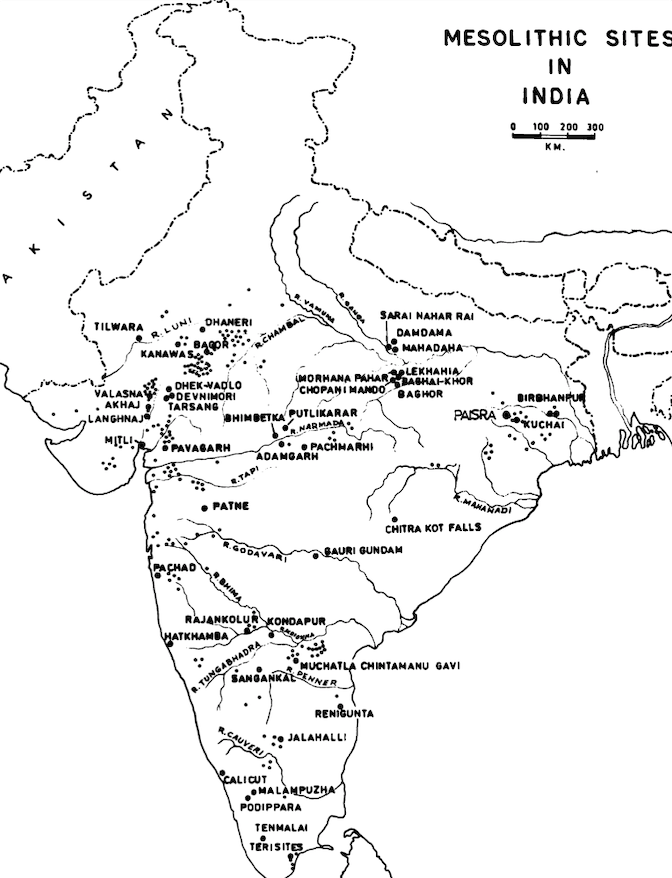

# Stone Age

There are different types of stone ages:

- Paleo-Lithic Age
- Meso-Lithic Age
- Neo-Lithic Age
- Chalco-Lithic Age

## Paleo-Lithic Age

###### PaleoLithic Sites

###### Art

1. Bhimbetka.
2. Patne ostrich shell. 
3. Baghor I, upper paleolithic site. In the middle of a circular platform made of sandstone rubble, a rock with concentric triangles painted in light yellowish red to dark reddish brown have been found.

###### Religion

1. In the auditorium cave of Bhimbetka, one rock with 7 cup engravings and another rock with one single large cup mark along with a meandering line has been found. One explanation is that it was used as a gong in some kind of ritual. Time period is lower - middle paleolithic.
2. Baghor I in MP from upper paleolithic. In the middle of a circular platform made of sandstone rubble, a rock with concentric triangles painted in light yellowish red to dark reddish brown have been found. This indicates pagan worship. The pieces of the rock when joined together form a triangle itself.  

###### Community Life

1. They lived in more or less permanent homes. This indicates sufficiency of food and other resources. Their houses were made of stone, grass, wood, leaves etc. There were some sites which served as temporary habitation only - people came, lived for a certain part of an year and went away. Some sites were connected to specific activities.
2. Their social organization was "band based" i.e. they were organized in a small group which moved together. There was division of labor based on age and sex. There were no formal institutions, no chiefs etc. No one had a superior claim on the resources. 

## Meso-Lithic Age

###### Meso-Lithic Sites

###### Art 

1. The paintings show animals singly as well as being hunted. Hunting scenes are depicted.  Snakes are absent. There was the famous Bhimbetka boar who had the body of a boar but other features of a rhino, elephant and buffalo.
2. The paintings sometimes sow internal organs of human beings including fetuses in the womb. The male figures look like matchsticks whereas the female figures were sometimes fuller. There were masked dancers or the dancing sorcerers.
3. They clearly depict a division of labor based on sex.

###### Religion

1. The paintings show fetus in a womb. Figures of men and women symbolizing fertility are quite common.
2. Dead began to be properly buried and grave goods indicate ideas of after life. There are also double burials, not necessarily that of a man and a woman (indicating family life not yet begun in any systematic manner) and also average age was approximately 30 years.

###### Community Life

1. In the Bhimbetka paintings, hunters are shown hunting in groups as well. They used to wear masks, crowns and ornaments made of bones. In hunting, they made use of projectiles as well as sticks. They had dogs to accompany in hunting and they laid traps as well for their prey.
2. In order to make small tools, it was necessary to change from using pebble stones to a different kind of stone like quartz, chert, agate, chalcedony etc. which is easier to flake. Thus we see habitats shifting away from river banks and closer to the hills.
3. Postholes have been found which indicate that people began to live in huts (and out of rock shelters and caves).

---

<a href="periodic-ancient-history" class="prev-button">← Previous: Periodic Ancient History</a>          

<a href="agricultural-pastoral-megalithic" class="next-button">Next: Agricultural, Pastoral & Megalithic Cultures →</a>