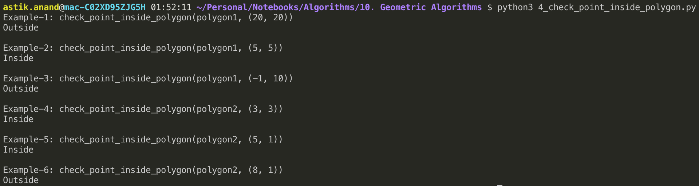

# Geometric Algorithms

These algorithms are designed to solve Geometric Problems. They requires in-depth knowledge of different mathematical subjects like combinatorics, topology, algebra, differential geometry etc.

#### Concept of Orientation 

Orientation of an ordered triplet of points in the plane can be:

- Clockwise
- Anti-clockwise
- Collinear


<br>


------

### Standard  Geometric Algorithm Problems

## 1. Check if  2  line  segements  intersect***

###### Problem:

Given two line segments (p1, q1) and (p2, q2), find if the given line segments intersect with each other.

> **Examples:**
>
> ***Input:*** &nbsp; **Line-1:** &nbsp; p1 = {1, 1},  q1 = {10, 1} &nbsp; **Line-2:** &nbsp; p1 = {1, 2},  q1 = {10, 2}
>
> ***Output:*** No
>
> 
>
> ***Input:*** &nbsp; **Line-1:** &nbsp; p1 = {10, 0},  q1 = {0, 10} &nbsp; **Line-2:** &nbsp; p1 = {0, 0},  q1 = {10, 10}
>
> ***Output:*** Yes
>
> 
>
> ***Input:*** &nbsp; **Line-1:** &nbsp; p1 = {-5, -5},  q1 = {0, 0} &nbsp; **Line-2:** &nbsp; p1 = {1, 1},  q1 = {10, 10}
>
> ***Output:*** No

#### Intersection of 2 line segments

Two segments (p1,q1) and (p2,q2) intersect if and only if one of the following two conditions is verified:

##### Case-1: General Case

- (p1, q1, p2) and (p1, q1, q2) have different orientations and
- (p2, q2, p1) and (p2, q2, q1) have different orientations.


##### Case-2: Special Case

- (p1, q1, p2), (p1, q1, q2), (p2, q2, p1), and (p2, q2, q1) are all collinear and
- the x-projections of (p1, q1) and (p2, q2) intersect
- the y-projections of (p1, q1) and (p2, q2) intersect


###### Implementation:

```python
def orientation(a, b, c):
    val = (b[1]-a[1])*(c[0]-b[0]) - (b[0]-a[0])*(c[1]-b[1])

    if val == 0:
        return 0
    elif val > 0:
        return 1
    else:
        return -1

      
def on_segment(a, b, c):
    if (b[0] <= max(a[0], c[0]) and b[0] >= min(a[0], c[0]) and
        b[1] <= max(a[1], c[1]) and b[1] >= min(a[1], c[1])): 
        return True 
  
    return False

  
def check_2_line_segments_intersection(line1, line2):
    p1 = line1[0]; q1 = line1[1]
    p2 = line2[0]; q2 = line2[1]

    # All 4 different orientation
    #   • p1, q1, p2 = o1 and p1, q1, q2 = o2 --> Should be different
    #   • p2, q2, p1 = o3 and p2, q2, q1 = o4 --> Should be different
    o1 = orientation(p1, q1, p2)
    o2 = orientation(p1, q1, q2)
    o3 = orientation(p2, q2, p1)
    o4 = orientation(p2, q2, q1)

    result = False

    ### General Case 
    if o1 != o2 and o3 != o4: 
        result = True

    ### Case-2: Special Cases 
    # p1, q1 and p2 are collinear and p2 lies on segment p1q1 
    if o1 == 0 and on_segment(p1, p2, q1):
        result = True
  
    # p1, q1 and q2 are collinear and q2 lies on segment p1q1 
    if o2 == 0 and on_segment(p1, q2, q1):
        result = True
  
    # p2, q2 and p1 are collinear and p1 lies on segment p2q2 
    if o3 == 0 and on_segment(p2, p1, q2):
        result = True
  
    # p2, q2 and q1 are collinear and q1 lies on segment p2q2 
    if o4 == 0 and on_segment(p2, q1, q2):
        result = True
    
    if(result):
        print("Yes")
    else:
        print("No")


print("Example-1: check_2_line_segments_intersection([(1,1), (10,1)], [(1,2), (10,2)])")
check_2_line_segments_intersection([(1,1), (10,1)], [(1,2), (10,2)])

print("\nExample-2: check_2_line_segments_intersection([(10,0), (0,10)], [(0,0), (10,10)])")
check_2_line_segments_intersection([(10,0), (0,10)], [(0,0), (10,10)])

print("\nExample-3: check_2_line_segments_intersection([(-5,-5), (0,0)], [(1,1), (10,10)])")
check_2_line_segments_intersection([(-5,-5), (0,0)], [(1,1), (10,10)])
```

**Output:**


###### Complexity:

- **Time: O(1)**
- **Auxilliary Space: O(1)**


## 2. Check if  Point lies inside triangle

###### Problem:

Given three corner points of a triangle, and one more point P. Check if the p lies inside the triangle.


###### Approach: Simple

- Get the area of ∆ABC and check if it equals ∆PAB + ∆PAC + ∆PBC.
- If they equal then point P lies inside the triangle.

###### Implementation:

```python
def triangle_area(x1, y1, x2, y2, x3, y3):
   return abs(0.5*(x1*(y2-y3) + x2*(y3-y1)+ x3*(y1-y2))) 


def point_lies_inside_triangle(x1, y1, x2, y2, x3, y3, x, y):
    # Calculate Areas
    area_ABC = triangle_area(x1, y1, x2, y2, x3, y3)
    area_PAB = triangle_area(x, y, x1, y1, x2, y2)
    area_PAC = triangle_area(x, y, x1, y1, x3, y3)
    area_PBC = triangle_area(x, y, x2, y2, x3, y3)

    if(area_ABC == area_PAB + area_PAC + area_PBC):
        print("Inside")
    else:
        print("Outside")


print("Example-1: point_lies_inside_triangle(0, 0, 10, 30, 20, 0, 10, 15)")
point_lies_inside_triangle(0, 0, 10, 30, 20, 0, 10, 15)

print("\nExample-2: point_lies_inside_triangle(0, 0, 10, 30, 20, 0, 18, 25)")
point_lies_inside_triangle(0, 0, 10, 30, 20, 0, 15, 25)
```

**Output:**


###### Complexity:

- **Time: O(1)**
- **Auxilliary Space: O(1)**


## 3. Check if 4 Points form Square***

###### Problem:

Given coordinates of four points in a plane, find if the four points form a square or not.


###### Approach:

- Pick any point and calculate its distance from the rest of the points. Let the picked point be ‘p’. 
- To form a square, the distance of two points must be the same from ‘p’, let this distance be d.
- The distance from third point must be equal to **√2d**. Let this point with different distance be ‘q’.
- The above condition is not good enough as the point with different distance can be on the other side.
- Check that q is at the same distance from 2 other points and this distance is the same as d.

###### Implementation:

```python
def square_distance(a, b):
    return (b[0]-a[0])*(b[0]-a[0]) + (b[1]-a[1])*(b[1]-a[1])


def check_square(p1, p2, p3, p4):
    is_square = False

    ## Calculate distances from p1
    d2 = square_distance(p1, p2) # from p1 to p2 
    d3 = square_distance(p1, p3) # from p1 to p3 
    d4 = square_distance(p1, p4) # from p1 to p4 
  
    # If lengths of (p1, p2) and (p1, p3) are same, then following conditions must meet to form a square:
    #   • 1) Square of length of (p1, p4) is same as twice the square of (p1, p2) 
    #   • 2) Square of length of (p2, p3) is same as twice the square of (p2, p4) 
  
    if (d2 == d3 and 2*d2 == d4 and 2*square_distance(p2, p4) == square_distance(p2, p3)):
        is_square = True
  
    # Cases similar to above case
    if (d3 == d4 and 2*d3 == d2 and 2*square_distance(p3, p2) == square_distance(p3, p4)):
        is_square = True

    if (d2 == d4 and 2*d2 == d3 and 2*square_distance(p2, p3) == square_distance(p2, p4)):
        is_square = True
  
    if(is_square):
        print("Square")
    else:
        print("Not Square")


print("Example-1: check_square((20, 10), (10, 20), (20, 20), (10, 10))")
check_square((20, 10), (10, 20), (20, 20), (10, 10))

print("\nExample-2: check_square((20, 10), (10, 20), (20, 20), (10, 20))")
check_square((20, 10), (10, 20), (20, 20), (10, 20))
```

**Output:**


###### Complexity:

- **Time: O(1)**
- **Auxilliary Space: O(1)**


## 4. Check  if  Point  lies  inside  Polygon***

###### Problem:

Given a polygon and a point p, check if p lies inside the polygon or not.

The points lying on the border are considered inside.


###### Approach:

- Draw a horizontal line to the right of each point and extend it to infinity.
- Count the number of times the line intersects with polygon edges.
- A point is inside the polygon if either count of intersections is odd or point lies on an edge of polygon.
- If none of the conditions is true, then point lies outside.


##### Handling cases such as of point b

- **Note:** We need to return true if the point lies on the line or same as one of the vertices of the given polygon.
- To handle this, after checking if the line from **'p' to extreme** intersects:
    - Check whether **'p' is collinear** with vertices of current line of polygon. 
    - If it is collinear, then we check if the point 'p' lies on current side of polygon, if it lies, we return true, else false.

###### Implementation:

```python
import sys


def orientation(a, b, c):
    val = (b[1]-a[1])*(c[0]-b[0]) - (b[0]-a[0])*(c[1]-b[1])

    if val == 0:
        return 0
    elif val > 0:
        return 1
    else:
        return -1


def on_segment(a, b, c):
    if (b[0] <= max(a[0], c[0]) and b[0] >= min(a[0], c[0]) and
        b[1] <= max(a[1], c[1]) and b[1] >= min(a[1], c[1])): 
        return True 
  
    return False


def check_2_line_segments_intersection(line1, line2):
    p1 = line1[0]; q1 = line1[1]
    p2 = line2[0]; q2 = line2[1]

    # All 4 different orientation
    #   • p1, q1, p2 = o1 and p1, q1, q2 = o2 --> Should be different
    #   • p2, q2, p1 = o3 and p2, q2, q1 = o4 --> Should be different
    o1 = orientation(p1, q1, p2)
    o2 = orientation(p1, q1, q2)
    o3 = orientation(p2, q2, p1)
    o4 = orientation(p2, q2, q1)

    result = False

    ### General Case 
    if o1 != o2 and o3 != o4: 
        result = True

    ### Case-2: Special Cases 
    # p1, q1 and p2 are collinear and p2 lies on segment p1q1 
    if o1 == 0 and on_segment(p1, p2, q1):
        result = True
  
    # p1, q1 and q2 are collinear and q2 lies on segment p1q1 
    if o2 == 0 and on_segment(p1, q2, q1):
        result = True
  
    # p2, q2 and p1 are collinear and p1 lies on segment p2q2 
    if o3 == 0 and on_segment(p2, p1, q2):
        result = True
  
    # p2, q2 and q1 are collinear and q1 lies on segment p2q2 
    if o4 == 0 and on_segment(p2, q1, q2):
        result = True
    
    return result


def check_point_inside_polygon(polygon, p):
    n = len(polygon)
    # Not a polynomial
    if n < 3:
        print("Outside")
        return
    
    # Extreme point will have x as "infinity" and y same as point p
    extreme = (sys.maxsize, p[1])

    # Count for counting intersections
    count = 0

    result = False
    for i in range(n):
        current_vertex = polygon[i]
        next_vertex = polygon[(i+1)%n]

        # Check if the line segment from 'p' to 'extreme' intersects 
        # with the line segment polygon's current_vertex to next_vertex
        if check_2_line_segments_intersection((current_vertex,next_vertex), (p,extreme)):
            # If the point 'p' is collinear with line segment current_vertex---next_vertex
            # Check if it lies on segment return true if it lies, otherwise false
            if (orientation(current_vertex, p, next_vertex) == 0) :
                result = on_segment(current_vertex, p, next_vertex)
                count = 0
                break
            
            count += 1
    
    if(result or count%2 == 1):
        print("Inside")
    else:
        print("Outside")


polygon1 = [(0, 0), (10, 0), (10, 10), (0, 10)]
polygon2 = [(0, 0), (5, 5), (5, 0)]
print("Example-1: check_point_inside_polygon(polygon1, (20, 20))")
check_point_inside_polygon(polygon1, (20, 20))

print("\nExample-2: check_point_inside_polygon(polygon1, (5, 5))")
check_point_inside_polygon(polygon1, (5, 5))

print("\nExample-3: check_point_inside_polygon(polygon1, (-1, 10))")
check_point_inside_polygon(polygon1, (-1, 10))

print("\nExample-4: check_point_inside_polygon(polygon2, (3, 3))")
check_point_inside_polygon(polygon2, (3, 3))

print("\nExample-5: check_point_inside_polygon(polygon2, (5, 1))")
check_point_inside_polygon(polygon2, (5, 1))

print("\nExample-6: check_point_inside_polygon(polygon2, (8, 1))")
check_point_inside_polygon(polygon2, (8, 1))
```

**Output:**



###### Complexity:

- **Time: O(n)** : Size of polygon is n.
- **Auxilliary Space: O(1)**


------

<a href="9_mathematical_algorithms" class="prev-button">&larr; Previous: Mathematical Algorithms</a>    <a href="11_randomized_algorithms" class="next-button">Next: Randomized Algorithms &rarr;</a>

