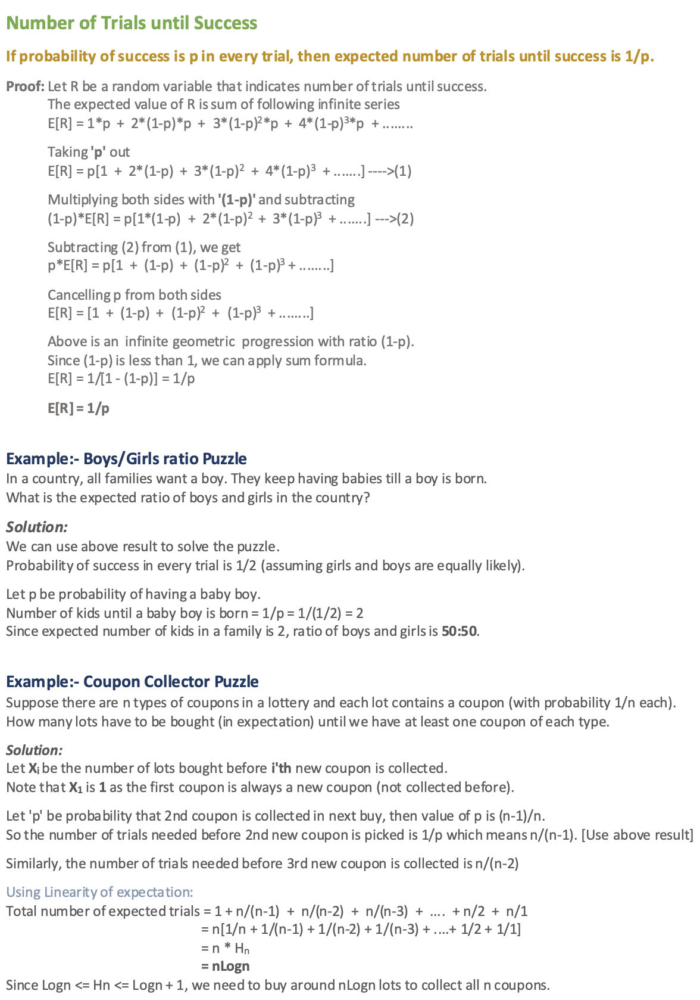

# Randomized Algorithms

An algorithm that uses random numbers to decide what to do next anywhere in its logic is called Randomized Algorithm.

**Examples:**

- ***Randomized Quick Sort:*** Uses random number to pick the next pivot (or randomly shuffles the array).
- ***Karger’s algorithm:*** Randomly picks an edge.

## Concept of Expectation

A random variable can take any possible value in its range, so it is important to define the **expected value** of any random variable.

### Expected Value

Expected value of a discrete random variable is R defined as following:

Suppose R can take value r1 with probability p1, value r2 with probability p2, and so on, up to value rk with probability pk.

Then the expectation of this random variable R is defined as:

> **E[R] = r1\*p1 + r2\*p2 + ... rk*pk**

**Example:**

Given a fair dice with 6 faces, the dice is thrown n times, find expected value of sum of all results.

##### Note:

- The above way to solve the problem becomes difficult when there are more dice throws.
- If we know about **linearity of expectation**, then we can quickly solve the above problem for any number of throws.

### Linearity of Expectation

Let R1 and R2 be two discrete random variables on some probability space, then expected value of R1 + R2 is:

> **E[R1 + R2] = E[R1] + E[R2]**

### Probability and Expectation

## Mathematical Background

## Analyzing Randomized Algorithms

- Some randomized algorithms have deterministic time complexity.
    - Example: Implementation of Karger’s algorithm has time complexity as O(E).
    - Such algorithms are called **Monte Carlo Algorithms** and are easier to analyse for worst case.
- On the other hand, time complexity of other randomized algorithms (other than Las Vegas) is dependent on value of random variable.
    - Such Randomized algorithms are called **Las Vegas Algorithms**.
    - These algorithms are typically analysed for expected worst case.
    - To compute expected time taken in worst case, all possible values of the used random variable needs to be considered in worst case and time taken by every possible value needs to be evaluated.
    - Average of all evaluated times is the expected worst case time complexity.
    - Below facts are generally helpful in analysis os such algorithms.
        - Linearity of Expectation
        - Expected Number of Trials until Success.

## Classification of Randomized Algorithms

Randomized algorithms are classified in two categories:

- **Las Vegas Algorithms:** 
    - These algorithms always produce correct or optimum result.
    - Time complexity of these algorithms is based on a random value and time complexity is evaluated as expected value.
    - ***Example:*** Randomized QuickSort always sorts an input array and expected worst case time complexity of QuickSort is O(nLogn).
- **Monte Carlo Algorithms:**
    - Produce correct or optimum result with some probability.
    - These algorithms have deterministic running time and it is generally easier to find out worst case time complexity.
    - ***Example:*** Implementation of Karger’s Algorithm produces minimum cut with probability greater than or equal to 1/n2 (n is number of vertices) and has worst case time complexity as O(E). 
    - ***Another Example:*** Fermet Method for Primality Testing.

> **Example to Understand Classification:**
>
> Consider a binary array where exactly half elements are 0 and half are 1. The task is to find index of any 1.
>
> - Las Vegas algorithm for this task is to keep picking a random element until we find a 1.
> - A Monte Carlo algorithm for the same is to keep picking a random element until we either find 1 or we have tried maximum allowed times say k.
> - The Las Vegas algorithm always finds an index of 1, but time complexity is determined as expect value. The expected number of trials before success is 2, therefore expected time complexity is O(1).
> - The Monte Carlo Algorithm finds a 1 with probability [1 – (1/2)k]. Time complexity of Monte Carlo is O(k) which is deterministic

## Applications of Randomized Algorithms

- Even for sorted array randomized **quick sort** gives O(nlogn) expected time.
- Randomized algorithms have huge applications in **Cryptography**.
- **Load Balancing**
- **Number-Theoretic Applications:** Primality Testing
- **Data Structures:** Hashing, Sorting, Searching, Order Statistics and Computational Geometry.
- **Algebraic identities:** Polynomial and matrix identity verification. Interactive proof systems.
- **Mathematical programming:** Faster algorithms for linear programming, Rounding linear program solutions to integer program solutions
- **Graph algorithms:** Minimum spanning trees, shortest paths, minimum cuts.
- **Counting and enumeration:** Matrix permanent Counting combinatorial structures.
- **Parallel and distributed computing:** Deadlock avoidance distributed consensus.
- **Probabilistic existence proofs:** Show that a combinatorial object arises with non-zero probability among objects drawn from a suitable probability space.
- **Derandomization:** First devise a randomized algorithm then argue that it can be derandomized to yield a deterministic algorithm.

------

<a href="10_geometric_algorithms" class="prev-button">&larr; Previous: Geometric Algorithms</a>     <a href="12_branch_bound" class="next-button">Next: Branch and Bound &rarr;</a>

