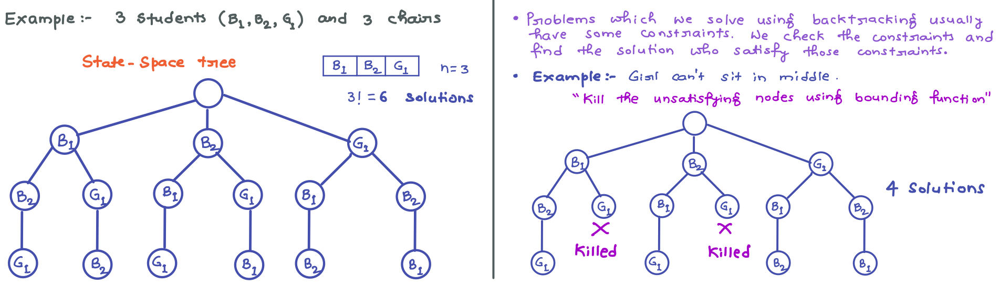
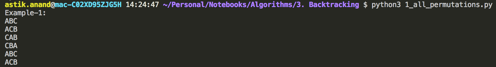
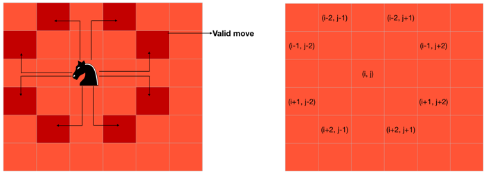
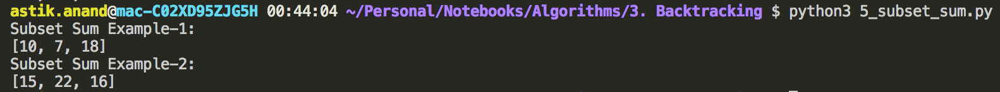

# Recursion and Backtracking

> **Backtracking**

- It is one of problem solving strategy and it uses **Brute-Force Approach**. 

- For any given problem try out all possible solutions and pick-up desired solutions.

- We also follow this in Dynamic Programming approach but there we solve optimization problem.

- Backtracking is not optimization problem, it is used when we have multiple solutions and we want all those solutions.

- We can find all the solution and it can be represented in the form of a **solution tree** also k/a **state-space tree**. 

    

- **Backtracking is an algorithmic paradigm that tries different solutions until finds a solution that “works”.**

- ###### Problems which are typically solved using backtracking technique have following property in common. 

    - These problems can only be solved by trying every possible configuration and each configuration is tried only once.
    - A Naive solution for these problems is to try all configurations and output a configuration that follows given problem constraints.
    - Backtracking works in incremental way and is an optimization over the Naive solution where all possible configurations are generated and tried.

##### **Notes:-**

- There is 1 more strategy that follows Brute-Force approach and that is **Branch and Bound**. 
- It also generates state-space tree.
- **But backtracking uses DFS and Branch and Bound uses BFS approach.** 


> **Standard Backtracking Problems:**

- All Permutations
- Knight tour
- N-Queen
- Rat in Maze
- Subset-Sum
- Sudoku
- Graph-Coloring

------

### Standard Backtracking Problems

## 1. All Permutations of a Given String***

###### **Problem:**

- A permutation, also called an “arrangement number” or “order,” is a rearrangement of the elements of an ordered list S into a one-to-one correspondence with S itself. 

- A string of length n has **n!** permutation. 

- **Permutations of string ABC:** ABC ACB BAC BCA CBA CAB

    

###### **Algorithm:**

- start from left = 0 and right = n.
- if (left==right):
    - print(string) and return
- for i in range(left, right):
    - swap the characters of string of (i and left)
    - call the function recursively with (left+1, right)
    - swap the characters again of (i and left) for backtracking. 

###### **Implementation:**

```python
def generate_permutations_util(string, left, right):
    if(left == right):
        print("{}".format("".join(string)))
        return
    
    for i in range(left, right):
        string[left], string[i] = string[i], string[left]
        generate_permutations_util(string, left+1, right)
        string[left], string[i] = string[i], string[left]    # Backtrack


def generate_permutations(string):
    n = len(string)
    generate_permutations_util(list(string), 0, n)


print("Example-1:")
generate_permutations("ABC")

print("\nExample-2")
generate_permutations("ABCD")


# Complexity:
#    • Time: O(n*n!) :- There are n! permutations and it requires O(n) time to print a permutation.
#    • Auxilliary Space: O(1)
```

**Output:**



###### **Complexity:**

- **Time:** **O(n\*n!)** :- There are n! permutations and it requires O(n) time to print a permutation.
- **Auxilliary Space:** **O(1)**


## 2. Knight's Tour Problem***

###### **Problem:**

The knight is placed on the first block of an empty board and, moving according to the rules of chess, must visit each square exactly once.



###### **Naive Approach:** 

The Naive Algorithm is to generate all tours one by one and check if the generated tour satisfies the constraints.

```
while there are untried tours {
   generate the next tour 
   if this tour covers all squares {
      print this path;
   }
}
```

###### **Backtracking Approach:**

- It works in an incremental way to attack problems.
- Typically, we start from an empty solution vector and one by one add items.
- Meaning of item varies from problem to problem, in context of Knight’s tour problem, an item is a Knight’s move.
- When we add an item, we check if adding the current item violates the problem constraint, if it does then we remove the item and try other alternatives.
- If none of the alternatives work out then we go to previous stage and remove the item added in the previous stage.
- If we reach the initial stage back then we say that no solution exists.
- If adding an item doesn’t violate constraints then we recursively add items one by one.
- If the solution vector becomes complete then we print the solution.

###### **Implementation:**

```python
POSSIBLE_MOVES = [(-2, -1), (-2, 1), (-1, -2), (-1, 2), (1, -2), (1, 2), (2, -1), (2,1)]

def valid_move(x, y, tour_matrix):
    return (x>=0 and x<N and y>=0 and y<N and tour_matrix[x][y]==-1)


def knight_tour_util(current_x, current_y, move_number, tour_matrix):
    if(move_number == N*N):
        return True
    
    # Try all possible moves
    for x_move, y_move in POSSIBLE_MOVES:
        next_x = current_x + x_move
        next_y = current_y + y_move
        if(valid_move(next_x, next_y, tour_matrix)):
            tour_matrix[next_x][next_y] = move_number
            if(knight_tour_util(next_x, next_y, move_number+1, tour_matrix) == True):
                return True
            else:
                tour_matrix[next_x][next_y] = -1  # Backtrack
    return False


def knight_tour():
    # Create a 2-D Matrix(N*N)
    tour_matrix = [[-1]*N for _ in range(N)]

    #  Knight is initially at the first block 
    tour_matrix[0][0]  = 0

    if(knight_tour_util(0, 0, 1, tour_matrix) == True):
        for i in range(N):
            for j in range(N):
                print("{0: =2d}".format(tour_matrix[i][j]), end=" ")
            print()
        print()
    else:
        print("No solution exist")


print("Knight Tour Example-1: 4*4 Matrix")
N = 4
knight_tour()

print("\nKnight Tour Example-2: 5*5 Matrix")
N = 5
knight_tour()

print("\nKnight Tour Example-3: 8*8 Matrix")
N = 8
knight_tour()


# Complexity:
#    • Time: O(8^(n^2)) :- There are N*N i.e., N^2 cells in the board and we have a maximum of 8 choices to make from a cell.
#    • Auxilliary Space: O(N^2)
```

**Output:**


###### **Complexity:**

- **Time: O(8<sup>N^2</sup>) :-** There are N*N i.e., N<sup>2</sup> cells in the board and we have a maximum of 8 choices to make from a cell.
- **Auxilliary Space: O(N<sup>2</sup>):-** Need to create a solution matrix of N*N.

##### **Notes:** 

- Backtracking is not the best solution for the Knight’s tour problem
- Other better solutions: **Warnsdorff’s algorithm for Knight’s problem.**


## 3. N-Queen Problem***

###### **Problem:**

The N Queen is the problem of placing N chess queens on an N×N chessboard so that no two queens attack each other. 

**Example:** 4 Queen problem.


###### **Approach:**

- The idea is to place queens one by one in different columns, starting from the leftmost column.
- When we place a queen in a column, we check for clashes with already placed queens.
- In the current column, if we find a row for which there is no clash, we mark this row and column as part of the solution.
- If we do not find such a row due to clashes then we backtrack and return false.

###### **Algorithm:**

1. Start in the leftmost column
2. If all queens are placed: **return true** 
3. Try all rows in the current column.  Do following for every tried row.
    - a) If the queen can be placed safely in this row then mark this [row,column] as part of the solution and recursively check if placing queen here leads to a solution.
    - b) If placing the queen in [row, column] leads to a solution then **return true**. 
    - c) If placing queen doesn't lead to a solution then unmark this [row,column] (Backtrack) and go to step (a) to try other rows.
4. If all rows have been tried and nothing worked, **return false** to trigger backtracking. 

###### **Implementation:**

```python
# To check if a queen can be placed on board[row][col]. 
# Note that this function is called when "col" number of queens are already placed in columns from 0 to col -1. 
# So we need to check only left side for attacking queens.
def is_safe(board, row, col):
    safe = True
    # Check this row on left side.
    for j in range(col):
        if(board[row][j] == 1):
            safe = False
            break
    
    # Check upper diagonal on left side
    i = row; j=col
    while(i>=0 and j>=0):
        if(board[i][j]==1):
            safe = False
            break
        i-=1; j-=1
    
    # Check lower diagonal on left side
    i = row; j = col
    while(i<N and j>=0 and safe):
        if(board[i][j]==1):
            safe = False
            break
        i+=1; j-=1

    return safe
    

def n_queen_util(board, col):
    # Base case: If all queens are placed then return true 
    if(col == N):
        return True
    
    # Consider this column and try placing this queen in all rows one by one 
    for i in range(N):
        if(is_safe(board, i, col)):
            # Place this queen in board[i][col] 
            board[i][col] = 1
            # Recur to place rest of the queens 
            if(n_queen_util(board, col+1) == True):
                return True
            else:
                board[i][col] = 0   # Backtrack
    
    # If the queen can not be placed in any row in this colum col  then return false
    return False


def n_queen():
    board = [[0]*N for i in range(N)]

    if(n_queen_util(board, 0) == True):
        for i in range(N):
            print(board[i])
    else:
        print("No solution exists")


print("N-Queen Example-1: 3*3 Matrix")
N = 3
n_queen()

print("\nN-Queen Example-2: 4*4 Matrix")
N = 4
n_queen()

print("\nN-Queen Example-3: 5*5 Matrix")
N = 5
n_queen()

print("\nN-Queen Example-4: 8*8 Matrix")
N = 8
n_queen()


# Complexity:
#    • Time: 
#    • Auxilliary Space:
```

**Output:**


###### **Complexity:**

- **Time: O(N!)**
- **Auxilliary Space: O(N<sup>2</sup>)**:- Need to create a board matrix of N*N. 


## 4. Rat in Maze***

###### **Problem:**

- A Maze is given as N*N binary matrix of blocks where **source** block is the upper left most block i.e., `maze[0][0]` and **destination** block is lower rightmost block i.e., `maze[N-1][N-1]`. 
- A rat starts from source and has to reach the destination.
- The rat can move only in two directions: forward and down.
- In the maze matrix, 0 means the block is a dead end and 1 means the block can be used in the path from source to destination.
- Note that this is a simple version of the typical Maze problem.
- **Example:** A more complex version can be that the rat can move in 4 directions and a more complex version can be with a limited number of moves.

##### Example Maze:


###### **Algorithm:**

- **If destination is reached:**
    - print the solution matrix
- **Else:**
    - a) Mark current cell in solution matrix as 1.
    - b) Move forward in the horizontal direction and recursively check if this move leads to a solution.
    - c) If the move chosen in the above step doesn't lead to a solution then move down and check if this move leads to a solution.
    - d) If none of the above solutions works then unmark this cell as 0(BACKTRACK) and return false.

###### **Implementation:**

```python
def rat_in_maze_util(solution_maze, x, y):
    if(x == N-1 and y == N-1):
        return True
    
    # Make a move in forward direction if it is_safe to move
    if(given_maze[x][y+1] == 1):
        solution_maze[x][y+1] = 1
        if(rat_in_maze_util(solution_maze, x, y+1) == True):
            return True
        else:
            solution_maze[x][y+1] = 0   # Backtrack
    
    # Make a move in downward direction if it is_safe to move
    if(given_maze[x+1][y] == 1):
        solution_maze[x+1][y] = 1
        if(rat_in_maze_util(solution_maze, x+1, y) == True):
            return True
        else:
            solution_maze[x][y+1] = 0   # Backtrack
    
    return False


def rat_in_maze():
    solution_maze = [[0]*N for i in range(N)]
    solution_maze[0][0] = 1

    if(rat_in_maze_util(solution_maze, 0, 0)):
        for i in range(N):
            print(solution_maze[i])
    else:
        print("No Solution exist.")


print("Rat in Maze Example-1: 4*4 Matrix")
N = 4
given_maze = [ [1, 0, 0, 0], 
               [1, 1, 0, 1], 
               [0, 1, 0, 0], 
               [1, 1, 1, 1] ]
rat_in_maze()
```

**Output:**


###### **Complexity:**

- **Time:** Every block will have 2 directional choices (Forward & Backward). Hence 2*2*2*. . .(n times), so **2<sup>n</sup>**.
- **Auxilliary Space: O(N<sup>2</sup>):-** Need to create a maze matrix of N*N. 


## 5. Subset Sum Problem

###### **Problem:**

- Subset sum problem is to find subset of elements that are selected from a given set whose sum adds up to a given number K. 

- We are considering the set contains non-negative values.

- It is assumed that the input set is unique (no duplicates are presented).

- The problem is **NP-Complete**, while it is easy to confirm whether a proposed solution is valid, it may be difficult to determine in the first place whether any solution exists. 

- There exists a **DP solution** to this problem which gives **pseudo-polynomial** time and hence considered **weakly NP-Complete**. 

    > **Example-1:** Set = [10, 7, 5, 18, 12, 20, 15]  K = 35 then, 
    >
    > Answer: [10, 7, 18] or [20, 15] 
    >
    > 
    >
    > **Example-2:** Set = [15, 22, 14, 26, 32, 9, 16, 8]  K = 53 then, 
    >
    > Answer: [15, 22, 16] or [32, 9, 16] 

###### **Implementation:**

```python
def subset_sum(given_set, num):
    if num < 1 or len(given_set) == 0:
        return False

    if num == given_set[0]:
        return [given_set[0]]

    with_v = subset_sum(given_set[1:], num-given_set[0])
    if with_v:
        return [given_set[0]] + with_v
    else:
        return subset_sum(given_set[1:], num)
    


print("Subset Sum Example-1:")
given_set = [10, 7, 5, 18, 12, 20, 15]
print(subset_sum(given_set, 35))

print("Subset Sum Example-2:")
given_set = [15, 22, 14, 26, 32, 9, 16, 8]
print(subset_sum(given_set, 53))
```

**Output:**



###### **Complexity:**

- **Time:** Every number will be either picked or not picked (2choices). Hence 2*2*2*. . .(n times), so **2<sup>n</sup>**.
- **Auxilliary Space: O(N)**


## 6. Sudoku***

###### **Problem:**

Given a partially filled 9×9 2D array **`grid[9][9]`**, the goal is to assign digits (from 1 to 9) to the empty cells so that every row, column, and subgrid of size 3×3 contains exactly one instance of the digits from 1 to 9.


###### **Backtracking Approach:**

- Like all other Backtracking problems, we can solve Sudoku by one by one assigning numbers to empty cells.
- Before assigning a number, we check whether it is safe to assign i.e. check that the same number is not present in the current row, current column and current 3X3 subgrid.
- After checking for safety, we assign the number, and recursively check whether this assignment leads to a solution or not.
- If the assignment doesn’t lead to a solution, then we try next number for the current empty cell.
- And if none of the number (1 to 9) leads to a solution, we return false.

###### **Algorithm:**

- Find row, col of an unassigned cell and If there is none, return true
- For digits from 1 to 9
    - a) If there is no conflict for digit at row, col assign digit to row, col and recursively try fill in rest of grid
    - b) If recursion successful, return true
    - c) Else, remove digit and try another
- If all digits have been tried and nothing worked, return false

###### **Implementation**

```python
import math

# get_base_box gives start row or col of the mini_box
# like if row = 2 then base_row = 0 and if row = 8 then base_row = 6
def get_base_box(index, k):
    return int(index/k)*k


def find_unassigned_box(matrix):
    n = len(matrix[0])
    for row in range(n): 
        for col in range(n): 
            if(matrix[row][col]==0): 
                return (True, row, col)

    return (False, None, None)


def is_safe(matrix, row, col, num):
    n = len(matrix[0])
    status = True
    # Check if the row is safe
    for i in range(n):
        if(matrix[row][i] == num):
            status = False
            break
    
    # Check if the column is safe
    for i in range(n):
        if(matrix[i][col] == num):
            status = False
            break
    
    # Check if the individual 3*3 box is safe as n = 9 hence k = 3
    k = int(math.sqrt(n))
    base_row = get_base_box(row, k)
    base_col = get_base_box(col, k)
    for i in range(k): 
        for j in range(k): 
            if(matrix[i+base_row][j+base_col] == num): 
                status = False
                break

    return status


def solve_sudoku(matrix):
    n = len(matrix[0])
    # Check for unassigned box and return status, if status is True also return row and col of that box
    found, row, col = find_unassigned_box(matrix)

    # If No unassigned box found, we are done 
    if(not found):
        return True
    
    # Consider digits 1 to 9 
    for num in range(1, n+1):
        # Check if it is safe to put this number
        if(is_safe(matrix, row, col, num)):
            # Put this number
            matrix[row][col] = num
            # Recur to check if it leads to solution
            if(solve_sudoku(matrix) == True):
                return True
            else:
                matrix[row][col] = 0  # Backtrack
    
    return False


print("Sudoku Example-1:")
matrix = [[3,0,6,5,0,8,4,0,0], 
          [5,2,0,0,0,0,0,0,0], 
          [0,8,7,0,0,0,0,3,1], 
          [0,0,3,0,1,0,0,8,0], 
          [9,0,0,8,6,3,0,0,5], 
          [0,5,0,0,9,0,6,0,0], 
          [1,3,0,0,0,0,2,5,0], 
          [0,0,0,0,0,0,0,7,4], 
          [0,0,5,2,0,6,3,0,0]]

n = len(matrix[0])
if(solve_sudoku(matrix)): 
    for i in range(n):
        for j in range(n):
            print(matrix[i][j], end=" ")
        print() 
else: 
    print("No solution exists")
```

**Output:**


###### **Complexity:**

- **Time:** 
- **Auxilliary Space: O(N<sup>2</sup>)**


## 7. Tower of Hanoi

###### **Problem:**

3 Towers given, and one of tower has all the disks kept in increasing order of size from top to bottom.

We have to move all those disks to another tower with below conditions:

- Only one disk can be moved at a time.
- At no point of time a larger disk can be kept on smaller.

###### Approach:


###### Implementation

```python
def tower_of_hanoi(n, source, auxiliary, destination):
    if(n>0):
        # Move n-1 disks from source to auxilliary using destination
        tower_of_hanoi(n-1, source, destination, auxiliary)

        # Move that 1 disk now from source to destination
        print("Move 1 disk from {} to {}".format(source, destination))

        # Move rest n-1 from auxiliary to destination using source
        tower_of_hanoi(n-1, auxiliary, source, destination)


print("Tower of Hanoi Example-1")
tower_of_hanoi(3, "A", "B", "C")

print("\nTower of Hanoi Example-2")
tower_of_hanoi(4, "A", "B", "C")
```

**Output:**


###### **Complexity:**

- **Time: O(2<sup>n</sup>)**
- **Auxilliary Space: O(1)**


------

<a href="2_searching_sorting" class="prev-button">&larr; Previous: Searching and Sorting</a>    <a href="4_greedy_algorithms" class="next-button">Next: Greedy Algorithms &rarr;</a>

