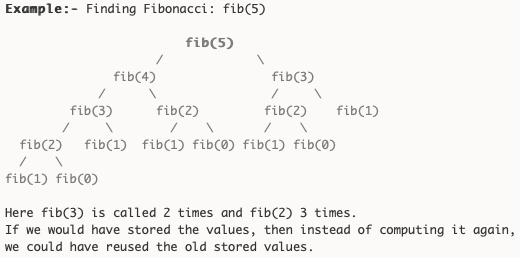
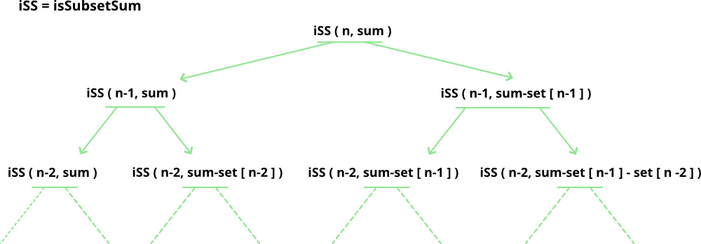
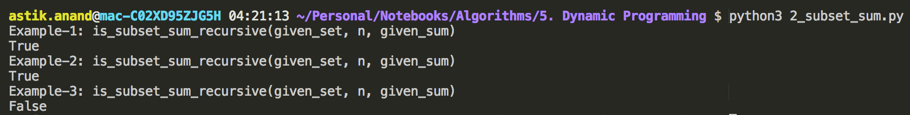
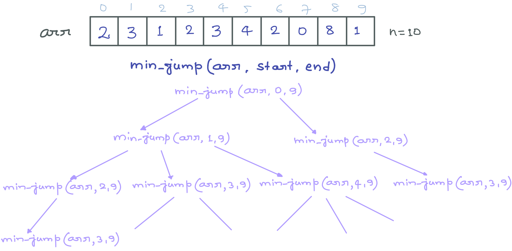
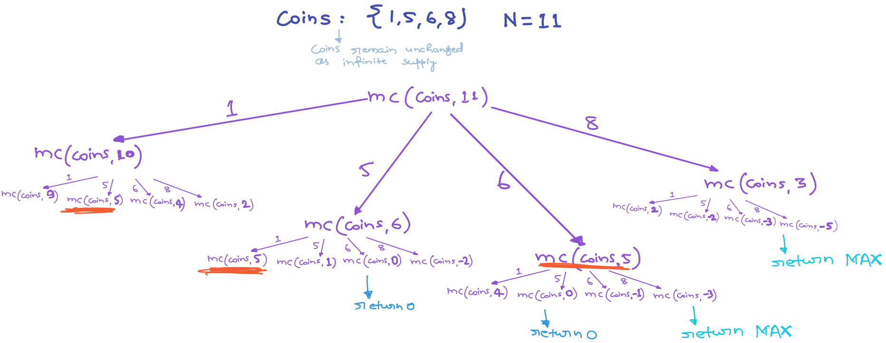
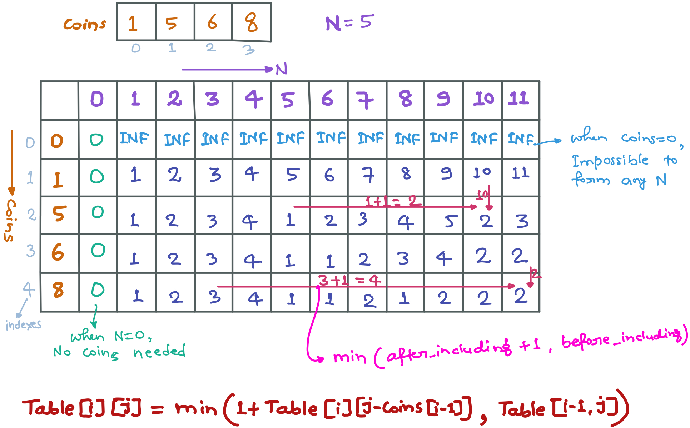
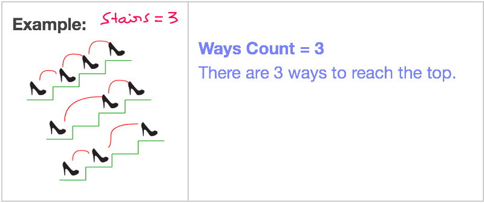
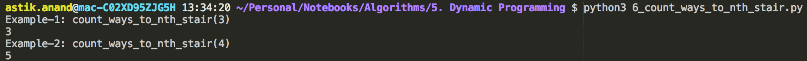

# Dynamic Programming

###### What is dynamic Programming

It is an algorithmic paradigm that solves a given complex problem by: 

- breaking it into subproblems and
- stores the results of subproblems to avoid computing the same results again. 

**Following are the two main properties of a problem that suggests that the given problem can be solved using Dynamic programming.**

1. Overlapping Subproblems
2. Optimal Substructure

#### 1. Overlapping Subproblems

- Like Divide and Conquer, Dynamic Programming combines solutions to sub-problems.

- Dynamic Programming is mainly used when solutions of same subproblems are needed again and again.

- In dynamic programming, computed solutions to subproblems are stored in a table so that these don’t have to be recomputed.

- Dynamic Programming is not useful when there are no common (overlapping) subproblems because there is no point storing the solutions if they are not needed again.

- **Binary Search** is broken down into subproblems but it doesn’t have common subproblems, so no sense to store the solutions.

    

    > There are following two different ways to store the values so that these values can be reused:

    - a) Memoization (Top Down)
    - b) Tabulation (Bottom Up)

##### a) Memoization (Top Down Approach)

- The memoized program for a problem is **similar to the recursive version** with a small modification that it looks into a lookup table before computing solutions. 
- We initialize a lookup array with all initial values as NIL.
- Whenever we need the solution to a subproblem, we first look into the lookup table.
- If the precomputed value is there then we return that value, otherwise, we calculate the value and put the result in the lookup table so that it can be reused later.

###### Implementation

```python
def fib_memoization_top_down(n, lookup):
    if(n == 0 or n == 1):
        lookup[n] = n

    if(lookup[n] is None):
        lookup[n] = fib_memoization_top_down(n-1, lookup) + fib_memoization_top_down(n-2, lookup)
    
    return lookup[n]


print("Fibonacci: DP(Top_Down/Memoization) Approach Example-1:")
print(fib_memoization_top_down(5, [None]*(6)))

print("Fibonacci: DP(Top_Down/Memoization) Approach Example-2:")
print(fib_memoization_top_down(34, [None]*(35)))
```

**Output:**


###### **Complexity:**

- **Time:** **O(n)** :- Each problem exactly once hence O(n) 
- **Auxilliary Space:** **O(n)** :- Lookup array of size n.  

##### b) Bottom Up Approach - Tabulation

- The tabulated program for a given problem **builds a table in bottom up fashion** and returns the last entry from table. 
- For example, for the same Fibonacci number, we first calculate fib(0) then fib(1) then fib(2) then fib(3) and so on.
- So literally, we are building the solutions of subproblems bottom-up.

###### Implementation

```python
def fib_tabulation_bottom_up(n):
    table = [0]*(n+1)
    table[1] = 1

    for i in range(2, n+1):
        table[i] = table[i-1] + table[i-2]
    
    return table[n]


print("Fibonacci: DP(Bottom_Up/Tabulation) Approach Example-1:")
print(fib_tabulation_bottom_up(5))

print("Fibonacci: DP(Bottom_Up/Tabulation) Approach Example-2:")
print(fib_tabulation_bottom_up(34))
```

**Output:**


###### **Complexity:**

- **Time:** **O(n)** :- Loop runs till n 
- **Auxilliary Space:** **O(n)** :- Values table of size n 

###### **Notes:**

- Both Tabulated and Memoized store the solutions of subproblems.
- In Memoized version, table is filled on demand while in Tabulated version, starting from the first entry, all entries are filled one by one.
- Unlike the Tabulated version, all entries of the lookup table are not necessarily filled in Memoized version.
- ***Example:-*** Memoized solutionof the LCS problem doesn’t necessarily fill all entries. 

#### 2. Optimal Substructures

- A given problems has Optimal Substructure Property if optimal solution of the given problem can be obtained by using optimal solutions of its subproblems.

- ***E******xample:-*** The Shortest Path problem has following optimal substructure property:

    - If a node x lies in the shortest path from a source node u to destination node v.
    - Then the shortest path from u to v is combination of shortest path from u to x and shortest path from x to v.
    - The standard All Pair Shortest Path algorithms like **Floyd–Warshall** and **Bellman–Ford** are typical examples of Dynamic Programming. 

- But the Longest Path problem i.e. longest simple path (path without cycle) between two nodes doesn’t have the Optimal Substructure property. 

    - There are two longest paths from q to t: q→r→t and q→s→t.
    - Unlike shortest paths, these longest paths do not have the optimal substructure property.
    - *Example:-* The longest path q→r→t is not a combination of longest path from q to r and longest path from r to t.
        - Coz the longest path from q to r is q→s→t→r and the longest path from r to t is r→q→s→t.

    

------

### Standard Dynamic Programming Problems

## 1. Maximum Sum Subarray***

###### **Problem:**

Find the sum of contiguous subarray within a one-dimensional array of numbers which has the largest sum. 


###### **Kadane’s Algorithm:**

- **Initialize:** max_so_far = 0, max_ending_here = 0 
- **Loop** for each element of the array 
    - max_ending_here = max_ending_here + a[i]
    - **if** (max_so_far < max_ending_here) 
        - max_so_far = max_ending_here
    - **if** (max_ending_here < 0) 
        - max_ending_here = 0
- **return** max_so_far 

###### Implementation

```python
def maximum_sum_subarray_kadane(arr):
    n = len(arr)
    max_so_far = arr[0]
    max_ending_here = arr[0]
    start = 0; end = 0; s = 0;

    for i in range(1, n):
        max_ending_here += arr[i]
        
        if(max_so_far < max_ending_here):
            max_so_far = max_ending_here
            start = s
            end = i
        
        if(max_ending_here < 0):
            max_ending_here = 0
            s = i+1
        
    
    return (max_so_far, arr[start:end+1])


print("Example-1: maximum_sum_subarray_kadane(arr)")
arr = [-2, -3, 4, -1, -2, 1, 5, -3]
max_sum, subarray = maximum_sum_subarray_kadane(arr)
print("Max: {} and Subarray: {}".format(max_sum, subarray))

print("\nExample-2: maximum_sum_subarray_kadane(arr)")
arr = [-13, -3, -25, -20, -3, -16, -23, -12, -5, -22, -15, -4, -7]
ax_sum, subarray = maximum_sum_subarray_kadane(arr)
print("Max: {} and Subarray: {}".format(max_sum, subarray))
```

**Output:**


###### **Complexity:**

- **Time:** **O(n)** :- Loop runs till n 
- **Auxilliary Space:** **O(1)** 


## 2. Subset Sum Problem***

###### **Problem:**

Given a set of non-negative integers, and a value sum, determine if there is a subset of the given set with sum equal to given sum.

> **Example:**  
>
> Input:  set[] = {3, 34, 4, 12, 5, 2}, sum = 11 
>
> Output:  True  //There is a subset (4, 5, 2) with sum 11. 

###### **Recursive Approach:**

- is_subset_sum(set, n, sum) = is_subset_sum(set, n-1, sum) || is_subset_sum(set, n-1, sum-set[n-1])
- **Base Cases:**
    - is_subset_sum(set, n, sum) = false, if sum > 0 and n == 0
    - is_subset_sum(set, n, sum) = true, if sum == 0



###### **Recursive Implementation:**

```python
def is_subset_sum_recursive(given_set, n, given_sum):
    if(given_sum==0):
        return True
    
    if(n==0 and given_sum != 0):
        return False
    
    return is_subset_sum_recursive(given_set, n-1, given_sum) or 
		   is_subset_sum_recursive(given_set, n-1, given_sum-given_set[n-1])


print("Example-1: is_subset_sum_recursive(given_set, n, given_sum)")
given_set = [1, 3, 9, 2] 
print(is_subset_sum_recursive(given_set, 4, 5))

print("Example-2: is_subset_sum_recursive(given_set, n, given_sum)")
given_set = [3, 34, 4, 12, 5, 2] 
print(is_subset_sum_recursive(given_set, 6, 11))

print("Example-3: is_subset_sum_recursive(given_set, n, given_sum)")
given_set = [3, 34, 4, 12, 5, 2] 
print(is_subset_sum_recursive(given_set, 6, 13))
```

**Output**



###### **Complexity:**

- **Time:** **O(2<sup>n</sup>)** :- Every number will either be picked or not hence 2*2*2……. = **2<sup>n</sup>**. 
- **Auxilliary Space:** **O(n)** 

##### **Notes:**

- The above solution may try all subsets of given set in worst case.
- Therefore time complexity of the above solution is exponential.
- The problem is in-fact **NP-Complete** (There is no known polynomial time solution for this problem). 

------

###### **Dynamic Programming Approach:**

- We can solve the problem in **Pseudo-polynomial time** using Dynamic programming. 
- Create a boolean 2D table[][] and fill it in bottom up manner.
- The value of **`table[i][j]`** will be true if there is a subset of set[0..j-1] with sum equal to i., otherwise false.
- Finally, return table**`[sum][n]`** .


###### **Dynamic Programming Implementation**:

```python
def is_subset_sum_dp(given_set, n, given_sum):
    table = [[False]*(given_sum+1) for i in range(n+1)]

    # Sum = 0 can be achieved by any subset by taking an empty set
    for i in range(n+1):
        table[i][0] = True
    
    # With empty set all the sum will be False except sum=0
    for i in range(1, given_sum+1):
        table[0][i] = False
    
    # Now fill the rest of table 
    for i in range(1, n+1):
        for j in range(1, given_sum+1):
            # If earlier (before adding this number in set) sum was possible, 
            # the now also it will be possible
            if(table[i-1][j] == True):
                table[i][j] = True
            # If earlier not possible check if current_sum-current_number was possible earlier,
            # if it was then we are done.
            elif(j-given_set[i-1]>=0 and table[i-1][j-given_set[i-1]] == True):
                table[i][j] = True
            # If above 2 cases is not there, then False
            else:
                table[i][j] = False
    
    return table[n][given_sum]


print("Example-1: is_subset_sum_dp(given_set, n, given_sum)")
given_set = [1, 3, 9, 2] 
print(is_subset_sum_dp(given_set, 4, 5))

print("Example-2: is_subset_sum_dp(given_set, n, given_sum)")
given_set = [3, 34, 4, 12, 5, 2] 
print(is_subset_sum_dp(given_set, 6, 11))

print("Example-3: is_subset_sum_dp(given_set, n, given_sum)")
given_set = [3, 34, 4, 12, 5, 2] 
print(is_subset_sum_dp(given_set, 6, 13))
```

**Output:**


###### **Complexity:**

- **Time:** **O(sum****)** :- Loop till max_num in set 
- **Auxilliary Space:** **O(n\*sum)** 


## 3. Minimum Jumps to Reach End***

###### **Problem:**

Given an array of integers where each element represents the max number of steps that can be made forward from that element.

Write a function to return the minimum number of jumps to reach the end of the array (starting from the first element).

If an element is 0, then cannot move through that element.

> **Example:**
>
> Input: arr[] = {2, 3, 1, 2, 3, 4, 2, 0, 8, 1} 
>
> Output: 4 (2-> 3-> 2-> 4-> 1) 

###### **Recursive Approach:**



###### **Recursive Implementation:**

```python
import sys

def min_jump_to_reach_end_recursive(arr, start, end):
    # Base case: when start position and end position are same 
    if (start == end): 
        return 0
  
    # When nothing is reachable from the given position
    if (arr[start] == 0): 
        return sys.maxsize 
  
    # Just check where you can reach from start and then call min_jump from there
    min_jumps = sys.maxsize 
    for i in range(1, arr[start]+1):
        next_start = start+i
        if(next_start < n): 
            jumps = 1 + min_jump_to_reach_end_recursive(arr, next_start, end) 
            if (jumps < min_jumps): 
                min_jumps = jumps
  
    return min_jumps
    


print("Min Jump Recursive Example-1: min_jump_to_reach_end_recursive(arr, start, end)")
arr = [2, 3, 1, 2, 3, 4, 2, 0, 8, 1] 
n = len(arr) 
jumps = min_jump_to_reach_end_recursive(arr, 0, n-1)
if(jumps == sys.maxsize):
    print("Unreachable")
else: 
    print("Jumps: {}".format(jumps))

print("\nMin Jump Recursive Example-2: min_jump_to_reach_end_recursive(arr, start, end)")
arr = [2, 3, 1, 2, 3, 2, 1, 0, 8, 1] 
n = len(arr) 
jumps = min_jump_to_reach_end_recursive(arr, 0, n-1)
if(jumps == sys.maxsize):
    print("Unreachable")
else: 
    print("Jumps: {}".format(jumps))
```

**Output:**


###### **Complexity:**

- **Time:** **O(2<sup>n</sup>)** :- Every number will either be picked or not hence 2*2*2……. = **2<sup>n</sup>**. 
- **Auxilliary Space:** **O(n)** 

------

###### **Dynamic Programming Approach:**


###### **Dynamic Programming Implementation:**

```python
def min_jump_to_reach_end_DP(arr):
    n = len(arr)
    # Initialize jumps_required as "infinity" for every element
    jumps_required = [sys.maxsize]*n
    actual_jump = [0]*n

    # First element is reachable by 0 jumps
    jumps_required[0] = 0

    for i in range(1, n):
        for j in range(i):
            # Check if from j we can reach i or not??
            # If j + arr[j] >= i : then we can reach i
            if(j+arr[j] >= i):
                # If i is reachable from j in lesser jumps than earlier update the jumps to reach i
                # Update the actual jump table also
                if(jumps_required[j]+1 < jumps_required[i]):
                    jumps_required[i] = jumps_required[j]+1
                    actual_jump[i] = j
    
    # Now print number of jumps and actual jump
    if(jumps_required[n-1] == sys.maxsize):
        print("Unreachable")
    else:
        print("Jumps: {}".format(jumps_required[n-1]))
        k = n-1
        print("Actual Jumps: end", end="")
        while(k>0):
            print("<--{}".format(actual_jump[k]), end="")
            k = actual_jump[k]
        print()


print("Min Jump DP Example-1: min_jump_to_reach_end_DP(arr)")
arr = [2, 3, 1, 2, 3, 4, 2, 0, 8, 1] 
min_jump_to_reach_end_DP(arr)

print("\nMin Jump DP Example-2: min_jump_to_reach_end_DP(arr)")
arr = [2, 3, 1, 2, 3, 2, 1, 0, 8, 1] 
min_jump_to_reach_end_DP(arr)
```

**Output:**


###### **Complexity:**

- **Time:** **O(n<sup>2</sup>)** :- 2 for loops 
- **Auxilliary Space:** **O(n)** 

##### **Note:** 

There exists a O(n) solution to be discussed later.


## 4. Coin Change - Unique Ways***

###### **Problem:**

Given a value N, if we want to make change for N cents, and we have infinite supply of each of S = { S1, S2, .. , Sm} valued coins.

**How many** **unique ways** **can we make the change?** The order of coins doesn’t matter. 

> **Example:**
>
> Input: N = 5 and S = {1, 2, 5}         Output: 4         {1,1,1,1,1}, {1,1,1,2}, {1,2,2}, {5}. 
>
> Input: N = 10 and S = {2, 5, 3, 6}     Output: 5         {2,2,2,2,2}, {2,2,3,3}, {2,2,6}, {2,3,5} and {5,5} 

###### **Recursive Approach:**


###### **Recursive Implementation:**

```python
def coin_change_unique_ways_recursive(coins, N):
    m = len(coins)

    # If N is less than 0 then no solution exists 
    if (N < 0): 
        return 0
    
    # If N is 0 then 1 solution : Don't include any coin
    if (N == 0): 
        return 1
  
    # If no coins, no solution exist 
    if (m == 0): 
        return 0
    
    # Answer is sum of solutions (i)including first coin (ii) excluding first coin 
    return coin_change_unique_ways_recursive(coins, N-coins[0]) + 
		   coin_change_unique_ways_recursive(coins[1:], N)
    


print("Example-1: coin_change_unique_ways_recursive(coins, N)")
coins = [1, 2, 5]
print(coin_change_unique_ways_recursive(coins, 5))
print("Example-2: coin_change_unique_ways_recursive(coins, N)")
coins = [2, 5, 3, 6]
print(coin_change_unique_ways_recursive(coins, 10))
```

**Output:**


###### **Complexity:**

- **Time:** **O(2<sup>n</sup>)** :- Every coin will either be picked or not hence 2*2*2……. = **2<sup>n</sup>**. 
- **Auxilliary Space:** **O(n)** 

------

###### **Dynamic Programming Approach:**


###### **Dynamic Programming Implementation:**

```python
def coin_change_unique_ways_DP(coins, N):
    m = len(coins)
    table = [[0]*(N+1) for i in range(m+1)]

    # when N=0, 1 solution:- Don't include anyone --- Fill first column
    for i in range(m+1):
        table[i][0] = 1

    # When No coins or m = 0 :- No solution possible ---- Fill first row
    # Line can be omitted as table is initialized with 0, just for better understanding
    for j in range(1, N+1):
        table[0][j] = 0
    
    # Fill rest of the table
    # table[i][j] =        table[i-1][j]         +  table[i][j-coins[i-1]] 
    # table[i][j] = (Not including current coin) + (Including current coin)
    for i in range(1, m+1):
        for j in range(1, N+1):
            # Can't include current coin
            if(j-coins[i-1] < 0):
                table[i][j] = table[i-1][j]
            else:
                table[i][j] = table[i-1][j] + table[i][j-coins[i-1]]     # Include current coin
    
    return table[m][N]


print("Example-1: coin_change_unique_ways_DP(coins, N)")
coins = [1, 2, 5]
print(coin_change_unique_ways_DP(coins, 5))
print("Example-2: coin_change_unique_ways_DP(coins, N)")
coins = [2, 5, 3, 6]
print(coin_change_unique_ways_DP(coins, 10))
```

**Output:**


###### **Complexity:**

- **Time:** **O(mn)** :- 2 for loops 
- **Auxilliary Space:** **O(mn)** 


## 5. Coin Change - Min Coins***

###### **Problem:**

Given a value V, if we want to make change for V cents, and we have infinite supply of each of C = { C1, C2, .. , Cm} valued coins.

**What is the minimum number of coins to make the change?**

> **Example:** 
>
> Input: N = 11 and S = {1, 5, 6, 8}     Output: 2         {5, 6} 

###### **Recursive Approach:**



###### Implementation

```python
import sys

def coin_change_min_coins_recursive(coins, N):
    m = len(coins)

    # if N==0, No coins needed
    if(N == 0):
        return 0
    
    # if N < 0, return MAX and also when no coins
    if(N < 0 or m == 0):
        return sys.maxsize
    
    # Now find minimum no. of coins by including every coin one by one
    min_coins = sys.maxsize
    for i in range(m):
        min_coins = min(1 + coin_change_min_coins_recursive(coins, N-coins[i]), min_coins)
    
    return min_coins

    

print("Example-1: coin_change_min_coins_recursive(coins, N)")
coins = [1, 5, 6, 8]
print(coin_change_min_coins_recursive(coins, 11))

print("Example-2: coin_change_min_coins_recursive(coins, N)")
coins = [2, 5, 7]
print(coin_change_min_coins_recursive(coins, 3))
```

**Output:**


###### **Complexity:**

- **Time: Exponential**
- **Auxilliary Space:** **O(n)** 

------

###### **Dynamic Programming Approach:**



###### **Dynamic Programming Implementation:**

```python
def coin_change_min_coins_DP(coins, N):
    m = len(coins)
    table = [[sys.maxsize]*(N+1) for i in range(m+1)]

    # If N = 0 then coins required = 0 --- Fill first column
    for i in range(m+1):
        table[i][0] = 0
    
    # If coins = 0 then coins required = INFINITY   --- Fill first column
    # This line can be omitted, just for understanding as we have initialized with infinity
    for j in range(1, N+1):
        table[0][j] = sys.maxsize
    
    # Now fill the table
    for i in range(1, m+1):
        for j in range(1, N+1):
            if(j-coins[i-1] < 0):
                table[i][j] = table[i-1][j]
            else:
                table[i][j] = min(1+table[i][j-coins[i-1]], table[i-1][j])
    

    return table[m][N]


print("Example-1: coin_change_min_coins_DP(coins, N)")
coins = [1, 5, 6, 8]
print(coin_change_min_coins_DP(coins, 11))
print("Example-2: coin_change_min_coins_DP(coins, N)")
coins = [2, 5, 7]
print(coin_change_min_coins_DP(coins, 3))
```

**Output:**


###### Complexity:

- **Time:** **O(mn)** :- 2 for loops 
- **Auxilliary Space:** **O(mn)** 


## 6. Ways to reach n<sup>th</sup> stair

###### **Problem:**

There are n stairs, a person standing at the bottom wants to reach the top. The person can climb either 1 stair or 2 stairs at a time. 

Count the number of ways, the person can reach the top.

> **Examples:**
>
> Input: n = 1         Output: 1               There is only one way to climb 1 stair 
>
> Input: n = 2         Output: 2               There are two ways: (1, 1) and (2) 
>
> Input: n = 3         Output: 3               (1, 1, 1), (2, 1), (1, 2) 
>
> Input: n = 4         Output: 5               (1, 1, 1, 1), (1, 1, 2), (2, 1, 1), (1, 2, 1), (2, 2) 



###### **Recursive Approach:**

- If the **total_ways(N)** is the total count of ways to reach Nth stair. 

    - If 1 step taken problem reduces to **total_ways(N-1)** . 
    - If 2 step taken problem reduces to **total_ways(N-2)** . 

    > **total_ways(N) =** total_ways(N-1) + total_ways(N-2) 
    >
    > **total_ways(N)** = 1 step taken    + 2 steps taken

- Problem can be solved using **fibonacci problem** strategy.

###### **Recursive Implementation:**

```python
def count_ways_to_nth_stair(N):
    # If N <= 0 :- 0 or less stairs no ways to reach Nth stair
    if(N <= 0):
        return 0
    
    # If N == 1  :- only 1 way walk 1 stair
    # If N == 2  :- 2 ways ({1,1}, {2})
    if (N == 1 or N == 2):
        return N
    
    # Else return no. of ways of reaching Nth stair by taking 1 step and 2 steps at once
    return count_ways_to_nth_stair(N-1) + count_ways_to_nth_stair(N-2)


print("Example-1: count_ways_to_nth_stair(3)")
print(count_ways_to_nth_stair(3))
print("Example-2: count_ways_to_nth_stair(4)")
print(count_ways_to_nth_stair(4))
```

**Output:**




##### **Dynamic Programming Approach:**

> **If max 2 stairs can be climbed at once, then this problem can be solved by FIBONACCI problem strategy.**
>
> **If max m stairs can be climbed at once, then this problem can be solved by MIN_COINS problem strategy.**


## 7. Tiling Problem

###### **Problem:**

Given a **“2 x n” board** and **“2 x 1” tiles**, count the **number of ways to tile** the given board using the 2 x 1 tiles. 

A tile can either be placed horizontally i.e., as a 1 x 2 tile or vertically i.e., as 2 x 1 tile.


> **Example:**
>
> ***Input*** n = 3            ***Output:*** 3 
>
> ***Explanation:*** 
>
> We need 3 tiles to tile the board of size  2 x 3. 
>
> We can tile the board using following ways 
>
> 1) Place all 3 tiles vertically. 
>
> 2) Place first tile vertically and remaining 2 tiles horizontally. 
>
> 3) Place first 2 tiles horizontally and remaining tiles vertically 
>
> 
>
> ***Input*** n = 4            ***Output***: 5 
>
> ***Explanation:*** 
>
> For a 2 x 4 board, there are 5 ways 
>
> 1) All 4 vertical 
>
> 2) All 4 horizontal 
>
> 3) First 2 vertical, remaining 2 horizontal 
>
> 4) First 2 horizontal, remaining 2 vertical 
>
> 5) Corner 2 vertical, middle 2 horizontal 

###### **Recursive Approach:**

- Let **total_ways(N)** be the count of ways to place tiles on a *“2 x n” grid*, we have following two ways to place first tile. 

    - If we place first tile vertically, the problem reduces to **total_ways(N-1)**. 
    - If we place first tile horizontally, we have to place second tile also horizontally and the problem reduces to **total_ways(N-2)**. 

    > **total_ways(N) =** total_ways(N-1) + total_ways(N-2) 
    >
    > **total_ways(N)** = 1 step taken    + 2 steps taken

This problem like the previous can again be solved using **fibonacci problem** strategy.

###### **Recursive Implementation:**

```python
def count_tiling_ways(N):
    # If N <= 0 No way to put any tile
    if(N <= 0):
        return 0
    
    # If N == 1  :- only 1 way put horizontal
    # If N == 2  :- 2 ways either both horizontal or both vertical
    if (N == 1 or N == 2):
        return N
    
    # Else return no. of ways of filling board by first putting 1 tile vertically or 2 tile horizontally
    return count_tiling_ways(N-1) + count_tiling_ways(N-2)


print("Example-1: count_tiling_ways(3)")
print(count_tiling_ways(3))
print("Example-2: count_tiling_ways(4)")
print(count_tiling_ways(4))
```

**Output:**


## 8. Edit Distance***


<br>

------

<a href="4_greedy_algorithms" class="prev-button">&larr; Previous: Greedy Algorithms</a>      <a href="6_divide_conquer" class="next-button">Next: Divide and Conquer &rarr;</a>

