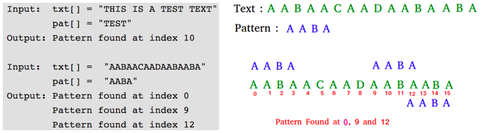
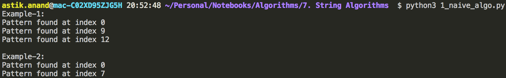
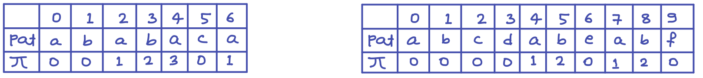
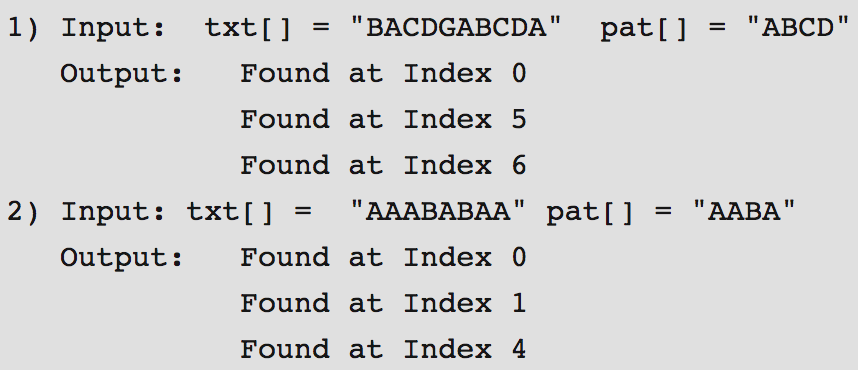
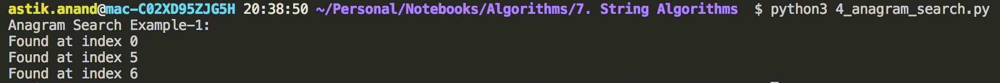

# Pattern Searching - String Algorithms

###### **Problem:**

Given a text **txt[0..n-1]** and a pattern **pat[0..m-1]**, write a function **search(pat, txt)** that prints all occurrences of pat[] in txt[].  

You may assume that n > m.



- Pattern searching is an important problem in computer science.
- When we do search for a string in notepad/word file or browser or database, pattern searching algorithms are used to show the search results.

------

### Standard Pattern Search - String Algorithm Problems

## 1. Naive Algorithm

###### **Problem:**

Find a pattern in the given text.

###### **Approach:**

- Just need to use 2 loops to check every substring of same length as of given pattern and check if it matches it.

###### **Implementation:**

```python
# Given a text txt[0..n-1] and a pattern pat[0..m-1], write a function search(pat, txt) that prints all occurrences of pat[] in txt[]. 
# You may assume that n > m.


def naive_pattern_search(pat, text):
    m = len(pat)
    n = len(text)

    for i in range(n-m+1):
        flag = True
        for j in range(m):
            if(pat[j] != text[i+j]):
                flag = False
        
        if(flag):
            print("Pattern found at index {}".format(i))


print("Example-1:")
txt = "AABAACAADAABAABA"
pat = "AABA"
naive_pattern_search(pat, txt)

print("Example-2:")
txt = "abracadabra"
pat = "ab"
naive_pattern_search(pat, txt)


# Time Complexity:
# Best Case: O(n) - First character of pattern is not present in text
# Worst Case: O(n-m+1)(m) - All characters of the text and pattern are same OR only the last character is different.
```

**Output:**



###### **Complexity:**

- **Time**
    - ***Best Case:*** **O(n)** - First character of pattern is not present in text 
    - ***Worst Case***: **O(n-m+1)(m)** - All characters of the text and pattern are same OR only the last character is different. 
- **Auxilliary Space: O(1)**


## 2. Rabin-Karp Algorithm***

###### **Approach:**

Like the Naive Algorithm, Rabin-Karp algorithm also slides the pattern one by one.

But unlike the Naive algorithm, Rabin Karp algorithm matches the hash value of the pattern with the hash value of current substring of text,

and if the hash values match then only it starts matching individual characters.

##### Rabin-Karp algorithm needs to calculate hash values for following strings:

1. Pattern itself.
2. All the substrings of text of length m.

##### **Calculating hash function as suggested by Rabin-Karp:**

- We treat string character with its ASCII value and hence we take base as 256.

- The numeric values cannot be practically stored as an integer.

- Hence numeric value is calculated using modular arithmetic to make sure that the hash values can be stored in an integer variable.

- To do rehashing, we need to take off the most significant digit and add the new least significant digit for hash value.

    > **Rehashing Formula:**
    >
    > hash( txt[s+1 .. s+m] ) = ( d ( hash(txt[s .. s+m-1]) – txt[s]*h ) + txt[s + m] ) mod q 

###### **Implementation:**

```python
def rabin_karp_search(pat, text):
    base = 256         # Total number of characters, if you consider less numbers of characters 
                       # base can be set accordingly
    q = 101            # Prime to take modulo
    p_hash = 0         # Hash value for pattern
    t_hash = 0         # Hash value for text
    m = len(pat)
    n = len(text)

    # Calculating h that will be used for rehashing:  h = pow(base, m-1)%q
    h = 1
    for i in range(m-1):
        h = (h*base)%q
    
    # Calculating hash for pat and initial text
    for i in range(m):
        p_hash = (p_hash*base + ord(pat[i]))%q      # ord(char) : gives ascii value of char
        t_hash = (t_hash*base + ord(text[i]))%q

    # Slide the pattern over text one by one 
    for i in range(n-m+1):
        # Check the hash values of current window of text and pattern
        if t_hash == p_hash:   # if the hash values match then only check for characters one by one 
            for j in range(m):
                if(text[i+j] != pat[j]):
                    break
            if(j==m-1):
                print("Found at index {}".format(i))
        
        # Calculate hash value for next window of text: Remove leading digit, add trailing digit 
        if i+m < n:
            t_hash = ((t_hash - h*ord(text[i]))*base + ord(text[i+m]))%q

            # We might get negative values of t_hash, converting it to positive 
            if t_hash < 0: 
                t_hash = t_hash+q 


print("Rabin-Karp Example-1:")
txt = "bacbabababacaca"
pat = "ababaca"
rabin_karp_search(pat, txt)

print("\nRabin-Karp Example-2:")
txt = "abracadabra"
pat = "ab"
rabin_karp_search(pat, txt)

print("\nRabin-Karp Example-3:")
txt = "AABAACAADAABAABA"
pat = "AABA"
rabin_karp_search(pat, txt)

# Complexity:
# Time: O(n)
# Auxilliary Space: O(1)
```

**Output:**


###### **Complexity:**

- **Time:**
    - ***Average & Best Case:*** **O(n + m)** 
    - ***Worst Case***: **O(n)(m)** - Failure of hash function that leads to all spurious hits 
- **Auxilliary Space: O(1)**


## 3. KMP (Knuth Morris Pratt) Algorithm***

###### **Approach:**

- Naive doesn't work well in cases where we see many matching characters followed by a mismatching character.

    > **Example:**
    >
    > **txt** = "AAAAAAAAAAAAAAAAAB" and **pat** = "AAAAB"

- KMP algorithm uses degenerating property (pattern having same sub-patterns appearing more than once in the pattern) of the pattern & improves the worst case complexity to O(n).

- The basic idea behind KMP’s algorithm is: whenever we detect a mismatch (after some matches), we already know some of the characters in the text of the next window.

- We take advantage of this information to avoid matching the characters that we know will anyway match.

###### **Preprocessing:**

- KMP algorithm preprocesses **pat[]** and constructs an auxiliary **lps[]** of size m (same as size of pattern) which is used to skip characters while matching.

- Name lps indicates longest proper prefix which is also suffix.

- A proper prefix is prefix with whole string notallowed.

    > **Example:** 
    >
    > Prefixes of "ABC" are " ", "A", "AB" and "ABC".
    >
    > Proper prefixes are " ", "A" and "AB".
    >
    > Suffixes of the string are " ", "C", "BC" and "ABC".

- We search for lps in sub-patterns. More clearly we focus on sub-strings of patterns that are either prefix and suffix.

- For each sub-pattern **pat[0..i]** where i = 0 to m-1, **lps[i]** stores length of the maximum matching proper prefix which is also a suffix of the sub-pattern **pat[0..i]**.

- For each sub-pattern **pat[0..i]** where i = 0 to m-1, **lps[i]** stores length of the maximum matching proper prefix which is also a suffix of the sub-pattern **pat[0..i]**.

    > **lps[i]** = the longest proper prefix of pat[0..i] which is also a suffix of pat[0..i]

#### Longest Proper Prefix also a Suffix: LPS[] 

###### Calculating  LPS or  Pi (π) or False function



###### **Algorithm** **to calculate π**

- Start from **j=0, i=1** and **π[0]=0** for pat. 
- if **pat[i]==pat[j]** put **π[i]=j+1** and **increase** both **i** and **j**. 
- Else if it doesn’t match and **j>0** change **j =** **π[j-1]**. 
- Else if j==0 put **π[i]=0** and **increase i**. 

###### **Implementation** **to calculate π**

```python
def calculate_lps(pat):
    m = len(pat)
    lps = [0]*m
    i = 1; j = 0

    while(i < m):
        if(pat[i] == pat[j]):
            lps[i] = j+1
            i+=1
            j+=1
        elif(j>0):
            j = lps[j-1]
        else:
            lps[i] = 0
            i+=1
    
    return lps


print("LPS Example-1:")
pat = "ababaca"
print(str(calculate_lps(pat)))

print("\nLPS Example-2:")
pat = "abcdabeabf"
print(str(calculate_lps(pat)))

# Complexity:
# Time: O(m)
# Auxilliary Space: O(m)
```

**Output:**


###### **Complexity:**

- **Time: O(m)**
- **Auxilliary Space: O(m)**

#### Matching Algorithm

###### **Algorithm**

- Start from **i=0, j=0** we will use i to track text and j to track pat.  
- if **text[i] == pat[j]** then **increase** both **i** and **j** and check 
    - if j==m then it’s match print and reset  **j = lps[j-1]** to find next occurrence of the pattern 
- Else if it doesn’t match and **j>0** change **j = lps[j-1]**. 
- Else if j==0 then **increase i**.

###### **Implementation**

```python
def KMP_search(pat, text):
    lps = calculate_lps(pat)
    i=0; j=0
    m = len(pat)
    n = len(text)

    while(i<n):
        if(text[i] == pat[j]):
            i+=1
            j+=1
            if(j == m):
                print("Found at index {}".format(i-j))
                j = lps[j-1]
        elif(j>0):
            j = lps[j-1]
        else:
            i+=1

print("KMP Example-1:")
txt = "bacbabababacaca"
pat = "ababaca"
KMP_search(pat, txt)

print("\nKMP Example-2:")
txt = "abracadabra"
pat = "ab"
KMP_search(pat, txt)

print("\nKMP Example-3:")
txt = "AABAACAADAABAABA"
pat = "AABA"
KMP_search(pat, txt)

# Complexity:
# Time: O(m+n)
# Auxilliary Space: O(m)
```

**Output:**


###### **Complexity:**

- **Time: O(n+m)**
- **Auxilliary Space: O(m)**


## 4. Anagram Substring Search

###### **Problem:**

Given a text **txt[0..n-1]** and a pattern **pat[0..m-1]**.

Write a function **search(pat, txt)** that prints **all occurrences of pat[]** **and its permutations (or anagrams)** in txt[]. 

You may assume that n > m.



###### **Algorithm:**

- Store counts of frequencies of pattern in first count array **countP[]** and counts of frequencies of characters in first window of text in array **countTW[]**. 
- Now run a loop from i =m to n-1. Do following in loop.
    - a) If the two count arrays are identical, we found an occurrence.
    - b) Increment count of current character of text in countTW[]
    - c) Decrement count of first character in previous window in countWT[]
- The last window is not checked by above loop, so explicitly check it.

###### **Implementation**

```python
def anagram_search(pat, text):
    m = len(pat)
    n = len(text)
    count_pat = [0]*256     # Total 256 characters
    count_text_window = [0]*256

    # fill the count_pat and count_text_window array
    for i in range(m):
        count_pat[ord(pat[i])] += 1
        count_text_window[ord(pat[i])] += 1
    
    # Starts searching anagrams or permutations
    for i in range(m, n):
        if(count_pat == count_text_window):
            print("Found at index {}".format(i-m))
        
        # Increase the frequency of next character and decrease the frequncy of first character in window
        count_text_window[ord(text[i])] += 1
        count_text_window[ord(text[i-m])] -= 1
    
    # Check for last window as it will be left in this loop
    if(count_pat == count_text_window):
            print("Found at index {}".format(n-m))


print("Anagram Search Example-1:")
txt = "BACDGABCDA"
pat = "ABCD"       
anagram_search(pat, txt)
```

**Output:**



###### **Complexity:**

- **Time: O(n)**
- **Auxilliary Space: O(1) :** Only 256 spaces can be treated as constant. 


## 5. Manacher's  Algorithm - Linear time Longest Palindromic Substring***

###### **Problem:**

Given a string, find the longest substring which is palindrome.

> ***Examples:***
>
> - string = “abaabc” output = “baab" 
> - string = “babcbabcbaccba” output = “abcbabcba”
> - string = “abaaba” output = “abaaba”
> - string = “abababa” output = “abababa”
> - string = “forgeeksskeegfor”  output = “geeksskeeg”

###### **Approaches to solve:**

- **Naive Approach :** O(n<sup>3</sup>)
- **Dynamic Programming:** O(n<sup>2</sup>)
- **Manacher Algorithm:** O(n)

###### **Manacher Approach:**


###### **Manacher** **Algorithm:**

- **Pre-Processing:**
    - Push **“****#”** before and after every character and create a **new_text**. Example: text = “abc” then new_text= “#a#b#a#" 
    - Create an array **P[]** of size(2n+1) to store palindromic values of the new_text. 
    - Initialize **Center(C) = 0** and **Right(R) = 0** 
- **Processing:**
    - Loop over the pre-processed new_text and do
    - Get **mirror_index** of currently processing value(i) using center(C). 
    - Check if Right(R) is greater than current(i): then put **min(R-i, P[i_mirror])** or else put 0 in P[i].  
    - Keep expanding using current and already palindrome (at that stage using p[I]) until the next character and mirror character from i are same.
    - Now if newly calculated P[i] is greater than R-i then update **C=i** and **R=P[i] + i** 
- **Post-Processing:**
    - Find the max of P[] array and that is the max_length of palindrome and its index is center_index
    - Calculate start and end index of palindrome in original text using start = (center_index-max_pal_len)/2 and end = (center_index+max_pal_len)/2
    - Print the palindrome using start and end index using original text.

###### Implementation

```python
def manacher_longest_palindromic_substring(text):
    # Preprocess the given text
    new_text = "#"
    for ch in text:
        new_text += ch
        new_text += "#"
    
    n = len(new_text)
    P = [0]*n    # Array to store palindromic values

    # Center(C) : Index of mirror line
    # Right(R)  : Where we are going to end our bounds on right hand side
    # Left(L)   : No need to store Left(L) as it can be calculated using something like i_mirror
    C = 0
    R = 0

    # Iterate through entire new_text
    for i in range(n):
        # i is pointing to current element
        mirror = C - (i-C)  # Mirror index of i

        # If i < right bound(R) then simply copy min of mirror value or (R-i)
        if(i < R):
            P[i] = min(R-i, P[mirror])

        # Expand around both sides of i to find new center(C)
        while(((i + P[i] + 1) < n) and ((i - P[i] - 1) >= 0) and \
              (new_s[i + P[i] + 1] == new_s[i - P[i] - 1])):
            P[i] += 1

        # If i + P[i] > right bound(R) then update Center and Right bound
        if(i + P[i] > R):
            C = i
            R = i + P[i]

    # Find the length of largest palindrome and center_index
    max_pal_len = max(P)
    center_index = P.index(max_pal_len)

    # Print the longest palindrome
    start = int((center_index-max_pal_len)/2)
    end = int((center_index+max_pal_len)/2)

    print("Largest Palindromic Susbtring: {}".format(text[start:end]))


print("Manacher Example-1:")
txt = "abaabc"
manacher_longest_palindromic_substring(txt)

print("Manacher Example-2:")
txt = "babcbabcbaccba"
manacher_longest_palindromic_substring(txt)

print("Manacher Example-3:")
txt = "abaaba"
manacher_longest_palindromic_substring(txt)

print("Manacher Example-4:")
txt = "abababa"
manacher_longest_palindromic_substring(txt)

print("Manacher Example-5:")
txt = "forgeeksskeegfor"
manacher_longest_palindromic_substring(txt)
```

**Output:**


###### **Complexity:**

- **Time: O(n) :** Traversing through loop only once. 
- **Auxilliary Space: O(n) :** We are using (2n+1) spaces array 


## 6. Longest Even Length Substring :- Sum of 1st & 2nd half is same***

###### Problem:


###### Approach:


###### Implementation:

```python


```

**Output:**


###### **Complexity:**

- **Time:**
- **Auxilliary Space:**


## 7. All Possible Strings - Made by Placing Spaces***

###### **Problem:**

Given a string, print all possible strings that can be made by placing spaces (zero or one) in between them.

> **Example:**
>
> input = ABC 
>
> output: 
>
> ​    ABC 
>
> ​    AB&nbsp;C 
>
> ​    A&nbsp; BC 
>
> ​    A &nbsp;B &nbsp;C 

###### **Algorithm:**

- Use recursion and create a buffer that one by one contains all output strings having spaces.
- Keep updating buffer in every recursive call.
- If the length of given string is **"n”** the updated string can have maximum length of **2n-1** and so we create buffer size of 2n (one extra character for string termination). 
- Leave 1st character as it is, starting from the 2nd character, either fill a space or a character.

###### **Implementation:**

```python
def to_string(str_list): 
    s = "" 
    for x in str_list: 
        if x == "$": 
            break
        s += x 
    return s 


def print_pattern_util(string, buffer, i, j, n):
    if(i==n):
        buffer[j] = "$"
        print(to_string(buffer))
        return
    
    # Either put the character 
    buffer[j] = string[i] 
    print_pattern_util(string, buffer, i+1, j+1, n) 
  
    # Or put a space followed by next character 
    buffer[j] = " "
    buffer[j+1] = string[i] 
  
    print_pattern_util(string, buffer, i+1, j+2, n)
    


def print_pattern(string):
    n = len(string)
    buffer = [0]*(2*n)
    buffer[0] = string[0]

    print_pattern_util(string, buffer, 1, 1, n)


print("Example-1:")
string = "ABCD"
print_pattern(string)

print("Example-2:")
string = "12345"
print_pattern(string)
```

**Output:**


###### **Complexity:**

- **Time:** **O(n\*(2<sup>n</sup>))** **:** Since number of Gaps are n-1, there are total 2<sup>n-1</sup> patterns each having length ranging from n to 2n-1, hence overall complexity would be O(n*(2<sup>n</sup>)) 
- **Auxilliary Space: O(n) :** We are using (2n) spaces array 


## 8. Print all Anagrams Together - Sequence of words are given***

###### Problem:


###### Approach:


###### Implementation:

```python


```

**Output:**


###### **Complexity:**

- **Time:**
- **Auxilliary Space:**


------

<a href="6_divide_conquer" class="prev-button">&larr; Previous: Divide and Conquer</a>   <a href="8_bit_algorithms" class="next-button">Next: Bit Algorithms &rarr;</a>

