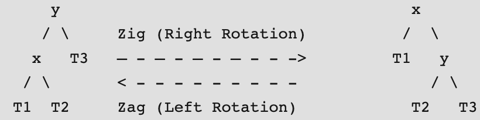
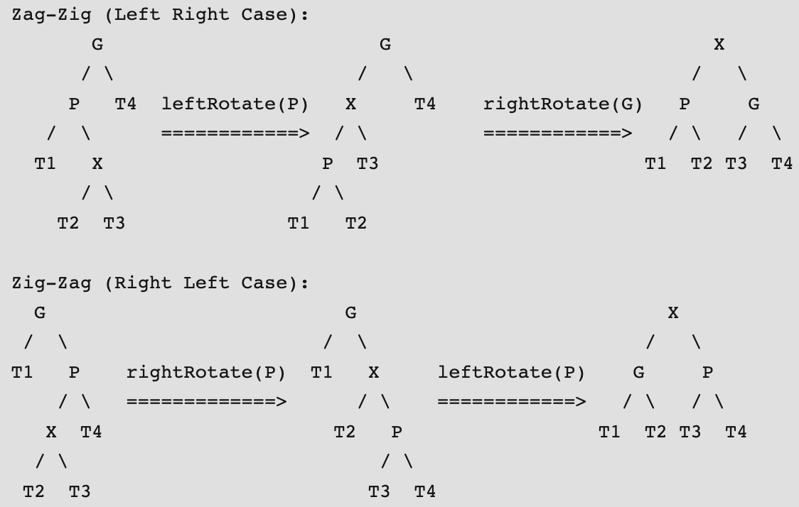
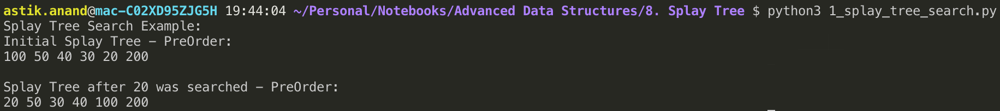
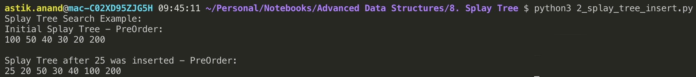

# Splay Tree

###### What is Splay Tree ?

- Invented by **Daniel Sleator and Robert Tarjan** in **1985**.
- Splay tree is a **self-organizing** tree but **NOT** a **self-balancing** tree.
- It has the property that recently accessed elements are quick to access again.
- ***Splay trees have become the most widely used basic data structure invented in the last 30 years.***
- Because they're the fastest type of balanced search tree for many applications. 
- Performs basic operations such as insertion, look-up and removal in O(log n) amortized time.
- For many sequences of non-random operations, splay trees perform better than other search trees.

###### Why Splay Trees ?

- Good performance coz frequently accessed nodes will move nearer to the root where they can be accessed more quickly.
- **The worst-case height—though unlikely—is O(n), with the average being O(log n).** 
- Having frequently-used nodes near the root is an advantage for many practical applications.

##### Splaying Operation

- All normal operations on a binary search tree are combined with one basic operation, called **splaying**.
- Splaying the tree for a certain element rearranges the tree so that the element is placed at the root of the tree. 
- One way to do this with the basic search operation is to first perform a standard binary tree search for the element in question, and then use tree rotations in a specific fashion to bring the element to the top. 
- Alternatively, a top-down algorithm can combine the search and the tree reorganization into a single phase.

#### Applications:

- Windows NT (in the virtual memory, networking, and file system code)
- gcc compiler and GNU C++ library
- sed string editor
- Systems network routers 
- The most popular implementation of Unix malloc
- Linux loadable kernel modules and in much other software

## Search Operation***

- Do the standard BST search and additionaly splays the root (move a node to the root).
- If the search is successful, then the node that is found is splayed and becomes the new root. 
- Else the last node accessed prior to reaching the NULL is splayed and becomes the new root.

#### 3 Possible Cases while searching:

###### Case-1:- Node is already Root (No Parent and Grandparent) ----------> No Rotation

Simply return the root, don’t do anything else as the accessed node is already root.

###### Case-2: Node is child of Root (No Grandparent) ----------> Zig(Right Rotation) or Zag(Left Rotation)

Node is either a left child of root (we do a right rotation) or node is a right child of its parent (we do a left rotation).



###### Case-3: Node has both parent and grandparent

**There are 2 possible subcases:**

1. **Left-Left Case or Right-Right Case ---------------> Zig-Zig or Zag-Zag Rotation**

    - **Zig-Zig:** Node is left child of parent and parent is also left child of grand parent (Two right rotations).
    - **Zag-Zag:** Node is right child of its parent and parent is also right child of grand parent (Two Left Rotations).

    

    

2. **Left-Right Case or Right-Left Case ---------------> Zag-Zig or Zig-Zag Rotation**

    - **Zag-Zig:** Node is right child of its parent and parent is left child of grand parent (Left Rotation then Right Rotation).
    - **Zig-Zag:** Node is left child of parent and parent is right child of grand parent (Right Rotation then Left Rotation).

    

    

###### Splay Tree Search Example: Search 20


##### Notes: 

- The important thing to note is, the search or splay operation not only brings the searched key to root, but also balances the BST.
- For example in above case, height of BST is reduced by 1.

#### Implementation:

```python
class Node:
    def __init__(self, key):
        self.key = key
        self.left = None
        self.right = None


def right_rotate(current_pivot):
    new_pivot = current_pivot.left
    temp = new_pivot.right
    new_pivot.right = current_pivot
    current_pivot.left = temp

    return new_pivot


def left_rotate(current_pivot):
    new_pivot = current_pivot.right
    temp = new_pivot.left
    new_pivot.left = current_pivot
    current_pivot.right = temp

    return new_pivot


def splay(root, key):
    # Node is already Root
    if root is None or root.key == key:
        return root
    
    # Node is present if left subtree
    if key < root.key:
        # key is not in tree, we are done - return the last accessed 
        if root.left is None:
            return root
        
        # Zig-Zig (Left Left) Case
        if key < root.left.key:
            # First recursively bring the key as root of left-left  
            root.left.left = splay(root.left.left, key)
            root = right_rotate(root)  # First Rotation of root
        
        # Zag-Zig (Left Right) Case
        elif key > root.left.key:
            # First recursively bring the key as root of left-right  
            root.left.right = splay(root.left.right, key)

            if root.left.right:
                root.left = left_rotate(root.left)  # First Rotation for root-left
        
        return root if root.left is None else right_rotate(root)
    
    # Node is present in right subtree
    else:
        # key is not in tree, we are done - return the last accessed 
        if root.right is None:
            return root
        
        # Zag-Zag (Right Right Case)
        if key > root.right.key:
            # First recursively bring the key as root of right-right 
            root.right.right = splay(root.right.right, key)
            root = left_rotate(root)  # First Rotation of root
        
        # Zig-Zag (Right Left) Case
        elif key < root.right.key:
            # First recursively bring the key as root of right-left
            root.right.left = splay(root.right.left, key)

            if root.right.left:
                root.right = right_rotate(root.right) # First rotation of root-right
        
        return root if root.right is None else left_rotate(root)


def search_key(root, k):
    return splay(root, k)


def print_preorder(root):
    if root:
        print(root.key, end=" ")
        print_preorder(root.left)
        print_preorder(root.right)


print("Splay Tree Search Example:")
root = Node(100) 
root.left = Node(50) 
root.right = Node(200) 
root.left.left = Node(40) 
root.left.left.left = Node(30) 
root.left.left.left.left = Node(20)

print("Initial Splay Tree - PreOrder:")
print_preorder(root)
print() 
print("\nSplay Tree after 20 was searched - PreOrder:")   
root = search_key(root, 20)
print_preorder(root)
print()
```

**Output:**



##### Notes:

- Splay trees have excellent locality properties. Frequently accessed items are easy to find. Infrequent items are out of way.
- All splay tree operations take O(Logn) time on average. Splay trees can be rigorously shown to run in O(log n) average time per operation, over any sequence of operations (assuming we start from an empty tree).
- Splay trees are simpler compared to AVL and Red-Black Trees as no extra field is required in every tree node.
- Unlike AVL tree, a splay tree can change even with read-only operations like search.


## Insert Operation***

#### Steps to insert a key k in Splay Tree:

1. **Root is NULL:** Simply return a new node as **root**.
2. Splay the given key k, in the process if k is already present, then it becomes the **root** and if not present, then last accessed leaf node becomes the **root**.
3. If root we got has the key same as k, don’t do anything as k is already present, return root.
4. Else make a **new_node** and compare root’s key with k.
    - If root’s key is smaller than k, make root as left child of new_node, copy right child of root as right child of new_node and make right child of root as NULL.
    - If root’s key is greater than k, make root as right child of new_node, copy left child of root as left child of new_node and make left child of root as NULL.
5. Return **new_node** as **new_root** of tree.

###### Splay Tree Insert Example: Insert 25


#### Implementation

```python
class Node:
    def __init__(self, key):
        self.key = key
        self.left = None
        self.right = None


def right_rotate(current_pivot):
    new_pivot = current_pivot.left
    temp = new_pivot.right
    new_pivot.right = current_pivot
    current_pivot.left = temp

    return new_pivot


def left_rotate(current_pivot):
    new_pivot = current_pivot.right
    temp = new_pivot.left
    new_pivot.left = current_pivot
    current_pivot.right = temp

    return new_pivot


def splay(root, key):
    # Node is already Root
    if root is None or root.key == key:
        return root
    
    # Node is present if left subtree
    if key < root.key:
        # key is not in tree, we are done - return the last accessed 
        if root.left is None:
            return root
        
        # Zig-Zig (Left Left) Case
        if key < root.left.key:
            # First recursively bring the key as root of left-left  
            root.left.left = splay(root.left.left, key)
            root = right_rotate(root)  # First Rotation of root
        
        # Zag-Zig (Left Right) Case
        elif key > root.left.key:
            # First recursively bring the key as root of left-right  
            root.left.right = splay(root.left.right, key)

            if root.left.right:
                root.left = left_rotate(root.left)  # First Rotation for root-left
        
        return root if root.left is None else right_rotate(root)
    
    # Node is present in right subtree
    else:
        # key is not in tree, we are done - return the last accessed 
        if root.right is None:
            return root
        
        # Zag-Zag (Right Right Case)
        if key > root.right.key:
            # First recursively bring the key as root of right-right 
            root.right.right = splay(root.right.right, key)
            root = left_rotate(root)  # First Rotation of root
        
        # Zig-Zag (Right Left) Case
        elif key < root.right.key:
            # First recursively bring the key as root of right-left
            root.right.left = splay(root.right.left, key)

            if root.right.left:
                root.right = right_rotate(root.right) # First rotation of root-right
        
        return root if root.right is None else left_rotate(root)


def insert_key(root, k):
    # If root is NULL, return new node
    if root is None:
        return Node(k)

    # Splay the given key k and find the root
    root = splay(root, k)

    # If root's key is same as k, don't do anything
    if root.key == k:
        return root
    else:
        new_node = Node(k)
        if root.key < k:
            new_node.left = root
            new_node.right = root.right
            root.right = None
        else:
            new_node.right = root
            new_node.left = root.left
            root.left = None
        
        return new_node
            

def print_preorder(root):
    if root:
        print(root.key, end=" ")
        print_preorder(root.left)
        print_preorder(root.right)


print("Splay Tree Search Example:")
root = Node(100) 
root.left = Node(50) 
root.right = Node(200) 
root.left.left = Node(40) 
root.left.left.left = Node(30) 
root.left.left.left.left = Node(20)

print("Initial Splay Tree - PreOrder:")
print_preorder(root)
print() 
print("\nSplay Tree after 25 was inserted - PreOrder:")   
root = insert_key(root, 25)
print_preorder(root)
print()
```

**Output:**




## Delete Operation***

#### Steps to delete a key k in Splay Tree:

1. **Root is NULL:** Simply return the **root**.
2. Splay the given key k, in the process if k is already present, then it becomes the **root** and if not present, then last accessed leaf node becomes the **root**.
3. If root we got doesn't has the key same as k, nothing to delete, return root.
4. Else the key **k** is present and we need to delete the found root.
    - Split the tree into two trees **Tree1 = root1 = root’s left subtree** and **Tree2 = root2 =  root’s right subtree** and delete the root node.
    - If root1 is NULL, simply return root2.
    - Else, Splay the the Tree1 i.e the left subtree with key, as it doesn't has key k, the max value will come on top for root1.
    - Simply make root2 as right child of root1 and return root1.

###### Splay Tree Delete Example : Delete 4


#### Implementation

```python
class Node:
    def __init__(self, key):
        self.key = key
        self.left = None
        self.right = None


def right_rotate(current_pivot):
    new_pivot = current_pivot.left
    temp = new_pivot.right
    new_pivot.right = current_pivot
    current_pivot.left = temp

    return new_pivot


def left_rotate(current_pivot):
    new_pivot = current_pivot.right
    temp = new_pivot.left
    new_pivot.left = current_pivot
    current_pivot.right = temp

    return new_pivot


def splay(root, key):
    # Node is already Root
    if root is None or root.key == key:
        return root
    
    # Node is present if left subtree
    if key < root.key:
        # key is not in tree, we are done - return the last accessed 
        if root.left is None:
            return root
        
        # Zig-Zig (Left Left) Case
        if key < root.left.key:
            # First recursively bring the key as root of left-left  
            root.left.left = splay(root.left.left, key)
            root = right_rotate(root)  # First Rotation of root
        
        # Zag-Zig (Left Right) Case
        elif key > root.left.key:
            # First recursively bring the key as root of left-right  
            root.left.right = splay(root.left.right, key)

            if root.left.right:
                root.left = left_rotate(root.left)  # First Rotation for root-left
        
        return root if root.left is None else right_rotate(root)
    
    # Node is present in right subtree
    else:
        # key is not in tree, we are done - return the last accessed 
        if root.right is None:
            return root
        
        # Zag-Zag (Right Right Case)
        if key > root.right.key:
            # First recursively bring the key as root of right-right 
            root.right.right = splay(root.right.right, key)
            root = left_rotate(root)  # First Rotation of root
        
        # Zig-Zag (Right Left) Case
        elif key < root.right.key:
            # First recursively bring the key as root of right-left
            root.right.left = splay(root.right.left, key)

            if root.right.left:
                root.right = right_rotate(root.right) # First rotation of root-right
        
        return root if root.right is None else left_rotate(root)


def delete_key(root, k):
    # If root is NULL, return new node
    if root is None:
        return root

    # Splay the given key k and find the root
    root = splay(root, k)

    # If root we got doesn't has the key same as k, nothing to delete, return root.
    if root.key != k:
        return root
    else:
        # Split the tree into two trees, delete the root node
        root1 = root.left
        root2 = root.right
        del root

        # If root1 is NULL, return root2
        if root1 is None:
            return root2
        else:
            # Splay tree1 with key=k to get max on top
            root1 = splay(root1, k)
            root1.right = root2     # Make root2 as right child of root1

            return root1
            

def print_preorder(root):
    if root:
        print(root.key, end=" ")
        print_preorder(root.left)
        print_preorder(root.right)


print("Splay Tree Delete Example:")
root = Node(6) 
root.left = Node(1) 
root.right = Node(9) 
root.left.right = Node(4) 
root.right.left = Node(7) 
root.left.right.left = Node(2)

print("Initial Splay Tree - PreOrder:")
print_preorder(root)
print() 
print("\nSplay Tree after 4 was deleted - PreOrder:")   
root = delete_key(root, 4)
print_preorder(root)
print()
```

**Output:**


------

<a href="7_binary_indexed_fenwick_tree" class="prev-button">&larr; Previous:  Binary Indexed / Fenwick Tree</a> <a href="9_b_trees" class="next-button">Next: B Trees &rarr;</a>

