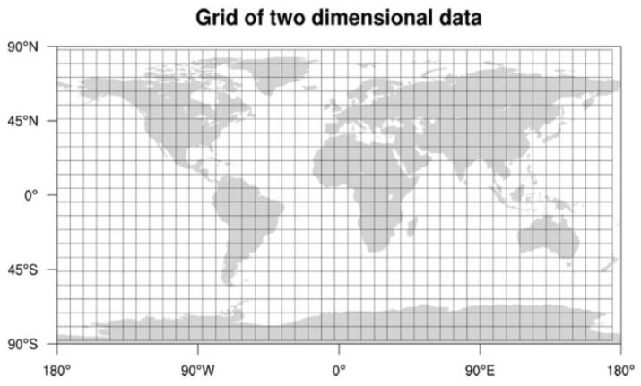
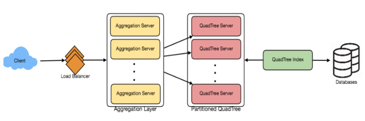

# Design Yelp or Nearby
###### Problem Statement:

- Let's design a Yelp like service, where users can search for nearby places like restaurants, theaters or shopping malls, etc., and can also add/view reviews of places.
- **Similar Services:** Proximity server.
- **Difficulty Level:** Hard

<br>

#### Step-1: Why Yelp or Proximity Server?
- Proximity servers are used to discover nearby attractions like places, events, etc.
- We can search for nearby restaurants, theaters, etc. using it.

<br>

#### Step-2: Requirements and Goals of the System
- Our service will be storing information about different places so that users can perform a search on them.
- Upon querying, our service will return a list of places around the user.
- Our Yelp-like service should meet the following requirements:
- [Functional Requirements:]()
  1. Users should be able to add/delete/update Places.
  2. Given their location (longitude/latitude), users should be able to find all nearby places within a given radius.
  3. Users should be able to add feedback/review about a place, the feedback can have pictures, text, and a rating.
- [Non-functional Requirements:]()
  1. Users should have real-time search experience with minimum latency.
  2. Our service should support a heavy search load as there will be a lot of search requests compared to adding a new place.

<br>

#### Step-3: Capacity Estimation

- Let’s build our system assuming that we have **500M places** and **100K queries per second** (QPS).
- Let’s also assume a **20% growth in the no. of places and QPS each year**.

<br>

#### Step-4: Database Schema
- Each location can have following fields:
  1. LocationID (8bytes): Uniquely identifies a location.
  2. Name (256 bytes)
  3. Latitude (8 bytes)
  4. Longitude (8 bytes)
  5. Description (512 bytes)
  6. Category (1 byte): e.g., coffee shop, restaurant, theater, etc.
- Although a 4 bytes number can uniquely identify 500M locations, with future growth in mind, we will go with 8 bytes for LocationID.
- Total size for a location: 8 + 256 + 8 + 8 + 512 + 1 => 793 bytes
- We also need to store reviews, photos, and ratings of a Place.
- We can have a separate table to store reviews for Places:
  1. LocationID (8bytes)
  2. ReviewID (4 bytes): Uniquely identifies a review, assuming any location will not have more than 2^32 reviews.
  3. ReviewText (512 bytes)
  4. Rating (1 byte): how many stars a place gets out of ten.
- Similarly, we can have a separate table to store photos for Places and Reviews.

<br>

#### Step-5: System APIs
##### Search API
```
search(api_dev_key, search_terms, user_location, radius_filter, maximum_results_to_return, category_filter, sort, page_token)
```

- [Parameters:]()
  - **api_dev_key (string):** The API developer key of a registered account, will be used to, among other things, throttle users based on their allocated quota.
  - **search_terms (string):** A string containing the search terms.
  - **user_location (string):** Location of the user performing the search.
  - **radius_filter (number):** Optional search radius in meters.
  - **maximum_results_to_return (number):** Number of business results to return.
  - **category_filter (string):** Optional category to filter search results with, e.g., Restaurants, Shopping Centers. etc.
  - **sort (number):** Optional sort mode: Best matched (0 - default), Minimum distance (1), Highest rated (2).
  - **page_token (string):** This token will specify a page in the result set that should be returned.
- [Returns: (JSON)]()
  - A JSON containing information about a list of businesses matching the search query.
  - Each result entry will have the business name, address, category, rating, and thumbnail.

<br>

#### Step-6: Basic System Design and Algorithm
- At a high level, we need to store and index each dataset described above (places, reviews, etc.).
- For users to query this massive database, the indexing should be read efficient, since while searching for nearby places users expect to see the results in real-time.
- Given that the location of a place doesn’t change that often, we don’t need to worry about frequent updates of the data.
- As a contrast, if we intend to build a service where objects do change their location frequently, e.g., people or taxis, then we might come up with a very different design.

<br>

**Let’s see what are different ways to store this data and find out which method will suit best for our use cases:**

> ##### a) SQL Approach:

- One simple solution could be to store all the data in a database like MySQL.
- Each place will be stored in a separate row, uniquely identified by LocationID.
- Each place will have its longitude and latitude stored separately in two different columns, and to perform a fast search; we should have indexes on both these fields.

- ***To find all the nearby places of a given location (X, Y) within a radius ‘D’, we can query like below:***

```sql
Select * from Places where Latitude between X-D and X+D and Longitude between Y-D and Y+D
```

###### How efficient this query would be?

- We have estimated 500M places to be stored in our service.
- Since we have two separate indexes, each index can return a huge list of places, and performing an intersection on those two lists won’t be efficient.
- Another way to look at this problem is that there could be too many locations b/w **'X-D'** and **'X+D'**, and similarly b/w **'Y-D'** and **'Y+D'**.
- If we can somehow shorten these lists, it can improve the performance of our query.

<br>

> ##### b) Grid Approach

- We can divide the whole map into smaller grids to group locations into smaller sets.
- Each grid will store all the Places residing within a certain range of longitude and latitude.
- This scheme would enable us to query only a few grids to find nearby places.
- Based on given location and radius, we can find all the nearby grids and then only query these grids to find nearby places.



- Let’s assume that GridID (a four bytes number) would uniquely identify grids in our system.

###### What could be a reasonable grid size ?

- Grid size could be equal to the distance we would like to query since we also want to reduce the number of grids.
- If the grid size is equal to the distance we want to query, then we only need to search within the grid which contains the given location and neighboring eight grids.
- Since our grids would be statically defined (from the fixed grid size), we can easily find the grid number of any location (lat, long) and its neighboring grids.
- In the database, we can store the GridID with each location and have an index on it too for faster searching.
- ***Now, our query will look like:***

```sql
Select * from Places where Latitude between X-D and X+D and 
	Longitude between Y-D and Y+D and GridID in (GridID, GridID1, GridID2, ..., GridID8)
```

- This will undoubtedly improve the runtime of our query.

###### Should we keep our index in memory ?

- Maintaining the index in memory will improve the performance of our service.
- We can keep our index in a hash table, where **'key'** will be the **grid number** and **'value'** will be the **list of places contained in that grid**.

###### How much memory will we need to store the index ?

- Let’s assume our search radius is 10 miles.
- Given that total area of the earth is around 200 million square miles, we will have 20 million grids.
- We would need a 4 bytes number to uniquely identify each grid, and since LocationID is 8 bytes.
- **Total memory required:** (ignoring hash table overhead) to store the index : (4 * 20M) + (8 * 500M) ~= **4 GB**

<br>

[Problems with Fixed Grid Approach:]()

- Can still run slow for those grids that have a lot of places since our places are not uniformly distributed among grids.
- We can have a thickly dense area with a lot of places, and on the other hand, we can have areas which are sparsely populated.

###### Using Dynamically Adjusting Grid Size

- Above problem can be solved by dynamically adjusting grid size.
- Whenever we have a grid with a lot of places break it down to create smaller grids.

- **Problems with this approach:**
  - How would we map these grids to locations ?
  - Also, how can we find all the neighboring grids of a grid ?

<br>

> ##### c) Dynamic Sized Grids - Quad Tree Approach

- Let’s assume we don’t want to have more than 500 places in a grid so that we can have a faster searching.
- So, whenever a grid reaches this limit, we break it down into four grids of equal size and distribute places among them.
- This means thickly populated areas like downtown San Francisco will have a lot of grids, and sparsely populated area like the Pacific Ocean will have large grids with places only around the coastal lines.

###### What data-structure can hold this information ?

- A tree in which **each node has 4 children** can serve our purpose.
- Each node will represent a grid and will contain information about all the places in that grid.
- If a node reaches our limit of 500 places, we will break it down to create four child nodes under it and distribute places among them.
- In this way, all the leaf nodes will represent the grids that cannot be further broken down.
- So leaf nodes will keep a list of places with them.
- This tree structure in which each node can have four children is called a [QuadTree]().


###### How will we build QuadTree ?

- We will start with one node that would represent the whole world in one grid.
- Since it will have more than 500 locations, we will break it down into four nodes and distribute locations among them.
- We will keep repeating this process with each child node until there are no nodes left with more than 500 locations.

###### How will we find the grid for a given location ?

- We will start with the root node and search downward to find our required node/grid.
- At each step, we will see if the current node we are visiting has children if it has we will move to the child node that contains our desired location and repeat this process.
- If the node does not have any children, then that is - our desired node.

###### How will we find neighboring grids of a given grid ?

- Since only leaf nodes contain a list of locations, we can connect all leaf nodes with a doubly linked list.
- This way we can iterate forward or backward among the neighboring leaf nodes to find out our desired locations.
- Another approach for finding adjacent grids would be through parent nodes.
- We can keep a pointer in each node to access its parent, and since each parent node has pointers to all of its children, we can easily find siblings of a node.
- We can keep expanding our search for neighboring grids by going up through the parent pointers.
- Once we have nearby LocationIDs, we can query backend database to find details about those places.

###### What will be the search workflow ?

- We will first find the node that contains the user’s location.
- If that node has enough desired places, we can return them to the user.
- If not, we will keep expanding to the neighboring nodes (either through the parent pointers or doubly linked list), until either we find the required number of places or exhaust our search based on the maximum radius.

###### How much memory will be needed to store the QuadTree ?

- For each Place, if we cache only LocationID and Lat/Long, **Total storage** to store all places: 24 * 500M => **12 GB**
- Since each grid can have maximum 500 places and we have 500M locations, **Total Grids:** 500M / 500 => **1M grids**
- That means **we will have 1M leaf nodes** and they will be **holding 12GB of location data**.
- A QuadTree with 1M leaf nodes will have approx. 1/3rd internal nodes, and each internal node will have 4 pointers (for its children).
- If **each pointer is 8 bytes**, then the **Memory need to store all internal nodes** would be: 1M * 1/3 * 4 * 8 = **10 MB**
- So, **Total Memory required to hold the whole QuadTree** would be **12.01GB**.
- This can easily fit into a modern-day server.

###### How would we insert a new Place into our system ?

- Whenever a new Place is added by a user, we need to insert it into the databases, as well as, in the QuadTree.
- If our tree resides on one server, it is easy to add a new Place, but if the QuadTree is distributed among different servers, first we need to find the grid/server of the new Place and then add it there (discussed in the next section).

<br>

#### Step-7: Data Partitioning

- **What if we have a huge number of places such that, our index does not fit into a single machine’s memory ?**
- With 20% growth, each year, we will reach the memory limit of the server in the future.
- Also, **what if one server cannot serve the desired read traffic ?**
- **To resolve these issues, we must partition our QuadTree.**

<br>

***We will explore two solutions here (both of these partitioning schemes can be applied to databases too):***

> ##### a) Sharding based on regions:

- We can divide our places into regions (like zip codes), such that all places belonging to a region will be stored on a fixed node.
- While storing, we will find the region of each place to find the server and store the place there.
- Similarly, while querying for nearby places, we can ask the region server that contains user’s location.
- **Issues with this Approach:**
  1. What if a region becomes hot ? There would be a lot of queries on the server holding that region, making it perform slow. This will
     affect the performance of our service.
  2. Over time some regions can end up storing a lot of places compared to others. Hence maintaining a uniform distribution of places, while regions are growing, is quite difficult.
- To recover from these situations either we have to repartition our data or use **consistent hashing**.

<br>

> ##### b) Sharding based on LocationID:

- Our hash function will map each LocationID to a server where we will store that place.
- While building our QuadTree, we will iterate through all the places and calculate the hash of each LocationID to find a server where it would be stored.
- To find nearby places of a location we have to query all servers, and each server will return a set of nearby places.
- A centralized server will aggregate these results to return them to the user.

###### Will we have different QuadTree structure on different partitions ?

- Yes, this can happen, since it is not guaranteed that we will have an equal number of places in any given grid on all partitions.
- Though, we do make sure that all servers have approximately equal number of Places.
- This different tree structure on different servers will not cause any issue though, as we will be searching all the neighboring
  grids within the given radius on all partitions.
- So here after we assume that we have partitioned our data based on LocationID.



<br>

#### Step-8: Replication and Fault Tolerance

- Having replicas of QuadTree servers can provide an alternate to data partitioning.
- To distribute read traffic, we can have replicas of each QuadTree server.
- We can have a master-slave configuration, where replicas (slaves) will only serve read traffic and all write traffic will first go the master and then applied to slaves.
- Slaves might not have some recently inserted places (a few milliseconds delay will be there), but this could be acceptable.

###### What will happen when a QuadTree server dies ?

- We can have a secondary replica of each server, and if primary dies, it can take control after the failover.
- Both primary and secondary servers will have the same QuadTree structure.

###### What if both primary and secondary servers die at the same time ?

- We have to allocate a new server and rebuild the same QuadTree on it.
- How can we do that, since we don’t know what places were kept on this server ?
- The brute-force solution would be to iterate through the whole database and filter LocationIDs using our hash function to figure out all the required places that will be stored on this server.
- This would be inefficient and slow, also during the time when the server is being rebuilt; we will not be able to serve any query from it, thus missing some places that should have been seen by users.

###### How can we efficiently retrieve a mapping between Places and QuadTree server ?

- We have to build a reverse index that will map all the Places to their QuadTree server.
- We can have a separate QuadTree Index server that will hold this information.
- We will need to build a HashMap, where the **'key'** would be the **QuadTree server number** and the **'value'** would be a **HashSet containing all the Places being kept on that QuadTree server**.
- We need to store LocationID and Lat/Long with each place because through this information servers can build their QuadTrees.
- Notice that we are keeping Places' data in a HashSet, this will enable us to add/remove Places from our index quickly.
- Now whenever a QuadTree server needs to rebuild itself, it can simply ask the QuadTree Index server for all the Places it needs to store.
- This approach will surely be quite fast.
- We should also have a replica of QuadTree Index server for fault tolerance.
- If a QuadTree Index server dies, it can always rebuild its index from iterating through the database.

<br>

#### Step-9: Cache
- To deal with hot Places, we can introduce a cache in front of our database.
- We can use an off-the-shelf solution like Memcache, which can store all data about hot places.
- Application servers before hitting backend database can quickly check if the cache has that Place.
- Based on clients’ usage pattern, we can adjust how many cache servers we need.
- For cache eviction policy, **Least Recently Used (LRU)** seems suitable for our system.

<br>

#### Step-10: Load Balancing (LB)
- We can add LB layer at two places in our system:
  - Between Clients and Application servers
  - Between Application servers and Backend server.
- Initially, a simple **Round Robin approach** can be adopted; that will distribute all incoming requests equally among backend servers.
- This LB is simple to implement and does not introduce any overhead.
- Another benefit is if a server is dead, the load balancer will take it out of the rotation and will stop sending any traffic to it.
- A **problem with Round Robin LB** is, it **won’t take server load into consideration**.
- If a server is overloaded or slow, the load balancer will not stop sending new requests to that server.
- To handle this, a more intelligent LB solution would be needed that periodically queries backend server about their load and adjusts traffic based on that.

<br>

#### Step-11: Ranking
- How about if we want to rank the search results not just by proximity but also by popularity or relevance?

###### How can we return most popular places within a given radius ?

- Let’s assume we keep track of the overall popularity of each place.
- An aggregated number can represent this popularity in our system, e.g., how many stars a place gets out of ten (this would be an average of different rankings given by users)?
- We will store this number in the database, as well as, in the QuadTree.
- While searching for top 100 places within a given radius, we can ask each partition of the QuadTree to return top 100 places having maximum popularity.
- Then the aggregator server can determine top 100 places among all the places returned by different partitions.

###### We didn’t build our system to update place’s data frequently. How can we modify popularity of a place in QuadTree in this design?

- Although we can search a place and update its popularity in the QuadTree.
- It would take a lot of resources and can affect search requests and system throughput.
- Assuming popularity of a place is not expected to reflect in the system within a few hours, we can decide to update it once or twice a day, especially when the load on the system is minimum.

<br>

**Note:-** Our next problem [Design Uber](ex_14_design_uber) discusses dynamic updates of the QuadTree in detail.

<br>

<br>

---

<a href="ex_12_design_facebook_newsfeed" class="prev-button"><--- Previous: Design Facebook Newsfeed</a> 

<a href="ex_14_design_uber" class="next-button">Next: Design Uber ---></a>

