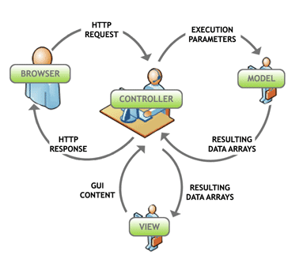

# MVC, MVP and MVVM

###### Why Design Architecture Patterns ?

- It is not like you can't develop web applications without the use of either of MVC or MVP**. 
- But they both are designing patterns and helps greatly in development an maintenance of your project and code.
- At the heart of MVC is Separated Presentation. 
- The idea behind Separated Presentation is to make a clear division between domain objects that model our perception of the real world, and presentation objects that are the GUI elements we see on the screen. 
- Domain objects should be completely self contained and work without reference to the presentation, they should also be able to support multiple presentations, possibly simultaneously.

###### There are mainly 3 architectures:

  1. MVC (Model View Controller)
  2. MVP (Model View Patterns)
  3. MVVM (Model View View Model)

#### Model View Controller (MVC)

- The MVC pattern is a UI presentation pattern that focuses on separating the UI (View) from its business layer (Model). 
- **The pattern separates responsibilities across three components:**
  - **View** is responsible for rending UI elements.
  - **Controller** is responsible for responding to UI actions.
  - **Model** is responsible for business behaviors and state management. 
- In most implementation all three components can directly interact with each other and in some implementations the controller is responsible for determining which view to display.

 

#### Model View Presenter (MVP)

- The MVP pattern is a UI presentation pattern based on the concepts of the MVC pattern. 
- **The pattern separates responsibilities across four components:**
  - **View** is responsible for rending UI elements, the view interface is used to loosely couple the presenter from its view, 
  - **Presenter** is responsible for interacting between the view/model.
  - **Model** is responsible for business behaviors and state management. 
- In some implementations the presenter interacts with a service (controller) layer to retrieve/persist the model.
- The view interface and service layer are commonly used to make writing unit tests for the presenter and the model easier.

 

#### Model View View Model (MVVM)

### Key Benefits of Using Them

Before using any pattern a developers needs to consider the pros and cons of using it. There are a number of key benefits to using either the MVC or MVP pattern (See list below). But, there also a few draw backs to consider. The biggest drawbacks are additional complexity and learning curve. While the patterns may not be appropriate for simple solutions; advance solutions can greatly benefit from using the pattern. I’m my experience a have seen a few solutions eliminate a large amount of complexity but being re-factored to use either pattern.

 - **Loose coupling** – The presenter/controller are an intermediary between the UI code and the model. This allows the view and the model to evolve independently of each other.

 - **Clear separation of concerns/responsibility**

   UI (Form or Page) – Responsible for rending UI elements

   Presenter/controller – Responsible for reacting to UI events and interacts with the model

   Model – Responsible for business behaviors and state management
   Test Driven – By isolating each major component (UI, Presenter/controller, and model) it is easier to write unit tests. This is especially true when using the MVP pattern which only interacts with the view using an interface.

 - **Code Reuse** – By using a separation of concerns/responsible design approach you will increase code reuse. This is especially true when using a full blown domain model and keeping all the business/state management logic where it belongs.

 - **Hide Data Access** – Using these patterns forces you to put the data access code where it belongs in a data access layer. There a number of other patterns that typical works with the MVP/MVC pattern for data access. Two of the most common ones are repository and unit of work. (See Martin Fowler – Patterns of Enterprise Application Architecture for more details)

 - **Flexibility/Adaptable** – By isolating most of your code into the presenter/controller and model components your code base is more adaptable to change. For example consider how much UI and data access technologies have changed over the years and the number of choices we have available today. A properly design solution using MVC or MVP can support multi UI and data access technologies at the same time.

#### Key Differences:

So what really are the differences between the MVC and MVP pattern. Actually there are not a whole lot of differences between them. Both patterns focus on separating responsibility across multi components and promote loosely coupling the UI (View) from the business layer (Model).  The major differences are how the pattern is implemented and in some advanced scenarios you need both presenters and controllers.

#### Here are the key differences between the patterns:

1. **MVP Pattern**
   - View is more loosely coupled to the model. The presenter is responsible for binding the model to the view.
   - Easier to unit test because interaction with the view is through an interface
   - Usually view to presenter map one to one. Complex views may have multi presenters.

2. **MVC Pattern**
   - Controller are based on behaviors and can be shared across views
   - Can be responsible for determining which view to display

> Further More Research on topic to choose best pattern

Further research and also using the term "twisting the triad" will result in a couple of interesting articles to read that always addresses your question.

**The most often heard result is this:**

  1. Do you develop a **web application**? Learn about **MVC**.
  2. Do you develop a **winform application**? Learn about **MVP**.
  3. Do you develop a **WPF application**? Learn about **MVVM**.

 

 

---

