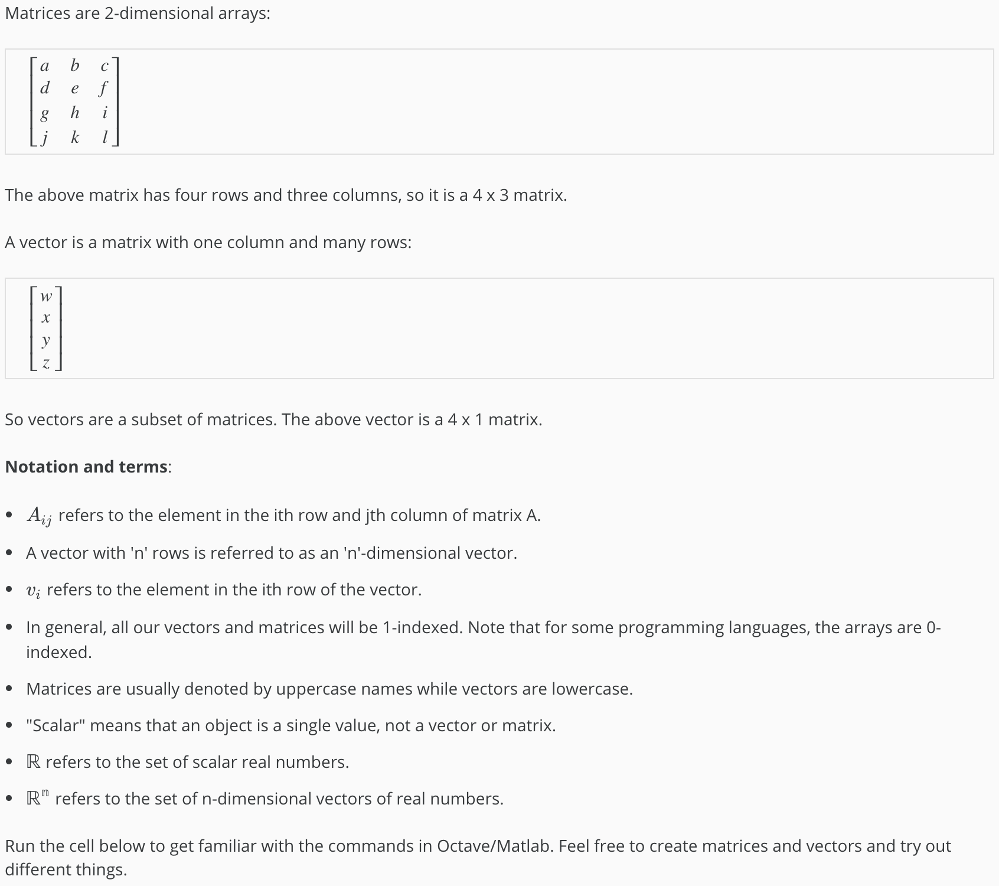
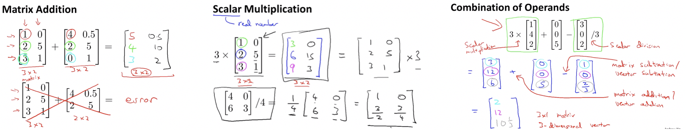
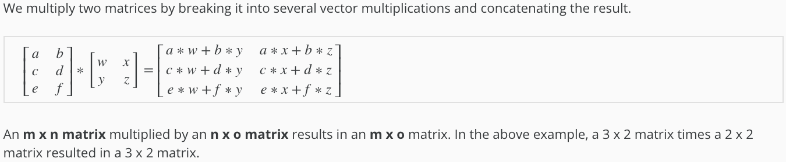

# Linear Algebra

### Matrix

A rectangular array of numbers written between square brackets. These could be features from a learning problem or it could be data from somewhere.



### Vector

A vector is a matrix that has only 1 column so we have an N x 1 matrix where N is the number of rows, and 1 is number of columns. So matrix with just one column is what we call a vector.


##### Note:

- By convention, usually when writing matrices and vectors, most people use upper case to refer to matrices, like A, B, C or X.
- And lowercase, like a, b, x, y to refer to either numbers, or just raw numbers or scalars or to vectors

###### Matrix Representations: Code & Output

```octave
% The ; denotes we are going back to a new row.
A = [1, 2, 3; 4, 5, 6; 7, 8, 9; 10, 11, 12]

% Initialize a vector 
v = [1;2;3] 

% Get the dimension of the matrix A where m = rows and n = columns
[m,n] = size(A)

% You could also store it this way
dim_A = size(A)

% Get the dimension of the vector v 
dim_v = size(v)

% Now let's index into the 2nd row 3rd column of matrix A
A_23 = A(2,3)
```


## Matrix Operations


<br>



##### Note:

We can add/subtract matrices of only same dimension. The result of addition will be a matrix of the same dimension.

###### Matrix Operations:  Code and Output

```octave
% Initialize matrix A and B 
A = [1, 2, 4; 5, 3, 2]
B = [1, 3, 4; 1, 1, 1]

% Initialize constant s 
s = 2

% See how element-wise addition works
add_AB = A + B 

% See how element-wise subtraction works
sub_AB = A - B

% See how scalar multiplication works
mult_As = A * s

% Divide A by s
div_As = A / s

% What happens if we have a Matrix + scalar?
add_As = A + s
```


## Matrix-Vector Mutliplication


<br>


###### Matrix-Vector Mutliplication:  Code and Output

```octave
% Initialize matrix A 
A = [1, 2, 3; 4, 5, 6;7, 8, 9] 

% Initialize vector v 
v = [1; 1; 1] 

% Multiply A * v
Av = A * v
```


## Matrix-Matrix Multiplication



##### Notes:

- Number of columns in first matrix should match the number of rows in the second matrix.
- When an m×n matrix is multiplied with n×p matrix the resultant matrix is of dimension m×p.

<br>


###### Matrix-Matrix Mutliplication:  Code and Output

```octave
% Initialize a 3 by 2 matrix 
A = [1, 2; 3, 4;5, 6]

% Initialize a 2 by 1 matrix 
B = [1; 2] 

% We expect a resulting matrix of (3 by 2)*(2 by 1) = (3 by 1) 
mult_AB = A*B
```


## Matrix Multiplication Properties

> **1. Matrices are not commutative: A∗B≠B∗A**


<br>

> **2. Matrices are associative: (A∗B)∗C=A∗(B∗C)**


<br>

> **3. Multiplication of any matrix with Identity matrix results in original matrix. It's just like multiplying numbers by 1.**


<br>

###### Matrix Mutliplication Properties:  Code and Output

```octave
% Initialize random matrices A and B 
A = [1,2;4,5]
B = [1,1;0,2]

% Initialize a 2 by 2 identity matrix
I = eye(2)

% The above notation is the same as I = [1,0;0,1]

% What happens when we multiply I*A ? 
IA = I*A 

% How about A*I ? 
AI = A*I 

% Compute A*B 
AB = A*B 

% Is it equal to B*A? 
BA = B*A 

% Note that IA = AI but AB != BA
```


## Inverse & Transpose of Matrix


#### Matrix Inverse:


##### Notes:

- Matrices that don't have inverse are **"singular"** or **"degenerate"**.
- Sometimes we can compute inverses by hand but almost no one does that these days, we use some softwares like octave/matlab.

#### Matrix Transpose:


<br>

###### Inverse & Transpose of Matrix: Code and Output

```octave
% Initialize matrix A 
A = [1,2,0;0,5,6;7,0,9]

% Transpose A 
A_trans = A' 

% Take the inverse of A 
A_inv = inv(A)

% What is A^(-1)*A? 
A_invA = inv(A)*A
```


<br>

------

<a href="2_linear_regression_with_one_variable" class="prev-button">&larr; Previous: Linear Regression with One Variable</a> 

<a href="4_linear_regression_with_multiple_variables" class="next-button">Next: Linear Regression with multiple variables &rarr;</a>

