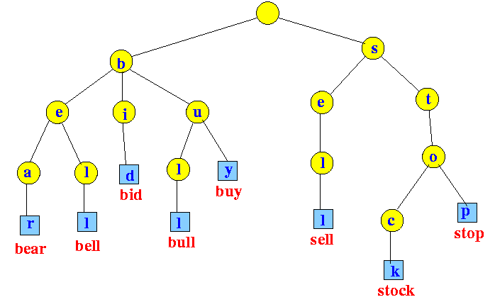
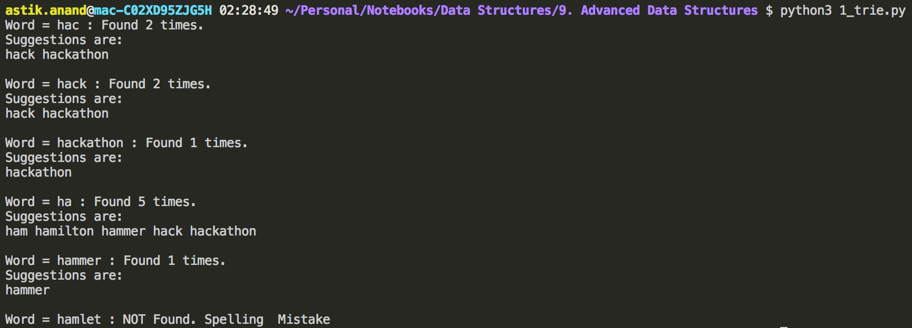

# Trie

###### What is Trie?

- First described by **René de la Briandais** in **1959**.
- Trie is an efficient information re***Trie***val data structure.
- Also called **digital tree**, **radix tree** or **prefix tree**, is a kind of search tree.

###### Why trie ?

- Using Trie, search complexities can be brought to optimal limit (key length).
- If we store keys in binary search tree, a well balanced BST will need time proportional to M * log N, where M is maximum string length and N is number of keys in tree.
- Using Trie, we can search the key in **O(M)** time. 
- However the penalty is on Trie storage requirements.



###### **Implementation of Trie**

```python
class Trie:
    def __init__(self, char):
        self.char = char
        self.children = []
        self.word_finished = False
        # How many times this character appeared in the addition process
        self.counter = 1
    

    def add_word(self, word):
        # Start checking from root(*) by initializing the current_node as root.
        current_node = self
        # We need to put every character of the word in trie.
        for char in word:
            # Check if the current character is there in children of the current node.
            found_in_children = False
            for child_node in current_node.children:
                # If the current character is there in children of the current node,
                # increase count and set the child_node as current node
                if(child_node.char == char):
                    child_node.counter += 1
                    # Sort the children on the basis of count, such that words 
                    # with greater frequency are suggested first.
                    current_node.children.sort(key = lambda x: x.counter, reverse=True)
                    current_node = child_node
                    found_in_children = True
                    break
            
            # If the current character is NOT there in children of the current node, 
            # create a new_child_node, add this to the children of the current node 
            # and set this node as the current.
            if (not found_in_children):
                new_child_node = Trie(char)
                current_node.children.append(new_child_node)
                current_node = new_child_node
        
        # If all the characters of the words are done, mark it as finished word.
        current_node.word_finished = True
    

    def search_word(self, word):
        current_node = self
        for char in word:
            found_in_children = False
            for child_node in current_node.children:
                if(child_node.char == char):
                    current_node = child_node
                    found_in_children = True
                    break
            
            if (not found_in_children and word != "*"):
                print("Word = {} : NOT Found. Spelling  Mistake".format(word))
                break
        
        if(found_in_children):
            print("Word = {} : Found {} times.".format(word, current_node.counter))

        return (found_in_children, current_node)
    

    def word_suggest(self, word):
        found, node = self.search_word(word)
        if(found or word == "*"):
            if(word == "*"):
                word = ""
                
            suggestions = self.word_suggest_util(node, word, [])
            print("Suggestions are:")
            for w in suggestions:
                print(w, end=" ")
            print("\n")
        
    

    def word_suggest_util(self, node, word, word_list):
        if node.word_finished:
            word_list.append(word)
        
        for child_node in node.children:
            self.word_suggest_util(child_node, word+child_node.char, word_list)
        
        return word_list


trie = Trie("*")
trie.add_word("hackathon")
trie.add_word("hack")
trie.add_word("ham")
trie.add_word("hamilton")
trie.add_word("hammer")

trie.word_suggest("hac")
trie.word_suggest("hack")
trie.word_suggest("hackathon")
trie.word_suggest("ha")
trie.word_suggest("hammer")
trie.search_word("hamlet")
```

**Output:**



###### **Complexity:**

- **Time: O(m) :** Number of characters in the word coz the for loop is only for 26 characters and can be treated as O(1) 
- **Auxilliary Space: O(n\*m) :** At max n nodes of m length 


------

### Some Standard Trie Problems

#### 1. Longest Prefix Matching

###### **Problem:** 

Given a dictionary of words and an input string, find the longest prefix of the string which is also a word in dictionary.

> **Example:**
>
> Dictionary of words : {are, area, base, cat, cater, children, basement}
>
> 
>
> *Input:* caterer   *Output:* cater
>
> *Input:* basemexy  *Output:* base
>
> *Input:* child     *Output:* <empty>

###### **Solution:** 

- Build a Trie of all dictionary words.
- Once the Trie is built, traverse through it using characters of input string.
- If prefix matches a dictionary word, store current length and look for a longer match.
- Finally, return the longest match.

#### 2. Printing unique rows in a given boolean matrix

###### **Problem:** 

Given a binary matrix, print all unique rows of the given matrix.

> **Example:**
>
> *Input:*                   *Output:* 
>
> {0, 1, 0, 0, 1}          0 1 0 0 1 
>
> {1, 0, 1, 1, 0}          1 0 1 1 0 
>
> {0, 1, 0, 0, 1}          1 1 1 0 0 
>
> {1, 1, 1, 0, 0} 

###### **Solution:**

- Consider every row as a string and add it to trie.
- Then suggest all words in trie using **trie.word_suggest("\*")**.

**Note:** Better solution is to use every row as a string and key to the hash or dictionary.

#### 3. Implement Reverse DNS Lookup Cache

###### **Problem:** 

Reverse DNS look up is using an internet IP address to find a domain name. For example, .

> **Example:**
>
> *Input:* 74.125.200.106     *Output:* [google.in](http://google.in) 

###### **Solution:**

- **One solution is to use Hashing.**
- Advantage of Trie based solutions is, worst case upper bound is O(1) for Trie, for hashing, the best possible average case time complexity is O(1).
- Also, with Trie we can implement prefix search (finding all urls for a common prefix of IP addresses).
- The general disadvantage of Trie is large amount of memory requirement, this is not a major problem here as the alphabet size is only 11 here.
- Ten characters are needed for digits from ‘0’ to ‘9’ and one for dot (‘.’).
- The idea is to store IP addresses in Trie nodes and in the last node we store the corresponding domain name.

#### 4. Implement Forward DNS Lookup Cache

###### **Problem:** 

Forward DNS look up is getting IP address for a given domain name typed in the web browser.

###### **Solution:**

- **One solution is to use Hashing.**
- We can implement this similar to Backward DNS Look Up but here instead of 11 we will have 27 characters (a-z & ".").


<br>

------

<a href="skip-list" class="prev-button">&larr; Previous:  Skip List</a>            

<a href="avl-tree" class="next-button">Next: AVL Tree &rarr;</a>

