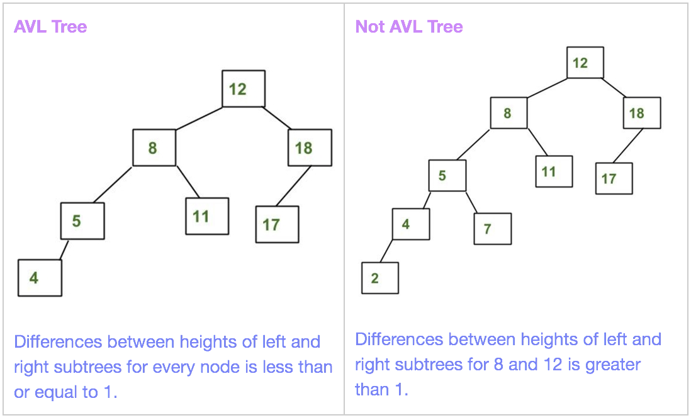
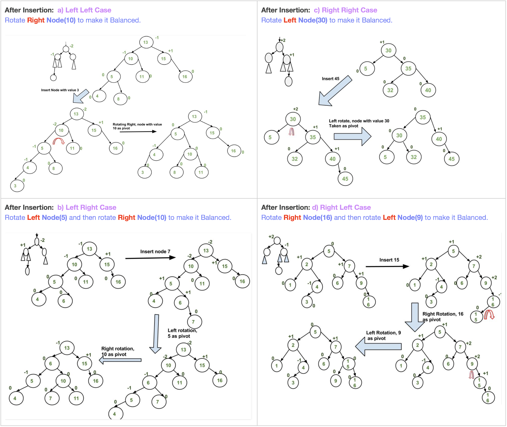

# AVL Tree

###### What is AVL Tree ?

- Invented by 2 Soviet inventors **Adelson-Velsky and Landis** in **1962**.
- AVL tree is a self-balancing Binary Search Tree (BST).
- The difference between heights of left and right subtrees cannot be more than one for all nodes.
- Often compared with red–black trees because both support the same set of operations and take **O(log n)** time for the basic operations.
- For lookup-intensive applications, AVL trees are faster than red–black trees because they are more strictly balanced.
- Both are height-balanced and in general neither weight-balanced nor μ-balanced.




###### Why AVL Trees?

- Most of the BST operations (e.g., search, max, min, insert, delete.. etc) take O(h) time where h is the height of the BST.

- The cost of these operations may become O(n) for a skewed Binary tree. 

- If we make sure that height of the tree remains **O(Logn)** after every insertion and deletion, then we can guarantee an upper bound of **O(Logn)** for all these operations. 

- The height of an AVL tree is always **O(Logn)** where n is the number of nodes in the tree.

    

#### AVL Tree Insertion

- To make sure that the given tree remains AVL after every insertion, we must augment the standard BST insert operation to perform some re-balancing.
- Following are two basic operations that can be performed to re-balance a BST without violating the BST property **(keys(left) < key(root) < keys(right)):** 
    1. **Left Rotation**
    2. **Right Rotation**


###### **Steps for insertion:**

Let the newly inserted node be w:

1. Perform standard BST insert for w.

2. Starting from w, travel up and find the first unbalanced node.

    Let z be the first unbalanced node, y be the child of z that comes on the path from w to z and x be the grandchild of z that comes on the path from w to z.

3. Re-balance the tree by performing appropriate rotations on the subtree rooted with z.

> **There can be 4 possible cases that needs to be handled as x, y and z can be arranged in 4 ways.** 

##### Following are the possible 4 arrangements:

- a) y is left child of z and x is left child of y     : **Left Left Case** 
- b) y is left child of z and x is right child of y   : **Left Right Case** 
- c) y is right child of z and x is right child of y : **Right Right Case** 
- d) y is right child of z and x is left child of y   : **Right Left Case** 

##### **Operations on above 4 cases:**

In all of the cases, we only need to re-balance the subtree rooted with z and the complete tree becomes balanced.

Coz the height of subtree (After appropriate rotations) rooted with z becomes same as it was before insertion.


> **Insertion Examples:**




###### **Approach:**

- We can use the recursive BST insert to insert a new node.
- In the recursive BST insert, after insertion, we get pointers to all ancestors one by one in a bottom-up manner.
- So we don’t need parent pointer to travel up.
- The recursive code itself travels up and visits all the ancestors of the newly inserted node.

###### **Algorithm for Insertion:**

1. Perform the normal BST insertion.
2. The current node must be one of the ancestors of the newly inserted node. Update the height of the current node.
3. Get the balance factor (left subtree height – right subtree height) of the current node.
4. If balance factor is greater than 1, then the current node is unbalanced and we are either in Left Left case or left Right case. To check whether it is left left case or not, compare the newly inserted key with the key in left subtree root.
5. If balance factor is less than -1, then the current node is unbalanced and we are either in Right Right case or Right-Left case. To check whether it is Right Right case or not, compare the newly inserted key with the key in right subtree root.


#### AVL Tree  Deletion

To make sure that the given tree remains AVL after every deletion, we must augment the standard BST insert operation to perform some re-balancing.

###### **Algorithm for** Deletion:

1. Perform the normal BST deletion and if only one node was there and root now is none then return.
2. Follow the same procedure we followed to make it balanced in the case of insertion.


###### Implementation

```python
class Node:
    def __init__(self, val):
        self.val = val
        self.left = None
        self.right = None
        self.height = 1


def insert(root, key):
    ###### Step-1: Perform Normal BST insertion.
    if not root: 
        return Node(key) 
    elif key < root.val: 
        root.left = insert(root.left, key) 
    else: 
        root.right = insert(root.right, key) 
    

    ###### Step-2: Update the height of the ancestor node. 
    root.height = 1 + max(get_height(root.left), get_height(root.right))

    ###### Step-3: Get the balance factor.
    balance = get_balance_factor(root)

    ###### Step-4: If the node is unbalanced, then try out the 4 cases discussed.
    ### a) Left Left Case:
    if balance < -1 and key < root.left.val: 
        return right_rotate(root)
    
    ### b) Left Right Case:
    if balance < -1 and key > root.left.val: 
        root.left = left_rotate(root.left) 
        return right_rotate(root)
    
    ### c) Right Right Case:
    if balance > 1 and key > root.right.val: 
        return left_rotate(root)
    
    ### d) Right Left Case:
    if balance > 1 and key < root.right.val: 
        root.right = right_rotate(root.right) 
        return left_rotate(root)
    
    return root


def delete(root, key):
    ###### Step-1: Perform Normal BST deletion.
    if not root: 
        return root 
    elif key < root.val: 
        root.left = delete(root.left, key) 
    elif key > root.val: 
        root.right = delete(root.right, key) 
    else: 
        if root.left is None: 
            temp = root.right 
            root = None
            return temp 
        elif root.right is None: 
            temp = root.left 
            root = None
            return temp 
        
        temp = min_node(root.right) 
        root.val = temp.val 
        root.right = delete(root.right, temp.val) 

    ###### If the tree has only one node simply return it 
    if root is None: 
        return root 
    

    ###### Step-2: Update the height of the ancestor node. 
    root.height = 1 + max(get_height(root.left), get_height(root.right))

    ###### Step-3: Get the balance factor.
    balance = get_balance_factor(root)

    ###### Step-4: If the node is unbalanced, then try out the 4 cases discussed.
    ### a) Left Left Case:
    if balance < -1 and key < root.left.val: 
        return right_rotate(root)
    
    ### b) Left Right Case:
    if balance < -1 and key > root.left.val: 
        root.left = left_rotate(root.left) 
        return right_rotate(root)
    
    ### c) Right Right Case:
    if balance > 1 and key > root.right.val: 
        return left_rotate(root)
    
    ### d) Right Left Case:
    if balance > 1 and key < root.right.val: 
        root.right = right_rotate(root.right) 
        return left_rotate(root)
    
    return root


def right_rotate(current_pivot):
    # current_pivot's left will become the new_pivot
    # new_pivot's right will change so store it as T2.
    new_pivot = current_pivot.left 
    T2 = new_pivot.right 

    # Perform rotation: Change the new_pivot's right as current pivot
    # and then make current pivot's left T2
    new_pivot.right = current_pivot 
    current_pivot.left = T2 

    # Update heights for both pivot and new_pivot
    current_pivot.height = 1 + max(get_height(current_pivot.left), get_height(current_pivot.right)) 
    new_pivot.height = 1 + max(get_height(new_pivot.left), get_height(new_pivot.right)) 

    # Return the new root 
    return new_pivot


def left_rotate(current_pivot):
    # current_pivot's right will become the new_pivot
    # new_pivot's left will change so store it as T2.
    new_pivot = current_pivot.right 
    T2 = new_pivot.left 

    # Perform rotation: Change the new_pivot's left as current pivot
    # and then make current pivot's right T2
    new_pivot.left = current_pivot 
    current_pivot.right = T2 

    # Update heights for both pivot and new_pivot
    current_pivot.height = 1 + max(get_height(current_pivot.left), get_height(current_pivot.right)) 
    new_pivot.height = 1 + max(get_height(new_pivot.left), get_height(new_pivot.right)) 

    # Return the new root 
    return new_pivot 


def get_height(node):
    if node is None:
        return 0
    return node.height


def get_balance_factor(node):
    if node is None:
        return 0
    return get_height(node.right) - get_height(node.left)


def min_node(current_node):
    # If current_node is None, min_node not possible
    if(current_node is None):
        return None
    
    min_node = current_node
    while(min_node.left):
        min_node = min_node.left
    
    return min_node


def print_preorder(root):
    if root:
        print(root.val, end=" ")
        print_preorder(root.left)
        print_preorder(root.right)


print("Print the AVL TREE Traversal:")
root = None
root = insert(root, 10) 
root = insert(root, 20) 
root = insert(root, 30) 
root = insert(root, 40) 
root = insert(root, 50) 
root = insert(root, 25)
print_preorder(root)
print()
print("\nAVL Tree after deleting Node 40:")
root = delete(root, 40)
print_preorder(root)
print()
```

**Output:**


###### **Time Complexity:** **O(Logn)** for both insert and delete 

- The rotation operations (left and right rotate) take constant time as only a few pointers are being changed there.
- Updating the height and getting the balance factor also takes constant time.
- So the time complexity of AVL insert remains same as BST insert which is O(h) where h is the height of the tree.
- Since AVL tree is balanced, the height is O(Logn). So time complexity of AVL insert is O(Logn)

#### **AVL Tree  Vs.  Red-Black Tree**

- The AVL tree and other self-balancing search trees like Red Black are useful to get all basic operations done in O(log n) time.

- The AVL trees are more balanced compared to Red-Black Trees, but they may cause more rotations during insertion and deletion.

- So if the application involves many frequent insertions and deletions, then Red Black trees should be preferred.

- And if the insertions and deletions are less frequent and search is the more frequent operation, then AVL tree should be preferred over Red Black Tree.

    

------

<br>

### Some Standard AVL Tree Problems

## 1. Count Smaller Elements on Right Side***

###### Problem:

Given an unsorted array, write a function to count number of smaller elements on right of each element in an array.

> **Example:**


###### Approach-1: Brute-Force

- Use two loops, the outer loop picks all elements from left to right.
- The inner loop iterates through all the elements on right side of the picked element and updates count_smaller[].
- **Time Complexity: O(n<sup>2</sup>)**


###### Approach-2: Self Balancing BST

- A Self Balancing Binary Search Tree (AVL, Red Black,.. etc) can be used to get the solution in O(nLogn) time complexity.
- We can augment these trees so that every node N contains size the subtree rooted with N.


###### Algorithm

- Traverse the array from right to left and insert all elements one by one in an AVL tree.
- While inserting a new key in an AVL tree, first compare the key with root. 
    - If key is greater than root, then it is greater than all the nodes in left subtree of root. 
    - So add the size of left subtree to the count of smaller element for the key being inserted.
- Recursively follow the same approach for all nodes down the root.


###### Implementation

```python
class Node:
    def __init__(self, val):
        self.val = val
        self.left = None
        self.right = None
        self.height = 1
        self.size = 1


def insert(root, key):
    ###### Step-1: Perform Normal BST insertion.
    if not root: 
        return Node(key) 
    elif key < root.val: 
        root.left = insert(root.left, key) 
    else:
        root.right = insert(root.right, key)
        # Update the count_smaller for the key
        count_smaller[key] += size(root.left) + 1
    
    ###### Step-2: Update the height and size of the ancestor node. 
    root.height = 1 + max(height(root.left), height(root.right))
    root.size = 1 + size(root.left) + size(root.right)

    ###### Step-3: Get the balance factor.
    balance = get_balance_factor(root)

    ###### Step-4: If the node is unbalanced, then try out the 4 cases discussed.
    ### a) Left Left Case:
    if balance < -1 and key < root.left.val: 
        return right_rotate(root)
    
    ### b) Left Right Case:
    if balance < -1 and key > root.left.val: 
        root.left = left_rotate(root.left) 
        return right_rotate(root)
    
    ### c) Right Right Case:
    if balance > 1 and key > root.right.val: 
        return left_rotate(root)
    
    ### d) Right Left Case:
    if balance > 1 and key < root.right.val: 
        root.right = right_rotate(root.right) 
        return left_rotate(root)
    
    return root


def right_rotate(current_pivot):
    # current_pivot's left will become the new_pivot
    # new_pivot's right will change so store it as T2.
    new_pivot = current_pivot.left 
    T2 = new_pivot.right 

    # Perform rotation: Change the new_pivot's right as current pivot
    # and then make current pivot's left T2
    new_pivot.right = current_pivot 
    current_pivot.left = T2 

    # Update heights for both pivot and new_pivot
    current_pivot.height = 1 + max(height(current_pivot.left), height(current_pivot.right)) 
    new_pivot.height = 1 + max(height(new_pivot.left), height(new_pivot.right))

    # Update sizes for both pivot and new_pivot
    current_pivot.size = 1 + size(current_pivot.left) + size(current_pivot.right) 
    new_pivot.size = 1 + size(new_pivot.left) + size(new_pivot.right) 

    # Return the new root 
    return new_pivot


def left_rotate(current_pivot):
    # current_pivot's right will become the new_pivot
    # new_pivot's left will change so store it as T2.
    new_pivot = current_pivot.right 
    T2 = new_pivot.left 

    # Perform rotation: Change the new_pivot's left as current pivot
    # and then make current pivot's right T2
    new_pivot.left = current_pivot 
    current_pivot.right = T2 

    # Update heights for both pivot and new_pivot
    current_pivot.height = 1 + max(height(current_pivot.left), height(current_pivot.right)) 
    new_pivot.height = 1 + max(height(new_pivot.left), height(new_pivot.right))

    # Update sizes for both pivot and new_pivot
    current_pivot.size = 1 + size(current_pivot.left) + size(current_pivot.right) 
    new_pivot.size = 1 + size(new_pivot.left) + size(new_pivot.right) 

    # Return the new root 
    return new_pivot 


def height(node):
    if node is None:
        return 0
    return node.height


def size(node):
    if node is None:
        return 0
    return node.size


def get_balance_factor(node):
    if node is None:
        return 0
    return height(node.right) - height(node.left)


def min_node(current_node):
    # If current_node is None, min_node not possible
    if(current_node is None):
        return None
    
    min_node = current_node
    while(min_node.left):
        min_node = min_node.left
    
    return min_node


def count_smaller_elements_on_right(arr):
    n = len(arr)
    root = None

    for i in range(n-1, -1, -1):
        count_smaller[arr[i]] = 0
        root = insert(root, arr[i])
    
    for i in arr:
        print(count_smaller[i], end=" ")
    
    print()
    count_smaller.clear()


count_smaller = {}
print("Example-1: count_smaller_elements_on_right([10, 6, 15, 20, 30, 5, 7])")
count_smaller_elements_on_right([10, 6, 15, 20, 30, 5, 7])

print("\nExample-2: count_smaller_elements_on_right([5, 4, 3, 2, 1])")
count_smaller_elements_on_right([5, 4, 3, 2, 1])

print("\nExample-3: count_smaller_elements_on_right([1, 2, 3, 4, 5])")
count_smaller_elements_on_right([1, 2, 3, 4, 5])
```

**Output:**


###### Complexity:

- **Time:** **O(nLogn)** 
- **Auxilliary Space:** **O(n)**


<br>


------

<a href="trie" class="prev-button">&larr; Previous:  Trie</a>       

<a href="suffix-array" class="next-button">Next: Suffix Array &rarr;</a>

