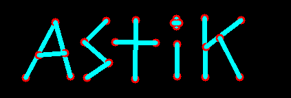
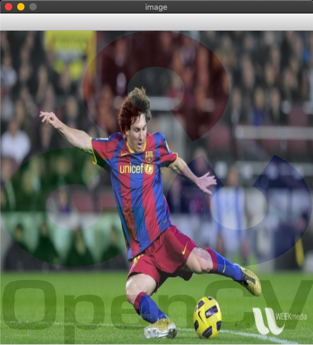
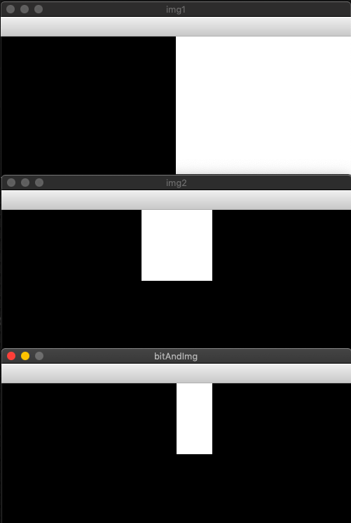
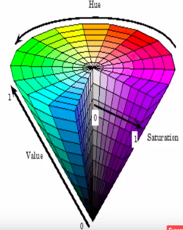
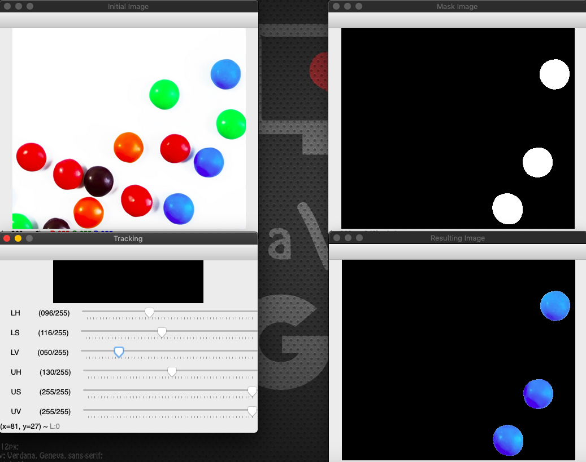

# Computer Vision : OpenCV - Python

###### What is Computer Vision ?

- Computer vision is the way of teaching intelligence to machines and making them see things just like humans.
- It allows computers to see and process visual data just like humans.
- It involves analyzing images to produce useful information.
- ***Examples:*** Self-driving Cars : Detects lanes using computer vision.

###### What is OpenCV ?

- OpenCV is a open source computer vision or image processing library.

- It mainly deals with computer vision that means dealing mainly with images and videos.

- It was created by Intel and later supported by Willow Garage and now maintained by Itseez.

- It is cross platform and available in C, C++ and Python.

- Open Source, free, easy to use and install.

    

> **Image vs. Matrix:**

- Digital images are typically stored in in a matrix. There are many different file formats.
- **PPI (Pixel Per Inch):** It refers display resolution i.e. how many individual pixels are displayed in 1 inch of digital image.


###### How do computer see images ?

- There are 2 types of digital images:

    1. **Grayscale images:** 
        - Each pixel represents the intesity of only one shade that means how bright or dark the pixel is. 
        - It has only one channel.
    2.  **Coloured images:**
        - In this we have 3 channels - RGB (Red, Green, Blue).
        - Our standard digital camera has 3 channels.

    


### Installation

- Make sure python3 is installed and then create a virtual environment to install these packages into.
- Activate the virtual environment and run **`pip install opencv-python`**.

```bash
# Go into the project directory and run the below commands.
virtualenv .venv
source .venv/bin/activate
pip install opencv-python
```


---


## 1. Handling Images

### Getting Started

###### Reading an Image

**`cv2.imread("file_path", flag)`** 


```python
import cv2

img = cv2.imread("images/lena.jpg", 0)

print("Image in pixel matrix representation:\n{}".format(img))
cv2.imshow("image window", img)

key_pressed = cv2.waitKey(0)


if key_pressed == 27: # ESC key
    cv2.destroyAllWindows()
elif key_pressed == ord('s'):
    cv2.imwrite("images/lena_copy.jpg", img)
    cv2.destroyAllWindows()
```

### Drawing Geometric Shapes on Image

- We need to learn to draw different geometric shapes with OpenCV.
- Different functions used:
    - **cv2.line()**
    - **cv2.circle()**
    - **cv2.rectangle()**
    - **cv2.ellipse()**
    - **cv2.putText()**

##### Coding Part:

In all the above functions, we will see some common arguments as given below:

- **img:** The image where we want to draw the shapes.
- **color:** Color of the shape in (B, G, R) format.
    - For BGR, pass it as a tuple, eg: (255, 0, 0) for blue. 
    - For grayscale, just pass the scalar value.
- **thickness:** Thickness of the line or circle etc. 
    - If **-1** is passed for closed figures like circles, it will fill the shape. 
    - *default = 1*
- **lineType:** Type of line, whether 8-connected, anti-aliased line etc. 
    - 8 :- 8-connected line
    - 4 :- 4-connected line
    - cv2.LINE_AA :- anti-aliased line which looks great for curves.
    - *default = 8*
- **shift:** Number of fractional bits in the point coordinates. 
    - *default = 0*

#### 1. Drawing Line

> **cv2.line(img, pt1, pt2, color, thickness=1, lineType=8, shift=0)**

Draws a line segment connecting two points.

- **pt1** – First point of the line segment (x1, y1).
- **pt2** – Second point of the line segment (x2, y2).

```python
img = cv2.line(img, (0, 0), (280, 280), (255, 0, 0), 10, cv2.LINE_AA, 0)
```

#### 2. Drawing Arrowed Line

> **cv2.arrowedLine(img, pt1, pt2, color, thickness=1, line_type=8, shift=0, tipLength=0.1)**

Draws an arrow segment pointing from the first point to the second one.

- **tipLength** – The length of the arrow tip in relation to the arrow length

```python
img = cv2.arrowedLine(img, (0, 280), (280, 280), (0, 255, 0), 10, 4, 0, 0.1)
```

#### 3. Drawing Rectangle

> **cv2.rectangle(img, pt1, pt2, color, thickness=1, lineType=8, shift=0)**

Draws a simple, thick, or filled up-right rectangle.

- **pt1** – Vertex of the rectangle.
- **pt2** – Vertex of the rectangle opposite to *pt1* .

```python
img = cv2.rectangle(img, (384, 0), (510, 128), (0, 0, 255), 10)
```

#### 4. Drawing Circle

> **cv2.circle(img, center, radius, color, thickness=1, lineType=8, shift=0) **

Draws a circle.

- **center** – Center of the circle.
- **radius** – Radius of the circle.

```python
img = cv2.circle(img, (447, 63), 63, (123, 50, 55), -1)
```

#### 5. Drawing Ellipse

> **cv2.ellipse(img, center, axes, angle, start_angle, end_angle, color, thickness=1, lineType=8, shift=0) **

Draws a simple or thick elliptic arc or fills an ellipse sector.

- **center** – Center of the ellipse.
- **axes** – Half of the size of the ellipse main axes.
- **angle** – Ellipse rotation angle in degrees.
- **startAngle** – Starting angle of the elliptic arc in degrees.
- **endAngle** – Ending angle of the elliptic arc in degrees.


```python
img = cv2.ellipse(img, (250, 50), (100, 80), 0, 0, 180, (155, 78, 105), -1)
```

#### 6. Drawing Polygon

> **cv2.polylines(img, pts, isClosed, color, thickness=1, lineType=8, shift=0)**

The function polylines draws one or more polygonal curves.

- **pts** – Array of polygonal curves.
- **npts** – Array of polygon vertex counters.
- **ncontours** – Number of curves.
- **isClosed** – If they are closed, the function draws a line from the last vertex of each curve to its first vertex.

```python
pts = np.array([[10,5],[20,30],[70,20],[50,10]], np.int32)
pts = pts.reshape((-1,1,2))
cv2.polylines(img, [pts], True, (0, 255, 255), 2)
```

#### 7. Put Text

> **cv2.putText(img, text, org, fontFace, fontScale, color, thickness=1, lineType=8, bottomLeftOrigin=True)**

Draws a Text String

- **img** – Image.
- **text** – Text string to be drawn.
- **org** – Bottom-left corner of the text string in the image.
- **fontFace** – Font type like   *FONT_HERSHEY_SIMPLEX*,  *FONT_HERSHEY_PLAIN* etc.
- **fontScale** – Font scale factor that is multiplied by the font-specific base size.
- **bottomLeftOrigin** – When true, the image data origin is at the bottom-left corner. Otherwise, it is at the top-left corner.

```python
img = cv2.putText(img, 'OpenCV', (10, 400), cv2.FONT_HERSHEY_SIMPLEX, 4, (0, 255, 255), 10, cv2.LINE_AA)
```

###### Final Code

```python
import numpy as np
import cv2


# img = cv2.imread("images/lena.jpg", 1)
img = np.zeros([512, 512, 3], np.uint8) # Black image of size 512*512

img = cv2.line(img, (0, 0), (280, 280), (255, 0, 0), 10, cv2.LINE_AA, 0)

img = cv2.arrowedLine(img, (0, 280), (280, 280), (0, 255, 0), 10, 4, 0, 0.1)

img = cv2.rectangle(img, (384, 0), (510, 128), (0, 0, 255), 10)

img = cv2.circle(img, (447, 63), 63, (123, 50, 55), -1)

img = cv2.ellipse(img, (250, 50), (100, 80), 0, 0, 180, (155, 78, 105), -1)

pts = np.array([[10,5],[20,30],[70,20],[50,10]], np.int32)
pts = pts.reshape((-1,1,2))
cv2.polylines(img, [pts], True, (0, 255, 255), 2)

img = cv2.putText(img, 'OpenCV', (10, 400), cv2.FONT_HERSHEY_SIMPLEX, 4, (0, 255, 255), 10, cv2.LINE_AA)

cv2.imshow("image window", img)
cv2.waitKey(5000)
cv2.destroyAllWindows()
```

**Output:**


---


## 2. Handling Videos

### Getting Started

```python
import cv2

video_capturer = cv2.VideoCapture(0)

# List of available codes - http://www.fourcc.org/codecs.php
# Define the codec and create VideoWriter object
fourcc_codec = cv2.VideoWriter_fourcc(*'XVID')

frame_per_second = 20.0
capture_size = (int(video_capturer.get(3)), int(video_capturer.get(4)))
video_writer = cv2.VideoWriter("videos/output.avi", fourcc_codec, frame_per_second, capture_size)

while video_capturer.isOpened():
    ret, frame = video_capturer.read()
    frame = cv2.flip(frame, 1)  # Lateral inversion of the video frame

    if ret:
        print("Width of Video Frame:\n{}".format(video_capturer.get(cv2.CAP_PROP_FRAME_WIDTH)))
        print("Height of Video Frame:\n{}".format(video_capturer.get(cv2.CAP_PROP_FRAME_HEIGHT)))

        # Write this frame into a file : out is an instance of video writer
        video_writer.write(frame)

        gray_scaled_video = cv2.cvtColor(frame, cv2.COLOR_BGR2GRAY)
        cv2.imshow("videocam", gray_scaled_video)

        if cv2.waitKey(1) == ord('q'):
            break
    else:
        break

video_capturer.release()
video_writer.release()
cv2.destroyAllWindows()
```

### Setting up Camera

-  There are different properties of camera that can be accessed and even set to a required value.
- Every camera property is also associated with a number to its name.
    - **cv2.CAP_PROP_FRAME_WIDTH:** Width Property - **Numerical Value = 3**
    - **cv2.CAP_PROP_FRAME_HEIGHT**: Height Property - **Numerical Value = 4**
- We can get or set the value of these property using either name or its numerical value

```python
video_capturer = cv2.VideoCapture(0)

# Getting height and Width of Camera using Name
print(video_capturer.get(cv2.CAP_PROP_FRAME_WIDTH))
print(video_capturer.get(cv2.CAP_PROP_FRAME_HEIGHT))

# Setting Height and Width of Camera using Numerical Value
video_capturer.set(3, 600)
video_capturer.set(4, 600)

print(video_capturer.get(3))
print(video_capturer.get(4))
# => 640.0 * 480.0
```

- If we set some random value to height and width then camera will atuomatically take the next resolution that is available.
- If we take height and width as (600 * 600) still it will take the resolution (640, 480).

> **Available Video Resolutions:**


### Showing Date and Time on Videos

```python
import cv2
from datetime import datetime, timedelta
from time import time

video_capturer = cv2.VideoCapture(0)
start_time = time()

fourcc_codec = cv2.VideoWriter_fourcc(*'XVID')
frame_per_second = 20.0
capture_size = (int(video_capturer.get(3)), int(video_capturer.get(4)))
video_writer = cv2.VideoWriter("videos/video_with_date_time.avi", fourcc_codec, frame_per_second, capture_size)

while video_capturer.isOpened():
    ret, frame = video_capturer.read()
    frame = cv2.flip(frame, 1)  # Lateral inversion of the video frame

    if ret:
        font = cv2.FONT_HERSHEY_COMPLEX
        recorded_time= "Rec: "+ str(timedelta(seconds=(time() - start_time)))
        cv2.putText(frame, recorded_time, (20, 30), font, 0.8, (0, 0, 255), 2, cv2.LINE_AA)

        date_time = datetime.now().strftime("%d %b %Y %I:%M:%S %p")
        cv2.putText(frame, date_time, (920, 30), font, 0.8, (255, 0, 255), 2, cv2.LINE_AA)

        text = "Width: " + str(video_capturer.get(3)) + " Height: " + str(video_capturer.get(4))
        cv2.putText(frame, text, (980, 710), font, 0.6, (255, 255, 0), 1, cv2.LINE_AA)

        video_writer.write(frame)

        cv2.imshow("videocam", frame)

        if cv2.waitKey(1) == ord('q'):
            break
    else:
        break

video_capturer.release()
cv2.destroyAllWindows()
```


---


## 3. Handling Events

### Mouse Events

All the mouse events can be listed by:

```python
print([i for i in dir(cv2) if 'EVENT' in i])

#=> ['EVENT_FLAG_ALTKEY', 'EVENT_FLAG_CTRLKEY', 'EVENT_FLAG_LBUTTON', 'EVENT_FLAG_MBUTTON',                 'EVENT_FLAG_RBUTTON', 'EVENT_FLAG_SHIFTKEY', 'EVENT_LBUTTONDBLCLK', 'EVENT_LBUTTONDOWN', 'EVENT_LBUTTONUP', 'EVENT_MBUTTONDBLCLK', 'EVENT_MBUTTONDOWN', 'EVENT_MBUTTONUP', 'EVENT_MOUSEHWHEEL', 'EVENT_MOUSEMOVE', 'EVENT_MOUSEWHEEL', 'EVENT_RBUTTONDBLCLK', 'EVENT_RBUTTONDOWN', 'EVENT_RBUTTONUP']
```

###### Capture the Mouse Clicks

```python
import cv2

def click_event(event, x, y, flags, param):
    font = cv2.FONT_HERSHEY_COMPLEX
    if event == cv2.EVENT_LBUTTONDOWN:
        strXY = "(" + str(x) + ", " + str(y) + ")"
        cv2.putText(img, strXY, (x, y), font, 0.6, (255, 0, 0))
    elif event == cv2.EVENT_RBUTTONDOWN:
        blue = img(y, x, 0)
        green = img(y, x, 1)
        red = img(y, x, 2)
        strBGR = "(" + str(blue) + ", " + str(green) + ", " + str(red) + ")"
        cv2.putText(img, strBGR, (x, y), font, 0.6, (255, 255, 0))

    cv2.imshow("image", img)


img = cv2.imread("images/lena.jpg")
cv2.imshow("image", img)
cv2.setMouseCallback('image', click_event)
while(cv2.waitKey(0) != 27):
    pass

cv2.destroyAllWindows()
```

###### Draw line b/w 2 Mouse Clicks

```python
import numpy as np
import cv2


def click_event(event, x, y, flags, param):
    if event == cv2.EVENT_LBUTTONDOWN:
        cv2.circle(img, (x, y), 6, (0, 0, 255), -1)
        points.append((x, y))
        if len(points) >= 2:
            cv2.line(img, points[-2], points[-1], (255, 255, 0), 5)
            points.clear()
    cv2.imshow("image", img)


img = np.zeros([512, 512, 3], np.uint8)
cv2.imshow("image", img)
points = []
cv2.setMouseCallback('image', click_event)
while(cv2.waitKey(0) != 27):
    pass

cv2.destroyAllWindows()
```

**Output:**




---


## 4. Operations on Images

### Some Basic Operations

- **cv2.split**
- **cv2.merge**
- **cv2.resize**, 
- **cv2.add** 
- **cv2.addWeighted**

###### Image Properties

- **`img.shape`**: returns tuple of no. of rows, columns, channels
- **`img.size:`** returns total no. of pixels
- **`img.dtype:`** returns image data Type


```python
import cv2

img = cv2.imread("images/messi5.jpg")
print("Image Shape: {}".format(img.shape))  # returns tuple of no. of rows, columns, channels
print("Image Size: {}".format(img.size))  # returns total no. of pixels
print("Image DataType: {}".format(img.dtype))  # returns image data Type

# Split and merge the image
b, g, r = cv2.split(img)
img = cv2.merge((b, g, r))

img2 = cv2.imread("images/opencv-logo.png")

# Resize the image for adding
img = cv2.resize(img, (512, 512))
img2 = cv2.resize(img2, (512, 512))

# dst_image = cv2.add(img, img2)
dst_image = cv2.addWeighted(img, 0.9, img2, 0.1, 0)
cv2.imshow("image", dst_image)

while(cv2.waitKey(0) != 27):
    pass

cv2.destroyAllWindows()
```

**Output:**




### Region of Interest (ROI)

###### Copy ball in picture to another place

```python
import cv2

def click_event(event, x, y, flags, param):
    if event == cv2.EVENT_LBUTTONDOWN:
        ball = img[280:340, 330:390]  # Copy the ball from here - ROI
        img[273:333, 100:160] = ball   # Paste it here
    cv2.imshow("image", img)


img = cv2.imread("images/messi5.jpg")
cv2.imshow("image", img)
cv2.setMouseCallback('image', click_event)
while(cv2.waitKey(0) != 27):
    pass

cv2.destroyAllWindows()
```


### Bitwise Operations

Here are the list of bitwise operators that can be applied:

- cv2.bitwise_and(img1, img2)
- cv2.bitwise_or(img1, img2)
- cv2.bitwise_xor(img1, img2)
- cv2.bitwise_not(img)


> **Bitwise And Example:**

```python
import numpy as np
import cv2

# img1: Make an image with left half black and right half white
img = np.zeros((200, 500, 3), np.uint8)
img1 = cv2.rectangle(img, (250, 0), (500, 200), (255, 255, 255), -1)

# img2: Draw a white rectangle on the balck image
img = np.zeros((200, 500, 3), np.uint8)
img2 = cv2.rectangle(img, (200, 0), (300, 100), (255, 255, 255), -1)

bitAndImg = cv2.bitwise_and(img1, img2)
cv2.imshow("img1", img1)
cv2.imshow("img2", img2)
cv2.imshow("bitAndImg", bitAndImg)

while(cv2.waitKey(0) != 27):
    pass
cv2.destroyAllWindows()
```

**Output:**

Black is treates as 0 and white as 1.




---


## 5. Trackbars

Methods to deals with trackbars are:

1. **`createTrackbar():`** Creates a trackbar
2. **`getTrackbarPos():`** Returns the position of trackbar


> **Example: Color Maker Trackbars**

```python
import numpy as np
import cv2 as cv

def nothing(x):
    pass

# Create a black image and a window
img = np.zeros((300, 512, 3), np.uint8)
cv.namedWindow('image')

# Create different Trackbars
cv.createTrackbar('B:', 'image', 0, 255, nothing)
cv.createTrackbar('G:', 'image', 0, 255, nothing)
cv.createTrackbar('R:', 'image', 0, 255, nothing)

# Create a swith Trackbar
switch = "OFF/ON:"
cv.createTrackbar(switch, 'image', 0, 1, nothing)

while(cv.waitKey(1) != 27):
    cv.imshow('image', img)

    b = cv.getTrackbarPos('B:', 'image')
    g = cv.getTrackbarPos('G:', 'image')
    r = cv.getTrackbarPos('R:', 'image')

    s = cv.getTrackbarPos(switch, 'image')
    if s == 0:
        img[:] = 0
    else:
        img[:] = [b, g, r]

cv.destroyAllWindows()
```

**Output:**


---


## 6. Object Detection and Tracking

### HSV (Hue, Saturation and Value) Color Space

- A color model that is often used in place of the RGB color model in graphics and paint programs.
- In using this **color** model, a **color** is specified then white or black is added to easily make **color** adjustments. 
- **HSV** may also be called HSB (short for hue, saturation and brightness).

###### Hue:

- Corresponds to the color component (base pigment).
- Hence just by selecting a range of Hue we can select any color. 
- Range: (0 - 360)

###### Saturation:

- It is the amount of color (depth of the pigment) (dominance of Hue). 
- Range: (0 - 100%)

###### Value:

- It is basically the brightness of  the color.
- Range: (0 - 100%)




### Object Detection

We can detect the objects in a image using following steps:

- Read the image
- Convert the image it into HSV color format.
- Make a mask image using upper and lower hsv values to detect a particular color object.
- Use **bitwise_and** with mask_image as its mask value to get the resulting image.


> **Example: Detect a particular colored balls from an image of different colored balls**

```python
import numpy as np
import cv2 as cv

def nothing(x):
    pass

# Create Trackbars for upper and lower value of HSV
cv.namedWindow("Tracking")
cv.createTrackbar("LH", "Tracking", 0, 255, nothing)
cv.createTrackbar("LS", "Tracking", 0, 255, nothing)
cv.createTrackbar("LV", "Tracking", 0, 255, nothing)
cv.createTrackbar("UH", "Tracking", 255, 255, nothing)
cv.createTrackbar("US", "Tracking", 255, 255, nothing)
cv.createTrackbar("UV", "Tracking", 255, 255, nothing)

while(cv.waitKey(1) != 27):
    # Read an image and convert it to HSV format
    img = cv.imread("images/smarties.png")
    hsv_img = cv.cvtColor(img, cv.COLOR_BGR2HSV)

    # Get upper and lower range for color for objct detection
    # lower_blue = np.array([96, 116, 50])
    # upper_blue = np.array([130, 255, 255])
    l_h = cv.getTrackbarPos("LH", "Tracking")
    l_s = cv.getTrackbarPos("LS", "Tracking")
    l_v = cv.getTrackbarPos("LV", "Tracking")
    u_h = cv.getTrackbarPos("UH", "Tracking")
    u_s = cv.getTrackbarPos("US", "Tracking")
    u_v = cv.getTrackbarPos("UV", "Tracking")

    lower_blue = np.array([l_h, l_s, l_v])
    upper_blue = np.array([u_h, u_s, u_v])

    # Create a mask image using upper and lower value of color
    mask_img = cv.inRange(hsv_img, lower_blue, upper_blue)

    # Create the resulting image using bitwise_and operator and mask
    result_img = cv.bitwise_and(img, img, mask=mask_img)

    cv.imshow("Initial Image", img)
    cv.imshow("Mask Image", mask_img)
    cv.imshow("Resulting Image", result_img)

cv.destroyAllWindows()
```

**Output:**




### Object Tracking

- We can track the object in the video the same way we detected object in image.
- Here we need to read video instead of image and provide video frame instead of the image.

```python
_, frame = video_capturer.read()
frame = cv.flip(frame, 1)  # Lateral inversion of the video frame
hsv_frame = cv.cvtColor(frame, cv.COLOR_BGR2HSV)
```


### Image Thresholding


