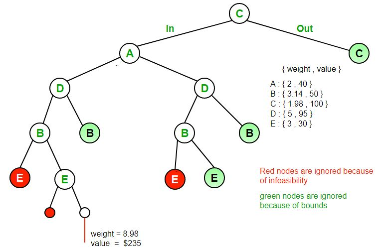

# Branch and Bound Approach

Branch and bound is an algorithm design paradigm which is generally used for solving combinatorial optimization problems.

These problems typically exponential in terms of time complexity and may require exploring all possible permutations in worst case.

Branch and Bound solve these problems relatively quickly.

##### Notes:

- Branch and bound is very useful technique for searching a solution but in worst case, we need to fully calculate the entire tree.
- At best, we only need to fully calculate one path through the tree and prune the rest of it.


---

------

### Standard  Branch and Bound Approach Problems

## 1. 0/1 Knapsack Problem

###### Problem:

Given two integer arrays val[0..n-1] and wt[0..n-1] that represent values and weights associated with n items respectively.

Find out the maximum value subset of val[] such that sum of the weights of this subset is smaller than or equal to Knapsack capacity W.

###### Approach-1: Greedy

- Pick the items in decreasing order of value per unit weight.
- Works for fractional knapsack problem.
- **May give wrong result for 0/1 knapsack.**

###### Approach-2: Dynamic Programming (DP)

- In DP, we use a 2D table of size n x W. 
- **Doesn’t work if item weights are not integers.**

###### Approach-3: Brute-Force

- With n items, generate all 2<sup>n</sup> solutions, check each to see if they satisfy the constraint.
- Save maximum solution that satisfies constraint.
- **Works but exponential complexity.**
- This solution can be expressed as tree.


###### Approach-4: Backtracking

- Use **Backtracking** to optimize the Brute Force solution.
- In the tree representation, do DFS of tree and If when reach a point where a solution no longer is feasible, stop exploring.
- Here, backtracking would be much more effective if we had even more items or a smaller knapsack capacity.
- **Works but time can still be improved**.


###### Approach-5: Branch and Bound

- The backtracking based solution works better than brute force by ignoring infeasible solutions.
- Can do better (than backtracking) if we know a bound on best possible solution subtree rooted with every node.
- If the best in subtree is worse than current best, we can simply ignore this node and its subtrees.
- So we compute bound (best solution) for every node and compare the bound with current best solution before exploring the node.
- **Works and gives optimal time complexity.**


###### Finding Bound for every node

- The idea is to use the fact that the Greedy approach provides the best solution for Fractional Knapsack problem.
- To check if a particular node can give a better solution or not, compute optimal solution (through the node) using Greedy approach.
- If the solution computed by Greedy approach itself is less than the best so far, then we can’t get a better solution through the node.

###### Algorithm:

- Sort all items in decreasing order of ratio of value per unit weight so that an upper bound can be computed using Greedy Approach.
- Initialize maximum profit, maxProfit = 0
- Create an empty queue, Q.
- Create a dummy node of decision tree and enqueue it to Q. Profit and weight of dummy node are 0.
- Do following while Q is not empty.
    - Extract an item from Q. Let the extracted item be u.
    - Compute profit of next level node. If the profit is more than maxProfit, then update maxProfit.
    - Compute bound of next level node. If bound is more than maxProfit, then add next level node to Q.
    - Consider the case when next level node is not considered as part of solution and add a node to queue with level as next, but weight and profit without considering next level nodes.

###### Illustration:

> **Input:**
> // First element in every pair is weight of item and second is value of item
> Item arr[] = [(2, 40),  (3.14, 50), (1.98, 100), (5, 95), (3, 30)]
> Knapsack Capacity W = 10
>
> **Output:**
> Maximum possible profit = 235




###### Implementation:

```python


```

**Output:**


###### Complexity:

- **Time: **
- **Auxilliary Space:**


------

<a href="randomized-algorithms" class="prev-button">&larr; Previous: Randomized Algorithms</a>     

<a href="miscellaneous" class="next-button">Next: Miscellaneous Algorithmic Problems &rarr;</a>

