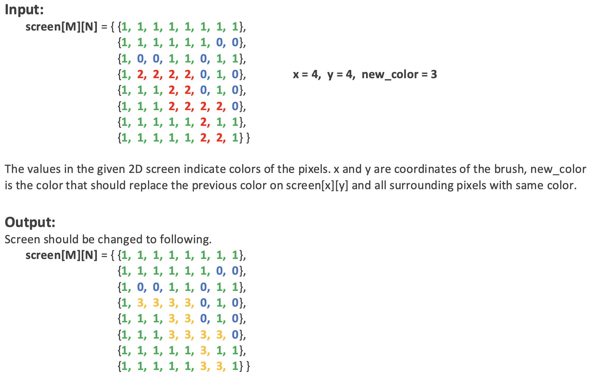
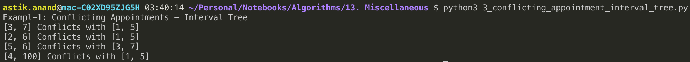
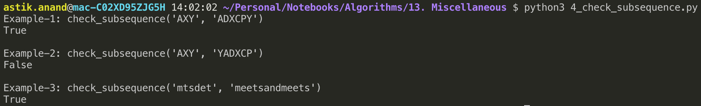
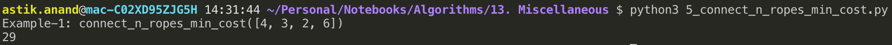

# Miscellaneous Algorithmic Problems

Here are some interesting list of miscellaneous problems.

## 1. Flood Fill Algorithm - Implement fill() in paint***

###### Problem:

In MS-Paint, when we take the brush to a pixel and click, the color of the region of that pixel is replaced with a new selected color. Following is the problem statement to do this task. 
Given a 2D screen, location of a pixel in the screen and a color, replace color of the given pixel and all adjacent same colored pixels with the given color.

> **Example:**



###### Approach - Simple:

- The idea is simple, we first replace the color of current pixel, then recur for 4 surrounding points.

###### Algorithm:

**`flood_fill(screen[M][N], x, y, prev_color, new_color)`**

1. If x or y is outside the screen, then return.
2. If color of `screen[x][y]` is not same as prev_color, then return
3. Replace the color at (x, y)
4. Recur for north, south, east and west
    - flood_fill(screen,  x+1,  y,  prev_color,  new_color)
    - flood_fill(screen,  x-1,   y,  prev_color,  new_color) 
    - flood_fill(screen,  x,  y+1,  prev_color,  new_color)
    - flood_fill(screen,  x,   y-1,  prev_color,  new_color)

###### Implementation:

```python
def flood_fill(screen, x, y, prev_color, new_color):
    m = len(screen)
    n = len(screen[0])

    # If x or y is outside the screen, then return.
    if(x < 0 or x >= m or y < 0 or y >= n):
        return
    
    # If color of screen[x][y] is not same as prev_color, then return
    if(screen[x][y] != prev_color):
        return
    
    # Replace the color at (x, y)
    screen[x][y] = new_color

    # Recur for north, south, east and west
    flood_fill(screen, x, y+1, prev_color, new_color)
    flood_fill(screen, x, y-1, prev_color, new_color)
    flood_fill(screen, x+1, y, prev_color, new_color)
    flood_fill(screen, x-1, y, prev_color, new_color)


print("Example-1: Flood Fill Algorithm")
screen = [ [1, 1, 1, 1, 1, 1, 1, 1], 
           [1, 1, 1, 1, 1, 1, 0, 0], 
           [1, 0, 0, 1, 1, 0, 1, 1], 
           [1, 2, 2, 2, 2, 0, 1, 0], 
           [1, 1, 1, 2, 2, 0, 1, 0], 
           [1, 1, 1, 2, 2, 2, 2, 0], 
           [1, 1, 1, 1, 1, 2, 1, 1], 
           [1, 1, 1, 1, 1, 2, 2, 1] ]


flood_fill(screen, 4, 4, 2, 3); 
m = len(screen)
n = len(screen[0])

for i in range(m):
    for j in range(n):
        print(screen[i][j], end=" ")
    print()
```

**Output:**


###### **Complexity:**

- **Time:** **O(n<sup>2</sup>)** 
- **Auxilliary Space: O(1)**

<br>

<br>

## 2. Find  Conflicting  Appointments***

###### Problem:

Given n appointments, find all conflicting appointments.

An appointment is conflicting, if it conflicts with any of the previous appointments in array.

> **Example:**
>
> ***Input:***  appointments[] = { {1, 5},  {3, 7},  {2, 6},  {10, 15},  {5, 6},  {4, 100} }
> ***Output:*** Following are conflicting intervals
> [3,7] Conflicts with [1,5]
> [2,6] Conflicts with [1,5]
> [5,6] Conflicts with [3,7]
> [4,100] Conflicts with [1,5]

###### Approach-1: Brute-Force

- For every appointment check if it conflicts with any other appointement by processing all appointements one-by-one.
- **Time Complexity: O(n<sup>2</sup>)**

###### Approach-2: Interval Tree

- Create an Interval Tree, initially with the first appointment.
- Do following for all other appointments starting from the second one.
    - a) Check if the current appointment conflicts with any of the existing  appointments in Interval Tree.  If conflicts, then print the current appointment.  This step can be done **O(Logn)** time.
    - b) Insert the current appointment in Interval Tree. This step also can be done O(Logn) time.
- Need to do it for n elements and hence O(nlogn) total time.
- **Time Complexity: O(nlogn)**

###### Implementation:

```python
class IntervalTreeNode:
    def __init__(self, low, high):
        self.low = low
        self.high = high
        self.left = None
        self.right = None


def insert(root, low, high):
    if not root:
        return IntervalTreeNode(low, high)
    
    if low <= root.low:
        root.left = insert(root.left, low, high)
    else:
        root.right = insert(root.right, low, high)
    
    return root


def find_conflicting_appointment(root, low, high):
    while root:
        if(root.low < high and low < root.high):
            print("[{}, {}] Conflicts with [{}, {}]".format(low, high, root.low, root.high))
            return
        elif low <= root.low:
            root = root.left
        else:
            root = root.right


def conflicting_appointments(root, appointments):
    for appointment in appointments:
        low = appointment[0]
        high = appointment[1]
        find_conflicting_appointment(root, low, high)
        root = insert(root, low, high)


print("Exampl-1: Conflicting Appointments - Interval Tree")
appointments = [(1, 5), (3, 7), (2, 6), (10, 15), (5, 6), (4, 100)] 
conflicting_appointments(None, appointments)
```

**Output:**



###### **Complexity:**

- **Time:** **O(nlogn)** 
- **Auxilliary Space: O(1)**

##### Notes:

- Time complexity of the above implementation may be more than O(nLogn) if skewed trees.
- To avoid that we can use Red-Black Tree or AVL Tree balancing techniques.

<br>

<br>

## 3. Find if first string is a subsequence of second***

###### Problem:

Given two strings str1 and str2, find if str1 is a subsequence of str2. A subsequence is a sequence that can be derived from another sequence by deleting some elements without changing the order of the remaining elements.

> **Example:**
>
> ***Input:*** str1 = "AXY", str2 = "ADXCPY" &nbsp; ***Output:*** True
>
> ***Input:*** str1 = "AXY", str2 = "YADXCP" &nbsp; ***Output:*** False
>
> ***Input:*** str1 = "mtsdet", str2 = "meetsandmeets"  &nbsp; ***Output:*** True

###### Approach

- Traverse both strings from one side to other side.
- If a matching character found, move ahead in both strings, otherwise move ahead only in str2.
- **Time Complexity: O(n)**

###### Implementation

```python
def check_subsequence(str1, str2):
    n1 = len(str1)
    n2 = len(str2)
    i = j = 0

    while(i < n1 and j < n2):
        if(str1[i] == str2[j]):
            i += 1
        j += 1
   
    print(i==n1)


print("Example-1: check_subsequence('AXY', 'ADXCPY')")
check_subsequence('AXY', 'ADXCPY')

print("\nExample-2: check_subsequence('AXY', 'YADXCP')")
check_subsequence('AXY', 'YADXCP')

print("\nExample-3: check_subsequence('mtsdet', 'meetsandmeets')")
check_subsequence('mtsdet', 'meetsandmeets')
```

**Output:**



###### **Complexity:**

- **Time:** **O(n)** 
- **Auxilliary Space: O(1)**

<br>

<br>

## 4. Connect 'n' ropes with minimum cost***

###### Problem:

There are given n ropes of different lengths, we need to connect these ropes into one rope.

The cost to connect two ropes is equal to sum of their lengths, calculate the minimum cost.

> **Example:**
>
> ***Input:*** 4 ropes of lengths 4, 3, 2 and 6. &nbsp; ***Output:*** 29
>
> 
>
> ***Explanation:***
>
> 1) First connect ropes of lengths 2 and 3. Now we have three ropes of lengths 4, 6 and 5.
> 2) Now connect ropes of lengths 4 and 5. Now we have two ropes of lengths 6 and 9.
> 3) Finally connect the two ropes and all ropes have connected.
>
> **Total cost** = 5 + 9 + 15 = 29

###### Approach: Huffman Coding

- Observing closely, we can notice that the lengths of the ropes which are picked first are included more than once in total cost.
- Therefore, the idea is to connect smallest two ropes first and recur for remaining ropes.
- This approach is similar to **Huffman Coding**.
- Put smallest ropes down the tree so that they can be repeated multiple times rather than the longer ropes.
- **Time Complexity: O(nlogn)**

###### Algorithm:

1. Create a min heap and insert all lengths into the min heap.
2. Do following while number of elements in min heap is not one.
    - a) Extract the minimum and second minimum from min heap
    - b) Add the above two extracted values and insert the added value to the min-heap.
    - c) Maintain a variable for total cost and keep incrementing it by the sum of extracted values.
3. Return the value of this total cost.

###### Implementation:

```python
import heapq

def connect_n_ropes_min_cost(ropes):
    total_cost = 0
    heapq.heapify(ropes)

    while(len(ropes) >= 2):
        new_connected_rope = heapq.heappop(ropes) + heapq.heappop(ropes)
        total_cost += new_connected_rope
        heapq.heappush(ropes, new_connected_rope)
    
    print(total_cost)


print("Example-1: connect_n_ropes_min_cost([4, 3, 2, 6])")
connect_n_ropes_min_cost([4, 3, 2, 6])
```

**Output:**



###### **Complexity:**

- **Time:** **O(nlogn)** : Extract min take O(logn) and need to do it for n times.
- **Auxilliary Space: O(n)**

<br>

<br>

------

<a href="branch-and-bound-approach" class="prev-button">&larr; Previous: Branch and Bound Approach</a> 

