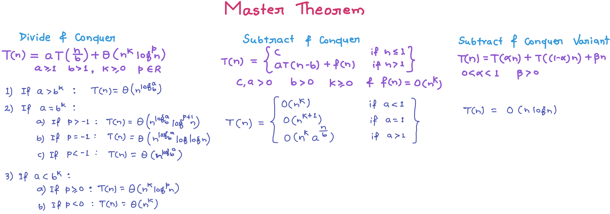
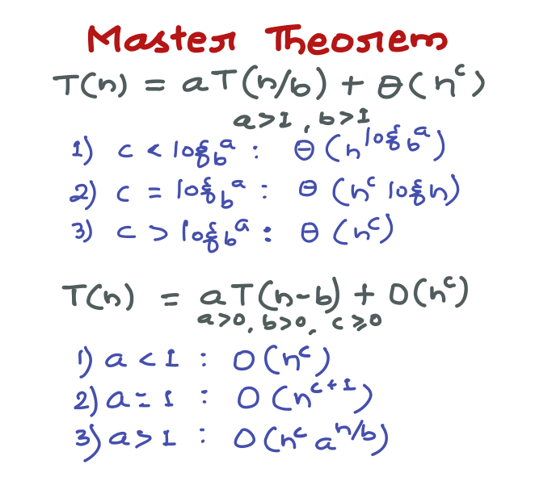
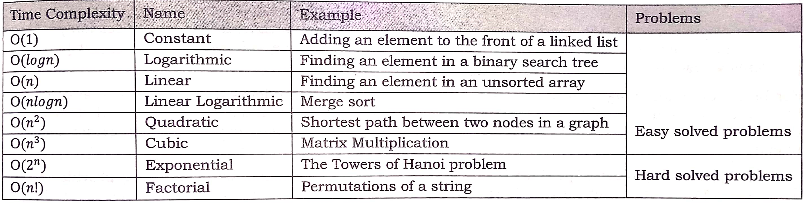
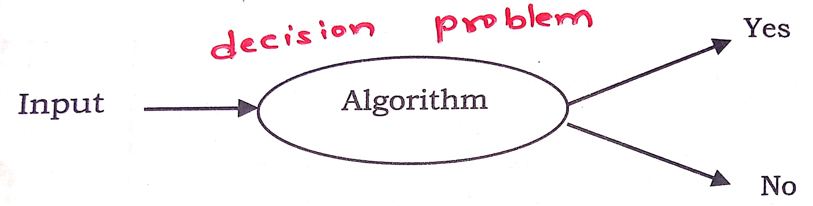
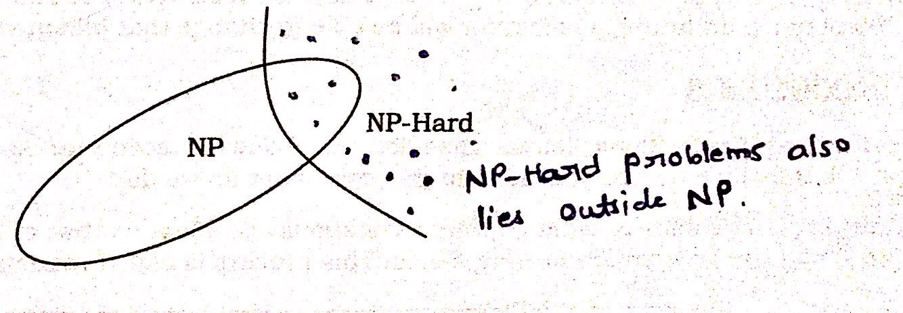
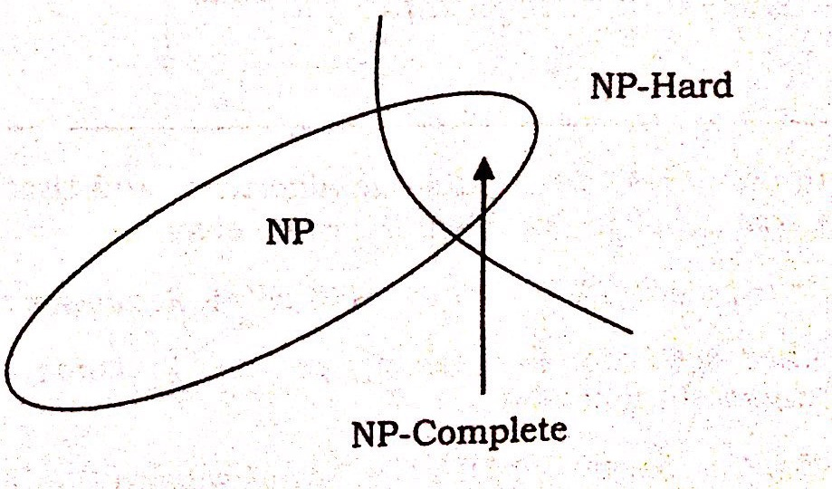
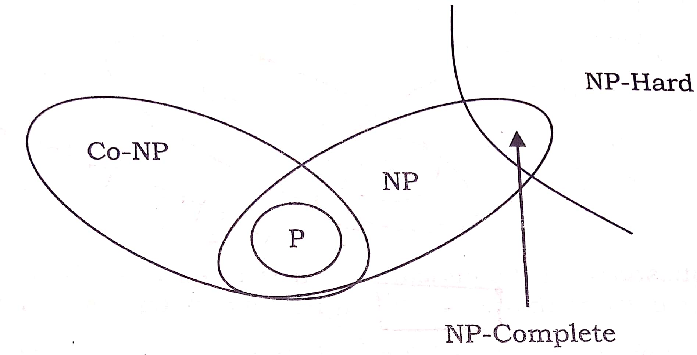
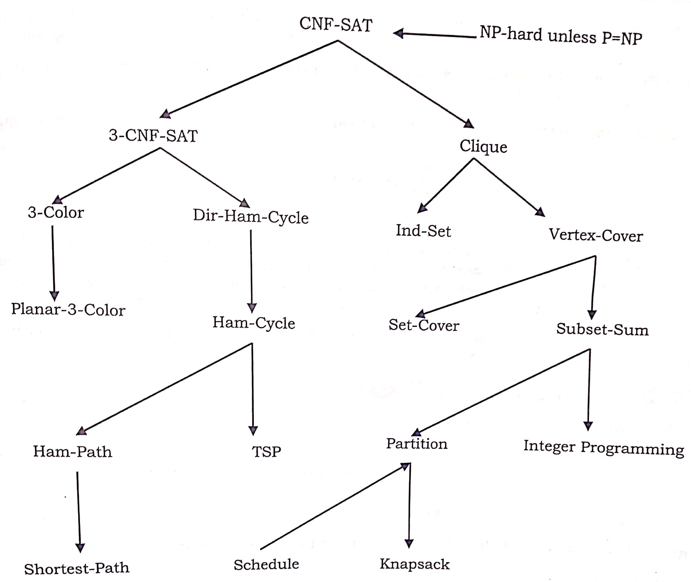

# Complexity Analysis

###### **Why Performance Analysis?**

- There are many important things that should be taken care of, like user friendliness, modularity, security, maintainability, etc.
- Why to worry about performance?
    - The answer to this is simple, we can have all the above things only if we have performance.
    - So performance is like currency through which we can buy all the above things.
    - Another reason for studying performance is – speed is fun!
- To summarize, performance == scale. Imagine a text editor that can load 1000 pages, but can spell check 1 page per minute OR an image editor that takes 1 hour to rotate your image 90 degrees left OR … you get it.
- If a software feature can not cope with the scale of tasks users need to perform – it is as good as dead.

###### **2 algorithms for a task, how to find which one is better?**

- ##### Naive Approach:

    - Implement both the algorithms and run the two programs on the computer for different inputs and see which one takes less time.
    - **Problems with this approach:**
        - It might be possible that for some inputs, first algorithm performs better than the second. And for some inputs second performs better.
        - It might also be possible that for some inputs, first algorithm perform better on one machine and the second works better on other machine for some other inputs.

- ##### Asymptotic Analysis:

## 1. Asymptotic Analysis

###### **What is this Asymptotic Analysis?**

- It is the big idea that handles above issues in analyzing algorithms.
- Here we evaluate the performance of an algorithm **in terms of input size** (we don’t measure the actual running time). 
- We calculate, how does the time (or space) taken by an algorithm increases with the input size.
- **Example:** Let us consider the search problem (searching a given item) in a sorted array. 
    - One way to search is Linear Search (order of growth is linear) and other way is Binary Search (order of growth is logarithmic).
    - To understand how Asymptotic Analysis solves the above mentioned problems in analyzing algorithms:
        - Let us say we run the Linear Search on a fast computer and Binary Search on a slow computer.
        - For small values of input array size n, the fast computer may take less time.But, after certain value of input array size, the Binary Search will definitely start taking less time compared to the Linear Search even though the Binary Search is being run on a slow machine.
        - The reason is the order of growth of Binary Search with respect to input size logarithmic while the order of growth of Linear Search is linear.
        - So the machine dependent constants can always be ignored after certain values of input size.

###### **Does Asymptotic Analysis always work?**

- Asymptotic Analysis is not perfect, but that’s the best way available for analyzing algorithms.
- **Example:** say there are two sorting algorithms that take 1000nLogn and 2nLogn time respectively on a machine. 
    - Both of these algorithms are asymptotically same (order of growth is nLogn).
    - So, with Asymptotic Analysis, we can’t judge which one is better as we ignore constants in Asymptotic Analysis.
- Also, in Asymptotic analysis, we always talk about input sizes larger than a constant value.
- It might be possible that those large inputs are never given to our software and an algorithm which is asymptotically slower, always performs better for that particular situation.
- So, we may end up choosing an algorithm that is Asymptotically slower but faster for our software.

#### Worst, Average and Best Case

- **Worst Case Analysis (Usually Done)**
- **Average Case Analysis (Sometimes done)**
- **Best Case Analysis (Bogus)**

#### Asymptotic Notations

Asymptotic notations are mathematical tools to represent time complexity of algorithms for asymptotic analysis.


- ###### 1. Θ Notation:

    The theta notation bounds a functions from above and below, so it defines exact asymptotic behavior.

    > For a given function g(n), we denote Θ(g(n)) is following set of functions. 
    >
    > **Θ(g(n))** = {f(n): there exist positive constants c1, c2 and n0 such that 0 <= c1*g(n) <= f(n) <= c2*g(n) for all n >= n0} 

    

    

- ###### 2. Big O Notation:

    The Big O notation defines an upper bound of an algorithm, it bounds a function only from above.

    > **O(g(n))** = { f(n): there exist positive constants c and n0 such that 0 <= f(n) <= c*g(n) for all n >= n0}

    

    

- ###### **3. Ω Notation**

    Just as Big O notation provides an asymptotic upper bound on a function, Ω notation provides an asymptotic lower bound.

    > **Ω (g(n))** = {f(n): there exist positive constants c and n0 such that 0 <= c*g(n) <= f(n) for all n >= n0}.

#### Calculating Time Complexity

- ##### 1. O(1): 

    Time complexity of a function (or set of statements) is considered as O(1) if it doesn’t contain loop, recursion and call to any other non-constant time function.

    > // set of non-recursive and non-loop statements

    **Example:** swap() function has O(1) time complexity.

    

- ##### 2. O(n):

    Time Complexity of a loop is considered as O(n) if the loop variables is incremented / decremented by a constant amount. 

    **Example:** following functions have O(n) time complexity. 

    ```c++
    // Here c is a positive integer constant    
    
    for (int i = 1; i <= n; i += c) {   
      // some O(1) expressions 
    } 
    ```

    

- ##### 3. O(n<sup>c</sup>):

    Time complexity of nested loops is equal to the number of times the innermost statement is executed. 

    **Example:** The following sample loops have O(n<sup>2</sup>) time complexity

    ```c++
    for (int i = 1; i <=n; i += c) { 
      for (int j = 1; j <=n; j += c) { 
        // some O(1) expressions 
      } 
    } 
    ```

    

- ##### 4. O(logn):

    Time Complexity of a loop is considered as O(Logn) if the **loop variables is divided / multiplied by a constant amount**.

    ```c++
    for (int i = 1; i <=n; i *= c) { 
      // some O(1) expressions 
    } 
    
    for (int i = n; i > 0; i /= c) { 
      // some O(1) expressions 
    }
    ```

    **Example:** Binary Search(refer iterative implementation) has O(Log n) time complexity. 

    Let us see mathematically how it is O(Log n): The series that we get in first loop is 1, c, c2, c3, … ck. So now,  ck = n then  k = logcn and hence O( Log n) 

    

- ##### 5. O(loglogn):

    Time Complexity of a loop is considered as O(LogLogn) if the **loop variables is reduced / increased exponentially by a constant amount**.

    ```c++
    // Here c is a constant greater than 1    
    for (int i = 2; i <=n; i = pow(i, c)) { 
      // some O(1) expressions 
    } 
    
    //Here root is sqrt or cuberoot or any other constant root 
    for (int i = n; i > 0; i = root(i)) { 
      // some O(1) expressions 
    } 
    ```

    

    

- ##### Solving Recurrences

    Many algorithms are recursive in nature. When we analyze them, we get a recurrence relation for time complexity. 

    **Example:** Merge Sort: **T(n) = 2T(n/2) + cn**

    There are many other algorithms like Binary Search, Tower of Hanoi, etc.

    > **Methods to solve Recurrences:**

    - ###### 1. Substitution Method (Method of Guessing and Confirm):

        We make a guess for the solution and then we use mathematical induction to prove the guess is correct or incorrect.

        > **Example: ** &nbsp;Consider the recurrence T(n) = 2T(n/2) + n 
        >
        > We guess the solution as T(n) = O(nLogn). Now we use induction to prove our guess. 
        >
        > We need to prove that T(n) <= cnLogn. We can assume that it is true for values smaller than n. 
        >
        > T(n) = 2T(n/2) + n 
        >
        > ​    <= cn/2Log(n/2) + n 
        >
        > ​    =  cnLogn - cnLog2 + n 
        >
        > ​    =  cnLogn - cn + n 
        >
        > ​    <= cnLogn 

        

    - ##### 2. Master Theorem Method

        
        
        
        
        

## 2. Amortized Analysis

###### **What is this Amortized Analysis?**

- It refers to determining the time-averaged running time for a sequence of operations.
- It is worst-case analysis for a sequence of operations rather than for an individual operation.
- **Example:** Finding k<sup>th</sup> smallest element
    - We can solve this by sorting the array and after sorting we just need to return kth element. 
    - Sorting takes O(nlogn) time so for individual operation or Asymptotic analysis time is O(nlogn).
    - But if we need to take the same operation for n times the amortized time-complexity = O(nlogn/n ) = O(logn).
    - Hence, sorting once has reduced the complexity of subsequent operations.
- The example data structures whose operations are analyzed using Amortized Analysis are Hash Tables, Disjoint Sets and Splay Trees.

###### **Why Amortized Analysis?**

- Motivation for amortized analysis is to better understand the running time of certain techniques, where standard worst case analysis provides an overly pessimistic bond.
- Applies to method that consists of sequence of operations, where the vast majority of the operations are cheap, but some of the operations are expensive.
- If we can show that the expensive operations are particularly rare we can charge them to the cheap operations, and only bound the cheap operations.

###### **How to calculate it?**

- General approach is to assign an **artificial cost (amortized cost)** to each operation in the sequence of operations. 
- Such that the total of the artificial costs for sequence of operations bounds total of real costs for the sequence.
- Amortized analysis thus is a correct way of understanding the overall running time.

###### **Benefits:**

- When one event in a sequence affects the cost of later events:
    - One particular task may be expensive.
    - But it may leave data structure in a state that next few operations become easier.


## 3. Space Complexity

###### **What is Space Complexity?**

- The term Space Complexity is misused for Auxiliary Space at many places.
- **Auxiliary Space:** is the extra space or temporary space used by an algorithm. 
- **Space Complexity:** of an algorithm is total space taken by the algorithm with respect to the input size and includes both Auxiliary space and space used by input. 
- But if we want to compare algorithms on the basis of space, then Auxiliary Space would be a better criteria than Space Complexity.
    - **Example:** Merge Sort uses O(n) auxiliary space, Insertion sort and Heap Sort use O(1) auxiliary space. Space complexity of all these sorting algorithms is O(n) though.


## 4. Complexity Classes

###### What are complexity classes?

- In computer science, in order to understand the problems for which solutions are not there, the problems are divided into classes k/a Complexity Classes.
- In complexity theory, a complexity class is a set of problems with related complexity.
- It is the branch of theory of computation that studies the resource required during computation to solve a given problem.
- The most common resources are time (how much time the algorithm takes to solve a problem) and space (how much memory it takes).

###### **Easy Problems & Hard Problems**

- The classification is done on based on the running time (or memory) that an algorithm takes for solving the problem.

- Problems with lower rate of growth are called **easy problems** (easy solved problems). 

- Problems with higher rate of growth are called **hard problems** (hard solved problems). 

    

###### **Polynomial & Exponential Time**

- **Exponential time** means, in essence, trying every possibility (Example: Backtracking Algorithms) and they are very slow in nature. 
- **Polynomial time** means having some clever algorithm to solve a problem, and we don’t try every possibility. 
    - **Polynomial time:** O(nk) for some k. 
    - **Exponential time:** O(kn) for some k. 

###### **Decision Problem & Decision Procedure**

- A **decision problem** is a question with yes/no answer and the answer depends on the values of the input. 

    - **Example:** "Given an array of n numbers check whether there are any duplicates or not?” is a decision problem and the answer can be “Yes/No” depending on input.

- Solving a given decision problem with an algorithm is called **decision procedure** for that problem. 

    

#### Types of Complexity Classes

##### **P Class**

- Set of decision problems that can be solved by a **deterministic machine in polynomial time** (P stands for polynomial time). 
- These are set of problems whose solutions are easy to find.

##### **NP Class**

- Set of decision problems that can be solved by a **non-deterministic machine in polynomial time** (NP stands for non-deterministic polynomial time) 
- These are set of problems whose solutions are hard to find but easy to verify.
- If someone gives us a solution to the problem, we can tell them whether it is right or not in polynomial time.
- If the answer to a problem is “YES”, then there is a proof of this fact, which can be verified in polynomial time.

##### **Co-NP Class**

- Opposite or complement of NP.

- If the answer to a problem Co-NP is “NO”, then there is a proof of this fact that can be checked in polynomial time.

    


> **Relationship between P, NP, Co-NP:**

- Any problem in P is also in NP coz if a problem is in P, we can verify “YES” answer in polynomial time.

- Similarly any problem in P is also in Co-NP coz if a problem is in P, we can verify “NO” answer in polynomial time.

- **One of the important open questions in theoretical computer science is whether or not P=NP (Nobody knows).**

- Intuitively it should be obvious that **P≠NP**, but nobody knows how to prove it. 

- **Another open questions is whether NP and Co-NP are different (Nobody knows).**

- Even if we can verify every “YES” answer quickly, there’s no reason to think we can also verify “NO” answers quickly.

- It is generally believed that NP≠Co-NP, but again nobody knows how to prove it.

    

##### **NP-Hard Class**

- Class of decision problems which are at least as hard as the hardest problems in NP.

- Every Problem in NP can be reduced to it.

- A problem K is NP-Hard indicates that if a polynomial-time algorithm exists for K then a polynomial-time algorithm exists for every problem in NP.

- K is NP-hard implies that if K can be solved in polynomial-time, then P=NP.

- Although it is suspected that there are no polynomial-time algorithms for NP-hard problems, this has not been proven.

- All NP-Hard problems are not in NP, so it takes a long time to even check them (forget about solving) and it may not even be decidable.

- **NP-hard are not only restricted to decision problems, for instance it also includes search problems, or optimization problems.**

    - Subset-Sum (Decision Problem),
    - Travelling Salesman (Optimization Problem)
    - Halting Problem (Undecidable, Not NP-Complete) 

    

##### **NP-Complete Class**

- A problem is NP-Complete if it is part of both NP-hard and NP. 

- Class of decision problems which contains the hardest problems in NP (but remember there can be even more harder problem outside NP in NP-Hard class).

- Each NP-complete problem has to be in NP.

- If anyone finds a polynomial-time algorithm for one NP-Complete problem, then we can find polynomial-time algorithm for every NP-Complete problem.

- We can check an answer fast and every problem in NP reduces to it.

- **Example:** Subset-Sum (NP-Complete)

    


> **Relationship between P, NP, Co-NP, NP-Hard and NP-Complete**

- NP-Complete problems are strict subset of problems that are NP-Hard or NP-Hard is strict superset of NP-Complete.

- Some problems are NP-Hard but not in NP.

- NP-Hard problems might be impossible to solve in general.

- We can tell the difference in difficulty b/w NP-Hard and NP-Complete coz  NP includes everything easier than it’s toughest problem.

- But if a problem is not in NP, it is harder than all problems in NP.

    

###### **Does P=NP?**

- If P=NP, it means that every problem that can be checked quickly can be solved quickly (remember the difference b/w checking and actually solving).
- This is a big question but nobody knows the answer, coz right now there are lots of NP-Complete problems that can’t be solved quickly.
- P=NP means there is a way to solve them fast, quickly means no trial-and-error.
- It could take billion years, but as long as we didn’t use trail and error it was quick, coz in future a fast computer will be able to change that billion years to few minutes.

#### Pseudo-Polynomial Algorithms

###### **What is Pseudo-polynomial?**

- An algorithm whose worst case time complexity depends on numeric value of input (not number of inputs) is called Pseudo-polynomial algorithm.
- **Example:** Consider the problem of counting frequencies of all elements in an array of positive numbers.
    - A pseudo-polynomial time solution for this is to first find the maximum value, then iterate from 1 to maximum value and for each value, find its frequency in array.
    - This solution requires time according to maximum value in input array, therefore pseudo-polynomial.
    - On the other hand, an algorithm whose time complexity is only based on number of elements in array (not value) is considered as polynomial time algorithm.

###### **Pseudo-polynomial and NP-Completeness**

- Some NP-Complete problems have Pseudo Polynomial time solutions.
- **Example:** Dynamic Programming Solutions of **0-1 Knapsack**, **Subset-Sum** and **Partition problems** are Pseudo-Polynomial. 
- NP complete problems that can be solved using a pseudo-polynomial time algorithms are called **weakly NP-complete**. 


> **NP-Hard Class Problems**




## Examples of Algorithms Analysis:

**Example-1:**

```c++
void fun(){
   int i, j;
   for (i=1; i<=n; i++)
      for (j=1; j<=log(i); j++)
         printf("GeeksforGeeks");
}
/* Θ(log 1) + Θ(log 2) + Θ(log 3) + . . . . + Θ(log n) = Θ(log n!) = Θ(nlogn)   coz n!≈nn/2 
T(n) = Θ(nlogn) */
```


**Example-2:**

```c++
void fun(int n){
   int j = 1, i = 0;
   while (i < n){
       // Some O(1) task
       i = i + j;
       j++;
   }
}

/* The value of i is incremented by 1,2,3,4, . . . and so on 
So the value of i will be like 0, 1, 3, 6, 10, 15, . . .  : We can see that kth term will be k(k+1)/2
k(k+1)/2 = n => k2/2 = n => k = √n 
T(n) = Θ(√n) */
```


------

<a href="2_searching_sorting" class="next-button">Next: Searching and Sorting &rarr;</a>

