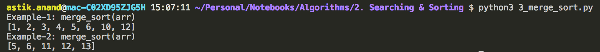
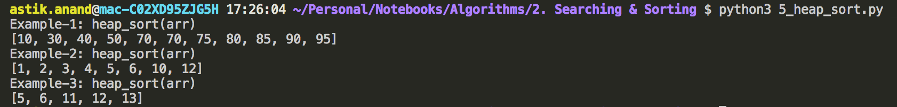
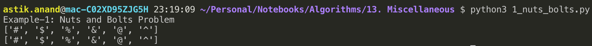

# Sorting Algorithms

###### Why Sorting Algorithms ?

Many a times a computer science problems need data to be present in certain sorted order. These are the scenarios when we need the Sorting Algorithms.

> **Famous Sorting Algorithms:**

- ##### Comparison Sorts:

    - Bubble Sort
    - Insertion Sort
    - Merge Sort
    - Quick Sort
    - Heap Sort
    - Binary Tree Sort

- ##### Non-comparison Sorts:

    - Bucket Sort
    - Counting Sort
    - Radix Sort
    - Pigeonhole Sort


<br>

<br>

> ### Algo-1: Insertion Sort

###### What is Insertion Sort ?

- Insertion sort is a simple sorting algorithm that works the way we sort playing cards in our hands.


###### **Algorithm:**

- Loop from i = 1 to n-1.
    - Pick element arr[i] and insert it into sorted sequence arr[0…i-1]

###### **Implementation:**

```python
def insertion_sort(arr):
    n = len(arr)

    for i in range(n):
        key = arr[i]

        # Now find a place to insert this key by shifting every left element which is larger to right by 1
        # Here we are using linear search to find a place to insert key in sorted arr till i-1
        # We can also use binary search to find that particular place :--> Binary Insertion Sort
        j = i-1
        while(j>=0 and arr[j]> key):
            arr[j+1] = arr[j]
            j -= 1
        
        # arr[j] is smaller than or equal to key, so insert key after it
        arr[j+1] = key
    
    return arr


print("Example-1: insertion_sort(arr)")
arr = [4, 3, 2, 10, 12, 1, 5, 6]
print(insertion_sort(arr))

print("Example-2: insertion_sort(arr)")
arr = [12, 11, 13, 5, 6]
print(insertion_sort(arr))
```

**Output:**


###### **Complexity:**

- **Time:-** Worst Case:**O(n<sup>2</sup>)**  Average Case: **O(n<sup>2</sup>)** 
- **Auxilliary Space: O(1)**

##### Notes:

- **Algorithmic Paradigm:** Incremental Approach 
- **Sorting In Place:** Yes 
- **Stable:** Yes 

##### **Uses:** 

- Insertion sort is used when number of elements is small.
- It can also be useful when input array is almost sorted, only few elements are misplaced in complete big array.

##### **Binary Insertion Sort:**

- We can use binary search to reduce the number of comparisons in normal insertion sort.
- Binary Insertion Sort uses binary search to find the proper location to insert the selected item at each iteration.
- Worst Case:**O(nlogn)**  Average Case: **O(n<sup>2</sup>)** 


<br>

<br>

> ### Algo-2: Merge Sort***

###### What is Merge Sort ?

- Merge Sort is a Divide and Conquer algorithm.
- It divides input array in two halves, calls itself for the two halves and then merges the two sorted halves.
- The **merge( )** function is used for merging two halves. 
- The merge( ) is key process that assumes that arr[…mid] and arr[mid+1….] are sorted and merges the two sorted sub-arrays into one.


###### **Algorithm:**

- Divide the array into two halves: 
- sorted_arr1 = merge_sort for first half
- sorted_arr2 = merge_sort for second half
- sorted_arr = merge(sorted_arr1, sorted_arr2)

###### **Implementation:**

```python
def merge_sort(arr):
    n = len(arr)

    # Base case: if n = 0 return [] and if n = 1 return [num1]
    if(n==0 or n==1):
        return arr
    
    # Divide the array into 2 halves and call merge_sort on both
    sorted_arr1 = merge_sort(arr[:n//2])
    sorted_arr2 = merge_sort(arr[n//2:])

    # Call merge to merge both sorted_arr1 and sorted_arr2
    sorted_arr = merge(sorted_arr1, sorted_arr2)

    return sorted_arr


def merge(sorted_arr1, sorted_arr2):
    n1 = len(sorted_arr1)
    n2 = len(sorted_arr2)

    i=0; j=0
    merged_arr = []
    while(i<n1 and j<n2):
        if(sorted_arr1[i] <= sorted_arr2[j]):
            merged_arr.append(sorted_arr1[i])
            i += 1
        else:
            merged_arr.append(sorted_arr2[j])
            j += 1
    
    # If elements are left in sorted_arr1
    if(i<n1):
        merged_arr += sorted_arr1[i:]
    
    # If elements are left in sorted_arr2
    if(j<n2):
        merged_arr += sorted_arr2[j:]
    
    
    return merged_arr


print("Example-1: merge_sort(arr)")
arr = [4, 3, 2, 10, 12, 1, 5, 6]
print(merge_sort(arr))

print("Example-2: merge_sort(arr)")
arr = [12, 11, 13, 5, 6]
print(merge_sort(arr))
```

**Output:**



###### **Complexity:**

- **Time:-** Worst Case:**O(nlogn)**  Average Case: **O(nlogn)** 
- **Auxilliary Space: O(n)**

##### Notes:

- **Algorithmic Paradigm:** Divide and Conquer Approach 
- **Sorting In Place:** No
- **Stable:** Yes 

##### **Uses:**

- Merge Sort is useful for sorting linked lists in O(nLogn) time.
- Inversion Count Problem
- Used in External Sorting


<br>

<br>

> ### Algo-3: Quick Sort***

###### What is Quick Sort ?

- Like Merge Sort, QuickSort is a Divide and Conquer algorithm.
- It picks an element as pivot and partitions the given array around the picked pivot.
- **There are many different versions of quickSort that pick pivot in different ways.**
  - Always pick first element as pivot.
  - Always pick last element as pivot (implemented below)
  - Pick a random element as pivot.
  - Pick median as pivot.
- The key process in quickSort is `partition()`. Target of partitions is to put pivot x  of array at its correct position in sorted array and put all elements smaller than x before x, and all elements greater than x after x. All this should be done in linear time.


###### Algorithm:

- **quick_sort( ):**
    - If size is 0 or 1 rerun the array.
    - call the **partition( )** function to get the partition_index. 
    - Now do: **quick_sort(arr[:p_index]) + [arr[p_index]] + quick_sort(arr[p_index+1:])**
    - Return the sorted array
- **partition ( ):**
    - Take last element as pivot.
    - Initialize i =0
    - Start from first element and check if it is lesser than pivot:
        - swap the current element with ith element and increase i.
    - Once every element is done return partition_index as i-1

###### **Implementation:**

```python
def quick_sort(arr):
    n = len(arr)

    if( n==0 or n==1):
        return arr
    
    p_index = partition(arr)
    
    # Sort the left side of array till partition_index 
    # Sort the right side of array from partition_index till the end
    # Return the combined array
    sorted_arr = quick_sort(arr[:p_index]) + [arr[p_index]] + quick_sort(arr[p_index+1:])

    return sorted_arr


def partition(arr):
    n = len(arr)
    # Select the last element as pivot
    pivot = arr[-1]
    i = 0
    for j in range(n):
        if(arr[j] <= pivot):
            arr[i], arr[j] = arr[j], arr[i]
            i+=1
    
    # Index of pivot as pivot is also considered in swap hence i-1
    return i-1


print("Example-1: quick_sort(arr)")
arr = [10, 80, 30, 90, 70, 85, 75, 95, 40, 50, 70]
print(quick_sort(arr))

print("Example-2: quick_sort(arr)")
arr = [4, 3, 2, 10, 12, 1, 5, 6]
print(quick_sort(arr))

print("Example-3: quick_sort(arr)")
arr = [12, 11, 13, 5, 6]
print(quick_sort(arr))
```

**Output:**


###### **Complexity:**

- **Time:-** Worst Case:**O(n<sup>2</sup>)**  Average Case: **O(nlogn)** 
- **Auxilliary Space: O(1)**

##### Notes:

- **Algorithmic Paradigm:** Divide and Conquer Approach 
- **Sorting In Place:** Yes
- **Stable:** No

##### **Uses:**

- Quick Sort is preferred over MergeSort for sorting Arrays.
- MergeSort is preferred over QuickSort for Linked Lists


<br>

<br>

> ### Algo-4: Heap Sort***

Heap sort is a comparison based sorting technique based on **Binary Heap** data structure. 

It is similar to selection sort where we first find the maximum element and place the maximum element at the end and repeat the same process for remaining element.

###### **Algorithm:**

1. Build a max heap from the input data.
2. At this point, the largest item is stored at the root of the heap.
3. Replace it with the last item of the heap followed by reducing the size of heap by 1.
4. Finally, heapify the root of tree.
5. Repeat above steps while size of heap is greater than 1.

###### Implementation

```python
def heap_sort(arr): 
    n = len(arr) 
  
    # Build a maxheap. 
    for i in range(n//2, -1, -1): 
        max_heapify(arr, i, n) 
  
    # One by one move larger elements to end and decrease the size
    for i in range(n-1, 0, -1): 
        arr[i], arr[0] = arr[0], arr[i] 
        max_heapify(arr, 0, i)
    
    return arr


def max_heapify(arr, i, N):
    left_child = 2*i+1
    right_child = 2*i+2

    # Find the largest of left_child, right_child and parent which is i.
    if (left_child < N and arr[left_child] > arr[i]):
        largest = left_child
    else:
        largest = i

    if (right_child < N and arr[right_child] > arr[largest]):
         largest = right_child

    # If Parent is not largest, swap and apply max_heapify on child to propagate it down
    if largest != i:
        arr[i], arr[largest] = arr[largest], arr[i]
        max_heapify(arr, largest, N)
  


print("Example-1: heap_sort(arr)")
arr = [10, 80, 30, 90, 70, 85, 75, 95, 40, 50, 70]
print(heap_sort(arr))

print("Example-2: heap_sort(arr)")
arr = [4, 3, 2, 10, 12, 1, 5, 6]
print(heap_sort(arr))

print("Example-3: heap_sort(arr)")
arr = [12, 11, 13, 5, 6]
print(heap_sort(arr))
```

**Output:**



###### **Complexity:**

- **Time:-** Worst Case:**O(nlogn)**  Average Case: **O(nlogn)** 
- **Auxilliary Space: O(1)**

##### Notes:

- **Algorithmic Paradigm:** Choose Min or Max Approach
- **Sorting In Place:** Yes
- **Stable:** No

##### **Uses:**

- Sort a nearly sorted (or K sorted) array
- k largest(or smallest) elements in an array


----

### Standard Sorting Algorithms Problems

## 1. Sorting Log Files

###### Problem:

You have an array of logs.  Each log is a space delimited string of words.

For each log, the first word in each log is an alphanumeric identifier.  Then, either:

- Each word after the identifier will consist only of lowercase letters, or;
- Each word after the identifier will consist only of digits.

We will call these two varieties of logs letter-logs and digit-logs. It is guaranteed that each log has at least one word after its identifier.

Reorder the logs so that all of the letter-logs come before any digit-log.  The letter-logs are ordered lexicographically ignoring identifier, with the identifier used in case of ties.  The digit-logs should be put in their original order.

Return the final order of the logs.

<br>

###### Approach:

- We can split each log by first space to get identifier and log_data.
- We just need to sort the letter logs by log_data and if log_data matches then on the basis of identifier using custom comparator.
- We also need to ignore the digit logs.
- So we need to write out custom comparator in such a way that it ignores digit logs and sort letter logs by log_data and identifier for ties.

<br>

###### Implementation:

**Code:**

```python
class Solution:
    def reorderLogFiles(self, logs):
        logs.sort(key=self._get_key)
        return logs

    def _get_key(self, log):
        identifier, log_data = log.split(" ", 1)
        if (log_data[0].isalpha()):
            return (0, log_data, identifier)
        else:
            return (1, )


logs = ["dig1 8 1 5 1", "let1 art can", "dig2 3 6", "let2 own kit dig", "let3 art zero"]
print(Solution().reorderLogFiles(logs))
```

**Output:**

```
['let1 art can', 'let3 art zero', 'let2 own kit dig', 'dig1 8 1 5 1', 'dig2 3 6']
```

**Complexity:**

- ***Time: O(M\*N\*LogN)*** 
  - Here, N is total number of logs and M is the max length of single.
  - N\*LogN to sort n items and then each log item is of length M hence, M\*N\*LognN.
- ***Space: O(M\*N)***
  - Sorting of n items take N space and each item is of length M, hence M\*N.

<br>

<br>

## 2. Nuts & Bolts (Lock & Key) Problem***

###### Problem:

Given a set of n nuts of different sizes and n bolts of different sizes. There is a one-one mapping between nuts and bolts.

Match nuts and bolts efficiently.

**Constraints:**

- Comparison of a nut to another nut or a bolt to another bolt is not allowed.
- It means nut can only be compared with bolt and bolt can only be compared with nut to see which one is bigger/smaller.

##### Other way of asking this problem:

Given a box with locks and keys where one lock can be opened by one key in the box. We need to match the pair.

> **Example Representation:**
>
> Nuts represented as array of character: &nbsp; ***char nuts[]*** = {‘@’, ‘#’, ‘$’, ‘%’, ‘^’, ‘&’}
>
> Bolts represented as array of character: &nbsp; ***char bolts[]*** = {‘$’, ‘%’, ‘&’, ‘^’, ‘@’, ‘#’}

###### Approach-1: Brute Force

- Start with the first bolt and compare it with each nut until we find a match.
- **Time Complexity: O(n<sup>2</sup>)**

###### Approach-2: Quick Sort

- Perform a partition by picking last element of bolts array as pivot, rearrange the array of nuts and returns the partition index **'i'** such that all nuts smaller than **nuts[i]** are on the left side and all nuts greater than **nuts[i]** are on the right side.
- Next using the nuts[i] we can partition the array of bolts, partitioning operations can easily be implemented in O(n) and this operation also makes nuts and bolts array nicely partitioned.
- Now apply this partitioning recursively on the left and right sub-array of nuts and bolts.
- As we apply partitioning on nuts and bolts both so the total time complexity will be Θ(2*nlogn) = **Θ(nlogn) on average**.
- Here for the sake of simplicity we have chosen last element always as pivot. We can do randomized quick sort too.

###### Implementation

```python
def nuts_bolts_match(nuts, bolts, low, high):
    if low < high:
        # Set last character of bolts for nuts partition.
        pivot = partition(nuts, low, high, bolts[high])

        # Now using the partition index of nuts set pivot for bolts partition
        partition(bolts, low, high, nuts[pivot])

        # Recur for [low...pivot-1] & [pivot+1...high] for nuts and bolts array.
        nuts_bolts_match(nuts, bolts, low, pivot-1)
        nuts_bolts_match(nuts, bolts, pivot+1, high)


def partition(arr, low, high, pivot):
    i = low
    while(i < high):
        if arr[i] < pivot:
            arr[low], arr[i] = arr[i], arr[low]
            low += 1
        elif arr[i] == pivot:
            arr[high], arr[i] = arr[i], arr[high]
            i -= 1

        i += 1

    arr[low], arr[high] = arr[high], arr[low]

    return low


print("Example-1: Nuts and Bolts Problem")
nuts = ['@', '#', '$', '%', '^', '&']
bolts = ['$', '%', '&', '^', '@', '#']
nuts_bolts_match(nuts, bolts, 0, 5)
print(nuts)
print(bolts)
```

**Output:**



###### **Complexity:**

- **Time:-** Average Case: **O(nlogn)** 
- **Auxilliary Space: O(1)**


<br>

<br>

------

<a href="searching-algorithms" class="prev-button">&larr; Previous: Searching Algorithms</a>   

<a href="selection-algorithms" class="next-button">Next: Selection Algorithms  &rarr;</a>

