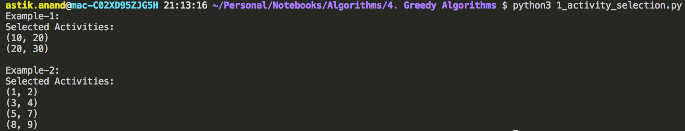
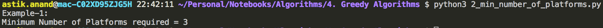
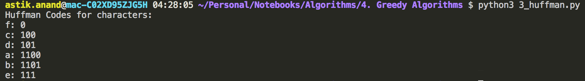

# Greedy Approach

Greedy is an algorithmic paradigm that builds up a solution piece by piece, always choosing the next piece that offers the most obvious and immediate benefit.

###### Where Greedy Algorithms are used ?

- Greedy algorithms are used for optimization problems.
- **An optimization problem can be solved using Greedy if the problem has the following property:**
    - At every step, we can make a choice that looks best at the moment, and we get the optimal solution of the complete problem.
- If a Greedy Algorithm can solve a problem, then it generally becomes the best method to solve that problem.
- Because the Greedy algorithms are in general more efficient than other techniques like Dynamic Programming.
- But Greedy algorithms cannot always be applied.
- **Example:-** Fractional Knapsack problem can be solved using Greedy, but 0-1 Knapsack can't be solved using Greedy.


> **Standard Greedy Algorithm Problems:**

1. **Kruskal’s Minimum Spanning Tree (MST):**
    - Create a MST by picking edges one by one.
    - The Greedy Choice is to pick the smallest weight edge that doesn’t cause a cycle in the MST constructed so far.
2. **Prim’s Minimum Spanning Tree (MST):**
    - Create a MST by picking edges one by one.
    - Maintain two sets: a set of the vertices already included in MST and the set of the vertices not yet included.
    - The Greedy Choice is to pick the smallest weight edge that connects the two sets.
3. **Dijkstra’s Shortest Path (SPT):**
    - The Dijkstra’s algorithm is very similar to Prim’s algorithm.
    - The shortest path tree is built up, edge by edge.
    - Maintain two sets: a set of the vertices already included in the tree and the set of the vertices not yet included.
    - The Greedy Choice is to pick the edge that connects the two sets and is on the smallest weight path from source to the set that contains not yet included vertices.
4. **Huffman Coding:**
    - A loss-less compression technique.
    - It assigns variable-length bit codes to different characters.
    - The Greedy Choice is to assign least bit length code to the most frequent character.
5. **Approximation for Hard optimization problems:** 
    - The greedy algorithms are sometimes also used to get an approximation for Hard optimization problems.
    - Example: **Traveling Salesman Problem** is a **NP-Hard problem**. 
    - A Greedy choice for this problem is to pick the nearest unvisited city from the current city at every step.
    - This solutions don’t always produce the best optimal solution but can be used to get an approximately optimal solution.

------

### Standard Greedy Algorithm Problems

## 1. Activity Selection Problem***

###### **Problem:**

Given n activities with their start and finish times.

Select the maximum number of activities that can be performed by a single person, assuming that a person can only work on a single activity at a time.

> **Example-1:** Consider the following 3 activities sorted by finish time. 
>
> start[]  =  {10, 12, 20} 
>
> finish[] =  {20, 25, 30} 
>
> **Output:** (10, 20) (20, 30)
>
> 
>
> **Example-2:** Consider the following 6 activities sorted by finish time. 
>
> start[]  =  {3 , 0 , 5 , 8 , 5, 1} 
>
> finish[] =  {4 , 6 , 9 , 9 , 7, 2} 
>
> ***Output:*** (1, 2)  (3, 4) (5, 7)  (8, 9) 

###### **Algorithm:**

- Sort the activities by the finish time in increasing order and preferably if finish times are same then start time in decreasing order.
- Just start picking the activities from start.
- Make sure that the start time of next activity is greater or equal to finish time of previous activity.

###### **Implementation**

```python
def activity_selection(start, finish):
    activities = []
    n = len(start)
    for i in range(n):
        activities.append((start[i], finish[i]))
    
    # Sort the activities by finish time in increasing order and if finish times same then start time in decreasing order
    activities.sort(key=lambda k: (k[1], -k[0]))

    print("Selected Activities:")
    prev_finish = 0
    for current_start, current_finish in activities:
        if(current_start >= prev_finish):
            print("({}, {})".format(current_start, current_finish))
            prev_finish = current_finish


print("Example-1:")
start =  [10, 12, 20] 
finish = [20, 25, 30] 
activity_selection(start, finish)

print("\nExample-2:")
start =  [3 , 0 , 5 , 8 , 5, 1] 
finish = [4 , 6 , 9 , 9 , 7, 2] 
activity_selection(start, finish)


# Time : O(n log n) if input activities not sorted. 
#      : O(n) if input activities are sorted.
# Auxilliary Space: O(n) :-> Creating a new array but can be done in O(1)
```

**Output:**



###### **Complexity:**

- **Time:** 
    - **O(n log n):** if input activities not sorted. 
    - **O(n):** if input activities are sorted.
- **Auxilliary Space:** **O(n)** :-> Creating a new array but can be done in O(1)


## 2. Minimum Number of Platforms Required***

###### **Problem:**

Given arrival and departure times of all trains that reach a railway station, find the minimum number of platforms required for the railway station so that no train waits.

> **Example:**
>
> ***Input:***  
>
> arr[]  = {9:00,  9:40, 9:50,  11:00, 15:00, 18:00} 
>
> dep[]  = {9:10, 12:00, 11:20, 11:30, 19:00, 20:00} 
>
> ***Output:*** 3 

###### **Algorithm:**

- Sort the arrivals and departures.
- Now check the sequence of Arrival and Departures.
- If arrival is there increase count and if departure decrease count but before decreasing check if count > platforms then platforms = count

###### **Implementation:**

```python
def min_number_of_platforms_required(arrivals, departures):
    n = len(arrivals)
    arrivals.sort()
    departures.sort()

    i =0; j=0; count = 0; platforms =0
    while(i<n and j<n):
        if(arrivals[i] < departures[j]):
            count += 1
            i += 1
        else:
            if(count > platforms):
                platforms = count
            count -= 1
            j += 1

    print("Minimum Number of Platforms required = {}".format(platforms))


print("Example-1:")
arrivals    = [9.00,  9.40, 9.50,  11.00, 15.00, 18.00]
departures  = [9.10, 12.00, 11.20, 11.30, 19.00, 20.00]
min_number_of_platforms_required(arrivals, departures)


# Time Complexity : O(n log n) if arrivals & departures are not sorted. 
#                 : O(n) if arrivals & departures are sorted.
# Auxilliary Space: O(1)
```

**Output:**



###### **Complexity:**

- **Time:** 
    - **O(n log n):** if input activities not sorted. 
    - **O(n):** if input activities are sorted. 
- **Auxilliary Space:** **O(1)**


## 3. Huffman Coding***

- Huffman coding is a lossless data compression algorithm.
- The idea is to assign variable-length codes to input characters, lengths of the assigned codes are based on the frequencies of corresponding characters.
- The most frequent character gets the smallest code and the least frequent character gets the largest code.
- The variable-length codes assigned to input characters are Prefix Codes.
- The codes (bit sequences) are assigned in such a way that the code assigned to one character is not prefix of code assigned to any other character.
- This is how Huffman Coding makes sure that there is no ambiguity when decoding the generated bit stream.
- **There are mainly two major parts in Huffman Coding:**
    1. Build a Huffman Tree from input characters.
    2. Traverse the Huffman Tree and assign codes to characters.

###### **Algorithm to build Huffman Tree:**

Input is array of unique characters along with their frequency of occurrences and output is Huffman Tree.

1. Create a leaf node for each unique character and build a min heap of all leaf nodes.
2. Extract two nodes with the minimum frequency from the min heap.
3. Create a new internal node with frequency equal to the sum of the two nodes frequencies.
    - Make the first extracted node as its left child and the other extracted node as its right child.
    - Add this node to the min heap.
4. Repeat steps#2 and #3 until the heap contains only one node. The remaining node is the root node and the tree is complete.

##### Build Huffman Tree Example

> **Example:**
>
> **`character`**          **`Frequency`** 
>
> ​    a ————————> 5 
>
> ​    b ————————> 9 
>
> ​    c  ————————> 12 
>
> ​    d  ————————> 13 
>
> ​    e  ————————> 16 
>
> ​    f   ————————> 45 

**Step-1:** Build a min heap that contains **6 nodes** where each node represents root of a tree with single node. 

**Step-2:** Extract two minimum frequency nodes from min heap. Add a new internal node with frequency 5 + 9 = 14. 


Now min heap contains **5 nodes** where 4 nodes are roots of trees with single element each, and one heap node is root of tree with 3 elements.

> **`character`**        **`Frequency`** 
>
> ​    c  ————————> 12 
>
> ​    d  ————————> 13 
>
> Internal Node ———>   14 
>
> ​    e  ————————> 16 
>
> ​    f   ————————>  45 

**Step 3:** Extract two minimum frequency nodes from heap. Add a new internal node with frequency 12 + 13 = 25.


> **`character`**         **`Frequency`** 
>
> Internal Node ———> 14 
>
> e  ————————> 16 
>
> Internal Node ———> 25 
>
> f  ————————> 45 

**Step 4:** Extract two minimum frequency nodes. Add a new internal node with frequency 14 + 16 = 30.


Now min heap contains **3 nodes**.

> **`character`**          **`Frequency`** 
>
> Internal Node ———>25
>
> Internal Node ———> 30
>
> ​    f ————————> 45 

**Step 5:** Extract two minimum frequency nodes. Add a new internal node with frequency 25 + 30 = 55.


Now min heap contains **2 nodes**.

> **`character`**        **`Frequency`** 
>
> f  ———————> 45 
>
> Internal Node ——>55

**Step 6:** Extract two minimum frequency nodes. Add a new internal node with frequency 45 + 55 = 100


Now min heap contains only **one node**.

> **`character`**      **`Frequency`** 
>
> Internal Node ——>100

Since the heap contains only one node, the algorithm stops here.

###### **Algorithm to print codes from Huffman Tree:**

1. Traverse the tree formed starting from the root and maintain a code starting with empty string.
2. While moving to the left child, add 0 to the code string and while moving to the right child, add 1 to code string.
3. Print the code when a leaf node is encountered.


**The Codes are as follows:**

> **`character`**      **`Codes`** 
>
> ​      f —————>  0 
>
> ​      c —————> 100 
>
> ​      d —————>  101 
>
> ​      a —————>  1100 
>
> ​      b —————>  1101 
>
> ​      e —————>   111 

###### **Implementation**

```python
import heapq


class HeapNode:
    def __init__(self, char, frequency):
        self.char = char
        self.frequency = frequency
        self.left = None
        self.right = None
    
    def __lt__(self, other):
        return self.frequency < other.frequency


def build_huffman_tree(chars, frequencies):
    # Create a leaf node for each unique character and build a min heap of all leaf nodes
    n = len(chars)
    custom_heap = []
    for i in range(n):
        heap_node = HeapNode(chars[i], frequencies[i])
        heapq.heappush(custom_heap, heap_node)
    
    # Extract two nodes with the minimum frequency from the min heap and start merging
    while(len(custom_heap) > 1):
        node_left  = heapq.heappop(custom_heap)
        node_right = heapq.heappop(custom_heap)
        merged_node = HeapNode(None, node_left.frequency+node_right.frequency)
        merged_node.left = node_left
        merged_node.right = node_right
        heapq.heappush(custom_heap, merged_node)
    
    # Root Node of the Heap
    root_node = heapq.heappop(custom_heap)

    return root_node


def print_huffman_code(node, code):
    if(node.left == None and node.right == None):
        print("{}: {}".format(node.char, code))
        return
    
    print_huffman_code(node.left, code+"0")
    print_huffman_code(node.right, code+"1")


def generate_huffman_code(chars, frequencies):
    root_node = build_huffman_tree(chars, frequencies)
    print_huffman_code(root_node, "")


print("Huffman Codes for characters:")
chars = ['a', 'b', 'c', 'd', 'e', 'f']
frequencies = [5, 9, 12, 13, 16, 45]
generate_huffman_code(chars, frequencies)


# Time Complexity : O(nlogn) where n is the number of unique characters. 
#     To extract Min using heappop() takes O(logn) and as there are n nodes, it is called 2*(n – 1) times.
# Auxilliary Space : O(n) :-> Storing n nodes in heap
```

**Output:**



###### **Complexity:**

- **Time :** **O(nlogn)** where n is the number of unique characters.

    ​                             : To extract Min using heappop() takes O(logn) and as there are n nodes, it is called 2*(n–1) times. 

- **Auxilliary Space : O(n)** : Storing n nodes in heap 

<br>

<br>

------

<a href="recursion-backtrack-approach" class="prev-button">&larr; Previous: Recursion and Backtrack Approach</a>     

<a href="dynamic-programming-approach" class="next-button">Next: Dynamic Programming Approach &rarr;</a>

