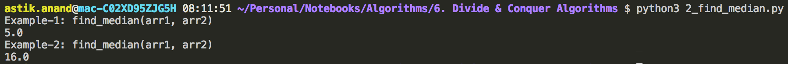
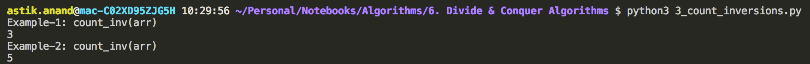

# Divide and Conquer Approach

Like Greedy and Dynamic Programming, Divide and Conquer is an algorithmic paradigm. 

A typical Divide and Conquer algorithm solves a problem using following three steps.

- ***Divide:*** Break the given problem into subproblems of same type.
- ***Conquer:*** Recursively solve these subproblems
- ***Combine:*** Appropriately combine the answers

#### Standard Divide and Conquer Algorithms

- **Binary Search:**
    - A searching algorithm.
    - In each step, the algorithm compares the input element x with the value of the middle element in array.
    - If the values match, return the index of middle.
    - Otherwise, if x is less than the middle element, then the algorithm recurs for left side of middle element, else recurse for right side of middle element.
- **Quicksort:**
    - A sorting algorithm.
    - The algorithm picks a pivot element, rearranges the array elements in such a way that all elements smaller than the picked pivot element move to left side of pivot, and all greater elements move to right side.
    - Finally, the algorithm recursively sorts the subarrays on left and right of pivot element.
- **Mergesort:**
    - Also a sorting algorithm.
    - The algorithm divides the array in two halves, recursively sorts them and finally merges the two sorted halves.
- **Closest Pair of Points:** 
    - The problem is to find the closest pair of points in a set of points in x-y plane.
    - Problem can be solved in O(n<sup>2</sup>) time by calculating distances of every pair of points & comparing the distances to find the minimum.
    - Divide and Conquer algorithm solves the problem in O(nLogn) time.
- **Strassen’s Algorithm:**
    - An efficient algorithm to multiply two matrices.
    - A simple method to multiply two matrices need 3 nested loops and is O(n<sup>3</sup>).
    - Strassen’s algorithm multiplies two matrices in O(n<sup>2.8974</sup>) time.
- **Cooley-Turkey Fast Fourier transform(FFT) Algorithm:**
    - The most common algorithm for FFT.
    - It is a divide and conquer algorithm which works in O(nlogn) time.
- **Kartsuba Algorithm for fast multiplication:**
    - It does multiplication of two *n*-digit numbers in at most **3n<sup>  log<sub>2</sub> <sup>3</sup> </sup>≈ 3n<sup>1.585</sup>** single-digit multiplications in general (and exactly **3n<sup>log<sub>2</sub> <sup>3</sup></sup>** when n is a power of 2.
    - If *n* = 2<sup>10</sup> = 1024, in particular, the exact counts are 3<sup>10</sup> = 59,049 and (2<sup>10</sup>)<sup>2</sup> = 1,048,576, respectively.

#### Divide and Conquer Vs. Dynamic Programming

- Both paradigms (D & C and DP) divide the given problem into subproblems and solve subproblems.
- **How to choose one of them for a given problem?**
    - ***Divide and Conquer should be used when same subproblems are not evaluated many times.***
    - ***Otherwise Dynamic Programming or Memoization should be used.***
    - For example: Binary Search is a Divide and Conquer algorithm, we never evaluate the same subproblems again.
    - On the other hand, for calculating nth Fibonacci number, Dynamic Programming should be preferred.


----

### Standard Divide and Conquer Problems

## 1. Calculate Power(x, n)

###### **Problem:**

Given two integers k and n, write a function to compute kn. We may assume that k and n are small and overflow doesn’t happen.

> **Examples:**
>
> Input: k = 2, n = 3      Output: 8
>
> Input: k = 7, n = 9      Output: 40353607 

###### **Approach:**

- Idea is to divide the problem into halves.  Like **k<sup>n</sup> = k<sup>n/2</sup>×k<sup>n/2</sup>**
- If n is odd: **k<sup>n</sup> = k×k<sup>n/2</sup>×k<sup>n/2</sup>**
- If n is even: **k<sup>n</sup> = k<sup>n/2</sup>×k<sup>n/2</sup>**

###### **Implementation:**

```python
def power(k, n):
    if(n==0):
        return 1
    
    temp = power(k, n//2)
    if(n%2==0):
        return temp*temp
    else:
        return k*temp*temp


print("Example-1: power(2, 3)")
print(power(2, 3))

print("Example-2: power(7, 9)")
print(power(7, 9))
```

**Output:**


###### **Complexity:**

- **Time:** **O(logn)** 
- **Auxilliary Space:** **O(1)**

<br>

<br>

## 2. Median of 2 Sorted Arrays of Same Size***

###### **Problem:**

There are 2 sorted arrays A and B of size n each.Write an algorithm to find the median of the array obtained after merging the above 2 arrays(i.e. array of length 2n).

The complexity should be O(log(n)).

> **Example:**
>
> Input:  arr1 = [1, 12, 15, 26, 38]     arr2 = [2, 13, 17, 30, 45] 
>
> Output: 16 
>
> 
>
> **Explanation:**
>
> After merging:  arr = [1, 2, 12, 13, 15, 17, 26, 30, 38, 45] 
>
> Middle 2 elements are 15 and 17 and hence (15+17)/2 = 16 

###### **Approach-1: Simple**

Count while merging and once count reaches n coz total 2n elements get the median.

**Time Complexity: O(n)**

###### **Approach-2: Divide and Conquer**

- Calculate the medians m1 and m2 of the input arrays arr1[ ]and arr2[ ] respectively.

- If m1 and m2 both are equal then we are done. return m1 (or m2)

- If m1 is greater than m2, then median is present in one of the below two subarrays.

    - a) From first element of arr1 to m1 (arr1[0...|_n/2_|])
    - b) From m2 to last element of arr2  (arr2[|_n/2_|...n-1])

- If m2 is greater than m1, then median is present in one of the below two subarrays.

    - a) From m1 to last element of arr1  (arr1[|_n/2_|...n-1])
    - b) From first element of arr2 to m2 (arr2[0...|_n/2_|])

- Repeat the above process until size of both the subarrays becomes 2.

- If size of the two arrays is 2 then use formula to get the median.

    > **Median = (max(arr1[0], arr2[0]) + min(arr1[1], arr2[1]))/2**

###### **Implementation:**

```python
def median(arr):
    n = len(arr)
    if(n%2==0):
        return (arr[(n//2)-1] + arr[n//2])/2
    else:
        return arr[n//2]


def find_median(arr1, arr2):
    n = len(arr1)

    if(n==0):
        return -1
    # 1 element in each: Median = (arr1[0] + arr2[0])/2
    elif(n==1):
        return (arr1[0] + arr2[0])/2
    # 2 elements in each: Median = (max(arr1[0], arr2[0]) + min(arr1[1], arr2[1]))/2
    elif(n==2):
        return (max(arr1[0], arr2[0]) + min(arr1[1], arr2[1]))/2
    else:
        # Median of the 2 arrays for comparison
        M1 = median(arr1)
        M2 = median(arr2)

        # We are done return median
        if(M1 == M2):
            return M1
        # As M1>M2 so, median should lie b/w arr1[.....M1] and arr2[M2......]
        elif(M1>M2):
            if(n%2==0):
                return find_median(arr1[:n//2], arr2[n//2:])
            else:
                return find_median(arr1[:n//2+1], arr2[n//2:])
        # M1<M2 so, median should lie b/w arr1[M1.....] and arr2[.....M2]
        else:
            if(n%2==0):
                return find_median(arr1[n//2:], arr2[:n//2])
            else:
                return find_median(arr1[n//2:], arr2[:n//2+1])


print("Example-1: find_median(arr1, arr2)")
arr1 = [1, 2, 3, 6] 
arr2 = [4, 6, 8, 10]
print(find_median(arr1, arr2))

print("Example-2: find_median(arr1, arr2)")
arr1 = [1, 12, 15, 26, 38]
arr2 = [2, 13, 17, 30, 45]
print(find_median(arr1, arr2))
```

**Output:**



###### **Complexity:**

- **Time:** **O(logn)** 
- **Auxilliary Space:** **O(1)**

<br>

<br>

## 3. Count Inversions in an Array***

###### What is inversion count?

Inversion Count for an array indicates – how far (or close) the array is from being sorted. 

If array is already sorted then inversion count is 0. If array is sorted in reverse order that inversion count is the maximum. 

Formally, if two elements a[i] and a[j] form an inversion if a[i] > a[j] and i < j. 

###### **Approach-1: Simple**

For each element just count the number of smaller elements than it and are present on right side

**Time Complexity: O(n<sup>2</sup>)**

###### **Approach-2: Divide and Conquer (Enhance Merge Sort Approach)**

Let the inversions count of **left half** of array be **INV<sub>1</sub>** and **right half** of the array **INV<sub>2</sub>**.

- What kinds of inversions are still missing for in **INV<sub>1</sub> + INV<sub>2</sub>** ? 
- The answer is – the inversions we have to count during the merge step **INV<sub>merge</sub>** .

> **Total inversions = INV<sub>1</sub> + INV<sub>2</sub> + INV<sub>merge</sub>**

###### **Implementation:**

```python
def count_inv(arr):
    n = len(arr)
    # Return back the array with inversion_count=0 if size is 0 or 1
    if(n==0 or n==1):
        return (0, arr)
    
    # Get the inversion_count of left subarray with merge_sort approach
    INV_1, sorted_arr_1 = count_inv(arr[:n//2])
    # Get the inversion_count of right subarray with merge_sort approach
    INV_2, sorted_arr_2 = count_inv(arr[n//2:])
    # Get the inversion_count for merging
    INV_MERGE, sorted_arr = count_inv_merge(sorted_arr_1, sorted_arr_2)

    return (INV_1+INV_2+INV_MERGE, sorted_arr)


def count_inv_merge(arr1, arr2):
    n1 = len(arr1)
    n2 = len(arr2)
    count = 0
    result = []
    i=0; j=0
    while(i<n1 and j<n2):
        if(arr1[i] <= arr2[j]):
            result.append(arr1[i])
            i+=1
        else:
            result.append(arr2[j])
            # Jab bhi right subarray(arr2) ka koi element pick hota hai that means
            # It is smaller than all the elements to the right of i till n1 of left subarray(arr1)
            # and wo in saare elements ke liye inversions dega. So  count += n1-i
            count+= n1-i
            j+=1
    
    if(i<n1):
        result += arr1[i:]
    
    if(j<n2):
        result += arr2[j:]

    return (count, result)


print("Example-1: count_inv(arr)" )
arr = [2, 4, 1, 3, 5]
print(count_inv(arr)[0])


print("Example-2: count_inv(arr)" )
arr = [1, 20, 6, 4, 5]
print(count_inv(arr)[0])
```

**Output:**



###### **Complexity:**

- **Time:** **O(nlogn)** 
- **Auxilliary Space:** **O(n)**

<br>

<br>


##### Problems To Do:

- Strassen's Matrix Multiplication


<br>

<br>

------

<a href="dynamic-programming-approach" class="prev-button">&larr; Previous: Dynamic Programming Approach</a>    

<a href="pattern-search-alogrithms" class="next-button">Next: Pattern Search Algorithms &rarr;</a>

