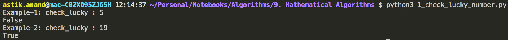
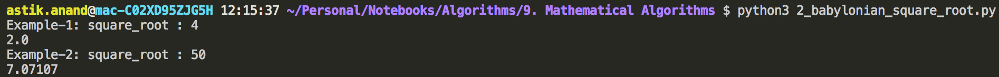
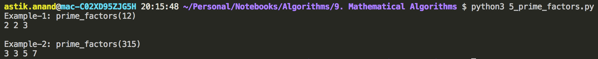
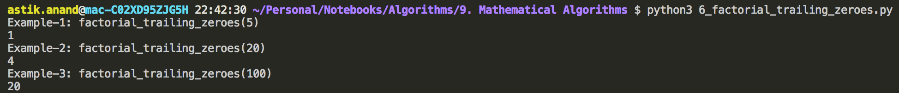
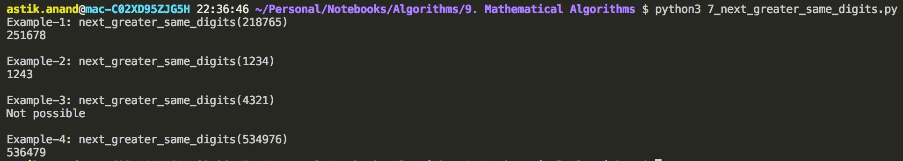
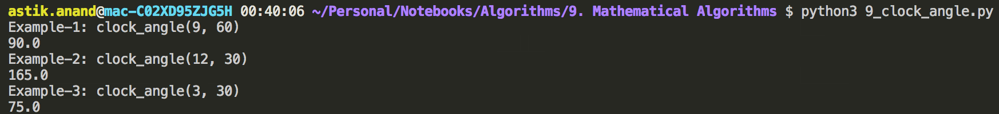
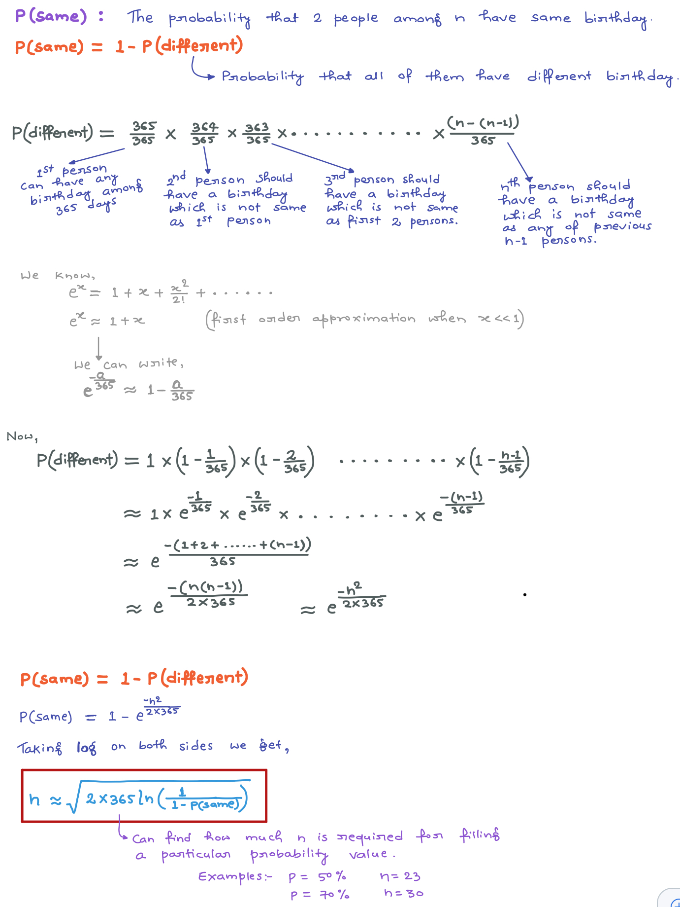
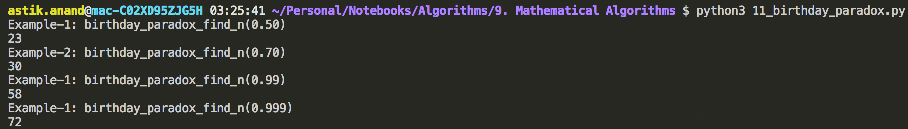

# Mathematical Algorithms

Algorithms deals with Mathematical calculations and its aspects.


### Standard Mathematical Algorithm Problems

## 1. Lucky Numbers***

###### **What are lucky numbers?**

> Take the set of integers 
>
> 1, 2, 3, 4, 5, 6, 7, 8, 9, 10, 11, 12, 14, 15, 16, 17, 18, 19,…… 
>
> 
>
> First, **delete every second number**, we get following reduced set. 
>
> 1, 3, 5, 7, 9, 11, 13, 15, 17, 19,………… 
>
> 
>
> Now, **delete every third number**, we get 
>
> 1, 3, 7, 9, 13, 15, 19,….…. 
>
> 
>
> Continue this process indefinitely…… 
>
> **Any number that does NOT get deleted due to above process is called “lucky”.** 
>
> 
>
> Therefore, **set of lucky numbers is 1, 3, 7, 13,………** 

###### **Problem:**

Given a number check if it is lucky or not.

###### **Algorithm:**

- Before every iteration, if we calculate position of the given no, then in a given iteration, we can determine if the no will be deleted.
- Suppose calculated position for the given no. is p before some iteration, and each ith number is going to be removed in this iteration, 
    - if p < i then input number is lucky,
    - if p is such that p%i == 0 (i is a divisor of p), then input number is not lucky.

###### **Implementation:**

```python
def check_lucky(n, k):
    # n is current_position of number
    # k represents at this iteration kth numbers will be deleted, at start k = 2

    if(n%k == 0):
        return False
    
    if(k > n):
        return True
    
    # Calculate new_position after deleting kth number, increase k
    n = n - int(n/k)
    k += 1

    return check_lucky(n, k)


print("Example-1: check_lucky : 5")
print(check_lucky(5, 2))

print("Example-2: check_lucky : 19")
print(check_lucky(19, 2))
```

**Output:**



###### Complexity:

- **Time: O(loglogn)**


## 2. Square Root - Babylonian Method***

###### **Problem:**

Find approximate square root of a number.

###### **Algorithm:**

1. Start with an arbitrary positive start value x (the closer to the root, the better).
2. Initialize y = 1.
3. Do following until desired approximation is achieved.
    - a) Get the next approximation for root using average of x and y
    - b) Set y = n/x

###### **Implementation:**

```python
def square_root(n):
    # Here using n itself as initial approximation but this can definitely be improved
    x = n
    y = 1

    # a decides the accuracy level 
    a = 0.000001

    while(x - y > a): 
        x = (x + y)/2
        y = n / x 
      
    return x


print("Example-1: square_root : 4")
print(round(square_root(4), 5))

print("Example-2: square_root : 50")
print(round(square_root(50), 5))
```

**Output:**



###### Complexity:

- **Time: **


## 3. Sieve of Eratosthenes

The sieve of Eratosthenes is one of the most efficient ways to find all primes smaller than n when n is smaller than 10 million or so.

###### **Problem:**

Given a number n, print all primes smaller than or equal to n. It is also given that n is a small number.

> **Example:**
>
> Input : n = 10 
>
> Output : 2 3 5 7 
>
> 
>
> Input : n = 20 
>
> Output: 2 3 5 7 11 13 17 19 

###### **Algorithm:**

1. Create a list of consecutive integers from 2 to n: (2, 3, 4, …, n).
2. Initially, let p=2, the first prime number.
3. Starting from p2, count up in increments of p and mark each of these numbers greater than or equal to p2 itself in the list. These numbers will be p(p+1), p(p+2), p(p+3), etc.. 
4. Find the first number greater than p in the list that is not marked.
    - If there was no such number, stop.
    - Otherwise, let p now equal this number (which is the next prime), and repeat from step 3.

###### **Implementation:**

```python
def sieve_of_eratosthenes(n):
    primes = [True]*(n+1)
    p = 2

    # Initialize all to be True, a value in prime[i] will finally be False if i is Not a prime, else True.
    while(p*p <= n):
        # If prime[p] is still True, then it is a prime 
        if(primes[p] == True):
            # Update all multiples of p staring from p*p, then p*(p+1), p*(p+2) and so on
            for i in range(p*p, n+1, p):
                primes[i] = False
        
        p += 1
    
    # Print all primes
    for i in range(2, n+1):
        if(primes[i]):
            print(i, end=" ")
    print()


print("Example-1: sieve_of_eratosthenes : 30")
sieve_of_eratosthenes(30)

print("\nExample-2: sieve_of_eratosthenes : 101")
sieve_of_eratosthenes(101)
```

**Output:**


###### Complexity:

- **Time: **


## 4. Next Smallest Palindrome***

###### **Problem:**

Given a number, find the next smallest palindrome larger than this number.

> **Examples:**
>
> Input: 999    Output: 1001 
>
> Input: 1234   Output: 1331 
>
> Input: 1213   Output: 1221 
>
> Input: 1221   Output: 1331 
>
> Input: 23921  Output: 23932 
>
> Input: 23941  Output: 24042 

###### **Implementation:**

```python
import math


def reverse(string):
    return string[::-1]


def all_9s(n):
    for digit in n:
        if(digit != "9"):
            return False
    return True


def next_smallest_palindrome(n):
    n = str(n)
    k = len(n)
    # If all digits are 9s then put 1(k-1 zeroes)1
    if(all_9s(n)):
        return "1"+str("0"*(k-1))+"1"
    
    # Get the left half
    left_half = n[:(int(math.ceil(k/2)))]
    # If the number of digits are even
    if(k%2==0):
        # Check if created palindrome i.e. pal = left_half + reverse(left_half) 
        # is lesser or equal to given number
        # If it is lesser or equal increment left_half by 1.
        if(left_half + reverse(left_half) <= n):
            left_half = str(int(left_half)+1)
        
        pal = left_half + reverse(left_half)
    # If number of digits are odd
    else:
        if(left_half + reverse(left_half[:-1]) <= n):
            left_half = str(int(left_half)+1)
        
        pal = left_half + reverse(left_half[:-1])

    return pal


print("Example-1: next_smallest_palindrome(999)")
print(next_smallest_palindrome(999))

print("Example-2: next_smallest_palindrome(1234)")
print(next_smallest_palindrome(1234))

print("Example-3: next_smallest_palindrome(1213)")
print(next_smallest_palindrome(1213))

print("Example-4: next_smallest_palindrome(1221)")
print(next_smallest_palindrome(1221))

print("Example-5: next_smallest_palindrome(23921)")
print(next_smallest_palindrome(23921))

print("Example-6: next_smallest_palindrome(23941)")
print(next_smallest_palindrome(23941))
```

**Output:**


###### Complexity:

- **Time: O(n) **


## 5. Prime Factors

###### **Problem:**

Given a number n, write an efficient function to print all prime factors of n. 

> **Examples:**
>
> Input: 12   Output: 2, 2, 3 
>
> Input: 315  Output: 3, 3, 5, 7 

###### **Algorithm:**

1. While n is divisible by 2, print 2 and divide n by 2.
2. After step 1, n must be odd. Now start a loop from i = 3 to square root of n. While i divides n, print i and divide n by i, increment i by 2 and continue.
3. If n is a prime number and is greater than 2, then n will not become 1 by above two steps. So print n if it is greater than 2.

###### **Implementation**

```python
import math

def prime_factors(n):
    # Check 2 as prime factors
    while(n%2 == 0):
        print(2, end=" ")
        n = int(n/2)
    
    # Check 3, 5, 7, 11, ... and so on as prime factors
    for i in range(3, int(math.sqrt(n))+1, 2):
        while(n%i==0):
            print(i, end=" ")
            n = int(n/i)
    

    # If n is a prime greater than 2
    if(n > 2):
        print(n)
    
    print()


print("Example-1: prime_factors(12)")
prime_factors(12)

print("Example-2: prime_factors(315)")
prime_factors(315)
```

**Output:**



###### Complexity:

- **Time: O(n) **


## 6. Trailing Zeroes in Factorial

###### **Problem:**

Given an integer n, write a function that returns count of trailing zeroes in n!.

> **Examples:**
>
> Input: 5  &nbsp; Output: 1   &nbsp; coz 5! = 120   &nbsp; 1 trailing zero 
>
> Input: 20  &nbsp;  &nbsp;  Output: 4 &nbsp;   coz 20! = 2432902008176640000  &nbsp;    4 trailing zeroes 
>
> Input: 100  &nbsp;  Output: 24 

###### **Approach:**

> **Trailing 0s in n!  =** Count of 5s in prime factors of n! = floor(n/5) + floor(n/25) + floor(n/125) + ....

###### **Implementation:**

```python
def factorial_trailing_zeroes(n):
    count = 0
    k = 5
    while(n > 0):
        n = int(n/k)
        count += n
        k = k*k
    
    print(count)


print("Example-1: factorial_trailing_zeroes(5)")
factorial_trailing_zeroes(5)

print("Example-2: factorial_trailing_zeroes(20)")
factorial_trailing_zeroes(20)

print("Example-3: factorial_trailing_zeroes(100)")
factorial_trailing_zeroes(100)
```

**Output:**



###### Complexity:

- **Time: O(loglogn) **


## 7. Next Greater with Same Digits***

###### **Problem:**

Given a number n, find the smallest number that has same set of digits as n and is greater than n. 

If n is the greatest possible number with its set of digits, then print "not possible".

> **Examples:**
>
> Input: 218765   Output: 251678 
>
> Input: 1234     Output: 1243 
>
> Input: 4321     Output: “Not Possible” 
>
> Input: 534976   Output: 536479 

###### **Algorithm:**

- Traverse the given number from rightmost digit, keep traversing till you find a digit which is smaller than the previously traversed digit.
    - **Example:** if the input number is “534976”, we stop at **4** because 4 is smaller than next digit 9. 
    - If we do not find such a digit, then output is “Not Possible”.
- Now search the right side of above found digit ‘d’ for the smallest digit greater than ‘d’.
    - **Example:** In “53**4**976″, the right side of 4 contains “976”. The smallest digit greater than 4 is **6**. 
- Swap the above found two digits, we get 53**6**97**4** in above example. 
- Now sort all digits from position next to ‘d’ to the end of number. The number that we get after sorting is the output.
    - **Example:** In above, we sort digits in bold 536**974**. We get “536**479**” which is the next greater number for input 534976. 

###### **Implementation:**

```python
def next_greater_same_digits(n):
    n = list(str(n))
    k = len(n)

    # Finding a  digit which is smaller than the previously traversed digit
    for i in range(k-1, -1, -1):
        if(n[i-1] < n[i]):
            break
    
    if(i==0):
        return "Not possible"
    
    # Find the smallest digit on the right side of (i-1)'th digit that is greater than x 
    x = n[i-1]
    smallest = i
    for j in range(i+1, k):
        if(n[j] < n[smallest] and  n[j] > x):
            smallest = j
    
    # Swapping the above found smallest digit with (i-1)'th
    n[i-1], n[smallest] = n[smallest], n[i-1]

    # Sort all the digits from ith digit and concatenate it with left_part
    result_num = n[:i] + sorted(n[i:])

    # Join all the array element to create a number
    result_num = "".join(result_num)

    return result_num

    

print("Example-1: next_greater_same_digits(218765)")
print(next_greater_same_digits(218765))

print("\nExample-2: next_greater_same_digits(1234)")
print(next_greater_same_digits(1234))

print("\nExample-3: next_greater_same_digits(4321)")
print(next_greater_same_digits(4321))

print("\nExample-4: next_greater_same_digits(534976)")
print(next_greater_same_digits(534976))
```

**Output:**



###### Complexity:

- **Time: O(size)**


## 8. Possible Decodings of Digit Sequence***

###### Problem:

Let 1 represent ‘A’, 2 represents ‘B’, . . . 26 represents ‘Z' etc. 

Given a digit sequence, count the number of possible decodings of the given digit sequence.

> **Examples:**
>
> Input: 121  &nbsp;  Output: 3     &nbsp; coz Possible Decodings are: "ABA", "AU", “LA" 
>
> Input: 1234  &nbsp; Output: 3     &nbsp; coz Possible Decodings are: "ABCD", "LCD", "AWD" 

#### Recursive Approach

- This problem is recursive and can be broken in sub-problems.
- Start from end of the given digit sequence.
- Initialize the total count of decodings as 0.
- Recur for two subproblems.
    1. If the last digit is non-zero, recur for remaining (n-1) digits and add the result to total count.
    2. If the last two digits form a valid character (or smaller than 27), recur for remaining (n-2) digits and add the result to total count.

###### **Implementation:**

```python
def count_digits_sequence_decodings(digits):
    n = len(digits)

    # base cases 
    if(n==0 or n==1):
        return 1
    
    count = 0

    # If the last digit is not 0, then last digit must add to the number of words.
    if(digits[-1]>'0'):
        count = count_digits_sequence_decodings(digits[:-1])
    
    # If the last two digits form a number smaller than or equal to 26, then consider last two digits and recur
    if(digits[-2]=='1' or (digits[-2]=='2' and digits[-1]<='6')):
        count += count_digits_sequence_decodings(digits[:-2])
    
    return count


print("Recursive Approach")
print("Example-1: count_digits_sequence_decodings('12')")
print(count_digits_sequence_decodings('12'))

print("Example-1: count_digits_sequence_decodings('121')")
print(count_digits_sequence_decodings('121'))

print("Example-3: count_digits_sequence_decodings('1234')")
print(count_digits_sequence_decodings('1234'))
```

**Output:**


###### Complexity:

- **Time: Exponential**

#### Dynamic Programming Approach

- If we take a closer look at the above program, we can observe that the recursive solution is similar to Fibonacci Numbers.
- Therefore, we can optimize the above solution to work in **O(n)** time using Dynamic Programming. 

###### **DP Implementation**

```python
def count_digits_sequence_decodings_DP(digits):
    n = len(digits)
    count = [0]*(n+1) # A table to store results of subproblems 

    # Base cases 
    count[0] = 1;  count[1] = 1  
  
    for i in range(2, n+1):  
        count[i] = 0
  
        # If the last digit is not 0, then last digit must add to the number of words  
        if (digits[i-1] > '0'):  
            count[i] = count[i-1] 

        # If the last two digits form a number smaller than or equal to 26, 
        # then last two digits form a valid character  
        if (digits[i-2]=='1' or (digits[i-2]=='2' and digits[i-1]<='6') ):  
            count[i] += count[i-2] 
  
    return count[n]


print("\nDP Approach")
print("Example-1: count_digits_sequence_decodings_DP('12')")
print(count_digits_sequence_decodings_DP('12'))

print("Example-1: count_digits_sequence_decodings_DP('121')")
print(count_digits_sequence_decodings_DP('121'))

print("Example-3: count_digits_sequence_decodings_DP('1234')")
print(count_digits_sequence_decodings_DP('1234'))

print("Example-3: count_digits_sequence_decodings_DP('1234121')")
print(count_digits_sequence_decodings_DP('1234121'))
```

**Output:**


###### Complexity:

- **Time: O(n)**


## 9. Clock Angle Problem***

###### **Problem:**

Find angle between hands of an analog clock at a given time.

> **Examples:**
>
> Input:  h = 9:00,  m = 60.00   Output: 90 degree 
>
> Input:  h = 12:00, m = 30.00   Output: 165 degree 
>
> Input:  h = 3.00,  m = 30.00   Output: 75 degree 

###### **Approach:**

The idea is to take 12:00 (h = 12, m = 0) as a reference. Then

1. Calculate the angle made by hour hand with respect to 12:00 in h hours and m minutes.
2. Calculate the angle made by minute hand with respect to 12:00 in h hours and m minutes.
3. The difference between two angles is the angle between two hands.

###### **Calculation:**

- **Hour Hand:** 
    - In 12 hours 360º, then 1hour = 30º
    - In 720 minutes 360º, then 1min = 0.5º
    - **Angle travelled by Hour Hand = (h\*30) + (m\*0.5)**
- **Minute Hand:**
    - In 60 min 360º, then 1min = 6º
    - **Angle travelled by Minute Hand = (m\*6)**

###### **Implementation:**

```python
def clock_angle(hours, minutes):
    h = hours%12
    m = minutes%60

    hour_hand_angle = h*30 + m*0.5
    minute_hand_angle = m*6

    angle = abs(hour_hand_angle-minute_hand_angle)

    return min(angle, 360-angle)


print("Example-1: clock_angle(9, 60)")
print(clock_angle(9, 60))

print("Example-2: clock_angle(12, 30)")
print(clock_angle(12, 30))

print("Example-3: clock_angle(3, 30)")
print(clock_angle(3, 30))
```

**Output:**



###### Complexity:

- **Time: O(1)**


## 10. Smallest number whose digit multiply to give number N

###### **Problem:**

Given a number ‘n’, find the smallest number ‘p’ such that if we multiply all digits of ‘p’, we get ‘n’.

The result ‘p’ should have minimum two digits.

> **Examples:**
>
> Input:  n = 36      Output: p = 49        // Note that 4*9 = 36 and 49 is the smallest such number 
>
> Input:  n = 100     Output: p = 455       // Note that 4*5*5 = 100 and 455 is the smallest such number 
>
> Input:  n = 7       Output: p = 17        // Note that 1*7 = 7 
>
> Input:  n = 13      Output: Not Possible 

###### **Approach:**

- **Case 1: n < 10** 
    - When n is smaller than n, the output is always n+10.
    - Example: n = 7, output is 17. For n = 9, output is 19.
- **Case 2: n >= 10** 
    - Find all factors of n which are between 2 and 9 (both inclusive).
    - The idea is to start searching from 9 so that the number of digits in result are minimized.
    - Example: 9 is preferred over 33 and 8 is preferred over 24.
    - Store all found factors in an array, the array would contain digits in non-increasing order, so finally print the array in reverse order.

###### **Implementation:**

```python
def smallest_num_digit_multiply_to_n(n):
    if(n<10):
        return 10+n
    
    # p is to store the digits
    p = ""
    for i in range(9, 1, -1):
        while(n%i==0):
            p += str(i)
            n = int(n/i)
    
    # If n is still grteater than 10
    if(n>10):
        return "Not Possible"
    
    # Reverse the p now.
    p = p[::-1]

    return p
            


print("Example-1: smallest_num_digit_multiply_to_n(36)")
print(smallest_num_digit_multiply_to_n(36))

print("Example-2: smallest_num_digit_multiply_to_n(100)")
print(smallest_num_digit_multiply_to_n(100))

print("Example-3: smallest_num_digit_multiply_to_n(7)")
print(smallest_num_digit_multiply_to_n(7))

print("Example-3: smallest_num_digit_multiply_to_n(13)")
print(smallest_num_digit_multiply_to_n(13))
```

**Output:**


###### Complexity:

- **Time: O(1)**


## 11. Birthday Paradox***

###### Q1. How many people must be there in a room to make the probability 100% that at-least two people in the room have same birthday?

**Answer:** **367** (since there are 366 possible birthdays, including February 29). 

The above question was simple, let us see the below question.

###### Q2. How many people must be there in a room to make the probability 50% that at-least two people in the room have same birthday?

**Answer: 23**

The number is surprisingly very low. In fact, we need only 70 people to make the probability 99.9 %.

#### Generalized Formula

**What is the probability that two persons among n have same birthday?**



###### **Implementation:**

```python
import math

def birthday_paradox_find_n(probability):
    print (math.ceil(math.sqrt(2*365*(math.log(1/(1-probability))))))


print ("Example-1: birthday_paradox_find_n(0.50)")
birthday_paradox_find_n(0.50)

print ("Example-2: birthday_paradox_find_n(0.70)")
birthday_paradox_find_n(0.70)

print ("Example-1: birthday_paradox_find_n(0.99)")
birthday_paradox_find_n(0.99)

print ("Example-1: birthday_paradox_find_n(0.999)")
birthday_paradox_find_n(0.999)
```

**Output:**



###### Complexity:

- **Time: O(1)**


------

<a href="8_bit_algorithms" class="prev-button">&larr; Previous: Bit Algorithms</a>       <a href="10_geometric_algorithms" class="next-button">Next: Geometric Algorithms &rarr;</a>

