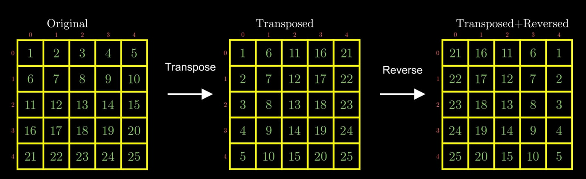
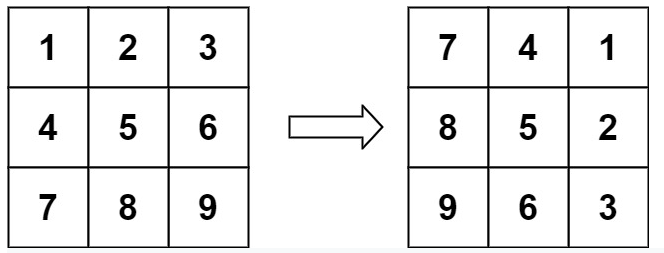

# Mathematical Concepts Pattern

###### Introduction:

- This pattern deals with the problems solved using the mathematical concepts.

<br>

> ### Concept: Matrix Rotation
>
> ###### Steps to Rotate:
>
> **Step-1:** Take the transpose of the matrix.
>
> **Step-2:** Perform **Vertical Flipping** for clockwise rotation and **Horizontal Flipping** for anticlockwise rotation.
>
> ##### Matrix Transpose:
>
> - To transpose a matrix simply swap the element at Matrix\[row][col] with Matrix\[col][row].
>
> ```python
> for row in range(n):
>     for col in range(row + 1, n):
>         matrix[row][col], matrix[col][row] = matrix[col][row], matrix[row][col]
> ```
>
> ##### Flip (Reverse) Matrix
>
> [`Vertical Flipping`]()
>
> - Vertical Flipping (Reversing) means flipping alongside vertical axis or columns.
> - That means changing first col to last col, 2nd col to 2nd last col and so on.....
>
> ```python
> for row in range(n):
>     for col in range(n // 2):
>         matrix[row][col], matrix[row][n - col - 1] = matrix[row][n - col - 1], matrix[row][col]
> ```
>
> <br>
>
> [`Horizontal Flipping`]()
>
> - Horizontal Flipping (Reversing) means flipping alongside horizontal axis or columns.
> - That means changing first row to last row, 2nd row to 2nd last row and so on.....
>
> ```python
> for row in range(n // 2):
>     for col in range(n):
>         matrix[row][col], matrix[n - row - 1][col] = matrix[n - row - 1][col], matrix[row][col]
> ```
>
>
> **Example:**
>
> 
>
> 

<br>

## 1. Rotate Matrix

###### Problem Statement:

You are given an *n* x *n* 2D `matrix` representing an image, rotate the image by 90 degrees (clockwise).

You have to rotate the image in-place, which means you have to modify the input 2D matrix directly. 

**DO NOT** allocate another 2D matrix and do the rotation.

```
======= Examples ======
Input: matrix = [[1,2,3],[4,5,6],[7,8,9]]
Output: [[7,4,1],[8,5,2],[9,6,3]]

Input: matrix = [[5,1,9,11],[2,4,8,10],[13,3,6,7],[15,14,12,16]]
Output: [[15,13,2,5],[14,3,4,1],[12,6,8,9],[16,7,10,11]]

Input: matrix = [[1]]
Output: [[1]]
```



**Constraints:**

- `matrix.length == n`
- `matrix[i].length == n`
- `1 <= n <= 20`
- `-1000 <= matrix[i][j] <= 1000`

<br>

###### Problem Stats:

- **Difficulty: Medium**
- **Category:** Leetcode - 48
- **Companies:** Amazon

<br>

###### Approach:

- Take the transpose of the matrix and do the vertical flipping.

<br>

###### Implementation:

**Code:**

```python
from typing import List


class Solution:
    def rotate(self, matrix: List[List[int]]) -> None:
        n = len(matrix)

        # To Rotate the matrix, first take the transpose of the matrix
        for row in range(n):
            for col in range(row + 1, n):
                matrix[row][col], matrix[col][row] = matrix[col][row], matrix[row][col]

        # To rotate 90˚ clockwise, swap 1st and last, 2nd and 2nd last columns and so on
        # To rotate 90˚ anticlockwise, swap 1st and last, 2nd and 2nd last rows and so on
        for row in range(n):
            for col in range(n // 2):
                matrix[row][col], matrix[row][n - col - 1] = matrix[row][n - col - 1], matrix[row][col]


matrix = [[1, 2, 3],
          [4, 5, 6],
          [7, 8, 9]]
Solution().rotate(matrix)
print(matrix)

matrix = [[1, 2, 3, 4],
          [5, 6, 7, 8],
          [9, 10, 11, 12],
          [13, 14, 15, 16]]
Solution().rotate(matrix)
print(matrix)

matrix = [[1]]
Solution().rotate(matrix)
print(matrix)

matrix = [[1, 2],
          [3, 4]]
Solution().rotate(matrix)
print(matrix)
```

**Output:**

```
[[7, 4, 1], [8, 5, 2], [9, 6, 3]]
[[13, 9, 5, 1], [14, 10, 6, 2], [15, 11, 7, 3], [16, 12, 8, 4]]
[[1]]
[[3, 1], [4, 2]]
```

**Complexity:**

- ***Time: O(N<sup>2</sup>)*** - Need to process all N<sup>2</sup> elements in matrix.
- ***Space: O(1)***

<br>

<br>


> ### Concept: Reservoir Sampling
>
> - In order to do random sampling over a population of ***unknown size*** with ***constant space***, the answer is [reservoir sampling](https://en.wikipedia.org/wiki/Reservoir_sampling).
> - The reservoir sampling is a ***family*** of algorithms which includes several variants over the time.
>   - Algorithm R
>   - Algorithm L
>   - Algorithm with Random Sort
>
> ##### Algorithm R - By Alan Waterman
>
> - It is a simplest algorithm for Reservoir Sampling albeit slow one.
> - If you see the below algorithm, we have not stored the entire elements in memory.
> - And neither we have tried to know what is its total size in advance.
> - The memory used to store reservoir is a constant space.
>
> ```python
> import random
> 
> def ReservoirSample(space, k):
>     # Create and fill the Reservoir of size k
>     reservoir = []
>     for i in range(k):
>         reservoir.append(space[i])
> 
>     # Now process all the elements one by one after the kth element
>     # And replace the elements in Reservoir with gradually decreasing probability of being replaced
>     i = k
>     while True:
>         try:
>             current = space[i]  # To check if we still have elements left
>             rand_index = random.randint(0, i)  # generates random number b/w 0 to i both inclusive
>             # As we go further and further rand_index will have lesser and leserr probability of beign < k
>             # Hence probability of being replaced decreases gradually
>             if (rand_index < k):
>                 reservoir[rand_index] = current
>         except Exception:
>             # We have finished with all the elements of the given space
>             break
> 
>         i += 1
> 
>     return reservoir
> 
> 
> print(ReservoirSample([1, 2, 3], 1)) # Returns 1 random element from the space
> print(ReservoirSample([1, 2, 3, 4, 5, 6, 7, 8, 9, 10, 11, 12, 13], 3)) # Returns 3 random elements
> ```
>
> <br>
> [`Main Idea of the Algorithm:`]()
>
> - Initially, we fill up an array of reservoir `R[]` with the heading elements from the pool of samples `S[]`. 
> - We then iterate through the rest of elements in the pool. For each element, we need to *decide* if we want to include it in the reservoir or not. If so, we will replace an existing element in reservoir with the current element.
> - At the end of the algorithm, the reservoir will contain the final elements we sample from the pool.
>
> <br>
>
> [`Ensuring equal probability of being chosen for every element:`]()
>
> - Algorithm guarantees that at any moment, for each element scanned so far, it has an equal chance to be selected into the  reservoir.
> - Here is the prroof:
>   - Suppose that we have an element at the index of `i` (and `i > k`), when we reach the element, the chance that it will be selected into the reservoir would be `k/i`, as we can see from the algorithm.
>   - Later on, there is a chance that any chosen element in the reservoir might be **replaced** with the subsequent element. More specifically, when we reach the element `j` (`j > i`), there would be a chance of `1/j` for any specific element in the reservoir to be replaced. Because for any specific position in the reservoir, there is `1/j` chance that it might be chosen by the random number generator. On the other hand, there would be `(j-1)/j` probability for any specific element in the reservoir to stay in the reservoir at that particular moment of sampling.
>   - Finally, in order for any element in the pool to be chosen in the final reservoir, a series of **independent events** need to happen: 
>     - Firstly, the element needs to be chosen in the reservoir when we reach the element.
>     - Secondly, in the following sampling, the element should remain in the reservoir, *i.e.* not to be replaced.
>   - Therefore, for a sequence of length `n`, the chance that any element ends up in the final reservoir could be represented in the following formula: `k/i * i/(i+1) * (i+1)/(i+2).....(n-1)/n = k/n`

<br>

<br>

## 2. Linked List Random Node

###### Problem Statement:

Given a singly linked list, return a random node's value from the linked list. Each node must have the **same probability** of being chosen.

**Follow up:**
What if the linked list is extremely large and its length is unknown to  you? Could you solve this efficiently without using extra space?

```
======= Examples ======
// Init a singly linked list [1,2,3].
ListNode head = new ListNode(1);
head.next = new ListNode(2);
head.next.next = new ListNode(3);
Solution solution = new Solution(head);

// getRandom() should return either 1, 2, or 3 randomly. Each element should have equal probability
solution.getRandom();
```

<br>

###### Problem Stats:

- **Difficulty: Medium**
- **Category:** Leetcode - 382
- **Companies:** Facebook

<br>

###### Approach:

- In the `getRandom()` function, we can do a reservoir  sampling starting from the head of the linked list.
- More specifically, we scan the element one by one and decide whether we  should put it into the reservoir (here size k = 1).

<br>

###### Implementation:

**Code:**

```python
import random


class ListNode:
    def __init__(self, val=0, next=None):
        self.val = val
        self.next = next


class Solution:
    def __init__(self, head: ListNode):
        self.head = head

    def getRandom(self) -> int:
        temp = self.head
        # # Create and fill the Reservoir of size k, here k = 1
        k = 1
        reservoir = temp.val
        temp = temp.next

        i = k  # Now process all the elements one by one after the kth element
        while (temp):
            rand_index = random.randint(0, i)
            if (rand_index < k):
                reservoir = temp.val
            temp = temp.next
            i += 1

        return reservoir


head = ListNode(1)
head.next = ListNode(2)
head.next.next = ListNode(3)
solution = Solution(head)
print(solution.getRandom())
```

**Output:**

```
2  # Prints Randomly everytime
```

**Complexity:**

- ***Time: O(N)*** - Get random takes O(N) time to process the linked list.
- ***Space: O(1)***

