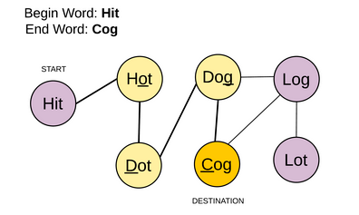
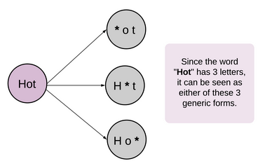

# Breadth First Search Pattern

###### Intorduction

- This pattern is based on the **Breadth First Search (BFS)** technique.
- Any problem involving the traversal of a tree in level-by-level order can be efficiently solved using this approach.
- We can use Queue/Deque to keep track of all the nodes of a level before jumping to next level which make space complexity as O(w).

<br>

### Problems Following BFS Pattern

## 1. Number of Islands

###### Problem Statement:

Given an m x n 2d grid map of '1's (land) and '0's (water), return the number of islands.

An island is surrounded by water and is formed by connecting adjacent lands horizontally or vertically. 

Assume all four edges of the grid are all surrounded by water.

```
====== Examples ======
Input: grid = [
  ["1","1","1","1","0"],
  ["1","1","0","1","0"],
  ["1","1","0","0","0"],
  ["0","0","0","0","0"]
]
Output: 1

Input: grid = [
  ["1","1","0","0","0"],
  ["1","1","0","0","0"],
  ["0","0","1","0","0"],
  ["0","0","0","1","1"]
]
Output: 3
```

<br>

###### Approach

- Simply do the BFS on the matrix considering 4 traversal directions as 4 neighbours.
- The as many calls to BFS made before every land is visited will give the count of islands.

<br>

###### Implementation:

**Code:**

```python
from typing import List
from collections import deque


class Solution:
    DIRECTIONS = [(0, 1), (1, 0), (0, -1), (-1, 0)]

    def numIslands(self, grid: List[List[str]]) -> int:
        islands = 0
        for i in range(len(grid)):
            for j in range(len(grid[0])):
                if (grid[i][j] == "1"):
                    islands += 1
                    self.bfs(grid, i, j)

        return islands

    def is_safe(self, x, y, m, n):
        return x >= 0 and y >= 0 and x < m and y < n

    def bfs(self, grid, i, j):
        m, n = len(grid), len(grid[0])
        queue = deque()
        queue.append((i, j))
        grid[i][j] = "#"

        while (queue):
            x, y = queue.popleft()
            # Traverse in 4 directions enqueue and mark visited
            for dx, dy in self.DIRECTIONS:
                if (self.is_safe(x + dx, y + dy, m, n) and grid[x + dx][y + dy] == "1"):
                    queue.append((x + dx, y + dy))
                    grid[x + dx][y + dy] = "#"  # marked visited


grid = [["1", "1", "1", "1", "0"],
        ["1", "1", "0", "1", "0"],
        ["1", "1", "0", "0", "0"],
        ["0", "0", "0", "0", "0"]]
print(Solution().numIslands(grid))

grid = [
    ["1", "1", "0", "0", "0"],
    ["1", "1", "0", "0", "0"],
    ["0", "0", "1", "0", "0"],
    ["0", "0", "0", "1", "1"]
]
print(Solution().numIslands(grid))
```

**Output:**

```
1
3
```

**Complexity:**

- ***Time: O(M\*N)*** - We are visiting every element once during bfs and also during iteration.
- ***Space: O(min(M,N))*** because in worst case where the grid is filled with lands, the size of queue can grow up to min(M,N).

<br>

<br>

## 2. All Nodes at K distance

###### Problem Statement:

Given a binary tree with root node, a target node and an integer value K.

Return a list of the values of all nodes that have a distance K from the target node. The answer can be returned in any order.

```
===== Example =====
Input: root = [3,5,1,6,2,0,8,null,null,7,4], target = 5, K = 2
Output: [7,4,1]

Explanation: 
The nodes that are a distance 2 from the target node (with value 5)
have values 7, 4, and 1.
```


<br>

###### Approach:

- If we know the parent of every node x, we know all nodes that are distance 1 from x.
- We can then perform a breadth first search from the target node to find the answer.
- We first do a depth first search where we collect information about every node's parent.
- After, we do a breadth first search to find all nodes a distance K from the target.

<br>

###### Implementation:

**Code:**

```python
from typing import List
from collections import deque


class TreeNode:
    def __init__(self, x):
        self.val = x
        self.left = None
        self.right = None


class Solution:
    def distanceK(self, root: TreeNode, target: TreeNode, K: int) -> List[int]:
        parents = {root: None}
        self.dfs(root, parents)
        return self.bfs(target, K, parents)

    def dfs(self, node, parents):
        if (node):
            if(node.left):
                parents[node.left] = node
                self.dfs(node.left, parents)

            if(node.right):
                parents[node.right] = node
                self.dfs(node.right, parents)

    def bfs(self, target, K, parents):
        visited = set()
        queue = deque()
        queue.append(target)
        visited.add(target)

        while (queue):
            n = len(queue)
            for _ in range(n):
                if (K == 0):
                    return [node.val for node in queue]

                current = queue.popleft()
                if (current.left and current.left not in visited):
                    visited.add(current.left)
                    queue.append(current.left)

                if (current.right and current.right not in visited):
                    visited.add(current.right)
                    queue.append(current.right)

                if (parents[current] and parents[current] not in visited):
                    visited.add(parents[current])
                    queue.append(parents[current])
            K -= 1

        return []


root = TreeNode(3)
root.left = TreeNode(5)
root.right = TreeNode(1)
root.left.left = TreeNode(6)
root.left.right = TreeNode(2)
root.right.left = TreeNode(0)
root.right.right = TreeNode(8)
root.left.right.left = TreeNode(7)
root.left.right.right = TreeNode(4)

s = Solution()
print(s.distanceK(root, root.left, 2))


root = TreeNode(0)
root.left = TreeNode(1)
root.left.left = TreeNode(3)
root.left.right = TreeNode(2)

s = Solution()
print(s.distanceK(root, root.left.right, 1))


root = TreeNode(0)
root.left = TreeNode(2)
root.right = TreeNode(1)
root.right.right = TreeNode(3)

s = Solution()
print(s.distanceK(root, root.right.right, 3))
print(s.distanceK(root, root.right.right, 4))
```

**Output:**

```
[7, 4, 1]
[1]
[2]
[]
```

**Complexity:**

- ***Time: O(N)*** - We are visiting every node once during bfs and also during dfs. 2n ≈ O(N)
- ***Space: O(N)*** - We need to store parent of every node

<br>

<br>

## 3. Word Ladder

###### Problem Statement:

Given two words (beginWord and endWord), and a dictionary's word list, find the length of shortest transformation sequence from beginWord to endWord, such that:

- Only one letter can be changed at a time.
- Each transformed word must exist in the word list.

```
====== Examples ======
Input: beginWord = "hit", endWord = "cog", wordList = ["hot","dot","dog","lot","log","cog"]
Output: 5
Explanation: As one shortest transformation is "hit" -> "hot" -> "dot" -> "dog" -> "cog" so, length = 5.

Input: beginWord = "hit", endWord = "cog", wordList = ["hot","dot","dog","lot","log"]
Output: 0
Explanation: The endWord "cog" is not in wordList, therefore no possible transformation.

Input: beginWord = "a", endWord = "c", wordList = ["a", "b", "c"]
Output: 2
Explanation: Shortest transformation is : "a" -> "c" so, length = 2
```


**Notes:**

1. Return 0 if there is no such transformation sequence.
2. All words have the same length.
3. All words contain only lowercase alphabetic characters.
4. You may assume no duplicates in the word list.
5. You may assume beginWord and endWord are non-empty and are not the same.

<br>

###### Approach: Using BFS

- We are given a `beginWord` and an `endWord`. Let these two represent `start node` and `end node` of a graph. 
- We have to reach from the start node to the end node using  some intermediate nodes/words. 
- The intermediate nodes are determined by  the `wordList` given to us. 
- The only condition for every step we take on this ladder of words is the current word should change by just `one letter`.



<br>

###### Pre-processing:

- To efficiently find the neighboring nodes for any given word we do some pre-processing on the words of the given `wordList`. 
- The pre-processing involves replacing the letter of a word by a non-alphabet say, `*`.



- This pre-processing helps to form generic states to represent a single letter change.
- Both `Dog` and `Dig` map to the same intermediate or generic state `D*g`.

<br>

###### Implementation:

**Code:**

```python
from typing import List
from collections import defaultdict
from collections import deque


class Solution:
    def ladderLength(self, beginWord: str, endWord: str, wordList: List[str]) -> int:
        if(not beginWord or not endWord or not wordList or endWord not in wordList):
            return 0

        # All words are of same length
        n = len(beginWord)

        graph = defaultdict(list)

        # Create Graph
        for word in wordList:
            for i in range(n):
                u = word[0:i] + "*" + word[i+1:]
                v = word
                graph[u].append(v)
                graph[v].append(u)

        visited = set()
        queue = deque()
        level = 1

        # Start the BFS from the given beginWord
        queue.append((beginWord, 1))
        visited.add(beginWord)

        while(queue):
            current, level = queue.popleft()

            # Preprocess to create all the intermediate words possible from current word
            # to be ready to explore all the word which is at one change
            intermediate_words = [current[0:i] + "*" + current[i + 1:] for i in range(n)]

            # Now check for all the words that are possible with single change and visit them
            for intermediate_word in intermediate_words:
                for connected_word in graph[intermediate_word]:
                    # If we find the target word simply return the level
                    if(connected_word == endWord):
                        return level + 1

                    # If connected word is one change different from the current word and is not visited
                    # Visit them and add it to queue
                    if(connected_word not in visited):
                        queue.append((connected_word, level+1))
                        visited.add(connected_word)

                # Once an intermediate_word is processed remove from graph to avoid processing again
                del graph[intermediate_word]

        # If not possible to find transformations with given words return 0
        return 0


words = ["hot", "dot", "dog", "lot", "log", "cog"]
print(Solution().ladderLength("hit", "cog", words))

words = ["hot", "dog"]
print(Solution().ladderLength("hot", "dog", words))

words = ["a", "b", "c"]
print(Solution().ladderLength("a", "c", words))
```

**Output:**

```
5
0
2
```

**Complexity:**

- ***Time: O(M<sup>2</sup>N)*** - where M is the length of each word and N is the total number of words in the input word list.
  - For each word in the word list, we iterate over its length to find all the intermediate words corresponding to it. Since the length of each word is M and we have N words, the total number of iterations the algorithm takes to create graph is M×N. Additionally, forming each of the intermediate word takes O(M) time because of the substring operation used to create the new string. This adds up to a complexity of O(M<sup>2</sup>N).
  - Breadth first search in the worst case might go to each of the N words. For each word, we need to examine M possible intermediate words/combinations. Notice, we have used the substring operation to find each of the combination. Thus,  M combinations take O(M<sup>2</sup>) time. As a result, the time complexity of BFS traversal would also be O(M<sup>2</sup>N).
  - Combining the above steps, the overall time complexity of this approach is O(M<sup>2</sup>N).
- ***Space: O(M<sup>2</sup>N)***
  - Each word in the word list would have M intermediate combinations. To create the graph dictionary we save an intermediate word as the key and its corresponding original words as the value. Note, for each of M intermediate words we save the original word of length M. This simply means, for every word we would need a space of M<sup>2</sup> to save all the transformations corresponding to it. Thus, graph would need a total space of O(M<sup>2</sup>N).
  - Visited dictionary would need a space of O(MN) as each word is of length MMM.
  - Queue for BFS in worst case would need a space for all O(N) words and this would also result in a space complexity of O(MN).
  - Combining the above steps, the overall space complexity is O(M<sup>2</sup>N) space.

<br>

<br>

## 4. Friend Circles

###### Problem Statement

There are **N**  students in a class. Some of them are friends, while some are not. Their friendship is transitive in nature. For example, if A is a **direct** friend of B, and B is a **direct** friend of C, then A is an **indirect** friend of C. A friend circle is a group of students who are direct or indirect friends.

<br>

Given a **N\*N** matrix **M** representing the friend relationship between students in the class.If M\[i][j] = 1, then the ith and jth students are **direct** friends with each other, otherwise not. We have to output the total number of friend circles among all the students.

```
====== Examples ======
Input: 
[[1,1,0],
 [1,1,0],
 [0,0,1]]
Output: 2
Explanation:The 0th and 1st students are direct friends, so they are in a friend circle. 
The 2nd student himself is in a friend circle. So return 2.

[[1,1,0],
 [1,1,1],
 [0,1,1]]
Output: 1
Explanation:The 0th and 1st students are direct friends, the 1st and 2nd students are direct friends, 
so the 0th and 2nd students are indirect friends. All of them are in the same friend circle, so return 1.
```

<br>

###### Approach:

- We know there are **N** student and their friendship relationship is represent by N\*N matrix.
- Need to remember 2 things:
  1. Diagonal with same i, j will always be 1 coz person will always be friend with himself, so M\[i][j] = 1
  2. And if i, j are friends, then j and i are also friends, so M\[i][j] = M\[j][i]
- Considering above 2 points we can get all the friendship relations by considering the only half part of matrix above diagonal.
- Find all the relations using above concept and can make a undirected  graph with that.
- Now simply count no. of times needed to completely visit the graph (count no. of connected components.)

<br>

###### Implementation:

**Code:**

```python
from typing import List
from collections import deque


class Solution:
    def findCircleNum(self, M: List[List[int]]) -> int:
        n = len(M)
        graph = {i: [] for i in range(n)}

        # Get all the friendship relationship by considering matrix only above the diagonal
        # and make directed graph
        for i in range(n):
            for j in range(i + 1, n):
                if(M[i][j] == 1):
                    graph[i].append(j)
                    graph[j].append(i)

        # Now simply count the no. of connected components
        friend_circles = 0
        visited = set()
        for vertex in graph:
            if vertex not in visited:
                friend_circles += 1
                self.bfs(graph, visited, vertex)

        return friend_circles

    def bfs(self, graph, visited, current):
        queue = deque()
        visited.add(current)
        queue.append(current)

        while(queue):
            current = queue.popleft()

            for connected_vertex in graph[current]:
                if(connected_vertex not in visited):
                    visited.add(connected_vertex)
                    queue.append(connected_vertex)


M = [[1, 1, 0],
     [1, 1, 0],
     [0, 0, 1]]
print(Solution().findCircleNum(M))

M = [[1, 1, 0],
     [1, 1, 1],
     [0, 1, 1]]
print(Solution().findCircleNum(M))

M = [[1, 0, 0, 1],
     [0, 1, 1, 0],
     [0, 1, 1, 1],
     [1, 0, 1, 1]]
print(Solution().findCircleNum(M))
```

**Output:**

```
2
1
1
```

**Complexity:**

- ***Time: O(N<sup>2</sup>)*** - We will have N nodes and at the worst we will have everyone friends with all other and hence N<sup>2</sup> edges and also time taken to build graph by processing N<sup>2</sup>/2 elements. 
- ***Space: O(N<sup>2</sup>)*** - To store the students and realtionships in graph which can at worst by O(N<sup>2</sup>).


