# Graph

###### What is Graph ?

**Graph** is a data structure that consists of following two components:

- A finite set of vertices also called as **nodes**. 
- A finite set of ordered pair of the form (u, v) called as **edge**.  
- The pair is ordered because (u, v) is not same as (v, u) in case of a **directed graph(di-graph)**. 
- The pair of the form (u, v) indicates that there is an edge from vertex u to vertex v.
- The edges may contain weight/value/cost.

#### Representation

- Following are the 2 most commonly used representations of a graph.
    1. **Adjacency Matrix**
    2. **Adjacency List**
- The choice of the graph representation is situation specific.
- It totally depends on the type of operations to be performed and ease of use.

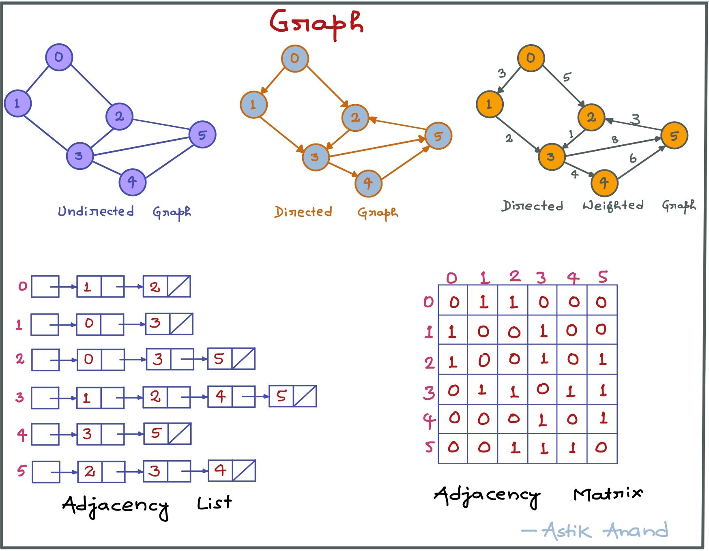

##### 1. Adjacency Matrix

- Adjacency Matrix is a 2D array of size V x V where V is the number of vertices in a graph.
- Let the 2D array be adj[][], a slot `adj[i][j] = 1` indicates that there is an edge from vertex i to vertex j.
- Adjacency matrix for undirected graph is **always symmetric**. 
- Adjacency Matrix is also used to represent weighted graphs.
- If adj[i][j] = w, then there is an edge from vertex i to vertex j with weight w.
- **Pros:** 
  - Representation is easier to implement and follow.
  - Removing an edge takes O(1) time.
  - Queries like whether there is an edge from vertex ‘u’ to vertex ‘v’ are efficient and can be done O(1).
- **Cons:** 

  - Consumes more space O(V<sup>2</sup>).
  - Even if the graph is sparse(contains less number of edges), it consumes the same space.
  - Adding a vertex is O(V<sup>2</sup>) time.

##### 2. Adjacency List

- An array of linked lists is used.
- Size of the array is equal to the number of vertices.
- Let the array be array[]. An entry array[i] represents the linked list of vertices adjacent to the ith vertex.
- This representation can also be used to represent a weighted graph.
- The weights of edges can be stored in nodes of linked lists.
- **Pros:**

  - Saves space **`O(|V|+|E|)`**.
  - In the worst case, there can be C(V, 2) number of edges in a graph thus consuming O(V<sup>2</sup>) space.
  - Adding a vertex is easier.
- **Cons:**
- Queries like whether there is an edge from vertex u to vertex v are not efficient and can be done O(V).

###### Implementation

```python
from collections import defaultdict

class Graph:
    def __init__(self):
        self.graph = defaultdict(list)
    
    def add_edge(self, u, v):
        self.graph[u].append(v)
        self.graph[v].append(u)     # If undirected
    
    def print_graph(self):
        # print the vertex
        for vertex in self.graph:
            print("[{}]".format(vertex), end="")
            # print the connected_vertices to this vertex
            for connected_vertex in self.graph[vertex]:
                print("-->{}".format(connected_vertex), end="")
            print()


print("Example-1: Graph Representation")
g = Graph()
g.add_edge(0, 1)
g.add_edge(0, 2)
g.add_edge(1, 3)
g.add_edge(2, 3)
g.add_edge(2, 5)
g.add_edge(3, 4)
g.add_edge(3, 5)
g.add_edge(4, 5)
g.print_graph()
```

**Output:**

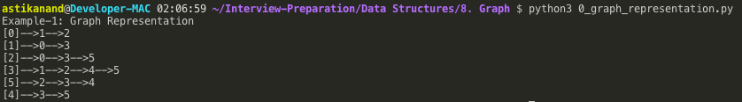

<br>

#### Applications of Graph

Graphs are used to represent many real-life applications: 

- **Computer Science**
    - Graphs are used to represent **networks**. The networks may include paths in a city, Telephone network or Circuit network 
    - Graphs are also used in **social networks** like linkedIn, Facebook. 
        - Example:- Facebook :: Each person is represented with a vertex/node. 
        - Each node is a structure and contains information like person id, name, gender and locale.
    - The **links structure of a website** can be represented by a directed graph. 
        - Vertices represent web pages and directed edges represent links from one page to another.
    - **Graph Databases** geared towards transaction-safe, persistent storing and querying of graph-structured data.
- **Linguistics**
    - Graph-theoretic methods, in various forms, have proven particularly useful in linguistics, since **natural language** often lends itself well to discrete structure. 
    - Traditionally, **syntax** **and compositional semantics** follow tree-based structures, whose expressive power lies in the principle of compositionality modeled in a hierarchical graph. 
    - More contemporary approaches such as **head-driven phrase structure grammar** model the syntax of natural language using typed features structures which are directed acyclic graphs. 
- **Physics and Chemistry**
    - Graph theory is also used to study **molecules in chemistry and physics**. 
    - In **condensed matter physics**, the 3-dimensional structure of complicated simulated atomic structures can be studied quantitatively by gathering statistics on graph-theoretic properties related to the **topology of the atoms**. 
    - In chemistry a graph makes a **natural model for a molecule**, where vertices represent atoms and edges bonds. This approach is especially used in computer processing of molecular structures, ranging from chemical editors to database searching. 
    - In **statistical physics**, graphs can represent local connections between interacting parts of a system, as well as the dynamics of a physical process on such systems. 
    - Similarly, in **computational neuroscience**, graphs can be used to represent functional connections between brain areas that interact to give rise to various cognitive processes, where the vertices represent different areas of the brain and the edges represent the connections between those areas. 
    - Graph theory plays an important role in **electrical modeling of electrical networks**, here, weights are associated with resistance of the wire segments to obtain electrical properties of network structures. 
    - Graphs are also used to represent the **micro-scale channels of porous media**, in which the vertices represent the pores and the edges represent the smaller channels connecting the pores. 
- **Social Sciences**
    - Graph theory is also widely used in **sociology** as a way, for example, to **measure actor’s prestige** or to explore rumor spreading, notably through the use of social network analysis software. 
    - Under the umbrella of social networks are many different types of graphs.
        - **Acquaintanceship and friendship graphs** describe whether people know each other. 
        - **Influence graphs** model whether certain people can influence the behavior of others. 
        - Finally, **collaboration graphs** model whether two people work together in a particular way, such as acting in a movie together. 
- **Biology**
    - Useful in biology and conservation efforts where a vertex can represent regions where certain species exist (or inhabit) and the edges represent migration paths or movement between the regions.
    - This information is important when looking at breeding patterns or tracking the spread of disease, parasites or how changes to the movement can affect other species.
- **Mathematics**
    - Graphs are useful in **geometry** and certain parts of topology such as knot theory.  
    - Algebraic graph theory has close links with group theory.
- **Others**
    - **Weighted graphs** are used to represent structures in which pairwise connections have some numerical values. 
        - For example, if a graph represents a **road network**, the weights could represent the length of each road. 
        - There may be several weights associated with each edge, including distance, travel time, or monetary cost.
        - Such weighted graphs are commonly used to **program GPS's**, and **travel-planning search engines** that compare flight times and costs. 

<br>

<br>

> ### Algo-1: Breadth First Seach (BFS)

###### What is BFS ?

- BFS for a graph is similar to Breadth First Traversal of a tree. The only catch here is, unlike trees, graphs may contain cycles, so we may come to the same node again.
- To avoid processing a node more than once, we use a boolean visited array.

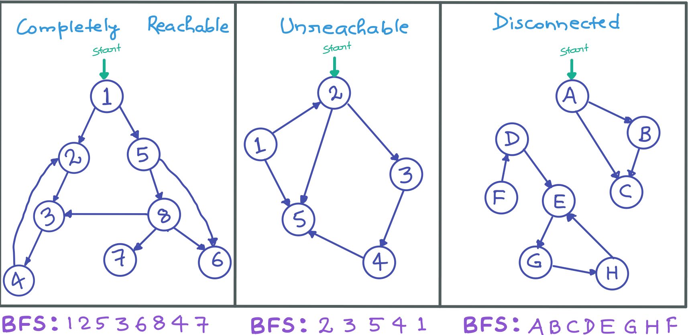

###### **Approach or Algorithm:**

1. Start with the given start_vertex, take a queue and enqueue the start_vertex to it and mark it as visited.
2. While queue is not empty take out the current_vertex from queue and print it:
    - See all the connected vertices to current_vertex:
        - If any connected_vertex is not visited enqueue to the queue and mark it visited.
3. Check if any unvisited vertex (case of UNREACHABLE or DISCONNECTED graphs): 
    - Call the function again from unvisited vertex

###### Implementation:

```python
class Graph:
    def __init__(self):
        self.graph = {}
    

    def add_vertex(self, vertex):
        if vertex not in self.graph:
            self.graph[vertex] = []
    

    def add_edge(self, u, v):
        self.add_vertex(u)
        self.add_vertex(v)
        self.graph[u].append(v)
    

    def unvisited(self, visited):
        for vertex in visited:
            if(visited[vertex] is False):
                return vertex
        return None
    

    def bfs_traversal_util(self, start_vertex, visited):
        # Take a queue and enqueue the start_vertex and mark it as visited
        queue = []
        queue.append(start_vertex)
        visited[start_vertex] = True

        # Dequeue out the current_vertex from queue and print it
        while(queue):
            current_vertex= queue.pop(0)
            print("{}".format(current_vertex), end=" ")
            # See all the connected vertices to current_vertex
            for connected_vertex in self.graph[current_vertex]:
                # If any connected_vertex is not visited enqueue to the queue and mark it visited
                if(visited[connected_vertex] is False):
                    queue.append(connected_vertex)
                    visited[connected_vertex] = True

       
    def bfs_traversal(self, start_vertex):
        # Mark every every vertex as unvisited
        visited = {}
        for vertex in self.graph:
            visited[vertex] = False
        
        # Call the bfs_traversal_util with start_vertex
        self.bfs_traversal_util(start_vertex, visited)

        # Check if there is still any unvisited vertex
        # Only when graph is UNREACHABLE or DISCONNECTED below lines will be executed
        while(self.unvisited(visited) is not None):
            # Call the bfs_traversal_util from the unvisited vertex
            self.bfs_traversal_util(self.unvisited(visited), visited)
        print()


print("Example-1: BFS Traversal of Graph from vertex-1:")
g = Graph()
g.add_edge(1, 2)
g.add_edge(2, 3)
g.add_edge(3, 4)
g.add_edge(4, 2)
g.add_edge(1, 5)
g.add_edge(5, 6)
g.add_edge(5, 8)
g.add_edge(8, 3)
g.add_edge(8, 6)
g.add_edge(8, 7)
g.bfs_traversal(1)

print("Example-2: BFS Traversal of Graph from vertex-2:")
g = Graph()
g.add_edge(1, 2)
g.add_edge(1, 5)
g.add_edge(2, 3)
g.add_edge(2, 5)
g.add_edge(3, 4)
g.add_edge(4, 5)
g.bfs_traversal(2)

print("Example-3: BFS Traversal of Graph from vertex-A:")
g = Graph()
g.add_edge("A", "B")
g.add_edge("A", "C")
g.add_edge("B", "C")
g.add_edge("D", "E")
g.add_edge("E", "G")
g.add_edge("F", "D")
g.add_edge("G", "H")
g.add_edge("H", "E")
g.bfs_traversal("A")
```

**Output:**

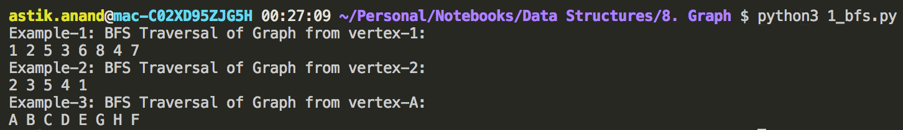

###### **Complexity:**

- **Time:** **O(V+E)** :- V is no. of vertices & E is no. of edges. 
- **Auxilliary Space:** **O(V)**

#### Applications of BFS

- **Shortest Path and Minimum Spanning Tree for unweighted graph** 
    - In an unweighted graph, the shortest path is the path with least number of edges.
    - With Breadth First, we always reach a vertex from given source using the minimum number of edges.
    - Also, in case of unweighted graphs, any spanning tree is Minimum Spanning Tree and we can use either Depth or Breadth first traversal for finding a spanning tree.
- **Peer to Peer Networks**
    - In Peer to Peer Networks like BitTorrent, Breadth First Search is used to find all neighbor nodes.
- **Crawlers in Search Engines:** 
    - Crawlers build index using Breadth First.
    - The idea is to start from source page and follow all links from source and keep doing same.
    - Depth First Traversal can also be used for crawlers, but the advantage with Breadth First Traversal is, depth or levels of the built tree can be limited.
- **Social Networking Websites:** 
    - In social networks, we can find people within a given distance ‘k’ from a person using Breadth First Search till ‘k’ levels.
- **GPS Navigation systems:** 
    - Breadth First Search is used to find all neighboring locations.
- **Broadcasting in Network:**
    - In networks, a broadcasted packet follows Breadth First Search to reach all nodes.
- **In Garbage Collection:** 
    - Breadth First Search is used in copying garbage collection using **Cheney’s algorithm**. 
    - Breadth First Search is preferred over Depth First Search because of better locality of reference:
- **Cycle detection in undirected graph:**
    - In undirected graphs, either Breadth First Search or Depth First Search can be used to detect cycle.
    - In directed graph, only depth first search can be used.
- **Ford-Fulkerson Max-Flow Algorithm:**
    - In Ford-Fulkerson algorithm, we can either use Breadth First or Depth First Traversal to find the maximum flow.
    - Breadth First Traversal is preferred as it reduces worst case time complexity to O(VE<sup>2</sup>).
- **To test if a graph is Bipartite:**
    - We can either use Breadth First or Depth First Traversal.
- **Path Finding:**
    - We can either use Breadth First or Depth First Traversal to find if there is a path between two vertices.
- **Finding all nodes within one connected component:** 
    - We can either use Breadth First or Depth First Traversal to find all nodes reachable from a given node.

<br>

<br>

> ### Algo-2: Depth First Search (DFS)

###### What is DFS ?

- DFS for a graph is similar to Depth First Traversal of tree. The only catch here is, unlike trees, graphs may contain cycles, so we may come to the same node again.
- To avoid processing a node more than once, we use a boolean visited array.

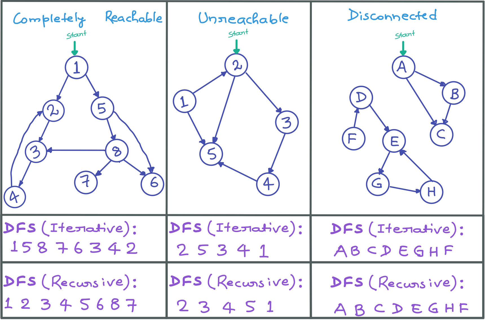

###### Algorithm

1. Mark the given vertex as visited and print it.
2. See all the connected vertices to current_vertex:
    - If any connected_vertex is not visited make the recursive call from that vertex.
3. Check if any unvisited vertex (case of UNREACHABLE or DISCONNECTED graphs): 
    - Call the function again from unvisited vertex.

###### Recursive Implementation

```python
class Graph:
    def __init__(self):
        self.graph = {}
    

    def add_vertex(self, vertex):
        if vertex not in self.graph:
            self.graph[vertex] = []
    

    def add_edge(self, u, v):
        self.add_vertex(u)
        self.add_vertex(v)
        self.graph[u].append(v)


    def unvisited(self, visited):
        for vertex in visited:
            if(visited[vertex] is False):
                return vertex
        return None


    def dfs_traversal_recursive_util(self, vertex, visited):
        visited[vertex] = True
        print("{}".format(vertex), end=" ")

        # See all the connected vertices to vertex and make recursive call from 
        # the vertex not already visited
        for connected_vertex in self.graph[vertex]:
            if(visited[connected_vertex] is False):
                self.dfs_traversal_recursive_util(connected_vertex, visited)
    

    def dfs_traversal_recursive(self, start_vertex):
         # Mark every every vertex as unvisited
        visited = {}
        for vertex in self.graph:
            visited[vertex] = False
        
        # Call the dfs_traversal_recursive_util with start_vertex
        self.dfs_traversal_recursive_util(start_vertex, visited)

        # Check if there is still any unvisited vertex
        # Only when graph is UNREACHABLE or DISCONNECTED below lines will be executed
        while(self.unvisited(visited) is not None):
            # Call the dfs_traversal_recursive_util from the unvisited vertex
            self.dfs_traversal_recursive_util(self.unvisited(visited), visited)
        print()


print("Example-1: DFS Traversal of Graph (Recursive) from vertex-1:")
g = Graph()
g.add_edge(1, 2)
g.add_edge(2, 3)
g.add_edge(3, 4)
g.add_edge(4, 2)
g.add_edge(1, 5)
g.add_edge(5, 6)
g.add_edge(5, 8)
g.add_edge(8, 3)
g.add_edge(8, 6)
g.add_edge(8, 7)
g.dfs_traversal_recursive(1)

print("Example-2: DFS Traversal of Graph (Recursive) from vertex-2:")
g = Graph()
g.add_edge(1, 2)
g.add_edge(1, 5)
g.add_edge(2, 3)
g.add_edge(2, 5)
g.add_edge(3, 4)
g.add_edge(4, 5)
g.dfs_traversal_recursive(2)

print("Example-3: DFS Traversal of Graph (Recursive) from vertex-A:")
g = Graph()
g.add_edge("A", "B")
g.add_edge("A", "C")
g.add_edge("B", "C")
g.add_edge("D", "E")
g.add_edge("E", "G")
g.add_edge("F", "D")
g.add_edge("G", "H")
g.add_edge("H", "E")
g.dfs_traversal_recursive("A")
```

**Output:**

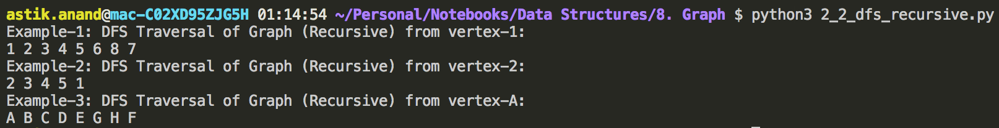

###### **Complexity:**

- **Time:** **O(V+E)** :- V is no. of vertices & E is no. of edges. 
- **Auxilliary Space:** **O(h)**  :- h is height or level of graph

#### Applications of DFS

- **Shortest Path and Minimum Spanning Tree for unweighted graph** 
    - For an unweighted graph, DFS traversal of the graph produces the minimum spanning tree and all pair shortest path tree.
- **Detecting cycle in a graph**
    - A graph has cycle if and only if we see a back edge during DFS.
    - So we can run DFS for the graph and check for back edges.
- **Path Finding**
    - We can specialize the DFS algorithm to find a path between two given vertices u and z.
        - Call DFS(G, u) with u as the start vertex.
        - Use a stack S to keep track of the path between the start vertex and the current vertex.
        - As soon as destination vertex z is encountered, return the path as the contents of the stack
- **Topological Sorting**
    - Topological Sorting is mainly used for scheduling jobs from the given dependencies among jobs.
    - In computer science, applications of this type arise in instruction scheduling, ordering of formula cell evaluation when recomputing formula values in spreadsheets, logic synthesis, determining the order of compilation tasks to perform in makefiles, data serialization, and resolving symbol dependencies in linkers..
- **To test if a graph is Bipartite:**
    - Augment either BFS or DFS when we first discover a new vertex, color it opposited its parents, and for each other edge, check it doesn’t link 2 vertices of the same color.
    - The first vertex in any connected component can be red or black.
- **Finding Strongly Connected Components of a graph:** 
    - A directed graph is called strongly connected if there is a path from each vertex in the graph to every other vertex.
- **Solving puzzles with only one solution** such as mazes.
    - DFS can be adapted to find all solutions to a maze by only including nodes on the current path in the visited set.


---

### Standard Graph Algorithms and Problems

## 1. Detect Cycle in Undirected Graph***

###### **Problem:**

Given a undirected graph, check whether the graph contains a cycle or not.

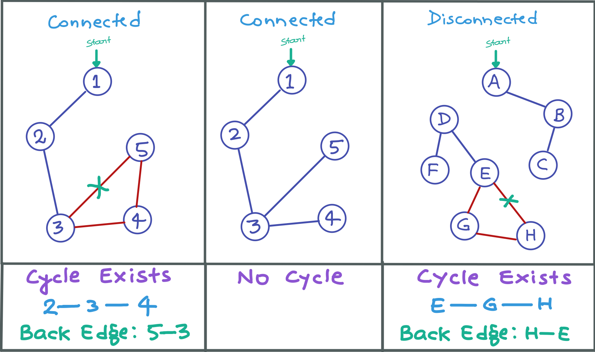

###### **Approach:**

- Mark the current_vertex as **visited**.
- See the connected vertices to current_vertex one by one:
    - If connected_vertex is **not visited** then make **recursive call** from the connected_vertex with current_vertex as parent and **return True** if it returns True. 
    - Else if connected_vertex is already visited and it is not parent then **cycle found** **return True**. 
- Once the current_vertex is processed **return False** to show that cycle was not found while processing this current_vertex**.** 
- Check if any **unvisited** vertex still (case of DISCONNECTED graphs) and **cycle still not found**: 
    - Call the function again from that **unvisited** vertex.

###### **Implementation:**

```python
class Graph:
    def __init__(self):
        self.graph = {}


    def add_vertex(self, vertex):
        if vertex not in self.graph:
            self.graph[vertex] = []
    

    def add_edge(self, u, v):
        self.add_vertex(u)
        self.add_vertex(v)
        self.graph[u].append(v)
        self.graph[v].append(u)


    def unvisited(self, visited):
        for vertex in visited:
            if(visited[vertex] == False):
                return vertex
        return None


    def detect_cycle_undirected_graph_util(self, current_vertex, parent, visited):
        # Mark the current_vertex as visited
        visited[current_vertex] = True

        # See the connected vertices to current_vertex one by one
        for connected_vertex in self.graph[current_vertex]:
            # If connected_vertex is not visited then make recursive call from the connected_vertex
            # with current_vertex as parent and return True if it returns True.
            if(visited[connected_vertex] == False):
                if(self.detect_cycle_undirected_graph_util(connected_vertex, current_vertex, visited) == True):
                    return True
            # Else if connected_vertex is already visited and it is not parent then cycle found return True.
            elif(connected_vertex != parent):
                print("Cycle Exists coz of {} ----- {}".format(current_vertex, connected_vertex))
                return True
        
        # Once the current_vertex is processed return False to show that 
        # cycle was not found while processing this current_vertex.
        return False


    def detect_cycle_undirected_graph(self, start_vertex):
        # Mark every every vertex as unvisited initially
        visited = {}
        for vertex in self.graph:
            visited[vertex] = False

        # Call the detect_cycle_undirected_graph_util with start_vertex
        cycle_exists = self.detect_cycle_undirected_graph_util(start_vertex, None, visited)

        # Check if there is still any unvisited vertex and cycle still not found
        # Only when graph is DISCONNECTED below lines will be executed
        while(self.unvisited(visited) is not None and cycle_exists == False):
            # Call the detect_cycle_undirected_graph_util from the unvisited vertex
            cycle_exists = self.detect_cycle_undirected_graph_util(self.unvisited(visited), None, visited)

        if(not cycle_exists):
            print("Cycle doesn't exist!")


print("Example-1: Detect Cycle in Undirected Graph:")
g = Graph()
g.add_edge(1, 2)
g.add_edge(2, 3)
g.add_edge(3, 4)
g.add_edge(3, 5)
g.add_edge(4, 5)
g.detect_cycle_undirected_graph(1)

print("\nExample-2: Detect Cycle in Undirected Graph:")
g = Graph()
g.add_edge(1, 2)
g.add_edge(2, 3)
g.add_edge(3, 4)
g.add_edge(3, 5)
g.detect_cycle_undirected_graph(1)

print("\nExample-3: Detect Cycle in Undirected Graph:")
g = Graph()
g.add_edge("A", "B")
g.add_edge("B", "C")
g.add_edge("D", "E")
g.add_edge("D", "F")
g.add_edge("E", "G")
g.add_edge("E", "H")
g.add_edge("G", "H")
g.detect_cycle_undirected_graph("A")
```

**Output:**

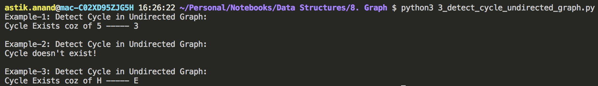

###### **Complexity:**

- **Time:** **O(V+E)** :- As Recursive DFS is used. 
- **Auxilliary Space:** **O(h)**

<br>

<br>

## 2. Detect Cycle in Directed Graph***

###### **Problem:**

Given a directed graph, check whether the graph contains a cycle or not.


###### **Important Facts:**

- Depth First Traversal can be used to detect a cycle in a Graph.
- DFS for a connected graph produces a **tree**. 
- There is a cycle in a graph only if there is a **back edge** present in the graph. 
- A back edge is an edge that is from a node to itself (self-loop) or one of its ancestor in the tree produced by DFS.
- DFS for a disconnected graph produces a **forest**, to detect cycle, we can check for a cycle in individual trees by checking back edges. 
- To detect a back edge, we can keep track of vertices currently in DFS stack and if we reach a vertex that is already in the stack, then there is a cycle in the graph.
- The edge that connects current vertex to the vertex in the recursion stack is a back edge.

###### **Approach:**

- Mark the current_vertex as **"gray"** i.e. processing. 
- See the connected vertices to current_vertex one by one:
    - If connected_vertex is **"white"** i.e. still to be processed then make recursive call from the connected_vertex and **return True** if it is True. 
    - Else if connected_vertex is **"gray"** i.e. in processing then we have **found the cycle** **return** **True**. 
- Once the current_vertex is processed mark it as **"black"** and **return False** to show that cycle was not found while processing this current_vertex. 
- Check if any **"white"** vertex still (case of UNREACHABLE or DISCONNECTED graphs) and **cycle still not found**: 
    - Call the function again from that **"white"** vertex. 

###### Implementation

```python
class Graph:
    def __init__(self):
        self.graph = {}
    

    def add_vertex(self, vertex):
        if vertex not in self.graph:
            self.graph[vertex] = []
    

    def add_edge(self, u, v):
        self.add_vertex(u)
        self.add_vertex(v)
        self.graph[u].append(v)
    

    def unvisited(self, visited):
        for vertex in visited:
            if(visited[vertex] == "white"):
                return vertex
        return None

    
    def detect_cycle_directed_graph_util(self, current_vertex, color):
        # Mark the current_vertex as "gray" i.e. processing
        color[current_vertex] = "gray"

        # See the connected vertices to current_vertex one by one
        for connected_vertex in self.graph[current_vertex]:
            # If connected_vertex is "white" i.e. still to be processed then 
            # make recursive call from the connected_vertex
            # and return True if it returns True                                                   
            if(color[connected_vertex] == "white"):
                if(self.detect_cycle_directed_graph_util(connected_vertex, color) == True):
                    return True
            # Else if connected_vertex is "gray" i.e. in processing then we have found the cycle return True
            elif(color[connected_vertex] == "gray"):
                print("Cycle Exists coz of {} -----> {}". format(current_vertex, connected_vertex))
                return True
        
        # If reaches here that means processing of current vertex is done, mark it black
        # return False to show that cycle was not found while processing this current_vertex
        color[current_vertex] = "black"
        return False
    

    def detect_cycle_directed_graph(self, start_vertex):
        # Mark every every vertex as "white" i.e. still to be processed
        color = {}
        for vertex in self.graph:
            color[vertex] = "white"
        
        # Call the detect_cycle_directed_graph_util with start_vertex
        cycle_exists = self.detect_cycle_directed_graph_util(start_vertex, color)

        # Check if there is still any "white” vertex and cycle still not found
        # Only when graph is UNREACHABLE or DISCONNECTED below lines will be executed
        while(self.unvisited(color) is not None and cycle_exists == False):
            # Call the detect_cycle_directed_graph_util from the "white" vertex
            cycle_exists = self.detect_cycle_directed_graph_util(self.unvisited(color), color)
        
        if(not cycle_exists):
            print("Cycle doesn't exist!")
        


print("Example-1: Detect Cycle in Directed Graph:")
g = Graph()
g.add_edge(1, 2)
g.add_edge(2, 3)
g.add_edge(3, 4)
g.add_edge(4, 2)
g.add_edge(1, 5)
g.add_edge(5, 6)
g.add_edge(5, 8)
g.add_edge(8, 3)
g.add_edge(8, 6)
g.add_edge(8, 7)
g.detect_cycle_directed_graph(1)

print("\nExample-2: Detect Cycle in Directed Graph:")
g = Graph()
g.add_edge(1, 2)
g.add_edge(1, 5)
g.add_edge(2, 3)
g.add_edge(2, 5)
g.add_edge(3, 4)
g.add_edge(4, 5)
g.detect_cycle_directed_graph(1)

print("\nExample-3: Detect Cycle in Directed Graph:")
g = Graph()
g.add_edge("A", "B")
g.add_edge("A", "C")
g.add_edge("B", "C")
g.add_edge("D", "E")
g.add_edge("E", "G")
g.add_edge("F", "D")
g.add_edge("G", "H")
g.add_edge("H", "E")
g.detect_cycle_directed_graph("A")
```

**Output:**

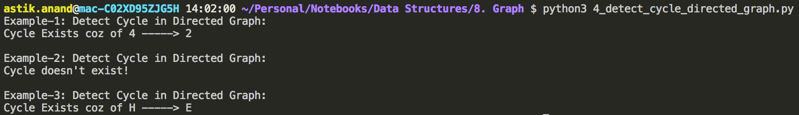

###### **Complexity:**

- **Time:** **O(V+E)** :- As Recursive DFS is used. 
- **Auxilliary Space:** **O(h)**

<br>

<br>

## 3. Topological Sorting***

**What is Topological Sorting:**

Topological sorting for Directed Acyclic Graph (DAG) is a linear ordering of vertices such that for every directed edge uv, vertex u comes before v in the ordering.

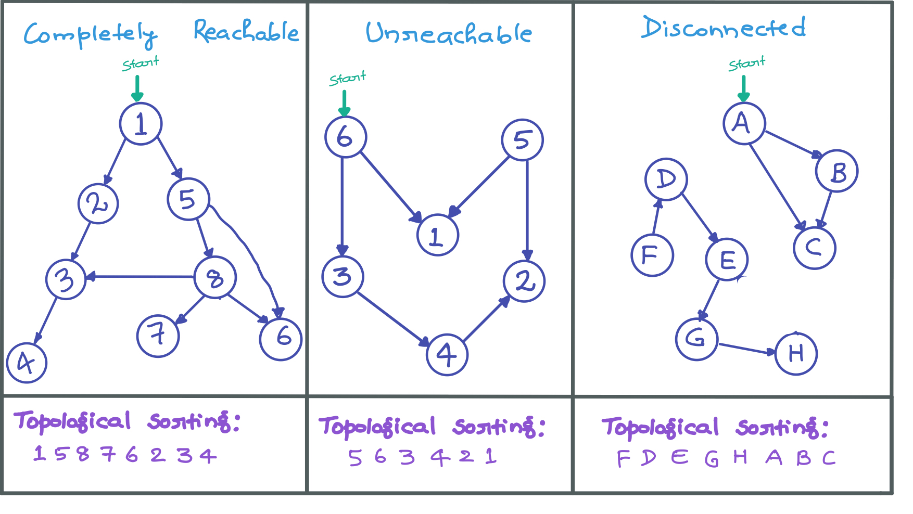

###### **Important Facts:**

- Topological Sorting for a graph is not possible if the graph is not a DAG.
- There can be more than one topological sorting for a graph. For example:- another topological sorting of the following graph-2: is: “6 5 3 4 2 1”.
- The first vertex in topological sorting is always a vertex with in-degree as 0.
- In DFS, we print a vertex and then recursively call DFS for its adjacent vertices but in topological sorting, we need to print a vertex before its adjacent vertices.

###### **Approach:**

1. Mark the given vertex as **visited**. 
2. See all the connected vertices to current_vertex one by one:
    - If **connected_vertex** is not already visited then make **recursive call** from the connected_vertex. 
3. Once processing of current_vertex is done **push it to result_stack**. 
4. Check if any unvisited vertex still (case of UNREACHABLE or DISCONNECTED graphs): 
    - Call the function again from unvisited vertex.
5. Print the result_stack in reverse order.

###### Implementation

```python
class Graph:
    def __init__(self):
        self.graph = {}
    

    def add_vertex(self, vertex):
        if vertex not in self.graph:
            self.graph[vertex] = []
    

    def add_edge(self, u, v):
        self.add_vertex(u)
        self.add_vertex(v)
        self.graph[u].append(v)


    def unvisited(self, visited):
        for vertex in visited:
            if(visited[vertex] is False):
                return vertex
        return None


    def topological_sort_util(self, current_vertex, visited, result_stack):
        # Mark the current_vertex as visited
        visited[current_vertex] = True

        # See all the connected vertices to current_vertex one by one
        for connected_vertex in self.graph[current_vertex]:
            # If connected_vertex is not already visited then make recursive call from the connected_vertex
            if(visited[connected_vertex] is False):
                self.topological_sort_util(connected_vertex, visited, result_stack)
        
        # Once processing of current_vertex is done push it to result_stack
        result_stack.append(current_vertex)


    def topological_sort(self, start_vertex):
         # Mark every every vertex as unvisited
        visited = {}
        for vertex in self.graph:
            visited[vertex] = False
        
        # Take a result_stack to store the result
        result_stack = []
        
        # Call the topological_sort_util with start_vertex
        self.topological_sort_util(start_vertex, visited, result_stack)

        # Check if there is still any unvisited vertex
        # Only when graph is UNREACHABLE or DISCONNECTED below lines will be executed
        while(self.unvisited(visited) is not None):
            # Call the topological_sort_util from the unvisited vertex
            self.topological_sort_util(self.unvisited(visited), visited, result_stack)
        
        # print the result_stack in reverse order
        result_stack.reverse()
        for vertex in result_stack:
            print("{} ".format(vertex), end="")
        print()


print("Example-1: Topological Sorting from vertex-1:")
g = Graph()
g.add_edge(1, 2)
g.add_edge(2, 3)
g.add_edge(3, 4)
g.add_edge(1, 5)
g.add_edge(5, 6)
g.add_edge(5, 8)
g.add_edge(8, 3)
g.add_edge(8, 6)
g.add_edge(8, 7)
g.topological_sort(1)

print("\nExample-2: Topological Sorting from vertex-6:")
g = Graph()
g.add_edge(3, 4)
g.add_edge(4, 2)
g.add_edge(5, 1)
g.add_edge(5, 2)
g.add_edge(6, 1)
g.add_edge(6, 3)
g.topological_sort(6)

print("\nExample-3: Topological Sorting from vertex-A:")
g = Graph()
g.add_edge("A", "B")
g.add_edge("A", "C")
g.add_edge("B", "C")
g.add_edge("D", "E")
g.add_edge("E", "G")
g.add_edge("F", "D")
g.add_edge("G", "H")
g.topological_sort("A")
```

**Output:**

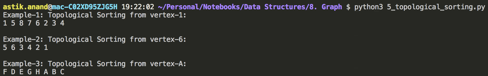

###### **Complexity:**

- **Time:** **O(V+E)** :- As Recursive DFS is used. 
- **Auxilliary Space:** **O(h)**

#### Applications of Topological Sorting

- Topological Sorting is mainly used for **scheduling jobs from the given dependencies among jobs**. 
- In computer science, applications of this type arise in:
    - Instruction scheduling
    - Ordering of formula cell evaluation when recomputing formula values in spreadsheets
    - Logic Synthesis
    - Determining the order of compilation tasks to perform in makefiles
    - Data Serialization
    - Resolving symbol dependencies in linkers

<br>

<br>

## 4. Prim's Minimum Spanning Tree (MST) - Greedy***

###### **What is Minimum Spanning Tree?**

- Given a **connected and undirected graph**, a spanning tree of that graph is a subgraph that is a tree and connects all the vertices together. 
- A single graph can have many different spanning trees.
- A minimum spanning tree (MST) for a weighted, connected and undirected graph is a spanning tree with weight less than or equal to the weight of every other spanning tree.
- The weight of a spanning tree is the sum of weights given to each edge of the spanning tree.

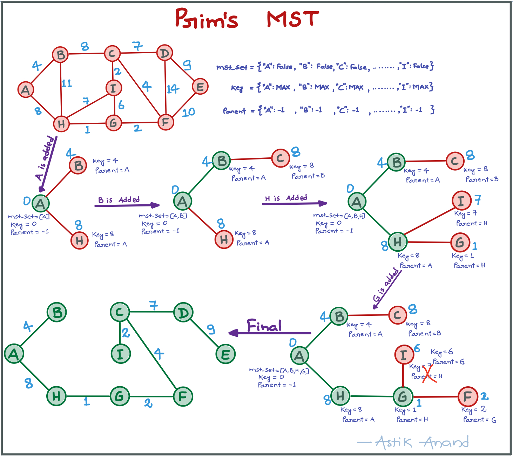

###### **Important Facts:**

- A minimum spanning tree has |V – 1| edges where V is the number of vertices in the given graph.

    > **Total spanning trees possible in a graph = <sup>|E|</sup>C<sub>|V-1|</sub>- total cycles.** 

- MST is not possible for disconnected graph.

###### **Approach:**

1. Initially, set **mst_set** of every vertex as **False**, **key** of every vertex as **"MAX"** and **parent** of every vertex as **"-"**. 
2. Set the **key[start_vertex] = 0** and **min_vertex = start_vertex** :- from this vertex we will start the MST. 
3. While min_vertex is not None:
    - Add the min_vertex to the mst_set.
    - See all the connected vertices to min_vertex one by one. If the **connected_vertex is not in mst_set** and also **weight of the connected_vertex < key[connected vertex]**,then update the key of connected vertex and also it's parent to be the min_vertex 
    - Again call the min_vertex to **get new min_vertex** with updated mst_set and key. 
4. **Print** the edges and their respective weights using **parent** and **key** dicts. 

###### Implementation:

```python
import sys

class Graph:
    def __init__(self):
        self.graph = {}
    

    def add_vertex(self, vertex):
        if vertex not in self.graph:
            self.graph[vertex] = []
    

    def add_edge(self, u, v, w):
        self.add_vertex(u)
        self.add_vertex(v)
        self.graph[u].append((v, w))
        self.graph[v].append((u, w))
    

    def get_min_key_vertex_not_in_mst(self, mst_set, key):
        min_key = sys.maxsize
        min_vertex = None
        for k in key:
            if(key[k] < min_key and mst_set[k] == False):
                min_key = key[k]
                min_vertex = k
        
        return min_vertex
                
    

    def prims_mst(self, start_vertex):
        # Initially, set mst_set of every vertex as False, 
        # key of every vertex as "MAX" and parent of every vertex as "-".
        mst_set = {}; key = {}; parent = {}
        for vertex in self.graph:
            mst_set[vertex] = False
            key[vertex] = sys.maxsize
            parent[vertex] = "-"
        
        # Set the key[start_vertex] = 0 and min_vertex = start_vertex : 
        # From this vertex we will start the MST
        key[start_vertex] = 0
        min_vertex = start_vertex

        while(min_vertex is not None):
            # Add the min_vertex to the mst_set
            mst_set[min_vertex] = True

            # See all the connected vertices to min_vertex one by one
            for connected_vertex in self.graph[min_vertex]:
                con_vertex = connected_vertex[0]
                con_vertex_weight = connected_vertex[1]
                # If the connected_vertex is not in mst_set and also 
                # weight of the connected_vertex < key[connected vertex],
                # then update the key of connected vertex and also it's parent to be the min_vertex
                if(mst_set[con_vertex] == False and con_vertex_weight < key[con_vertex]):
                    key[con_vertex] = con_vertex_weight
                    parent[con_vertex] = min_vertex
            
            # Again call the function to get new min_vertex with updated mst_set and key
            min_vertex = self.get_min_key_vertex_not_in_mst(mst_set, key)
        

        # Print the edges and their respective weights using parent and key dicts.
        ordered_parent = sorted(parent.items(), key=lambda k: (k[1]))
        print("="*23 + "\nEdges\t:\tWeights\n" + "="*23)
        for vertex, parent_vertex in ordered_parent:
            print("{} -- {} \t:\t {}".format(parent_vertex, vertex, key[vertex]))
        


print("Example: Prim's MST from vertex-A:")
g = Graph()
g.add_edge("A", "B", 4)
g.add_edge("A", "H", 8)
g.add_edge("B", "C", 8)
g.add_edge("B", "H", 11)
g.add_edge("C", "D", 7)
g.add_edge("C", "F", 4)
g.add_edge("C", "I", 2)
g.add_edge("D", "E", 9)
g.add_edge("D", "F", 14)
g.add_edge("E", "F", 10)
g.add_edge("F", "G", 2)
g.add_edge("G", "H", 1)
g.add_edge("G", "I", 6)
g.add_edge("H", "I", 7)
g.prims_mst("A")
```

**Output:**

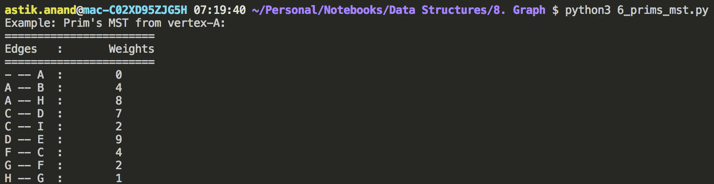

###### **Complexity:**

- **Time:** **O(ElogV)** :- Assuming minimum we are getting now can be done using heap in O(logV) for now it’s O(V). 
- **Auxilliary Space:** **O(V)**

#### Applications of MST

- **Network design:** Telephone, Electrical, Hydraulic, TV Cable, Computer, Road 
    - The standard application is to a problem like phone network design.
    - We have a business with several offices; you want to lease phone lines to connect them up with each other; and the phone company charges different amounts of money to connect different pairs of cities and we want a set of lines that connects all your offices with a minimum total cost.
    - It should be a spanning tree, since if a network isn’t a tree you can always remove some edges and save money.
- **Approximation algorithms for NP-hard problems** – Traveling Salesperson Problem, Steiner tree
- **Indirect applications:**
    - Max Bottleneck Paths
    - LDPC Codes for Error Correction
    - Image Registration with Renyi Entropy
    - Learning Salient Features for Real-Time Face Verification
    - Reducing Data Storage in Sequencing Amino acids in a Protein
    - Model locality of particle interactions in turbulent fluid flows
    - Auto-config protocol for Ethernet bridging to avoid cycles in a network
- **Cluster analysis**
    - K Clustering Problem can be viewed as finding an MST and deleting the k-1 most expensive edges.

<br>

<br>

## 5. Dijkstra's Shortest Path Algorithm - Greedy***

###### **Problem:**

Given a graph and a source vertex in the graph, find shortest paths from source to all vertices in the given graph.

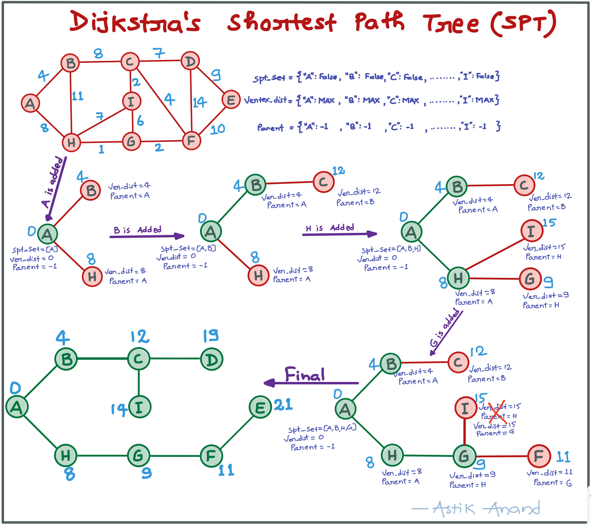

###### **Important Facts:**

- Dijkstra’s algorithm is **very similar to Prim’s algorithm for minimum spanning tree**. 
- Like Prim’s MST, we generate aSPT (shortest path tree) with given source as root.
- At every step of the algorithm, we find a vertex which is not yet included in **set_set** and has a minimum distance from the source.

###### **Approach:**

1. Initially, set **spt_set** of every vertex as **False**, **vertex_distance** of every vertex as **"MAX"** and parent of every vertex as **"-"**. 
2. Set the **key[start_vertex] = 0** and **min_vertex = start_vertex** :- from this vertex we will start the MST. 
3. Set the **vertex_distance[start_vertex] = 0** and **min_distant_vertex = start_vertex** :- From this vertex we will start the SPT. 
4. While min_distant_vertex is not None: 
    - Add the min_distant_vertex to the **spt_set**.
    - See all the connected vertices to min_distant_vertex one by one. If the **connected_vertex is not in spt_set** and also **weight of connected_vertex + vertex_distance[min_distant_vertex] < vertex_distance[connected vertex]**, then update the vertex_distance of connected_vertex and also it's parent to be the min_distant_vertex. 
    - Again call the function to get new min_distant_vertex with updated spt_set and vertex_distance.
5. **Print** the Vertices and their respective distances from source and Reach by using **parent** and **vertex_distance** dicts. 

###### Implementation

```python
import sys

class Graph:
    def __init__(self):
        self.graph = {}
    

    def add_vertex(self, vertex):
        if vertex not in self.graph:
            self.graph[vertex] = []
    

    def add_edge(self, u, v, w):
        self.add_vertex(u)
        self.add_vertex(v)
        self.graph[u].append((v, w))
        self.graph[v].append((u, w))
    

    def get_min_distant_vertex_not_in_spt(self, spt_set, vertex_distance):
        min_vertex_distance = sys.maxsize
        min_distant_vertex = None
        for v in vertex_distance:
            if(vertex_distance[v] < min_vertex_distance and spt_set[v] == False):
                min_vertex_distance = vertex_distance[v]
                min_distant_vertex = v
        
        return min_distant_vertex
                
    

    def dijkstras_spt(self, start_vertex):
        # Initially, set spt_set of every vertex as False, 
        # vertex_distance of every vertex as "MAX" and parent of every vertex as "-".
        spt_set = {}; vertex_distance = {}; parent = {}
        for vertex in self.graph:
            spt_set[vertex] = False
            vertex_distance[vertex] = sys.maxsize
            parent[vertex] = "-"
        
        # Set the vertex_distance[start_vertex] = 0 and min_distant_vertex = start_vertex :- 
        # From this vertex we will start the SPT.
        vertex_distance[start_vertex] = 0
        min_distant_vertex = start_vertex

        while(min_distant_vertex is not None):
            # Add the min_distant_vertex to the spt_set
            spt_set[min_distant_vertex] = True

            # See all the connected vertices to min_distant_vertex one by one
            for connected_vertex in self.graph[min_distant_vertex]:
                con_vertex = connected_vertex[0]
                con_vertex_weight = connected_vertex[1]
                # If the connected_vertex is not in spt_set and also weight of connected_vertex + 
                # vertex_distance[min_distant_vertex] < vertex_distance[connected vertex],
                # then update the vertex_distance of connected_vertex and also 
                # it's parent to be the min_distant_vertex
                if(spt_set[con_vertex] == False and  
                    con_vertex_weight + vertex_distance[min_distant_vertex] < vertex_distance[con_vertex]):
                    vertex_distance[con_vertex] = con_vertex_weight + vertex_distance[min_distant_vertex]
                    parent[con_vertex] = min_distant_vertex
            
            # Again call the function to get new min_distant_vertex with updated spt_set and vertex_distance
            min_distant_vertex = self.get_min_distant_vertex_not_in_spt(spt_set, vertex_distance)
        

        # Print the edges and their respective weights using parent and vertex_distance dicts.
        ordered_parent = sorted(parent.items(), key=lambda k: (k[0]))
        print("="*56 + "\nVertex\t:\tDistance from source\t:\tReach By\n" + "="*56)
        for vertex, parent_vertex in ordered_parent:
            print("{}\t:\t\t{}\t\t:\t{} --> {}".format(vertex, vertex_distance[vertex], parent_vertex, vertex))
        


print("Example: Dijkstra's Shortest Path from vertex-A:")
g = Graph()
g.add_edge("A", "B", 4)
g.add_edge("A", "H", 8)
g.add_edge("B", "C", 8)
g.add_edge("B", "H", 11)
g.add_edge("C", "D", 7)
g.add_edge("C", "F", 4)
g.add_edge("C", "I", 2)
g.add_edge("D", "E", 9)
g.add_edge("D", "F", 14)
g.add_edge("E", "F", 10)
g.add_edge("F", "G", 2)
g.add_edge("G", "H", 1)
g.add_edge("G", "I", 6)
g.add_edge("H", "I", 7)
g.dijkstras_spt("A")
```

**Output:**

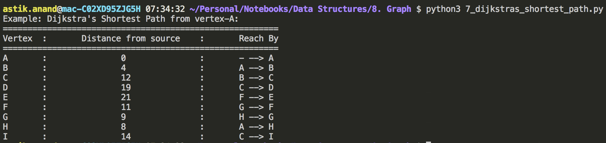

###### **Complexity:**

- **Time:** **O(ElogV)** :- Assuming minimum we are getting now can be done using heap in O(logV) for now it’s O(V). 
- **Auxilliary Space:** **O(V)**

##### **Notes:**

- The code is for undirected graph, same dijkstra function can be used for directed graphs also.
- Dijkstra’s algorithm doesn’t work for graphs with negative weight edges.
- For graphs with negative weight edges, Bellman–Ford algorithm can be used, we will soon be discussing it as a separate post.

<br>

<br>

## 6. Snake and Ladder Problem***

###### **Problem:**

Given a snake and ladder board, find the minimum number of dice throws required to reach the destination or last cell from source or 1st cell.Basically, the player has total control over outcome of dice throw and wants to find out minimum number of throws required to reach last cell.If the player reaches a cell which is base of a ladder, the player has to climb up that ladder and if reaches a cell is mouth of the snake, has to go down to the tail of snake without a dice throw.

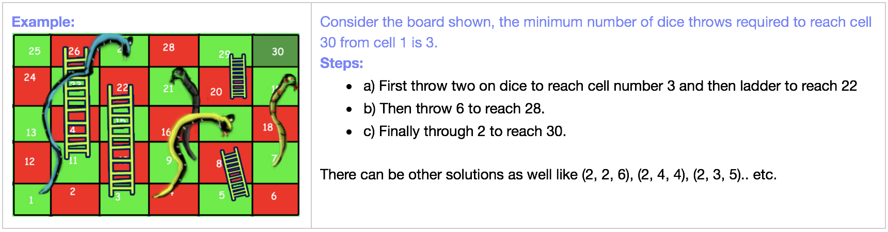

###### **Approach:**

- Initially, mark every cell as **unvisited** and take an **empty queue**. 
- Mark the **first_cell as visited** and enqueue the first cell to the queue with **dice_count=0** : We start from here. 
- While the queue is not empty:
    - Get the **current** element from the queue and then fetch the **current_cell** and **current_dice_count** from it. 
    - If **current_cell is last cell** we are done, **print** the dice_count and **break**. 
    - Start seeing all the **6 reachable_cell** from current_cell one by one: 
        - If **reachable_cell** is lesser than last cell and still **not visited**: 
            - Mark the recahable_cell as **visited**. 
            - If any of ladder or snake is available at reachable_cell **modify the reachable_cell** with the moves value. 
            - Finally **update** the queue with reachable_cell and dice_count needed to reach there. 

###### **Implementation:**

```python
def get_min_dice_throws_snake_ladder(N, moves):
    # Mark every cell as unvisited and take an empty queue
    visited = [False]*(N)
    queue = []

    # Mark the first_cell as visited and enqueue the first cell to the queue 
    # with dice_count=0 : We start from here. 
    visited[0] = True
    queue.append((0, 0))

    while(queue):
        # Get the current element from the queue and then fetch the current_cell 
        # and current_dice_count from it.
        current = queue.pop(0)
        current_cell = current[0]
        current_dice_count = current[1]

        # if current_cell is last cell we are done, print the dice_count and break
        if(current_cell == N-1):
            print("No. of min dice count: {}".format(current_dice_count))
            break
        
        # Start seeing all the 6 reachable_cell from current_cell one by one
        for reachable_cell in range(current_cell+1, current_cell+6):
            # If reachable_cell is lesser than last cell and still not visited 
            # then mark the recahable_cell as visited
            if(reachable_cell < N and visited[reachable_cell] is False):
                visited[reachable_cell] = True
                # If any of ladder or snake is available at reachable_cell 
                # modify the reachable_cell with the moves value
                if(moves[reachable_cell] != -1):
                    reachable_cell = moves[reachable_cell]
                
                # Update the queue with reachable_cell and dice_count needed to reach there.
                queue.append((reachable_cell, current_dice_count+1))


print("Example-1:- Snake and Ladder:")
N = 30
moves = [-1] * N 
  
# Ladders 
moves[2] = 21
moves[4] = 7
moves[10] = 25
moves[19] = 28
  
# Snakes 
moves[26] = 0
moves[20] = 8
moves[16] = 3
moves[18] = 6
get_min_dice_throws_snake_ladder(N, moves)
```

**Output:**

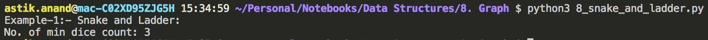

###### **Complexity:**

- **Time:** **O(N)**
- **Auxilliary Space:** **O(N)**

<br>

<br>

## 7. Finding number of Islands

###### **Problem:**

Given a boolean 2D matrix, find the number of islands. A group of connected 1s forms an island.

> **Example:**
>
> Input : 
>
> matrix[][] :  {1, 1, 0, 0, 0}, 
>
> ​                {0, 1, 0, 0, 1}, 
>
> ​                {1, 0, 0, 1, 1}, 
>
> ​                {0, 0, 0, 0, 0}, 
>
> ​                {1, 0, 1, 0, 1}
>
> Output : 5      // Total 5 islands.

#### Connected Component

- A connected component of an undirected graph is a subgraph in which every two vertices are connected to each other by a path(s), and which is connected to no other vertices outside the subgraph.
- A graph where all vertices are connected with each other has exactly one connected component, consisting of the whole graph.
- Such graph with only one connected component is called as **Strongly Connected Graph**. 

###### **Important Facts:**

- The problem can be easily **solved by applying DFS() on each component**. In each DFS() call, a component or a sub-graph is visited. 
- We will call DFS on the next un-visited component.
- The number of calls to DFS() gives the number of connected components. **BFS can also be used.**
- A cell in 2D matrix can be connected to 8 neighbours.
- So, unlike standard DFS(), where we recursively call for all adjacent vertices, here we can recursively call for 8 neighbours only.
- We keep track of the visited 1s so that they are not visited again.

###### **Approach:**

- Initially, mark all the cells of graph or matrix as unvisited.
- Check in matrix if any cell which is 1 and not visited call DFS() on that cell and increase the count by 1.
- The number of times DFS() is called gives that much number of connected components or islands.
- In DFS(I, j, visited):
    - Mark the current_cell as visited.
    - Look for all the 8 possible neighbours.
    - If a neighbour is possible and the neighbour cell is safe then make call to recursive DFS() with the neighbour cell.
- is_safe_cell(x, y, visited):
    - A cell is safe if x is in range of row and y is also in range of col, the cell value is 1 and it is till not visited.

###### Implementation

```python
POSSIBLE_MOVES = [(-1, -1), (-1, 0), (-1, 1), (0, -1), (0, 1), (1, -1), (1, 0), (1,1)]

class Graph:
    def __init__(self, matrix):
        self.graph = matrix
        self.row = len(matrix)
        self.col = len(matrix[0])
    

    def is_safe_cell(self, x, y, visited):
        # Cell is safe if x is in range(row), y is in range(column),
        # cell is still not visited and value of cell is 1.
        return (x>=0 and x<self.row and 
                y>=0 and y<self.col and 
                not visited[x][y] and self.graph[x][y] ==1)
    

    # Function to do DFS for a 2D boolean matrix, considers all the 8 neighbours as adjacent vertices.
    def DFS(self, i, j, visited):
        # Mark current_cell as visited
        visited[i][j] = True

        # For all neighbours check if the cell is safe then call the DFS again from that safe_cell.
        for x_move, y_move in POSSIBLE_MOVES:
            if(self.is_safe_cell(i+x_move, j+y_move, visited)):
                self.DFS(i+x_move, j+y_move, visited)


    def find_number_of_islands(self):
        # Mark all cells as unvisited initially
        visited = [[False]*self.col for i in range(self.row)]

        islands_count = 0
        for i in range(self.row):
            for j in range(self.col):
                # If a cell with value 1 is not visited yet, then new island is found
                # Visit all cells in this island and increment islands_count
                if(self.graph[i][j] == 1 and visited[i][j] is False):
                    self.DFS(i, j, visited)
                    islands_count += 1
        
        print("Total islands: {}".format(islands_count))


print("Example-1:- Find number of Islands:")
matrix=[[1, 1, 0, 0, 0], 
        [0, 1, 0, 0, 1], 
        [1, 0, 0, 1, 1], 
        [0, 0, 0, 0, 0], 
        [1, 0, 1, 0, 1]]
g = Graph(matrix)
g.find_number_of_islands()
```

**Output:**

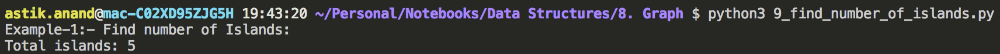

###### **Complexity:**

- **Time:** **O(V<sup>2</sup>)**
- **Auxilliary Space: O(V<sup>2</sup>)**

<br>

<br>

## 8. Find Critical Connections in Network (Bridges in Graph)

###### Problem:

There are n servers numbered from 0 to n-1 connected by undirected server-to-server connections forming a network.

Here connections[i] = [a, b] represents a connection between servers a and b. 

Any server can reach any other server directly or indirectly through the network.

A critical connection is a connection that, if removed, will make some server unable to reach some other server.

Return all critical connections in the network in any order.

###### Approach-1: Brute-Force

- According to the definition an edge is critical if removing it would disconnect the graph.
- So a brute force solution would look like say we have an edge (u, v).
- We remove that edge and do a DFS on the rest of the graph to find the number of connected components.
- If the number of connected components increase we have found the critical edge.
- We repeat it for every edge in the graph.
- **Time Complexity:  O(E*(V+E))**.  O(V+E) for DFS and to be done for every Edge.

###### Approach-2: Tarjan Algorithm

- Make use of single DFS to find the critical edge.

###### Implementation:

```python

from collections import defaultdict

class Solution:
    def __init__(self):
        self.graph = defaultdict(list)
        self.time = 0
        self.result = []
    
    def dfs(self, current_vertex, visited, parent, disc, low):
        # Mark current as visited
        visited[current_vertex] = True

        # Initialize disc time and low value for current
        disc[current_vertex] = self.time
        low[current_vertex] = self.time
        self.time += 1

        for connected_vetex in self.graph[current_vertex]:
            # If connected_vertex is not visited
            if not visited[connected_vetex]:
                parent[connected_vetex] = current_vertex
                self.dfs(connected_vetex, visited, parent, disc, low)

                # If the subtree rooted with connected_vertex has a connection to 
                # one of the ancestors of current_vertex, then update low of current_vertex
                low[current_vertex] = min(low[current_vertex], low[connected_vetex])

                # If the lowest vertex reachable from subtree under connected_vertex is below 
                # current_vertex in DFS tree, then this (current_vertex & connected_vertex) forms a bridge
                if (low[connected_vetex] > disc[current_vertex]):
                    self.result.append((current_vertex, connected_vetex))

            # If connected_vertex is already visited and is not parent of current_vertex
            # then update low value of current_vertex
            elif (parent[current_vertex] != connected_vetex):
                low[current_vertex] = min(low[current_vertex], disc[connected_vetex])
    

    def criticalConnections(self, n, connections):
        for u, v in connections:
            self.graph[u].append(v)
            self.graph[v].append(u)

        visited = {}
        parent = {}
        disc = {}
        low = {}
        for vertex in self.graph:
            visited[vertex] = False
            parent[vertex] = -1
            disc[vertex] = float("Inf")
            low[vertex] = float("Inf")
        
        for vertex in self.graph:
            if(not visited[vertex]):
                self.dfs(0, visited, parent, disc, low)
        
        return self.result
    

print(Solution().criticalConnections(4, [[0,1],[1,2],[2,0],[1,3]]))
print(Solution().criticalConnections(6, [[0,1],[1,2],[2,0],[1,3],[3,4],[4,5],[5,3]]))
```

**Output:**

```
[(1, 3)]
[(1, 3)]
```

###### **Complexity:**

- **Time: O(V+E)** Single DFS is needed.
- **Auxilliary Space: O(V)** 

<br>

<br>

##### Problems To Do:

- Order of Characters in Alien Language
- Hamiltonian Cycle
- Travelling Salesman Problem (TSP)

<br>

<br>

------

<a href="hash" class="prev-button">&larr; Previous:  Hash</a>

