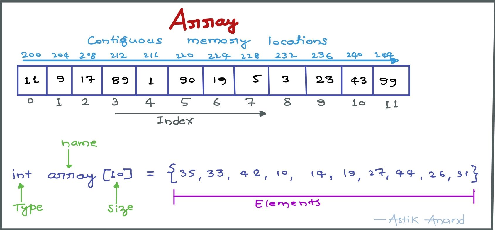
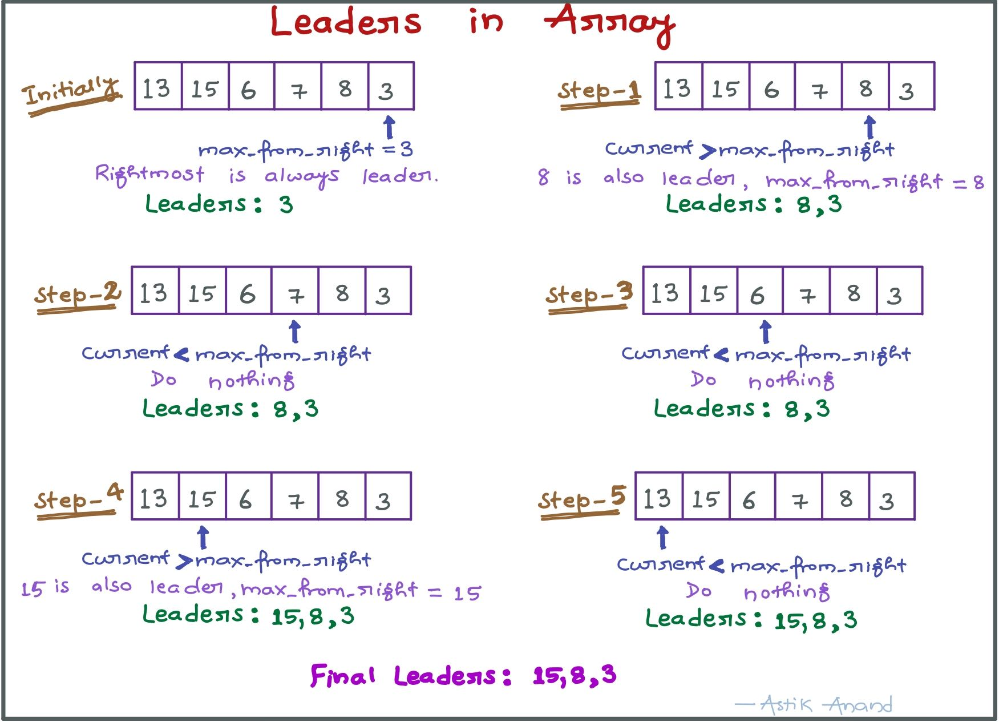
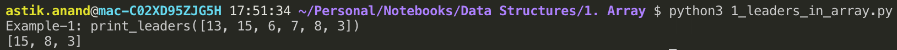
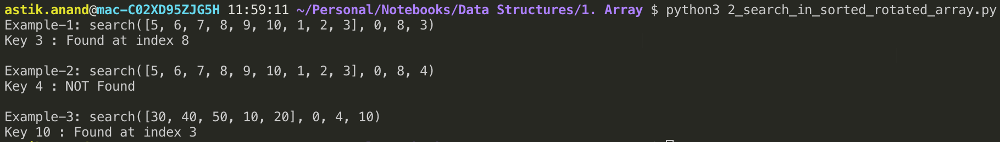
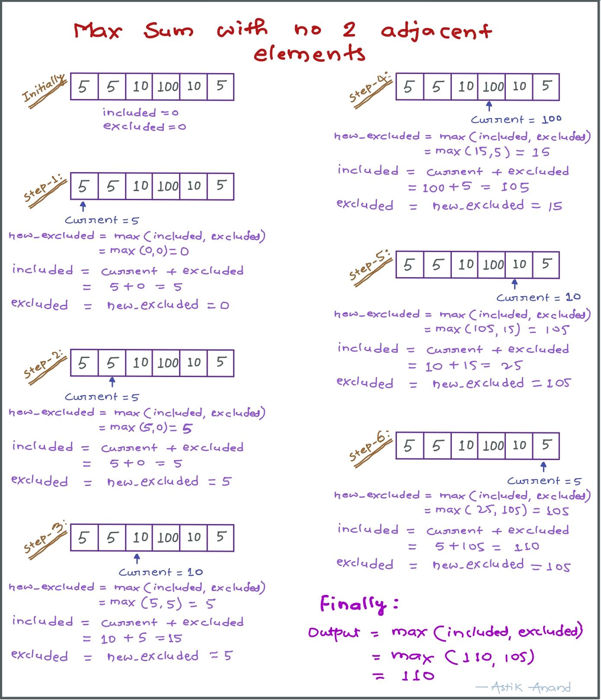
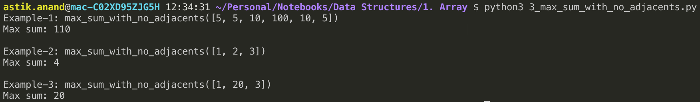
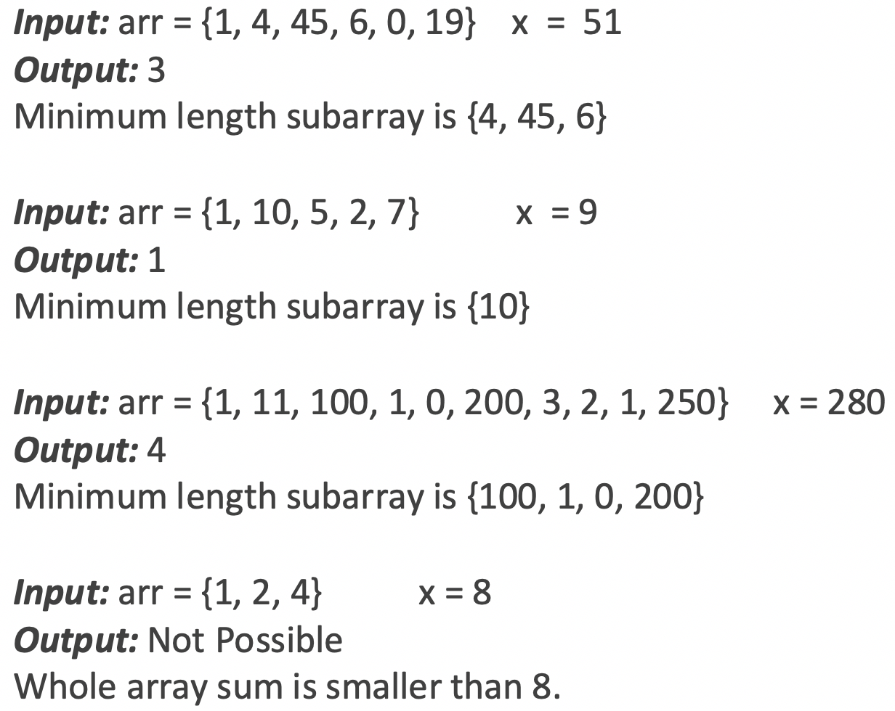
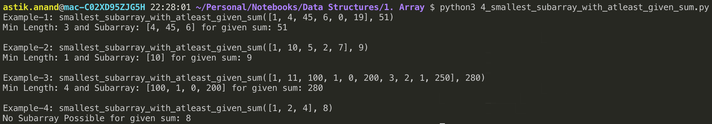
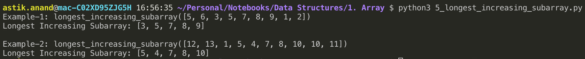

# Array

###### What is an array ?

- An array is a sequential collection of elements of same data type and stores data elements in a continuous memory location. 
- The elements of an array are accessed by using an index. The index of an array of size N can range from 0 to N−1. 



###### Different Types of Array

- 1-D Array (Array)
- 2-D Array (Matrix)
- n-D Array

#### Applications of Array

- Arrays are used to implement mathematical vectors and matrices, as well as other kinds of rectangular tables.
- Many databases, small and large, consist of (or include) one-dimensional arrays whose elements are records.
- Arrays are used to implement other data structures such as lists, heaps, hash tables, deques, queues, stacks, strings etc.

<br>

---

------

<br>

### Standard Array Problems

## 1. Leaders in Array

###### Problem: 

Print all the LEADERS in the array. An element is leader if it is greater than all the elements to its right side. 

The rightmost element is always a leader. 

> **Example:**
>
> ***Input:*** [13, 15, 6, 7, 8, 3]
>
> ***Output:*** 15, 8, 3

###### Approach-1: Brute Force

- Use two loops, the outer loop runs one by one picks all elements from left to right. 
- The inner loop compares the picked element to all the elements to its right side.
- If the picked element is greater than all the elements to its right side, then the picked element is the leader.
- **Time Complexity: O(n<sup>2</sup>)**

###### Approach-2: Scan from right

- Scan all the elements from right to left in an array and keep track of maximum till now. 
- When maximum changes its value, print it.
- **Time Complexity: O(n)**



###### Implementation

```python
def print_leaders(arr):
    n = len(arr)
    # Righmost element is always leader
    max_from_right = arr[-1]
    leaders = [arr[-1]]

    for i in range(n-2, -1, -1):         
        if max_from_right < arr[i]:             
            max_from_right = arr[i]
            leaders.append(arr[i])
    
    print(leaders[::-1])
    
          
print("Example-1: print_leaders([13, 15, 6, 7, 8, 3])")
print_leaders([13, 15, 6, 7, 8, 3])
```

**Output:**




###### Complexity:

- **Time:** **O(n)** 
- **Auxilliary Space:** **O(1)** as leaders array can be ignored and directly printed.

<br>

<br>

## 2. Search in sorted and rotated array***

###### Problem:

An element in a sorted array can be found in O(log n) time via binary search. But suppose we rotate an ascending order sorted array at some pivot unknown to you beforehand. So for instance, 1 2 3 4 5 might become 3 4 5 1 2. Devise a way to find an element in the rotated array in O(log n) time.

> **Example:**
>
> ***Input:*** arr[] = {5, 6, 7, 8, 9, 10, 1, 2, 3} &nbsp; key = 3
> ***Output:*** Found at index 8
>
> 
>
> ***Input:*** arr[] = {5, 6, 7, 8, 9, 10, 1, 2, 3} &nbsp; key = 4
> ***Output:*** Not found
>
> 
>
> ***Input:*** arr[] = {30, 40, 50, 10, 20} &nbsp; key = 10
> ***Output:*** Found at index 3

###### Approach-Distorted Binary Search

- Find middle point mid = (l + h)/2
- If key is present at middle point, return mid.
- Else If arr[l..mid] is sorted
    - a) If key to be searched lies in range from arr[l] to arr[mid], recur for arr[l..mid].
    - b) Else recur for arr[mid+1..h]
- Else (arr[mid+1..h] must be sorted)
    - a) If key to be searched lies in range from arr[mid+1] to arr[h], recur for arr[mid+1..h].
    - b) Else recur for arr[l..mid] 

###### Implementation

```python
def search(arr, start, end, key): 
    if start > end:
        print("Key {} : NOT Found".format(key))
        return
      
    mid = (start + end) // 2
    if arr[mid] == key:
        print("Key {} : Found at index {}".format(key, mid))
        return
  
    # If arr[start...mid] i.e 1st half is sorted  
    if arr[start] <= arr[mid]: 
        # As the 1st subarray is sorted, Quickly check if key lies in first half or 2nd half  
        if key >= arr[start] and key <= arr[mid]: 
            return search(arr, start, mid-1, key)
        else:
            return search(arr, mid+1, end, key) 
    # Else arr[start..mid] is not sorted, then arr[mid... end] must be sorted
    else:
        # As the 2nd subarray is sorted, Quickly check if key lies in 2nd half or first half
        if key >= arr[mid] and key <= arr[end]: 
            return search(arr, mid+1, end, key)
        else:
            return search(arr, start, mid-1, key)


print("Example-1: search([5, 6, 7, 8, 9, 10, 1, 2, 3], 0, 8, 3)")
search([5, 6, 7, 8, 9, 10, 1, 2, 3], 0, 8, 3)

print("\nExample-2: search([5, 6, 7, 8, 9, 10, 1, 2, 3], 0, 8, 4)")
search([5, 6, 7, 8, 9, 10, 1, 2, 3], 0, 8, 4)

print("\nExample-3: search([30, 40, 50, 10, 20], 0, 4, 10)")
search([30, 40, 50, 10, 20], 0, 4, 10)
```

**Output:**



###### Complexity:

- **Time:** **O(LogN)** 
- **Auxilliary Space:** **O(1)**

<br>

<br>

## 3. Maximum sum with no two adjacent elements***

###### Problem:

Given an array of positive numbers, find the maximum sum of a subsequence with the constraint that no 2 numbers in the sequence should be adjacent in the array. So 3 2 7 10 should return 13 (sum of 3 and 10) or 3 2 5 10 7 should return 15 (sum of 3, 5 and 7).

> **Example:**
>
> ***Input:*** arr[] = {5, 5, 10, 100, 10, 5} &nbsp; ***Output:*** 110
>
> ***Input:*** arr[] = {1, 2, 3} &nbsp; ***Output:*** 4
>
> ***Input:*** arr[] = {1, 20, 3} &nbsp; ***Output:*** 20

###### Algorithm:

- Start with two sums excluded and included.
- Loop for all the elements and:
    - Calculate **new_excluded** as the **max(included, excluded)** as current element is still not added to the included.
    - Now **change the included by adding current to excluded** as no two adjacents should be present.
    - Finally **update the exluded** with new_excluded.
- Return the **max(included, excluded)**.




###### Implementation

```python
def max_sum_with_no_adjacents(arr):
    included = excluded = 0

    for current in arr:
        # Get the new excluded which is max(included, excluded) as current element is 
        # still not added to the included
        new_excluded = max(included, excluded)

        # Now change the included by adding current to excluded as no two adjacents should be present.
        included = excluded + current

        # Finally update the exluded with new_excluded
        excluded = new_excluded
    
    print("Max sum: {}".format(max(included, excluded)))


print("Example-1: max_sum_with_no_adjacents([5, 5, 10, 100, 10, 5])")
max_sum_with_no_adjacents([5, 5, 10, 100, 10, 5])

print("\nExample-2: max_sum_with_no_adjacents([1, 2, 3])")
max_sum_with_no_adjacents([1, 2, 3])

print("\nExample-3: max_sum_with_no_adjacents([1, 20, 3])")
max_sum_with_no_adjacents([1, 20, 3])
```

**Output:**



###### Complexity:

- **Time:** **O(n)** 
- **Auxilliary Space:** **O(1)**

<br>

<br>

## 4. Smallest subarray with sum greater than a given value***

###### Problem:

Given an array of integers and a number x, find the smallest subarray with sum greater than the given value.

> **Example:**



###### Approach-1: Brute Force

- Use two nested loops, the outer loop picks a starting element, the inner loop considers all elements (on right side of current start) as ending element.
- Whenever sum of elements between current start and end becomes more than the given number, update the result if current length is smaller than the smallest length so far.
- **Time Complexity: O(n<sup>2</sup>)**

###### Approach-2: Efficient

- Initialize **current_sum = 0** and **min_length = n+1** and also starting and ending indexes **start = 0**, **end =0**
- Take all the elements one by one while end is smaller than n.
    - Keep adding array elements while current sum is smaller than x and **increment end**.
    - Once current_sum becomes greater than x, **start removing the trailing statement**.
    - **Update the min_length** if needed and **increment start**.
- To also print the subarray, store the final_start and final_end while updating the min_length.
- **Time Complexity: O(n)**

###### Implementation

```python
def smallest_subarray_with_atleast_given_sum(arr, x):
    n = len(arr)
    # Initialize current sum and minimum length 
    current_sum = 0; min_length = n + 1
  
    # Initialize starting and ending indexes 
    start = 0; end = 0
    final_start = 0; final_end = 0

    # Take all the elements one by one while end is smaller than n.
    while (end < n): 
        # Keep adding array elements while current sum is smaller than x and increment end 
        while (current_sum <= x and end < n): 
            current_sum += arr[end] 
            end += 1
  
        # Once current_sum becomes greater than x, start removing the trailing statement
        # Update the min_length if needed and increment start
        while (current_sum > x and start < n): 
            if (end - start < min_length): 
                min_length = end - start
                final_start = start
                final_end = end 

            current_sum -= arr[start] 
            start+= 1
      
    if(min_length == n+1):
        print("No Subarray Possible for given sum: {}".format(x))
    else:
        print("Min Length: {} and Subarray: {} for given sum: {}".format(
          min_length, arr[final_start:final_end], x))


print("Example-1: smallest_subarray_with_atleast_given_sum([1, 4, 45, 6, 0, 19], 51)")
smallest_subarray_with_atleast_given_sum([1, 4, 45, 6, 0, 19], 51)

print("\nExample-2: smallest_subarray_with_atleast_given_sum([1, 10, 5, 2, 7], 9)")
smallest_subarray_with_atleast_given_sum([1, 10, 5, 2, 7], 9)

print("\nExample-3: smallest_subarray_with_atleast_given_sum([1, 11, 100, 1, 0, 200, 3, 2, 1, 250], 280)")
smallest_subarray_with_atleast_given_sum([1, 11, 100, 1, 0, 200, 3, 2, 1, 250], 280)

print("\nExample-4: smallest_subarray_with_atleast_given_sum([1, 2, 4], 8)")
smallest_subarray_with_atleast_given_sum([1, 2, 4], 8)
```

**Output:**



###### Complexity:

- **Time:** **O(n)** 
- **Auxilliary Space:** **O(1)**

<br>

<br>

## 5. Longest increasing subarray

###### Problem:

Given an array containing n numbers. Find the length of the longest contiguous subarray such that every element in the subarray is strictly greater than its previous element in the same subarray.

> **Examples:**
>
> ***Input:*** arr[] = {5, 6, 3, 5, 7, 8, 9, 1, 2} &nbsp; ***Output:*** 5 &nbsp; ***Subarray:*** {3, 5, 7, 8, 9}
>
> ***Input:*** arr[] = {12, 13, 1, 5, 4, 7, 8, 10, 10, 11} &nbsp; ***Output:*** 4 &nbsp; ***Subarray:*** {4, 7, 8, 10}

###### Approach:

- Loop over the array and check.
- If current element is greater than previous element increment the curr_length.
- Else, as current element is smaller, check if curr_length is greater than max_length and set max_length as curr_length, end=i and curr_length=1.
- Finally outside the loop check if curr_length is greater than max_length and set max_length as curr_length, end=i.
- Finally return max_length.
- **Time Complexity: O(n)**

###### Implementation:

```python
def longest_increasing_subarray(arr):
    n = len(arr) 
    max_length = curr_length = 1
    end = 0
       
    for i in range(1, n): 
        if (arr[i] > arr[i-1]) : 
            curr_length += 1 
        else:
            if(curr_length > max_length):
                max_length = curr_length
                end = i
                curr_length = 1 

    if(curr_length > max_length):
        max_length = curr_length
        end = i

    print("Longest Increasing Subarray: {}".format(arr[end-max_length:end]))
  


print("Example-1: longest_increasing_subarray([5, 6, 3, 5, 7, 8, 9, 1, 2])")
longest_increasing_subarray([5, 6, 3, 5, 7, 8, 9, 1, 2])

print("\nExample-2: longest_increasing_subarray([12, 13, 1, 5, 4, 7, 8, 10, 10, 11])")
longest_increasing_subarray([12, 13, 1, 5, 4, 7, 8, 10, 10, 11])
```

**Output:**



###### Complexity:

- **Time:** **O(n)** 
- **Auxilliary Space:** **O(1)**

<br><br>

<br>

<br>

## 6. Trapping Rain Water Problem

###### Problem:

Given n non-negative integers representing an elevation map where the width of each bar is 1, compute how much water it is able to trap after raining.

> Example:
>
> Input: [0, 1, 0, 2, 1, 0, 1, 3, 2, 1, 2, 1]
>
> Output: 6

###### Approach-1:

- Find left_pole and right_pol array for every element similar to finding leader in array.
- Then iterate over every element and find the water contributed by that particular element by **min(left_pole[i], right_pole[i]) - arr[i]**.

###### Approach-1 Implementation

```python
def trap(height):
    n = len(height)
    right_pole = [0]*n
    right_pole[n-1] = height[n-1]
    for i in range(n-2, -1, -1):
        right_pole[i] = max(right_pole[i+1], height[i])
        
    left_pole = [0]*n
    left_pole[0] = height[0]
    for i in range(1, n):
        left_pole[i] = max(left_pole[i-1], height[i])
        
    water = 0
    for i in range(n):
        water += min(left_pole[i], right_pole[i]) - height[i]
    
    return water
```

###### Complexity:

- **Time: O(n)** 
- **Auxilliary Space: O(n)** 

###### Approach-2:

- Try to eliminate calculating left_pole and right_pole.
- Try doing in the one iteration only.

###### Implementation:

```python
def trap2(height):
    n = len(height)
    i = 0
    j = n-1
    left_max = 0
    right_max = 0
    water = 0
    while(i < j):
        if(height[i] < height[j]):
            left_max = max(left_max, height[i])
            water += left_max - height[i]
            i += 1
        else:
            right_max = max(right_max, height[j])
            water += right_max - height[j]
            j -= 1
    
    return water
```

###### Complexity:

- **Time: O(n)** 
- **Auxilliary Space: O(1)** 

<br>

<br>


##### Problems To Do:

- Find Majority Element in Array 
- Trapping Rain Water Problem


<br><br>

<br>

------

<a href="linked-list" class="next-button">Next: Linked List &rarr;</a>

