# Linked List

###### What is lInked list ? 

- It is a linear data structure like array.
- But unlike arrays, elements are not stored at contiguous location, but are linked using pointers.

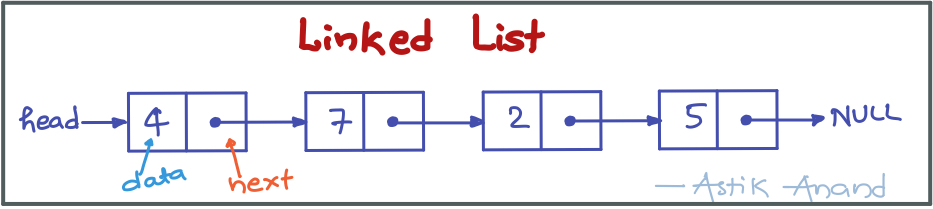

###### Operations:

- **insert(x):**  Inserts an element into the list.
- **delete(x):** Deletes the element from the list.  

###### Advantages over arrays:

1. Dynamic size
2. Ease of insertion/deletion

###### Drawbacks:

1. **Random access is not allowed**. We have to access elements sequentially starting from the first node. So we cannot do binary search with linked lists efficiently with its default implementation.
2. **Extra memory space for a pointer** is required with each element of the list.
3. **Not cache friendly.** Since array elements are contiguous locations, there is locality of reference which is not there in case of linked lists.

#### Representation of Linked List

A linked list is represented by a pointer to the first node of the linked list.  The first node is called head. If the linked list is empty, then value of head is NULL.

Each node in a list consists of at least two parts:

1. data
2. Pointer / Reference to the next node

###### Approach:

- Represent Linked list using Nodes which is a Data Type that consist **data** and **pointer to next node**. 
- A linked list is initiated using a **head** which points to None initially. 
- We can insert the node in linked list at head using **push()** method. 
- The head starts pointing to most recent node inserted at head and successive nodes points to its next node and last node points to Null.
- We can print the nodes using **print_list()** function. 
- Optionally we can also define **list_length()** which calculates length of list. 

###### Implementation

```python
class Node:
    def __init__(self, data):
        self.data = data
        self.next = None

        
class LinkedList:
    def __init__(self):
        self.head = None
    
    
    def list_length(self):
        temp = self.head
        length = 0
        while(temp):
            length += 1
            temp = temp.next
        return length

      
    def print_list(self):
        n = self.list_length()
        temp = self.head
        print('''+---+---+    '''*n)

        while(temp):
            print("| {} | •-|--->".format(temp.data), end="")
            temp = temp.next
        print("Null")

        print('''+---+---+    '''*n)

        
    def push(self, data):
        new_node = Node(data)
        new_node.next = self.head
        self.head = new_node


print("Linked List:")
linked_list = LinkedList()
linked_list.push(5)
linked_list.push(2)
linked_list.push(7)
linked_list.push(4)
linked_list.print_list()
```

**Output:**

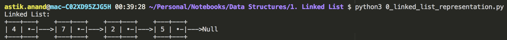

###### Complexity:

- **Time:** **O(n)** 
- **Auxilliary Space:** **O(1)**

#### Applications of Linked List

- Implementation of stacks and queues data structures.
- Implementation of graphs : Adjacency list representation of graphs is most popular which is uses linked list to store adjacent vertices.
- Dynamic memory allocation : We use linked list of free blocks.
- Maintaining directory of names
- Performing arithmetic operations on long integers
- **Image viewer –** Previous and next images are linked, hence can be accessed by next and previous button.
- **Previous and next page in web browser –** We can access previous and next url searched in web browser by pressing back and next button since, they are linked as linked list.
- **Music Player –** Songs in music player are linked to previous and next song. you can play songs either from starting or ending of the list.


----

### Standard Linked List Problems

## 1. Insert a node in linked list

###### Problem:

Given a linked list need to insert a node in it. 

> **Example:**
>
> Linked List at Start:          5-->1-->6-->7—>Null 
>
> After push(3):                    3-->5-->1-->6-->7-->Null 
>
> After insert_at(4, 9):         3-->5-->1-->9-->6-->7-->Null 
>
> After append(2):               3-->5-->1-->9-->6-->7-->2-->Null

**A node can be inserted in 3 ways:**

- At the front of the linked list: **push(data)** 
- At a given position: **insert_at(position, data)** 
- At the end of the linked list: **append(data)** 

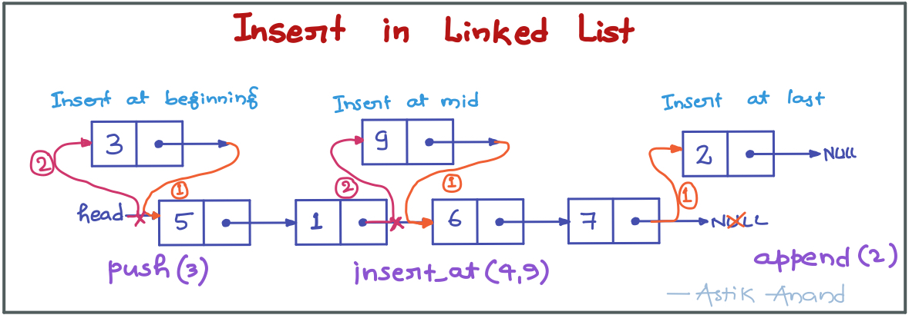

###### Approach:

- **push(data):**
    - Make a new_node.
    - (1) Next of new_node points to node where head was poiting earlier.
    - (2) Now, head points to new_node.
- **append(data):**
    - Make a new_node
    - (1) Find the last node using temp and make the next of last_node point to new_node.
- **insert_at(position, data):**
    - If position is 0 call push to insert at front.
    - Now find position to insert, need to jump only position-2 coz already at 1 and need to go 1 less
        - (Example-1: if position=5, already at 1 so ust 3 jumps to reach 4th posittion.)
    - Make new_node
    - (1) Next of new_node points to next of temp.
    - (2) Next of temp points to new_node.

###### Implementation

```python
class Node:
    def __init__(self, data):
        self.data = data
        self.next = None


class LinkedList:
    def __init__(self):
        self.head = None

        
    def print_list(self):
        temp = self.head
        while(temp):
            print("{}-->".format(temp.data), end="")
            temp = temp.next
        print("Null")

        
    def push(self, data):
        # Make a new_node.
        new_node = Node(data)
        # (1) Next of new_node points to node where head was poiting earlier.
        new_node.next = self.head
        # (2) Now, head points to new_node.
        self.head = new_node
   
  
    def append(self, data):
        # Make a new_node.
        new_node = Node(data)

        # (1) Find the last node using temp and make the next of last_node point to new_node.
        temp = self.head
        while(temp.next):
            temp = temp.next
        temp.next = new_node
    
    
    def insert_at(self, position, data):
        # If position is 0 call push to insert at front.
        if(position == 0):
            self.push(data)
            return
        
        # Now find position to insert, need to jump only position-2 coz already at 1 and need to go 1 less. 
        # (Example-1: if position=5, already at 1 so ust 3 jumps to reach 4th posittion.)
        temp = self.head
        while(temp.next and position-2 > 0):
            temp = temp.next
            position -= 1
        
        # Make new_node
        new_node = Node(data)
        # (1) Next of new_node points to next of temp.
        new_node.next = temp.next
        # (2) Next of temp points to new_node.
        temp.next = new_node
      

print("Linked List at Start:")
linked_list = LinkedList()
linked_list.push(7)
linked_list.push(6)
linked_list.push(1)
linked_list.push(5)
linked_list.print_list()
print("\nAfter push(3):")
linked_list.push(3)
linked_list.print_list()
print("\nAfter insert_at(4, 9):")
linked_list.insert_at(4, 9)
linked_list.print_list()
print("\nAfter append(2):")
linked_list.append(2)
linked_list.print_list()
```

**Output**

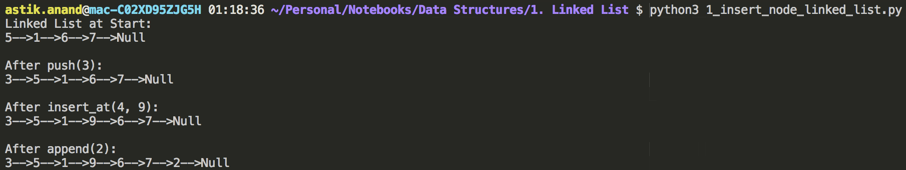

###### **Complexity:**

- **Time:** **O(1)**
- **Auxilliary Space:** **O(1)**

<br>

<br>

## 2. Delete a node in linked list

###### Problem:

Given a linked list need to delete a node from it. We will only delete the first occurrence of it.

> **Example:**
>
> Linked List at Start:        4-->7-->6-->3-->5-->Null 
>
> After delete(6):             4-->7-->3-->5-->Null 
>
> After delete(4):             7-->3-->5-->Null 
>
> After delete(2):             7-->3-->5-->Null 
>
> Element 2 not present in list. 


###### Approach:

- Check if first node is the node to be deleted if it is point the head to next of temp and make temp None.
- Search for the node to be deleted using the **given data** in the nodes using **temp** and keep **prev_node** in store. 
- Point the **next** of **prev_node** to the **next** of **temp** and make **temp None** if temp exists else element not present. 

###### Implementation:

```python
class Node:
    def __init__(self, data):
        self.data = data
        self.next = None


class LinkedList:
    def __init__(self):
        self.head = None


    def print_list(self):
        temp = self.head
        while(temp):
            print("{}-->".format(temp.data), end="")
            temp = temp.next
        print("Null")


    def push(self, data):
        new_node = Node(data)
        new_node.next = self.head
        self.head = new_node
    

    def delete(self, data):
        temp = self.head

        # Check if first node is the node to be deleted if it is 
        # point the head to next of temp and make temp None.
        if(temp and temp.data == data):
            self.head = temp.next
            temp = None
            return
        
        # Search for the node to be deleted using the given data in the nodes 
        # using temp and keep prev in store.
        while(temp):
            if(temp.data == data):
                break
            prev = temp
            temp = temp.next
        
        # Point the next of prev to the next of temp and make temp None 
        # if temp exists else element not present.
        if(temp):
            prev.next = temp.next
            temp = None
        else:
            print("Element {} not present in list.".format(data))
    
      

print("Linked List at Start:")
linked_list = LinkedList()
linked_list.push(5)
linked_list.push(3)
linked_list.push(6)
linked_list.push(7)
linked_list.push(4)
linked_list.print_list()
print("\nAfter delete(6):")
linked_list.delete(6)
linked_list.print_list()
print("\nAfter delete(4):")
linked_list.delete(4)
linked_list.print_list()
print("\nAfter delete(2):")
linked_list.delete(2)
linked_list.print_list()
```

**Output:**

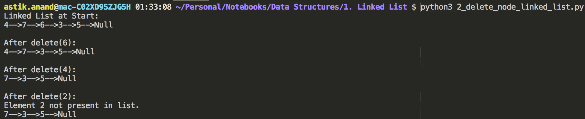

###### **Complexity:**

- **Time:** **O(n)**
- **Auxilliary Space:** **O(1)**

<br>

<br>

## 3. Reverse a linked list

###### Problem:

Given pointer to the head node of a linked list, the task is to reverse the linked list. We need to reverse the list by changing links between nodes. 

> **Examples:**
>
> Input : 4->7->6->3->5->NULL     Output : 5->3->6->7->4->NULL 
>
> Input : NULL                    Output : NULL 
>
> Input : 1->NULL                 Output : 1->NULL 

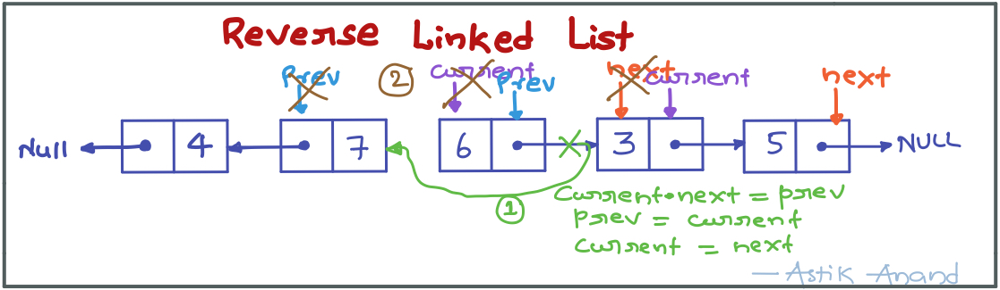

###### **Approach:**

- Start with **prev_node as None** and **current_node as first node**. 
- While **current_node is not None**, take the **next_node as next of current_node**, make the **next of current_node point to prev_node** and then update the **prev_node as current_node** and **current_node as next_node**.  
- Make **head point to prev_node** which was the last node and now in reverse it becomes first. 

###### **Implementation:**

```python
class Node:
    def __init__(self, data):
        self.data = data
        self.next = None


class LinkedList:
    def __init__(self):
        self.head = None
    

    def print_list(self):
        temp = self.head
        while(temp):
            print("{}-->".format(temp.data), end="")
            temp = temp.next
        print("Null")


    def push(self, data):
        new_node = Node(data)

        new_node.next = self.head
        self.head = new_node
    
    
    def reverse(self):
        # Take prev_node as None and current_node as first node.
        prev_node = None
        current_node = self.head

        # While current_node doesn't become None keep going:
        while(current_node):
            # Take the next_node as next of current_node.
            next_node = current_node.next
            # Make the next of current_node point to prev_node
            current_node.next = prev_node
            # Update the prev_node as current_node and current_node as next_node
            prev_node = current_node
            current_node = next_node
        
        # Make head point to prev_node which was the last node and now in reverse it becomes first.
        self.head = prev_node

        

print("Linked List at Start:")
linked_list = LinkedList()
linked_list.push(5)
linked_list.push(3)
linked_list.push(6)
linked_list.push(7)
linked_list.push(4)
linked_list.print_list()
print("\nAfter reverse():")
linked_list.reverse()
linked_list.print_list()
```

**Output:**

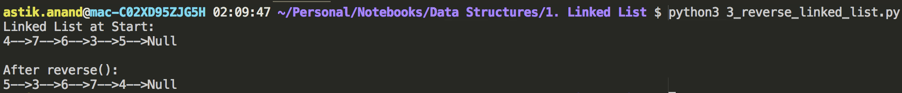

###### **Complexity:**

- **Time:** **O(n)**
- **Auxilliary Space:** **O(1)**

<br>

<br>

## 4. Merge 2 sorted linked list

###### **Problem:**

Write a SortedMerge() function that takes two lists, each of which is sorted in increasing order, and merges the two together into one list which is in increasing order.

SortedMerge() should return the new list. The new list should be made by splicing together the nodes of the first two lists.

> **Example:**
>
> **list_1:** 1->4->5         **list_2:** is 2->3->6->8->9        **merged_list:** 1->2->3->4->5->6->8->9  

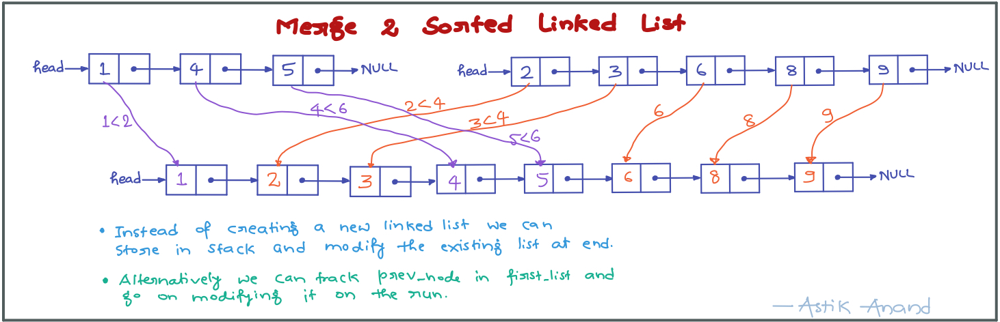

###### **Approach:**

- Take 2 pointers temp_1 and temp_2 to track both lists and a stack to put the data.
- While both temp_1 and temp_2 are exists keep on going:
    - If data of temp_1 is lesser temp_1 is selected and incremented else temp_2 is selected and incrmented.
- If elements are left in temp_1, push all of them to stack.
- If elements are left in temp_2, push all of them to stack.
- Now, finally make head point to None and create the linked_list from popping from stack and pushing all nodes to it.

###### **Implementation:**

```python
class Node:
    def __init__(self, data):
        self.data = data
        self.next = None


class LinkedList:
    def __init__(self):
        self.head = None


    def print_list(self):
        temp = self.head
        while(temp):
            print("{}-->".format(temp.data), end="")
            temp = temp.next
        print("Null")


    def push(self, data):
        new_node = Node(data)

        new_node.next = self.head
        self.head = new_node
    

    def merge_2_sorted_linked_lists(self, sorted_list_2):
        # Take 2 pointers temp_1 and temp_2 to track both lists and a stack to put the data.
        temp_1 = self.head
        temp_2 = sorted_list_2.head
        stack = []

        # While both temp_1 and temp_2 are exists keep on going:
        while(temp_1 and temp_2):
            # If data of temp_1 is lesser temp_1 is selected and incremented 
            # else temp_2 is selected and incrmented.
            if(temp_1.data <= temp_2.data):
                stack.append(temp_1.data)
                temp_1 = temp_1.next
            else:
                stack.append(temp_2.data)
                temp_2 = temp_2.next
        
        # If elements are left in temp_1, push all of them to stack.
        while(temp_1):
            stack.append(temp_1.data)
            temp_1 = temp_1.next
        
        # If elements are left in temp_2, push all of them to stack.
        while(temp_2):
            stack.append(temp_2.data)
            temp_2 = temp_2.next
        
        # Now, finally make head point to None and create the linked_list from popping 
        # from stack and pushing all nodes to it.
        self.head = None
        while(stack):
            self.push(stack.pop())


print("First Sorted Linked List:")
linked_list_1 = LinkedList()
linked_list_1.push(5)
linked_list_1.push(4)
linked_list_1.push(1)
linked_list_1.print_list()
print("\nSecond Sorted Linked List:")
linked_list_2 = LinkedList()
linked_list_2.push(9)
linked_list_2.push(8)
linked_list_2.push(6)
linked_list_2.push(3)
linked_list_2.push(2)
linked_list_2.print_list()
print("\nMerged List:")
linked_list_1.merge_2_sorted_linked_lists(linked_list_2)
linked_list_1.print_list()
```

**Output:**

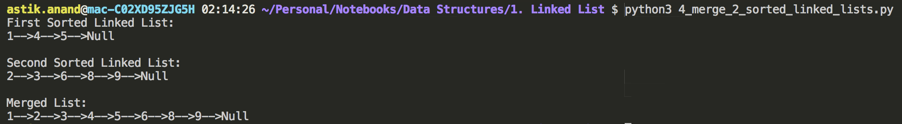

###### **Complexity:**

- **Time:** **O(n) :** Whosever size is larger 
- **Auxilliary Space:** **O(n1+n2):** Can be very easily done in O(1) with prev_pointer for linked_list_1. 

<br>

<br>

## 5. Reverse linked list in a group of size***

###### **Problem:**

Given a linked list, write a function to reverse every k nodes.

> **Examples:**
>
> Inputs:  1->2->3->4->5->6->7->8->NULL  and k = 3 
>
> Output:  3->2->1->6->5->4->8->7->NULL 
>
> 
>
> Inputs:  1->2->3->4->5->6->7->8->NULL  and k = 5 
>
> Output:  5->4->3->2->1->8->7->6->NULL 

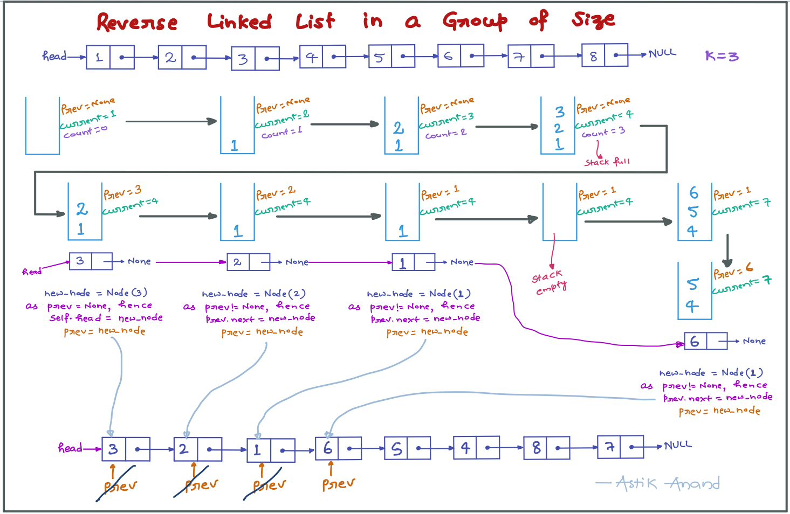

###### **Approach:**

- Take **prev** as None, **current_nod**e as **start** node and an **empty stack** to store at most k items. 
- Till the current_node is not None:
    - Take **at most k elements in stack** and keep **moving the current_node**. 
    - After k nodes are pushed to stack **current_node** will point to **k+1<sup>th</sup>** node but **prev** will still be **unchanged**. 
    - Now start **popping from stack** and **make new_node and check**: 
        - If **prev is None**, then set the **head to point to prev** (it will only happen for the first element when prev is None). 
        - Else set **next of prev as new_node**. 
        - Update the **prev as new_node**. 

###### **Implementation:**

```python
class Node:
    def __init__(self, data):
        self.data = data
        self.next = None


class LinkedList:
    def __init__(self):
        self.head = None


    def print_list(self):
        temp = self.head
        while(temp):
            print("{}-->".format(temp.data), end="")
            temp = temp.next
        print("Null")


    def push(self, data):
        new_node = Node(data)
        new_node.next = self.head
        self.head = new_node
    
    
    def reverse_in_group_of_size(self, k):
        # Take prev as None, start the current_node from first node and 
        # take an empty stack to store atmost k items.
        prev = None
        current_node = self.head
        stack = []
        
        # Till the current_node is not None.
        while(current_node):
            count = 0
            # Take at most k elements in stack and keep moving the current_node.
            while(count<k and current_node):
                stack.append(current_node.data)
                current_node = current_node.next
                count += 1
            
            # After k nodes are pushed to stack current will point to k+1 the node 
            # but prev will still be unchanged.
            # Now start popping from stack and make new_node and check:
            while(stack):
                new_node = Node(stack.pop())
                # If prev is None, then set the head to point to prev 
                # (it will only happen for the first element when prev is None).
                if(prev is None):
                    self.head = new_node
                else:     # Else set next of prev as new_node
                    prev.next = new_node
                
                # Update the prev as new_node.
                prev = new_node

            

print("Linked List at Start:")
linked_list = LinkedList()
linked_list.push(8)
linked_list.push(7)
linked_list.push(6)
linked_list.push(5)
linked_list.push(4)
linked_list.push(3)
linked_list.push(2)
linked_list.push(1)
linked_list.print_list()
print("\nAfter reverse_in_group_of_size(3):")
linked_list.reverse_in_group_of_size(3)
linked_list.print_list()
```

**Output:**

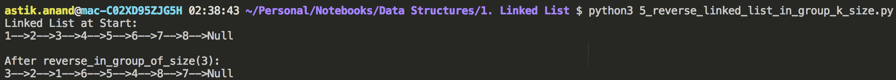

###### **Complexity:**

- **Time:** **O(n)**
- **Auxilliary Space:** **O(K)**

<br>

<br>

## 6. Add 2 numbers represented by linked list

###### **Problem:**

Given two numbers represented by two lists, write a function that returns sum list. The sum list is list representation of addition of two input numbers.

> **Examples:**
>
> Inputs:  Num1 = 984 (4->8->9)   Num2 = 978 (8->7->9)     sum = 1962 (1->9->6->2) 
>
> Inputs:  Num1 = 64957 7->5->9->4->6   Num2 = 48 8->4     sum = 65005 (6->5->0->0->5) 

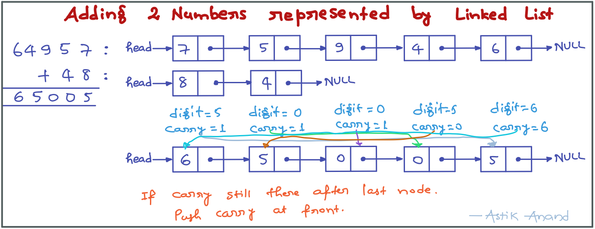

###### **Approach:**

- Take 2 pointers to track both the lists, take carry = 0 and also initialize result list.
- Now while any of temp_1 or temp_2 is there keep going.
    - Get the sum: carry + first_list digit sum if exists else 0 + second_list digit sum if exists else 0.
    - If sum geater than 10 then get the digit and carry separated.
    - Push the digit to result list and update the temp_1 and temp_2 pointers if exists else None.
- At the end if carry still is not zero, then push carry also to the result list.
- Lastly, set the head of the list as result list's head.

###### **Implementation:**

```python
class Node:
    def __init__(self, data):
        self.data = data
        self.next = None


class LinkedList:
    def __init__(self):
        self.head = None


    def print_list(self):
        temp = self.head
        while(temp):
            print("{}-->".format(temp.data), end="")
            temp = temp.next
        print("Null")


    def push(self, data):
        new_node = Node(data)
        new_node.next = self.head
        self.head = new_node
    
    
    def add_2_numbers(self, number):
        # Take 2 pointers to track both the lists, take carry = 0 and also initialize result list.
        temp_1 = self.head
        temp_2 = number.head
        carry = 0
        result = LinkedList()

        # Now while any of temp_1 or temp_2 is there keep going.
        while(temp_1 or temp_2):
            # Get the sum: carry + first_list digit sum if exists 
            # else 0 + second_list digit sum if exists else 0.
            digit_sum = carry + (0 if not temp_1 else temp_1.data) + (0 if not temp_2 else temp_2.data)
            # If sum geater than 10 then get the digit and carry separated.
            if(digit_sum >= 10):
                carry = 1
                digit_sum -= 10
            else:
                carry = 0
            
            # Push the digit to result list and update the temp_1 and temp_2 pointers if exists else None.
            result.push(digit_sum)
            temp_1 = None if not temp_1 else temp_1.next
            temp_2 = None if not temp_2 else temp_2.next
        
        # At the end if carry still is not zero, then push carry also to the result list.
        if(carry != 0):
            result.push(carry)
        
        # Lastly, set the head of the list as result list's head.
        self.head = result.head


print("Example-1:")
print("First Number: {}".format(984))
number_1 = LinkedList()
number_1.push(9)
number_1.push(8)
number_1.push(4)
print("Second Number: {}".format(978))
number_2 = LinkedList()
number_2.push(9)
number_2.push(7)
number_2.push(8)
print("Sum of both:")
number_1.add_2_numbers(number_2)
number_1.print_list()

print("\nExample-2:")
print("First Number: {}".format(64957))
number_1 = LinkedList()
number_1.push(6)
number_1.push(4)
number_1.push(9)
number_1.push(5)
number_1.push(7)
print("Second Number: {}".format(48))
number_2 = LinkedList()
number_2.push(4)
number_2.push(8)
print("Sum of both:")
number_1.add_2_numbers(number_2)
number_1.print_list()
```

**Output:**

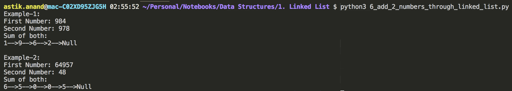

###### **Complexity:**

- **Time:** **O(n) :** Whosever size is larger 
- **Auxilliary Space:** **O(n):** 

<br>

<br>

## 7. Detect and remove loop in linked list***

###### **Problem:**

Check whether a given Linked List contains loop and if loop is present then removes the loop and returns true. And if the list doesn’t contain loop then returns false.

> **Examples:**
>
> Input: 1->2->3->4->5->2     Output: 1->2->3->4->5->Null 
>
> Input: 1->2->3->4.          Output: False 

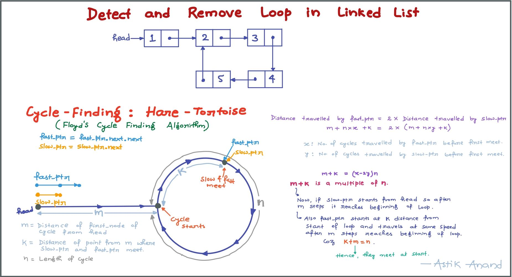

###### **Approach:**

- If only 0 node or 1 node and that too has no self loop the cycle doesn’t exist.
- Initialize fast_ptr and slow_ptr to detect the loop.
- If both are equal then cycle exists and then just start the slow_ptr from head and fast_ptr from same place at same speed and check the next of both.
- The point at where next of both meet makes the loop just break using fast_ptr as we were checking next so we still have fast_ptr.
- To break loop just make next of fast_ptr as None.

###### **Implementation:**

```python
class Node:
    def __init__(self, data):
        self.data = data
        self.next = None


class LinkedList:
    def __init__(self):
        self.head = None
    

    def print_list(self):
        temp = self.head
        while(temp):
            print("{}-->".format(temp.data), end="")
            temp = temp.next
        print("Null")


    def push(self, data):
        new_node = Node(data)

        new_node.next = self.head
        self.head = new_node
    

    def detect_and_remove_loop(self):
        # If only 0 nodes or 1 node and that too  has no self.loop then cycle doesn’t exist.
        if(self.head is None or self.head.next is None):
            print("Cycle doesn't exist!")
            return
        
        # Initialize fast and slow pointers
        slow_ptr = fast_ptr = self.head
        slow_ptr = slow_ptr.next
        fast_ptr = fast_ptr.next.next

        # Detecting the Loop
        while(slow_ptr and fast_ptr and fast_ptr.next):
            if(slow_ptr == fast_ptr):
                # Loop detected start removing the loop using fast_ptr and slow_ptr at same speed 
                # and starting slow_ptr from head and fast_ptr from meet point
                slow_ptr =  self.head
                while(slow_ptr.next != fast_ptr.next):
                    slow_ptr = slow_ptr.next
                    fast_ptr = fast_ptr.next
                
                print("Cycle exists from Node-{} to Node-{}!".format(fast_ptr.data, fast_ptr.next.data))
                # Make next of fast_ptr None to break loop 
                fast_ptr.next = None
                return
            
            slow_ptr = slow_ptr.next
            fast_ptr = fast_ptr.next.next
        
        # If reaches here mean cycle not exists
        print("Cycle doesn't exist!")
        


print("Detect and Remove Loop Example-1:")
linked_list = LinkedList() 
linked_list.head = Node(1) 
linked_list.head.next = Node(2) 
linked_list.head.next.next = Node(3) 
linked_list.head.next.next.next = Node(4) 
linked_list.head.next.next.next.next = Node(5) 
#Create a loop for testing 
linked_list.head.next.next.next.next.next =  linked_list.head.next
linked_list.detect_and_remove_loop() 
print ("After removing loop:")
linked_list.print_list()

print("\nDetect and Remove Loop Example-2:")
linked_list = LinkedList()
linked_list.push(5)
linked_list.push(3)
linked_list.push(6)
linked_list.push(7)
linked_list.push(4)
linked_list.detect_and_remove_loop()
```

**Output:**

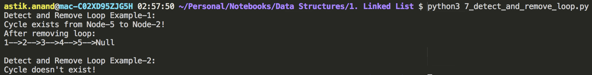

###### **Complexity:**

- **Time:** **O(n)** 
- **Auxilliary Space:** **O(1)**


**Note:** The problem can also be solved in O(n) using hashing the visited node address but it will take O(N) space. 

<br>

<br>

## 8. Circular linked list insertion

###### **Problem:**

Insert a node in circular linked list.

> **Example:**
>
> Input: 1->2->3->4->5->1    num=6    Output: 6->1->2->3->4->5->6 

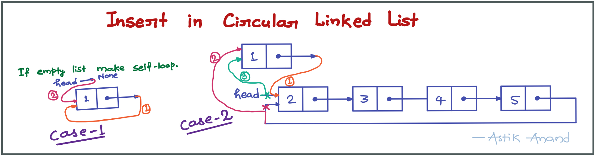

###### Approach:

- Make a new_node and take current_node as starting node.
- **Case-1: If this is first node being inserted make the self loop.**
    1. Make the next of new_node point to new_node itself (self-loop).
    2. Point the head to new_node.
- **Case-2: Insert at starting before head.**
    1. Make the next of new_node point to where head was pointing earlier.
    2. Find the last node and make last_node's next point to new_node.
    3. Point the head to new_node.

###### **Implementation:**

```python
class Node:
    def __init__(self, data):
        self.data = data
        self.next = None


class CircularLinkedList:
    def __init__(self):
        self.head = None
    

    def push(self, data):
        current_node = self.head
        new_node = Node(data)

        #### Case-1: If this is first node being inserted make the self loop.
        if current_node is None:
            # (1) Make the next of new_node point to new_node itself (self-loop).
            new_node.next = new_node
            # (2) Point the head to new_node.
            self.head = new_node
        #### Case-2: Insert at starting before head.
        else:
            # (1) Make the next of new_node point to where head was pointing earlier.
            new_node.next = self.head
            # (2) Find the last node and make last_node's next point to new_node.
            last_node = self.head
            while(last_node.next != self.head):
                last_node = last_node.next
            last_node.next = new_node
            # (3) Point the head to new_node.
            self.head = new_node


    def print_list(self):
        temp = self.head
        while(temp.next != self.head):
            print("{}-->".format(temp.data), end="")
            temp = temp.next
        print("{}-->{}".format(temp.data, temp.next.data))
    


print("Original Circular Linked List:")
cll = CircularLinkedList()
cll.push(5)
cll.push(4)
cll.push(3)
cll.push(2)
cll.push(1)
cll.print_list()
print("\nCircular Linked List After Insertion of 6:")
cll.push(6)
cll.print_list()

```

**Output:**

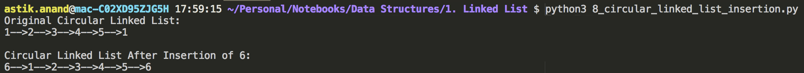

###### **Complexity:**

- **Time:** **O(1)**
- **Auxilliary Space:** **O(1)**

<br>

<br>

## 9. Split a circular linked list in 2 halves***

###### **Problem:**

Split a circular linked list into 2 circular list of equal sizes.

If there are odd number of nodes, then first list should contain one extra.


###### **Approach:**

- If **no nodes** then just **return**. 
- Use **hare & tortoise approach** to find the **middle** and **last node** using fast_ptr = fast_ptr.next.next and slow_ptr = slow_ptr.next both starting from head. 
- If Even no. of nodes shift the fast_ptr to point to last using fast_ptr = fast_ptr.next.
- **Make second half circular:**
    - start = slow_ptr.next and end = fast_ptr
    - cll_2.head = fast_ptr.next = slow_ptr.next
- **Make first half circular**
    - start = head and end = slow_ptr

###### **Implementation:**

```python
class Node:
    def __init__(self, data):
        self.data = data
        self.next = None


class CircularLinkedList:
    def __init__(self):
        self.head = None
    

    def push(self, data):
        new_node = Node(data)
        # new_node's next will point to the previous_first_node which head was pointing earlier
        new_node.next = self.head

        # Only 1 node : self loop
        if self.head is None:  
            new_node.next = new_node
        else:
            # last_node's next will point to new_node
            last_node = self.head
            while(last_node.next != self.head): 
                last_node = last_node.next
            last_node.next = new_node 
        
        # Now the head will point to new_node
        self.head = new_node


    def print_list(self):
        temp = self.head
        while(temp.next != self.head):
            print("{}-->".format(temp.data), end="")
            temp = temp.next
        print("{}".format(temp.data))
    

    def split_into_halves(self, second_cll):
        if(self.head is None):
            return

        fast_ptr = slow_ptr = self.head
        # If Odd no. of nodes in then fast_ptr->next becomes head and 
        # if Even no. of nodes fast_ptr->next->next becomes head 
        while(fast_ptr.next!=self.head and fast_ptr.next.next!=self.head):
            fast_ptr = fast_ptr.next.next
            slow_ptr = slow_ptr.next

        #======== Making 2nd half circular ========#
        # Start of 2nd half: slow_ptr.next
        # End of 2nd half : fast_ptr (Odd no. of nodes) || fast_ptr.next (Even no. of nodes)
        if fast_ptr.next.next == self.head: 
            fast_ptr = fast_ptr.next
        second_cll.head = slow_ptr.next
        fast_ptr.next = slow_ptr.next

        #======== Making 1st half circular ========#
        # Start of 1st half: head (self.head = self.head)
        # End of 1st half : slow_ptr)
        slow_ptr.next = self.head

        
        

print("Example-1(Odd Nodes): Original Circular Linked List:")
cll = CircularLinkedList()
cll.push(5)
cll.push(4)
cll.push(3)
cll.push(2)
cll.push(1)
cll.print_list()
print("Circular Linked List after Splitting:")
second_cll = CircularLinkedList()
cll.split_into_halves(second_cll)
cll.print_list()
second_cll.print_list()

print("\nExample-2(Even Nodes): Original Circular Linked List:")
cll = CircularLinkedList()
cll.push(6)
cll.push(5)
cll.push(4)
cll.push(3)
cll.push(2)
cll.push(1)
cll.print_list()
print("Circular Linked List after Splitting")
second_cll = CircularLinkedList()
cll.split_into_halves(second_cll)
cll.print_list()
second_cll.print_list()
```

**Output:**

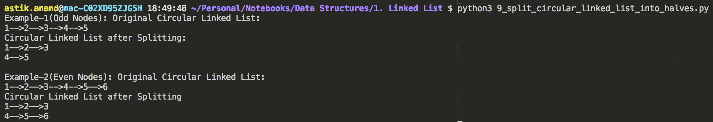

###### **Complexity:**

- **Time:** **O(n)** 
- **Auxilliary Space:** **O(1)**

<br>

<br>

## 10. Sorted insert in circular linked list

###### **Problem:**

Write a function to insert a new value in a **sorted** Circular Linked List. 

> **Examples:**
>
> Input:  2->4->7->8->2 
>
> Insert: 1       Output: 1-2->4->7->8->1               (At beginning) 
>
> Insert: 5       Output: 1->2->4->5->7->8->1           (In between) 
>
> Input:  9       Output: 1->2->4->5->7-->8->9->1       (At last) 

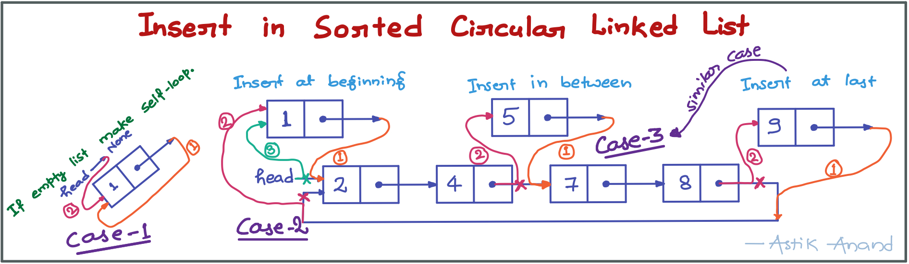

###### **Approach:**

- Make a new_node and take current_node as starting node.
- **Case-1: If this is first node being inserted make the self loop.**
    1. Make the next of new_node point to new_node itself (self-loop).
    2. Point the head to new_node.
- **Case-2: Insert at starting before head.**
    1. Make the next of new_node point to where head was pointing earlier.
    2. Find the last node and make last_node's next point to new_node.
    3. Point the head to new_node.
- **Case-3:** **Insert by searching (linear search) the appropriate place to insert.**
    1. Make the next of new_node point to where current was pointing earlier (current.next).
    2. Make the next of current_node point to new_node.

###### **Implementation:**

```python
class Node:
    def __init__(self, data):
        self.data = data
        self.next = None


class CircularLinkedList:
    def __init__(self):
        self.head = None
    

    def sorted_insert(self, data):
        current_node = self.head
        new_node = Node(data)

        #### Case-1: If this is first node being inserted make the self loop.
        if current_node is None:
            # (1) Make the next of new_node point to new_node itself (self-loop).
            new_node.next = new_node
            # (2) Point the head to new_node.
            self.head = new_node
        
        #### Case-2: Insert at starting before head.
        elif(data <= current_node.data):
            # (1) Make the next of new_node point to where head was pointing earlier.
            new_node.next = self.head

            # (2) Find the last node and make last_node's next point to new_node.
            last_node = self.head
            while(last_node.next != self.head): 
                last_node = last_node.next
            last_node.next = new_node

            # (3) Point the head to new_node.
            self.head = new_node
        
        #### Case-3: Insert by searching (linear search) the appropriate place to insert.
        else:
            while( current_node.next != self.head and data > current_node.next.data):
                current_node = current_node.next
            
            # (1) Make the next of new_node point to where current was pointing earlier (current.next).
            new_node.next = current_node.next
            # (2) Make the next of current_node point to new_node.
            current_node.next = new_node


    def print_list(self):
        temp = self.head
        while(temp.next != self.head):
            print("{}-->".format(temp.data), end="")
            temp = temp.next
        print("{}-->{}".format(temp.data, temp.next.data))
    


print("Original Circular Linked List:")
cll = CircularLinkedList()
cll.sorted_insert(4)
cll.sorted_insert(2)
cll.sorted_insert(8)
cll.sorted_insert(7)
cll.print_list()
print("\nInsertion at Beginning (1):")
cll.sorted_insert(1)
cll.print_list()
print("\nInsertion in Between (5):")
cll.sorted_insert(5)
cll.print_list()
print("\nInsertion at Last(9):")
cll.sorted_insert(9)
cll.print_list()


```

**Output:**

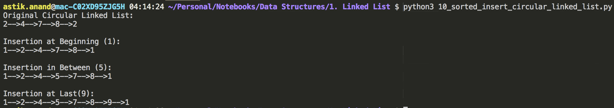

###### **Complexity:**

- **Time:** **O(n)** 
- **Auxilliary Space:** **O(1)**

<br>

<br>

------

<a href="string" class="prev-button">&larr; Previous: String</a>          

<a href="stack" class="next-button">Next: Stack &rarr;</a>

