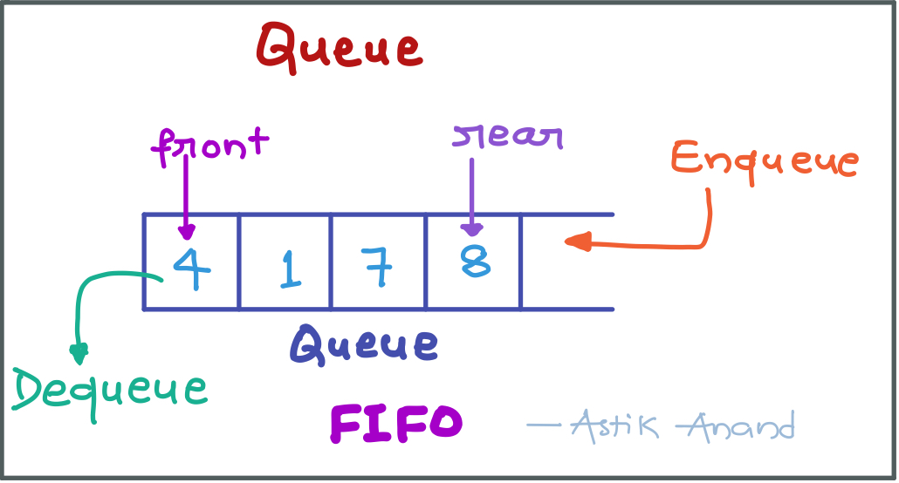
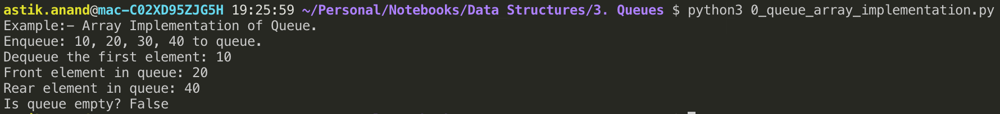
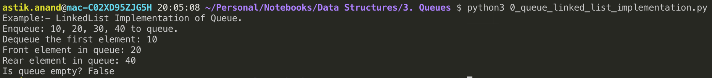
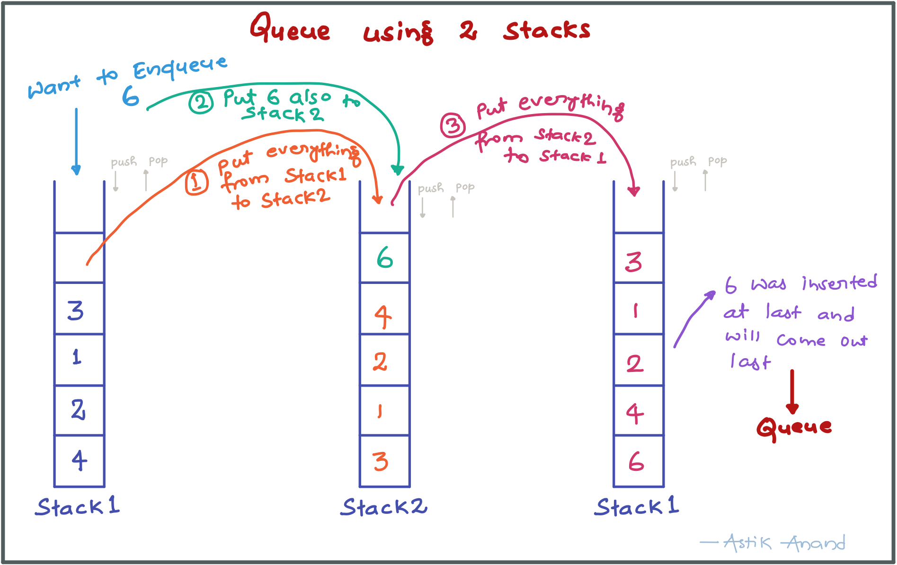
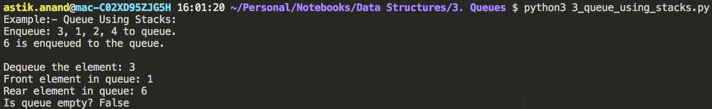
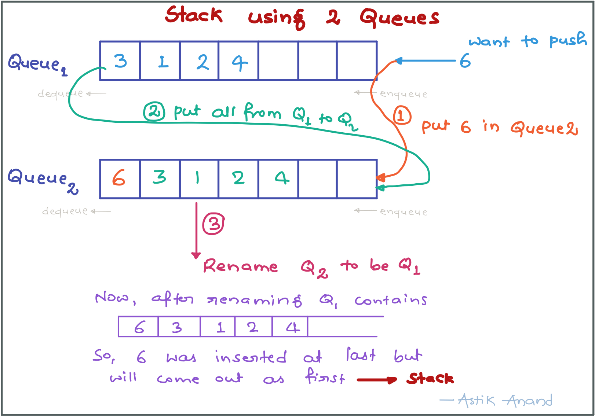
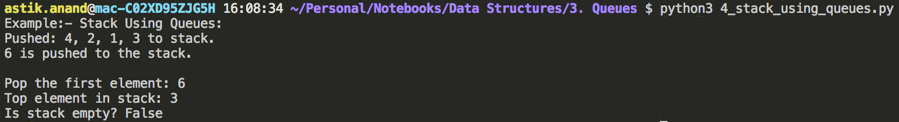
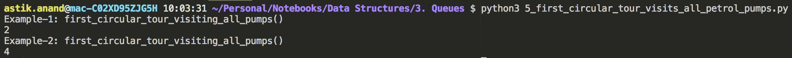
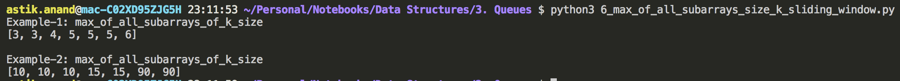
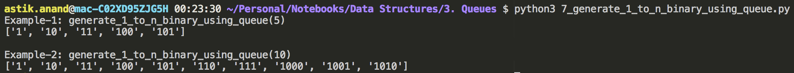

# Queue

###### What is Queue ?

- Like Stack, **Queue** is a linear structure which follows a particular order in which the operations are performed. The order is First In First Out (**FIFO**).



###### **Practical Understanding:**

- An example of queue is any queue of consumers for a resource where the consumer that came first is served first.

###### **Difference b/w Stack & Queue:**

- The difference between stacks and queues is in removing.
- In a stack we remove the item the most recently added; in a queue, we remove the item the least recently added.

###### **Operations:**

- **enqueue(key):** Adds an item to the queue. If the queue is full, then it is said to be an Overflow condition. 
- **dequeue():** Removes an item from the queue. The items are popped in the same order in which they are pushed. If the queue is empty, then it is said to be an Underflow condition. 
- **front():** Get the front item from queue. 
- **rear():** Get the last item from queue. 

###### **Time Complexities:**

- Time complexity of all operations like enqueue(), dequeue(), isFull(), isEmpty(), front() and rear() is O(1).
- There is no loop in any of the operations.

###### **Implementation Ways:**

There are two ways to implement a stack:

1. **Using array**
2. **Using linked list**

#### Array implementation of Queue

- To implement any data structure we need to define all its operations.
- So here we need to define all the operations of queue i.e. enqueue(), dequeue(), front(), rear().
- For implementing queue, we need to keep track of two indices, front and rear.
- We enqueue an item at the rear and dequeue an item from front.
- If we simply increment front and rear indices, then there may be problems, front may reach end of the array.
- The solution to this problem is to increase front and rear in circular manner.

**Pros:** Easy to implement. Memory is saved as pointers are not involved.

**Cons:** It is not dynamic. It doesn’t grow and shrink depending on needs at runtime.

###### **Implementation**

```python
class Queue: 
    def __init__(self): 
        self.queue = []


    def is_empty(self):
        return len(self.queue) == 0
    

    def enqueue(self, data):
        self.queue.append(data)
    

    def dequeue(self):
        if(self.is_empty()):
            return "Empty Queue"
        return self.queue.pop(0)
    

    def front(self):
        if(self.is_empty()):
            return "Empty Queue"
        return self.queue[0]
    

    def rear(self):
        if(self.is_empty()):
            return "Empty Queue"
        return self.queue[-1]
  

print("Example:- Array Implementation of Queue.")
my_queue = Queue()
print("Enqueue: 10, 20, 30, 40 to queue.")
my_queue.enqueue(10)
my_queue.enqueue(20)
my_queue.enqueue(30)
my_queue.enqueue(40)
print("Dequeue the first element: {}".format(my_queue.dequeue()))
print("Front element in queue: {}".format(my_queue.front()))
print("Rear element in queue: {}".format(my_queue.rear()))
print("Is queue empty? {}".format(my_queue.is_empty()))
```

**Output:**



#### Linked List Implementation of Queue

- Just define all the operations of queue i.e. enqueue(), dequeue(), front(), rear().

**Pros:** The linked list implementation of stack can grow and shrink according to the needs at runtime.

**Cons:** Requires extra memory due to involvement of pointers.

###### **Implementation**

```python
class QueueNode:
    def __init__(self, data):
        self.data = data
        self.next = None


class Queue:
    def __init__(self):
        self.head = None
    

    def is_empty(self):
        return True if self.head is None else False


    def enqueue(self, data):
        new_queue_node = QueueNode(data)
        new_queue_node.next = self.head
        self.head = new_queue_node
    

    def dequeue(self):
        if(self.is_empty()):
            return "Empty Queue"
        
        if(self.head.next is None):
            dequeued_data = self.head.data
            self.head = None
            return dequeued_data
        
        temp = self.head
        while(temp.next.next):
            temp = temp.next
        
        dequeued_data = temp.next.data
        temp.next = None
        return dequeued_data
    

    def front(self):
        if(self.is_empty()):
            return "Empty Queue"

        temp = self.head
        while(temp.next):
            temp = temp.next
        
        return temp.data
    

    def rear(self):
        if(self.is_empty()):
            return "Empty Queue"
        return self.head.data


print("Example:- LinkedList Implementation of Queue.")
my_queue = Queue()
print("Enqueue: 10, 20, 30, 40 to queue.")
my_queue.enqueue(10)
my_queue.enqueue(20)
my_queue.enqueue(30)
my_queue.enqueue(40)
print("Dequeue the first element: {}".format(my_queue.dequeue()))
print("Front element in queue: {}".format(my_queue.front()))
print("Rear element in queue: {}".format(my_queue.rear()))
print("Is queue empty? {}".format(my_queue.is_empty()))
```

**Output:**




#### Applications of Queue

- Queue is used when things don’t have to be processed immediatly, but have to be processed in First InFirst Out order like Breadth First Search.
- This property of Queue makes it also useful in following kind of scenarios.
    1. When a resource is shared among multiple consumers.
        - Examples include CPU scheduling, Disk Scheduling.
    2. When data is transferred asynchronously (data not necessarily received at same rate as sent) between two processes.
        - Examples include IO Buffers, pipes, file IO, etc.


---

------

### Standard Queue Problems

## 1. Queue using Stacks***

###### **Problem:**

Given a **stack** data structure with **push** and **pop** operations. 

The task is to **implement a queue** using **instances of stack** data structure and **operations** on them. 

###### **Approach:**

- A queue can be implemented using 2 stacks.
- Let queue to be implemented be q and stacks used to implement q be stack1 and stack2, then q can be implemented in two ways:
    1. By making **enqueue()** operation costly. 
    2. By making **dequeue()** operation costly. 



###### **Algorithm with costly Enqueue:**

- **enqueue(q, x):** time complexity will be O(n)
    - While stack1 is not empty, push everything from stack1 to stack2.
    - Push x to stack1 (assuming size of stacks is unlimited).
    - Push everything back to stack1.
- **dequeue():** time will be O(1) 
    - If stack1 is empty then error.
    - Pop an item from stack1 and return it.

###### **Implementation:**

```python
from queue import LifoQueue

class Queue:
    def __init__(self):
        self.stack1 = LifoQueue()
        self.stack2 = LifoQueue()
    

    def enqueue(self, data):
        # (1) Put all the data first to stack2
        while(not self.stack1.empty()):
            self.stack2.put(self.stack1.get())

        # (2) Put the current data also to stack2
        self.stack2.put(data)
        
        # (3) Move evrything back to stack1 from stack2
        while(not self.stack2.empty()):
            self.stack1.put(self.stack2.get())
    

    def dequeue(self):
        if(self.stack1.empty()):
            print("Empty Queue")
            return 
        else:
            return self.stack1.get()
    

    def front(self):
        if(self.stack1.empty()):
            print("Empty Queue")
            return 
        else:
            return self.stack1.queue[-1]
    

    def rear(self):
        if(self.stack1.empty()):
            print("Empty Queue")
            return 
        else:
            return self.stack1.queue[0]
    

    def is_empty(self):
        return self.stack1.empty()

    

print("Example:- Queue Using Stacks:")
my_queue = Queue()
print("Enqueue: 3, 1, 2, 4 to queue.")
my_queue.enqueue(3)
my_queue.enqueue(1)
my_queue.enqueue(2)
my_queue.enqueue(4)
my_queue.enqueue(6)

print("6 is enqueued to the queue.\n")
print("Dequeue the element: {}".format(my_queue.dequeue()))
print("Front element in queue: {}".format(my_queue.front()))
print("Rear element in queue: {}".format(my_queue.rear()))
print("Is queue empty? {}".format(my_queue.is_empty()))
```

**Output:**




## 2. Stack using Queues***

###### **Problem:**

Given a **queue** data structure that supports standard operations like **enqueue()** and **dequeue()**. 

The task is to **implement a stack** data structure using only **instances of queue** and **queue operations** allowed on the instances. 

###### **Approach:**

- A stack can be implemented using 2 queues.
- Let queue to be implemented be q and stacks used to implement q be stack1 and stack2, then q can be implemented in two ways:
    1. By making **push()** operation costly. 
    2. By making **pop()** operation costly. 



###### **Algorithm with costly Push:**

- **push(s, x):**  time complexity will be O(n)
    - Enqueue x to q2
    - One by one dequeue everything from q1 and enqueue to q2.
    - Swap the names of q1 and q2
    - // Swapping of names is done to avoid one more movement of all elements from q2 to q1.
- **pop():**  time will be O(1)
    - Dequeue an item from q1 and return it.

###### **Implementation:**

```python
from queue import Queue

class Stack:
    def __init__(self):
        self.queue1 = Queue()
        self.queue2 = Queue()
    

    def push(self, data):
        # (1) Put the data first to queue2
        self.queue2.put(data)

        # (2) Put all the data from queue1 to queue2
        while(not self.queue1.empty()):
            self.queue2.put(self.queue1.get())
        
        # (3) Swap the names of two queues
        self.queue1, self.queue2 = self.queue2, self.queue1
    

    def pop(self):
        if(self.queue1.empty()):
            print("Stack Underflow")
            return 
        else:
            return self.queue1.get()
    

    def top(self):
        if(self.queue1.empty()):
            print("Stack Underflow")
            return 
        else:
            return self.queue1.queue[0]
    

    def is_empty(self):
        return self.queue1.empty()

    

print("Example:- Stack Using Queues:")
my_stack = Stack()
print("Pushed: 4, 2, 1, 3 to stack.")
my_stack.push(4)
my_stack.push(2)
my_stack.push(1)
my_stack.push(3)
my_stack.push(6)
print("6 is pushed to the stack.\n")

print("Pop the first element: {}".format(my_stack.pop()))
print("Top element in stack: {}".format(my_stack.top()))
print("Is stack empty? {}".format(my_stack.is_empty()))
```

**Output:**




## 3. Find first circular tour that visits all petrol pumps***

###### **Problem:**

- Suppose there is a circle. There are n petrol pumps on that circle.
- We are given two sets of data.
    1. The amount of petrol that every petrol pump has.
    2. Distance from that petrol pump to the next petrol pump.
- Calculate the first point from where a truck will be able to complete the circle (The truck will stop at each petrol pump and it has infinite capacity). 
- Assume for 1 litre petrol, the truck can go 1 unit of distance.
- Expected **time complexity** is **O(n)** and can use O(n) extra space.  

> **Example:**
>
> Input: {4, 6}, {6, 5}, {7, 3} and {4, 5}.        // 4 petrol pumps with amount of petrol and distance to next petrol pump 
>
> Output: 2                                   // The first point from where truck can make a circular tour is 2nd petrol pump.  

###### **Approach-1:**  

- A Simple Solution is to consider every petrol pumps as starting point and see if there is a possible tour.
- If we find a starting point with feasible solution, we return that starting point.
- **Time complexity:** **O(n^2)**. 

###### **Approach-2:**

- We can use a Queue to store the current tour.
- We first enqueue first petrol pump to the queue, we keep enqueueing petrol pumps till we either complete the tour, or current amount of petrol becomes negative.
- If the amount becomes negative, then we keep dequeueing petrol pumps till the current amount becomes positive or queue becomes empty.
- **Time complexity:** **O(n)** and **Auxiliary Space:** **O(n)** 
- To avoid O(n) space, instead of creating a separate queue, we use the given array itself as queue.
- We maintain two index variables start and end that represent rear and front of queue.
- **Time complexity:** **O(n)** and **Auxiliary Space:** **O(1)** 

###### **Implementation:**

```python
def first_circular_tour_visiting_all_pumps(pumps):
    n = len(pumps) 
    # Consider first petrol pump as starting point 
    start = 0 
    end = 1 
      
    curr_petrol = pumps[start][0] - pumps[start][1]
      
    # Run a loop while all petrol pumps are not visited
    while(end != start): 
        # While curr_petrol is < 0, dequeue till it become positive.  
        while(curr_petrol<0 and start!=end): 
            # Remove starting petrol pump. Change start 
            curr_petrol -= pumps[start][0] - pumps[start][1]
            start = (start +1)%n 
              
            # If 0 is being considered as start again, then there is no possible solution 
            if start == 0: 
                return -1
  
        # Add a petrol pump to current tour 
        curr_petrol += pumps[end][0] - pumps[end][1] 
        end = (end +1) % n 
  
    return start+1  


print("Example-1: first_circular_tour_visiting_all_pumps()")
pumps = [(4, 6), (6, 5), (7, 3), (4, 5)]
print(first_circular_tour_visiting_all_pumps(pumps))

print("Example-2: first_circular_tour_visiting_all_pumps()")
pumps = [(4, 6), (6, 5), (3, 5), (10, 5)]
print(first_circular_tour_visiting_all_pumps(pumps))
```

**Output:**



###### **Complexity:**

- **Time:** **O(n) :** Seems to be more than linear at first look. If we consider the items between start and end as part of a circular queue, we can observe that every item is enqueued at most two times to the queue. The total number of operations is proportional to total number of enqueue operations. Therefore the time complexity is O(n).
- **Auxilliary Space:** **O(1)**


## 4. Maximum of all subarrays of size k (Sliding Window Maximum)

###### **Problem:**

Given an array an integer k, find the maximum for each and every contiguous subarrays of size k.

> **Examples:**
>
> Input:   1, 2, 3, 1, 4, 5, 2, 3, 6     and k=3 
>
> Output:  3, 3, 4, 5, 5, 5, 6 
>
> 
>
> Input:   8,  5,  10, 7,  9,  4,  15, 12, 90, 13     and k=4 
>
> Output:  10, 10, 10, 15, 15, 90, 90 

###### **Approach-1:**

- Run two loops. In the outer loop take all subarrays of size k.
- In the inner loop, get the maximum of the current subarray.
- **Time Complexity: O(nk)**

###### **Approach-2:**

- First get the initial current_window of of first k elements and the first element of max_subarray is max of initial window.
- Now start from k+1th element, and in current_window:
    - dequeue the first element from current_window and enqueue the k+1th element
    - get max of current_window and put in max_subarray and continue till the last element.

###### Implementation

```python
def max_of_all_subarrays_of_k_size(arr, k):
    n = len(arr)
    max_subarray = []

    # Initially current window
    current_window = arr[:k]

    # First get the initial current_window of of first k elements,
    # the first element of max_subarray is max of initial window.
    max_subarray.append(max(current_window))

    # Now start from k+1th element, and in current_window
    # dequeue the first element from current_window and enqueue the k+1th element
    # get max of current_window and put in max_subarray and continue till the last element.
    for i in range(k, n):
        # Dequeue the first element and enqueue the next element
        current_window.pop(0)
        current_window.append(arr[i])

        max_subarray.append(max(current_window))
    
    return max_subarray


print("Example-1: max_of_all_subarrays_of_k_size")
arr = [1, 2, 3, 1, 4, 5, 2, 3, 6]
print(max_of_all_subarrays_of_k_size(arr, 3))

print("\nExample-2: max_of_all_subarrays_of_k_size")
arr = [8,  5,  10, 7,  9,  4,  15, 12, 90, 13]
print(max_of_all_subarrays_of_k_size(arr, 4))
```

**Output:**



###### **Complexity:**

- **Time:** **O(nlogk) :** Can do it in O(n) by avoiding finding max in current window by storing useful values in deque which stores max at top. 
- **Auxilliary Space:** **O(1)**


## 5. Generate Binary Numbers from 1 to N (An Interesting Method)

###### **Problem:**

Given a number n, write a function that generates and prints all binary numbers with decimal values from 1 to n.

> **Examples:**
>
> Input: n = 2 
>
> Output: 1, 10 
>
> 
>
> Input: n = 5 
>
> Output: 1, 10, 11, 100, 101 

###### **Approach:** 

- We can use queue data structure to achieve this. 
- Start with 1, append 0 and enqueue and append 1 and enqueue.
- Dequeue one element and repeat the procedure.

###### **Algorithm:**

- Create an empty queue of strings
- Enqueue the first binary number “1” to queue.
- Now run a loop for generating and printing n binary numbers.
    - Dequeue and Print the front of queue.
    - Append “0” at the end of front item and enqueue it.
    - Append “1” at the end of front item and enqueue it.

###### **Implementation:**

```python
def generate_1_to_n_binary_using_queue(n):
    binary = []
    queue = ["1"]

    while(n > 0):
        # Dequeue from the queue, add current to the list of binary numbers, then
        # append "0" to it and enqueue and again append "1" to it and enqueue to queue
        current = queue.pop(0)
        binary.append(current)

        queue.append(current+"0")
        queue.append(current+"1")
        
        n -= 1
    
    return binary


print("Example-1: generate_1_to_n_binary_using_queue(5)")
print(generate_1_to_n_binary_using_queue(5))
        
print("\nExample-2: generate_1_to_n_binary_using_queue(10)")
print(generate_1_to_n_binary_using_queue(10))
```



###### **Complexity:**

- **Time:** **O(n)**
- **Auxilliary Space:** **O(1)**


------

<a href="stack" class="prev-button">&larr; Previous:  Stack</a>        <a href="matrix" class="next-button">Next: Matrix &rarr;</a>

