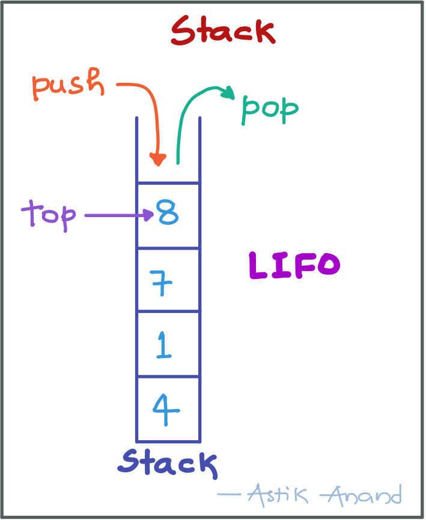
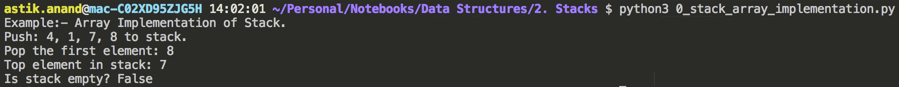
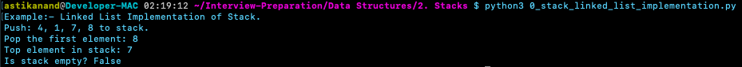
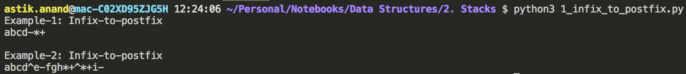
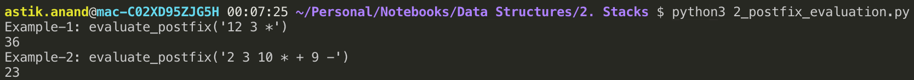
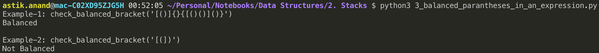
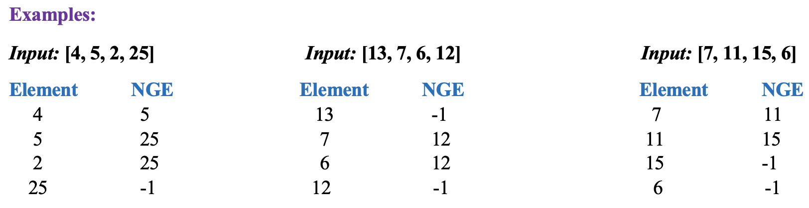
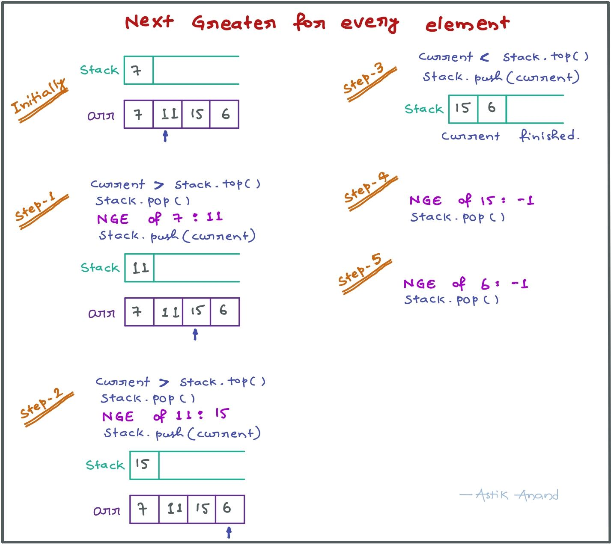
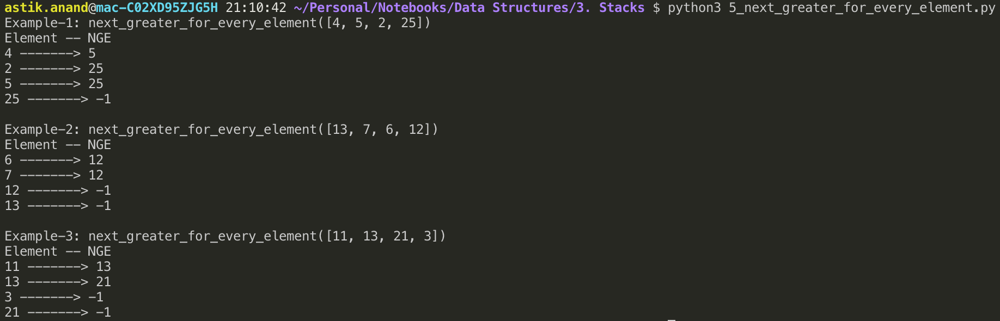

# Stack

###### What is Stack ?

- It is a linear data structure which follows a particular order in which the operations are performed. 
- The order is of type last in and first out (LIFO) or (FILO).



###### **Practical Understanding:**

- There are many real life examples of stack:
- Consider the simple example of plates stacked over one another in canteen.
- The plate which is at the top is the first one to be removed, i.e. the plate which has been placed at the bottommost position remains in the stack for the longest period of time.
- So, it can be simply seen to follow LIFO/FILO order.

###### **Operations:**

- **push(key):** Adds an item in the stack. If the stack is full, then it is said to be an Overflow condition.
- **pop():** Removes an item from the stack. The items are popped in the reversed order in which they are pushed. If the stack is empty, then it is said to be an Underflow condition.
- **Peek() or Top():** Returns top element of stack.
- **isEmpty():** Returns true if stack is empty, else false.

###### **Time Complexities:**

- push(), pop(), isEmpty() and peek() all take **O(1)** time. 
- We do not run any loop in any of these operations.

###### **Implementation Ways:**

There are two ways to implement a stack:

1. **Using array**
2. **Using linked list**

<br>

#### Array Implementation of Stack

- To implement any data structure we need to define all its operations.
- So here we need to define all the operations of stack i.e. push(), pop(), top(), is_empty().
- **Pros:** Easy to implement. Memory is saved as pointers are not involved.
- **Cons:** It is not dynamic. It doesn’t grow and shrink depending on needs at runtime.

###### **Implementation**

```python
class Stack:
    def __init__(self):
        self.stack = []
    

    def is_empty(self):
        return len(self.stack) == 0

    
    def push(self, data):
        self.stack.append(data)
    

    def pop(self):
        if(self.is_empty()):
            return "Underflow"
        return self.stack.pop()
    

    def top(self):
        if(self.is_empty()):
            return "Underflow"
        return self.stack[-1]


print("Example:- Array Implementation of Stack.")
my_stack = Stack()
print("Push: 4, 1, 7, 8 to stack.")
my_stack.push(4)
my_stack.push(1)
my_stack.push(7)
my_stack.push(8)
print("Pop the first element: {}".format(my_stack.pop()))
print("Top element in stack: {}".format(my_stack.top()))
print("Is stack empty? {}".format(my_stack.is_empty()))
```

**Output:**



<br>

#### Linked List Implementation of Stack

- Just define all the operations of stack i.e. push(), pop(), top(), is_empty().
- **Pros:** The linked list implementation of stack can grow and shrink according to the needs at runtime.
- **Cons:** Requires extra memory due to involvement of pointers.

###### Implementation

```python
class StackNode:
    def __init__(self, data):
        self.data = data
        self.next = None


class Stack:
    def __init__(self):
        self.head = None
    

    def is_empty(self):
        return True if self.head is None else False


    def push(self, data):
        new_stack_node = StackNode(data)
        new_stack_node.next = self.head
        self.head = new_stack_node
    

    def pop(self):
        if(self.head is None):
            return "Underflow"
        
        temp = self.head
        self.head = self.head.next
        return temp.data
    

    def top(self):
        if(self.head is None):
            return "Underflow"
        
        return self.head.data


print("Example:- Linked List Implementation of Stack.")
my_stack = Stack()
print("Push: 4, 1, 7, 8 to stack.")
my_stack.push(4)
my_stack.push(1)
my_stack.push(7)
my_stack.push(8)
print("Pop the first element: {}".format(my_stack.pop()))
print("Top element in stack: {}".format(my_stack.top()))
print("Is stack empty? {}".format(my_stack.is_empty()))
```

**Output:**



<br>

#### Applications of Stack

- Stack is used to evaluate prefix, postfix and infix expressions.
- An expression can be represented in prefix, postfix or infix notation and stack can be used to convert one form of expression to another.
- Many compilers use a stack for parsing the syntax of expressions, program blocks etc. before translating into low level code.
- Parnthesis Checking
- Backtracking
- Recursive Function Calls


----

### Standard Stack Problems

## 1. Infix to Postfix Conversion***

###### **Problem:**

Given an infix expression conversation it to a postfix operation.

> **Example:**
>
> Input: `a+b*(c-d)`                Output: `abcd-*+ `
>
> Input: `a+b*(c^d-e)^(f+g*h)-i`   Output: `abcd^e-fgh*+^*+i-  `

**Infix expression: ** The expression of the form **a op b**. When an operator is in-between every pair of operands.

**Postfix expression**:  The expression of the form **a b op**. When an operator is followed for every pair of operands.


**Why postfix representation of the expression?**

- The compiler scans the expression either from left to right or from right to left.
- *Consider the below expression:* ***a + b \* c + d*** 
    - The compiler first scans the expression to evaluate the expression b * c, then again scan the expression to add a to it. 
    - The result is then added to d after another scan.
- The repeated scanning makes it very in-efficient.
- It is better to convert the expression to postfix(or prefix) form before evaluation.
- The corresponding expression in postfix form is: abc*+d+.
- The postfix expressions can be evaluated easily using a stack. 

###### Algorithm

1. Scan the infix expression from left to right.
2. If the scanned character is an operand, output it.
3. Else,
    - If the precedence of the scanned operator is greater than the precedence of the operator in the stack(or the stack is empty), push it.
    - Else, Pop the operator from the stack until the precedence of the scanned operator is less-equal to the precedence of the operator residing on the top of the stack. Push the scanned operator to the stack.
4. If the scanned character is an ‘(‘, push it to the stack.
5. If the scanned character is an ‘)’, pop and output from the stack until an ‘(‘ is encountered.
6. Repeat steps 2-6 until infix expression is scanned.
7. Pop and output from the stack until it is not empty.

###### Implementation

```python
def infix_to_postfix(expr):
    operator_precedence = {'+':1, '-':1, '*':2, '/':2, '%':2, '^':3}
    # operator_stack
    stack = []

    # Start the scan from left to right
    for char in expr:
        # If scanned char is not an operand, then output it.
        if char.isalpha():
            print("{}".format(char), end="")

        # Else if the scanned character is an ‘(‘, push it to the stack.
        elif(char == "("):
            stack.append(char)

        # If the scanned character is an ‘)’, pop and output from the stack until an ‘(‘ is encountered.
        elif(char == ")"):
            while(len(stack)>0 and stack[-1] != "("):
                print("{}".format(stack.pop()), end="")
            stack.pop()

        # Pop the operator from the stack until operator_precedence[char] <= operator_precedence[stack[-1]]
        # Push the scanned operator to the stack
        else:
            while(len(stack)>0 and stack[-1]!="(" 
                and operator_precedence[char] <= operator_precedence[stack[-1]]):
                print("{}".format(stack.pop()), end="")

            # If either stack is empty or precedence of scanned opeartor is greater
            # than the top of stack, Push it to stack
            stack.append(char)

    # Pop and output from the stack until it is not empty.
    while(len(stack)>0):
        print("{}".format(stack.pop()), end="")
    print()


print("Example-1: Infix-to-postfix")
infix_to_postfix("a+b*(c-d)")

print("\nExample-2: Infix-to-postfix")
infix_to_postfix("a+b*(c^d-e)^(f+g*h)-i")
```

**Output:**




###### **Complexity:**

- **Time:** **O(n)** : n is size of expression 
- **Auxilliary Space:** **O(n)**

<br>

<br>

## 2. Postfix Evaluation

###### **Problem:**

Evaluate the value of the postfix expression.

> **Example:**
>
> ***Input:***  `12 3 *`    &nbsp;***Output:*** `36`
>
> ***Input:***  `2 3 10 * + 9 -`    &nbsp;***Output:*** `23`


**Why postfix evaluation?**

- The Postfix notation is used to represent algebraic expressions.
- The expressions written in postfix form are evaluated faster compared to infix notation as parenthesis are not required in postfix. 

###### **Algorithm**

1. Create a stack to store operands.
2. Scan the given expression and do following for every scanned element.
    - If the element is a number, push it into the stack
    - If the element is a operator, pop operands for the operator from stack. Evaluate the operator and push the result back to the stack
3. When the expression is ended, the number in the stack is the final answer

###### **Implementation:**

```python
def evaluate_postfix(expression):
    expr = expression.split()
    stack = []
    for i in expr:
        if i.isdigit():
            stack.append(i)
        else:
            val1 = stack.pop() 
            val2 = stack.pop()
            stack.append(str(eval(val2 + i + val1)))

    print(stack.pop())


print("Example-1: evaluate_postfix('12 3 *')")
evaluate_postfix('12 3 *')

print("Example-2: evaluate_postfix('2 3 10 * + 9 -')")
evaluate_postfix('2 3 10 * + 9 -')
```

**Output:**



###### **Complexity:**

- **Time:** **O(n)** : n is size of expression 
- **Auxilliary Space:** **O(n)**

<br>

<br>

## 3. Check for balanced parentheses in an expression

###### **Problem:**

Given an expression string exp , write a program to examine whether the pairs and the orders of `"{", "}", "(", ")", "[", "]"` are correct in expression.

> **Example:**
>
> ***Input:***  `"[()]{}{[()()]()}"` &nbsp;***Output:*** Balanced
>
> ***Input:***  `"[(])"` &nbsp; ***Output:*** Not Balanced

###### **Algorithm:**

1. Declare a stack.
2. Now traverse the expression.
    - If the current character is a starting bracket (**‘(‘ or ‘{‘ or ‘[‘**) then push it to stack.
    - If the current character is a closing bracket (**‘)’ or ‘}’ or ‘]’**) then pop from stack and if the popped character is the matching starting bracket then fine else parenthesis are not balanced.
3. After complete traversal, if there is some starting bracket left in stack then “not balanced”

###### **Implementation:**

```python
def check_balanced_bracket(expression):
    stack = []
    balanced = True

    for bracket in expression:
        # If current is opening bracket push closing bracket to stack
        if bracket=='(':
            stack.append(')')
        elif bracket=='{':
            stack.append('}')
        elif bracket=='[':
            stack.append(']')
        # If current is not opening bracket or the bracket doesnt match the top of stack -> Unbalanced
        elif not stack or stack.pop() != bracket:
           balanced = False
           break
    
    # If Stack is empty it is balanced else not balanced
    if stack or not balanced:
        print("Not Balanced")
    else:
        print("Balanced")


print("Example-1: check_balanced_bracket('[()]{}{[()()]()}')")
check_balanced_bracket('[()]{}{[()()]()}')
print("\nExample-2: check_balanced_bracket('[(])')")
check_balanced_bracket('[(])')
```

**Output:**



###### **Complexity:**

- **Time:** **O(n)** : n is parenthesis size 
- **Auxilliary Space:** **O(n)**

<br>

<br>

## 4. Next greater for every element***

###### **Problem:**

Given an array, print the Next Greater Element (NGE) for every element. The Next greater Element for an element x is the first greater element on the right side of x in array. Elements for which no greater element exist, consider next greater element as -1.



##### Notes:

- For any array,  rightmost element always has next greater element as -1.
- For an array which is sorted in decreasing order, all elements have next greater element as -1.

###### Approach-1: Brute-Force

- Use two loops: The outer loop picks all the elements one by one. 
- The inner loop looks for the first greater element for the element picked by the outer loop. 
- If a greater element is found then that element is printed as next, otherwise -1 is printed.
- **Time Complexity: O(n<sup>2</sup>)**

###### Approach-2: Using Stacks

1. Push the first element to stack.
2. Pick rest of the elements one by one and follow the following steps in loop.
    - Mark the current element as current.
    - If stack is not empty, then pop an element from stack as popped_element.
        - If popped_element is smaller than current, then current is NGE for popped element.
        - keep popping while popped elements are smaller than current and stack is not empty.
        - If popped_element is greater than next, then push the popped_element back to stack.
    - Finally, push current to stack so that we can find next greater for it.
3. After iterating over the loop, the remaining elements in stack do not have the next greater so -1 for them.

> **Example-Run:**



###### **Implementation:**

```python
def next_greater_for_every_element(arr):
    n = len(arr)
    stack = []
  
    # Push the first element to stack 
    stack.append(arr[0])

    print("Element -- NGE")
  
    # Iterate for rest of the elements 
    for i in range(1, n): 
        current = arr[i] 

        # If stack is not empty, then pop an element from stack as popped_element
        if stack:  
            popped_element = stack.pop() 
  
            # If popped_element is smaller than current, then current is NGE for popped element
            # keep popping while popped elements are smaller than current and stack is not empty
            while popped_element < current: 
                print("{} -------> {}".format(popped_element, current))
                if not stack:
                    break
                popped_element = stack.pop()
  
            # If popped_element is greater than next, then push the popped_element back to stack
            if popped_element > current:
                stack.append(popped_element) 
  
        # Push current to stack so that we can find next greater for it.
        stack.append(current)
    
    # After iterating over the loop, the remaining elements in stack do not have the next greater 
    # so -1 for them
    while stack: 
        popped_element = stack.pop()
        current = -1
        print("{} -------> {}".format(popped_element, current))


print("Example-1: next_greater_for_every_element([4, 5, 2, 25])")
next_greater_for_every_element([4, 5, 2, 25])
print("\nExample-2: next_greater_for_every_element([13, 7, 6, 12])")
next_greater_for_every_element([13, 7, 6, 12])
print("\nExample-3: next_greater_for_every_element([11, 13, 21, 3])")
next_greater_for_every_element([11, 13, 21, 3])
```

**Output:**



###### **Complexity:**

- **Time:** **O(n)** : n is array size 
- **Auxilliary Space:** **O(n)**


<br>

<br>

------

<a href="linked-list" class="prev-button">&larr; Previous:  Linked List</a>            <a href="queue" class="next-button">Next: Queue &rarr;</a> 

