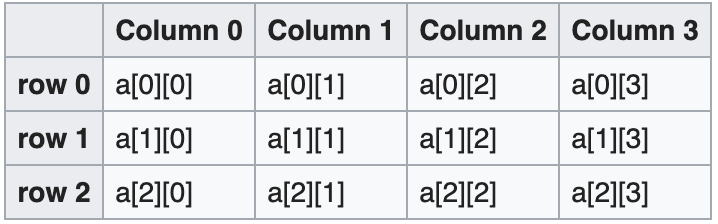
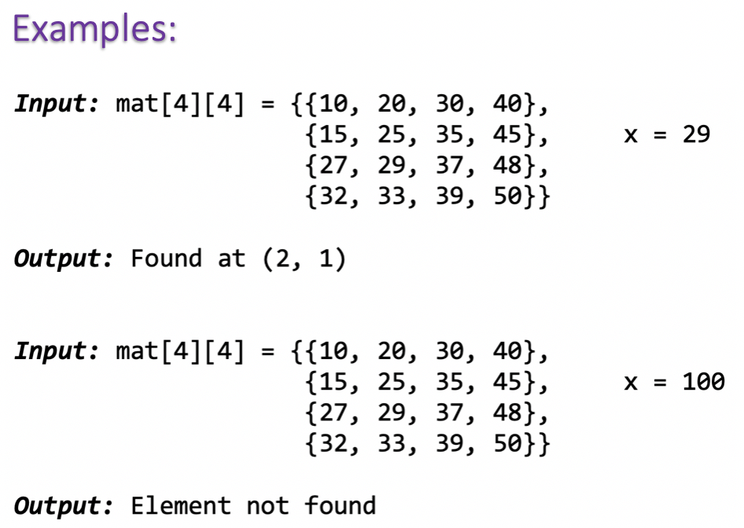
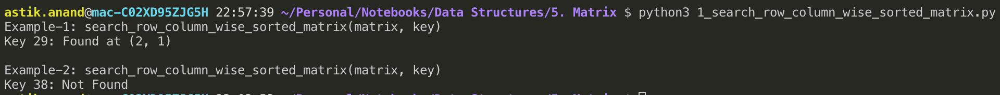
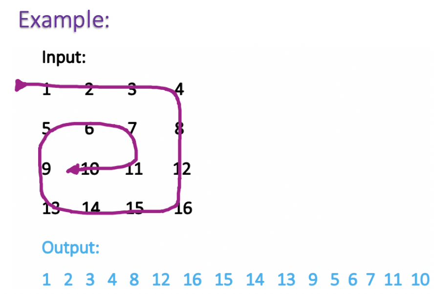
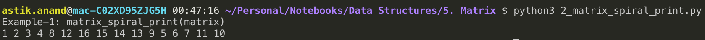
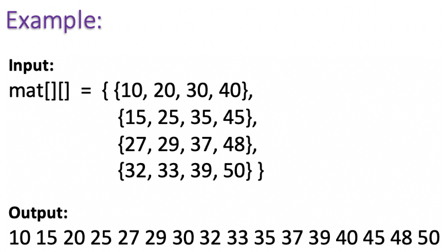

# Matrix

###### What is Matrix ?

- It is a way to store data in an organized form in the form of rows and columns. 
- A two-dimensional array can function exactly like a matrix and can be visualized as a table consisting of rows and columns.

**Example: `matrix[3][4]`**



<br>

#### Applications of Matrix

- Some AI programs use matrices and vectors.
- Neural Networks rely heavily on matrices and matrix operations.
- Some localization algorithms also use matrix operations.
- Matrices, and in general Linear Algebra, are the language and mathematical tools computer scientists constantly use.


----

### Standard Matrix Problems

## 1. Search in a Row-wise & Column-wise sorted Matrix***

###### Problem:

Given an n x n matrix and a number x, find the position of x in the matrix if it is present in it. Otherwise, print “Not Found”. 

In the given matrix, every row and column is sorted in increasing order.

The algorithm should have linear time complexity.



###### Approach-1: Brute-Force

- A simple solution is to search one by one.
- **Time complexity: O(n<sup>2</sup>)**


###### Approach-2: Efficient

- **Start the search from the top-right corner of the array.**
- **There are 3 possible cases:**
    1. The number we are searching for is greater than the current number. This will ensure, that all the elements in the current row is smaller than the number we are searching for as we are already at the right-most element and the row is sorted. Thus, the entire row gets eliminated and we continue our search on the next row. Here elimination means we won’t search on that row again.
    2. The number we are searching for is smaller than the current number. This will ensure, that all the elements in the current column is greater than the number we are searching for. Thus, the entire column gets eliminated and we continue our search on the previous column i.e. the column at the immediate left.
    3. The number we are searching for is equal to the current number. This will end our search.


###### Implementation

```python
def search_row_column_wise_sorted_matrix(matrix, key):
    n = len(matrix)

    # Start with top right corner
    i = 0; j = n - 1

    while i < n and j >= 0:
        # If righmost element is lesser than key, skip that row
        if matrix[i][j] < key:
            i += 1
        # Else if righmost element is greater than key, skip that column
        elif matrix[i][j] > key: 
            j -= 1
        # Else if righmost element is equal to key, the key is found.
        else:
            print("Key {}: Found at ({}, {})".format(key, i, j)) 
            return
      
    print("Key {}: Not Found".format(key))
  


mat = [ [10, 20, 30, 40], 
        [15, 25, 35, 45], 
        [27, 29, 37, 48], 
        [32, 33, 39, 50] ]

print("Example-1: search_row_column_wise_sorted_matrix(matrix, key)")
search_row_column_wise_sorted_matrix(mat, 29)

print("\nExample-2: search_row_column_wise_sorted_matrix(matrix, key)")
search_row_column_wise_sorted_matrix(mat, 38)
```

**Output:**



###### Complexity:

- **Time:** **O(N)** 
- **Auxilliary Space:** **O(1)**

<br>

<br>

## 2. Print Matrix in spiral form***

###### Problem

Print a matrix in spiral form.

> **Example:**



###### Approach: Use 4  for loops to print all 4 directions.

- Can be solved using four for loops which prints all the elements.
- Every for loop defines a single direction movement along with the matrix.
- **1st for loop** represents the movement from **left to right.**
- **2nd for loop** represents the movement from **top to bottom**.
- **3rd for loop**  represents the movement from the **right to left**.
- **4th for loop** represents the movement from **bottom to up**.


###### Implementation

```python
def matrix_spiral_print(matrix):
    ## Some Important Variables
    #   • row_start - starting row index
    #   • row_end - ending row index
    #   • col_start - starting column index
    #   • col_end - ending column index
    #   • i - iterator
    row_start = 0; row_end = len(matrix)
    col_start = 0; col_end = len(matrix[0])
  
    while (row_start<row_end and col_start<col_end) : 
        # Print the first row, after printing done increment the row_start
        for i in range(col_start, col_end) : 
            print(matrix[row_start][i], end = " ") 
              
        row_start += 1
  
        # Print the last column, after printing done decrement the col_end
        for i in range(row_start, row_end) : 
            print(matrix[i][col_end-1], end = " ")

        col_end -= 1
  
        # Print the last row, after printing done decrement the row_end
        if row_start < row_end: 
            for i in range(col_end - 1, (col_start - 1), -1) : 
                print(matrix[row_end - 1][i], end = " ") 
              
            row_end -= 1
          
        # Print the first column, after printing done increment the col_start
        if (col_start < col_end) : 
            for i in range(row_end - 1, row_start - 1, -1) : 
                print(matrix[i][col_start], end = " ") 
              
            col_start += 1
        
    print()


print("Example-1: matrix_spiral_print(matrix)")
mat = [ [ 1,  2,  3,  4],
        [ 5,  6,  7,  8],
        [ 9, 10, 11, 12],
        [13, 14, 15, 16] ]
matrix_spiral_print(mat)
```

**Output:**



###### Complexity:

- **Time:** **O(MN)** 
- **Auxilliary Space:** **O(1)**


<br>

## 3. Print elements in sorted order in row and column wise sorted matrix

###### Problem:

Given an n x n matrix, where every row and column is sorted in non-decreasing order.

Print all elements of matrix in sorted order.



###### Approach


###### Implementation


**Output:**


###### Complexity:

- **Time:** 
- **Auxilliary Space:**


<br>


##### Problems To Do:

- maximum size of square sub-matrix with sum <= K


<br>

------

<a href="queue" class="prev-button">&larr; Previous:  Queue</a>         <a href="binary-tree" class="next-button">Next: Binary Tree &rarr;</a>

