# Binary Tree

###### What are Trees ?

- Array, Linked List, Stack & Queues are Linear Data Structure
- But Trees are Hierarchical data structure.

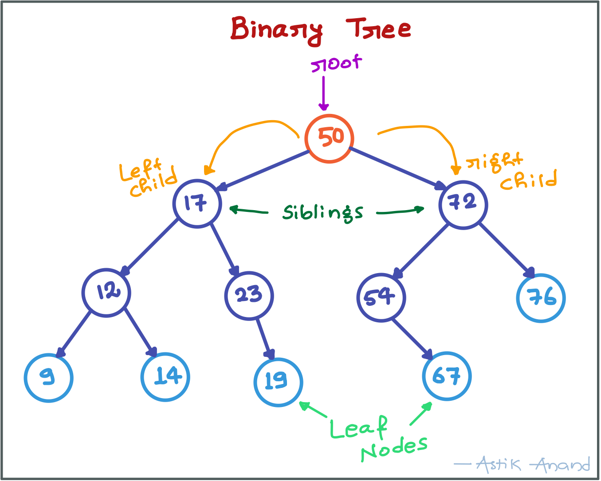

###### **Tree Vocabulary:**

- **node:** any element of a tree 
- **root:** Topmost node 
- **children:** nodes directly under a node 
- **parent:** node directly above the node or nodes 
- **leaves:** nodes with no children  

###### **Why trees?**

- To store information that naturally forms a hierarchy. Ex: **Linux filesystem**


- Trees (BST) provide moderate access/search (quicker than Linked List and slower than arrays).
- Trees provide moderate insertion/deletion (quicker than Arrays and slower than Unordered Linked Lists).
- Self-balancing search trees like **AVL** and **Red-Black** trees guarantee an upper bound of **O(Logn)** for insertion/deletion. 
- Like Linked Lists and unlike Arrays, Trees don’t have an upper limit on number of nodes as nodes are linked using pointers.

###### Properties of Binary Tree

- Max no. of nodes at level L: **2<sup>L-1</sup>**
- Max no. of nodes in a binary tree of height "h":  **2<sup>h</sup> – 1**

###### Types of Binary Trees

- **Full Binary Tree**:
    - Every node has 0 or 2 children
    - Leaf nodes = Internal nodes + 1
- **Complete Binary Tree:**
    - All levels are completely filled except possibly the last level and the last level has all keys as left as possible.
- **Perfect Binary Tree:**
    - All internal nodes have 2 children and all leaves are at same level.
- **Balanced Binary Tree:**
    - Height of the tree: **O(Log n)**
- **Degenerate Tree:**
    - Every internal node has 1 child.

#### Representation

- A tree whose elements have at most 2 children is called a binary tree. 
- Typically named as left and right child.

###### **Implementation:**

```python
class Node:
    def __init__(self, val):
        self.left = None
        self.right = None
        self.val = val
    

def print_inorder(root):
    if root:
        # First recur on left child
        print_inorder(root.left)
        # then print the data of node
        print(root.val, end=" ")
        # now recur on right child
        print_inorder(root.right)
 

 
print("Example:- Binary Tree")
# Root
root = Node(50)

# 1st Level
root.left      = Node(17)
root.right     = Node(72)

# 2nd Level
root.left.left   = Node(12)
root.left.right  = Node(23)
root.right.left  = Node(54)
root.right.right = Node(76)

# 3rd Level
root.left.left.left   = Node(9)
root.left.left.right  = Node(14)
root.left.right.right = Node(19)
root.right.left.right = Node(67)

# Print the tree in inorder
print_inorder(root)  
print()
```

**Output:**

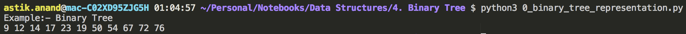

<br>

#### Applications of Binary Trees

- Manipulate hierarchical data.
- Make information easy to search (Tree traversal).
- Manipulate sorted lists of data(BST).
- As a workflow for compositing digital images for visual effects.
- Router algorithms.
- Form of a multi-stage decision-making (see business chess).

<br>

<br>

> ### Algo-1: Tree DFS Traversals - (Inorder, Preorder, Postorder)

- Unlike linear data structures (Array, Linked List, Queues, Stacks, etc) which have only one logical way to traverse them, trees can be traversed in different ways.
- We have 3 options to traverse tree in DFS manner (Inorder, Preorder, Postorder).

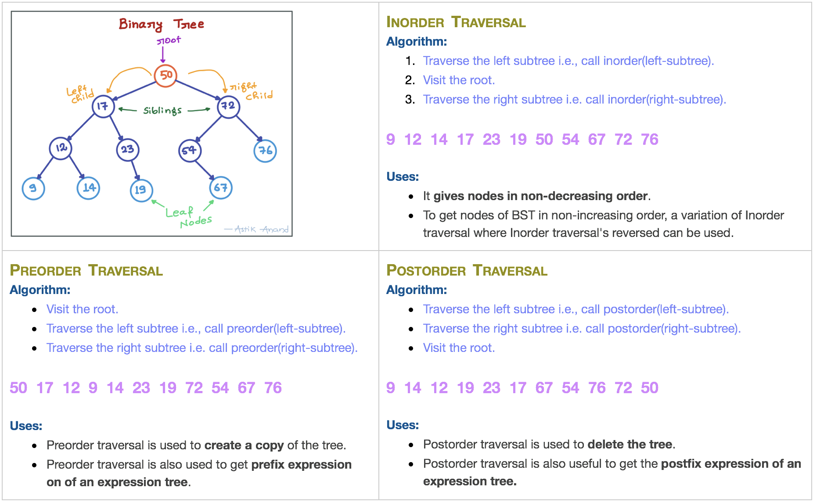

###### Implementation

```python
class Node:
    def __init__(self, key):
        self.left = None
        self.right = None
        self.val = key
    

def inorder(root):
    if root:
        inorder(root.left)
        print(root.val, end=" ")
        inorder(root.right)


def preorder(root):
    if root:
        print(root.val, end=" ")
        preorder(root.left)
        preorder(root.right)


def postorder(root):
    if root:
        postorder(root.left)
        postorder(root.right)
        print(root.val, end=" ")
        


# Root
root = Node(50)

# 1st Level
root.left      = Node(17)
root.right     = Node(72)

# 2nd Level
root.left.left   = Node(12)
root.left.right  = Node(23)
root.right.left  = Node(54)
root.right.right = Node(76)

# 3rd Level
root.left.left.left   = Node(9)
root.left.left.right  = Node(14)
root.left.right.right = Node(19)
root.right.left.right = Node(67)

# Print the tree traversals
print("Inorder Traversal:")
inorder(root)
print("\n\nPreorder Traversal:")
preorder(root)
print("\n\nPostorder Traversal:")
postorder(root)
print()
```

**Output:**

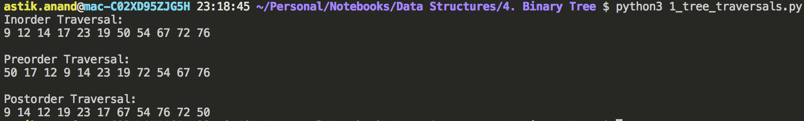

###### **Complexity:**

- **Time: O(n)** :- worst for skewed tree 
- **Auxilliary Space:** If we don’t consider size of stack for function calls then O(1) otherwise O(n)

<br>

<br>

> ### Algo-2: Tree BFS Traversal - Level Order

Level order traversal of a tree is breadth first traversal for the tree.

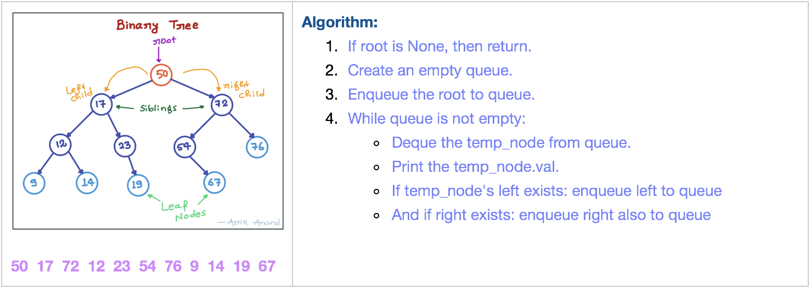

###### **Implementation:**

```python
class Node:
    def __init__(self, val):
        self.left = None
        self.right = None
        self.val = val


def level_order_traversal(root):
    # (1) If root is None, then return.
    if root is None:
        return
    
    # (2) Create an empty queue.
    queue = []

    # (3) Enqueue root to queue.
    queue.append(root)

    # (4) while queue is not empty.
    while(queue):
        # Dequeue the temp_node from queue.
        temp_node = queue.pop(0)

        # Print temp_node.val
        print(temp_node.val, end=" ")

        # If temp_node's left exists: enqueue left to queue.
        if (temp_node.left):
            queue.append(temp_node.left)
        
        # And if right exists: enqueue right also to queue.
        if (temp_node.right):
            queue.append(temp_node.right)
 


# Root
root = Node(50)

# 1st Level
root.left      = Node(17)
root.right     = Node(72)

# 2nd Level
root.left.left   = Node(12)
root.left.right  = Node(23)
root.right.left  = Node(54)
root.right.right = Node(76)

# 3rd Level
root.left.left.left   = Node(9)
root.left.left.right  = Node(14)
root.left.right.right = Node(19)
root.right.left.right = Node(67)

print("Level Order Traversal:")
level_order_traversal(root)
print()
```

**Output:**

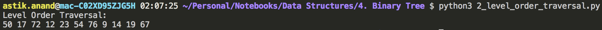

###### **Complexity:**

- **Time : O(n)** :- where n is number of nodes in the binary tree 
- **Auxilliary Space:** **O(w)** where w is maximum width of Binary Tree

<br>

<br>

> ### BFS vs DFS in Binary Tree

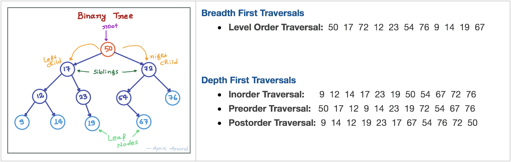

##### Why do we care?

There are many tree questions that can be solved using any of the above four traversals.

- **Using DFS Traversal:**
    - Finding Size of Tree.
    - Finding Height of Tree.
    - Finding Max or Min element in a Tree.
    - Diameter of Binary Tree.
    - Print nodes at K distance.
    - Checking if a binary tree is subtree of another binary tree.
    - Ancestors of a given node.
    - 
- **Using BFS Traversal:**
    - Maximum Width of Binary Tree.
    - Left View of Tree.
    - Connect Nodes at same level.

###### **Implementation:**

```python
import sys
INT_MIN = -sys.maxsize-1

class Node:
    def __init__(self, val):
        self.left = None
        self.right = None
        self.val = val


# Computes the number of nodes in tree
def size(root):
    if root is None:
        return 0
    else:
        return (1 + size(root.left) + size(root.right))


# Computes the height of tree
def height(root):
    if root is None:
        return 0
    else :
        return (1 + max(height(root.left), height(root.right)))


# Computes the number of nodes in tree
def maximum(root):
    if root is None:
        return INT_MIN
    else:
        return max(root.val, maximum(root.left), maximum(root.right))


# Root
root = Node(50)

# 1st Level
root.left      = Node(17)
root.right     = Node(72)

# 2nd Level
root.left.left   = Node(12)
root.left.right  = Node(23)
root.right.left  = Node(54)
root.right.right = Node(76)

# 3rd Level
root.left.left.left   = Node(9)
root.left.left.right  = Node(14)
root.left.right.right = Node(19)
root.right.left.right = Node(67)

print("Size of Tree: {}".format(size(root)))
print("Height of Tree: {}".format(height(root)))
print("Max of Tree: {}".format(maximum(root)))
```

**Output:**
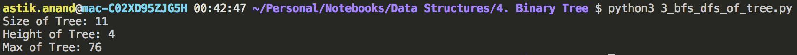

###### **Complexity:**

- **Time:**  All four traversals require **O(n) time** as they visit every node exactly once. 
- **Space:**
    - Extra Space required for Level Order Traversal is O(w) where w is maximum width of Binary Tree.
    - In level order traversal, queue one by one stores nodes of different level.
    - Extra Space required for Depth First Traversals is O(h) where h is maximum height of Binary Tree.
    - In Depth First Traversals, stack (or function call stack) stores all ancestors of a node.

#### Important Points

- Maximum Width of a Binary Tree at depth (or height) h can be 2h where h starts from 0. So the maximum number of nodes can be at the last level.
- Worst case occurs when Binary Tree is a perfect Binary Tree with numbers of nodes like 1, 3, 7, 15, …etc. In worst case, value of 2h is Ceil(n/2).
- Height for a Balanced Binary Tree is O(Log n). Worst case occurs for skewed tree and worst case height becomes O(n).
- So in worst case extra space required is O(n) for both. But worst cases occur for different types of trees.
- *It is evident from above points that extra space required for Level order traversal is likely to be more when tree is more balanced* *and extra space for Depth First Traversal is likely  to be more when tree is less balanced.*

#### How to pick one?

- Extra Space can be one factor.
- Depth First Traversals are typically recursive and recursive code requires function call overheads.
- The most important points is, BFS starts visiting nodes from root while DFS starts visiting nodes from leaves.
- So if our problem is to search something that is more likely to closer to root, we would prefer BFS and if the target node is close to a leaf, we would prefer DFS.


---

### Standard Binary Trees Problems

## 1. Diameter of Binary Tree***

- The diameter of a tree is the number of nodes on the longest path between two leaves in the tree. 
- The diagram below shows two trees each with **diameter 9**.
- The leaves that form the ends of a longest path are colored (note that there may be more than one path in tree of same diameter). 

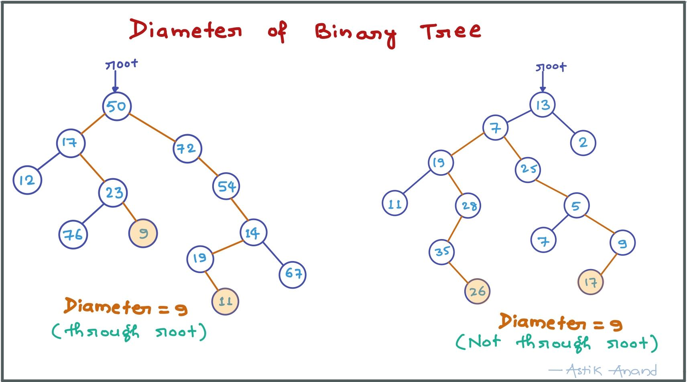

###### **Approach:**

- Diameter can be calculated by using the height function.
- Because the diameter of a tree is nothing but maximum value of (left_height +right_height +1) **for each node**.
- So we need to calculate this value (left_height + right_height + 1) for each node as sometimes it may not contain root also (2nd case).
- Then we need to get the max of values present at each node.

###### **Implementation:**

```python
import sys
INT_MIN = -sys.maxsize-1

class Node:
    def __init__(self, val):
        self.left = None
        self.right = None
        self.val = val


def height(root, max_diam):
    if root is None:
        return 0
    else :
        # Get the height of left and right nodes of the current_node
        left_height = height(root.left, max_diam)
        right_height = height(root.right, max_diam)

        # Get the diameter at current_node = 1 + left_height + right_height
        # Update the max_diam[0] if current_diam > max_diam[0]
        current_diam = 1 + left_height + right_height
        max_diam[0] = max(max_diam[0], current_diam)

        # return the height of the current_node
        return (1 + max(left_height, right_height))


def diameter(root):
    if root is None:
        return 0
    
    max_diam = [INT_MIN]    # This will store the final answer
    height(root, max_diam)
    return max_diam[0]


# Root
root = Node(13)

# 1st Level
root.left      = Node(7)
root.right     = Node(2)

# 2nd Level
root.left.left   = Node(19)
root.left.right  = Node(25)

# 3rd Level
root.left.left.left   = Node(11)
root.left.left.right  = Node(28)
root.left.right.right = Node(5)

# 4th Level
root.left.left.right.left = Node(35)
root.left.right.right.left = Node(7)
root.left.right.right.right = Node(9)

# 5th Level
root.left.left.right.left.right = Node(26)
root.left.right.right.right.left = Node(17)


print("Diameter of Tree: {}".format(diameter(root)))
```

**Output:**

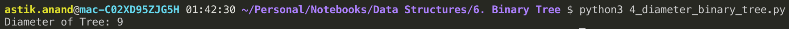

###### **Complexity:**

- **Time:**  **O(n)**  DFS traversal 
- **Auxilliary Space: O(h)** where h is maximum height of Binary Tree.

<br>

<br>

## 2. Maximum Width of Binary Tree***

Width of a tree is maximum of widths of all levels.

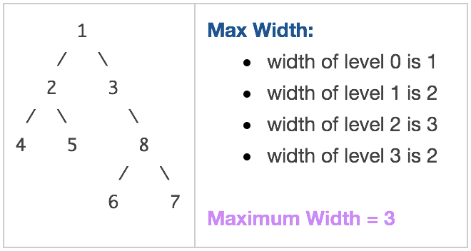

###### **Approach:**

- We will use level order traversal to solve this.
- In level order traversal, we use to dequeue one node and then enqueue it's left and right child. 
- But here a slight modification is we will dequeue all the nodes present in queue instead of one and enqueue their left and right child.
- In fact this will also give the level order traversal only but with less recursion steps.

###### **Algorithm:**

- If root is None, then return 0.
- Create an empty queue and max_width=0.
- Enqueue root to queue.
- While queue is not empty.
    - Get the current_count and update max_width if it is greater.
    - Dequeue all the nodes instead of one.So, while current_count > 0:
        - Dequeue the temp_node from queue.
        - If temp_node's left exists: enqueue left to queue.
        - And if right exists: enqueue right also to queue.
        - Decrease the count by 1.

###### **Implementation:**

```python
class Node:
    def __init__(self, val):
        self.left = None
        self.right = None
        self.val = val


def max_width_binary_tree(root):
    # (1) If root is None, then return 0.
    if root is None:
        return 0
    
    # (2) Create an empty queue and max_width=0.
    queue = []
    max_width = 0

    # (3) Enqueue root to queue.
    queue.append(root)

    # (4) While queue is not empty.
    while(queue):
        # Get the current_count and update max_width if it is greater.
        current_count = len(queue)
        max_width = max(max_width, current_count)

        # Dequeue all the nodes instead of one. So, while current_count > 0.
        while(current_count > 0):
            # Dequeue the temp_node from queue.
            temp_node = queue.pop(0)

            # If temp_node's left exists: enqueue left to queue.
            if (temp_node.left):
                queue.append(temp_node.left)
        
            # And if right exists: enqueue right also to queue.
            if (temp_node.right):
                queue.append(temp_node.right)
            
            current_count -= 1
    
    return max_width


# Root
root = Node(1)

# 1st Level
root.left      = Node(2)
root.right     = Node(3)

# 2nd Level
root.left.left   = Node(4)
root.left.right  = Node(5)
root.right.right = Node(8)

# 3rd Level
root.right.right.left  = Node(6)
root.right.right.right = Node(7)

print("Maximum Width = {}".format(max_width_binary_tree(root)))
```

**Output:**

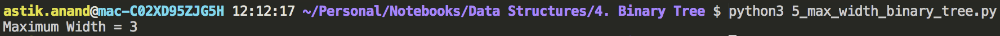

###### **Complexity:**

- **Time : O(n)** :- BFS: Same as Level order traversal 
- **Auxilliary Space:** **O(w)** where w is maximum width of Binary Tree 

<br>

<br>

## 3. Left View of Tree***

Print all the tree elements when seen from left side.

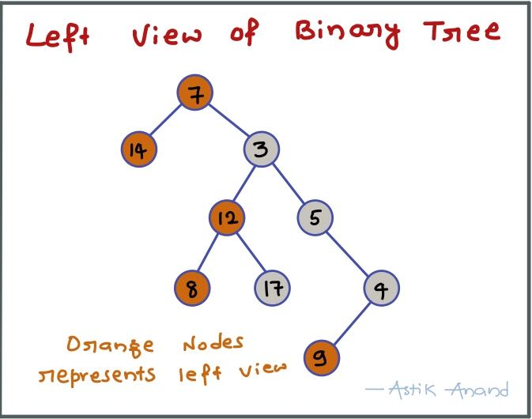

###### **Approach:**

- We can solve using level order traversal.
- Just a **slight modification** of **maximum width problem.** 
- In maximum width just put a printed flag to make sure we print only the first node of that level. 

###### **Implementation:**

```python
class Node:
    def __init__(self, val):
        self.left = None
        self.right = None
        self.val = val


def left_view_binary_tree(root):
    # (1) If root is None, then return.
    if root is None:
        return
    
    # (2) Create an empty queue.
    queue = []

    # (3) Enqueue root to queue.
    queue.append(root)

    # (4) While queue is not empty.
    while(queue):
        # Get the current_count.
        current_count = len(queue)

        # Flag to know if first element in this level is printed.
        printed = False

        # Dequeue all the nodes instead of one. So, while current_count > 0.
        while(current_count > 0):
            # Dequeue the temp_node from queue.
            temp_node = queue.pop(0)

            # Print the first element in this level if it is not printed.
            if(not printed):
                print(temp_node.val, end=" ")
                printed = True

            # If temp_node's left exists: enqueue left to queue.
            if (temp_node.left):
                queue.append(temp_node.left)
        
            # And if right exists: enqueue right also to queue.
            if (temp_node.right):
                queue.append(temp_node.right)
            
            current_count -= 1
    


# Root
root = Node(4)

# 1st Level
root.left      = Node(5)
root.right     = Node(2)

# 2nd Level
root.right.left  = Node(3)
root.right.right = Node(1)

# 3rd Level
root.right.left.left  = Node(6)
root.right.left.right = Node(7)

print("Left View of Binary Tree: ")
left_view_binary_tree(root)
print()
```

**Output:**

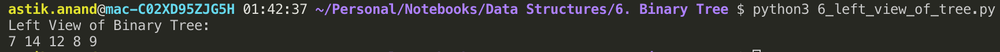

###### **Complexity:**

- **Time : O(n)** :- Same as maximum width problem 
- **Auxilliary Space:** **O(w)** where w is maximum width of Binary Tree 

<br>

<br>

## 4. Print  Nodes at K distance from Root

Given a root of a tree, and an integer k. Print all the nodes which are at k distance from root.

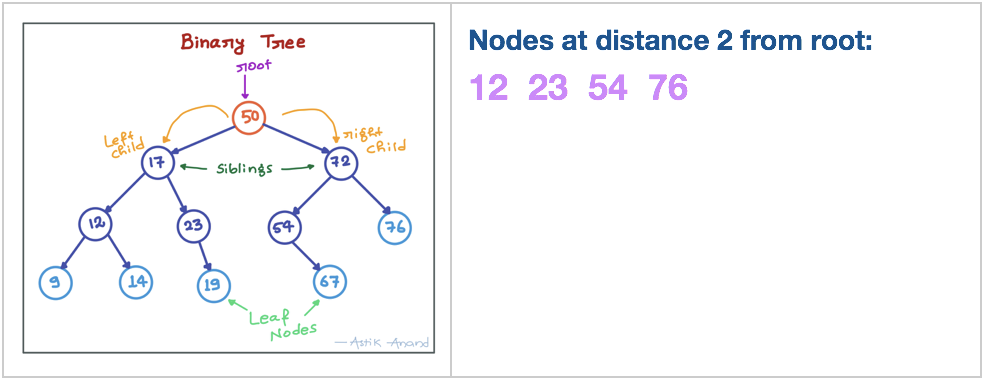

###### **Algorithm:**

- If distance is 0 : print the root.
- Else call the recursive function for root.left and root.left with distance-1.

###### **Implementation:**

```python
class Node:
    def __init__(self, key):
        self.left = None
        self.right = None
        self.val = key
    

def print_nodes_at_k_distance(root, k):
    if root is None:
        return
    
    if k==0:
        print(root.val, end=" ")
    else:
        print_nodes_at_k_distance(root.left, k-1)
        print_nodes_at_k_distance(root.right, k-1)

 

# Root
root = Node(50)

# 1st Level
root.left      = Node(17)
root.right     = Node(72)

# 2nd Level
root.left.left   = Node(12)
root.left.right  = Node(23)
root.right.left  = Node(54)
root.right.right = Node(76)

# 3rd Level
root.left.left.left   = Node(9)
root.left.left.right  = Node(14)
root.left.right.right = Node(19)
root.right.left.right = Node(67)

print("Nodes at distance of k=2:")
print_nodes_at_k_distance(root, 2)
print()
```

**Output:**

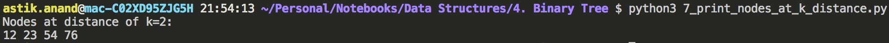

###### **Complexity:**

- **Time:**  **O(n)**  DFS traversal 
- **Auxilliary Space: O(h)** where h is maximum height of Binary Tree.

<br>

<br>

## 5. Check if Binary Tree is Sub-tree of another Binary Tree***

###### **Problem:**

- Given two binary trees, check if the first tree is subtree of the second one. 
- A subtree of a tree T is a tree S consisting of a node in T and all of its descendants in T.
- The subtree corresponding to the root node is the entire tree; the subtree corresponding to any other node is called a proper subtree.

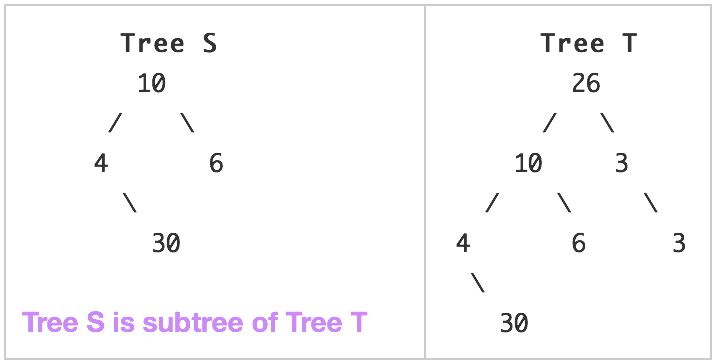

###### **Approach:**

- Write a **identical function** to check if 2 trees are identical.  
- Traverse the tree T in preorder fashion.
- For every visited node in the traversal, check if the subtree rooted with this node is identical to S.

###### **Algorithm:**

- **are_identical(root1, root2):**
    - If both are NULL, then True.
    - If one is None and other not None, then False.
    - return True if the val of both roots is same and left subtree and right subtree are are_identical else False.
- **is_subtree(S, T):**
    - If S is None, always subtree.
    - If S is not None and T is none, not a subtree.
    - If both are identical return True.
    - Check if S is subtree of **T.left** or **T.right**.

###### **Implementation:**

```python
class Node:
    def __init__(self, key):
        self.left = None
        self.right = None
        self.val = key


def are_identical(root1, root2):
    # If both are NULL, then True.
    if root1 is None and root2 is None:
        return True

    # If one is None and other not None, then False.
    if root1 is None or root2 is None:
        return False

    # Check if the val of both roots is same and left subtree and right subtree are are_identical.
    return (root1.val==root2.val and 
            are_identical(root1.left, root2.left) and 
            are_identical(root1.right, root2.right))


def is_subtree(S, T):
    # If S is None, always subtree.
    if S is None:
        return True

    # If S is not None and T is none, not a subtree.
    if T is None:
        return False

    # If both are identical return True.
    if are_identical(S, T):
        return True
    else:
        # Check if S is subtree of T.left or T.right
        return is_subtree(S, T.left) or is_subtree(S, T.right)


# Tree T
T = Node(26)
T.left   = Node(10)
T.right  = Node(3)
T.left.left   = Node(4)
T.left.right  = Node(6)
T.right.right = Node(3)
T.left.left.right = Node(30)

# Tree S
S = Node(10)
S.left   = Node(4)
S.right  = Node(6)
S.left.right = Node(30)
print("Example-1: Is Tree S subtree of Tree T ?: {}".format(is_subtree(S, T)))

# Tree S
S = Node(4)
S.right  = Node(30)
print("Example-2: Is Tree S subtree of Tree T ?: {}".format(is_subtree(S, T)))

# Tree S
S = Node(4)
S.right  = Node(15)
print("Example-3: Is Tree S subtree of Tree T ?: {}".format(is_subtree(S, T)))
```

**Output:**

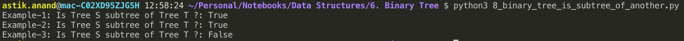

###### **Complexity:**

- **Time:**  **O(n)**  DFS traversal 
- **Auxilliary Space: O(h)** where h is maximum height of Binary Tree.

<br>

<br>

## 6. Connect Nodes at Same Level***

###### **Problem:**

Write a function to connect all the adjacent nodes at the same level in a binary tree.

Initially, all the nextRight pointers point to garbage values, the function should set these pointers to point next right for each node.

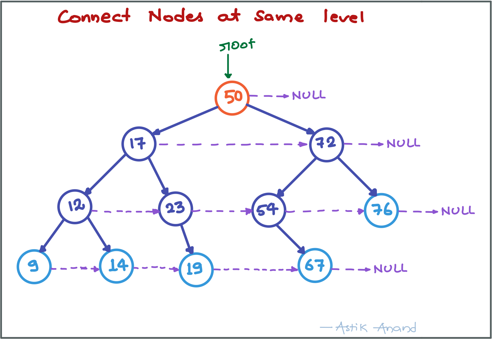

###### **Approach:**

- Just do a level order traversal **similar** to **max_width** or **left_view** problem. 
- While taking out node from queue just set the **nextright** as the node in front of queue. 
- Set the next_right and consider that at every level the last element will not point to any other node as the front will be empty.

###### **Implementation:**

```python
class Node:
    def __init__(self, val):
        self.val = val
        self.left = None
        self.right = None
        self.nextright = None
        


def connect_nodes_at_same_level(root):
    # (1) If root is None, then return.
    if root is None:
        return
    
    # (2) Create an empty queue.
    queue = []

    # (3) Enqueue root to queue.
    queue.append(root)

    # (4) While queue is not empty.
    while(queue):
        # Get the current_count.
        current_count = len(queue)

        # Dequeue all the nodes instead of one. So, while current_count > 0.
        while(current_count > 0):
            # Dequeue the temp_node from queue.
            temp_node = queue.pop(0)

            print("{}--->".format(temp_node.val), end="")
            # Set the next_right and consider that at every level
            # the last element will not point to any other node as the front will be empty.
            if(current_count > 1):
                temp_node.nextright = queue[0]
            else:
                temp_node.nextright = None
                print("None")

            # If temp_node's left exists: enqueue left to queue.
            if (temp_node.left):
                queue.append(temp_node.left)
        
            # And if right exists: enqueue right also to queue.
            if (temp_node.right):
                queue.append(temp_node.right)
            
            current_count -= 1


# Root
root = Node(50)

# 1st Level
root.left      = Node(17)
root.right     = Node(72)

# 2nd Level
root.left.left   = Node(12)
root.left.right  = Node(23)
root.right.left  = Node(54)
root.right.right = Node(76)

# 3rd Level
root.left.left.left   = Node(9)
root.left.left.right  = Node(14)
root.left.right.right = Node(19)
root.right.left.right = Node(67)

# Call Function
connect_nodes_at_same_level(root)

```

**Output:**

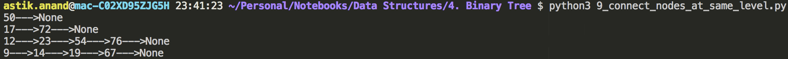

###### **Complexity:**

- **Time : O(n)** :- Same as **maximum_****width** or **left_view** problem. 
- **Auxilliary Space:** **O(w)** where w is maximum width of Binary Tree. 

<br>

<br>

## 7. Ancestors of a Given Node in Binary Tree***

###### **Problem:**

Given a Binary Tree and a key, write a function that prints all the ancestors of the key in the given binary tree.

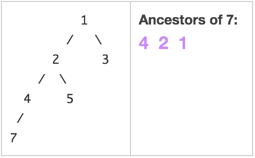

###### **Algorithm:**

- If root is None return False.
- If root.val is given_node then return True.
- Print the **root.data** if any of **root.left** or **root.right** contains the given_node and return True. 
- If given_node not in tree, return False

###### **Implementation:**

```python
class Node:
    def __init__(self, key):
        self.left = None
        self.right = None
        self.val = key
    

def print_ancestors(root, k):
    # If root is None return False.
    if root is None:
        return False
    
    # If root.val is given_node then return True.
    if root.val == k:
        return True
    
    # Print the root.data if any of root.left or root.right contains the given_node and return True.
    if(print_ancestors(root.left, k) or print_ancestors(root.right, k)):
        print(root.val, end=" ")
        return True
    
    # If given_node not in tree, return False
    return False
    
 

# Root
root = Node(1)
root.left      = Node(2)
root.right     = Node(3)
root.left.left   = Node(4)
root.left.right  = Node(5)
root.left.left.left   = Node(7)

print("Ancestors of given_node k=7:")
print_ancestors(root, 7)
print()

print("Ancestors of given_node k=3:")
print_ancestors(root, 3)
print()

```

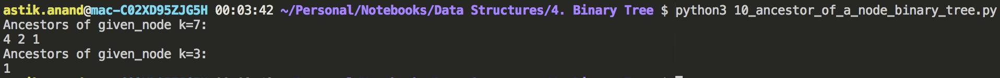

###### **Complexity:**

- **Time:**  **O(n)**  DFS traversal 
- **Auxilliary Space: O(h)** where h is maximum height of Binary Tree.

<br>

<br>

## 8. Inorder Tree Traversal without Recursion

Need to do the inorder traversal without using recursion methodology.

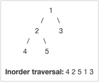

###### **Algorithm:**

1. Create an empty stack S.
2. Initialize current node as root
3. Push the current node to S and set current = current->left until current is NULL
4. If current is NULL and stack is not empty then
    - Pop the top item from stack.
    - Print the popped item, set current = popped_item->right
    - Go to step 3.
5. If current is NULL and stack is empty then we are done.

###### **Implementation**

```python
class Node:
    def __init__(self, key):
        self.left = None
        self.right = None
        self.val = key
 

def inorder_without_recursion(root):
    current = root 
    stack = []

    while(current is not None or len(stack) > 0):
        # Reach the left most Node of the current Node 
        while (current is not None):
            # Place pointer to a tree node on the stack before traversing the node's left subtree 
            stack.append(current)
            current = current.left 
        
        # Current must be NULL at this point
        current = stack.pop()
        print(current.val, end=" ")
         
        # We have visited the node and its left subtree. Now, it's right subtree's turn
        current = current.right 
    print()
    

    
root = Node(1)
root.left = Node(2)
root.right = Node(3)
root.left.left = Node(4)
root.left.right = Node(5)
 
inorder_without_recursion(root)

```

**Output:**

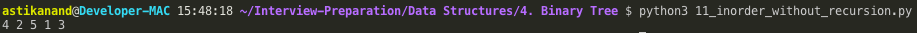

###### **Complexity:**

- **Time:**  **O(n)**
- **Auxilliary Space: O(h)**

<br>

<br>

## 9. Inorder Traversal without Recursion and without Stack (Morris Traversal)

- Using Morris Traversal, we can traverse the tree without using stack and recursion.
- The idea of Morris Traversal is based on Threaded Binary Tree.
- In this traversal, we first create links to Inorder successor and print the data using these links, and finally revert the changes to restore original tree.


###### **Algorithm:**

1. Initialize current as root
2. While current is not NULL
    - If current does not have left child
        - Print current’s data
        - Go to the right, i.e., current = current->right
    - Else
        - Make current as right child of the rightmost node in current's left subtree
        - Go to this left child, i.e., current = current->left

###### Implementation:

```python
class Node:
    def __init__(self, key):
        self.left = None
        self.right = None
        self.val = key


def morris_inorder_traversal(root):
    current = root 
     
    while(current is not None):
        if current.left is None:
            print(current.val, end=" ")
            current = current.right
        else:
            # Find the inorder predecessor of current
            pre = current.left
            while(pre.right is not None and pre.right != current):
                pre = pre.right
  
            # Make current as right child of its inorder predecessor
            if(pre.right is None):
                pre.right = current
                current = current.left
                 
            # Revert the changes made in if part to restore the 
            # original tree i.e., fix the right child of predecssor
            else:
                pre.right = None
                print(current.val, end=" ")
                current = current.right
    print()


    
root = Node(1)
root.left = Node(2)
root.right = Node(3)
root.left.left = Node(4)
root.left.right = Node(5)
 
morris_inorder_traversal(root)

```

**Output:**

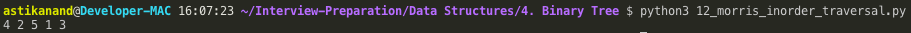

###### **Complexity:**

- **Time:**  **O(n)**
- **Auxilliary Space: O(1)**

<br>

<br>

## 10. Check if Binary Tree is Balanced***

###### Problem:

Check if bianry tree is height balanced by considering a height-balancing scheme where following conditions should be checked to determine if a binary tree is balanced.

- An empty tree is always height-balanced.
- A non-empty binary tree T is balanced if:
    1. Left subtree of T is balanced
    2. Right subtree of T is balanced
    3. The difference between heights of left subtree and right subtree is not more than 1.
- This height-balancing scheme is used in AVL trees. 

###### Approach-1: Brute-Force:

- Get the height of left subtree and right subtree and check if difference is 1.
- Also check if left subtree and right subtree is balanced.
- **Time Complexity: O(n<sup>2</sup>):** Worst case occurs in case of skewed tree.

###### Implementation-Approach-1:

```python
def height(root):   
    if root is None: 
        return 0
    return max(height(root.left), height(root.right)) + 1
  
# function to check if tree is height-balanced or not 
def isBalanced(root): 
    if root is None: 
        return True
  
    # left and right subtree height 
    lh = height(root.left) 
    rh = height(root.right) 
  
    # allowed values for (lh - rh) are 1, -1, 0 
    if (abs(lh-rh) <= 1) and isBalanced(root.left) and isBalanced( root.right): 
        return True
  
    # if we reach here means tree is not  height-balanced tree 
    return False

```

###### Approach-2: Optimized:

- Above implementation can be optimized by calculating the height in the same recursion rather than calling a height() function separately.
- **Time complexity: O(n)**

###### Implementation-Approach-2:

```python
class Node: 
    def __init__(self, data): 
        self.data = data 
        self.left = self.right = None
  
class Height: 
    def __init__(self): 
        self.height = 0
  

def isBalanced(root, height): 
    # lh and rh to store height of left and right subtree 
    lh = Height() 
    rh = Height() 

    if root is None: 
        return True
  
    # l and r are used to check if left and right subtree are balanced 
    l = isBalanced(root.left, lh) 
    r = isBalanced(root.right, rh)

    # Update height
    height.height = max(lh.height, rh.height) + 1
  
    if abs(lh.height-rh.height) <= 1 and l and r: 
        return True
  
    # if we reach here then the tree is not balanced 
    return False
  

root = Node(1) 
root.left = Node(2) 
root.right = Node(3) 
root.left.left = Node(4) 
root.left.right = Node(5) 
root.right.left = Node(6) 
root.left.left.left = Node(7) 
  
if isBalanced(root, Height()): 
    print('Tree is balanced') 
else: 
    print('Tree is not balanced')

```

<br>

<br>

## 11. Serialize and Deserialize Binary Tree

> **Serialization & Deserialization**
>
> It is the  process of converting a data structure or object into a sequence of bits so that it can be stored in a file or memory buffer, or transmitted  across a network connection link to be reconstructed (deserialized) later in the same  or another computer environment.

###### Problem:

Design an algorithm to serialize and deserialize a binary tree. There is no restriction on how your serialization/deserialization algorithm  should work. You just need to ensure that a binary tree can be  serialized to a string and this string can be deserialized to the  original tree structure.

###### Approach: Use DFS on Binary Tree

A simple solution is to store both Inorder and Preorder traversals. This solution requires requires space twice the size of Binary Tree.
We can save space by storing Preorder traversal and a marker for NULL pointers. 

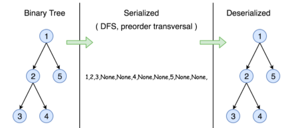


**Other Examples:**

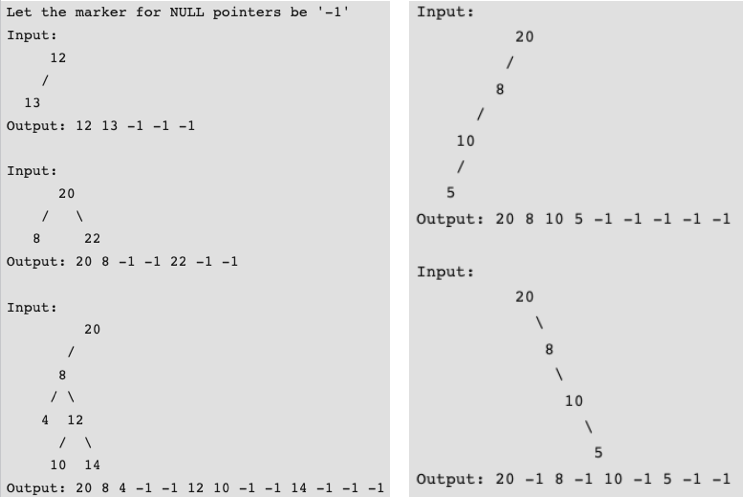


###### Implementation:

```python
# Definition for a binary tree node.
class TreeNode(object):
    def __init__(self, x):
        self.val = x
        self.left = None
        self.right = None


class Codec:
    def serialize(self, root):
        """Encodes a tree to a single string.

        :type root: TreeNode
        :rtype: str
        """
        serialized_btree = []
        self._modified_pre_order(root, serialized_btree)

        return ",".join(serialized_btree)

    def _modified_pre_order(self, root, serialized_btree):
        if root:
            serialized_btree.append(str(root.val))
            self._modified_pre_order(root.left, serialized_btree)
            self._modified_pre_order(root.right, serialized_btree)
        else:
            serialized_btree.append("#")

    def deserialize(self, data):
        """Decodes your encoded data to tree.

        :type data: str
        :rtype: TreeNode
        """
        nodes_list = data.split(",")
        nodes_list.reverse()
        return self._build_tree(nodes_list)

    def _build_tree(self, nodes_list):
        if not nodes_list:
            return

        key = nodes_list.pop()
        if key != "#":
            root = TreeNode(int(key))
            root.left = self._build_tree(nodes_list)
            root.right = self._build_tree(nodes_list)
            return root


def print_tree(root):
    if root:
        print(root.val, end=" ")
        print_tree(root.left)
        print_tree(root.right)


# Your Codec object will be instantiated and called as such:
#     1
#    / \
#   2   3
#      / \
#     4   5
#   /  \
#  7    6


root = TreeNode(1)
root.left = TreeNode(2)
root.right = TreeNode(3)
root.right.left = TreeNode(4)
root.right.right = TreeNode(5)
root.right.left.left = TreeNode(7)
root.right.left.right = TreeNode(6)

codec = Codec()
print_tree(codec.deserialize(codec.serialize(root)))
print()

#      20
#    /
#   8
#  / \
# 4  12
#   /  \
#  10  14

root = TreeNode(20)
root.left = TreeNode(8)
root.left.left = TreeNode(4)
root.left.right = TreeNode(12)
root.left.right.left = TreeNode(10)
root.left.right.right = TreeNode(14)

codec = Codec()
print_tree(codec.deserialize(codec.serialize(root)))
print()
```

**Output:**

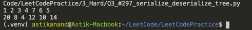

###### Complexity Analysis:

- **Time complexity: O(N)** In both serialization and deserialization functions, we visit each node exactly once, thus the time complexity is O(N), where N is the number of nodes, *i.e.* the size of tree.
- **Space complexity: O(N)** In both serialization and deserialization functions, we keep the entire tree, either at the beginning or at the end, therefore, the space complexity is O(N).

<br>

<br>

## 12. Threaded Binary Trees

- Inorder traversal of Binary Tree can either be done using recursion or with the use of an auxiliary stack.
- The idea of threaded binary trees is to make inorder traversal faster and do it without stack and without recursion.
- A binary tree is made threaded by making all right child pointers that would normally be NULL point to the inorder successor of the node (if it exists).
- There are two types of threaded binary trees.
    - ***Single Threaded:*** Where a NULL right pointers is made to point to the inorder successor (if successor exists)
    - ***Double Threaded:*** Where both left and right NULL pointers are made to point to inorder predecessor and inorder successor respectively. The predecessor threads are useful for reverse inorder traversal and postorder traversal.
- The threads are also useful for fast accessing ancestors of a node.

- Since right pointer is used for two purposes, the boolean variable **rightThread** is used to indicate whether right pointer points to right child or inorder successor.
- Similarly, we can add **leftThread** for a double threaded binary tree.
- Following diagram shows an example Single Threaded Binary Tree. The dotted lines represent threads.

#### Representation of Threaded Binary Tree

```python
class Node:
    def __init__(self, key):
        self.val = key 
        self.left = None
        self.right = None
        self.rightThread = False

```

#### Inorder Traversal in Threaded Binary Tree

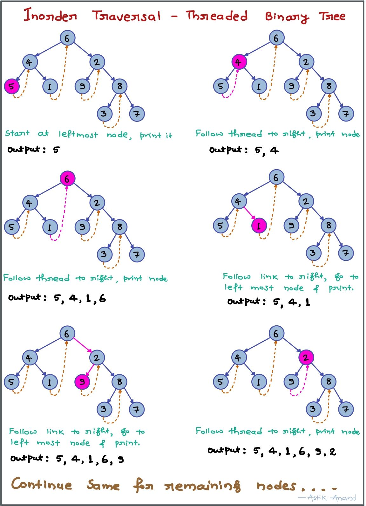

<br>

<br>

## 13. Constructing Binary Tree from 2 given traversal sequences

###### **Possible to create?**

Whether we will be able to construct a binary tree with given 2 traversals depends on what traversals are given.

If one of the traversal methods is Inorder then the tree can be constructed, otherwise not.


**Therefore, following combination can uniquely identify a tree.**

- Inorder and Preorder.
- Inorder and Postorder.
- Inorder and Level-order.

#### Constructing Binary Tree

- Let us consider the below traversals:
    - Inorder sequence: D B E A F C
    - Preorder sequence: A B D E C F

###### Steps to Create:

- In a Preorder sequence, leftmost element is the root of the tree. So we know ‘A’ is root for given sequences. 

- By searching ‘A’ in Inorder sequence, we can find out all elements on left side of ‘A’ are in left subtree and elements on right are in right subtree. 

    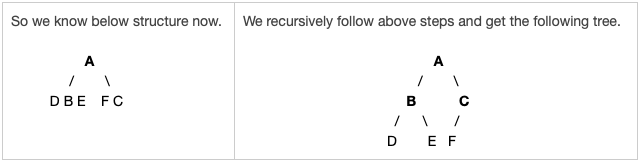

###### **Algorithm:**

1. Pick an element from **preorder** and increment a preorder_index  to pick next element in next recursive call.
2. Create a new **tree_node** with the picked element.
3. Find the picked element’s index in Inorder. Let the index be inorder_index.
4. Call build_tree for elements before inorder_index and make the built tree as left subtree of tree_node.
5. Call build_tree for elements after inorder_index and make the built tree as right subtree of tree_node.
6. return tree_node.

###### Implementation

```python
class Node:
    def __init__(self, key):
        self.val = key
        self.left = None
        self.right = None

        
# Recursive function to construct binary of size len from 
# Inorder traversal inorder[] and Preorder traversal preorder[].  
# Initial values of inorder_start and inorder_end should be 0 and len -1.  
# The function doesn't do any error checking for cases where inorder and preorder do not form a tree.
def build_tree(inorder, preorder, inorder_start, inorder_end):
    if (inorder_start > inorder_end):
        return None
 
    # Pick current node from Preorder traversal using preorder_index and increment preorder_index
    # Create a new tree node with this picked element
    tree_node = Node(preorder[build_tree.preorder_index])
    build_tree.preorder_index += 1
 
    # If this node has no children then return
    if inorder_start == inorder_end :
        return tree_node
 
    # Else find the index of this node in Inorder traversal
    inorder_index = search(inorder, inorder_start, inorder_end, tree_node.val)
     
    # Using index in Inorder Traversal, construct left and right subtrees
    tree_node.left = build_tree(inorder, preorder, inorder_start, inorder_index-1)
    tree_node.right = build_tree(inorder, preorder, inorder_index+1, inorder_end)
 
    return tree_node


# Function to find index of vaue in arr[start...end]
# The function assumes that value is rpesent in inorder[]
def search(arr, start, end, value):
    for i in range(start, end+1):
        if arr[i] == value:
            return i

        
def inorder_traversal(node):
    if node is None:
        return
     
    inorder_traversal(node.left)
    print (node.val, end=" ")
    inorder_traversal(node.right)


# Driver program to test above function
inorder = ['D', 'B' ,'E', 'A', 'F', 'C']
preorder = ['A', 'B', 'D', 'E', 'C', 'F']
# Static variable preorder_index
build_tree.preorder_index = 0
root = build_tree(inorder, preorder, 0, len(inorder)-1)
 
# Let us test the build tree by priting Inorder traversal
print ("Inorder traversal of the constructed tree is:")
inorder_traversal(root)
print()

```

**Output:**

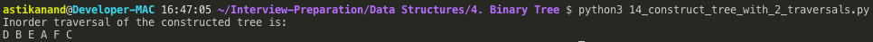

###### **Time Complexity:** O(n<sup>2</sup>)

Worst case occurs when tree is left skewed. 

Example Preorder and Inorder traversals for worst case are {A, B, C, D} and {D, C, B, A}.

#### Another Approach of Binary Tree Construction

- Use the fact that **Inorder traversal** is `Left-Root-Right` and **Preorder traversal** is `Root-Left-Right`. 
- Also, **first node** in Preorder traversal is always the **root node** and first node in Inorder traversal is the **leftmost node** in the tree.

##### Maintain two data-structures:

Stack (to store the path visited while traversing Preorder array) and Set (to maintain the node in which the next right subtree is expected). 

###### Steps to create:

1. **Do below until reach the leftmost node.**

    - Keep creating the nodes from Preorder traversal

    - If the stack’s topmost element is not in the set, link the created node to the left child of stack’s topmost element (if any), without popping the element.

    - Else link the created node to the right child of stack’s topmost element and then remove the stack’s topmost element from the set and the stack.

    - Push the node to stack.

        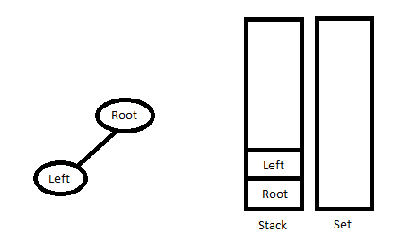

2. **Keep popping the nodes from the stack until either the stack is empty, or the topmost element of stack compares to the current element of Inorder traversal.** Once the loop is over, push the last node back into the stack and into the set.

    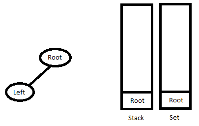

3. **Go to Step 1.**

    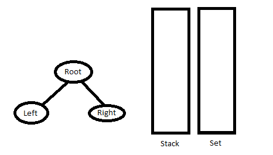

<br>

<br>

------

<a href="matrix" class="prev-button">&larr; Previous:  Matrix</a>      <a href="binary-search-tree" class="next-button">Next: Binary Serach Tree &rarr;</a>

