# Binary Search Tree

###### What is Binary Search Tree ?

**It is a node-based binary tree data structure which has the following properties:**

- The left subtree of a node contains only nodes with keys lesser than the node’s key.
- The right subtree of a node contains only nodes with keys greater than the node’s key.
- The left and right subtree each must also be a binary search tree.
- There must be **no duplicate** nodes. 


#### Inserting a Key

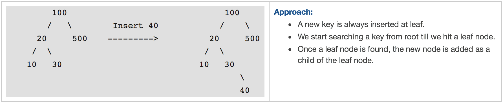

#### Searching a Key

- To search a given key in Binary Search Tree, we first compare it with root, if the key is present at root, we return root.
- If key is greater than root’s key, we recur for right subtree of root node.
- Otherwise we recur for left subtree.

###### **Implementation:**

```python
class Node:
    def __init__(self, val):
        self.val = val
        self.left = None
        self.right = None
    

def insert(root, key):
    if(root is None):
        root = Node(key)
    
    # If key is lesser than root.val insert key in left subtree
    if(key <= root.val):
        if(root.left is None):
            root.left = Node(key)
        else:
            insert(root.left, key)
    # If key is greater than root.val insert key in right subtree
    else:
        if(root.right is None):
            root.right = Node(key)
        else:
            insert(root.right, key)


def search(root, key):
    # If root is None, then key doesn't exist.
    if root is None:
        return False
    
    # If root's val matches the key, then we have found the key in 
    if(root.val == key):
        return True
    
    # If key is lesser than root's val search in left subtree else serach in right subtree.
    if(key < root.val):
        return search(root.left, key)
    else:
        return search(root.right, key)


def print_bst_inorder(root):
    if(root):
        print_bst_inorder(root.left)
        print(root.val, end=" ")
        print_bst_inorder(root.right)
    


print("Inserting 8, 3, 10, 1, 6, 14, 4, 7, 13 into BST")
root = Node(8)
insert(root, 3)
insert(root, 10)
insert(root, 1)
insert(root, 6)
insert(root, 14)
insert(root, 4)
insert(root, 7)
insert(root, 13)
print("BST Now:")
print_bst_inorder(root)
print("\n")

print("Searching if 5 is present ? : {}".format(search(root, 5)))
print("Searching if 6 is present ? : {}".format(search(root, 6)))
```

**Output:**

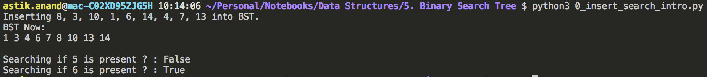

###### **Complexity:**

- **Time: O(Logn**) for both insert and search. In skewed tree it maybe O(n)
- **Auxilliary Space: O(1)** if recursive call stack is not considered. 

##### **Some Interesting Facts:**

- Inorder traversal of BST always produces sorted output.
- We can construct a BST with only Preorder or Postorder or Level Order traversal. Note that we can always get inorder traversal by sorting the only given traversal.
- Number of unique BSTs with n distinct keys is Catalan Number


#### Applications of Binary Search Tree

- Used to express arithmetic expressions.
- Used to evaluate expression trees.
- Used for managing virtual memory Areas (VMA's).
- Used for indexing IP addresses.
- Hashing would be faster, but want to avoid attacker sending IP packets with worst-case inputs.
- For dynamic sorting.


------

### Standard BST Problems

## 1. Delete Node in BST***

When we delete a node, three possibilities arise.

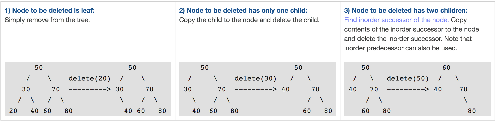

###### **Algorithm:**

- Check if root None: key doesn't exist, not possible to delete.
- If key is lesser than root.val: **Delete** the **key** in **left subtree**. 
- If key is greater than root.val: **Delete** the **key** in **right subtree**. 
- If key is equal to root.val: Need to delete this root node.
    - If **no child exists:** make root None and return None. 
    - If **left child exists**: make root None and return left child. 
    - If **right child exists:** make root None and return the right child. 
    - If **both child exists:** 
        - Get the **min_node** from **right child subtree.**
        - Set the val of root as the val of min node.
        - Delete the min node from right subtree.
- Finally return the root.

###### **Implementation:**

```python
class Node:
    def __init__(self, val):
        self.val = val
        self.left = None
        self.right = None


def delete(root, key):
    # Check if root None: key doesn't exist, not possible to delete.
    if root is None:
        return root
    
    # If key is lesser than root.val: Delete the key in left subtree.
    if(key < root.val):
        root.left = delete(root.left, key)
    # If key is greater than root.val: Delete the key in right subtree.
    elif(key > root.val):
        root.right = delete(root.right, key)
    # If key is equal to root.val: Need to delete this root node.
    else:
        # If no child exists: make root None and return None.
        if(root.left is None and root.right is None):
            root = None
            return None
        # If left child exists: make root None and return left child.
        elif(root.right is None):
            temp = root.left
            root = None
            return temp
        # If right child exists: make root None and return the right child.
        elif(root.left is None):
            temp = root.right
            root = None
            return temp
        # If both child exists:
        else:
            # Get the min_node from right child subtree.
            temp = min_node(root.right)
            # Set the val of root as the val of min node.
            root.val = temp.val
            # Delete the min node from right subtree.
            root.right = delete(root.right, temp.val)
    
    # Finally return the root.
    return root


def min_node(current_node):
    # If current_node is None, min_node not possible
    if(current_node is None):
        return None
    
    min_node = current_node
    while(min_node.left):
        min_node = min_node.left
    
    return min_node


def insert(root, key):
    if(root is None):
        root = Node(key)
    
    # If key is lesser than root.val insert key in left subtree
    if(key <= root.val):
        if(root.left is None):
            root.left = Node(key)
        else:
            insert(root.left, key)
    # If key is greater than root.val insert key in right subtree
    else:
        if(root.right is None):
            root.right = Node(key)
        else:
            insert(root.right, key)


def print_bst_inorder(root):
    if(root):
        print_bst_inorder(root.left)
        print(root.val, end=" ")
        print_bst_inorder(root.right)
    


print("Insert:- 50, 30, 70, 20, 40, 60, 80 into BST.")
root = Node(50)
insert(root, 30)
insert(root, 70)
insert(root, 20)
insert(root, 40)
insert(root, 60)
insert(root, 80)
print("BST at start:")
print_bst_inorder(root)
print("\n")

delete(root, 20)
print("BST after deleting 20:")
print_bst_inorder(root)
print()

delete(root, 30)
print("BST after deleting 30:")
print_bst_inorder(root)
print()

delete(root, 50)
print("BST after deleting 50:")
print_bst_inorder(root)
print()
```

**Output:**

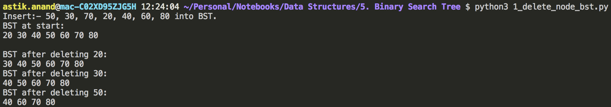

###### **Complexity:**

- **Time: O(Logn**) for both insert and search. In skewed tree it maybe O(n)
- **Auxilliary Space: O(1)** if recursive call stack is not considered. 

## 2. Check if Binary Tree is BST***

###### **Problem:**

Given a binary tree check if it is a binary search tree.

###### **Approach-1: Simple but** **Wrong X** 

- For each node, check if left node is smaller and right node is greater.

    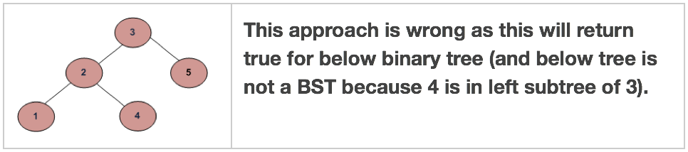

###### **Approach-2: Correct but Inefficient**

- For each node, check if max value in left subtree is smaller than the node and min value in right subtree greater than the node.
- It runs slowly since it traverses over some parts of the tree many times and hence is inefficient.

###### **Approach-3: Correct and Efficient**

- Approach-2 runs slowly since it traverses over some parts of the tree many times.
- A better solution looks at each node only once.
- The trick is to write a utility helper function isBSTUtil(struct node* node, int min, int max) that traverses down the tree keeping track of the narrowing min and max allowed values as it goes, looking at each node only once.
- The initial values for min and max should be INT_MIN and INT_MAX — they narrow from there.

###### **Approach-4:**  **Inorder Traversal Method** 

- Do In-Order Traversal of the given tree and store the result in a temp array.
- Check if the temp array is sorted in ascending order, if it is, then the tree is BST.
- We can also avoid the use of Auxiliary Array.
    - While doing In-Order traversal, we can keep track of previously visited node.
    - If the value of the currently visited node is less than the previous value, then tree is not BST.

###### **Implementation (Approach-3):**

```python
import sys
INT_MIN = -sys.maxsize-1
INT_MAX = sys.maxsize

class Node:
    def __init__(self, val):
        self.val = val
        self.left = None
        self.right = None


def is_bst(root): 
    return (is_bst_util(root, INT_MIN, INT_MAX)) 
  

def is_bst_util(root, min_val, max_val): 
    # An empty tree is BST 
    if root is None: 
        return True
  
    # If current root's val is either less than min_val allowed or greater than max_val allowed return False.
    if root.val < min_val or root.val > max_val: 
        return False
  
    # Check the subtrees recursively tightening the min or max constraint 
    return (is_bst_util(root.left, min_val, root.val-1) and is_bst_util(root.right, root.val+1, max_val)) 


def print_tree(root):
    if(root):
        print_tree(root.left)
        print(root.val, end=" ")
        print_tree(root.right)
   


root = Node(4) 
root.left = Node(2) 
root.right = Node(5) 
root.left.left = Node(1) 
root.left.right = Node(3)
print("Binary Tree:")
print_tree(root)
print()
print("Is this binary Tree a BST ? : {}".format(is_bst(root)))

root = Node(3)
root.left = Node(2) 
root.right = Node(5) 
root.left.left = Node(1) 
root.left.right = Node(4)
print("\nAnother Binary Tree:")
print_tree(root)
print()
print("Is this binary Tree a BST ? : {}".format(is_bst(root)))
```

**Output:**

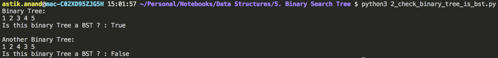

###### **Complexity:**

- **Time: O(n**) 
- **Auxilliary Space: O(1)** if recursive call stack is not considered. 


## 3. Lowest Common Ancestor in BST (LCA)***

###### **Problem:**

Given values of two values n1 and n2 in a Binary Search Tree, find the Lowest Common Ancestor (LCA).

We may assume that both the values exist in the tree.

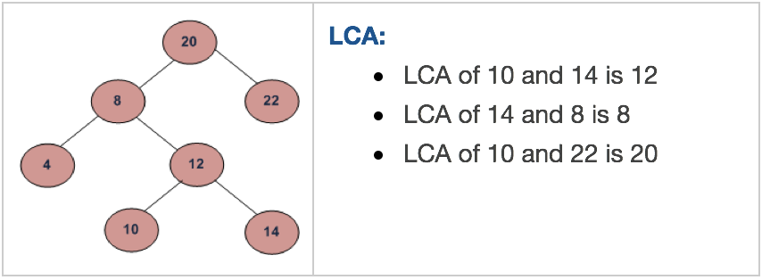

###### **Approach:**

- If both key1 and key2 is smaller than root's val, then lca exist in left subtree.
- If both key1 and key2 is greater than root's val, then lca exist in right subtree.
- Else this root is LCA.

###### **Implementation:**

```python
class Node:
    def __init__(self, val):
        self.val = val
        self.left = None
        self.right = None


def lowest_common_ancestor(root, key1, key2):
    while(root):
        # If both key1 and key2 is smaller than root's val, then lca exist in left subtree.
        if(key1 < root.val and key2 < root.val):
            root = root.left
        # If both key1 and key2 is greater than root's val, then lca exist in right subtree.
        elif(key1 > root.val and key2 > root.val):
            root = root.right
        # Else this root is LCA.
        else:
            break
    
    return root.val
        


root = Node(20) 
root.left = Node(8) 
root.right = Node(22) 
root.left.left = Node(4) 
root.left.right = Node(12) 
root.left.right.left = Node(10)
root.left.right.right = Node(14) 
print("Lowest Common Ancestor of 10 and 14 is : {}".format(lowest_common_ancestor(root, 10, 14)))
print("Lowest Common Ancestor of 14 and 8 is : {}".format(lowest_common_ancestor(root, 14, 8)))
print("Lowest Common Ancestor of 10 and 22 is : {}".format(lowest_common_ancestor(root, 10, 22)))
```

**Output:**

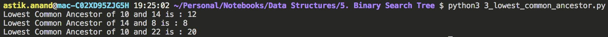

###### **Complexity:**

- **Time: O(n**) 
- **Auxilliary Space: O(1)**


## 4. Inorder Successor in BST***

###### **Problem:**

- Inorder successor of a node is the next node in Inorder traversal of the Binary Tree.
- Inorder Successor is NULL for the last node in Inoorder traversal.
- Inorder Successor of an input node can also be defined as the node with the smallest key greater than the key of input node. 
- So, it is sometimes important to find next node in sorted order.

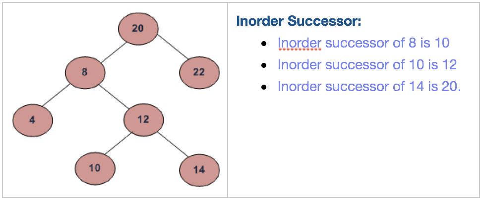

###### **Approach:**

The Algorithm is divided into two cases on the basis of right subtree of the input node being empty or not.

1. **If right subtree of given_node is NOT NULL:** then successor lies in right subtree. 
    - Go to right subtree and return the node with minimum key value in right subtree.
2. **If right subtree of given_node is NULL:** then start from root and use search like technique. 
    - Travel down the tree, if a node’s data > root’s data then go right side, otherwise go to left side.

###### **Algorithm:**

- Get the given node by search using key.

- If given_node's right exist, simply return the min_node from right.

- **Else:** Set successor as None and start from root and search for successor by travelling down the tree.

    > given_node हमेशा successor के left subtree में होना चाहिए, इसलिए successor तभी update करेंगे जब left subtree में जाएंगे ।

    - If given_node’s data < root’s data then go left side and update the successor. 
    - Else if a given_node’s data < root’s data then go to right side.
    - Else break when given_node’s data and root’s data are equal, given_node is found.

- Finally return the successor.

###### **Implementation:**

```python
class Node:
    def __init__(self, val):
        self.val = val
        self.left = None
        self.right = None


def inorder_successor(root, key):
    # Get the given node by search using key.
    given_node = search(root, key)

    # If given_node's right exist, simply return the min_node from right.
    if(given_node.right):
        return min_node(given_node.right)
    
    # Set successor as None and start from root and search for successor by travelling down the tree.
    successor = None
    while(root):
        # If given_node’s data < root’s data then go left side and update the successor.
        # given_node हमेशा successor के left subtree में होना चाहिए, 
        # इसलिए successor तभी update करेंगे जब left subtree में जाएंगे ।
        if(given_node.val < root.val):
            successor = root
            root = root.left
        # Else if a given_node’s data > root’s data then go to right side.
        elif (given_node.val > root.val):
            root = root.right
        # Else break when given_node’s data and root’s data are equal, given_node is found.
        else:
            break
    
    # Finally return the successor.
    return successor

        
def search(root, key):
    # If root is None, then key doesn't exist.
    if root is None:
        return root
    
    # If root's val matches the key, then we have found the key in 
    if(root.val == key):
        return root
    
    # If key is lesser than root's val search in left subtree else serach in right subtree.
    if(key < root.val):
        return search(root.left, key)
    else:
        return search(root.right, key)


def min_node(current_node):
    # If current_node is None, min_node not possible
    if(current_node is None):
        return None
    
    min_node = current_node
    while(min_node.left):
        min_node = min_node.left
    
    return min_node


root = Node(20) 
root.left = Node(8) 
root.right = Node(22) 
root.left.left = Node(4) 
root.left.right = Node(12) 
root.left.right.left = Node(10)
root.left.right.right = Node(14) 
print("Inorder Successor of  8 is : {}".format(inorder_successor(root, 8).val))
print("Inorder Successor of 10 is : {}".format(inorder_successor(root, 10).val))
print("Inorder Successor of 14 is : {}".format(inorder_successor(root, 14).val))
```

**Output:**

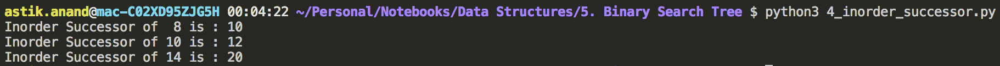

###### **Complexity:**

- **Time: O(Logn**) 
- **Auxilliary Space: O(1)**


## 5. K<sup>th</sup> Smallest Element in BST

###### **Problem:**

Given root of binary search tree and K as input, find K-th smallest element in BST.


###### **Approach-1:** **Using Inorder Traversal**

- Inorder traversal of BST retrieves elements of tree in the sorted order.
- The inorder traversal uses stack to store to be explored nodes of tree.
- The idea is to keep track of popped elements which participate in the order statics.
- **Time complexity:** **O(n)** where n is total nodes in tree. 

###### **Approach-2:** **Augmented  Tree Data Structure**

- The idea is to maintain rank of each node.
- We can keep track of elements in a subtree of any node while building the tree.
- Since we need Kth smallest element, we can maintain number of elements of left subtree in every node. 
- Assume that the root is having N nodes in its left subtree. If K = N + 1, root is Kth node. 
- If K < N, we will continue our search (recursion) for the Kth smallest element in the left subtree of root. If K > N + 1.
- We continue our search in the right subtree for the (K – N – 1)th smallest element. 
- Note that we need the count of elements in left subtree only.
- **Time complexity: O(h)** where h is height of tree. 

###### Implementation

```python


```

**Output:**

###### **Complexity:**

- **Time:** 
- **Auxilliary Space:**


## 6. Merge 2 BSTs with Limited Extra Space

###### **Problem:**

Given two Binary Search Trees(BST), print the elements of both BSTs in sorted form.

The expected time complexity is O(m+n) where m is the number of nodes in first tree and n is the number of nodes in second tree.

Maximum allowed auxiliary space is O(height of the first tree + height of the second tree).

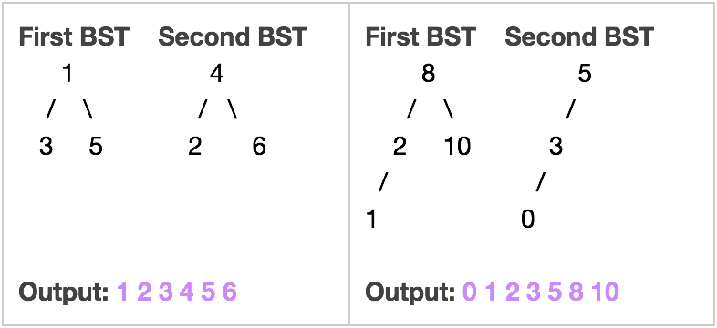

###### **Approach:**

- The idea is to use iterative inorder traversal.
- We use two auxiliary stacks for two BSTs.
- Since we need to print the elements in sorted form, whenever we get a smaller element from any of the trees, we print it.
- If the element is greater, then we push it back to stack for the next iteration.

###### Implementation

```python


```

**Output:**

###### **Complexity:**

- **Time: O(m+n**) 
- **Auxilliary Space: O(h<sub>m</sub>+h<sub>n</sub>)**


## 7. Binary Tree to BST Conversion

###### **Problem:**

Given a Binary Tree, convert it to a Binary Search Tree.

The conversion must be done in such a way that keeps the original structure of Binary Tree.

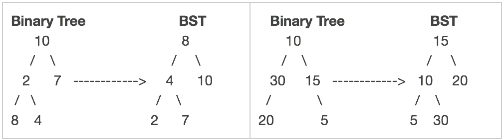

###### **Approach:**

- Create a temp array arr[ ] that stores inorder traversal of the tree. This step takes O(n) time.
- Sort the temp array arr[ ]. Time complexity of this step depends upon the sorting algorithm. In the following implementation, Quick Sort is used which takes (n<sup>2</sup>) time. This can be done in O(nLogn) time using Heap Sort or Merge Sort.
- Again do inorder traversal of tree and copy array elements to tree nodes one by one. This step takes O(n) time.

###### **Implementation:**

```python


```

**Output:**

###### **Complexity:**

- **Time: O(nlogn**) 
- **Auxilliary Space: O(n)**


## 8. Two Nodes are Swapped Correct the BST

###### **Problem:**

Two of the nodes of a BST are swapped. Fix or correct the BST.

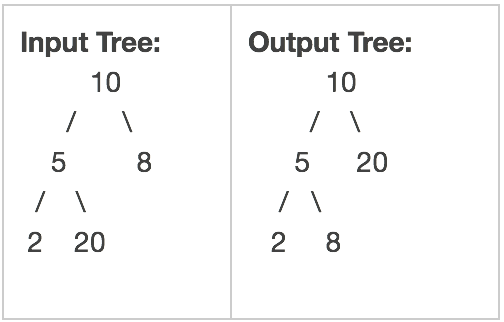

###### **Approach-1: Simple**

- Store inorder traversal of the input tree in an auxiliary array.
- Sort the auxiliary array.
- Finally, insert the auxiliary array elements back to the BST, keeping the structure of the BST same.
- **Time complexity:** O(nLogn) and **Auxiliary Space:** O(n). 

###### **Approach-2:** **O(n) time solution**

We can solve this in O(n) time and with a single traversal of the given BST.

Since inorder traversal of BST is always a sorted array, the problem can be reduced to a problem where two elements of a sorted array are swapped.

##### There are 2 cases that we need to handle:

1. **The swapped nodes are not adjacent in the inorder traversal of the BST.**

    > **Example:** Nodes 5 and 25 are swapped in {3 5 7 8 10 15 20 25}. 
    >
    > Inorder traversal of the given tree: 3 25 7 8 10 15 20 5 

    If we observe carefully, during inorder traversal, we find node 7 is smaller than the previous visited node 25. Here save the context of node 25 (previous node). Again, we find that node 5 is smaller than the previous node 20. This time, we save the context of node 5 ( current node ). Finally swap the two node’s values.

2. **The swapped nodes are adjacent in the inorder traversal of BST.**

    > **Example:** Nodes 7 and 8 are swapped in {3 5 7 8 10 15 20 25}. 
    >
    > The inorder traversal of the given tree is 3 5 8 7 10 15 20 25 

    Unlike case #1, here only one point exists where a node value is smaller than previous node value. e.g. node 7 is smaller than node 8.

##### How to Solve?

- We will maintain three pointers, first, middle and last.
- When we find the first point where current node value is smaller than previous node value, we update the first with the previous node & middle with the current node.
- When we find the second point where current node value is smaller than previous node value, we update the last with the current node. 
- In case #2, we will never find the second point.So, last pointer will not be updated. 
- After processing, if the last node value is null, then two swapped nodes of BST are adjacent.

###### **Implementation:**

```python


```

**Output:**

###### **Complexity:**

- **Time:** 
- **Auxilliary Space:**


------

<a href="binary-tree" class="prev-button">&larr; Previous:  Binary Tree</a>       <a href="heap" class="next-button">Next: Heap &rarr;</a>

