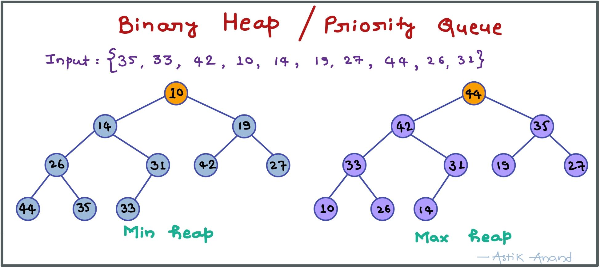
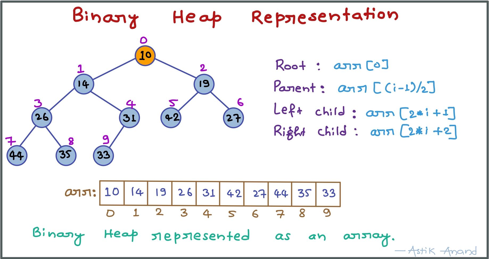
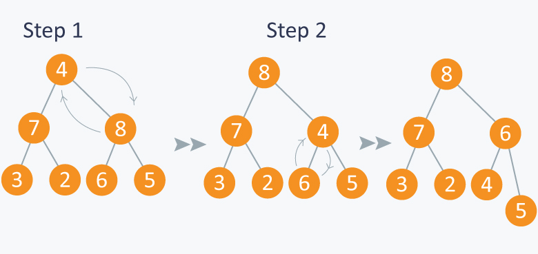
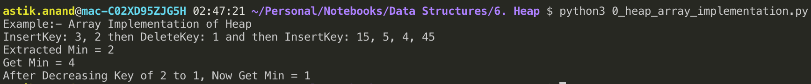
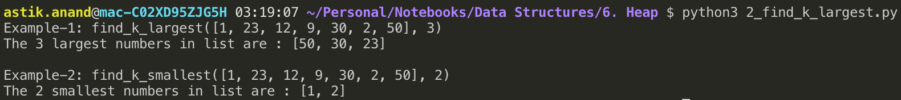

# Heap / Priority Queue

###### What is heap ?

- It is a specialized tree-based data structure which is essentially an almost complete tree that satisfies the heap property.
- Satisfying heap property means in max-heap every parent will be greater than children and smaller in case of min-heap.
- The heap is one maximally efficient implementation of an abstract data type called a **priority queue** and often referred as "heaps".

###### Different Variations of Heaps

- **Binary Heap**
- **Binomial Heap**
- **Fibonacci Heap**

<br>

> ### Binary Heap

- Introduced by **J. W. J. William**s in **1964**.
- A common implementation of a heap is the binary heap, in which the tree is a binary tree
- **A Binary Heap is a Binary Tree with following properties:**
    1. It’s a complete tree (All levels are completely filled except possibly the last level and the last level has all keys as left as possible). This property of Binary Heap makes them suitable to be stored in an array.
    2. A Binary Heap is either Min Heap or Max Heap. In a Min Binary Heap, the key at root must be minimum among all keys present in Binary Heap. The same property must be recursively true for all nodes in Binary Tree. Max Heap is similar to MinHeap.



##### Binary Heap Representation

A Binary Heap is a Complete Binary Tree. A binary heap is typically represented as an array.

- The root element will be at Arr[0].
- **Parent Node:** Arr[(i-1)/2]
- **Left Child Node:** Arr[(2*i)+1]
- **Right Child Node:** Arr[(2*i)+2]



##### heapify(): 

- **To maintain the heap property.**
- Let’s assume that we have a heap having some elements which are stored in array .
- The way to convert this array into a heap structure is the following.
    - Pick a node in the array, check if the left sub-tree and the right sub-tree are max heaps in themselves and the node itself is a max heap (it’s value should be greater than all the child nodes).
- To do this we will implement a function that can maintain the property of max heap (i.e each element value should be greater than or equal to any of its child and smaller than or equal to its parent).
- **Time Complexity: O(logN)**

```python
def max_heapify(arr, i, N):
    left_child = 2*i+1
    right_child = 2*i+2

    # Find the largest of left_child, right_child and parent which is i.
    largest = left_child if left_child < N and arr[left_child] > arr[i] else i
    largest = right_child  if right_child < N and arr[right_child] > arr[largest]

    # If Parent is not largest, swap and apply max_heapify on child to propagate it down
    if largest != i:
        arr[i], arr[largest] = arr[largest], arr[i]
        max_heapify(arr, largest, N)
```



##### build_heap():

- **Builds the heap from the given array.**
- Now let’s say we have **N** elements stored in the array **Arr** indexed from **0** to **N-1** . 
- They are currently not following the property of max heap. 
- So we can use max-heapify function to make a max heap out of the array.
- We know that elements from **Arr[n/2]** to **Arr[n-1]** are leaf nodes, and each node is a 1 element heap.
- Here, we can use **max_heapify** function in a bottom up manner on **remaining internal nodes**, so that we can cover each node of tree.
- **Time Complexity: O(N)**
- It seems complexity is O(NLogN) as we are calling heapify for N/2 times, but it has been proved that amortized time is O(N) only.

```python
def build_max_heap(arr):
    n = len(arr)
    for i in range(n//2, -1, -1):
        max_heapify(arr, i, n)
    
    return arr
```

<br>

#### Operations on Heap

1. **getMin():** It returns the root element of Min Heap. Time Complexity: **O(1)**.
2. **extractMin():** Removes the minimum element from MinHeap. Time Complexity: **O(Logn)** as this operation needs to maintain the heap property (by calling heapify()) after removing root.
3. **decreaseKey():** Decreases value of key. Time Complexity: **O(Logn)**. If the decreases key value of a node is greater than the parent of the node, then we don’t need to do anything. Otherwise, we need to traverse up to fix the violated heap property.
4. **insert():** Inserting a new key takes **O(Logn)** time. We add a new key at the end of the tree. If new key is greater than its parent, then we don’t need to do anything. Otherwise, we need to traverse up to fix the violated heap property.
5. **delete():** Deleting a key also takes **O(Logn)** time. We replace the key to be deleted with minum infinite by calling decreaseKey(). After decreaseKey(), the minus infinite value must reach root, so we call extractMin() to remove the key.

###### Implementation

```python
import sys
from heapq import heappush, heappop, heapify  

# Heap functions from python library  
#   • heappop - pop and return the smallest element from heap 
#   • heappush - push the value item onto the heap, maintaining heap invarient 
#   • heapify - transform list into heap, in place, in linear time 

MIN = -sys.maxsize-1
  

class MinHeap:
    def __init__(self): 
        self.heap = []  
  
    def parent(self, i): 
        return int((i-1)/2)
      
    # Inserts a new key 'k' 
    def insertKey(self, k): 
        heappush(self.heap, k)            
  
    # Decrease value of key at index 'i' to new_val 
    # It is assumed that new_val is smaller than heap[i] 
    def decreaseKey(self, i, new_val): 
        self.heap[i]  = new_val  
        while(i != 0 and self.heap[self.parent(i)] > self.heap[i]): 
            # Swap heap[i] with heap[parent(i)] 
            self.heap[i] , self.heap[self.parent(i)] = self.heap[self.parent(i)], self.heap[i] 
              
    # Method to remove minium element from min heap 
    def extractMin(self): 
        return heappop(self.heap) 
  
    # This functon deletes key at index i. It first reduces 
    # value to minus infinite and then calls extractMin() 
    def deleteKey(self, i): 
        self.decreaseKey(i, MIN) 
        self.extractMin() 
  
    # Get the minimum element from the heap 
    def getMin(self): 
        return self.heap[0] 
  


print("Example:- Array Implementation of Heap")
print("InsertKey: 3, 2 then DeleteKey: 1 and then InsertKey: 15, 5, 4, 45")
my_heap = MinHeap() 
my_heap.insertKey(3) 
my_heap.insertKey(2) 
my_heap.deleteKey(1) 
my_heap.insertKey(15) 
my_heap.insertKey(5) 
my_heap.insertKey(4) 
my_heap.insertKey(45)

print("Extracted Min = {}".format(my_heap.extractMin()))
print("Get Min = {}".format(my_heap.getMin()))
my_heap.decreaseKey(2, 1) 
print("After Decreasing Key of 2 to 1, Now Get Min = {}".format(my_heap.getMin()))
```

**Output:**



<br>

#### Applications of Heap

1. **Heap Sort:** It uses Binary Heap to sort an array in O(nLogn) time.
2. **Priority Queue:** Priority queues can be efficiently implemented using Binary Heap because it supports insert(), delete() and extractmax(), decreaseKey() operations in O(logn) time. Binomoial Heap and Fibonacci Heap are variations of Binary Heap. These variations perform union also efficiently.
3. **Graph Algorithms:** The priority queues are especially used in Graph Algorithms like **Dijkstra's Shortest Path** and **Prim's Minimum Spanning Tree**.
4. Many standard interesting problems can be efficiently solved using Heaps.
    - ***K<sup>th</sup> Largest Element in an array.***
    - ***Sort an almost Sorted Array.***
    - ***Merge K Sorted Arrays.***


---

### Standard Heap Problems

## 1. Find k largest/smallest elements in an array***

###### Problem:

Given an array of elements find k largest or smallest elements of it.

> **Examples:**
>
> ***Input:*** [1, 23, 12, 9, 30, 2, 50]  and k=3
>
> ***Output:*** 50, 30, 23

###### Approach-1: Use Sorting

- Sort the elements and then pick its first k elements.
- **Time Complexity:** O(nlogn)

###### Approach-2 Use Heap

- Build a Max Heap tree in O(n).
- Use Extract Max k times to get k maximum elements from the Max Heap O(klogn).
- **Time complexity:** O(n + klogn)

###### Implementation

```python
from heapq import heapify, nlargest, nsmallest

def find_k_largest(arr, k):
    heapify(arr)
    print("The {} largest numbers in list are : {}".format(k, nlargest(k, arr)))

def find_k_smallest(arr, k):
    heapify(arr)
    print("The {} smallest numbers in list are : {}".format(k, nsmallest(k, arr)))


print("Example-1: find_k_largest([1, 23, 12, 9, 30, 2, 50], 3)")
find_k_largest([1, 23, 12, 9, 30, 2, 50], 3)

print("\nExample-2: find_k_smallest([1, 23, 12, 9, 30, 2, 50], 2)")
find_k_smallest([1, 23, 12, 9, 30, 2, 50], 2)
```

**Output:**



###### **Complexity:**

- **Time: O(n+klogn)**

<br>

<br>

------

<a href="binary-search-tree" class="prev-button">&larr; Previous:  Binary Serach Tree</a>        <a href="hash" class="next-button">Next: Hash &rarr;</a>

