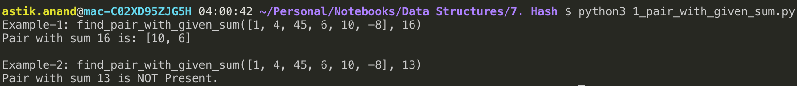
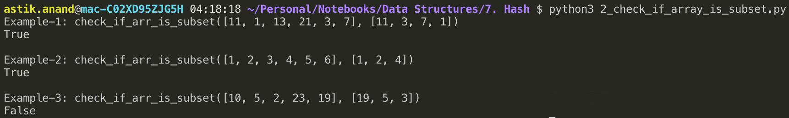
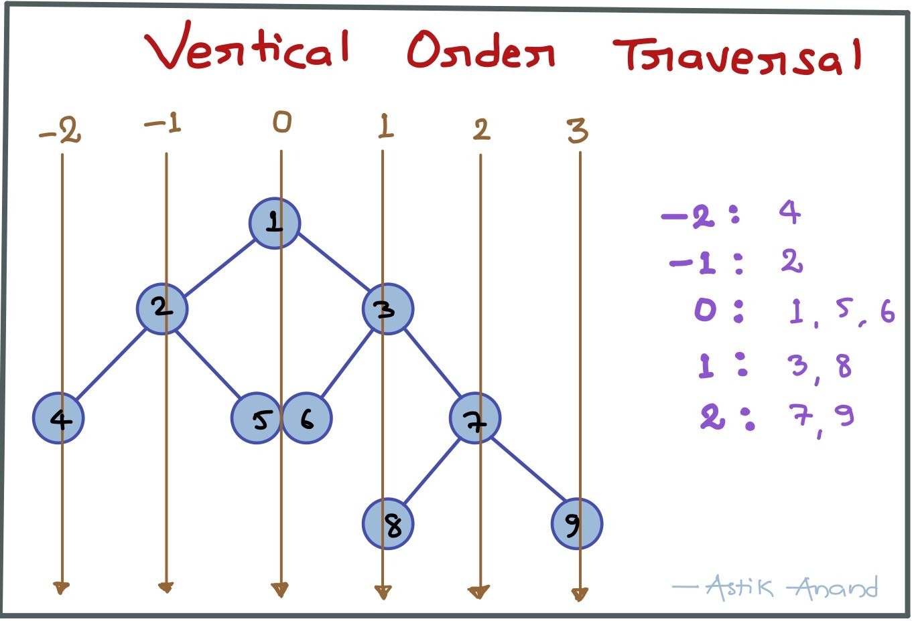
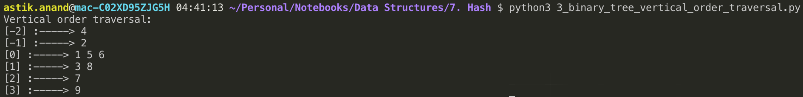

# Hash

###### What is Hash Data Structure ?

- It is a dictionary type data structure which can give the value of key if present in O(1) time.
- It stores the key-value pairs.
- Actually, it is a technique that is used to uniquely identify a specific object from a group of similar objects.

###### Practical Life Examples:

- In universities, each student is assigned a unique roll number that can be used to retrieve information about them.
- In libraries, each book is assigned a unique number that can be used to determine information about the book, such as its exact position in the library or the users it has been issued to etc.

#### Representation of Hash

Data is stored using a special function called the Hash function which is used to map a given value with a particular key for faster access of elements. The efficiency of mapping depends of the efficiency of the hash function used.


In hashing, large keys are converted into small keys by using **hash functions**. The values are then stored in a data structure called **hash table**. The idea of hashing is to distribute entries (key/value pairs) uniformly across an array. Each element is assigned a key (converted key). By using that key you can access the element in **O(1)** time. Using the key, the algorithm (hash function) computes an index that suggests where an entry can be found or inserted.

##### Hash Function

A hash function is any function that can be used to map a data set of an arbitrary size to a data set of a fixed size, which falls into the hash table. The values returned by a hash function are called hash values, hash codes, hash sums, or simply hashes.

> To achieve a good hashing mechanism, It is important to have a good hash function with the following basic requirements:

1. **Easy to compute:** It should be easy to compute and must not become an algorithm in itself.
2. **Uniform distribution:** It should provide a uniform distribution across the hash table and should not result in clustering.
3. **Less collisions:** Collisions occur when pairs of elements are mapped to the same hash value. These should be avoided.

###### Notes:

- Irrespective of how good a hash function is, collisions are bound to occur.
- Therefore, to maintain the performance of a hash table, it is important to manage collisions through various collision resolution techniques.

#### Hashing Operations

- Hashing provides constant time search, insert and delete operations on average.
- This is why hashing is one of the most used data structure, example problems are, distinct elements, counting frequencies of items, finding duplicates, etc

#### Applications of Hashing

There are many other applications of hashing, including modern day cryptography hash functions. Some Examples are:

- Message Digest
- Password Verification
- Data Structures(Programming Languages)
- Compiler Operation
- Rabin-Karp Algortithm
- Linking File name and path together


------

### Some Standard Hashing Problems

## 1. Find Pair With Given Sum

###### Problem:

Given an array A[] of n numbers and another number x, determines whether or not there exist two elements in S whose sum is exactly x.

> **Examples:**
>
> Input: [1, 4, 45, 6, 10, -8]  and sum = 16
>
> Output: True (6, 10)

###### Approach-1: Sorting

- Sort the numbers and then start from leftmost and rightmost.
- If sum is larger shift rightmost to left and if smaller shift leftmost to right.
- Keep doing this until we find a sum.
- **Time Complexity: O(nlogn)**

###### Approach-2: Use Hashing

- Take an empty hash.
- For every element in array check if **x-current** is already present in hash and if not put current in hash.
- If x-current is already there then numbers are current and x-current.
- **Time Complexity: O(n)**

###### Implementation

```python
def find_pair_with_given_sum(arr, x):
    my_hash = {}
    sum_found = False
    for i in arr:
        if my_hash.get(x-i, False):
            print("Pair with sum {} is: [{}, {}]".format(x, i, x-i))
            sum_found = True
        else:
            my_hash[i] = True
    
    if not sum_found:
        print("Pair with sum {} is NOT Present.".format(x))


print("Example-1: find_pair_with_given_sum([1, 4, 45, 6, 10, -8], 16)")
find_pair_with_given_sum([1, 4, 45, 6, 10, -8], 16)

print("\nExample-2: find_pair_with_given_sum([1, 4, 45, 6, 10, -8], 13)")
find_pair_with_given_sum([1, 4, 45, 6, 10, -8], 13)
```

**Output:**




## 2. Find whether an array is subset of another array

###### Problem:

Given two arrays: arr1[0..m-1] and arr2[0..n-1].

Find whether arr2[] is a subset of arr1[] or not. Both the arrays are not in sorted order. 

It may be assumed that elements in both array are distinct.

> **Examples:**
>
> **Input**: arr1[] = [11, 1, 13, 21, 3, 7] &nbsp; arr2[] = [11, 3, 7, 1]
> **Output**: True
>
> 
>
> **Input**: arr1[] = [1, 2, 3, 4, 5, 6] &nbsp;  arr2[] = [1, 2, 4]
> **Output**: True
>
> 
>
> **Input**: arr1[] = [10, 5, 2, 23, 19] &nbsp;  arr2[] = [19, 5, 3]
> **Output**: False

###### Approach-1: Brute-Force

- Use two loops: The outer loop picks all the elements of arr2[] one by one.
- The inner loop linearly searches for the element picked by the outer loop.
- If all elements are found then return True, else return False.
- **Time Complexity: O(n<sup>2</sup>)**

###### Approach-2: Sorting and Binary Search

- Sort arr1[] which takes O(mLogm)
- For each element of arr2[], do binary search for it in sorted arr1[].
- If the element is not found then return False, If all elements are present then return True.
- **Time Complexity: O(mLogm + nLogm)**

###### Approach-3: Use Hashing

- Create a Hash for all the elements of arr1[].
- Traverse arr2[] and search for each element of arr2[] in the Hash Table. 
- If the element is not found then return False, If all elements are present then return True.
- **Time Complexity: O(m+n)**

###### Implementation

```python
def check_if_arr_is_subset(arr1, arr2):
    my_hash = {}
    for i in arr1:
        my_hash[i] = True

    status = True
    for i in arr2:
        if not my_hash.get(i, False):
            status = False
            break
    
    if status:
        print("True")
    else:
        print("False")


print("Example-1: check_if_arr_is_subset([11, 1, 13, 21, 3, 7], [11, 3, 7, 1])")
check_if_arr_is_subset([11, 1, 13, 21, 3, 7], [11, 3, 7, 1])
print("\nExample-2: check_if_arr_is_subset([1, 2, 3, 4, 5, 6], [1, 2, 4])")
check_if_arr_is_subset([1, 2, 3, 4, 5, 6], [1, 2, 4])
print("\nExample-3: check_if_arr_is_subset([10, 5, 2, 23, 19], [19, 5, 3])")
check_if_arr_is_subset([10, 5, 2, 23, 19], [19, 5, 3])
```

**Output:**




## 3. Vertical Order Traversal***

###### Problem:

Given a binary tree, print it vertically.



###### Approach: Use Hashing

- Start from root as level=0, and when going left decrease the level by 1 and while going right increse the level by 1.
- Store the level as key and value as list of element at that particular level.

###### Implementation

```python
from collections import defaultdict

class Node:
    def __init__(self, key):
        self.left = None
        self.right = None
        self.val = key

        
def get_vertical_order(root, level, my_hash): 
    if root is None: 
        return
    
    # Put the root in hash with level
    my_hash[level].append(root.val)

    # Decrease the level while going in left subtree
    get_vertical_order(root.left, level-1, my_hash)

    # Increase the level while going in right subtree
    get_vertical_order(root.right, level+1, my_hash) 
  

def print_vertical_order(root): 
    # Hash to store vertical order
    my_hash = defaultdict(list)
    level = 0 
    get_vertical_order(root, level, my_hash) 

    for key, values in sorted(my_hash.items()):
        print("[{}] :-----> ".format(key), end = "")
        for v in values:
            print(v, end=" ")
        print()


root = Node(1) 
root.left = Node(2) 
root.right = Node(3) 
root.left.left = Node(4) 
root.left.right = Node(5) 
root.right.left = Node(6) 
root.right.right = Node(7) 
root.right.left.right = Node(8) 
root.right.right.right = Node(9) 
print ("Vertical order traversal:")
print_vertical_order(root)
```

**Output:**




------

<a href="8_heap" class="prev-button">&larr; Previous:  Heap</a>          <a href="10_graph" class="next-button">Next: Graph &rarr;</a>

