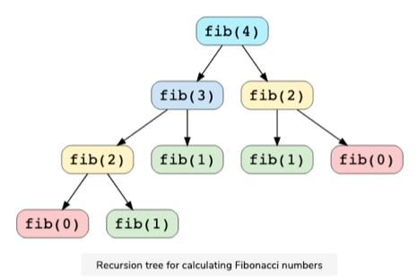

# Dynamic Programming Patterns

##### Dynamic Programming

- An algorithmic techique for solving an optimization problem by breaking it down into simpler subproblems.
- Utilizes the fact that the optimal solution to the overall problem depends on the optimal solutions to its subproblems.
- ***Example:*** Fibonacci numbers - We can calculate nth Fibonacci by below eqution

```
fib(n) = fib(n-1) + fib(n-2) for n > 1
```

- Here to solve the overall problem we broke it down to smaller subproblems.

<br>

##### Characteristics of Dynamic Programming

[1. Overlapping Subproblems]()

- Subproblems are smaller version of the original problem.
- Any problem has overlappping subproblems if finding its solution involves solving the same subproblem multiple times.



- Here we can see overlapping subproblems as **fib(2)** is evaluated twice and **fib(1)** evaluated thrice.

<br>

[2. Optimal Substructure Property]()

- Any problem has optimal substructure property if its overall optimal solution can be constructed from optimal solution of subproblems.
- **`fib(n)= fib(n-1)+fib(n-2)`** - shows that overall problem of size ***n*** is reduced to subproblems of size ***n-1*** and ***n-2***.

<br>

##### Methods to Solve Dynamic Programming Problem 

###### 1. Recursion + Memoization (Top-Down Approach)

- Solve bigger problem by recursiverly finding the solution to smaller sub-problems.
- ***Whenever we solve a sub-problem we cache its result to avoid calling it multiple times.***
- This technique of storing the results of already solved subproblems k/a [Memoization]().

###### 2. Iteration + Tabulation (Bottom-Up Approach)

- Tabulation is opposite of Top-Down Approach and avoids recursion.
- In this we solve the problem bottom up (i.e by solving all the related subproblems first).
- ***This is typically done by filling an n-dimensional table.***
- Based on the results in the table, the solution to the top/orignal problem is computed.


> [Note :-]() In memoization we solve the problem and maintain a map of already solved subproblems, in other word in memoization we go from top to down in the sense that we solve top problem first (which typically recurse down to solve the subproblems). 

<br>

<br>

### Patterns to be studied:

1. **Fibonacci Numbers Pattern**
2. **0/1 Knapsack Pattern**
3. **Unbounded Knapsack Pattern**
4. **Palindromic Subsequence Pattern**
5. **Longest Common Substring Pattern**


<br>

<br>

---

<a href="fibonacci-numbers-pattern" class="next-button">Next: Fibonacci Numbers Pattern &rarr;</a>

