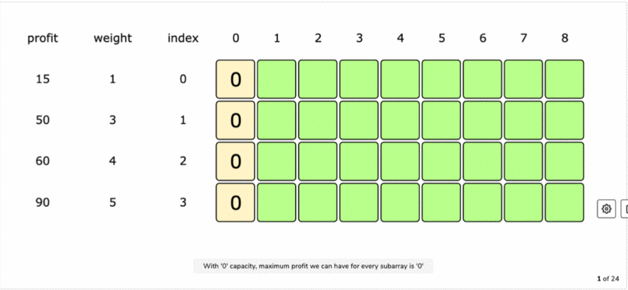
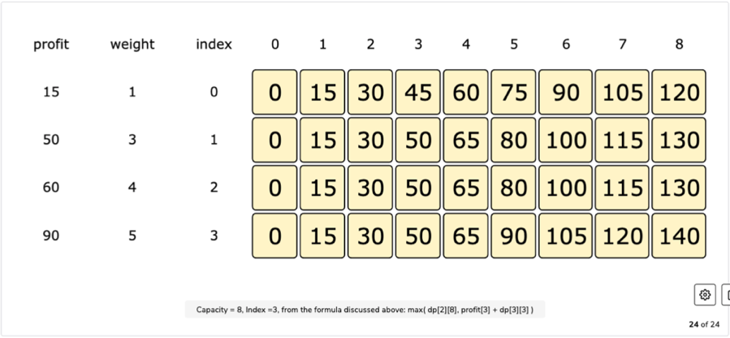
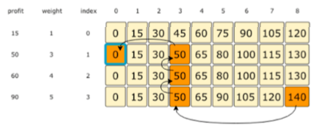

# Unbounded Knapsack Pattern

##### Introduction :

Given the weights and profits of 'N' items, put it in a knapsack of capacity 'C' such that we get the max profit.

Only difference between 0/1Knapsack and Unbounded knapsack is that here we are allowed to use an unlimited quantity of an item.

```
Example:
items: {Apple, Orange, Melon}
weights: {1, 2, 3}
profits: {15, 20, 50}
capacity: 5

Different Profit Combinations:
5 Apples (total weight 5) => 75 profit
1 Apple + 2 Oranges (total weight 5) => 55 profit
3 Apples + 1 Orange (total weight 5) => 65 profit
2 Apples + 1 Melon (total weight 5) => 80 profit
1 Orange + 1 Melon (total weight 5) => 70 profit

Best Profit Combination : 2 Apples + 1 Melon with 80 profit.
```

<br>

###### Problem:

Given the weights ***w*** and profits ***p*** of 'N' items, need to find a subset of these items which will give max profit with contstraint that their cumulative sum should not be greater than total knapsack capacity ***C***.

Each item can only be selected multiple times.

###### Brute-Force : Recursive Solution

- Try all possible combination of given items and choose the one with maximum profits.
- The only difference from 0/1 knapsack is after including the item we recursively call to process all items (instead of remaining).

**Code:**

```python
def unbounded_knapsack_recursion(weights, profits, capacity):
    item_index = 0
    return unbounded_knapsack_recursion_util(weights, profits, capacity, item_index)


def unbounded_knapsack_recursion_util(weights, profits, capacity, item_index):
    if (capacity <= 0 or item_index >= len(profits)):
        return 0

    current_included_profit, current_excluded_profit = 0, 0
    if(weights[item_index] <= capacity):
        current_included_profit = profits[item_index] + \
            unbounded_knapsack_recursion_util(weights, profits, capacity - weights[item_index], item_index)

    current_excluded_profit = unbounded_knapsack_recursion_util(weights, profits, capacity, item_index + 1)

    return max(current_included_profit, current_excluded_profit)


print("Recursive Method :")
print(unbounded_knapsack_recursion([1, 3, 4, 5], [15, 50, 60, 90], 8))
print(unbounded_knapsack_recursion([1, 3, 4, 5], [15, 50, 60, 90], 6))
```

**Output:**

```
140
105
```

**Complexity:**

- ***Time: O(2<sup>N+C</sup>)*** - Exponential with N+C, with N as no. of elements and C as knapsack capacity.
- ***Space: O(N+C)*** - To store the recursion stack. Max depth of recurstion stack is N+C.

<br>

###### DP : Recursion + Memoization (Top-Down) Solution

- We can use memoization to solve it in top-down manner.

**Code:**

```python
def unbounded_knapsack_dp_memoization(weights, profits, capacity):
    memory = [[None] * (capacity + 1) for i in range(len(weights))]
    item_index = 0
    return unbounded_knapsack_dp_memoization_util(weights, profits, capacity, item_index, memory)


def unbounded_knapsack_dp_memoization_util(weights, profits, capacity, item_index, memory):
    if (capacity <= 0 or item_index >= len(profits)):
        return 0

    if (memory[item_index][capacity]):
        return memory[item_index][capacity]

    current_included_profit, current_excluded_profit = 0, 0
    if(weights[item_index] <= capacity):
        current_included_profit = profits[item_index] + \
            unbounded_knapsack_dp_memoization_util(weights, profits, capacity - weights[item_index], item_index, memory)

    current_excluded_profit = unbounded_knapsack_dp_memoization_util(weights, profits, capacity, item_index + 1, memory)
    memory[item_index][capacity] = max(current_included_profit, current_excluded_profit)

    return memory[item_index][capacity]


print("\nDP -> Recursion + Memoization Method :")
print(unbounded_knapsack_dp_memoization([1, 3, 4, 5], [15, 50, 60, 90], 8))
print(unbounded_knapsack_dp_memoization([1, 3, 4, 5], [15, 50, 60, 90], 6))
```

**Output:**

```
140
105
```

**Complexity:**

- ***Time: O(N\*C)*** - Our memory stores the results for all the possible subproblems, hence we can't have more than N*C subproblems.
- **Space: O(N*C)** - N*C space is used to store results and N for the recursion call stack and hence asymptotically O(N\*C).

<br>

###### DP : Iteration + Tabulation (Bottom-Up) Solution

- Now we will try to solve the problem in bottom up fashion.
- We want to find the maximum profit for every sub-array and for every possible capacity.
- For every possbile capacity **'c' (0<=c<=capacity)**, we have two options.
  1. **Exclude the item**, in this case we will take whatever profit we get from the sub-array excluding this item **table\[index-1][c]**.
  2. **Include the item** if weight is lesser than capacity avaialble, in this we get profit by this item plus profit from remaining capacity **profits[item_index] + table\[index][c]**.
- Finally take the maximum of both.

> `table[index][c] = max(table[index-1][c], profits[item_index] + table[index][c-weights[item_index]])`

**Filling the DP table in bottom up manner:**



<br>

**Finally the DP table:**



<br>

**Code:**

```python
def unbounded_knapsack_dp_tabulation(weights, profits, capacity):
    n = len(profits)
    table = [[0] * (capacity + 1) for i in range(n)]

    # When capacity is 0, none of the item can be selected
    for i in range(n):
        table[i][0] = 0

    # When only 1 item is considered, get the profits using that item for every capapcity 'c'
    for c in range(capacity + 1):
        table[0][c] = (c // weights[0]) * profits[0]

    # For each item, check for every possible capacities
    for i in range(1, n):
        for c in range(1, capacity + 1):
            if (weights[i] <= c):
                table[i][c] = max(table[i - 1][c], profits[i] + table[i][c - weights[i]])
            else:
                table[i][c] = table[i - 1][c]

    return table[i][c]


print("\nDP -> Iteration + Tabulation Method :")
print(unbounded_knapsack_dp_tabulation([1, 3, 4, 5], [15, 50, 60, 90], 8))
print(unbounded_knapsack_dp_tabulation([1, 3, 4, 5], [15, 50, 60, 90], 6))
```

**Output:**

```
DP -> Iteration + Tabulation Method :
140
105
```

**Complexity:**

- ***Time: O(N\*C)*** 
- **Space: O(N*C)** 

<br>

##### Finding Selected Items:



- Start from bottom right corener, in this case we have 140.
- Then check top cell (130 in this case), it is not coming from top cell, so we select this item (4th item) and subtract it profit and go to 50.
- Then we check that it comes from top cell (50), so we ignore it (4th item this time) and go to previous row.
- Now again this 50 comes from top, so we go to previous row and ignore (3rd item).
- Now this 50 doesn't come from top which is 45, so we select this item (2nd item) and subtract its profit  to go to 0.
- As we reach 0 now, so we are done picking the items.

<br>

**Code:**

```python
def unbounded_knapsack_dp_tabulation(weights, profits, capacity):
    n = len(profits)
    table = [[0] * (capacity + 1) for i in range(n)]

    # When capacity is 0, none of the item can be selected
    for i in range(n):
        table[i][0] = 0

    # When only 1 item is considered, get the profits using that item for every capapcity 'c'
    for c in range(capacity + 1):
        table[0][c] = (c // weights[0]) * profits[0]

    # For each item, check for every possible capacities
    for i in range(1, n):
        for c in range(1, capacity + 1):
            if (weights[i] <= c):
                table[i][c] = max(table[i - 1][c], profits[i] + table[i][c - weights[i]])
            else:
                table[i][c] = table[i - 1][c]

    pick_selected_items(table, weights, profits)

    return table[i][c]


def pick_selected_items(table, weights, profits):
    i, c = len(table)-1, len(table[0])-1
    total_profit = table[i][c]

    print("Selected items are : ")
    while (i-1 >= 0 and table[i][c] >= 0):
        if (table[i][c] != table[i - 1][c]):
            print(f"item - {i+1} with weight : {weights[i]} and profit : {profits[i]}")
            c -= weights[i]
            total_profit -= profits[i]
        else:
            i -= 1

    while (total_profit > 0):
        print(f"item - {1} with weight : {weights[0]} and profit : {profits[0]}")
        total_profit -= profits[0]


print("\nDP -> Iteration + Tabulation Method :")
print(unbounded_knapsack_dp_tabulation([1, 3, 4, 5], [15, 50, 60, 90], 8))
print(unbounded_knapsack_dp_tabulation([1, 3, 4, 5], [15, 50, 60, 90], 6))
```

**Output:**

```
Selected items are : 
item - 4 with weight : 5 and profit : 90
item - 2 with weight : 3 and profit : 50
140
Selected items are : 
item - 4 with weight : 5 and profit : 90
item - 1 with weight : 1 and profit : 15
105
```


<br>

---

### Problems following Unbounded Knapsack Patterns

## 1. Rod Cutting

## 2. Coin Change

## 3. Minimum Coin Change

## 4. Maximum Ribbon Cut


 

