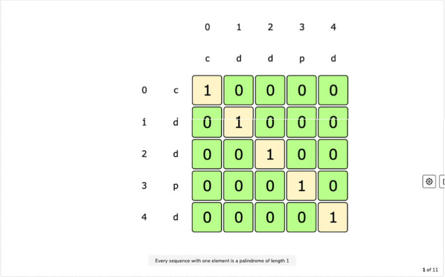
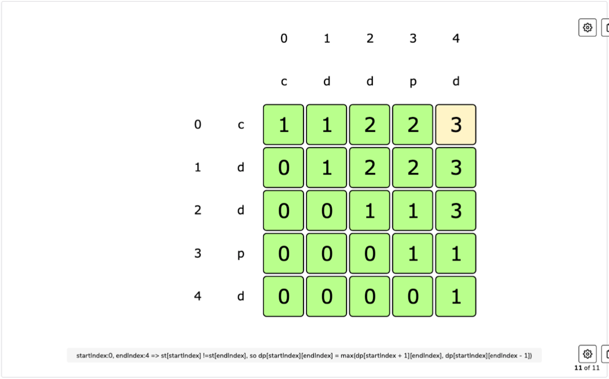
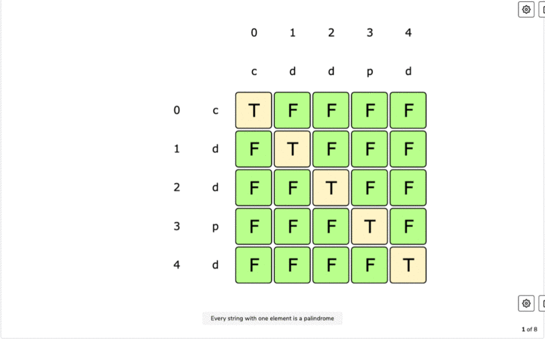
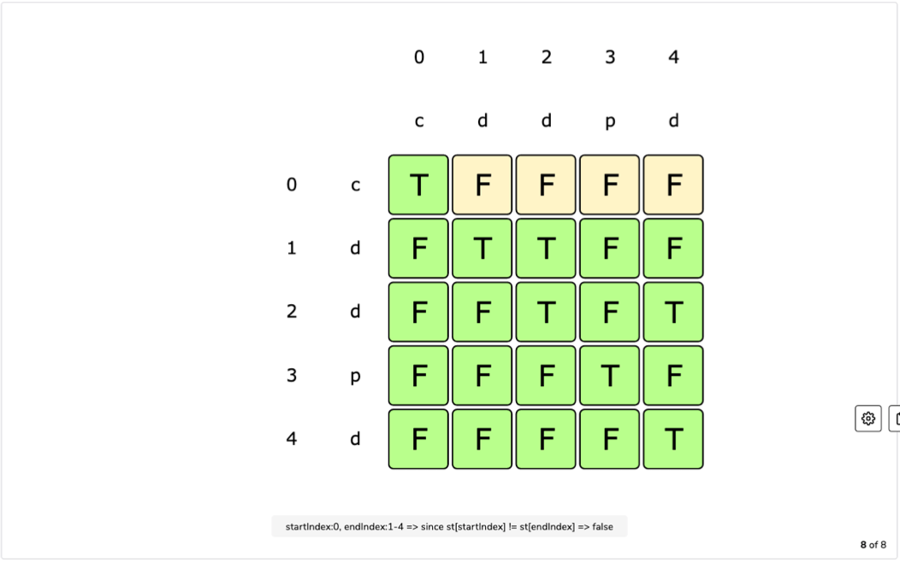

# Palindromic Subsequence Pattern

### Problems Following Palindromic Subsequence Pattern

## 1. Longest Palindromic Subsequence

###### Problem Statement:

Given a sequence, find the length of longest palindromic subsequence (LPS).

In Palindromic subsequence, elements read the same backword and forward.

A subsequence is a sequence that can be derived from anothe subsequence by deleting some or no elements without changing the order of remaining elements.

```
======= Examples: =======
Input: "abdbca"
Output: 5 => "abdba"

Input: "cddpd"
Output: 3 => "ddd"

Input: "pqr"
Output: 1 => any single char "p" or "q" or "r"
```

<br>

###### Brute-Force : Recursive Solution

- We can try all the subsequences of the given sequence.
- Start processing from the beginning and the end of the sequence. So now at any step, we have 2 options:
  1. If the element at the beginning and at the end are same, increment count by 2 and make recursive call for remaining sequence.
  2. If element at both end are not same, make two recursive calls for remainnig sequence skipping element from either end.
- If option-1 applies, it gives the length of LPS, otherwise the the length of LPS will be max of two recursive calls.

**Code:**

```python
def find_lps_length_recursion(string):
    start, end = 0, len(string) - 1
    return find_lps_length_recursion_util(string, start, end)


def find_lps_length_recursion_util(string, start, end):
    if (start > end):
        return 0

    if (start == end):
        return 1

    if (string[start] == string[end]):
        return 2 + find_lps_length_recursion_util(string, start + 1, end - 1)
    else:
        skip_start_lps = find_lps_length_recursion_util(string, start + 1, end)
        skip_end_lps = find_lps_length_recursion_util(string, start, end - 1)
        return max(skip_start_lps, skip_end_lps)


print("Recursive Method :")
print(find_lps_length_recursion("abdbca"))
print(find_lps_length_recursion("cddpd"))
print(find_lps_length_recursion("pqr"))
```

**Output:**

```
Recursive Method :
5
3
1
```

**Complexity:**

- ***Time: O(2<sup>N</sup>)*** - Two recursive calls at max every time.
- ***Space: O(N)*** - To store the recursion stack. Max depth of recurstion stack is N.

<br>

###### DP : Recursion + Memoization (Top-Down) Solution

- We can use memoizaton to solve the recurring problem.
- The two changing values in our recursive function is start and end indexes.
- We can use 2-D array to store solution to our repeated subproblems.
- We can also use start + "|" + end as key to store in a hashmap.

**Code:**

```python
def find_lps_length_dp_memoization(string):
    n = len(string)
    start, end = 0, n - 1
    memory = [[None]*n for i in range(n)]
    return find_lps_length_memoization_util(string, start, end, memory)


def find_lps_length_memoization_util(string, start, end, memory):
    if (start > end):
        return 0

    if (start == end):
        return 1

    if (memory[start][end]):
        return memory[start][end]

    if (string[start] == string[end]):
        memory[start][end] = 2 + find_lps_length_memoization_util(string, start + 1, end - 1, memory)
        return memory[start][end]

    skip_start_lps = find_lps_length_memoization_util(string, start + 1, end, memory)
    skip_end_lps = find_lps_length_memoization_util(string, start, end - 1, memory)
    memory[start][end] = max(skip_start_lps, skip_end_lps)
    return memory[start][end]


print("\nDP -> Recursion + Memoization Method :")
print(find_lps_length_dp_memoization("abdbca"))
print(find_lps_length_dp_memoization("cddpd"))
print(find_lps_length_dp_memoization("pqr"))
```

**Output:**

```
DP -> Recursion + Memoization Method :
5
3
1
```

**Complexity:**

- ***Time: O(N<sup>2</sup>)*** - At max we can have N*N subproblems.
- ***Space: O(N<sup>2</sup>)*** - We need N*N to store results of sub-problems and N to store the recursion stack. Total is O(N<sup>2</sup> + N), asymptotically O(N<sup>2</sup>).

<br>

###### DP : Iteration + Tabulation (Bottom-Up) Solution

- We can fill the table in bottom-up manner also.
- Start from the begining of the sequence and keep adding one element at a time.
- At every step we try all its subsequences, so for **every start index and end index** choose one option from below:
  1. If the element at start and end index mathces, **LPS length will be 2 + LPS till start+1 and end-1**.
  2. If they don't match, take max LPS created by either skipping element at start or end.

> **Table Filling Formula:**
>
> if string[start] == string[end]:
>
> ​	table\[start][end] = 2 + table\[start+1][end-1]
>
> else:
>
> ​	table\[start][end] = max(table\[start+1][end], table\[start][end-1])

**Tabulation:**



**Final Table:**



**Code:**

````python
def find_lps_length_dp_tabulation(string):
    n = len(string)
    table = [[0] * n for _ in range(n)]

    # When start and end indexes are equal palindrome length will be 1
    for i in range(n):
        table[i][i] = 1

    # for filling table[start][end], we need to have table[start+1][end-1] ready
    # Also, we need to fill only top right part of table coz bottom left will always be zero (start < end)
    # Diaognal values will be 1, filled earlier
    for start in range(n - 2, -1, -1):
        for end in range(start + 1, n):
            if (string[start] == string[end]):
                table[start][end] = 2 + table[start + 1][end - 1]
            else:
                table[start][end] = max(table[start + 1][end], table[start][end - 1])

    return table[0][n-1]


print("\nDP -> Iteration + Tabulation Method :")
print(find_lps_length_dp_tabulation("abdbca"))
print(find_lps_length_dp_tabulation("cddpd"))
print(find_lps_length_dp_tabulation("pqr"))
````

**Output:**

```
DP -> Iteration + Tabulation Method :
5
3
1
```

**Complexity:**

- ***Time: O(N<sup>2</sup>)*** - At max we can have N*N subproblems.
- ***Space: O(N<sup>2</sup>)*** - We need N*N to store results of sub-problems.

<br>

<br>

## 2. Longest Palindromic Substring

###### Problem Statement:

Given a string, find the length of its longest palindromic substring.

A substring is a continuous part of string and palindromic substring, elements read the same backword and forward.

```
======= Examples: =======
Input: "abdbca"
Output: 3 => "bdb"

Input: "cddpd"
Output: 3 => "dpd"

Input: "pqr"
Output: 1 => any single char "p" or "q" or "r"
```

<br>

###### Brute-Force : Recursive Solution

- This problem follows the [Longest Palindromic Subsequence Pattern]().
- Only difference is that in subsequence, characters can be non adjacent, but in substring all characters should be continuous.
- The brute-force way is to try all the substring of the given string.
- Start processing from the begining and the end of the string. Now at any step we have 2 options:
  1. If element at start and end are same, make a recursive call to check if remaining substring is also a palindrome. If it is then substring from start to end is a palindrome.
  2. Skip either from start and end to make two recursive calls for remaining substring, lps lenght will be max of both of these.

**Code:**

```python
def find_lps_length_recursion(string):
    start, end = 0, len(string) - 1
    return find_lps_length_recursion_util(string, start, end)


def find_lps_length_recursion_util(string, start, end):
    if (start > end):
        return 0

    if (start == end):
        return 1

    if (string[start] == string[end]):
        remainingLength = end - start - 1
        if (remainingLength == find_lps_length_recursion_util(string, start + 1, end - 1)):
            return 2 + remainingLength

    skip_start_lps = find_lps_length_recursion_util(string, start + 1, end)
    skip_end_lps = find_lps_length_recursion_util(string, start, end - 1)
    return max(skip_start_lps, skip_end_lps)


print("Recursive Method :")
print(find_lps_length_recursion("abdbca"))
print(find_lps_length_recursion("cddpd"))
print(find_lps_length_recursion("pqr"))
```

**Output:**

```
Recursive Method :
3
3
1
```

**Complexity:**

- ***Time: O(2<sup>N</sup>)*** - Two recursive calls at max every time.
- ***Space: O(N)*** - To store the recursion stack. Max depth of recurstion stack is N.

<br>

###### DP : Recursion + Memoization (Top-Down) Solution

- Similar to the Palindromic Subsequence Problem, we can use memoizaton to solve the recurring problem.
- The two changing values in our recursive function is start and end indexes.
- We can use 2-D array to store solution to our repeated subproblems.
- We can also use start + "|" + end as key to store in a hashmap.

**Code:**

```python
def find_lps_length_dp_memoization(string):
    n = len(string)
    start, end = 0, n - 1
    memory = [[None]*n for _ in range(n)]
    return find_lps_length_dp_memoization_util(string, start, end, memory)


def find_lps_length_dp_memoization_util(string, start, end, memory):
    if (start > end):
        return 0

    if (start == end):
        return 1

    if (memory[start][end]):
        return memory[start][end]

    if (string[start] == string[end]):
        remainingLength = end - start - 1
        if (remainingLength == find_lps_length_dp_memoization_util(string, start + 1, end - 1, memory)):
            memory[start][end] = 2 + remainingLength
            return memory[start][end]

    skip_start_lps = find_lps_length_dp_memoization_util(string, start + 1, end, memory)
    skip_end_lps = find_lps_length_dp_memoization_util(string, start, end - 1, memory)
    memory[start][end] = max(skip_start_lps, skip_end_lps)
    return memory[start][end]


print("\nDP -> Recursion + Memoization Method :")
print(find_lps_length_dp_memoization("abdbca"))
print(find_lps_length_dp_memoization("cddpd"))
print(find_lps_length_dp_memoization("pqr"))
```

**Output:**

```
DP -> Recursion + Memoization Method :
3
3
1
```

**Complexity:**

- ***Time: O(N<sup>2</sup>)*** - At max we can have N*N subproblems.
- ***Space: O(N<sup>2</sup>)*** - We need N*N to store results of sub-problems and N to store the recursion stack. Total is O(N<sup>2</sup> + N), asymptotically O(N<sup>2</sup>).

<br>

###### DP : Iteration + Tabulation (Bottom-Up) Solution

- We can fill the table in bottom-up manner also.
- Start from the begining of the sequence and keep adding one element at a time.
- At every step we try all its substrings, so for **every start index and end index** need to check the following thing:
  - If the element at start and end indexes are same, check if remaining substring start+1 to end-1 is also a palindrome.

> **Table Filling Formula:**
>
> if(string[start] == string[end]):
>
> ​	if( remaining string is of zero length or remaing string is a palindrome *i.e.* table\[start+1][end-1] == True):
>
> ​		table\[start][end] = True

**Tabulation:**



**Final Table:**



**Code:**

```python
def find_lps_length_dp_tabulation(string):
    n = len(string)
    table = [[False] * n for _ in range(n)]

    # Substring of length-1 will always be palindrome
    for i in range(n):
        table[i][i] = True

    lps_length = 1
    for start in range(n - 2, -1, -1):
        for end in range(start + 1, n):
            # If char at start and index is same
            if (string[start] == string[end]):
                # If remaining string is of zero length or it is a palindrome
                if (end - start == 1 or table[start + 1][end - 1]):
                    table[start][end] = True
                    lps_length = max(lps_length, end - start + 1)

    return lps_length


print("\nDP -> Iteration + Tabulation Method :")
print(find_lps_length_dp_tabulation("abdbca"))
print(find_lps_length_dp_tabulation("cddpd"))
print(find_lps_length_dp_tabulation("pqr"))
```

**Output:**

```
DP -> Iteration + Tabulation Method :
3
3
1
```

**Complexity:**

- ***Time: O(N<sup>2</sup>)*** - At max we can have N*N subproblems.
- ***Space: O(N<sup>2</sup>)*** - We need N*N to store results of sub-problems.

##### Manacher Algorithm:

- It is the linear time O(N) and best known algorithm for finding longest palindromic substring.
- But it is a non-trivial algorithm and don't use dynamic programming.
- No one expects someone to come up with this algorithm in a 45-minutes interview.

<br>

<br>

## 3. Count of Palindromic Substrings

## 4. Minimum Deletions in a String to make it a Palindrome

## 5. Palindromic Partitioning


<br>

<br>

-----

<a href="unbounded-knapsack-pattern" class="prev-button">&larr; Previous: Unbounded Knapsack Pattern</a> 

<a href="longest-common-substring-pattern" class="next-button">Next: Longest Common Substring Pattern &rarr;</a>

