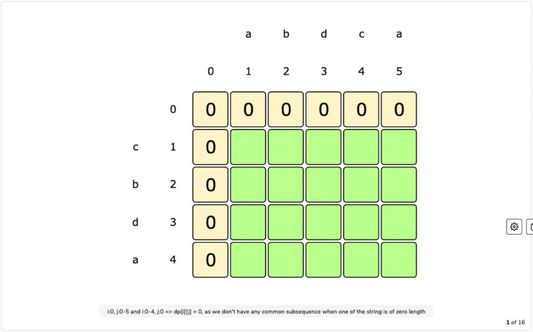
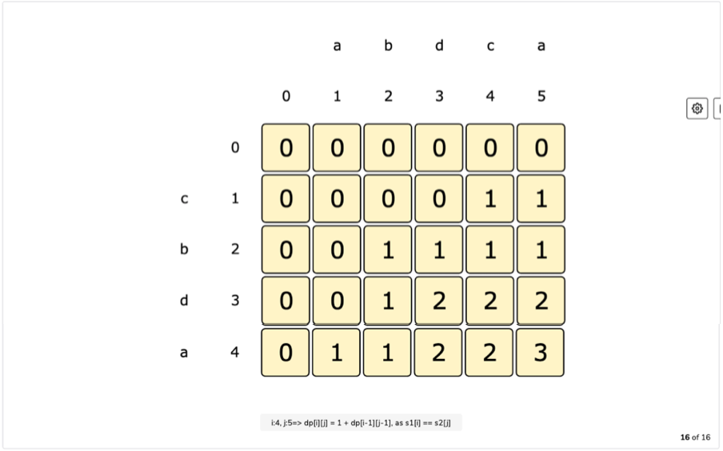
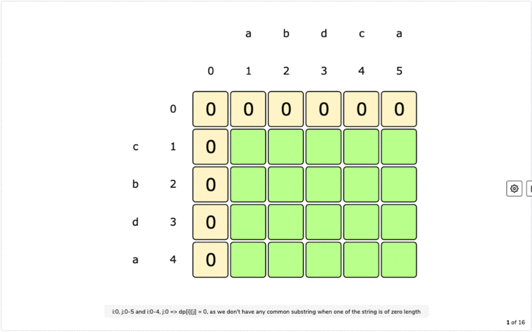
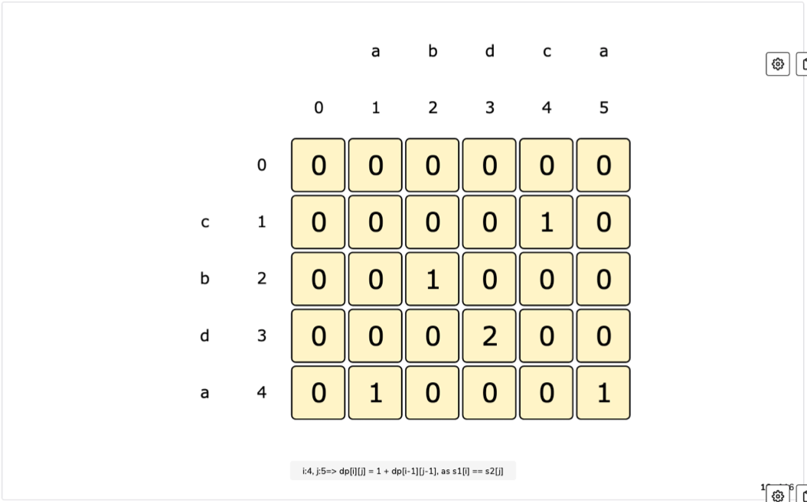

# Longest Common Subsequence Pattern

### Problems Following Longest Common Subsequence Pattern

## 1. Longest Common Subsequence

###### Problem Statement:

Given two strings ***str1*** and ***str2*** find the length of the longest common subsequence in both the strings.

A subsequence is a sequence that can be derived from another sequence by deleting some or no elements without changing order.

```
===== Examples =====
Input: str1 = "abdca", str2 = "cbda"
Output: 2
Explanation: The longest common substring is "bd"

Input: str1 = "passport", str2 = "ppsspt"
Output: 5
Explanation: The longest common substring is "psspt"
```

<br>

###### Brute-Force : Recursive Solution

- A basic brute-force solution could be to try all subsequences of ***str1*** and ***str2*** to find the longest one.
- We can match both the strings one character at a time.
- For every index i in str1 and j in str2, we must choose between:
  1. If the character str1[i] and str2[j] matches, we can recursively match for remaining lengths.
  2. If the character str1[i] and str2[j] doesn't match, start two recursive calls by skipping one character separately from each string.

**Code:**

```python
def find_longest_common_subsequence_recursion(str1, str2):
    i, j = 0, 0
    return find_longest_common_subsequence_recursion_util(str1, str2, i, j)


def find_longest_common_subsequence_recursion_util(str1, str2, i, j):
    if (i == len(str1) or j == len(str2)):
        return 0

    if (str1[i] == str2[j]):
        return 1 + find_longest_common_subsequence_recursion_util(str1, str2, i + 1, j + 1)

    skip_1st_count = find_longest_common_subsequence_recursion_util(str1, str2, i + 1, j)
    skip_2nd_count = find_longest_common_subsequence_recursion_util(str1, str2, i, j + 1)

    return max(skip_1st_count, skip_2nd_count)


print("Recursive Method :")
print(find_longest_common_subsequence_recursion("abdbca", "cbda"))
print(find_longest_common_subsequence_recursion("passport", "ppsspt"))
```

**Output:**

```
Recursive Method :
3
5
```

**Complexity:**

- ***Time: O(2<sup>m+n</sup>)*** - Here ***m*** and ***n*** are lengths of two substrings and we have 2 recursive calls in worse cases when character not matches.
- ***Space: O(m+n)*** - Used to store the recursion stack.

<br>

###### DP : Recursion + Memoization (Top-Down) Solution

- We can use memoizaton to solve the recurring problem.
- The ***two changing values*** in our recursive function is two start indexes ***i***, ***j***.
- We can use 2-D array to store solution to our repeated subproblems.
- We can also use **i + "\|" + j** as key to store in a hashmap.

**Code:**

```python
def find_longest_common_subsequence_dp_memoization(str1, str2):
    i, j = 0, 0
    n1, n2 = len(str1), len(str2)
    memory = [[None]*(n2) for _ in range(n1)]
    return find_longest_common_subsequence_dp_memoization_util(str1, str2, i, j, memory)


def find_longest_common_subsequence_dp_memoization_util(str1, str2, i, j, memory):
    if (i == len(str1) or j == len(str2)):
        return 0

    if (memory[i][j]):
        return memory[i][j]

    if (str1[i] == str2[j]):
        memory[i][j] = 1 + find_longest_common_subsequence_dp_memoization_util(str1, str2, i + 1, j + 1, memory)
        return memory[i][j]

    skip_1st_count = find_longest_common_subsequence_dp_memoization_util(str1, str2, i + 1, j, memory)
    skip_2nd_count = find_longest_common_subsequence_dp_memoization_util(str1, str2, i, j + 1, memory)
    memory[i][j] = max(skip_1st_count, skip_2nd_count)

    return memory[i][j]


print("\nDP -> Recursion + Memoization Method :")
print(find_longest_common_subsequence_dp_memoization("abdbca", "cbda"))
print(find_longest_common_subsequence_dp_memoization("passport", "ppsspt"))
```

**Output:**

```
DP -> Recursion + Memoization Method :
3
5
```

**Complexity:**

- ***Time: O(mn)*** - Here ***m*** and ***n*** are lengths of two substrings and at max we can have **m\*n** subproblems.
- ***Space: O(mn)*** - Need to store total of **m\*n** subproblems result.

<br>

###### DP : Iteration + Tabulation (Bottom-Up) Solution

- Since we want to match all the subsequences of the given two strings, we can use a 2-D array to store our results.
- Lengths of the two strings will define the size of the 2-D array.
- For every index i in string str1 and j in string str2, we have two options:
  1. If the character at str1[i] and str2[j] matches, the count will be 1 + length of common substring till i-1 and j-1 indexes.
  2. If the charactre at str1[i] and str2[j] doesn't match, we will take max of sequences by skipping either first or last.

> **Table Filling Formula:**
>
> if(str1[i] == str2[j]):
>
> ​	table\[i][j] = 1 + table\[i-1][j-1]
>
> else:
>
> ​	table\[i][j] = max(table\[i-1][j], table\[i][j-1])

**Tabulation:**



**Final Table:**



**Code:**

```python
def find_longest_common_subsequence_dp_tabulation(str1, str2):
    n1, n2 = len(str1), len(str2)
    table = [[0] * (n2 + 1) for _ in range(n1 + 1)]

    for i in range(1, n1 + 1):
        for j in range(1, n2 + 1):
            if (str1[i - 1] == str2[j - 1]):
                table[i][j] = 1 + table[i-1][j-1]
            else:
                table[i][j] = max(table[i - 1][j], table[i][j - 1])

    return table[i][j]


print("\nDP -> Iteration + Tabulation Method :")
print(find_longest_common_subsequence_dp_tabulation("abdbca", "cbda"))
print(find_longest_common_subsequence_dp_tabulation("passport", "ppsspt"))
```

**Output:**

```
DP -> Iteration + Tabulation Method :
3
5
```

**Complexity:**

- ***Time: O(mn)*** - Here ***m*** and ***n*** are lengths of two substrings and at max we can have **m\*n** subproblems.
- ***Space: O(mn)*** - Need to store total of **m\*n** subproblems result.

<br>

###### DP : Iteration + Tabulation (Bottom-Up) Space Optimized Solution

- If we watch closely **`table[i][j] = 1 + table[i - 1][j - 1]` ** or **`max(table[i - 1][j], table[i][j - 1])`** , to calcualate value for any box we only need the previous row value.
- So, we will take only two rows and will alternate b/w them for previous rows using %2.

**Code:**

```python
def find_longest_common_subsequence_dp_tabulation_space_optimized(str1, str2):
    n1, n2 = len(str1), len(str2)
    table = [[0] * (n2 + 1) for _ in range(2)]

    for i in range(1, n1 + 1):
        for j in range(1, n2 + 1):
            if (str1[i - 1] == str2[j - 1]):
                table[i % 2][j] = 1 + table[(i - 1) % 2][j - 1]
            else:
                table[i % 2][j] = max(table[(i - 1) % 2][j], table[i % 2][j - 1])

    return table[i % 2][j]


print("\nDP -> Iteration + Tabulation Space Optimized Method :")
print(find_longest_common_subsequence_dp_tabulation_space_optimized("abdbca", "cbda"))
print(find_longest_common_subsequence_dp_tabulation_space_optimized("passport", "ppsspt"))
```

**Output:**

```
DP -> Iteration + Tabulation Space Optimized Method :
3
5
```

**Complexity:**

- ***Time: O(mn)*** - Here ***m*** and ***n*** are lengths of two substrings and at max we can have **m\*n** subproblems.
- ***Space: O(n)*** - Need to store total of of 2 rows data only so it is 2n ≈ O(n).

<br>

<br>

## 2. Longest Common Substring (LCS)

###### Problem Statement:

Given two string ***str1*** and ***str2***, find the length of longest substring which is common in both the strings.

```
===== Examples =====
Input: str1 = "abdca", str2 = "cbda"
Output: 2
Explanation: The longest common substring is "bd"

Input: str1 = "passport", str2 = "psspt"
Output: 3
Explanation: The longest common substring is "ssp"
```

<br>

###### Brute-Force : Recursive Solution

- A basic brute force solution is to try all substring of ***str1*** and ***str2*** to find the longest common one.
- We can start matching both the strings one character at a time, we have 2 options at any step:
  1. If strings have matching character, recursively match for remaining lenghts and keep the current matching length.
  2. If strings don't match, start 2 new recursive calls by skipping 1 character separately from each string and reset matching length.
- The maximum LCS length will be max returned by all 3 recursive calls.

**Code:**

```python
def find_lcs_length_recursion(str1, str2):
    i, j, lcs_length = 0, 0, 0
    return find_lcs_length_recursion_util(str1, str2, i, j, lcs_length)


def find_lcs_length_recursion_util(str1, str2, i, j, lcs_length):
    if (i == len(str1) or j == len(str2)):
        return lcs_length

    lcs_length_1 = lcs_length
    if (str1[i] == str2[j]):
        lcs_length_1 = find_lcs_length_recursion_util(str1, str2, i + 1, j + 1, lcs_length + 1)

    lcs_length_2 = find_lcs_length_recursion_util(str1, str2, i, j + 1, 0)
    lcs_length_3 = find_lcs_length_recursion_util(str1, str2, i + 1, j, 0)

    return max(lcs_length_1, lcs_length_2, lcs_length_3)


print("Recursive Method :")
print(find_lcs_length_recursion("abdbca", "cbda"))
print(find_lcs_length_recursion("passport", "psspt"))
```

**Output:**

```
Recursive Method :
2
3
```

**Complexity:**

- ***Time: O(3<sup>m+n</sup>)*** - Here ***m*** and ***n*** are lengths of two substrings and we have 3 recursive calls.
- ***Space: O(m+n)*** - Used to store the recursion stack.

<br>

###### DP : Recursion + Memoization (Top-Down) Solution

- We can use memoizaton to solve the recurring problem.
- The ***three changing values*** in our recursive function is two start indexes ***i***, ***j*** and ***lcs_length***.
- We can use 3-D array to store solution to our repeated subproblems.
- We can also use **i + "\|" + j + "\|" + lcs_length** as key to store in a hashmap.

**Code:**

```python
def find_lcs_length_dp_memoization(str1, str2):
    n1, n2 = len(str1), len(str2)
    max_lcs_length = min(n1, n2)
    memory = [[[None] * max_lcs_length for _ in range(n2)] for _ in range(n1)]
    i, j, lcs_length = 0, 0, 0

    return find_lcs_length_dp_memoization_util(str1, str2, i, j, lcs_length, memory)


def find_lcs_length_dp_memoization_util(str1, str2, i, j, lcs_length, memory):
    if (i == len(str1) or j == len(str2)):
        return lcs_length

    if (memory[i][j][lcs_length]):
        return memory[i][j][lcs_length]

    lcs_length_1 = lcs_length
    if (str1[i] == str2[j]):
        lcs_length_1 = find_lcs_length_dp_memoization_util(str1, str2, i + 1, j + 1, lcs_length + 1, memory)

    lcs_length_2 = find_lcs_length_dp_memoization_util(str1, str2, i, j + 1, 0, memory)
    lcs_length_3 = find_lcs_length_dp_memoization_util(str1, str2, i + 1, j, 0, memory)

    memory[i][j][lcs_length] = max(lcs_length_1, lcs_length_2, lcs_length_3)

    return memory[i][j][lcs_length]


print("\nDP -> Recursion + Memoization Method :")
print(find_lcs_length_dp_memoization("abdbca", "cbda"))
print(find_lcs_length_dp_memoization("passport", "psspt"))
```

**Output:**

```
DP -> Recursion + Memoization Method :
2
3
```

**Complexity:**

- ***Time: O(mn\*min(m, n))*** - Here ***m*** and ***n*** are lengths of two substrings and at max we can have **m\*n\*min(m, n)** subproblems.
- ***Space: O(mn\*min(m, n))*** - Need to store total of **m\*n\*min(m, n)** subproblems result.

<br>

###### DP : Iteration + Tabulation (Bottom-Up) Solution

- Since we want to match all the substring of the given two strings, we can use a 2-D array to store our results.
- Lengths of the two strings will define the size of the 2-D array.
- For every index i in string str1 and j in string str2, we have two options:
  1. If the character at str1[i] and str2[j] matches, the lcs_length will be 1 + length of common substring till i-1 and j-1 indexes.
  2. If the charactre at str1[i] and str2[j] doesn't match, we don't have any common substring.

> **Table Filling Formula:**
>
> if(str1[i] == str2[j]):
>
> ​	table\[i][j] = 1 + table\[i-1][j-1]
>
> else:
>
> ​	table\[i][j] = 0

**Tabulation:**



**Final Table:**



Here we can see that longest common substring is of length 2, represented by table\[3][3].

**Code:**

```python
def find_lcs_length_dp_tabulation(str1, str2):
    n1, n2 = len(str1), len(str2)
    table = [[0] * (n2 + 1) for _ in range(n1 + 1)]

    lcs_length = 0
    for i in range(1, n1 + 1):
        for j in range(1, n2 + 1):
            if (str1[i - 1] == str2[j - 1]):
                table[i][j] = 1 + table[i - 1][j - 1]
                lcs_length = max(lcs_length, table[i][j])
            else:
                table[i][j] = 0

    return lcs_length


print("\nDP -> Iteration + Tabulation Method :")
print(find_lcs_length_dp_tabulation("abdbca", "cbda"))
print(find_lcs_length_dp_tabulation("passport", "psspt"))
```

**Output:**

```
DP -> Iteration + Tabulation Method :
2
3
```

**Complexity:**

- ***Time: O(mn)*** - Here ***m*** and ***n*** are lengths of two substrings and at max we can have **m\*n** subproblems.
- ***Space: O(mn)*** - Need to store total of **m\*n** subproblems result.

<br>

###### DP : Iteration + Tabulation (Bottom-Up) Space Optimized Solution

- If we watch closely **`table[i][j] = 1 + table[i - 1][j - 1]` ** , to calcualate value for any box we only need the previous row value.
- So, we will take only two rows and will alternate b/w them for previous rows using %2.

**Code:**

```python
def find_lcs_length_dp_tabulation_space_optimized(str1, str2):
    n1, n2 = len(str1), len(str2)
    table = [[0] * (n2 + 1) for _ in range(2)]

    lcs_length = 0
    for i in range(1, n1 + 1):
        for j in range(1, n2 + 1):
            if (str1[i - 1] == str2[j - 1]):
                table[i % 2][j] = 1 + table[(i - 1) % 2][j - 1]
                lcs_length = max(lcs_length, table[i % 2][j])
            else:
                table[i % 2][j] = 0

    return lcs_length


print("\nDP -> Iteration + Tabulation Space Optimized Method :")
print(find_lcs_length_dp_tabulation_space_optimized("abdbca", "cbda"))
print(find_lcs_length_dp_tabulation_space_optimized("passport", "psspt"))
```

**Output:**

```
DP -> Iteration + Tabulation Space Optimized Method :
2
3
```

**Complexity:**

- ***Time: O(mn)*** - Here ***m*** and ***n*** are lengths of two substrings and at max we can have **m\*n** subproblems.
- ***Space: O(n)*** - Need to store total of of 2 rows data only so it is 2n ≈ O(n).

<br>

<br>

## 3. Minimum Deletions & Insertions to Transform a String into another

###### Problem Statement:

Given string ***str1*** and ***str2***, we need to transform ***str1*** into ***str2*** by deleting and inserting characters.

Calculate the count of the minimum number of deletion and insertion operations.

```
====== Examples ======
Input: str1 = "abc", str2 = "fbc"
Output: 1 deletion and 1 insertion
Explanation: We need to delete {'a'} from str1 and insert {'f'} into it to transform to str2

Input: str1 = "abdca", str2 = "cbda"
Output: 2 deletions and 1 insertion
Explanation: We need to delete {'a', 'c'} from str1 and insert {'c'} into it to transform to str2

Input: str1 = "passport", str2 = "ppsspt"
Output: 3 deletions and 1 insertion
Explanation: We need to delete {'a', 'o', 'r'} from str1 and insert {'p'} into it to transform to str2
```

<br>

###### Solution Approach:

- The problem is very similar to finding [Longest Common Subsequence]().
- First find the longest common subsequence **lcs_count**.
  - Delete other characters from ***str1*** to get the **number of deletions** *i.e.* **len(str1) - lcs_count**.
  - Insert remaining characters from ***str2*** to get **number of insertions** i.e, **len(str2) - lcs_count**.
- We will directly solve this problem using bottom-up tabulation approach.

<br>

###### DP : Iteration + Tabulation (Bottom-Up) Solution

- We will follow the process similar to of calculationg longest subsequence.

```python
def min_delete_insert_to_transform(str1, str2):
    n1, n2 = len(str1), len(str2)
    table = [[0] * (n2 + 1) for _ in range(2)]

    for i in range(1, n1 + 1):
        for j in range(1, n2 + 1):
            if (str1[i - 1] == str2[j - 1]):
                table[i % 2][j] = 1 + table[(i - 1) % 2][j - 1]
            else:
                table[i % 2][j] = max(table[(i - 1) % 2][j], table[i % 2][j - 1])

    lcs_count = table[i % 2][j]
    print(f"Minimum Deletions Needed : {len(str1)-lcs_count}")
    print(f"Minimum Insertions Needed : {len(str2)-lcs_count}\n")


print("DP -> Iteration + Tabulation Space Optimized Method :")
min_delete_insert_to_transform("abc", "fbc")
min_delete_insert_to_transform("abdca", "cbda")
min_delete_insert_to_transform("passport", "ppsspt")
```

**Output:**

```
DP -> Iteration + Tabulation Space Optimized Method :
Minimum Deletions Needed : 1
Minimum Insertions Needed : 1

Minimum Deletions Needed : 2
Minimum Insertions Needed : 1

Minimum Deletions Needed : 3
Minimum Insertions Needed : 1
```

**Complexity:**

- ***Time: O(mn)*** - Here ***m*** and ***n*** are lengths of two substrings and at max we can have **m\*n** subproblems.
- ***Space: O(n)*** - Need to store total of of 2 rows data only so it is 2n ≈ O(n).

<br>

<br>

## 4. Shortest Common Super-sequence

## 5. Longest Repeating Subsequence

## 6. Subsequence Pattern Matching

## 7.Edit Distance

## 8. Strings Interleaving


<br>

<br>

------

<a href="palindromic-subsequence-pattern" class="prev-button">&larr; Previous: Palindromic Subsequence Pattern</a>

<a href="longest-increasing-subsequence-pattern" class="next-button">Next: Longest Increasing Subsequence Pattern &rarr;</a>

