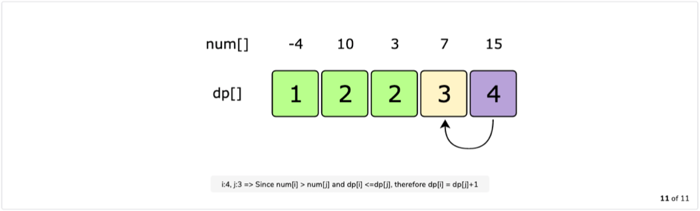
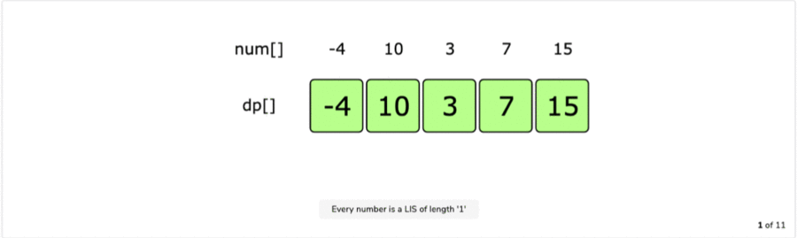

# Longest Increasing Subsequence Pattern

### Problems Following Longest Increasing Subsequence Pattern

## 1. Longest Increasing Subsequence

###### Problem Statement:

Given a number sequence, find the length of its Longest Incresing Subsequence (LIS).

In an increasing subsequence, all the elements are in increasing order (from lowest to highest).

```
====== Examples ======
Input: {4, 2, 3, 6, 10, 1, 12}
Output: 5
Explanation: The LIS is {2, 3, 6, 10, 12}

Input: {-4, 10, 3, 7, 15}
Output: 4
Explanation The LIS is {-4, 3, 7, 15}
```

<br>

###### Brute-Force : Recursive Solution

- A basic brute-force solution could be to try all subsequences of given number sequence.
- We can process one number at a time, so we have 2 options at any step:
  1. Include the current number, increment count and make recursive call for remaining, if current is greater than previous included.
  2. Exclude the current number and make recursive call for ramaining.
- Finally take max from both the options.

**Code:**

```python
def find_longest_incresing_subsequence_recursion(seq):
    return find_longest_incresing_subsequence_recursion_util(seq, 0, -1)


def find_longest_incresing_subsequence_recursion_util(seq, current, prev):
    if (current == len(seq)):
        return 0

    current_included_count = 0
    if (prev == -1 or seq[current] >= seq[prev]):
        current_included_count = 1 + find_longest_incresing_subsequence_recursion_util(seq, current + 1, current)

    current_excluded_count = find_longest_incresing_subsequence_recursion_util(seq, current + 1, prev)

    return max(current_included_count, current_excluded_count)


print("Recursive Method :")
print(find_longest_incresing_subsequence_recursion([4, 2, 3, 6, 10, 1, 12]))
print(find_longest_incresing_subsequence_recursion([-4, 10, 3, 7, 15]))
```

**Output:**

```
Recursive Method :
5
4
```

**Complexity:**

- ***Time: O(2<sup>n</sup>)*** - Here we have 2 recursive calls at every step and length of sequence is n.
- ***Space: O(n)*** - Used to store the recursion stack.

<br>

###### DP : Recursion + Memoization (Top-Down) Solution

- We can use memoizaton to solve the recurring problem.
- The ***two changing values*** in our recursive function is two indexes ***current***, ***prev***.
- We can use 2-D array to store solution to our repeated subproblems.
- We can also use **current + "\|" + prev** as key to store in a hashmap.

**Code:**

```python
def find_longest_incresing_subsequence_dp_meomization(seq):
    n = len(seq)
    memory = [[0]*(n+1) for _ in range(n)]
    return find_longest_incresing_subsequence_dp_meomization_util(seq, 0, -1, memory)


def find_longest_incresing_subsequence_dp_meomization_util(seq, current, prev, memory):
    if (current == len(seq)):
        return 0

    if (memory[current][prev + 1]):
        return memory[current][prev + 1]

    current_included_count = 0
    if (prev == -1 or seq[current] >= seq[prev]):
        current_included_count = 1 + find_longest_incresing_subsequence_dp_meomization_util(seq, current + 1, current, memory)

    current_excluded_count = find_longest_incresing_subsequence_dp_meomization_util(seq, current + 1, prev, memory)
    memory[current][prev + 1] = max(current_included_count, current_excluded_count)

    return memory[current][prev + 1]


print("\nDP -> Recursion + Memoization Method :")
print(find_longest_incresing_subsequence_dp_meomization([4, 2, 3, 6, 10, 1, 12]))
print(find_longest_incresing_subsequence_dp_meomization([-4, 10, 3, 7, 15]))
```

**Output:**

```
DP -> Recursion + Memoization Method :
5
4
```

**Complexity:**

- ***Time: O(N<sup>2</sup>)*** - At max we can have N*N subproblems.
- ***Space: O(N<sup>2</sup>)*** - We need N*N to store results of sub-problems and N to store the recursion stack. Total is O(N<sup>2</sup> + N) ≈ O(N<sup>2</sup>).

<br>

###### DP : Iteration + Tabulation (Bottom-Up) Solution

- Here we are aware of two things:
  1. If the number at current index is bigger than number at current index, we increment LIS count upto current index.
  2. But if there is bigger LIS without including number at current index, we take it.
- So now, we need to find all the increasing subsequences for the number at index i, from all the previous numbers (i.e. till i-1 index) to eventually find the longest increasing subsequence.
- If 'i' represents current index and 'j' represents the prev index.

> **Recursive Formula:**
>
> if num[i] > num[j] => dp[i] = dp[j] + 1 if there is no bigger LIS for i

**Tabulation:**


**Final Table:**



**Code:**

```python
def find_longest_incresing_subsequence_dp_tabulation(nums):
    n = len(nums)
    table = [1] * n

    for i in range(1, n):
        for j in range(i):
            if (nums[i] > nums[j]):
                table[i] = max(table[i], table[j] + 1)

    return table[i]


print("\nDP -> Iteration + Tabulation Method :")
print(find_longest_incresing_subsequence_dp_tabulation([4, 2, 3, 6, 10, 1, 12]))
print(find_longest_incresing_subsequence_dp_tabulation([-4, 10, 3, 7, 15]))
```

**Output:**

```
DP -> Iteration + Tabulation Method :
5
4
```

**Complexity:**

- ***Time: O(N<sup>2</sup>)*** 
- ***Space: O(N)*** 

<br>

<br>

## 2. Maximum Sum Increasing Subsequence

###### Problem Statement:

Given a number sequence, find the increasing subsequence with the higest sum.

```
====== Examples ======
Input: {4, 1, 2, 6, 10, 1, 12}
Output: 32
Explanation: The increasing subsequence is {4, 6, 10, 12}
Please note the difference, as the LIS is {1, 2, 6, 10, 12} with sum 31

Input: {-4, 10, 3, 7, 15}
Output: 25
Explanantion: The increasing subsequence are {10, 15} and {3, 7, 15}
Again the LIS is {-4, 3, 7, 15} with sum 21
```

<br>

###### Solution Approach:

- The problem is very similar to above problem of [Longest Increasing Subsequence]().
- The only difference is that, instead of finding the increasing subsequence with max length, need to find an increasing subsequence with max sum.
- We will directly solve this problem using bottom-up tabulation approach.

<br>

###### DP : Iteration + Tabulation (Bottom-Up) Solution

- We will follow the process similar to that of LIS.

> **Recursive Formula:**
>
> if num[i] > num[j] => dp[i] = dp[j] + 1 if there is no bigger MSIS for i

**Tabulation:**



**Final Table:**


**Code:**

```python
def find_max_sum_incresing_subsequence_dp_tabulation(nums):
    n = len(nums)
    table = [num for num in nums]

    for i in range(1, n):
        for j in range(i):
            if (nums[i] > nums[j]):
                table[i] = max(table[i], table[j] + nums[i])

    return table[i]


print("DP -> Iteration + Tabulation Method :")
print(find_max_sum_incresing_subsequence_dp_tabulation([4, 1, 2, 6, 10, 1, 12]))
print(find_max_sum_incresing_subsequence_dp_tabulation([-4, 10, 3, 7, 15]))
```

**Output:**

```
DP -> Iteration + Tabulation Method :
32
25
```

**Complexity:**

- ***Time: O(N<sup>2</sup>)*** 
- ***Space: O(N)*** 

<br>

<br>

## 3. Minimum Deletions to Make a Sequence Sorted

###### Problem Statement:

Given a number sequence, find the minimum number of elements that should be the deleted to make remaining sequence sorted.

```
====== Examples ======
Input: {4, 2, 3, 6, 10, 1, 12}
Output: 2
Explanation: We need to delete {4,1} to make remaining sequence {2, 3, 6, 10, 12} sorted

Input: {-4, 10, 3, 7, 15}
Output: 1
Explanation: We need to delete {10} to make remaining sequence {-4, 3, 7, 15} sorted

Input: {3, 2, 1, 0}
Output: 3
Explanation: Since sequence are in reverse order, need to delete all except one.
```

<br>

###### Solution Approach:

- The problem is very similar to that of [Longest Increasing Subsequence]().
- First find the lis_length and then **min deletions required to be sorted** is **len(seq) - lis_length**.
- We will directly solve this problem using bottom-up tabulation approach.

<br>

###### DP : Iteration + Tabulation (Bottom-Up) Solution

- We will follow the process similar to that of LIS.

**Code:**

```python
def min_deletions_required_to_sort_sequence_dp_tabulation(nums):
    n = len(nums)
    table = [1]*n

    for i in range(1, n):
        for j in range(i):
            if (nums[i] > nums[j]):
                table[i] = max(table[i], table[j] + 1)

    print(f"Min deletions rquired to sort sequence : {n-table[i]}")


print("DP -> Iteration + Tabulation Method :")
min_deletions_required_to_sort_sequence_dp_tabulation([4, 2, 3, 6, 10, 1, 12])
min_deletions_required_to_sort_sequence_dp_tabulation([-4, 10, 3, 7, 15])
min_deletions_required_to_sort_sequence_dp_tabulation([3, 2, 1, 0])
```

**Output:**

```
DP -> Iteration + Tabulation Method :
Min deletions rquired to sort sequence : 2
Min deletions rquired to sort sequence : 1
Min deletions rquired to sort sequence : 3
```

**Complexity:**

- ***Time: O(N<sup>2</sup>)*** 
- ***Space: O(N)*** 

<br>

<br>

## 4. Longest Bitonic Subsequence

###### Problem Statement:

Given a number sequence, find the length of its Longest Bitonic Subsequence(LBS).

A subsequence is considered bitonic if it is monotonically increasing and then monotonically decreasing.

```
====== Examples ======
Input: {4, 2, 3, 6, 10, 1, 12}
Output: 5
Explanation: The LBS is {2, 3, 6, 10, 1}

Input: {4, 2, 5, 9, 7, 6, 10, 3, 1}
Output: 7
Explanation: The LBS is {4, 5, 9, 7, 6, 3, 1}
```

<br>

###### Brute-Force : Recursive Solution

- A basic brute-force solution is to try finding the Longest Decreasing Subsequence (LDS) starting from every number in both directions.
- So for every index 'i' in the given array, we will do two things:
  1. Find LDS starting from 'i' to the end of the array.
  2. Find LDS starting from 'i' to the beginning of the array.
- Finally LBS would be maximum sum of above two subsequences.

<br>

###### DP : Iteration + Tabulation (Bottom-Up) Solution

- This can be clearly solved by the bottom-up approach.
- We know from LIS calculation that at any index 'i' it gives longest increasing sequence till 'i'.
- We can separately calculate LDS for every index *i.e.* from the beginning to the end of the array and vice-versa.
- So, we will have **lds_table_forward** and **lds_table_backward** now.
- The required LBS length will be max sum considering every index in both these tables i.e lds_table_forward and lds_table_backward.

**Code:**

```python
def find_longest_bitonic_subsequence_dp_tabulation(nums):
    n = len(nums)
    table_lds_forward = [1] * n
    table_lds_backward = [1] * n

    # From beginning to end of sequence, calculate backward LDS
    for i in range(1, n):
        for j in range(i - 1, -1, -1):
            if (nums[j] < nums[i]):
                table_lds_backward[i] = max(table_lds_backward[i], table_lds_backward[j] + 1)

    # From end to beginning of sequence, calculate forward LDS
    for i in range(n - 2, -1, -1):
        for j in range(i + 1, n):
            if (nums[j] < nums[i]):
                table_lds_forward[i] = max(table_lds_forward[i], table_lds_forward[j] + 1)

    # Calculate max lbs length
    max_lbs_length = 0
    for i in range(n):
        max_lbs_length = max(max_lbs_length, table_lds_backward[i] + table_lds_forward[i] - 1)

    return max_lbs_length


print("DP -> Iteration + Tabulation Method :")
print(find_longest_bitonic_subsequence_dp_tabulation([4, 2, 3, 6, 10, 1, 12]))
print(find_longest_bitonic_subsequence_dp_tabulation([4, 2, 5, 9, 7, 6, 10, 3, 1]))
```

**Output:**

```
DP -> Iteration + Tabulation Method :
5
7
```

**Complexity:**

- ***Time: O(N<sup>2</sup>)*** 
- ***Space: O(N)*** 

<br>

<br>

## 5. Longest Alternating Subsequence


<br>

<br>

----

<a href="longest-common-substring-pattern" class="prev-button">&larr; Previous: Longest Common Substring Pattern</a>

<a href="miscellaneous-dp-problems" class="next-button">Next: Miscellaneous DP Problems &rarr;</a>

