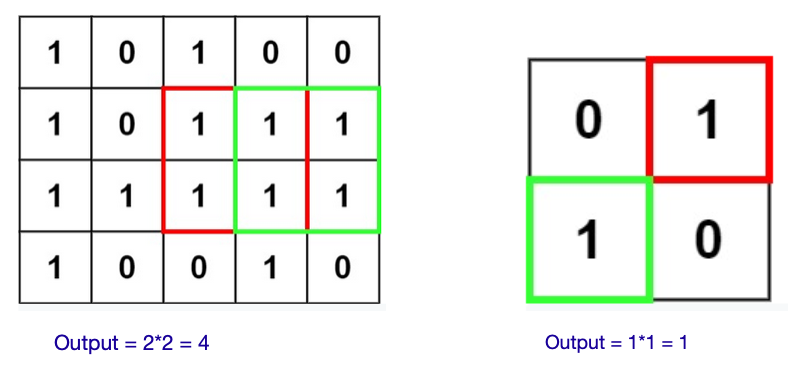
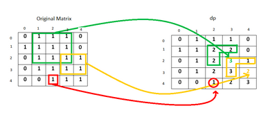

# Miscellaneous DP Problems

## 1. Maximal Square

###### Problem Statement:

Given an `m x n` binary `matrix` filled with `0`'s and `1`'s, *find the largest square containing only* `1`'s *and return its area*.

```
====== Examples =====
Input: matrix = [["1","0","1","0","0"],["1","0","1","1","1"],["1","1","1","1","1"],["1","0","0","1","0"]]
Output: 4

Input: matrix = [["0","1"],["1","0"]]
Output: 1

Input: matrix = [["0"]]
Output: 0
```



<br>

###### Approach:

- Starting from index (0,0), for every 1 found in the original matrix, we update the value of the current element as dp(i,j)=min⁡(dp(i−1,j),dp(i−1,j−1),dp(i,j−1))+1.
- We also remember the size of the largest square found so far.
- In this way, we traverse the original matrix once and find out the required maximum size. 



<br>

###### Implementation:

**Code:**

```python
from typing import List


class Solution:
    def maximalSquare(self, matrix: List[List[str]]) -> int:
        m, n = len(matrix), len(matrix[0])

        side_len = 0
        for i in range(m):
            side_len = max(side_len, int(matrix[i][0]))

        for j in range(n):
            side_len = max(side_len, int(matrix[0][j]))

        for i in range(1, m):
            for j in range(1, n):
                if (matrix[i][j] == "1"):
                    matrix[i][j] = min(int(matrix[i][j - 1]), int(matrix[i - 1][j - 1]), int(matrix[i - 1][j])) + 1
                    side_len = max(side_len, int(matrix[i][j]))

        return side_len * side_len


matrix = [["1", "0", "1", "0", "0"],
          ["1", "0", "1", "1", "1"],
          ["1", "1", "1", "1", "1"],
          ["1", "0", "0", "1", "0"]]
print(Solution().maximalSquare(matrix))

matrix = [["0", "1"],
          ["1", "0"]]
print(Solution().maximalSquare(matrix))

matrix = [["0"]]
print(Solution().maximalSquare(matrix))
```

**Output:**

```
4
1
0
```

**Complexity:**

- ***Time: O(m\*n)*** - Traversing the complete matrix once
- ***Space: O(1)***

<br>

<br>

## 2. Word Break

###### Problem Statement:

Given a **non-empty** string *s* and a dictionary *wordDict* containing a list of **non-empty** words, determine if *s* can be segmented into a space-separated sequence of one or more dictionary words.

**Note:**

- The same word in the dictionary may be reused multiple times in the segmentation.
- You may assume the dictionary does not contain duplicate words.

**Examples:**

```
Example-1:
Input: s = "leetcode", wordDict = ["leet", "code"]
Output: true
Explanation: Return true because "leetcode" can be segmented as "leet code".

Example-2:
Input: s = "applepenapple", wordDict = ["apple", "pen"]
Output: true
Explanation: Return true because "applepenapple" can be segmented as "apple pen apple". Note that you are allowed to reuse a dictionary word.

Example-3:
Input: s = "catsandog", wordDict = ["cats", "dog", "sand", "and", "cat"]
Output: false
```

<br>

###### Brute-Force : Recursive Solution

- Check every possible prefix of that string in the dictionary of words, if it is found in the dictionary, then the recursive function is called for the remaining portion of that string.
- If in some function call it is found that the complete string is in dictionary, then it will return true.

**Code:**

```python
class Solution:
    def wordBreak(self, s, wordDict):
        return self.word_break_recursive(s, 0, set(wordDict))

    def word_break_recursive(self, s, start, word_dict):
        if(start == len(s)):
            return True

        for end in range(start+1, len(s)+1):
            if(s[start:end] in word_dict and self.word_break_recursive(s, end, word_dict)):
                return True

        return False
```

**Output:**

```
True
True
False
```

**Complexity:**

- ***Time: O(n<sup>n</sup>)*** - Consider the worst case where *s = "aaaaaaa"* and every prefix of *s* is present in the dictionary of words, then the recursion tree can grow upto n<sup>n</sup>.
- ***Space: O(n)*** - Used to store the recursion stack.

<br>

###### DP : Recursion + Memoization (Top-Down) Solution

- We can use memoizaton to solve the recurring problem.
- Only thing changing here is the start point of the word.
- So, we will make use of a 2-D memory to store the results of the subproblems.
- Now many redundant subproblems are avoided and recursion tree is pruned and reduces the time complexity by a large factor.

**Code:**

```python
class Solution:
    def wordBreak(self, s, wordDict):
        memory = [None]*(len(s))
        return self.word_break_dp_memoization(s, 0, set(wordDict), memory)

    def word_break_dp_memoization(self, s, start, word_dict, memory):
        if(start == len(s)):
            return True

        if(memory[start] is not None):
            return memory[start]

        for end in range(start+1, len(s)+1):
            if(s[start:end] in word_dict and self.word_break_dp_memoization(s, end, word_dict, memory)):
                memory[start] = True
                return True

        memory[start] = False
        return False


s = Solution()
print(s.wordBreak("leetcode", ["leet", "code"]))
print(s.wordBreak("applepenapple", ["apple", "pen"]))
print(s.wordBreak("catsandog", ["cats", "dog", "sand", "and", "cat"]))
```

**Output:**

```
True
True
False
```

**Complexity:**

- ***Time: O(n<sup>2</sup>)*** - At max there can be n<sup>2</sup> subproblems.
- ***Space: O(n)*** - Used to store the recursion stack.

<br>

<br>

----

<a href="longest-increasing-subsequence-pattern" class="prev-button">&larr; Previous: Longest Increasing Subsequence Pattern</a>

