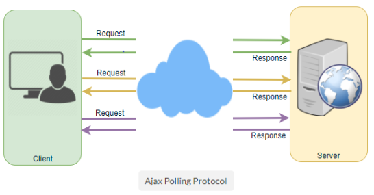
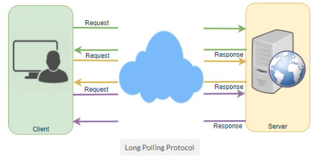
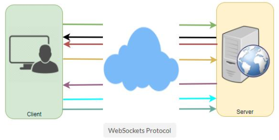

# System Design Concepts - 2

**Here we will have a look into remaining important System Design Concepts.**

- Queues
- Redundancy and Replication
- SQL vs. NoSQL
- Long-Polling vs WebSockets vs Server-Sent Events
- Other Concepts

 

## Queues

- Queues are used to effectively manage requests in a large-scale distributed system.
- In small systems with minimal processing loads and small databases, writes can be predictably fast; however, in more complex and large systems writes can take an almost non- deterministically long time.
- *Example :-* data may have to be written in different places on different servers or indices, or the system could simply be under high load.
- In such cases where individual writes (or tasks) may take a long time, achieving high performance and availability requires different components of the **system to work in an asynchronous way; a common way to do that is with queues**.
- Let’s assume a system where each client is requesting a task to be processed on a remote server, each of them sends their requests to the server, and the server tries to finish the tasks as quickly as possible to return the results to the respective clients.
- In small systems where one server can handle incoming requests just as fast as they come, this kind of situation should work just fine.
- However, when the server gets more requests than it can handle, then each client is forced to wait for other clients’ requests to finish before a response can be generated.
- This kind of **synchronous behavior can severely degrade client’s performance**; the client is forced to wait, effectively doing zero work, until its request can be responded.
- Adding extra servers to address high load does not solve the problem either; even with effective load balancing in place, it is very difficult to ensure the fair and balanced distribution of work required to maximize client performance.
- Further, if the server processing the requests is unavailable, or fails, then the clients upstream will fail too.
- Solving this problem effectively requires building an abstraction between the client’s request and the actual work performed to service it.
- A processing queue is as simple as it sounds: all incoming tasks are added to the queue, and as soon as any worker has the capacity to process, they can pick up a task from the queue.
- These tasks could represent a simple write to a database, or something as complex as generating a thumbnail preview for a document.
- **Queues are implemented on the asynchronous communication protocol**, meaning when a client submits a task to a queue they are no longer required to wait for the results; instead, they need only acknowledgment that the request was properly received.
- This acknowledgment can later serve as a reference for the results of the work when the client requires it.
- Queues have implicit or explicit limits on the size of data that may be transmitted in a single request and the number of requests that may remain outstanding on the queue.
- **Queues are also used for fault tolerance** as they can provide some protection from service outages and failures.
- *Example :-* we can create a highly robust queue that can retry service requests that have failed due to transient system failures. It is preferable to use a queue to enforce quality-of-service guarantees than to expose clients directly to intermittent service outages, requiring complicated and often inconsistent client-side error handling.
- Queues play a vital role in managing distributed communication between different parts of any large-scale distributed system.
- There are a lot of ways to implement them and quite a few open source implementations of queues available like **RabbitMQ**, **ZeroMQ**, **ActiveMQ**, and **BeanstalkD**.

 

## Redundancy and Replication

- **Redundancy** means duplication of critical data or services with the intention of increased reliability of the system. 
- *Example :-* if there is only one copy of a file stored on a single server, then losing that server means losing the file.
- Since losing data is seldom a good thing, we can create duplicate or redundant copies of the file to solve this problem.
- This **same principle applies to services too**, if we have a critical service in our system, ensuring that multiple copies or versions of it are running simultaneously can secure against the failure of a single node.
- Creating redundancy in a system can **remove single points of failure** and provide backups if needed in a crisis.
- *Example :-* if we have two instances of a service running in production, and if one fails or degrades, the system can failover to the other one. These failovers can happen automatically or can be done manually.
- Another important part of service redundancy is to create a [shared- nothing architecture](), where each node can operate independently of one another.
- There should not be any central service managing state or orchestrating activities for the other nodes.
- This helps a lot with scalability since new servers can be added without special conditions or knowledge and most importantly, such systems are more **resilient to failure (deals with failure in good way)** as there is no single point of failure.

 

## SQL vs. NoSQL

- In the world of databases, there are two main types of solutions: SQL (relational databases) and NoSQL (non-relational databases).
- Both of them differ in the way they were built, the kind of information they store, and how they store it.
- Relational databases are structured and have **predefined schemas**, like phone books that store phone numbers and addresses.
- Non-relational databases are **unstructured, distributed and have a dynamic schema**, like file folders that hold everything from a person’s address and phone number to their Facebook ‘likes’ and online shopping preferences.

###### SQL Databases

- Relational databases store data in rows and columns.
- Each row contains all the information about one entity, and columns are all the separate data points.
- Some of the most popular relational databases are **MySQL**, **Oracle**, MS SQL Server, **SQLite**, **Postgres**, MariaDB, etc.

###### NoSQL Databases

- [Key-Value Stores:]()
  - Data is stored in an **array of key-value pairs**.
  - The ***key*** is an attribute name, which is linked to a ***value***.
  - Well-known key value stores include **Redis**, Voldemort and **Dynamo**.
- [Document Databases:]()
  - In these databases data is stored in **documents**, instead of rows and columns in a table.
  - These documents are grouped together in collections where each document can have an entirely different structure.
  - Document databases include the **CouchDB** and **MongoDB**.
- [Wide-Column Databases:]()
  - Instead of ***tables*** in columnar databases we have column families, which are containers for rows.
  - Unlike relational databases, no need to know all the columns up front & each row doesn’t need to have the same no. of columns.
  - Columnar databases are **best suited for analyzing large datasets** - big names include **Cassandra** and **HBase**.
- [Graph Databases:]()
  - Used to store data whose relations are best represented in a graph.
  - Data is saved in graph structures with nodes (entities), properties (information about the entities) and lines (connections between the entities).
  - Examples of graph database include **Neo4J** and **InfiniteGraph**.

 

> ##### High level differences between SQL and NoSQL

- [Storage:]()
  - SQL stores data in tables, where each row represents an entity, and each column represents a data point about that entity; for example, if we are storing a car entity in a table, different columns could be Color, Make, Model, and so on.
  - NoSQL databases have different data storage models. The main ones are key-value, document, graph and columnar.
- [Schema:]() 
  - In SQL, each record conforms to a fixed schema, meaning the columns must be decided and chosen before data entry and each row must have data for each column. The schema can be altered later, but it involves modifying the whole database and going offline.
  - Whereas in NoSQL, schemas are dynamic. Columns can be added on the fly, and each row (or equivalent) doesn’t have to contain data for each column.
- [Querying:]() 
  - SQL databases uses SQL (structured query language) for defining and manipulating the data, which is very powerful.
  - In NoSQL database, queries are focused on a collection of documents. Sometimes it is also called UnQL (Unstructured Query Language). Different databases have different syntax for using UnQL.
- [Scalability:]()
  - In most common situations, SQL databases are **vertically scalable**, i.e., by increasing the horsepower (higher Memory, CPU, etc.) of the hardware, which can get very expensive. It is possible to scale a relational database across multiple servers, but this is a challenging and time-consuming process.
  - On the other hand, NoSQL databases are **horizontally scalable**, meaning we can add more servers easily in our NoSQL database infrastructure to handle large traffic. Any cheap commodity hardware or cloud instances can host NoSQL databases, thus making it a lot more cost-effective than vertical scaling. A lot of NoSQL technologies also distribute data across servers automatically.
- [Reliability or ACID Compliancy (Atomicity, Consistency, Isolation, Durability):]()
  - The vast majority of relational databases are ACID compliant. So, when it comes to data reliability and safe guarantee of performing transactions, SQL databases are still the better bet.
  - Most of the NoSQL solutions sacrifice ACID compliance for performance and scalability.

 

> ##### SQL VS. NoSQL - Which one to use ?

- When it comes to database technology, there’s **no one-size-fits-all solution**.
- That’s why many businesses rely on both relational and non- relational databases for different needs.
- Even as NoSQL databases are gaining popularity for their speed and scalability, there are still situations where a highly structured SQL database may perform better; choosing the right technology hinges on the use case.

###### Reasons to use SQL Database

1. We need to ensure **ACID compliance** as it reduces anomalies and protects the integrity of your database by prescribing exactly how transactions interact with the database. Generally, NoSQL databases sacrifice ACID compliance for scalability and processing speed, but **for many e-commerce and financial applications, an ACID-compliant database remains the preferred option**.

2. The data is structured and unchanging and if our business is not experiencing massive growth that would require more servers and if we are only working with data that’s consistent, then there may be no reason to use a system designed to support a variety of data types and high traffic volume.

###### Reasons to use NoSQL database
When all the other components of our application are fast and seamless, NoSQL databases prevent data from being the bottleneck.

Big data is contributing to a large success for NoSQL databases, mainly because it handles data differently than the traditional relational databases. A few popular examples of NoSQL databases are MongoDB, CouchDB, Cassandra, and HBase.

1. **Storing large volumes of data** that often have little to no structure. It sets no limits on the types of data we can store together and allows us to add different new types as the need changes. With document-based databases, you can store data in one place without having to define what “types” of data those are in advance.
2. **Making the most of cloud computing and storage**. Cloud-based storage is an excellent cost-saving solution but requires data to be easily spread across multiple servers to scale up. Using commodity (affordable, smaller) hardware on-site or in the cloud saves you the hassle of additional software, and NoSQL databases like Cassandra are designed to be scaled across multiple data centers out of the box without a lot of headaches.
3. **Rapid development**. NoSQL is extremely useful for rapid development as it doesn’t need to be prepped ahead of time. If you’re working on quick iterations of your system which require making frequent updates to the data structure without a lot of downtime between versions, a relational database will slow you down.

 

> ##### ACID vs. BASE

- **ACID:** Atomic, Consistency, Isolation, Durability
  - Database systems designed with traditional ACID guarantees in mind such as RDBMS choose consistency over availability.
- **BASE:** Basically Available Soft State Eventual Consistency 
  - Database systems designed around the BASE philosophy, common in the NoSQL movement, choose availability over consistency.
  - When we start using NoSQL databases we need to understand which part of ACID properties we are willing to sacrifice.

 

## HTTP vs Long-Polling vs WebSockets vs Server-Sent Events 

All theese are **popular communication protocols** between a client like a web browser & a web server.

###### 1. HTTP (Hyper Text Transfer Protocol)

- Following are a sequence of events for regular HTTP request:
  1. Client opens a connection and requests data from the server.
  2. The server calculates the response.
  3. The server sends the response back to the client on the opened request.

###### 2. Ajax Poling

- Polling is a standard technique used by the vast majority of AJAX applications.
- The basic idea is that the client repeatedly polls (or requests) a server for data. The client makes a request and waits for the server to respond with data. If no data is available, an empty response is returned.
  1. Client opens a connection and requests data from the server using regular HTTP.
  2. The requested webpage sends requests to the server at regular intervals (e.g., 0.5 seconds).
  3. The server calculates the response and sends it back, just like regular HTTP traffic.
  4. Client repeats the above three steps periodically to get updates from the server.

- Problem with Polling is that the client has to keep asking the server for any new data. As a result, a lot of responses are empty creating HTTP overhead.

###### 3. HTTP Long-Polling

- A variation of the traditional polling technique that allows the server to push information to a client, whenever the data is available.
- With Long-Polling, the client requests information from the server exactly as in normal polling, but with the expectation that the server may not respond immediately. That’s why this technique is sometimes referred to as a **Hanging GET**.
- If the server does not have any data available for the client, instead of sending an empty response, the server holds the request and waits until some data becomes available.
- Once the data becomes available, a full response is sent to the client. The client then immediately re-request information from the server so that the server will almost always have an available waiting request that it can use to deliver data in response to an event.
- The basic life cycle of an application using HTTP Long-Polling is as follows:
  1. The client makes an initial request using regular HTTP and then waits for a response.
  2. The server delays its response until an update is available, or until a timeout has occurred.
  3. When an update is available, the server sends a full response to the client.
  4. The client typically sends a new long-poll request, either immediately upon receiving a response or after a pause to allow an acceptable latency period.
  5. Each Long-Poll request has a timeout. The client has to reconnect periodically after the connection is closed, due to timeouts.

###### 4. WebSockets

- WebSocket provides Full duplex communication channels over a single TCP connection.
- It provides a persistent connection between a client and a server that both parties can use to start sending data at any time.
- The client establishes a WebSocket connection through a process known as the **WebSocket handshake** and if the process succeeds, then the server and client can exchange data in both directions at any time.
- The WebSocket protocol enables communication between a client and a server with lower overheads, facilitating real-time data transfer from and to the server.
- This is made possible by providing a standardized way for the server to send content to the browser without being asked by the client, and allowing for messages to be passed back and forth while keeping the connection open.
- In this way, a two-way (bi-directional) ongoing conversation can take place between a client and a server.

###### 5. Sever-Sent Events (SSEs)

- Under SSEs the client establishes a persistent and long-term connection with the server.
- The server uses this connection to send data to a client.
- But if the client wants to send data to the server, it would require the use of another technology/protocol to do so.
  1. Client requests data from a server using regular HTTP.
  2. The requested webpage opens a connection to the server.
  3. The server sends the data to the client whenever there’s new information available.
- SSEs are best when we need real-time traffic from the server to the client or if the server is generating data in a loop and will be sending multiple events to the client.

 

 

## Other Concepts

##### Optimistic  vs.  Pessimistic Locking

- **Optimistic Locking**:
  - While doing a database transaction we do not acquire any locks.
  - But when we are ready to commit our transaction at that point we check to see if no other transaction updated the record which we are working on.
- **Pessimistic Locking:**
  - While doing a database transaction we acquire all the locks beforehand and then we commit the transaction.
- Both of them have their pros and cons and we need to know which of these locking to which scenarios.

##### Strong  vs.  Eventual Consistency

- **Strong Consistency:**
  - Reads will always see the latest writes.
  - Used in Relational Databases.
- **Eventual Consistency:**
  - Reads will see some writes initially and eventually it will see all the writes.
  - In NoSQL Databases we need to decide whether we want strong or eventual consistency.
- The benefit the eventual consistency has is it provides higher availability.

##### Data-centres / Racks / Hosts

- Need to be aware how data-centres are architecture and how they are arranged today.
- Data-centres have Racks and Racks have hosts.
- Need to have an understanding of the latencies b/w talking cross hosts or cross racks or even cross data-centres.
- What the worst can happen if a host goes down or even the complete racks goes down or even worst if the entire data-centres goes down.

##### CPU / Memory / Hard-Drive / Network Bandwidth

- All of these are limited resources so when we design our system we need to consider:
  - How do we work around these limitations?
  - How do we improve the throughput latencies?
  - How do we scale the system around these limitations?

##### Random  vs.  Sequential Read/Write on Disk

- We know that read and write are slow on the disk.
- But the sequential read and writes are amazing for the disks.
- Need to design the system around sequential reads and writes.
- Need to try avoiding random reads and writes which are order of magnitude slower than sequential reads and writes for the disk.

##### HTTP  vs.  HTTP2  vs.  Web-Sockets

- **HTTP:**
  - Request-Reply kind of architecture b/w client and server.
  - Pretty much entire web runs on HTTP.
- **HTTP2:**
  - It does some of the deficiencies of HTTP like it can do multiple requests over a single connection
- **Web-Sockets:**
  - It is fully Bi-directional communication b/w client and server.
- Need to know the differences b/w them and their inner workings. 

##### TCP/IP Model

- There are 4 layers in this model and we need to know about what are they and how they work.

##### IPv4  vs.  IPv6

- IPv4 has 32 bit-addresses and IPv6 has 128-bit addresses.
- We are running out of IPv4 addresses and so the world is migrating towards IPv6.
- Need to have understanding of their details and also about how the routing works.

##### TCP  vs.  UDP

- **TCP:**
  - It is connection oriented reliable connection but bit slow transfer of packets as acknowledgement is needed.
  - Used in system when transferring of packets, we can’t afford to loose packets like transfer of sensitive documents etc.
- **UDP:**
  - Unreliable connection but faster transfer of packets as no acknowledgement needed.
  - Used in situation  when we can afford to loose some packets but we want them faster like video streaming systems etc.

##### DNS Lookup

- It does the translation of domain address into IP address.
- Need to know its working, hierarchy and caching around them.

##### HTTPs & TLS

- **TLS (Transport Layer Security):**
  - Used to secure communication b/w client and server both in terms of Privacy and Data-integrity.
  - When used with HTTP it pretty much becomes HTTPs.

##### Public Key Infrastructure & Certificate Authority

- **Public Key Infrastructure** is used to manage our public key and the digital certificates. 
- **Certificate Authority** is a trusted entity which tells us if the public key is from the correct party. 
- Example:- If we type [www.kodefork.com](http://www.kodefork.com/) and if it is going over HTTPs, the we will get a public key back and certificate authority tells that it is definitely coming from KodeFork and not from a third party who has hacked b/w us and KodeFork. 

##### Symmetric  vs.  Asymmetric Encryption

- **Asymmetric Encryption:**
  - It is computationally more expensive so it should be used to send small amount of data preferably a symmetric key.
  - Example: Public-Private Key Encryption 
- **Symmetric Encryption:**
  - Example: AES

##### Load Balancers L4  vs.  L7

- Load balancers sit in the front of a service and delegate the client requests to one of the nodes behind the service.
- This delegation can be based on Round-Robin basis or the load average on the nodes behind that service.
- Load balancers can operate at L4 or L7 in OSI Model.
- **At L4:** Load Balancers considers both client and destination IP addresses and Port numbers to do the routing. 
- **At L7:** Which is an HTTP Level it uses HTTP URI to do the routing. 
- Most of the load balancers operate at L7.

##### CDNs  &  EDGE

- **CDN (Content Delivery Network):** 
  - Let’s suppose we are watching Netflix from California so what Netflix does is it puts movies and series in a content delivery network close to us.
  - So when we are streaming the movies it can be streamed right there from the CDN close to us instead of all the way from the data-centre.
  - This helps in both the performance and latency for the end-user.
- **Edge:**
  - A ver similar concept where we do processing close to the end user.
  - Another advantage Edge provides is it has a dedicated network from the edge to all the way to the data-centre.
  - So our request can be routed through this dedicated network instead of going over the general internet.

##### Bloom Filters  &  Count-Min Sketch

- **Bloom Filters:**
  - Space-efficient probabilistic data structure for membership check.
  - It can have a false positive but will never have false negatives.
  - It is used to decide if an element is a member of a set or not.
  - **यदि present नहीं है तब बोल सकता है की present है, but present है तब कभी नहीं बोलेगा की present नहीं है**.
  - Example:- Google username availability prediction by gmail.
  - So if our design can tolerate false positive we can use bloom filters.
- **Count-Min Sketch:**
  - A similar data structure, but it is used to count the frequency of events.
  - Suppose we have millions of events and we want to keep track of top k events.
  - Then we can consider using count-min sketch instead of keeping the count of all the events.
  - So, for a fraction of space it will give an answer which will be close enough to the actual answer with some error rate.

##### Paxos: Consensus over Distributed Hosts

- Paxos is used to derive consensus over distributed hosts.
- Before Paxos came finding consensus was a very hard problem.
- Example:- Leader election among a distributed host
- May not need to know the internal workings but good to know some of the use-cases which Paxos solves.

##### Design Patterns  &  Object-Oriented Design

- **Design-Patterns:**
  - Need to know things like factory methods, Singleton patterns and others.
- **Object-Oriented** **Design:**
  - Classes, Objects, Methods
  - Inheritance
  - Polymorphism
  - Abstraction

##### Virtual Machines  &  Containers

- **Virtual Machines:**
  - A way of giving us an operating system on top of shared resource such that we feel like we are exclusive owner of the hardware.
  - But in reality that hardware is shared b/w different isolated operating systems.
- **Containers:**
  - A way of running our application and its dependencies in an isolated environment.
  - Containers have become extremely important and they run a lot in production environment these days.

##### Publisher-Subscriber  OR  Queue Bases

- Some publisher publishes a message to the queue and a subscriber receives that message from the queue.
- This pattern has become extremely important in system design these days.
- We should definitely use them whenever we have the opportunity.
- One thing to remember is that a customer facing request should not be directly exposed to a Publisher-Subscriber system.

##### Map-Reduce

- It is used to do distributed and parallel processing of big data.
- **Map** is filtering and sorting the data and **Reduce** is summarizing the data. 
- It’s very important in big data application systems.

##### Multi-threading, Concurrency, Locks, Synchronization, CAS (Compare and Swap)

- Very important concepts while dealing with multi-threaded applications or systems.
- Some programming language like Java comes with these things built-in but in some languages like C we have to depend on the platform specific implementations.

 

 

---

<a href="concepts-part-1" class="prev-button">&larr; Previous: System Design Concepts - 1</a> 

<a href="step-by-step-guide" class="next-button">Next: Step by Step Guide &rarr;</a>

