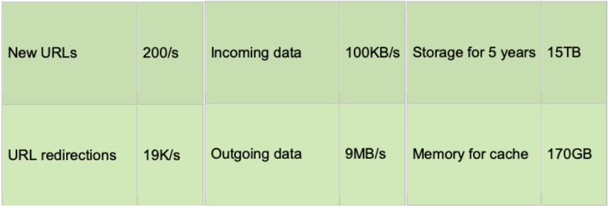
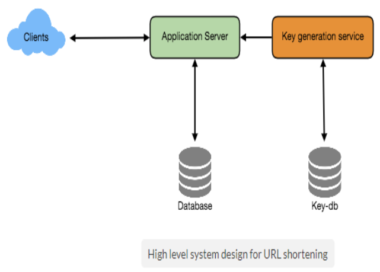
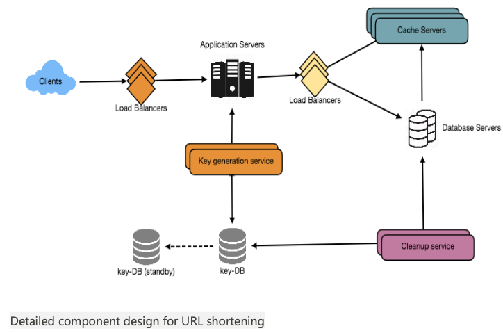

# Design Tiny URL Service

###### Problem Statement:

- Let's design a URL shortening service like TinyURL, that will provide short aliases redirecting to long URLs.
- Similar services: **bit.ly**, **goo.gl**, **2020.fm** etc. 
- Difficulty Level: **Easy**

<br>

[Very Famous Interview Question:]()

- Problem statement is very simple.
- This question has some very interesting challenges specifically trying to design it at scale.
- When interviewer asks this question it’s certain that he is not looking for a solution:
  - Where we take a longer url and generate the shorter url and store it in hash and return the longer-url from it.
  - But he asks this to test our knowledge on scalability and durability.
  - The solution of using a map is neither scalable nor durable.

<br>

#### Step-1: Why do we need URL shortening? 

- URL shortening is used to create shorter aliases for long URLs.
- Users are redirected to the original URL when they hit these aliases.
- A shorter version of any URL saves a lot of space whenever we use it e.g., when printing or tweeting as tweets having a character limit.

**Example :-**

**Long Url:** https://www.kodefork.com/articles/machine-or-deep-learning-for-biological-data-analysis/

**Tiny Url using [tinyurl.com](https://tinyurl.com/) :** https://tinyurl.com/y8cnselj


- The shortened URL is nearly 1/3rd of the size of the actual URL.
- URL shortening is used for optimizing links across devices, tracking individual links to analyze audience and campaign performance, and hiding affiliated original URLs, etc.

<br>

#### Step-2: Requirements and Goals of the System 

*We should always clarify requirements at the beginning of the interview and should ask questions to find the exact scope of the system that the interviewer has in mind.*

- **Our URL shortener system should meet the following requirements:**
- [Functional Requirements:]()
  1. Given a URL, our service should generate a shorter and unique alias of it.
  2. When users access a shorter URL, our service should redirect them to the original link.
  3. Users should optionally be able to pick a custom alias for their URL.
  4. Links will expire after a specific timespan automatically; users should also be able to specify expiration time.
- [Non-Functional Requirements:]()
  1. The system should be highly available. This is required because if our service is down, all the URL redirections will start failing.
  2. URL redirection should happen in real-time with minimum latency.
  3. Shortened links should not be guessable (not predictable).
- [Extended Requirements:]()
  1. Analytics, e.g., how many times are direction happened?
  2. Our service should also be accessible through REST APIs by other services.

<br>

#### Step-3: Capacity Estimation and Constraints 

- Our system would be read-heavy;  there would be lots of redirection requests compared to new URL shortenings.
- Let’s assume 100:1 ratio between read and write.

###### Traffic estimates:

- If we assume that we would have **500M new URLs shortenings per month**.
- We can expect **(100 * 500M => 50B) redirections** during the same time.
- What would be [Queries Per Second (QPS)]() for our system?
  - **New URLs shortenings per second:** 500 million / (30 days * 24 hours * 3600 seconds) ~= **200 URLs/s**
  - **URLs redirections per second:** 50 billion / (30 days * 24 hours * 3600 sec) ~= **190000 URLs/s**

###### Storage estimates:

- Since we expect to have 500M new URLs every month and if we would be keeping these objects for five years.
- **Total number of objects we will be storing will be:** 500 million * 5 years * 12 months = **30 Billion.**
- Let’s assume that each object we are storing can be of 500 bytes (just a ballpark, we will dig into it later).
- **Total storage we will need be:** 30 billion * 500 bytes = **15 TB**


###### Bandwidth estimates:

- For **write requests**, we expect **200 new URLs/second** the **total incoming data per second**: 200 * 500 bytes = **100 KB/s**
- For **read requests**, we expect ~**19K URLs /second** redirections, **total outgoing data per second**: 19K * 500 bytes ~= **9 MB/s**

###### Memory estimates:

- If we want to cache some of the hot URLs that are frequently accessed, how much memory would we need to store them?
- If we follow the **80-20 rule**, meaning 20% of URLs generating 80% of traffic, we would like to **cache these 20% hot URLs**.
- Since we have **19K requests/second**, we would be getting **requests**: 19K * 3600 seconds * 24 hours ~= **1.7 billion requests/day**
- **To cache 20% of these requests**, we would need **memory**: 0.2 * 1.7 billion * 500 bytes ~= **170GB**

###### High level estimates:

- Assuming 500 million new URLs per month and 100:1 read:write ratio.
- Following is the summary of the high level estimates for our service.



<br>

#### Step-4: System APIs 

*Once we've finalized the requirements, it's always a good idea to define the system APIs. This would explicitly state what is expected from the system.*

- We can have SOAP or REST APIs to expose the functionality of our service.
- Following could be the definitions of the APIs for creating and deleting URLs:

##### Create API

- We can have SOAP or REST APIs to expose the functionality of our service.
- Following could be the definitions of the APIs for creating and deleting URLs: 

```
createURL(api_dev_key, original_url, custom_alias=None, user_name=None, expire_date=None)
```

- [Input Parameters:]()
  - **api_dev_key (string):** The API developer key of a registered account. This will be used to, among other things, throttle users based on their allocated quota.
  - **original_url (string):** Original URL to be shortened.
  - **custom_alias (string):** Optional custom key for the URL.
  - **user_name (string):** Optional user name to be used in encoding.
  - **expire_date (string):** Optional expiration date for the shortened URL.
- [Returns: (string)]()
  - A successful insertion **returns the shortened URL**, otherwise, returns an **error code**.

##### Delete API

```
deleteURL(api_dev_key, url_key)
```

- [Input Parameters]()
  - **url_key** is a string representing the shortened URL to be retrieved. 
- [Returns:]()
  - A successful deletion returns **"URL Removed"**.

###### How do we detect and prevent abuse ?

- For instance, any service can put us out of business by consuming all our keys in the current design.
- To prevent abuse, we can limit users through their api_dev_key, how many URL they can create or access in a certain time.

<br>

#### Step-5: Database Design

*Defining the DB schema in the early stages of the interview would help to understand the data flow among various components and later would guide towards the data partitioning.*

- **A few observations about nature of the data we are going to store:**
  1. We need to store billions of records.
  2. Each object we are going to store is small (less than 1K).
  3. There are no relationships between records, except if we want to store which user created what URL.
  4. Our service is read-heavy.

###### Database Schema:

- We would need two tables, one for storing information about the URL mappings and the other for users’ data.


###### What kind of database should we use ?

- Since we are likely going to store billions of rows and we don’t need to use relationships between objects – a NoSQL key-value store like Dynamo or Cassandra is a better choice, which would also be easier to scale.
- If we choose NoSQL, we cannot store UserID in the URL table (as there are no foreign keys in NoSQL), for that we would need a third table which will store the mapping between URL and the user.

<br>

#### Step-6: Basic System Design and Algorithm 

- The problem we are solving here is to generate a short and unique key for the given URL.
- In the above-mentioned example, the shortened URL we got was: "https://tinyurl.com/y8cnselj" the last six characters of this
  URL is the short key we want to generate.
- We’ll explore **two solutions** here.

> ##### a) Encoding actual URL 

- We can compute a unique hash (e.g., MD5 or SHA256, etc.) of the given URL.
- The hash can then be encoded for displaying.
- This encoding could be base36 ([a-z, 0-9]) or base62 ([A-Z, a-z, 0-9]) and if we add ‘-’ and ‘.’, we can use base64 encoding.
- **A reasonable question would be, what should be the length of the short key ? 6, 8 or 10 characters ?**
  - Using base64 encoding, a 6 letter long key would result in 64^6 ~= 68.7 billion possible strings
  - Using base64 encoding, an 8 letter long key would result in 64^8 ~= 281 trillion possible strings
  - With 68.7B unique strings, let’s assume for our system six letters keys would suffice.

###### What are different issues with our solution ?

- If multiple users enter the same URL, they can get the same shortened URL, which is not acceptable.
- What if parts of the URL are URL-encoded ? e.g., http://www.educative.io/distributed.php?id=design, and http://www.educative.io/distributed.php%3Fid%3Ddesign are identical except for the URL encoding.

###### Workaround for the issues:

1. We can append an increasing sequence number to each input URL to make it unique and then generate a hash of it.
   - We don’t need to store this sequence number in the databases, though.
   - Possible problems with this approach could be how big this sequence number would be, can it overflow ?
   - Appending an increasing sequence number will impact the performance of the service too.
2. Another solution could be to append user id (which should be unique) to the input URL.
   - However, if the user has not signed in, we can ask the user to choose a unique key.
   - Even after this if we have a conflict, we have to keep generating a key until we get a unique one.


<br>

> ##### b) Generating keys offline

- We can have a standalone **Key Generation Service (KGS)** that generates random six letter strings beforehand and stores them in a database (let’s call it key-DB).
- Whenever we want to shorten a URL, we will just take one of the already generated keys and use it.
- This approach will make things quite simple and fast since we will not be encoding the URL or worrying about duplications or collisions. 
- KGS will make sure all the keys inserted in key-DB are unique.

###### Can concurrency cause problems ?

- As soon as a key is used, it should be marked in the database so that it doesn’t get used again.
- If there are multiple servers reading keys concurrently, we might get a scenario where two or more servers try to read the same key from the database. How can we solve this concurrency problem ?
- Servers can use KGS to read/mark keys in the database. KGS can use two tables to store keys, one for keys that are not used yet and one for all the used keys.
- As soon as KGS gives keys to one of the servers, it can move them to the used keys table.
- KGS can always keep some keys in memory so that whenever a server needs them, it can quickly provide them.
- For simplicity, as soon as KGS loads some keys in memory, it can move them to used keys table. This way we can make sure each server gets unique keys.
- If KGS dies before assigning all the loaded keys to some server, we will be wasting those keys, which we can ignore given a huge number of keys we have.
- KGS also has to make sure not to give the same key to multiple servers. For that, it must synchronize (or get a lock to) the data structure holding the keys before removing keys from it and giving them to a server.

###### What would be the key-DB size ?

- With base64 encoding, we can generate 68.7B unique six letters keys.
- If we need 1 byte to store 1 alpha-numeric character, we can store all the keys in: 6 (characters per key) * 68.7B (unique keys) => **412 GB**.

###### Isn’t KGS the single point of failure ?

- Yes, it is. To solve this, we can have a standby replica of KGS & whenever primary server dies, it can take over to generate & provide keys.

###### Can each app server cache some keys from key-DB ?

- Yes, this can surely speed things up. Although in this case, if the application server dies before consuming all the keys, we will end up losing those keys.
- This could be acceptable since we have 68B unique six letters keys.

###### How would we perform a key lookup ?

- We can look up the key in our database or key-value store to get the full URL.
  - If it’s present, issue a **HTTP 302 Redirect** status back to the browser, passing the stored URL in the **"Location" field** of the request.
  - If that key is not present in our system, issue a **"HTTP 404 Not Found"** status, or redirect the user back to the homepage.

###### Should we impose size limits on custom aliases ?

- Since our service supports custom aliases, users can pick any 'key' they like, but providing a custom alias is not mandatory.
- However, it is reasonable (and often desirable) to impose a size limit on a custom alias, so that we have a consistent URL database.
- Let’s assume users can specify maximum 16 characters long customer key (as reflected in the above database schema).



<br>

#### Step-7: Data Partitioning and Replication

- To scale out our DB, we need to partition it so that it can store information about billions of URL.
- We need to come up with a partitioning scheme that would divide and store our data to different DB servers.

###### Range Based Partitioning:

- We can store URLs in separate partitions based on the first letter of the URL or the hash key.
- Hence we save all the URLs starting with letter ‘A’ in one partition and those that start with letter ‘B’ into another partition and so on. 
- This approach is called range based partitioning.
- We can even combine certain less frequently occurring letters into one database partition.
- We should come up with this partitioning scheme statically so that we can always store/find a file in a predictable manner.

[Main problem : ]() Can lead to unbalanced servers, for instance; if we decide to put all URLs starting with letter ‘E’ into a DB partition, but later we realize that we have too many URLs that start with letter ‘E’, which we can’t fit into one DB partition.

###### Hash-Based Partitioning:

- In this, we take a hash of the object we are storing, and based on this hash we figure out the DB partition to which this object should go.
- In our case, we can take the hash of the 'key' or the actual URL to determine the partition to store the file.
- Our hashing function will randomly distribute URLs into different partitions, e.g., our hashing function can always map any key to a number between [1...256], and this number would represent the partition to store our object.
- This approach can still lead to overloaded partitions, which can be solved by using [Consistent Hashing]().

<br>

#### Step-8: Caching

- We can cache URLs that are frequently accessed. We can use some off-the-shelf solution like Memcache, that can store full URLs with their respective hashes. The application servers, before hitting backend storage, can quickly check if the cache has desired URL.

###### How much cache should we have ?

- We can start with 20% of daily traffic and based on clients' usage pattern we can adjust how many cache servers we need.
- As estimated above we need 170GB memory to cache 20% of daily traffic since a modern day server can have 256GB memory, we can easily fit all the cache into one machine, or we can choose to use a couple of smaller servers to store all these hot URLs.

###### Which cache eviction policy would best fit our needs ?

- When the cache is full, and we want to replace a link with a newer/hotter URL, how would we choose ?
- Least Recently Used (LRU) can be a reasonable policy for our system.
- Under this policy, we discard the least recently used URL first.
- We can use a LinkedHashMap or a similar data structure to store our URLs and Hashes, which will also keep track of which URLs are accessed recently.
- To further increase the efficiency, we can replicate our caching servers to distribute load between them.

###### How can each cache replica be updated ?

- Whenever there is a cache miss, our servers would be hitting backend database.
- Whenever this happens, we can update the cache and pass the new entry to all the cache replicas.
- Each replica can update their cache by adding the new entry. If a replica already has that entry, it can simply ignore it.


<br>

#### Step-9: Load Balancing (LB)

- We can add Load balancing layer at three places in our system:
  1. **Between Clients and Application servers**
  2. **Between Application Servers and database servers**
  3. **Between Application Servers and Cache servers**
- Initially, a simple [Round Robin approach]() can be adopted; that distributes incoming requests equally among backend servers.
- This LB is simple to implement and does not introduce any overhead.
- Another benefit of this approach is if a server is dead, LB will take it out of the rotation and will stop sending any traffic to it.
- A **problem with Round Robin LB** is, it won’t take server load into consideration. If a server is overloaded or slow, the LB will not stop sending new requests to that server.
- **Solution** a more intelligent LB can be placed that periodically queries backend server about its load and adjusts traffic based on that.

<br>

#### Step-10: Purging or DB cleanup 

- Should entries stick around forever or should they be purged ? 
- If a user- specified expiration time is reached, what should happen to the link ? 
- If we chose to actively search for expired links to remove them, it would put a lot of pressure on our database.
- We can **slowly remove expired links** and do a **lazy cleanup** too.
- Our service will **make sure only expired links deleted**, although some expired links can live longer but will never be returned to users.
- Whenever a user tries to access an expired link, we can delete the link and return an error to the user.
- A **separate Cleanup service** can run periodically to remove expired links from our storage and cache.
- This service should be **very lightweight** and can be **scheduled to run only when the user traffic is expected to be low**.
- We can have a **default expiration time for each link**, e.g., two years.
- After removing an expired link, we can **put the key back in the key-DB to be reused**.
- Should we remove links that haven’t been visited in some length of time, say six months ?
- This could be tricky. Since **storage is getting cheap**, we can decide to **keep links forever**.



<br>

#### Step-11: Telemetry
- How many times a short URL has been used, what were user locations, etc. ? How would we store these statistics ?
- If it is part of a DB row that gets updated on each view, what will happen when a popular URL is slammed with a large number of concurrent requests ?
- We can have statistics about the country of the visitor, date and time of access, web page that refers the click, browser or platform from where the page was accessed and more.

<br>

#### Step-12: Security and Permissions

- Can users create private URLs or allow a particular set of users to access a URL ?
- We can store permission level (public/private) with each URL in the database.
- We can also create a separate table to store UserIDs that have permission to see a specific URL. 
- If a user does not have permission and try to access a URL, we can send an error (HTTP 401) back.
- Given that, we are storing our data in a NoSQL wide-column database like Cassandra, the key for the table storing permissions would be the 'Hash' (or the KGS generated 'key'), and the columns will store the UserIDs of those users that have permissions to see the URL.

<br>

<br>

---

<a href="tools-techniques" class="prev-button">&larr; Previous: Tools and Techniques</a> 

<a href="design-pastebin" class="next-button">Next: Design Pastebin &rarr;</a>

