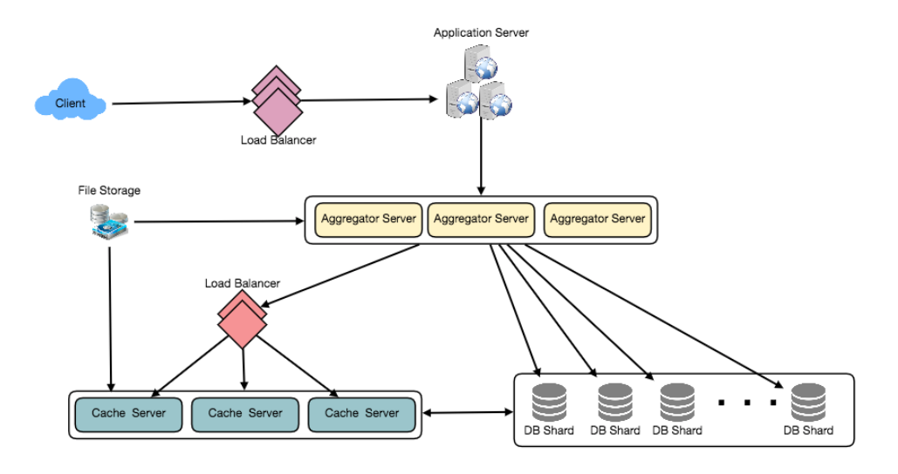

# Design Twitter

###### Problem Statement:

- Let's design a Twitter like social networking service.
- Users of the service will be able to post tweets, follow other people and favorite tweets.
- **Difficulty Level:** Medium

<br>

#### Step-1: What is Twitter ?
- Twitter is an online social networking service where users post and read short 140-character messages called "tweets".
- Registered users can post and read tweets, but those who are not registered can only read them.
- Users access Twitter through their website interface, SMS or mobile app.

<br>

#### Step-2: Requirements and Goals of the System
- We will be designing a simpler version of Twitter with following requirements:
- [Functional Requirements:]()
  1. Users should be able to post new tweets.
  2. A user should be able to follow other users.
  3. Users should be able to mark tweets favorite.
  4. The service should be able to create and display user’s timeline consisting of top tweets from all the people the user follows.
  5. Tweets can contain photos and videos.
- [Non-functional Requirements:]()
  1. Our service needs to be highly available.
  2. Acceptable latency of the system is 200ms for timeline generation.
  3. Consistency can take a hit (in the interest of availability), if a user doesn’t see a tweet for a while, it should be fine.
- [Extended Requirements:]()
  1. Searching tweets.
  2. Reply to a tweet.
  3. Trending topics – current hot topics/searches.
  4. Tagging other users.
  5. Tweet Notification.
  6. Who to follow? Suggestions?
  7. Moments.

<br>

#### Step-3: Capacity Estimation and Constraints
- Let’s assume we have **1 Billion total users**, with **200 Million daily active users** (DAU).
- Also, we have **100 Million new tweets every day**, and on average **each user follows 200 people**.

###### How many favorites per day ?

- If on average **each user favorites 5 tweets per day**, then **Total Favorites**: 200M users * 5 favorites => **1B Favorites**

###### How many total tweet-views our system will generate ?

- Let’s assume on **average a user visits their timeline 2 times a day** and **visits 5 other people’s pages**.
- On **each page if a user sees 20 tweets**, then **Total tweet-views** our system will generate: 200M * ((2 + 5) * 20 tweets) => **28B/day**

###### Storage Estimates:

- Let’s say **each tweet has 140 characters** and we need **two bytes to store a character without compression**.
- Let’s assume we need **30 bytes to store metadata** with each tweet (like ID, timestamp, user ID, etc.).
- **Total storage** we would need: 100M * (280 + 30) bytes => **30GB/day**
- Total Storage needed for 5 years: 5 \* 365 \* 30GB = **54.75 TB**
- How much storage we would need for users’ data, follows, favorites ?
- Not all tweets will have media, let’s assume that on average **every 5th tweet has a photo** and **every 10th has a video**.
- Let’s also assume on average a photo is **200KB** and a video is **2MB**.
- **Total New Media in a day:** (100M/5 photos * 200KB) + (100M/10 videos * 2MB) ~= **24TB/day**

###### Bandwidth Estimates

- Since **Total Incoming Data (Ingrees)** is **24TB / day**, this would translate into **290MB/sec**.
- Remember that we have 28 Billion tweet views per day.
- We must show the photo of every tweet (if it has a photo), but let’s assume that users watch every 3rd video they see in their timeline. 
- So, **Outgoing Data (Egress)** will be
  - **For text:** (28B * 280 bytes) / 86400s of text => **93MB/s**
  - **For Photos:** (28B/5 * 200KB ) / 86400s of photos => **13GB/S**
  - **For Videos:** (28B/10/3 * 2MB ) / 86400s of Videos => **22GB/s**
- **Total Outgoing Data (Egrees)** ~= **35GB/s**

<br>

#### Step-4: System APIs

*Once we've finalized the requirements, it's always a good idea to define the system APIs. This would explicitly state what is expected from the system.*

> ##### Tweet API

```
tweet(api_dev_key, tweet_data, tweet_location, user_location, media_ids, maximum_results_to_return)
```

- [Parameters:]()
  - **api_dev_key (string):** API developer key that will be used to, among other things, throttle users based on their allocated quota.
  - **tweet_data (string):** The text of the tweet, typically up to 140 characters.
  - **tweet_location (string):** Optional location (longitude, latitude) this Tweet refers to.
  - **user_location (string):** Optional location (longitude, latitude) of the user adding the tweet.
  - **media_ids (number[]):** Optional list of media_ids to be associated with the Tweet. (All the media photo, video, etc.) need to be uploaded separately.
- [Returns: (string)]()
  - A successful post will return the URL to access that tweet. Otherwise, an appropriate HTTP error is returned.

<br>

#### Step-5: High Level System Design

- We need a system that can efficiently **store all new tweets**, 100M/86400s => **1150 tweets / s** & **read** 28B/86400s => **325K tweets / s**.
- It is clear from the requirements that this will be a read-heavy system.
- At high level, we need multiple application servers to serve all requests with load balancers in front of them for traffic distributions.
- On the backend, we need an efficient database that can store all the new tweets and can support a huge number of reads.
- We would also need some file storage to store photos and videos.


- Although our expected daily write load is 100 million and read load is 28 billion tweets, hence on average our system will receive around 1160 new tweets and 325K read requests per second.
- This traffic will be distributed unevenly throughout the day, though, at peak time we should expect at least a few thousand write requests and around 1M read requests per second.
- We should keep this thing in mind while designing the architecture of our system.

<br>

#### Step-6: Database Schema

- We need to store data about users, their tweets, their favorite tweets, and people they follow.


- For choosing b/w SQL and NoSQL databases to store above schema, it is similar to **'Database Schema'** under **Designing Instagram**.

<br>

#### Step-7: Data Sharding 

- Since we have a huge number of new tweets every day and our read load is extremely high too, we need to distribute our data onto multiple machines such that we can read/write it efficiently.
- We have many options to shard our data that is being discussed below:

<br>

> ##### a) Sharding based on UserID:

- We can try storing all the data of a user on one server.
- While storing, we can pass the UserID to our hash function that will map the user to a database server where we will store all of the user’s tweets, favorites, follows, etc.
- While querying for tweets/follows/favorites of a user, ask hash function where to find the data of a user and then read it from there.
- [Problems with this Approach:]()
  1. If a user becomes hot. There will be a lot of queries on the server holding the user which will affect the performance of our service.
  2. Over time some users can end up storing a lot of tweets or have a lot of follows compared to others. Maintaining a uniform distribution of growing user’s data is quite difficult.
- [Solution to above Problems:]()
  - Either we have to repartition/redistribute our data or use consistent hashing. 

<br>

> ##### b) Sharding based on TweetID:

- Our hash function will map each TweetID to a random server where we will store that Tweet.
- To search tweets, we have to query all servers, and each server will return a set of tweets.
- A centralized server will aggregate these results to return them to the user.
- Let’s look into timeline generation example, here are the number of steps our system has to perform to generate a user’s timeline:
  1. Our application (app) server will find all the people the user follows.
  2. App server will send the query to all database servers to find tweets from these people.
  3. Each database server will find the tweets for each user, sort them by recency and return the top tweets.
  4. App server will merge all the results and sort them again to return the top results to the user.
- This approach solves the problem of hot users, but in contrast to sharding by UserID, we have to query all database partitions to find
  tweets of a user, which can result in higher latencies.
- We can further improve our performance by introducing cache to store hot tweets in front of the database servers.

<br>

> ##### c) Sharding based on Tweet Creation Time:

- Storing tweets based on recency will give us the advantage of fetching all the top tweets quickly, and we only have to query a very small set of servers.
- But the problem here is that the traffic load will not be distributed, e.g., while writing, all new tweets will be going to one server, and the remaining servers will be sitting idle.
- Similarly while reading, the server holding latest data will have a very high load as compared to servers holding old data.

<br>

> ##### d) Sharding based on TweedID and Tweet Creation Time

- If we don’t store tweet creation time separately and use TweetID to reflect that, we will get benefits of both the approaches.
- This way it will be quite quick to find latest Tweets.
- For that, we must make each TweetID universally unique in our system, and each TweetID should contain timestamp too.
- We can use epoch time for this.
- Let’s say our TweetID will have 2 parts, first part represents epoch seconds and the second part an auto-incrementing sequence.
- So, to make a new TweetID, we can take the current epoch time and append an auto-incrementing number to it.
- We can figure out shard number from this TweetID and store it there.
- What could be the size of our TweetID ? 
- Let’s say our epoch time starts today, **Total Bits to store the no. of seconds for next 50 years**: 50  * 365  * 86400 => **1.6 Billion** bits.
- Need 31 bits to store this number.
- Since on avg. we have **1150 new tweets / sec**, allocate **17 bits to store auto incremented sequence**, making **TweetID 48 bits long**.
- So, every second we can store (2^17 => 130K) new tweets. We can reset our auto incrementing sequence every second.
- For fault tolerance and better performance, we can have two database servers to generate auto- incrementing keys one generating even numbered keys and the other generating odd numbered keys.


- If we assume our current epoch seconds are **"1483228800"**, our TweetID will look like this:
  - 1483228800 000001
  - 1483228800 000002
  - 1483228800 000003
  - 1483228800 000004
- If we make our TweetID 64bits (8 bytes), we can easily store tweets for next 100 years and also store them for mili-seconds granularity.

<br>

#### Step-8: Cache

- We can introduce a cache for database servers to cache hot tweets and users.
- We can use an off-the-shelf solution like Memcache that can store the whole tweet objects.
- Application servers before hitting database can quickly check if the cache has desired tweets.
- Based on clients’ usage pattern we can determine how many cache servers we need.

###### Which cache replacement policy would best fit our needs ?

- When the cache is full, and we want to replace a tweet with a newer/hotter tweet, how would we choose ?
- Least Recently Used (LRU) can be a reasonable policy for our system.

###### How can we have more intelligent cache ?

- If we go with 80-20 rule, that is 20% of tweets are generating 80% of read traffic which means that certain tweets are so popular that majority of people read them.
- This dictates that we can try to cache 20% of daily read volume from each shard.

###### What if we cache the latest data ?

- Our service can benefit from this approach. If 80% of users see tweets from past 3 days only, try to cache all the tweets from past 3 days.
- Let’s say we have dedicated cache servers that cache all the tweets from all users from past 3 days.
- As estimated above, we are getting 100 million new tweets or 30GB of new data every day (without photos and videos).
- If we want to store all the tweets from last 3 days, we would need less than 100GB of memory.
- This can easily fit into 1 server, but replicating it to multiple servers distributes all read traffic to reduce load on cache servers.
- So to generate a user’s timeline, ask the cache servers if they have all the recent tweets for that user, if yes, simply return all the data from the cache, if not query backend to fetch that data.
- On a similar design, we can try caching photos and videos from last 3 days.
- Our cache would be like a hash table, where **'key'** would be **'OwnerID'** and **'value'** would be a **doubly linked list containing all the tweets from that user in past 3 days**.
- Since we want to retrieve most recent data first, we can always insert new tweets at the head of the linked list, which means all the older tweets will be near the tail of the linked list.
- Therefore, we can remove tweets from the tail to make space for newer tweets.



#### Step-9: Timeline Generation

- Timeline generation is similar to Designing Facebook’s Newsfeed discussed later.

<br>

#### Step-10: Replication and Fault Tolerance

- Since our system is read-heavy, we can have multiple secondary database servers for each DB partition.
- Secondary servers will be used for read traffic only.
- All writes will first go to the primary server and then will be replicated to secondary servers.
- This scheme will also give us fault tolerance, as whenever the primary server goes down, we can failover to a secondary server.

<br>

#### Step-11: Load Balancing
- We can add Load balancing layer at three places in our system:
  1. Between Clients and Application servers
  2. Between Application servers and database replication servers and
  3. Between Aggregation servers and Cache server.
- Initially, a simple [Round Robin approach]() can be adopted; that distributes incoming requests equally among servers.
- This LB is simple to implement and does not introduce any overhead.
- Another benefit of this approach is if a server is dead, LB will take it out of the rotation and will stop sending any traffic to it.
- A **problem with Round Robin LB** is, it won’t take server load into consideration.
- If a server is overloaded or slow, the LB will not stop sending new requests to that server.
- To handle this, a more intelligent LB can be put that periodically queries backend server about their load & adjusts traffic based on that.

<br>

#### Step-12: Monitoring
- Monitoring our systems is crucial. We should constantly collect data to get an instant insight into how our system is doing.
- We can collect following metrics/counters to get an understanding of the performance of our service:
  1. New tweets per day / second, what is the daily peak ?
  2. Timeline delivery stats, how many tweets per day/second our service is delivering.
  3. Average latency that is seen by the user to refresh timeline.
- By monitoring these counters, we will realize if we need more replication or load balancing or caching, etc.

<br>

#### Step-13: Extended Requirements
###### How to serve feeds ?

- Get all the latest tweets from the people someone follows and merge/sort them by time.
- Use pagination to fetch/show tweets.
- Only fetch top N tweets from all the people someone follows.
- This N will depend on the client’s Viewport, as on mobile we show fewer tweets compared to a Web client.
- We can also cache next top tweets to speed things up.
- Alternately, we can pre-generate the feed to improve efficiency, similar to **'Ranking and timeline generation' of Instagram**.

###### Retweet:

- With each Tweet object in the database, we can store the ID of original Tweet and not store any contents on this retweet object.

###### Trending Topics:

- We can cache most frequently occuring hashtags or searched queries in the last N seconds & keep updating them after every M seconds.
- We can rank trending topics based on the frequency of tweets or search queries or retweets or likes.
- We can give more weight to topics which are shown to more people.

###### Who to follow ? How to give suggestions ?

- This feature will improve user engagement. We can suggest friends of people someone follows.
- We can go two or three level down to find famous people for the suggestions.
- We can give preference to people with more followers.
- As only a few suggestions can be made at any time, use Machine Learning (ML) to shuffle and re-prioritize.
- ML signals could include people with recently increased follow-ship, common followers if the other person is following this user, common location or interests, etc.

###### Moments:

- Get top news for different websites for past 1 or 2 hours, figure out related tweets, prioritize them, categorize them (news, support, financials, entertainment, etc.) using ML – supervised learning or Clustering.
- Then we can show these articles as trending topics in Moments.

###### Search:

- Search involves Indexing, Ranking, and Retrieval of tweets.
- It is discussed in our next problem Design Twitter Search.

<br>

<br>

---

<a href="design-facebook-messenger" class="prev-button">&larr; Previous: Design Facebook Messenger</a> 

<a href="design-youtube-or-netflix" class="next-button">Next: Design Youtube / Netflix &rarr;</a>

